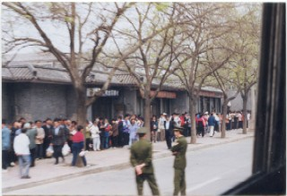
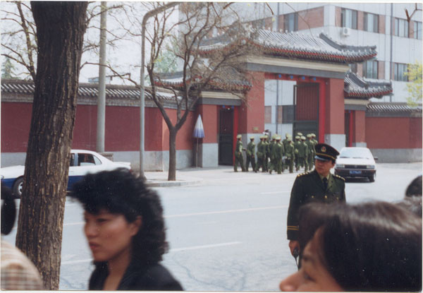
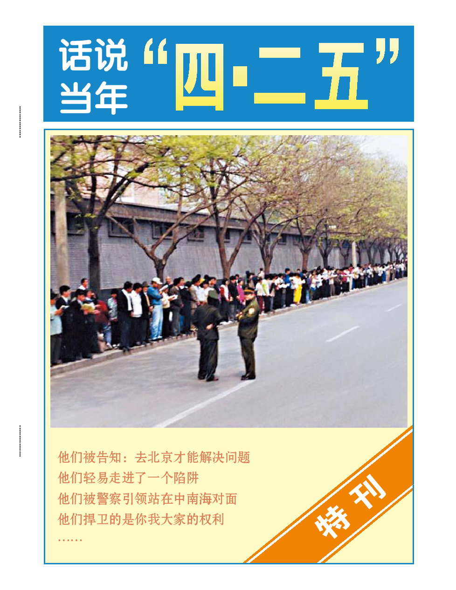

<h1 align="center"><b>“四•二五”上访真相</b></h1>

<a href=https://git.io/01><h6 align="right">回首頁</h6></a>
	
<TABLE border="1">

<TR>
<TD align="center"><b> <a href="https://github.com/gofanben/gm/blob/master/goal.mdhttps://github.com/gofanben/gm/blob/master/goal.md"><h2>《九评》编辑部新书——《共产主义的终极目的——中国篇》</a></h2>
 
共产主义来自何处？为什么宇宙中会冒出个共产党？共产主义的本质究竟是什么？结局又会怎样？对这些根本问题的答案，人们众说纷纭，现在是揭开谜底的时候了。</b></td>
</TR>
<TR>
<TD>下载全书：<a href="https://github.com/gofanben/gm/blob/master/epub/JPN-S-V2-171216.pdf?raw=true">PDF简体版</a>，<a href="https://github.com/gofanben/gm/blob/master/epub/JPN-T-V2-171216.pdf?raw=true">PDF正体版，<a href="https://github.com/gofanben/gm/blob/master/epub/JPN-S-V2-171216D.docx?raw=true">WORD简体版</a>，<a href="https://github.com/gofanben/gm/blob/master/epub/JPN-T-V2-171216D.docx?raw=true">WORD正体版</a>，<a href="https://github.com/gofanben/gm/blob/master/epub/Tekan_V24_P32_GB.pdf?raw=true">PDF高清杂志简体版</a>，<a href="https://github.com/gofanben/gm/blob/master/epub/Tekan_V24_P32_TC.pdf?raw=true">PDF高清杂志正体版，<a href="https://github.com/gofanben/gm/blob/master/epub/JPN-S-V2-171216D-2018-0326update.zip?raw=true">简体字TXT文本</a>，
	<a href="https://github.com/gofanben/gm/blob/master/epub/JPN-T-V2-171216D-2018-0326update.zip?raw=true">正体字TXT文本</a>  </TD>
</TR>
<TR>
<TD>下载：<a href="https://github.com/gofanben/gm/blob/master/epub/gbUltiGoalCmChina.epub?raw=true">epub简体版电子书</a>，<a href="https://github.com/gofanben/gm/blob/master/epub/twUltiGoalCmChina.epub?raw=true">epub正体版电子书，<a href="https://github.com/gofanben/gm/blob/master/epub/goalmp3Npr.epub?raw=true"> (音频全书-实体镶崁) epub 下載，
	<a href="https://github.com/gofanben/gm/blob/master/epub/goal8K.zip?raw=true">希望之声声音档(mp3)，<a href="https://github.com/gofanben/gm/blob/master/epub/goalmp4Npf.epub?raw=true">视频(链接)播报版 epub 下载</a>，<a href="https://github.com/goodabc/GCC/blob/master/zjmd.md"> 12集(实体镶崁mp4播报版) epub 下載</a></TD>
</TR>
<TR>
<TD><a href="https://git.io/epubc"><b>手机、电脑打开 epub 电子书方法介绍。下载更多的免费(視頻、音頻、圖文) epub 电子书。</b></a></TD>	
</TR>

</TABLE>

<a href="https://github.com/3fmd/gm/blob/master/ffq.md">
	

 

<a href="https://github.com/gofanben/gm/blob/master/epub/425--1.epub?raw=true">“四．二五”中南海万人上访真相(1) epub 电子书下载</a> 
<a href="https://github.com/gofanben/gm/blob/master/epub/425-20180524.epub?raw=true">“四．二五”中南海万人上访真相(2) epub 电子书下载</a>

<h1 align="center"><b>明慧专题：“四•二五”上访真相</b></h1>

<b>一九九九年四月二十五日，逾万名法轮功学员到北京的国务院信访办公室上访，要求当局释放此前在天津被当地警察暴力抓捕的四十五名法轮功学员，同时要求当局允许法轮功的书籍合法出版，并给予法轮功修炼民众一个合法的炼功环境。</b>

<b>四•二五上访，是法轮功学员在中共迫害升级的情况下，不得已采取的合理合法的反迫害举动。</b>

<b>四•二五上访，展示了法轮功学员和平理性的境界，展示了他们维护正义良知的道德勇气。</b>

  
<h1 align="center"><b>“四•二五”上访：中共迫害在先 法轮功依法上访在后</b></h1>

一九九九年四月二十五日，逾万名法轮功学员行使宪法赋予的上访权利，集体到位于中南海附近的国务院信访办公室上访，要求释放此前在天津被当地警察无理抓捕的四十多名法轮功学员，并允许合法出版法轮功书籍。

中共江泽民集团为迫害法轮功，把法轮功学员的依法上访诬陷为“闹事”、“围攻中南海”，这完全是栽赃陷害。法轮功学员的上访极其和平理性，既没有大声喧哗，更没有阻塞交通。对中南海，他们既没有“围困”，更没有“攻击”，他们只是依法集体到信访办公室上访，而该办公室在中南海附近。

中共把法轮功学员和平上访污为“闹事”是倒打一耙，闹事的恰恰是中共。是因为中共迫害在先，才有法轮功学员依法上访在后。宪法第41条规定：“公民对于任何国家机关和国家工作人员，有提出批评和建议的权利”。

中共对法轮功的打压在一九九六年就已经开始。一九九六年六月十七日《光明日报》发表评论文章，诋毁法轮功。《光明日报》不是一个正常的民间媒体，而是中共喉舌。中共的历次整人斗人的运动都是从喉舌媒体的批斗抹黑开始。

一九九六年七月二十四日，中共中央宣传部下属新闻出版署向全国各省市新闻出版局下发内部文件，禁止出版发行《转法轮》、《中国法轮功》等法轮功书籍。《转法轮》等书籍都是教人向善的，很多人通过修炼法轮功，阅读《转法轮》等书籍，提升了自己的道德，诸恶莫做，诸善奉行。中共允许诲淫诲盗、厚黑权谋的书籍在社会上大行其道，却下令禁止教人向善的《转法轮》出版。

一九九七年初中共政法委书记罗干指使公安部以先定罪、后调查的方式，在全国搜罗罪证欲构陷法轮功。全国各地公安局调查后均上报反映“尚未发现问题”，调查就此停止。法轮功修炼来去自由，没有组织，不介入政治，炼功点不存钱、不存物，法轮功学员都在做好人，可是罗干等一些权欲熏心的人，在没有任何证据的情况下，给法轮功扣上了“×教”的大帽子，并让各地公安人员罗织罪证，试图弄出个大案，捞取政治资本。

一九九八年五月北京电视台《北京特快》栏目利用该台记者在北京玉渊潭法轮功炼功点采访炼功学员时的镜头，播放何祚庥对法轮功的诽谤。何祚庥是罗干的连襟，名为院士，却没有任何学术上的建树，此人居然能把量子力学和所谓的“三个代表”扯上关系，真是一个让科学蒙羞的科痞。何祚庥对法轮功的攻击，所用的例子和法轮功没有关系，是指鹿为马，栽赃陷害。

该节目播出后，北京及河北数百名法轮功学员以写信或直接造访电视台的方式，讲述亲身经历，指出节目内容与事实不符、误导观众。一九九八年六月二日，北京电视台在了解情况后，承认上次关于法轮功的节目失误，播放了一个表现法轮功学员清晨在公园里祥和的炼功场面及其他人士一同晨练的正面节目。

在北京被揭穿后，何祚庥不甘心，继续寻衅滋事。一九九九年四月十一日，科痞何祚庥又在天津教育学院的《青少年科技博览》杂志上发表文章，再次引述一九九八年在北京电视台用过的已被证明为不实的例子诽谤法轮功。该文章在天津发表后，天津的一些法轮功学员认为有必要向有关方面澄清事实真相。四月十八日至二十四日，部份法轮功学员前往天津教育学院及其它相关机构反映实情。在此过程中，法轮功学员非常平静、祥和，向杂志编辑和秘书讲述了他们通过修炼法轮功身心受益的事实。

然而四月二十三、二十四日，天津市公安局突然动用防暴警察殴打反映情况的法轮功学员，导致有的法轮功学员流血受伤，四十五人被抓捕。

当法轮功学员请求放人时，在天津市政府被告知，公安部介入了这个事件，如果没有北京的授权，被抓捕的法轮功学员不会得到释放。天津公安向法轮功学员建议：“你们去北京吧，去北京才能解决问题。”天津市政府的反常态度和警察的毫无顾忌，使人们明显感到一股来自中共高层的压力。

四月二十五日，上万名法轮功学员自发来到中南海附近的国务院信访办上访，行使宪法赋予公民的上访权利。

当时的总理下令天津警察放人，重申了不会干涉群众炼功的政策。当晚十点，学员们静静离去。整个上访过程秩序井然，离开后地上无一片纸屑，连警察扔的烟头都被上访学员清扫干净。

由上可见，四•二五上访之所以发生，完全是中共在不断地打压迫害，而法轮功学员只是本着善意和平的去讲理，以合法的方式制止从一九九六年就开始的中共的迫害。即使没有四•二五，中共这样一个与民为敌的邪党和江泽民这样一个嫉妒成性的独裁小丑还是会寻衅发动迫害。中共的本性就是“假、恶、斗”，中共的历史就是一部内斗外整的历史。从它的出生到今天，中共对中国人的迫害从未停歇。

<h1 align="center"><b>四•二五上访的直接原因：天津警察抓人打人，拒不放人</b></h1>

  
  <b>一九九九年四月十一日，当时的中共政法委书记罗干的连襟何祚庥在天津教育学院办的《青少年科技博览》杂志上发表文章，无中生有诋毁法轮功。四月十八日至二十四日，部分天津法轮功学员前往天津教育学院及相关机构反映实情。四月二十三日、二十四日，中共政法委书记罗干命令天津市当局出动防暴警察三百多名，驱散并殴打澄清事实的法轮功学员，并逮捕了四十五名法轮功学员。法轮功学员到天津市政府要求放人，被告知：公安部介入了这个事件，你们去北京才能解决问题。</b>

  
<h1 align="center">引发四•二五上访的天津事件简述</b></h1>
四•二五上访的直接起因是天津警察殴打、抓捕法轮功学员并拒绝放人，法轮功学员不得已依法到北京国务院信访办公室上访。

一九九九年四月十一日，何祚庥在天津教育学院办的《青少年科技博览》杂志上发表题为“我不赞成青少年练气功”的文章，该文章引用不实的事例，用诬陷的手法，指名攻击法轮功，丑化法轮功修炼者的形象，诬蔑法轮功创始人。

何祚庥是中共政法委书记罗干的连襟，名为院士，却没有任何学术上的建树，是一个依附政治的文人。在此之前，何祚庥就曾在北京电视台的节目中用一个和法轮功没有关系的例子诋毁法轮功，北京的法轮功学员指出了其错误，北京电视台也承认了失误。可是此次何祚庥再次利用这个不实的事例诬陷法轮功。

中国的媒体都是被中共当局控制的，中共历次迫害民众的政治运动都是由依附政治的文人在官方媒体批判、抹黑开始。在中共统治的中国，法轮功学员没有任何公开发言辩诬的渠道。何祚庥的文章发表后，天津的一些法轮功学员认为有必要向有关方面澄清事实真相，并期望通过与杂志编辑部的交涉来消除该文章的恶劣影响。因此，四月十八日至二十四日，一些法轮功学员前往天津教育学院及其它相关机构反映实情。

到天津教育学院反映情况的法轮功学员非常和平、理性。为了保持良好的秩序，他们自觉的保持安静，不喧哗，不随意走动。他们留出通往学院各个角落的通道，校门外也有法轮功学员义务维持秩序。

天津法轮功学员到教育学院如实反映情况以及其后的四•二五上访，完全是合法的。宪法第41条规定：“公民对于任何国家机关和国家工作人员，有提出批评和建议的权利；对于任何国家机关和国家工作人员违法失职行为，有向有关国家机关提出申述，控告或者检举的权利，但是不得捏造或者歪曲事实进行诬告陷害。”

可是在一九九九年四月二十三、二十四两日，中共政法委书记罗干命令天津市公安局出动防暴警察三百多名，殴打反映情况的法轮功学员，导致有的法轮功学员流血受伤，四十五人被抓捕。

当法轮功学员请求放人时，他们在天津市政府被告知，公安部介入了这个事件，如果没有北京的授权，被逮捕的法轮功学员不会得到释放。天津公安向法轮功学员建议：“你们去北京吧，去北 京才能解决问题。”

迫害的严重升级引发了法轮功学员的关注，各地法轮功学员纷纷通过上访国务院信访办的途径来寻求“天津事件”的公正解决。

<h1 align="center"><b>天津事件之前中共的打压迫害</b></h1>

  
<b>中共对法轮功的打压在一九九六年就已经开始。一九九六年六月十七日《光明日报》发表文章诋毁法轮功。一九九六年七月二十四日，中共中央宣传部下属新闻出版署向全国各省市新闻出版局下发内部文件，禁止出版发行《转法轮》、《中国法轮功》等书籍。一九九七年初中共政法委书记罗干指使公安部以先定罪、后调查的方式，在全国搜罗罪证欲构陷法轮功。一九九八年五月北京电视台《北京特快》栏目播放何祚庥对法轮功的诽谤。</b>

<h1 align="center"><b>天津事件之前中共就一直在打压迫害法轮功</b></h1>

天津警察抓人打人事件是引发一九九九年四•二五上访的直接起因，但是中共对法轮功的打压在一九九六年就已经开始。法轮功学员四•二五上访，是为了阻止迫害的进一步升级的努力。

一九九六年六月十七日《光明日报》发表评论文章，诋毁法轮功。

一九九六年七月二十四日，中宣部管辖的新闻出版署向全国各省市新闻出版局下发内部文件，禁止出版发行当时名列北京十大畅销书的《转法轮》、《中国法轮功》等法轮功书籍。

一九九七年初，中共政法委书记罗干指示公安部在全国进行调查，网罗罪证欲诬陷法轮功为×教。全国各地公安局经充份调查后均上报反映“尚未发现问题”，调查不了了之。一九九八年七月公安部一局发出公政[1998]第555号《关于对法轮功开展调查的通知》。《通知》中先把法轮功诬陷为×教，紧接着又提出：要掌握活动内幕情况，发现其违法犯罪的证据，各地公安政保部门要深入开展调查。

罗干当时发的文件明显带有构陷的性质，先是诬陷法轮功是×教，然后让各地公安去搜集证据，等于“先定罪，后调查”。当时陆续有公安、统战部和特工到法轮功的炼功点上学功，并和学员一起学习《转法轮》，其实都是去卧底。但是法轮功无底可卧，因为法轮功学员的一切活动都是公开的，而且来去自由，谁愿意来炼都行，不愿意了就走，既没有人员登记，也没有会费。很多卧底人员倒因此机缘而对法轮功有了深刻了解，反而成为坚定的学员。令罗干吃惊的是，在全国各地，一条法轮功的罪证都没有搜集到。

但罗干的两次“调查”还是在一些地区造成了严重后果。

如：辽宁省朝阳市公安局，向所属公安部门发出了朝公发（1998）37号《关于禁止法轮功非法活动的通知》，有的辅导员被数次罚款，累计金额达四千多元。有的不给收据单，有的只给白条。由此引起四十余人到公安部上访，一千余人联名投诉朝阳公安局侵害公民合法权益的违法行为。

一九九八年七月二十一日，公安部一局又向全国公安部门发出《通知》，再度引发新疆、黑龙江、河北、福建等地基层公安部门强行驱散炼功民众，非法抄家，私闯民宅，没收属于个人的私有财产等违法乱纪问题。

罗干在一九九七、一九九八年两次想把法轮功诬为×教进行迫害。这倒不是因为法轮功做错了什么，而是罗干那时当了中央政法委书记，官儿坐到头了，要想继续往上升，就必须做出大动作来。罗干想把水搅浑，这样他这个政法委书记才能成为政治焦点。

罗干搜集不到资料也很着急。他发现公安部这些负责气功的人都很懂气功，很多人自己也练气功。罗干在一九九六年开始为此特意改组公安部，不但把编制改了，原来管气功和懂气功的人一律调走，为下一步打压法轮功铺路。

一九九八年五月北京电视台《北京特快》栏目利用该台记者在北京玉渊潭法轮功炼功点采访炼功学员时的镜头，播放何祚庥对法轮功的诽谤。何祚庥是中共政法委头目罗干的连襟，名为院士，却没有任何学术上的建树，此人居然能把量子力学和所谓的“三个代表”扯上关系，真是一个让科学蒙羞的科痞。何祚庥对法轮功的攻击，所用的例子和法轮功没有关系，是指鹿为马，栽赃陷害。

该节目播出后，北京及河北数百名法轮功学员以写信或直接造访电视台的方式，讲述亲身经历，指出节目内容与事实不符、误导观众。一九九八年六月二日，北京电视台在了解情况后，承认上次关于法轮功的节目失误，播放了一个表现法轮功学员清晨在公园里祥和的炼功场面及其他人士一同晨练的正面节目。

一九九八年下半年，以乔石为首的部份全国人大离退休老干部，根据大量民众来信反映公安非法对待法轮功炼功民众的问题，对法轮功进行了一段时间的详细调查、研究，得出“法轮功于国于民有百利而无一害”的结论，并于年底向江泽民为首的政治局提交了调查报告。可是，乔石等老干部的结论和当时的总理朱镕基在四•二五事件中的开明做法，却引发了独裁者江泽民的不满。而法轮功创始人的巨大的道德感召力更是令江泽民妒嫉，于是这个独裁小人在一九九九年七月二十日丧失理智的发动了对法轮功的迫害。

由此可见，中共内部的恶势力一直企图寻衅迫害法轮功，即使没有四•二五上访，以中共及其头目江泽民的邪恶本性，也会制造事端发动对法轮功的迫害。四•二五上访，是法轮功学员阻止迫害全面暴发的一次努力，他们是在维护按法轮功所教导的“真善忍”做好人的权利，维护正义和良知。

<h1 align="center"><b>四•二五上访法轮功学员的三点诉求</b></h1>

<b>一.释放被非法抓捕的天津法轮功学员</b> 
<b>二.允许法轮功书籍合法出版</b> 
<b>三.合法的炼功环境</b>

  
二十五日早八点十五分左右，当时的总理朱镕基一行人从国务院正门（西门）出来走过马路来到上访法轮功学员的面前。学员中响起了掌声。朱总理问：“你们干什么来了？谁叫你们来的？”

有许多学员说：“我们来反映法轮功的问题，没有人组织。”朱总理又问：“为什么不写信上访？怎么这么多人都在这儿？”
很多法轮功学员都在回答，有的学员说：“信都写的成麻袋了，还没得到回应。”朱总理说：“我对你们的问题有批复。”学员说：“我们没有收到。”（中共内部的政治打手阻挠所致）。总理让选几个代表进去进一步说明情况。

四月二十五日中午时分，法轮大法研究会的两位法轮功学员和其他三位北京学员作为代表进入国务院同政府官员会谈，申诉了法轮功学员的三点要求：

一.释放被非法抓捕的天津法轮功学员 
二.允许法轮功书籍合法出版 
三.合法的炼功环境

政府官员轮流参加会谈的有国务院信访办的负责人，北京市的负责人，还有天津市的负责人。朱镕基很快下令天津公安局放人，重申了国家不会干涉群众炼功的政策。傍晚时分，天津按照中央指示释放了所有被关押的法轮功学员。随即，法轮功学员们静静离去，整个过程平静祥和，秩序井然。

需要说明的是：因为国务院信访办的位置就在中南海的西门，否则法轮功学员根本就不会去中南海附近。可是一九九九年七月迫害开始后，中共媒体却造谣说是“冲击中南海”，这明显是为迫害法轮功制造借口。

法轮功学员上访是行使宪法赋予公民的权利。宪法第41条规定：“公民对于任何国家机关和国家工作人员，有提出批评和建议的权利”。

法轮功学员提出的三点要求，第一点是因为天津警察抓人打人，后两点是因为在天津事件之前中共对法轮功的打压和迫害。法轮功学员提出的要求合情合理合法。他们是在维护信仰“真善忍”的权利，维护做好人的权利，他们也是在维护所有中国人的权利，维护中国社会的正气。
<h1 align="center"><b>四•二五上访现场</b></h1>

<b>● 和平、理性的上访人群，上访学员秩序井然</b> 
<b>● 警察放松地闲聊，无任何压力</b> 
<b>● 上访学员把盲道让出来，不影响行人，不阻碍交通</b> 
<b>● 上访学员没有口号、标语，静静地站着</b> 
<b>● 上访学员离开时，把垃圾都打扫干净</b> 
  
<h1 align="center"><b>历史照片：1999年4月25日法轮功万人大上访</b></h1>
文: 99年4.25事件见证人（现居德国）

【明慧网二零零九年五月四日】我在北京出生和长大，1999年4月25日我在场。我把一些以前没有公布的照片公布出来，还4.25历史真相。
<table border="0" cellspacing="3" cellpadding="3">
<tbody>
<tr>
<td align="center"></td>
</tr>
<tr>
<td align="center">1999年4月25日当天，在由北向南通过府右街行驶的公共汽车上所摄（通过车厢后窗取景）。照片左侧为上访的法轮功学员，右侧红墙为中南海。法轮功学员与中南海之间为府右街。</td>
</tr>
</tbody>
</table>

<table border="0" cellspacing="3" cellpadding="3">
<tbody>
<tr>
<td align="center"></td>
</tr>
<tr>
<td align="center">站在府右街北口，从北向南取景。照片右侧为上访的法轮功学员，左侧为中南海围墙。法轮功学员与中南海之间为府右街。横在府右街北口封锁路口的是一些便衣警察和着制服警察。</td>
</tr>
</tbody>
</table>

<table border="0" cellspacing="3" cellpadding="3">
<tbody>
<tr>
<td align="center"></td>
</tr>
<tr>
<td align="center">站在府右街北口，从北向南取景。照片右侧为上访的法轮功学员，左侧为中南海围墙。法轮功学员与中南海之间为府右街。横在府右街北口封锁路口的是一些便衣警察和着制服警察。</td>
</tr>
</tbody>
</table>

<table border="0" cellspacing="3" cellpadding="3">
<tbody>
<tr>
<td align="center"></td>
</tr>
<tr>
<td align="center">站在府右街北口，从北向南取景。照片右侧为上访的法轮功学员，左侧为中南海围墙。法轮功学员与中南海之间为府右街。横在府右街北口封锁路口的是一些便衣警察和着制服警察。</td>
</tr>
</tbody>
</table>

<table border="0" cellspacing="3" cellpadding="3">
<tbody>
<tr>
<td align="center"></td>
</tr>
<tr>
<td align="center">站在府右街北口，从北向南取景。照片右侧为上访的法轮功学员，左侧为中南海围墙。法轮功学员与中南海之间为府右街。横在府右街北口封锁路口的是一些便衣警察和着制服警察。</td>
</tr>
</tbody>
</table>

<table border="0" cellspacing="3" cellpadding="3">
<tbody>
<tr>
<td align="center"></td>
</tr>
<tr>
<td align="center">站在府右街北口，从北向南取景。照片右侧为上访的法轮功学员，左侧为中南海围墙。法轮功学员与中南海之间为府右街。横在府右街北口封锁路口的是一些便衣警察和着制服警察。</td>
</tr>
</tbody>
</table>

<table border="0" cellspacing="3" cellpadding="3">
<tbody>
<tr>
<td align="center"></td>
</tr>
<tr>
<td align="center">站在府右街西侧便道上的上访的法轮功学员（以前没发表过）</td>
</tr>
</tbody>
</table>

<table border="0" cellspacing="3" cellpadding="3">
<tbody>
<tr>
<td align="center"></td>
</tr>
<tr>
<td align="center">站在府右街西侧便道上的上访的法轮功学员（以前没发表过）</td>
</tr>
</tbody>
</table>

<table border="0" cellspacing="3" cellpadding="3">
<tbody>
<tr>
<td align="center"></td>
</tr>
<tr>
<td align="center">站在府右街西侧便道上的上访的法轮功学员（以前没发表过）</td>
</tr>
</tbody>
</table>

<table border="0" cellspacing="3" cellpadding="3">
<tbody>
<tr>
<td align="center"></td>
</tr>
<tr>
<td align="center">站在府右街西侧便道上的上访的法轮功学员（以前没发表过）</td>
</tr>
</tbody>
</table>

<table border="0" cellspacing="3" cellpadding="3">
<tbody>
<tr>
<td align="center"></td>
</tr>
<tr>
<td align="center">站在府右街西侧便道上的上访的法轮功学员（以前没发表过）</td>
</tr>
</tbody>
</table>

<table border="0" cellspacing="3" cellpadding="3">
<tbody>
<tr>
<td align="center"></td>
</tr>
<tr>
<td align="center">站在府右街西侧便道上的上访的法轮功学员</td>
</tr>
</tbody>
</table>

<table border="0" cellspacing="3" cellpadding="3">
<tbody>
<tr>
<td align="center"></td>
</tr>
<tr>
<td align="center">站在府右街西侧便道上的上访的法轮功学员</td>
</tr>
</tbody>
</table>

<table border="0" cellspacing="3" cellpadding="3">
<tbody>
<tr>
<td align="center"></td>
</tr>
<tr>
<td align="center">站在府右街西侧便道上的上访的法轮功学员</td>
</tr>
</tbody>
</table>

<table border="0" cellspacing="3" cellpadding="3">
<tbody>
<tr>
<td align="center"></td>
</tr>
<tr>
<td align="center">站在府右街西侧便道上的上访的法轮功学员（从西向东取景。照片上方为中南海一西侧门）</td>
</tr>
</tbody>
</table>
<h1 align="center"><b>四•二五上访现场：和平理性的典范</b></h1>
一九九九年四月二十五日，上万法轮功民众汇集到国家信访局所在的府右街附近。尽管人数众多，人群却出奇的安静，没有口号，没有标语，秩序井然，对当地居民的生活没有造成任何影响。而维持治安的警察这时候也觉得没什么事可做而开始闲聊。

从当时的中央电视台新闻画面和现场照片都可以看到，上访群众的身后，并不是中南海特有的红色围墙（见图）；而和上访群众隔街相望的才是中南海的红色围墙，以及中南海西门。众所周知，中南海的正门是面向长安街上的新华门。事实上，四月二十五日在长安街上并没有上访群众聚集。人群主要分布于府右街和西安门大街，并且无人聚集在中南海红色围墙的一侧。也就是说，民众没有「围」住中南海，更没有发生所谓「冲击」事件。事实上，如果发生了“冲击中南海”这样的政治大事，警察绝不会如此悠闲的在一边闲聊

<table border="0" cellspacing="3" cellpadding="3">
<tbody>
<tr>
<td align="center"></td>
</tr>
<tr>
<td align="center">执勤的警察在闲聊（注意群众身后不是紫禁城特有的红色围墙）</td>
</tr>
</tbody>
</table>

<table border="0" cellspacing="3" cellpadding="3">
<tbody>
<tr>
<td align="center"></td>
</tr>
<tr>
<td align="center">和上访群众隔街相望的是中南海西门（这里可以看到紫禁城的红色围墙）</td>
</tr>
</tbody>
</table>  

据在当时的现场的法轮功学员回忆，上访的人群平和而自律：

“路口有学员在自动维持秩序，疏通道路，一遍遍地重复：请自行车和行人不要在此停留！”

“大家静立着，微笑而平和。不交谈也不扎堆，也不和路人搭话。有人好奇，会停下来问：这是怎么回事啊？大家只是微笑，友好地劝他不要停留。因为一句两句说不清楚，如果一个人交谈就会围上来一大堆，事情就会起变化……”

“大家都站在行人道上，马路上汽车和自行车畅通无阻，只有警察在马路上来回走动，并不时与学员聊天……即使那么多人有两顿饭就地吃，没有一个人乱扔垃圾，全留在自己的包里。有一些学员拎着塑料袋拣大家不慎掉下的垃圾。一天下来，地上真的没有一张纸片，一点脏物。大家这么做，没有人动员，没有人组织，全凭自觉，其实那是炼功人特有的修养和内涵。”

当天，总理朱镕基接见了法轮功学员代表。

据当事的法轮功学员、原中国广东省政协委员、华南理工学院轻工食品学院的院长高大维回忆：“大概十点多吧，就是朱镕基总理到机场去送外宾，那么一下看到那么多学员就叫工作人员下去了解情况，那么朱总理当时带了话，他到送完外宾以后，会回来接见我们的代表，了解详细的情况。法轮功学员的代表提出了我们的三点诉求：第一点是释放在天津被非法抓捕的所有学员；第二点是为广大法轮功群众提供一个合法、合理的修炼环境；第三个就是允许出版法轮功的有关的书籍。”

朱镕基很快下令天津公安局放人，重申了国家不会干涉群众炼功的政策。

另一位当时学员、清华大学炼功点的法轮功学员杨清回忆说，“四•二五的晚上，大约九点多钟呢，进去的代表出来了，出来告诉大家要有什么意见可以向各地的信访部门反映，国务院会把这些意见进行处理，当时听到这些消息以后就觉得呢，领导上能做到这一点我们也就满意了。”

在国务院工作人员和法轮功代表会谈之际，上万名学员一直在外静静等候。到晚上八点多，会谈完毕，在得知天津方面已经释放被捕的法轮功学员后，中南海前的法轮功学员也很快散去，临行时，地上清理的干干净净，一片碎纸都没有留下，连警察扔下的烟头都捡走了。整个过程，平静祥和，一个当时维持秩序的警察对周围的人说，你们看看，这就是德！

现居荷兰的朱女士谈到当年荷兰媒体的报导时说：“我们荷兰有一个记者在四•二五当天亲自到中南海采访法轮功学员。在采访上访法轮功学员的时候他写道：这是一支品德高尚的队伍，并把《转法轮》称为蓝色经书，他在后面写道，他们（法轮功学员）有神的纪律，走后地上没有留下任何脏东西。”

可以说，法轮功学员真诚的善心，以及高度克制、处处为他人考虑的道德修养，消弭了罗干等人蓄意制造的潜在冲突。 四•二五事件在当天和平解决。

<h1 align="center"><b>中共江泽民集团发动迫害是其邪恶本质所致</b></h1>

<b>以伪造出身、镇压六四学生起家的中共头子江泽民出于恐惧，加之嫉妒朱镕基因合理处理此事得到的赞誉，不顾其他六个政治局常委的反对，执意要迫害法轮功。一九九九年七月二十日，中共开始全面迫害法轮功，实施“名誉上搞臭、经济上截断、肉体上消灭”、“打死算自杀”等灭绝政策；全国媒体铺天盖地的编造和散布各种谎言，如同文革再现；一时间，神州大地血雨腥风。</b>

四•二五展示了法轮功修炼者的和平善良，广大法轮功修炼者对“真善忍”的坚信展示了法轮功创始人的巨大的道德感召力。而当时的总理朱镕基对此事的开明处理获得海内外的赞誉。这些都让汉奸出身、通过镇压六四学生起家的中共独裁者江泽民感到恐惧、嫉妒，强烈的妒嫉和恐惧使他失去了理智。

四月二十五日当晚，江泽民在没有征求任何人意见的情况下，模仿毛泽东发动文化大革命“炮打司令部”的做法，给政治局全体人员写了一封信。江在信中假装忧心忡忡地说：“难道我们共产党人所具有的马克思主义理论，所信奉的唯物论、无神论，还战胜不了法轮功所宣扬的那一套东西吗？”可见江泽民发动迫害的原因，绝不是法轮功做错了什么，而是因为法轮功教导“真善忍”的道德感召力。这封信随后被中央办公厅作为通知内部印发，并特别注明：请注意中央办公厅的通知要求的是：学习贯彻落实，不是征求意见、或讨论研究。

为了确保在政治局中推动这场计划中的大规模政治迫害，江泽民于六月七日又在中央政治局会议上就此讲话，该讲话于六月十三日在中共内部秘密传达。丧失理智的江泽民不顾其他六个政治局常委的反对，执意要迫害法轮功。

一九九九年六月十日，江泽民成立了所谓的“处理法轮功问题领导小组”，由李岚清任组长，罗干、丁关根任副组长，从中共中央到各级党委，都设立了所谓的“处理法轮功问题领导小组”，因其设立时间又叫“六一零办公室”。这是个类似文革时的革委会或纳粹时的盖世太保的恐怖组织，遍布各地各级政府，耗费纳税人的血汗钱，凌驾于法律之上，在各地操纵公检法、劳教所、监狱，并设立洗脑班，残害善良的法轮功学员，在过去十五年来臭名昭著、罪恶累累。

一九九九年六月十四日，中央信访办和国务院信访办公告在中国大陆的报纸、电台和电视台同时播出，表示从来都没有禁止任何功派。江泽民一伙一方面密谋迫害，一方面却以释放烟幕掩盖其犯罪企图。当时中共山东省官员在六月下旬就称两办公告是「缓兵之计」。

一九九九年七月二十日，中共江泽民集团开始全面迫害法轮功，实施“名誉上搞臭、经济上截断、肉体上消灭”、“打死算自杀”等灭绝政策；全国媒体铺天盖地的编造和散布各种谎言，如同文革再现。一时间，神州大地血雨腥风。

四•二五事件只是中共江泽民集团迫害法轮功的一个借口。在四•二五上访之前，中共内部的恶势力就一直在寻衅迫害法轮功，直接导致四•二五发生的天津抓人打人事件就是这样的一个事例。以中共及其独裁者江泽民的邪恶本性，即使没有四•二五，中共江泽民一伙也会找其它借口发动迫害，中共的“假恶斗”必然会与“真善忍”为敌，中共和江泽民集团也必然在迫害“真善忍”中丧尽民心，走向灭亡，历史正在见证着这一切。

法轮功修炼者不参与政治，对政权没有任何兴趣，也不会玩弄任何权谋。他们四•二五上访，是堂堂正正的维护道义良知。四•二五上访所展现的和平理性和无私无畏，一直贯穿于法轮功学员十五年反迫害、讲真相的历程中。四•二五上访所展示的道德勇气是中国社会道德回升的希望，是中国未来的希望。

<h1 align="center"><b>明慧期刊：话说当年四二五（2017年10月8日更新）</b></h1>

  
目　录

◎前言 
◎历史回顾　　　（一）媒体报道　各界褒扬 
　　　（二）多方调查　福益社会 
　　　（三）风云突变　山雨欲来 
　　　（四）阴谋迫害　颠倒是非 
　　　（五）反映情况　和平上访 
　　　（六）小丑嫉妒　黑云压城 
　　　（七）外松内紧　发动迫害 
◎世道民心　　　各界看“四•二五” 
◎走出误区　　　“四•二五”上访是“搞政治”吗？ 
　　　“四•二五”万人上访人数多吗？ 
　　　“四•二五”上访，是谁在违法？ 
　　　“四•二五”上访与你我无关吗？ 
◎世界聚焦　　　自焚真相 
　　　这个星球上前所未有的邪恶 
◎法网在收　　　“四•二五”事件的指挥者遭报死亡 
　　　迫害法轮功的中共高官难逃法网 
　　　中共必遭天谴 
◎大法弘传　　　“四•二五”开启了修炼机缘 
　　　法轮大法弘传世界 
　　　按中国法律——法轮功也是合法的 
◎结语　　　为自己选择美好的未来 
　　　封底图片：法轮功学员纽约盛大游行 

<a href="https://github.com/gofanben/gm/blob/master/epub/425-print-2in1.zip">下载打印版（6.4MB）</a> 
<a href="https://github.com/gofanben/gm/blob/master/epub/425-read-2in1.zip">下载阅读版（6.4MB）</a> 

更新内容： 
从新理顺文章排列顺序，并从新排版。增加了1、修炼法轮功合法，2、法轮功书籍解禁，3、诉江内容，4、不用翻墙得真相的方法修改了错误，第2页，上海电视台报道的时间错误，配图上的时间错误，其中12月改为11月。更新了相关数据。修改了一些具体用词，使之更严谨。
（发稿日期： 2013年10月25日）

<h1 align="center"><b>我的一九九九年四月二十五日那天</b></h1>
【明慧网二零一七年四月二十五日】一九九九年四月二十五日的时候，我才二十七岁，刚刚走進法轮大法修炼中不到两个月。那时对大法是什么还很懵懂，只觉得我可以修炼了，可以象唐僧一样有修炼的机缘了，那时的我心中充满了得法的喜悦。
那时的北京在早晨晨练时，到处是大法弟子集体炼功。每当星期天时，我就近的中关村大操场上参加集体炼功的人特别多，这些对于一个刚刚得法的我，确实是一种震撼。即使是这样，我仍能感受到当时江泽民政权对法轮功已是虎视眈眈。

四月二十四日的晚上，集体学法时（那时每天晚上七点集体学习《转法轮》一讲），我们的辅导员在学法小组上说：“天津昨天抓了很多法轮功学员，明天我要到中南海去上访去，你们还有谁去？”当时的同修都没说话，我说，我和你去。

第二天早上四点多，我们俩骑着自行车从海淀出发，来到中南海的墙外时还没到六点。因为还没到上班的时间，路上的行人比较少，路口有两个执勤的警察很悠闲的准备着换岗。我们到的时候，几乎没有法轮功学员，那天的天气有点阴天，但北京的气候已是很暖和了。

<table border="0" cellspacing="3" cellpadding="3">
<tbody>
<tr>
<td align="center"></td>
</tr>
<tr>
<td align="center">一九九九年四月二十五日逾万名法轮功学员在北京和平上访</td>
</tr>
</tbody>
</table>

到那后我们四周走走，在中南海的西门停了下来，因为早起没吃饭，我在胡同里的小摊上买了一份凉皮充饥，到了七、八点钟不断的有人来到中南海的大墙外，后来我才知道，他们也是法轮功学员，都是来上访的。人越来越多，警察开始出现了，我看到我所在的西门外马路两边都站有大法弟子。警察把靠近中南海墙边的学员领到了马路这边来。因为人多，人行道上站满了人，有人主动出来建议，能不能把盲道让出来，我们大家把盲道让开，多余的人都向远处延伸。可是人越来越多，后来盲道上也站满了人，但是不管有多少人，马路上一直是交通正常，只是后来多了一排站在路上拦着学员的警察。

因为站立的比较久，一些年纪大的学员就在里面席地而坐，年纪轻的就站在外面。到了近傍晚时，北海那边马路的人行道上都站满了学员。警察的对讲机中不断的传来怎么处置我们这些学员的一些对话，不断的渲染着紧张气氛。

因为我年轻，所以一直站在前面。使我感到震撼的是：在学员当中有白发苍苍的老人，有即将生小孩的孕妇，还有抱着婴儿的年轻女子。身边有人拿着塑料袋，不断的问：有垃圾吗？我们把垃圾放到塑料袋里，地面上一直都很干净。周围居民的公共厕所内，刚开始因为人多，有些脏，很快有学员用厕所里的扫帚把厕所打扫的干干净净。其实对于象我这样一个对大法了解不是很深的新学员，参加四二五是对我的一个精神的洗礼，让我更加了解到法轮大法的至善至美，让我以自己是一个大法弟子而感到自豪。

因为大法学员的祥和，警察也开始放松了当初的高度警惕，变的越来越轻松。到了下午，我们都收到了政府发来的一张通知，大意是说政府从来没有反对过气功，让我们回家。因为天津的人还没有放，所以谁都不走，警察们以为到了晚上，学员们会逐渐回家。没想到到了晚上，下班回家的学员也参加了進来，人却越来越多。到了晚上大概九点钟左右，我的辅导员回来了，说天津放人了，朱总理已经见到学员了，我们回家吧！她又告诉她认识的人，就这样，一个传一个，上万的人就象一下就都消失了一样。

我和辅导员骑着自行车回到了家中。

以我的亲身经历，在整个四二五过程中，既没有围也没有攻，因为不只是中南海四周，后来北海那边的马路上也站满了学员，而且这些一直是和平的，体现了大法弟子的风范。一九九九年的四二五已成为人类历史上一座不朽的丰碑！
