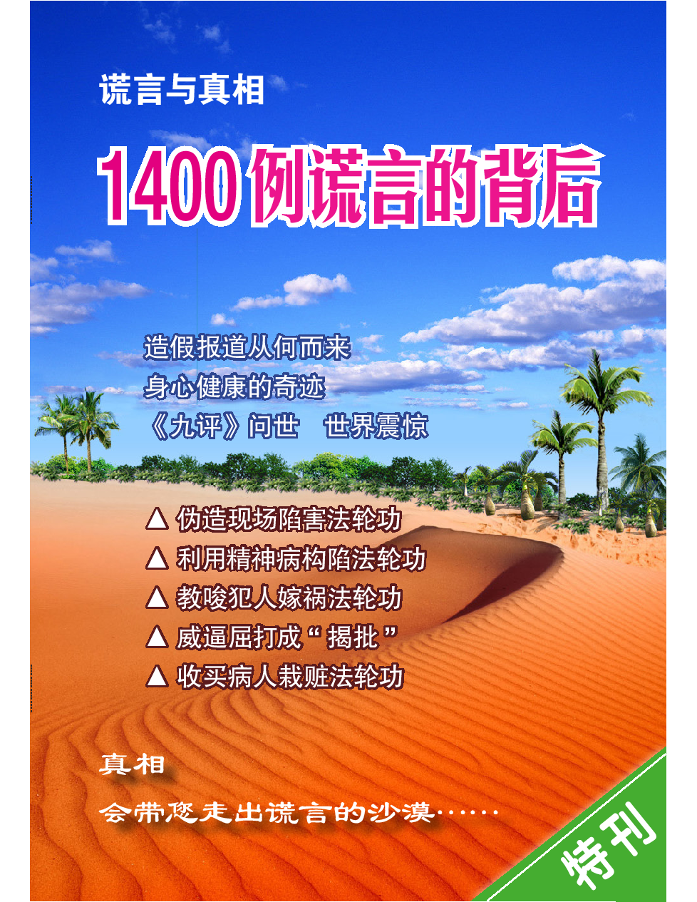
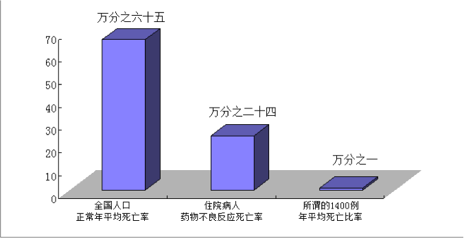
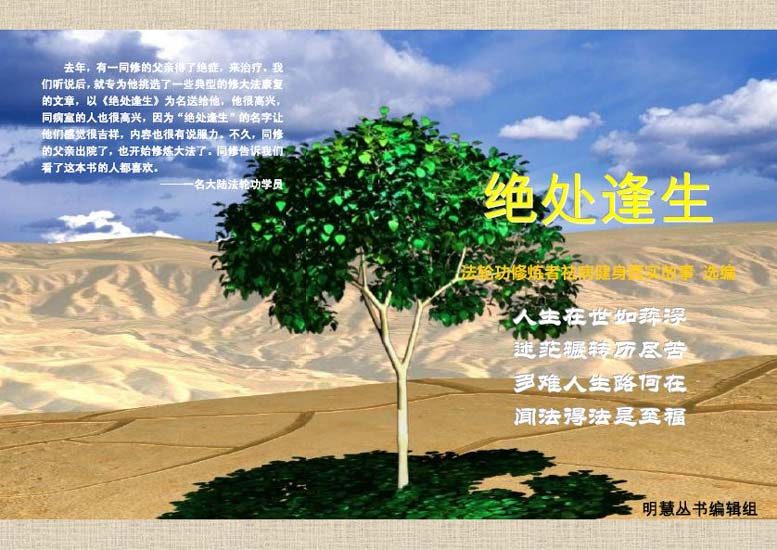
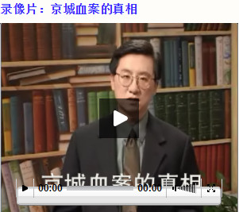

<h2>请收藏本网址，连上免翻视频即时IP https://git.io/souye </h2>

<h2>免翻视频IP http://220.141.130.83</h2>

 
  

<table>
<tr>
 <td>
 <a href="https://git.io/pamja"> <h3>如何 “ 三退保命 ”</a>，<b>连上面→免翻视频 IP http://220.141.130.83 </b> →点 【三退大潮】--为什么要退党？ 可留言三退或用翻墙软件自己办理三退</h3></td>
</tr> 

<tr>
 <td>
 <a href="https://git.io/pamja"> <h3>如何 “ 三退保命 ”</a>，请点击翻牆网站  https://git.io/opopop  下载 { 翻牆软件 }→找 { 大紀元網站 }  ( http://www.dajiyuan.com ) 三退</h3></td>
</tr>
  </table> 
 

<h1><a href=https://git.io/souye>看更多真相</h1></a>

<a name=top><h1 align="center"><b><a href="https://github.com/gtti/zen/blob/master/img/1400zx-2in1-read.pdf?raw=true">明慧专题：“1400例”真相</a></b></h1>
  
<b>一九九九年七月二十日，中共江泽民集团发动了对法轮功的迫害。如同中共历次政治运动一样，这场迫害也是以铺天盖地的谎言宣传开道，所谓的“1400例”就是谎言宣传的一部份。

中共罗织的“1400例”杀人、自杀、死亡的案例中，有的案例是把精神病患者病发时的意外事故栽赃为法轮功学员所为，有的案例是以减刑为条件唆使杀人者冒充法轮功学员，有的案例是以报销医药费为诱饵让危重病人冒充法轮功学员，还有的案例是把普通人的正常病逝说成是炼法轮功造成的。所有这些案例都是中共对法轮功的栽赃嫁祸。

这些谎言宣传，不仅成为中共煽动仇恨迫害法轮功学员的借口，而且使很多大陆民众失去了受益于法轮功的机缘。

因害怕谎言被揭穿，中共江泽民集团烧毁法轮功的书籍，关押讲真相的大陆法轮功学员，封锁海外明慧网等报道真相的网站。但是中共的谎言无法阻挡真相的传播。</b>

<a name=top1><h1 align="center"><b><a href=#1>1. 法轮功祛病健身效果</a></b></h1>

<b>法轮功是李洪志先生于一九九二年五月传出的一种佛家上乘修炼大法，因为其教人修心向善和神奇的祛病健身功效迅速传遍中国，并传播到海外，修炼人数迅速增长。一九九八年国家体育总局组织北京、武汉、大连及广东省的医学专家，对近三万五千名法轮功学员做了五次医学调查，证明了法轮功祛病健身有效率高于百分之九十八。</b>

  

  
<a href=#1><h6 align="right">阅读全文</h6></a>

<a name=top2><h1 align="center"><a href=#2><b>2. “1400例”栽赃术之一：利用精神病人栽赃</a></b></h1>

<b>李洪志先生从一九九二年传法开始就明确指出，精神病人不能修炼法轮功。在一九九六年的《悉尼法会讲法》中又指出：“精神病人，他自己意识是不清的，我们是不能度的。”而且法轮功教人向善，明确禁止杀生和自杀。“1400例”中有许多是精神病患者而决非法轮功学员。中共江泽民集团搜罗了许多精神病患者病发时杀人或自杀的意外事故，栽赃嫁祸于法轮功。</b>

  
<a href=#2><h6 align="right">阅读全文</h6></a>

<a name=top3><h1 align="center"><a href=#3><b>3. “1400例”栽赃术之二：唆使杀人犯栽赃</a></b></h1>
<b>中共江氏集团迫害法轮功，是作为政治任务下达到全国各级官员的。许多地方不法官员为了邀功请赏，编造假新闻栽赃法轮功，公安人员以减免刑罚为条件，唆使杀人犯谎称自己是炼法轮功的，栽赃法轮功。</b>

<a href=#3><h6 align="right">阅读全文</h6></a>

<a name=top4><h1 align="center"><a href=#4><b>4. “1400例”栽赃术之三：收买危重病人栽赃</a></b></h1>
<b>中共为了诋毁法轮功，还利用医院收买危重、绝症病人，承诺减免医药费，让他们谎称自己是炼法轮功的，配合电视台、报社记者演戏。</b>

<a href=#4><h6 align="right">阅读全文</h6></a>

<a name=top5><h1 align="center"><a href=#5><b>5. “1400例”栽赃术之四：假借病逝案例栽赃</a></b></h1>
<b>中共把一些人的正常死亡说是因炼法轮功致死。其中有的人根本没有接触过法轮功，当然也不排除有些人为治病接触过法轮功，有些人在亲属的劝说下炼过功，但是他们真正的死因却是疾病。</b>

<a href=#5><h6 align="right">阅读全文</h6></a>

<a name=top6><h1 align="center"><a href=#6><b>6. “1400例”反证法轮功的功效</a></b></h1>
 
  
<b>先不说这1400例如何经不起推敲，就假定这1400例是真的，就假定全国炼法轮功的人数是中共迫害开始时宣称的所谓的仅有二百万人（实际上，一九九八年官方公布全国约有七千万到一亿人炼法轮功），由此而算出的死亡率也远远低于正常人口的死亡率。</b>

<a href=#6><h6 align="right">阅读全文</h6></a>

<a name=top7><h1 align="center"><b><a href=#7>7. 明慧丛书：《绝处逢生》</a></b></h1>

<table border="0" cellspacing="3" cellpadding="3">
<tbody>
<tr>
<td align="center"></td>
</tr>
<tr>
<td align="center"><a href=#7>在本书里，我们可以看到各种人罹患顽疾和绝症的悲凉故事。可是他们因各种因缘际遇修炼法轮功之后，都得以绝处逢生，开始了身心健康的修炼生涯。(下载)</a></td>
</tr>
</tbody>
</table>  

<a href=#7><h6 align="right">阅读全文</h6></a>

<a name=top8><h1 align="center"><b><a href=#8>8. 案例：“剖腹找法轮”骗局</a></b></h1>

<b>河北省任丘市华北油田马建民，本人及家族都有精神病史。有一天，马建民一个人在家，他的家人回来时，看到地板上有很多血，马建民肚子剖开。当时公安局的人明明知道：马建民死的时候是一个人在家，究竟为什么会剖腹，谁也不清楚。但央视不顾事实，仍然一手编导了“剖腹找法轮”的骗局。</b>

<a href=#8><h6 align="right">阅读全文</h6></a>

<a name=top9><h1 align="center"><b><a href=#9>9. 案例：法院判决书认定杀父母者实为精神病人</a></b></h1>

<b>山东新泰市泰山机械厂工人王安收因精神病复发，将其父母用铁锨打死。一九九九年七月，这一事件却被诬蔑成王安收因“练法轮功”杀害父母，并且收入江氏诬蔑法轮功的“1400”例中。但从下面提供的新泰市人民法院的官方文件中，我们可以事实确凿的清楚看到“王安收因练法轮功杀害父母”是严重违背事实的谎言。</b>

<a href=#9><h6 align="right">阅读全文</h6></a>

<a name=top10><h1 align="center"><b><a href=#10>10. 案例：哈尔滨市第四医院诱骗李淑贤栽赃</a></b></h1>

<b>一九九九年七月，黑龙江阿城市大岭乡农妇李淑贤因患胃溃疡住进了哈尔滨市第四医院。病重期间，正是中共江泽民集团在全国迫害、诽谤法轮功之时。当时李淑贤家庭生活非常贫困，很难交上住院费。在这关键时刻，医院院长出现了，主动为李淑贤及其家属出主意，告诉家属：你们就说李淑贤是炼“法轮功”的，就能获得医院免费治疗。</b>

<a href=#10><h6 align="right">阅读全文</h6></a>

<a name=top11><h1 align="center"><b><a href=#11>11. 案例：公安部门许诺栽赃法轮功可免死罪</a></b></h1>

<b>二零零零年辽宁盘锦市电视台曾报导“魏家杀母案”。事后了解到这位被杀的老年人是以拣破烂为生，其女在海城游手好闲，打麻将，没钱了就到盘锦母亲处要钱，其母没钱给她，她在晚上将其母杀死。后来，公安部门的人给其女出主意：“你就说你炼法轮功，往法轮功上一推没死罪。”魏家老百姓都知道她不是炼法轮功的，但老百姓面对强权的压力，只能背地议论。</b>

<a href=#11><h6 align="right">阅读全文</h6></a>

<a name=top12><h1 align="center"><b><a href=#12>12.案例：和1400例一脉相承的傅怡彬杀亲案</a></b></h1>

<b>1400例之后，中共喉舌媒体又有几次利用精神病人杀人的恶性事件栽赃陷害法轮功。发生在二零零一年底的傅怡彬杀亲案就是其中影响最坏的一例。</b>

<a href=#12><h6 align="right">阅读全文</h6></a>

<a name=top13><h1 align="center"><b><a href=#13>13. 录像片：京城血案的真相</a></b></h1>
  

 
<a href=#13><h6 align="right">阅读全文</h6></a>  

<a name=top14><b>14. 评论文章</a></b>

<a href=#14-1>1.“1400例”谎言与条件反射</a> 
<a href=#14-2>2.“1400例”谎言使多少人失去受益的机缘</a> 
<a href=#14-3>3.美国医院错误每年造成19万5千人死亡——反观1400例栽赃案</a> 
<a href=#14-4>4.拉家常：“1400例”只能证明法轮功祛病健身功效之超常</a> 
<a href=#14-5>5.“1400例”真相(1)：从死亡率看1400例 凸显法轮功祛病健身之功效</a> 
<a href=#14-6>6.“1400例”真相(2)：官方媒体栽赃陷害肆意妄为</a> 
<a href=#14-7>7.“1400例”真相(3)：官方报导随意定罪 视如儿戏</a> 
<a href=#14-8>8.“1400例”真相(4)：官方媒体可信吗？一个1400例的家属如是说</a> 
<a href=#14-9>9.“1400人”真相(5)：法轮功不让人吃药吗？</a> 

<a href=#14><h6 align="right">阅读全文</h6></a>

<a name=top15><b>15. 澄清事实文章</a></b>

<a href=#15-1>1.“1400例”的谎言中的一例 
<a href=#15-2>2.曝光“1400例”谎言的第一例 
<a href=#15-3>3.中共栽赃法轮功的一件事 
<a href=#15-4>4.从东方时空记者采访我的经过看造谣媒体欺骗世人 
<a href=#15-5>5.揭穿“1400例”栽赃案例之一：黑龙江省五常市兽药厂职工李凤香的真实情况 
<a href=#15-6>6.我妈妈马锦秀被江氏集团算在“1400例”内的事实真相 
<a href=#15-7>7.“1400例”内幕一则：我儿子的死与法轮功无关 
<a href=#15-8>8.1400例的背后：中央电视台又炮制跳楼假新闻两例 
<a href=#15-9>9.1400例的背后: 辽宁省铁岭市大甸子镇杜维平之死的事实真相 
<a href=#15-10>10.1400例曝光：陈宇平之死的真相 
<a href=#15-11>11.明慧汇编：央视谎言曝光 
<a href=#-3>12.哈尔滨杀人事件的真象：他爱人说他一天法轮功也没有炼过 
<a href=#15-13>13.黑龙江省森工总局职工邹刚杀人害命案真象：邹刚根本就没有炼过“法轮功” 
  
<a href=#15><h6 align="right">阅读全文</h6></a>

<a name=1><h1 align="center"><b>1.五份调查报告显示法轮功祛病健身效果</b></h1>

健康的身体是人美好生活的根本。著名男高音歌唱家关贵敏，演唱及录制过上千首歌曲，曾被评为全国听众最喜爱的歌唱演员，1983年，39岁的关贵敏歌唱事业正达高峰，却意外发现罹患乙型肝炎兼早期肝硬化。为了治病，他休养一年，四处求医，找偏方，并尝试各种气功，但都未见好转。1996年春天，在朋友的介绍下，关贵敏开始学炼法轮功，经过一年左右，身体痊愈了。

汪志远先生曾在美国哈佛医学院工作过，但身患世界五大绝症之一的“渐冻人”病，无药可医，但是参加法轮大法学习班的第一天时就全身舒畅，发生了一系列神奇的现象，如体内滚滚热流涌动，莫名的持续流泪，一路上多次找厕所大量小便等；修炼三个月的时间，身体状况完全恢复正常了，一度6克的血色素（不到正常男子的一半）也都正常了（而人的血细胞周期需要120天！）体重也从110多斤恢复到了150多斤。《波士顿环球报》记者听说此事来采访他，几乎不敢相信自己的眼睛，因为他看到汪志远正在跑步。

在修炼法轮功的人群中，上述事例不是偶尔听到的个别事例，1998年5月15日，当时的中国国家体育总局局长亲赴法轮大法发祥地吉林省长春市考察。1998年9月国家体总抽样调查法轮功修炼人12,553人，疾病痊愈和基本康复率为77.5%，加上好转者人数20.4%，祛病健身有效率总数高达97.9%。平均每人每年节约医药费1700多元，每年共节约医药费2100多万元。下面这几份调查报告或许能给您一个更全面的认识。

<b>一、来自北京的调查报告</b>

  
调查者对北京市五个城区（西城区、崇文区、东城区、宣武区及朝阳区）部份法轮功修炼群众的修炼效果进行了宏观的调查。此次调查共涉及北京五个城区的200多个炼功点，采集到14,199名法轮功修炼者的修炼前后身心变化的对比资料，有效调查人数12,731例。

 

调查结果表明，修炼前患一种疾病的有2,547人，占20%，患二种疾病的3,004人，占23.6%，患三种以上疾病6,341人，占49.8%，有病人数合计11,892人，占总调查人数的93.4%。修炼后健康状完全康复6,962人，占58.5%；基本好转2,956人，占24.9%，修炼后祛病总有效率为99.1%。

 

医疗费用节省情况的统计结果显示，被调查人群每年总共可节省医疗费约4,170万元，平均每人每年节约医疗费约3,270元。修炼后体质得到增强者9,871人，体质改善率80.3%；其中体力精力强盛者从修炼前3.5%增加到修炼后的55.3%。修炼前精神负担重和较重者占52.4%。修炼后12,287人精神得到改善，占总人数的96.5%；其中达到“乐观豁达”程度的有7,202人，占56.6%；“有较大改善”3,447人，占27.0%；“有一定改善”1,638人，占12.8%。

参与调查的法轮功学员中有839位修炼前健康无病，占总数的6.6%，修炼后486人体质状况增强，占57.9%。修炼后精神状况有改善者742人，占88.4%。

<b>二、来自武汉的调查报告</b>

  
1998年12月，调查者对湖北省武汉地区的法轮功修炼者进行了调查。涉及武汉三镇的三个地区，50余个炼功点，被调查人数为2,005人，调查方式是以团体普查，随机抽样等方式进行，调查内容分一般情况，修炼前患各种疾病的分类项，修炼后身体健康状况的改变，修炼前后医疗费用的比较，以及三大特殊嗜好（吸烟、饮酒、赌博）的改变。

被调查的法轮功学员遍及各个不同的年龄阶段，由7岁至85岁；遍及不同社会阶层，其中有工人、农民、干部、科技人员等等，包括专家、学者、教授和领导干部；来自各种不同的文化层次，其中以高中、中专、大专、大学、研究生等有文化的比例最大。

2,005名法轮功学员中修炼前患有各种疾病者为1,899人，占94.7%。而且大部份学员都患两种病以上，病案总数为5,323例，修炼后身体健康状况明显改善，症状消失率为75.15%，好转率为23.5%。

修炼前医疗费用有37人每年达到上万元，通过炼功后，身体达到了无病状态，因此绝大部份学员不需用药就医，据统计95.51%的人都没有使用医疗费，为国家和工作单位都节约了大量医疗费用。

2,005名学员中，修炼前吸烟377人，饮酒536人，赌博者420人，共计1,333人，（其中有人具备2-3项）修炼后仅有11人吸烟，10人饮酒，1人赌博共计22人占1%。

<b>三、来自台湾的调查报告</b>

  
2002年12月28日，台湾大学经济系助理教授胡玉蕙发表的一项调查报告显示：法轮功学员修炼后，一年只用一张健保卡者达72%，几乎是修炼前的一半；法轮功对于戒除不良的生活习惯有显著的效果，同时法轮功对心理情绪的帮助很大。

这项学术研究调查是以法轮功学员为例，针对全台法轮功学员，以部落抽样的方式，抽出五分之一的乡镇市区，共回收1182的有效问卷，并以统计分析方法所做成的结论。报告中指出，法轮功对于戒除不良的生活习惯有显著的效果。81%的戒烟率、77%的戒酒率、85%的戒赌率，还有85%完全戒除吃槟榔的习惯。

胡博士指出这项研究也说明了，法轮功对心理情绪的帮助很大：对自己健康状况满意程度，从修炼前的24%大幅上升到78%；对自己日常活动能力的满意度，从修炼前的36%上升到81%。此外有33%在修炼前有紧张、忧郁等倾向，修炼后只剩下不到3%的人有此感受。

<b>四、来自俄罗斯的调查报告</b>

  
2001年4月23日至2001年6月24日，由俄联邦内务部法医研究室的高级法医鉴定专家古罗奇金教授（医学博士）和司法医学检查处的主任鉴定医师-精神科医生斯明塔尼先生组成的调研组对俄罗斯部份法轮功修炼者进行了调查研究，调研项目包括：修炼者的有关医疗证明文件，修炼前后的健康指数，法轮功功法内容，修炼者的日常生活。

调研组采取随机抽样方法，从32名法轮功学员中选取12人进行了调研。调研组的鉴定内容包括：1.身体器官和系统的健康状况；2.调查对象的客观情况和主观意见；3.调查对象的动态精神状况。12名调查对象的状况：3人40岁以下，9人40岁以上；4男8女；修炼法轮功已超过一年的2人，超过2年的11人。

调查对象在修炼法轮功前均患有疾病，其中3人患有胃肠疾病（溃疡和炎症），1人内分泌失调，1人患有呼吸道疾病，8人在家庭和工作关系中有问题，精神抑郁，易疲劳。

调研组在开始调研和结束调研时，运用牛津分析测验理论对调查对象进行了测试，测试其对日常问题的客观反应，观察炼功对解决这些问题的影响。12人中，9人的测试结果是正的，8周的测试期内，测试曲线总增长超过100个点。

对调查对象进行的临床医学检查结果：无病诉，血和尿的化验指标正常，经全面身体检查无病理反应。所有调查对象的精神状况都很正常：精神稳定，积极，反应正确，负责任，容易相处。调查对象的主观意见：修炼法轮功使他们的身心健康得到了改善。

调研组的鉴定结论：1．修炼法轮功的祛病健身效果为75%；2．对法轮功学员的医学鉴定表明，修炼法轮功能使人的身体和精神状况得到明显的改善；3．法轮功对人的身体和精神没有任何危害，是一种可接受的保健方法。

<b>五、来自北美的调查报告</b>

  
受中国大陆1999年7月前的健康调查结果的启发，几位北美法轮功学员在北美做了小规模的法轮功修炼健康调查。调查者将调查表发给部份在美国和加拿大的法轮功学员，共收回235份答卷，其中202份来自美国，32份来自加拿大，还有一份未注明所在国家。参与调查者中有18例在修炼前有吸烟习惯，修炼后全部都戒了烟。从吸烟到完全戒掉所使用的平均时间为4.58天（标准误差值为9.72天）。103例在修炼前有饮酒习惯，100例修炼后戒了酒，2例每周饮酒不超过3杯，1例未填答案。

调查者中230人交回的反馈中有修炼前健康状况的完整资料，226人交回的反馈中有修炼后健康状况的完整资料。从两份完整资料中可以明显看出，224位反馈者在修炼后，健康状况得到极大的改善，占97%以上。并且可以从调查结果中可以看出，炼功时间越长，健康状况改善越明显。

现代医学认为，人的疾病是由社会因素、环境因素及生物因素三方面造成的；这三方面因素在很大程度上是通过精神作用对身体造成影响的，从而导致疾病和不健康状态。由此可见，精神因素在人的健康方面起着至关重要的作用。法轮功修炼的一个突出的特点是要求修炼者把提高思想境界放在首位，要求修炼者在工作、生活中按照“真、善、忍”为准则，从提高人的品德上真正改善人的精神状态，从而使身体达到理想的健康状态。修心加上炼功，这对修炼者身心健康的改善和增强是显而易见的。

除了上述祛病健身方面的神奇事例外，法轮功主要强调道德，使人变得诚实、善良、宽容、平和；还揭示出了人体、生命和宇宙的奥秘，为真正想要往高层次上修炼的人指明了一条光明大道。

<a href=#top2><h6 align="right">回上方第2篇</h6></a>

<a name=2><h1 align="center"><b>2.中共“1400例”骗局：利用精神病患者栽赃陷害法轮功</b></h1>

根据中国卫生部一九九八年的统计数字表明，中国有百分之五的人（约六千五百万人）患有不同程度的精神病和精神障碍，其中七成是重症精神病，约四十万人致残，生活不能自理。

一九九九年中共江泽民集团搜罗了许多精神病患者病发时的意外事故，栽赃嫁祸于法轮功。这些精神病人根本就不是法轮功学员。事实上李洪志老师从一九九二年传法开始就明确指出，精神病人不能修炼法轮功。在一九九六年的《悉尼法会讲法》中又指出：“精神病人，他自己意识是不清的，我们是不能度的。”李老师在《法轮大法义解》〈北京法轮大法辅导员会议建议〉中指出：“为什么我们强调精神病人不让参加班呢？就是他自己都把握不了自己，掌握不了自己。”

<b>中共炮制的“剖腹找法轮”骗局</b>

  
河北省任丘市华北油田马建民，本人及家族都有精神病史。他是一个气功爱好者，前后练了十几种气功，当时社会上流行什么他就练什么，也跟风接触过法轮功。有一天，马建民一个人在家，他的家人回来时，看到地板上有很多血，马建民肚子剖开，肠子外流，死在了厕所里。家人赶紧报案，尸体被送到华北油田总医院急诊科缝合。当时公安局的人明明知道：马建民死的时候是一个人在家，究竟为什么会剖腹，谁也不清楚。可是为了迎合江泽民迫害法轮功的政策，讨好公安部，为捞取政治资本，硬把马建民的死说成是“剖腹找法轮”。当时央视去马建民家编排节目时，马建民的儿子一再声明其父的死与法轮功无关，并且拒绝在电视上表演。但央视不顾事实，仍然一手编导了“剖腹找法轮”的骗局。

<b>山东“铁锨打死父母”案真相</b>

  
山东新泰市泰山机械厂工人王安收，因精神病发作将其父母用铁锨打死。王安收是一个精神病患者，这一点，在当地法院判决王与妻子尹彦菊离婚的判决书上写得非常明白，山东省新泰市人民法院（1999）新城民初字第245号民事判决书的部份内容：“本院认为，被告（王安收）婚前患精神病并隐瞒，婚后精神病多次复发，且经久治不愈，曾因精神病发作杀害自己的父亲，原告（尹彦菊）坚决要求离婚，夫妻感情已完全破裂，原告离婚请求予以支持。”可是这个案例却被中共江泽民集团收入“1400例”中栽赃到法轮功头上。

<b>黑龙江省双城市吴洪辉跳楼真相</b>

  
吴洪辉，黑龙江省双城市卫生防疫站职员。早在二、三十年前，因与女友恋爱多年被双方父母拆散，精神上受到严重打击而引发精神病，之后多次出现精神分裂现象，严重时不能上班。他的精神病史，他的亲友都可以作证。吴洪辉接触过法轮功，但李洪志先生从传法开始就明确提出：危重病人、精神病人或有精神病史的人不得炼功，所以吴洪辉不是法轮功修炼者。一九九六年吴洪辉精神病发作跳楼后，他的妻子曾在双城法轮大法心得交流大会上指出过他有过精神病史，而且多次复发过，并写信给双城市政府澄清吴洪辉跳楼真正原因，明确指出是精神病复发所致。

<b>黑龙江双城市王成祥九九年跳楼内情</b>

  
王成祥，男，六十多岁，黑龙江省双城市韩甸镇粮库一名退休工人，家族有精神病史，他的母亲是跳井死的，舅舅是上吊死的，家族中跳井、跳河、跳房、上吊等非正常死亡的就有十三人。引发王成祥发病的原因是一九九八年他儿子买了一套粮库的家属楼，就动员父母也搬到楼上住。但王成祥上下六楼很费劲，再加上二、三年前他刚盖了三间新砖房，很遂心，舍不得卖掉，有一次对儿子说：你买了楼我也不去住，就是去了，我早晚也得从楼上跳下去。后来勉强搬到楼上住，却整天郁郁寡欢，精神恍惚，要寻短见。

家人对此很担心，王成祥的老伴就劝他炼法轮功，让他减轻点精神负担。王成祥不看《转法轮》，象征性的比划比划动作，根本算不上法轮功学员。九九年正月初二夜里，由于家人没看住，王成祥从他家六楼跳下自杀了。中央电视台就这样把他的死嫁祸于法轮功，粮库的职工都说“他跳楼可不是炼法轮功炼的，他不炼法轮功也得自杀，他们家两辈就出三个。”

<b>华南理工大学家属余素昭自杀案真相</b>

  
余素昭在文革期间曾因精神病到广州芳村精神病院治疗几个月。九五年她隐瞒病史学起了法轮功（法轮功规定有精神病史者、家族有精神病史者不准修炼法轮功）。九八年初余素昭精神病复发，被家人送精神病院治疗。期间，法轮功学员劝其不要炼，她也表示不炼了，并将全部法轮功书籍、炼功带退还，从此以后不再炼法轮功了。半年后，她精神病再次发作，坠楼身亡。显然她的死和法轮功没有丝毫关系。

<b>重庆永川双石镇龙刚跳河自杀真相</b>

  
重庆永川双石镇龙刚，家住双桥街七十号，精神病复发跳河死亡。龙刚死后，一个姓杜的记者采访他的妻子，把一些诬蔑法轮功的话写在纸上，叫她照着念，并给了她二百元钱。龙刚父母投书明慧网说：“儿子有没有精神病作为父母是最清楚的，天下哪有不心疼子女的父母。儿子确实有精神病，当时是精神病复发跳河死亡，与法轮功没有任何关系。这是谁也抹煞不了的事实，作为他的父母，我们必须说真话，不能昧着良心。”

<b>跳井自杀的刘品清不是法轮功学员</b>

  
辽宁省东港市孤山镇农机台的站长刘品清，因生活压力出现精神问题自杀。据当地的知情人士透露，刘品清做生意赔了十多万元，而且跟妻子关系不和，长期分居，在这种压力下，精神上出现了问题。这时有人跟他介绍法轮功，他就看了看书，但根本没有修炼。当地了解他的人都说，他根本不是一个法轮功学员，他是在家庭遭受不幸的情况下自寻短见的。而一九九九年七月二十二日下午，中央电视台播放关于江泽民迫害法轮功的决定，播放的“1400例”中谎称刘品清是“练”了功以后跳井自杀。

<b>河北任丘朱长久残杀父母事件真相</b>

  
朱长久，河北省任丘市青塔乡张各庄村人，一九九七年患精神病，他的妻子边立新经常发现他精神恍惚及胡言乱语，言行异常，但九九年初病情有所好转。九九年七月，中共迫害法轮功后，他父亲朱振虎把他保存的法轮功书籍烧掉，村干部及乡派出所天天找他谈话，使他受到巨大精神压力，精神病复发。十一月二十五日，他两眼发直，不穿衣服赤条条的傻笑，第二天凌晨，突然用铁锤将父母杀死。

这本是一宗精神病患者发病错杀父母的案件，中共媒体发布的新闻稿完全不提他患病事实，却以《法轮功分子残杀父母》为题，将责任推到法轮功身上，并收入“1400例”。
<a href=#top3><h6 align="right">回上方第3篇</h6></a>

<a name=3><h1 align="center"><b>3.中共“1400例”骗局：唆使杀人犯和自杀者家属栽赃法轮功</b></h1>
  
中共江泽民集团迫害法轮功的指令，是作为政治任务下达到全国各级官员的。许多地方官员为了邀功请赏、捞取向上爬的资本，不择一切手段编造假新闻栽赃法轮功。公安人员以承诺减免刑罚为手段，唆使杀人犯冒充法轮功学员栽赃陷害法轮功。

<b>辽宁盘锦市“魏家杀母案”内幕：公安部门许诺栽赃法轮功可免死罪</b>

  
二零零零年辽宁盘锦市电视台曾报导“魏家杀母案”。事后了解到这位被杀的老年人是以拣破烂为生的，其女在海城游手好闲，打麻将，没钱了就找母亲要，母亲没钱给她，她在晚上将其母杀死。后来，公安部门的人给其女出主意：“你就说你炼法轮功，往法轮功上一推没死罪。”魏家老百姓都知道她不是炼法轮功的，但迫于中共强权的压力，只能背地议论。

<b>张清贺杀伤亲人，公安局告知栽赃法轮功可以不判刑</b>

  
黑龙江省牡丹江市一个叫张清贺的工人，因患贫血、神经衰弱及其它慢性疾病，曾服过八个月中药。后因支付不起药费，经医生开方自己配药吃。但由于不懂药理，他自己往里加了两味中药，服药后，他就处于意识不清，不能自制的状态。一天他吃完药后准备自杀，被他母亲和妹妹发现了，前去劝阻，他在药力作用下出现杀伤自己亲人的事件。张清贺被牡丹江市公安局爱民分局收审后，多次被逼迫承认炼过法轮功，并被逼迫承认是因为炼了法轮功才出现恶性事件的，而且公安局告诉他承认了就可以不被判刑。

<b>“井架上吊”实为城管逼死</b>

  
除了杀人者之外，中共也把自杀者说成是法轮功学员。吉林市郊一农民以修车为生，由于没办理营业手续，修车工具被城管没收，他不堪巨大的生活压力而上吊自杀。当家属要告城管部门时，当地民政部门为政府部门开脱责任，给予抚恤，把死者说成是练法轮功的。公安部门特意在死者周围摆上李洪志老师的相片和两瓶白酒，对死者重新录像。其实周围老百姓都知道，死者从未炼过法轮功。人们也都知道修炼法轮功是不喝酒的，但当时当地公安部门还不知道这一点，所以在录像中露出破绽，使拙劣的谎言不攻自破。

 
 
<a href=#top4><h6 align="right">回上方第4篇</h6></a>

<a name=4><h1 align="center"><b>4.中共“1400例”骗局：收买危重病人栽赃法轮功</b></h1>
  
为栽赃法轮功，中共在医院收买危重、绝症病人作伪证，承诺减免医药费。有些人就在这种利诱下谎称自己是炼法轮功的，配合电视台、报社记者演戏。

<b>张海青“罗锅事件”出笼内幕：中央电视台记者许诺药费减半</b>

  
一九九九年七月二十日以后中央电视台连续播放诬陷法轮功的节目时，播出了一个所谓“罗锅事件”。此人叫张海青，在盘锦市开了一家刻字社，家庭很困难，住在农村，因患脊椎炎到北京协和医院看病，他妻子说当时在北京医院排队挂号人很多，他们排很远的队。这时来了一个记者说是中央电视台的，和当时排队的人说谁想上电视说法轮功不好，就给谁先挂号，并且药费减半。因为当时他们看病着急，张海青就胡说自己是炼法轮功炼成了罗锅，并且按记者写好的台词说了些不好的话。结果是先挂了号，但药费没有减半。后来张海青的妻子说中央电视台竟骗人，药费都是自己花的，至于张海青从没炼过法轮功，认识他的人都知道。

<b>黑龙江农妇李淑贤病重：医院院长承诺免费治疗</b>

  
李淑贤，黑龙江省哈尔滨市阿城区新华乡崔家屯农妇，婚后在阿城区大岭乡居住。一九九九年七月李淑贤患胃溃疡住进哈尔滨第四医院，病重期间因生活贫困交不上住院费，医院院长主动给他们出主意：你们就说李淑贤是炼法轮功炼的，就能获得免费治疗，并在生活上还能给予照顾。李淑贤及家属为了利益同意了。于是，哈尔滨市《新晚报》记者迅速赶到医院采访，用编好的台词让李淑贤的丈夫照着说，还告诉他：你得带着表情，说得象真的一样，人们才会相信。事后李淑贤病情不断加重，被医院强制出院，回家后时隔不久就死亡了。

李淑贤被列入栽赃法轮功的1400例中，被中央台多次播放。有人问当地官员：为什么中央电视台向全国人民撒谎呢？官员说：“这么大的媒体哪能不出现一点纰漏呢！”话一出口，闻者寒心。阿城区强行办洗脑班迫害法轮功学员时，还播放此录像，法轮功学员说：“发生在我们身边的事，包括你们和大家都知道是谎言和欺骗，还拿出来给我们看？”当时，他们就不放了。

<a href=#top5><h6 align="right">回上方第5篇</h6></a>

<a name=5><h1 align="center"><b>5."中共“1400例”骗局：利用普通人的病逝栽赃法轮功</b></h1>
           
生、老、病、死是人类的自然现象，疾病是造成死亡的首要原因，据中国统计年鉴一九九八年所记载的全国平均死亡率，一千万人中每年约有六万五千人死亡。在医学比较发达的美国，每年仅急性心肌梗塞致死就有二十万人。法轮功是一种古老的佛家修炼方法，他的祛病健身效果显著，但并不是说接触了法轮功、炼了法轮功就上了保险，包治百病长生不死。中共则毫无边际的把一些人的正常死亡说成是因炼法轮功致死。其中有的人根本没有接触过法轮功，当然也不排除有些人为治病接触过法轮功，有些人在亲属的劝说下练过功，但是他们真正的死因却是疾病。

举个简单例子，著名演员陈晓旭（八七版《红楼梦》林黛玉的扮演者）病逝后，毫无任何科学建树的所谓“院士”何祚庥称“陈晓旭就是被中医害死的”，引发强烈的争论。卫生部副部长、国家中医药管理局局长王国强对此言论进行了批驳，他指出：“如果因为去世的人吃过中药，就认为是中医药有问题的话，那么，去世的人吃过西药，是不是也要认为西医药不科学？”与此同理，去世的人为治病也练过法轮功，就能说是法轮功致死的吗？我们看看下面几个被收入“1400例”的事实真相，听听他们的家属怎么说。

<b>马锦秀被中共算在“1400例”内的事实真相</b>

  
据北京市宣武区居民马锦秀的女儿金有明披露：马锦秀于一九八一年左右患了糖尿病，每次都是四个“+”号，每天每顿吃三十多片药，饱受疾病折磨，特别是九四年和九五年两次中风致使面部偏瘫，十多年一直在死亡的边缘上挣扎，甚至早早就做了身后事料理，嘱托亲属：万一自己有什么不测，帮忙照看三个孩子。一九九六年马锦秀学习了法轮功后，病情奇迹般好转，面部的偏瘫迅速康复，糖尿病的症状全都消失。直到九七年又出现身体不适，住院治疗，几个月后病故。马锦秀好几次跟女儿说：你看你某某阿姨，某某叔叔，比我后得的糖尿病，都比我先走了，还就算我活的长了，我还能得大法，真是幸运。

九九年七·二零以后，中共为了栽赃法轮功，把马锦秀也列入“1400例”，其女儿金有明听说后心情异常沉重，“妈妈明明是因脑梗塞病故的呀，怎么成了炼功造成的呢？妈妈在医院治疗了几个月去世，在医院，接受了大量的治疗，药也吃了，药液也大量注射了，可还是去世了，我们能说是医院造成的吗？因为医院也是‘治得了病、治不了命’的。为什么妈妈炼过功，就说炼功造成的呢？”马锦秀的丈夫也说：说你妈妈是炼功致死的，那倒不是，她是近二十年的糖尿病，又是脑梗塞。

<b>黑龙江省五常市兽药厂职工李凤香的真实情况</b>

  
一九九八年春，家住黑龙江五常市的李凤香患乳腺癌晚期，肿块已经开始大面积化脓。她的妹妹是九六年开始修炼法轮功的，仅修炼一个星期，原来患有静脉炎、气管炎、甲状腺、心脏病、腰间盘突出等症状都不翼而飞，她亲身体验到大法的神奇，就专程去劝病重的姐姐也炼法轮功。李凤香炼功后，病情就有了明显的好转，但她毕竟是属于危重病人，于九九年六月病逝。中共把她的死归结到1400例中，她的丈夫迫于压力作了伪证。她的妹妹投书明慧网说：“如果不炼法轮功，说不定九八年都过不去。开始炼功不长时间，病情得到控制，精神焕发，脾气也变好了，天天乐呵呵的到炼功点学法、炼功，不知道的人根本看不出是一个癌症晚期的病人。这用任何一种医疗手段都达不到的。”

<b>陈宇平之死的真相</b>

  
湖北省黄冈市黄州区东门学校教师陈宇平，一九九八年三月三次被确诊为肝癌晚期，死时三十四岁。九九年当地“六一零”（江泽民专为迫害法轮功而成立凌驾于法律之上的非法组织）为栽赃法轮功，谎称其是炼功致死，并收入1400例。他的妻子刘志红是一名法轮功学员，投书明慧网提到：陈宇平被确诊为肝癌晚期之前从未炼过法轮功，之后她自己不顾李洪志师父对危重病人不能修炼的规定，要丈夫炼功祛病。可是他不能做到真正的修炼，所以没有出现祛病健身的超常现象，照常病逝。

<b>“我丈夫从未炼过法轮功，却被列为1400例之一”</b>

  
王喾是机关公务员，一九八四年得过乙型肝炎，一九九八年五十岁时死于肝硬化，却无故被收入1400例。他的妻子二零零一年投书明慧网说“一九九八年八月，不知记者采访的谁，在报上登出来了说白发人送黑发人，栽赃陷害法轮功。我丈夫纯属正常死亡，根本不是炼法轮功炼的，他本人从未炼过法轮功。”并提到“五十岁的他去世的原因是：1、在工作中说真话受排挤；2、工作中叫人骗了一把，自己拿钱给补上；3、因为他哥哥在一九九五年八月二十五日去世，死于肝癌，时年五十岁，弟弟在一九九七年五月九日死于肝病，时年四十六岁，因为他们兄弟都有肝病，所以对他压力很大。”

<b>山东蒙阴县宣传部捏造“练功致死”，死者家属不同意遭毒打</b>

  
山东蒙阴桃墟镇居民石增山的女儿患有先天性心脏病，医院治不好，附近的居民都知道她死于先天性心脏病。然而蒙阴县宣传部为了搜罗诬陷法轮功的材料向上级邀功，组织专人编写了一份材料，说石的女儿炼法轮功，不让吃药、不让打针，最后死了，要求石增山配合电视台，念这份稿子录像。开始石增山不同意，不想出卖良心说假话。但是镇政府组织了一批打手用了三个晚上对石增山进行非人的折磨、毒打，致使石增山被迫妥协，配合电视台说了假话，做了录像“揭批”，造成了终生遗憾。

<b>辽宁杜维平之死的事实真相：电视台记者承诺付报酬</b>

  
杜维平，女，辽宁省铁岭市大甸子镇人，身患怪病于一九九九年八月在家中死亡，时年二十二岁左右。据了解，杜维平生前到处求医，找巫医、去基督教会祷告均未见起色。万般无奈的情况下，抱着试试看的心理学了一、两个月法轮功，炼功动作还没学会就不学了。死亡前几天还请巫医到家中治疗，当时巫医告诉她及家人在三天之内不允许见任何人，她都照办，过了不几天就死了。

当时正值中共开始诬蔑法轮功，当地官员到处找诬陷材料找不到的情况下，铁岭电视台记者崔大新，与报社记者多次到杜维平家里，要她父母作假证陷害法轮功并承诺给一笔钱作报酬。杜维平父母在金钱的诱惑下违心作了假证。这件事在当地引起很大反响，有的老百姓说：通过杜维平这件事，我知道了电视台所报导的这些都是假的，我们不会相信的。 

<a href=#top6><h6 align="right">回上方第6篇</h6></a>

<a name=6><h1 align="center"><b>6.中共“1400例”反证法轮功的功效</b></h1>

 

退一万步，先不说这1400例如何经不起推敲，就假定这1400例是真的，就假定全国炼法轮功的人数是中共迫害开始时所宣称的仅有二百万人（实际上，一九九八年官方公布全国约有七千万到一亿人炼法轮功），从一九九二年到一九九九年，按中共造谣的死亡1400例算，平均一年两百人，即所谓的炼法轮功死亡的年平均死亡率仅为万分之一。而根据《中国统计年鉴1996》，在一九九零年到一九九六年七年中，全国人口正常的年平均死 亡率为万分之六十六，大大高于所谓的炼法轮功死亡的年平均死亡率。而据国内医药学专业期刊提供的数字，住院病人中因药物不良反应而死亡的死亡率至少是万分之二十四，也远远高于法轮功修炼者万分之一的年平均死亡率。退一万步说，假定这1400例是真的，那么它恰恰证明了法轮功在祛病健身方面的功效。

<a href=#top7><h6 align="right">回上方第7篇</h6></a>

<a name=7><h1 align="center"><b>7.明慧丛书：《绝处逢生》</b></h1>

【明慧网二零零四年七月二十一日】（大陆网络版，黑白插图）

  
版本说明：今日推出的版本为大陆网络版。除封面封底外，采用了省墨的黑白连环画手法插图；希望在当前迫害尚未结束的情况下，能尽量方便中国大陆的法轮功学员和世人读者下载、印刷。供海外读者分享的版本，将采用另一套插图（彩色），并于八月初印刷发行。欢迎广大读者朋友向明慧编辑部随时提供反馈和改進建议。

<b>前 言</b>

　　疾病一直是人类难以战胜的敌人。尽管目前的医学很发达，但是仍然有很多疾病无法被攻克，很多人仍然生活在病魔缠身的悲苦之中。在本书里，我们可以看到各种人罹患顽疾和绝症的悲凉故事。可是他们因各种因缘际遇修炼法轮功之后，都得以绝处逢生，开始了身心健康的修炼生涯。

　　本书收集的这些故事均采编于海外志愿者建立和维护的“明慧”网站，本书也是“明慧丛书”系列的一集。这些故事仅仅是沧海一粟，因为在当前中国大陆的迫害运动尚未结束的情况下，很多修炼者暂时还无法将他们自己的经历写出来发表供更多的人借鉴。

　　法轮功又称法轮大法，于1992年由李洪志老师传出，因为其祛病健身的神奇功效和以“真、善、忍”为根本的修炼法理，几年内就传遍神州并远播世界各地。即使在1999年开始的历经五年的迫害中，修炼者依然择善固执，坚持信仰，并向社会各界讲清真象。

　　愿被病痛逼到绝路上的朋友，能够受益于本书，给自己的人生重新敞开希望的大门。

明慧丛书编辑小组
2004年7月

下载（A4，136页）：

<a href="https://github.com/gtti/zen/blob/master/download/jchfsh72004-pdf.pdf?raw=true">阅读版：下载WORD压缩文件(4.9MB)</a> 
<a href="https://github.com/gtti/zen/blob/master/download/jchfsh72004-doc.doc?raw=true">打印版：下载PDF压缩文件(3.3MB)</a> 
打印说明：WORD文件可用WORD 2002直接打印为骑马订格式；如果没有WORD 2002，请使用PDF文件打印。

目 录
1. 四岁患骨结核 妈妈含泪离去 师父把我拯救
2. 化疗激素皆无效 修炼大法肿瘤消
3. 染怪病的美国普度大学博士生的重生
4. 炼功几个月后肝癌完全消失
5. 肾衰透析患者的康复
6. 十四个白血病人中只有我因修大法活了下来
7. 慢性肝坏死、肝血管瘤等疾病消失
8. 疑难病症医生束手 修炼大法一月康复
9. 患尿毒绝症卧床不起 学法五天下地洗衣
10. 中医主治医师：是法轮大法治愈了我多年顽疾
11. 学法修心 乳癌自愈
12. 修炼前我是个被医院判了“死刑”的人
13. 遭辐射濒临死亡 修大法脱胎换骨
14. 直肠癌晚期、肝硬化晚期、肾坏死等九种重病全部痊愈
15. 儿时烫伤仅剩半条命
修炼大法有幸获新生
16. 车间主任：不知不觉中全身病痛都跑了
17. 严重脑震荡后遗症消失
18. 淋巴癌消失 大法显神奇
19. 炼功三天，我二十年的驼背就伸直了
20. 修大法治愈绝症 尿道排出七公分结石（图）
21. 大法治愈我的股骨头坏死和乳腺癌
22. 残疾女悲苦人生
修大法身心巨变
23. 脑瘤切除后瘫痪数年
读《转法轮》两月恢复行走
24.脊髓空洞症患者修炼半年获新生
25. 化学药品引发严重后遗症 修炼大法排净毒素
26. 农药中毒得怪病 医生无奈放弃 李老师给我新生
27. 僵直性脊柱炎患者绝处逢生
28. “再生障碍性贫血”九死一生 大法修炼创造医学奇迹
29. 多灾多难坎坷人生
幸遇大法顽疾自愈
30. 译文：活生生的奇迹，雷尼从轮椅中解脱出来
31. 以色列西人学员：对我来说师父是慈悲的源泉
32. 皮肤怪疾无药祛，得法修心两月愈
33. 大医院宣判死刑的病 让一本书给治好了
34. 儿患顽疾母心焦，修炼大法重病消
35. 没病的感觉真好
36. 体弱失眠数十年，得法三月换新颜
37. 修大法顽固性皮肤病、风湿和严重痔疮自愈
38. 七旬老人：无病一身轻的感觉真是美好
39. 英国西人：听法两次，头盖骨所受压迫解除，全面恢复健康
40. 修大法 佝偻女变得婷婷玉立
41. 前脑瘤患者的修炼故事
42. 印度老人：当我靠着桌子试炼法轮功时，奇迹发生了
43. 产后受风瘫痪在床，听法八天顽症融化
44. 大法给她带来光明：青光眼患者的故事
45. “这才叫标准心电图呢！”
46. 恶性黑色素瘤患者起死回生的经历
47. 资深医生：冲破现有知识的局限，走上大法修炼的道路
48. 修炼法轮功没多久，就除掉我30年的胃病
49. 修炼大法三个月，肝炎澳抗阳变阴
50. 血小板减少症痊愈，失学五年的我重回校园
51. 我再也用不着“心脏监视器”了
52. 老师给我净化身体，肝硬化、食道静脉曲张等疾病消失
53. 修炼仅40多天，白血病痊愈
54. 肌肉萎缩症患者长出新肉
55. 退休医生炼功后排净了双肾多个结石
56. 乳癌患者修大法获新生
57. “双侧股骨头无菌性坏死”患者的康复
58. 一位前胰腺癌患者的故事
59. 被医院判死刑的医学院毕业生在修炼中脑瘤康复的经历
60. 台湾医师：修炼大法 眼疾痊愈
61. 我告别了好几个抽屉的药品
62. 我又长出了满头黑发
63. 患脑瘤回家等死，修大法喜获新生
64. 脊柱僵直畏风寒，听法五日重康健
65. 大法修炼 使我拔掉氧气管 告别轮椅
66. 47年参军的老同志：我的生命是从大法中“捡”回来的
67. 系统性红斑狼疮和缺血性股骨头坏死痊愈
68. 恶性血液病在修炼中不翼而飞
69. 修大法，十年沉疴两月除
70. 法轮大法使我曾枯萎的人生欣欣向荣
71. 生命之歌—昔日白血病患者的心声
72. 大法重新造就着我，我为大法说真话
73. 瑞典西人学员：在肺癌的病苦中法轮功让我奇迹般恢复了健康
74. 医学解决不了的重病，炼法轮功不到一个月消失
75. 患脊肌萎缩症中西医束手，修大法得天书自此新生
76. 肝脾重疾人绝望，学法修心得健康
77. 因病得福：一位前乳癌患者的经历
78. 癫痫病、骨质增生等疾病一扫而光
79. 偏头痛和心脏病痊愈，丈夫戒烟戒酒戒赌
80. 退休工人：病痛缠身生死两难，学法炼功奇迹出现
81. 秘鲁印第安母亲的修炼故事

附录
附录一: 从大法在我身上创造的医学奇迹谈疾病的本质问题
附录二: 对法轮大法创造无数生命奇迹的理解 

<a href=#top8><h6 align="right">回上方第8篇</h6></a>

<a name=8><h1 align="center"><b>8.“剖腹找法轮”骗局</b></h1>

中共炮制的“1400例”中，有一个案例是华北油田职工马建民把肚子剖开找法轮的谎言。对当年中共媒体报导还有印象的人，或许还记得马建民血淋淋躺在血泊中的情景。那么这一血案的真相到底是什么？

马建民原来得过精神病，同时他又是一个气功爱好者，当时社会上流行什么气功他就练什么气功，前前后后已经练了十几种。后来法轮功传到了华北油田，马建民也接触了法轮功。法轮功明确禁止精神病人或者家族有精神病史的人修炼。

有一天，马建民一个人在家，他的家人回到家里的时候，看到地板上有很多血，马建民已经死在了厕所里，肚子剖开，肠子外流。家人赶紧报案，之后把遗体送到华北油田总医院急诊科，缝合了肚子。

当时公安局的人明明知道：马建民死的时候是一个人在家，究竟为什么会剖腹，谁也不清楚。可是后来为了迎合江泽民迫害法轮功的指令，为了讨好公安部，硬是把马建民的死说成是“剖腹找法轮”。当时央视去马建民家编排节目时，马建民的儿子一再声明其父的死与法轮功无关，并且拒绝在电视上表演。但央视不顾事实，仍然一手编导了“剖腹找法轮”的骗局。

<a href=#top9><h6 align="right">回上方第9篇</h6></a>

<a name=9><h1 align="center"><b>9.法院判决书认定杀父母者实为精神病</b></h1>

在中共炮制的“1400例”中，有一则“王安收铁锹杀父亲”的事例。据中共官媒一致口径说：王安收原本有一个和睦的家庭，1998年元月开始练法轮功，同年4月8日，王早上练功时，被其父亲阻止，他因而生气，拿扁担和铁锹把父亲砸死。这起事件和许多其他精神病人杀人的事件被合列在一起，共同出现在中共控制的多家媒体、网络上诬蔑法轮功。

那么事实真相到底如何？让我们来看一份来自王安收家乡山东省新泰市法院的判决书，这是1999年5月，王安收的妻子尹彦菊向法院起诉与王安收离婚的民诉判决书。

  
  

在这份判决书中，我们看到原告尹彦菊提出的与被告王安收离婚的理由是：“被告婚前隐瞒精神病，婚后精神病复发多次，病情没有任何好转，无法与被告共同生活下去，要求与被告离婚。”

新泰市法院对此案的审理结果是：“1988年被告（王安收）曾患精神病，在泰安市精神病医院治疗两个多月，1996年后被告精神病复发，多次去泰安市精神病医院治疗。1998年被告开始练习法轮功，同年四月精神病复发，将其父用铁锹打死，被送往泰安市精神病医院住院治疗至今，诊断为偏执型精神分裂症。”最后法院以“被告婚前患精神病并隐瞒，婚后精神病多次复发，且经久治不愈，曾因精神病发作杀害自己的父亲，原告坚决要求离婚，夫妻感情已完全破裂”为由，判决王安收夫妇离婚。

从法院判决书中，我们很清楚的看到：一、王的精神病并不是因练法轮功所致，他早在一九八八年就患精神病了，换言之，在练法轮功前，他已经有十年的精神病史了。二、王安收从一九九六年开始精神病反复发作，多次被送精神病院治疗。三、王的妻子指证他“婚后精神病复发多次，病情没有任何好转”。从这些我们能明白的得出结论：王安收在一九九八年接触法轮功时，根本就是个精神病人，并且正处在精神病反复发作，久治不愈中。法轮功明确禁止精神病人修炼。他杀死父亲和法轮功没有任何关系，这一点法院的判决结果也已经定论：“因精神病发作杀害自己的父亲。”

我们再把中共官媒对此事件的报导和新泰市法院的判决书对比，不难看出，两者的最大区别是：中共官媒的报导中，完全没有提到王安收本是精神病人的事实。为什么中共要刻意掩盖这一点呢？道理很简单，因为谁都知道精神病人随时都可能做出过激的事情（包括杀人），如果说出真相，那谁还会相信王安收杀死父亲与法轮功有关系呢？那不就达不到陷害法轮功的目的了吗？所以为了抹黑法轮功，就必须隐瞒他曾是精神病患者的事实，同时还要把他现在的精神病推到法轮功身上，这样才能顺理成章的嫁祸法轮功。

<a href=#top10><h6 align="right">回上方第10篇</h6></a>

<a name=10><h1 align="center"><b>10.哈尔滨市第四医院诱骗李淑贤栽赃法轮功</b></h1>

李淑贤，女，1999年时30岁，婚后在黑龙江省阿城市大岭乡居住。1999年7月，李淑贤因患胃溃疡住进了哈尔滨市第四医院。病重期间，正是在1999年7月20日，中共江氏集团在全国迫害诽谤法轮功之时。当时李淑贤家庭生活非常贫困，很难交上住院费。

在这关键时刻，医院院长出现了，主动为李淑贤及其家属出主意，告诉家属：你们就说李淑贤是炼法轮功的，就能获得医院免费治疗，并在生活上还能给予照顾。老实的农民为了这点利益，在这无中生有中达成了协议。

于是，哈尔滨市新晚报记者迅速赶到医院进行采访，用编好的台词教李淑贤丈夫说：妻子李淑贤是练法轮功的，把身体练出了病，因为她练“辟谷”，身体才这么瘦，现在得了胃溃疡，害得我们住院都住不起。李淑贤的丈夫就反复练习记者写好的台词，直到记者满意，才进行录像采访。就这样，一桩栽赃法轮功的假戏上演了。

哈尔滨市新晚报在1999年7月30日前为此事发表文章，并配有照片（李淑贤的母亲抱着她），题目为“练法轮功练出个活骷髅”。文章中主角李淑贤说：“法轮功把我坑苦了，是共产党挽救了我，是电视台记者救了我。”结果李淑贤受到“优待”之后，病情不断加重，多次全身抽搐，最后被该医院强制出院，回家了。

新华乡政府及阿城市政府看到新晚报的文章后，对此事进行调查，将李淑贤的亲属抓到新华乡派出所由派出所民警（侯某某）进行审讯，问：“是不是你教李淑贤练的法轮功？”亲属说：“我没教过她练法轮功。”并为此事签写证明。经调查核实后，结果证实：李淑贤不是练法轮功的。事隔不久，李淑贤死亡。新华乡政府干部对李淑贤的家属说：“你去告他们，你为他们做假证，他们不守信用，病没看好就给撵出院了，我帮你们撑腰，你要是告赢了能得好几万元钱呢。”当时家属考虑，当权者正在疯狂打压法轮功，我去告谁呀！不告还抓呢！就这样，此事在当地不了了之。

可是此事却被新闻媒体炒作得沸沸扬扬。在哈尔滨电视台上播出；又在黑龙江电视台播出；然后又在中央电视台“走进千万家”栏目播出，最后被列入诽谤法轮功的所谓1400例中，又在中央电视台多次向全国人民播放，想以此挑起人民对法轮功的仇恨。身为国家级媒体，如此造谣，真是令闻者心寒啊。

阿城市强行办洗脑班的时候，又拿出此录像作为“转化”材料给法轮功学员看，法轮功学员说：发生在我们身边的事，包括你们和大家都知道是谎言和欺骗，还拿出来给我们看什么！当时他们不放了。

<a href=#top11><h6 align="right">回上方第11篇</h6></a>

<a name=11><h1 align="center"><b>11.辽宁盘锦市“魏家杀母案”内幕：公安部门许诺栽赃法轮功可免死罪</b></h1>

【明慧网2002年11月26日】

<b>辽宁盘锦市“魏家杀母案”内幕：公安部门许诺栽赃法轮功可免死罪</b>

2000年辽宁盘锦市电视台曾报导“魏家杀母案”。事后了解到这位被杀的老年人是以拣破烂为生，其女在海城游手好闲，打麻将，没钱了就到盘锦母亲处要钱，其母没钱给她，她在晚上将其母杀死。后来，公安部门的人给其女出主意：“你就说你炼法轮功，往法轮功上一推没死罪。”魏家老百姓都知道她不是炼法轮功的，但老百姓面对强权的压力，只能背地议论。

<b>张海青“罗锅事件”出笼内幕：中央电视台记者许诺药费减半</b>

就在一九九九年七月二十日以后中央电视台以每天90分钟时间连续播放攻击法轮功的节目之时，中央电视台播出了一个所谓“罗锅事件”。此人张海青，在盘锦市开了一家刻字社，家庭很困难，住在农村，因患脊椎炎到北京协和医院看病，他妻子说当时在北京医院排队挂号人很多，他们排很远的队。这时来了一个记者说是中央电视台的，和当时排队的人说谁想上电视说法轮功不好，就给谁先挂号，并且药费减半。因为当时他们看病着急，张海青就胡说自己是炼法轮功炼成了罗锅，并且按记者写好的台词说了些不好的话。结果是先挂了号，但药费没有减半。现在张海青的妻子也说中央电视台竟骗人，药费都是自己花的，至于张海青从没炼过法轮功，认识他的人都知道。

<b>不法官员为逃脱罪责栽赃陷害法轮功</b>

今年五月份魏家大队有400户居民动迁，有一个名号大华的包工头负责这块动迁（他自己亲口说给市里某领导的妻子100万元），他给老百姓很低的动迁费，老百姓买不起房子没地方住，就连哭带嚎不搬。今年4月31日，大华采取强行断电、断水、断气的手段，老百姓找有关领导，正赶上五月一日放长假找不到领导，老百姓就趴火车道，使铁路停车10分钟，上边来调查，市里不法官员为推脱责任就栽赃法轮功。在这种打压的大气候下，没人敢给法轮功说公道话，当事人就这样蒙混过关了，而这些老百姓也有冤无处诉。

<a href=#top12><h6 align="right">回上方第12篇</h6></a>

<a name=12><h1 align="center"><b>12.和1400例一脉相承的傅怡彬杀亲案</b></h1>

1400例之后，中共喉舌媒体又有几次利用精神病人杀人的恶性事件栽赃陷害法轮功。发生在2001年底的傅怡彬杀亲案就是其中影响最坏的一例。

中央电视台在2001年12月16日晚的《新闻联播》和接下来的《焦点访谈》节目中报导了北京傅怡彬弑父母、杀妻子的消息，中央电视台在报导中，把傅怡彬弑杀亲人归罪于法轮功，然而，稍加思考分析，不难看出中央电视台的节目，是对法轮功的又一轮诬陷，其内容漏洞百出。

马瑞金女士了解一些关于傅怡彬的个人情况，她说：傅怡彬这个人其实在几年前就已经精神不正常了，他有一个亲戚在黄寺大街附近住，和我曾经是同事，大概是在93年的事后，他的这个亲戚就跟我们说过，说他经常就是不穿衣服，一丝不挂的就到处乱跑，家里人怎么管都管不住，也就是说，在杀人的8年前，他已经是精神不正常了。

中共利用这一精神病案例制造诬陷法轮功的宣传。把这一杀人案诬陷到法轮功头上是很荒唐的。傅怡彬根本没有修炼过法轮功。即便假设傅怡彬曾练习过法轮功，也不能推理说，他的异常行为是因练习法轮功造成的，因为在此之前他就是一名精神病患者，并有多次发作。正如，一个曾经学过天文学和物理学的人犯了罪，不能说他所学的天文和物理知识是他犯罪的原因。这样的结论是不合逻辑的。

<a href=#top13><h6 align="right">回上方第13篇</h6></a>

<a name=13><h1 align="center"><b>13.录像片：京城血案的真相</b></h1>

【明慧网二零零二年一月十四日】

 
  
中央电视台在2001年12月16日晚的《新闻联播》和接下来的《焦点访谈》节目中报导了北京傅怡彬弑父母、杀妻子的消息，中央电视台在报导中，把傅怡彬弑杀亲人归罪于法轮功，然而，稍加思考分析，不难看出中央电视台的节目，是对法轮功的又一轮诬陷，其内容漏洞百出。

<h3 align=center><b>******CCTV用傅怡彬杀人案大搞栽赃陷害*************</b></h3>

<h3 align=center><b>京城血案的真相</b></h3>

傅怡彬是个残忍的杀人凶犯，不说要手铐脚镣加身，至少也要规矩得象个犯人。可是从画面上来看，几条人命的重犯傅怡彬俨然中央电视台和公安局的座上客，看他翘着二郎腿，滔滔不绝、眉飞色舞，洋洋得意地侃侃而谈的模样，与其说是在审讯一个犯人，不如说是中央电视台组织来诬蔑法轮功的特邀嘉宾。

犯罪嫌疑人傅怡彬：杀一次人都不成，我告诉你，后面还有三次（杀人）呢。对，还继续杀，你看杀得了杀不了人。

多么危险的人物！仍然叫嚣要杀人，记者和公安们却一点也不戒备，只管与他谈笑风生，恰如一场排练好的戏，正在配合默契兴致十足地表演着。

观众朋友，这么不合常理的东西为什么会出现在电视上呢？答案只有一个，造假造疯了的江泽民一伙，只要上演的镜头能够诽谤法轮功，误导群众，他们已是顾得了东，顾不了西，漏洞百出。

从99年7月以来，江泽民罗干一伙为了制造借口，不断在中央电视台上演血腥镜头。从所谓的1400例，到天安门自焚，到这次的傅怡彬杀人案，目的只有一个，就是诬陷法轮功。最常用的一个伎俩就是让相关人员讲出一些貌似法轮功的话，做出一些所谓的练功动作，让不明真相的观众相信他们是法轮功学员，是法轮功要求他们去自杀，去杀人。借此煽动起人们的仇恨与恐惧，为江泽民罗干一伙迫害法轮功制造借口。

明显的事实是，在99年以前，中国大陆的法轮功学员中没有过自杀杀人的案例。在与大陆同文同种的台湾，有十万多法轮功修炼者，从没有发生过自杀杀人的事情。在美国，在加拿大，在欧洲，在世界各地，到处都有法轮功修炼者，也从没有发生过自杀杀人之事。

只有在迫害法轮功的中国，只有江泽民控制下的官方宣传机器，才一再编造这种骇人听闻的谎言，用以配合江泽民对法轮功的残酷迫害。

据在加拿大的中央电视台国际部高级记者赵一梅披露：关于法轮功的新闻在中央台是属于最高新闻，稿子都是总编室机要人员直接接下来的，各部门要当作政治任务完成。有关法轮功的事，非常保密，新闻组根本不能随便派记者采访。都是些投机记者和直接受国家安全部控制的“编辑”负责这些新闻。

然而造假总不免露出马脚。细心的观众，可能在看“焦点访谈”的傅怡彬杀人案时，早就发觉这个傅怡彬的神态不正常，象个精神病。按照江泽民一伙的惯例，应该大肆渲染傅怡彬练出了精神病才对，为什么这次避而不谈这个了呢？因为傅怡彬早就是个精神病人，他的精神病与炼法轮功毫无关系。而且法轮功明确规定，精神病人不让练法轮功。

【采访马瑞金女士】
问：你有没有看过中央电视台关于傅怡彬杀人案的报道？
答：看过。
问：听说你了解一些关于傅怡彬的个人情况，可不可以给我们介绍一下？
答：可以。傅怡彬这个人其实在几年前就已经精神不正常了，他有一个亲戚在黄寺大街附近住，和我曾经是同事，大概是在93年的事后，他的这个亲戚就跟我们说
过，说他经常就是不穿衣服，一丝不挂的就到处乱跑，家里人怎么管都管不住，也就是说，在8年前，他已经是精神不正常了。

精神病人的思想、思维是与外界有脱离的，他们说的话往往会前后矛盾，与正常人的思维有很大差距。

傅怡彬说："我认为他们是一种行尸走兽，所以面对几个肉身，砍他们跟砍狗、砍猪、砍牛没有什么两样。"

记者问：你们夫妻相处得怎么样呢？
傅怡彬：有目共睹，我跟我爱人结婚20年来甜甜美美，现在我还经常跟我爱人吃完晚饭出去溜达，我们还跟搞对象一样，非常美满。

既然傅怡彬认为他妻子是一种行尸走肉，跟动物差不多，可以随便砍，怎么现在还能同时感觉到和他妻子在一起，象当初搞对象一样，非常美满呢？这样说话前言不达后语的人，中央电视台却拿他的话当作法轮功书籍里的内容。

傅怡彬：我这个人是非常孝敬的，非常心软的，一个朋友手上扎根刺，我都心里非常难受。
傅怡彬："我认为他们是一种行尸走兽，所以面对几个肉身，砍他们跟砍狗、砍猪、砍牛没有什么两样。"

法轮功是禁止杀生包括禁止杀害动物的，但是傅怡彬却认为杀猪狗等动物不算回事儿。如果傅怡彬平时看到朋友手上扎根刺，心里都会非常难受，怎么却同时又是一个可以随便拿刀砍杀动物的人，他能是精神正常的人吗？

傅怡彬对其杀人前一刻情况的交代，焦点访谈是这么报道的：

傅怡彬：晚上六点左右到了我父母家，他们三个人就聊，主要是我爱人说，跟我父母汇报，这两天我又手脚出汗，又是老发愣，是不是要出偏了，出问题了，说了一些事情。我毅然地起来到厨房，或者到晒台上去找，找了半天也没有别的，就顺手拿起了一把菜刀。

这说明傅怡彬的精神病发作的症状被其家人注意到了，导致了他杀人。

但中央台却隐瞒了如下的关键情况：

大家看2001年12月17日新华社的长篇报道中关于傅怡彬行凶前那一刻的自白：

傅怡彬说：“这时我听到一个声音，意思好像是到了下手的时候，要让我动手把我面前的3位灭掉。我当时就傻眼了，面前的人，一是恩爱的妻子，一是自己非常孝敬的父母。我确实没有什么思想准备，没想到让我动手杀人。

这说明直到行凶的前一刻，所谓练功炼了三年多，傅怡彬也从来没有产生过杀害自己亲人的想法，而中央台却故意损去这个关键的情况。突然的精神病发作可能才是杀人正真原因。家人有关他发作的症状的对话被他听到，犹如一个强烈刺激，导致精神病突然发作。

据中央台报道，傅怡彬说：因为他一直在修“善”，“善”心有了以后，最后就要有一个杀心，他必须得起杀心。

中央电视台居然用这类疯话来栽赃法轮功，不禁让人怀疑中央电视台的有关工作人员是不是疯得更厉害？CCTV真是急眼了。从“善”心，怎么就到了“杀”心？这是个什么逻辑呢？CCTV就象骂大街一样。

但是，根据前面傅怡彬的自白，在他杀人的前一刻，还从来没有想过要杀人，可见这个"杀心"并不是他平时学到的东西，与法轮功毫不相干，而是在他杀了人以后才编出来的，但是，为什么他胡说的话却紧紧围绕中央台诬陷法轮功的主题呢，不能不让人怀疑，这是在中央台记者的刻意诱导下拍摄的。

中国大陆有那么多的法轮功学员，如果按这些疯子的逻辑，岂不是在大陆早就发生了一场震惊世界的血腥大屠杀？罗马帝国时期，疯狂的小人曾诬蔑基督喝人血、吃人肉。今天给法轮功栽赃的文化打手们的疯狂似乎更甚之。

修炼人讲的“正法”是指正法修炼，只作好事，不作坏事，在任何环境中都是一个好人。大家看一看，傅怡彬自己对什么是"正法"的解释，

中央电视台记者：你凭什么认为法轮功是“正法”呢？
傅怡彬：路径短，速度快，是“正法”。

他不是用好坏，善恶来判别修炼的“正法”与，"邪法"，而是只要"速度快"，就是“正法”。这是与法轮功的"真善忍"法理毫不相关。

电视中的傅怡彬说，他所以杀死父母妻子，是因为他已练到完全去掉了人间的"情"，是为了他自己圆满。事实上，在传统佛教里，和尚一出家，就要求跳出红尘，连父母都不认，可是能说和尚都要去杀死自己的亲人吗？事实上和尚连蚊子都不能随便打死。法轮功作为修炼法门，同样严格禁止杀生。去掉“情”，代替的是慈悲，是更高尚的东西，要求对谁都好，而不是自私的。这里中央电视台让傅怡彬说去掉情，就是要杀人，不但在诬陷法轮功，连传统佛教也给歪曲的一无是处。一句话，这是按照电视中诬蔑法轮功的一贯说法编造出来的杀人借口。

如果法轮功中真的有类似傅怡彬说的话，为什么中央电视台不找出法轮功的书来放给观众看一看呢？那样老百姓不就马上被说服了吗？

大家再想一想，江泽民政府为什么要收缴烧毁法轮功的书籍资料呢？不就是要销毁证据，以方便他们诬陷，欺骗百姓嘛！

一个人要达到修炼圆满的境界，首先要符合炼功人的心性标准，修炼者去掉对自私的情的执著，取而代之的是洪大的慈悲！

让我们看看法轮功书中究竟是怎么写的？

李洪志先生在《转法轮》第六讲指出："…我们在常人社会中修炼，孝敬父母、管教孩子都是应该的，在各种环境中都得对别人好，与人为善，何况你的亲人。对谁也一样，对父母、对儿女都好，处处考虑别人，这个心就不是自私的了，都是慈善之心，是慈悲。"

一个法轮功修炼者打不还手骂不还口，无论如何也不会杀人。李洪志老师在《转法轮》第七讲杀生问题一开头就明确指出：

"杀生这个问题很敏感，对炼功人来说，我们要求也比较严格，炼功人不能杀生。不管是佛家、道家、奇门功法，也不管是哪一门哪一派，只要是正法修炼，都把它看得很绝对，都不能杀生，这一点是肯定的。"

杀了人，会造成很大的业力，也就谈不上修炼圆满了。

傅怡彬的嘴里说出来的是什么呢？不过是江泽民控制下的官方媒体一再重复的谎言：圆满就是去死，就是杀人。其实，光凭这一点，江泽民政府就是在诋毁全世界所有的有神论和宗教信仰。佛教，道教，基督教，犹太教，天主教都有圆满，得道，上天堂的说法，按照江泽民的中央电视台的说法，都成了要去自杀，杀人了。

在这次的傅怡彬杀人案中，虽然傅怡彬表现出精神不正常，却能够把法轮功名词与他的杀人逻辑夹杂在一起乱说一通，而且傅怡彬的每一句话都丝丝紧扣中央台诬陷法轮功的一贯宣传。这不能不让人怀疑，傅怡彬说的话，是中央电视台精心编造好的，只不过用傅怡彬的嘴说出来而已。

有人会问，傅怡彬不是有精神病吗，怎么能跟中央电视台配合如此好呢？

1.中央电视台正好要的就是傅怡彬的那种不正常的疯劲，让人觉得是炼功炼的，抹黑法轮功。
2.从案发到节目播出，有三个星期，有足够的时间去诱导精神有问题人的大脑而按照导演的思路瞎说，拍摄足够多的镜头，再从中剪接拼凑，加上电影中的蒙太奇手法，搞出一个十来分钟的片子。

中国在世界上是一个精神病高病区的国家。特别是近十年来，全国精神病人达数千万，成为国际之最。现在各大城市经常有这类精神病人行凶的事件发生，人们从电视中却几乎看不到这类新闻。

但是中央台对于利用精神病人案件诬陷法轮功特别有兴趣，并大肆渲染，可见江泽民集团并不是真的关心人民群众的生命安全，他真正关心是如何迫害法轮功。

被采访者：一看这个傅怡彬就是个精神不正常的人，如果一个疯子在杀人之前学过江泽民的三讲，是不是也要把江泽民抓起来。

美国数学博士邹志明：

江泽民集团给法轮功造的谣一个比一个离谱。先说你是不吃药，再就是自杀，现在又说是杀别人。只要镇压一天不停止，还要一直造下去。在傅怡彬杀人案件中，江泽民即是原告，又是法官，还控制了负责获取证据的公安机关，不可能站在中立和公正的立场上来调查，江泽民唯一的目的就是要迫害法轮功。

被采访者：看了中央台的节目后，我觉得谎言的制造者比杀人凶手更加可怕。这起血案的受害者只是三个人，而谎言的受害者是成千上万的民众。作案者是新闻媒体，国家和政府官员，这是政府集团犯罪。

中央电视台利用这起精神病人案件，诬蔑法轮功练习者被幻觉所控制。又在23日的“焦点访谈”节目中还请来了一位名叫张洪林的“专家”。说什么：“长时间地去读读听听”之后，人“自然就进入一种催眠状态”，。

这不正是在说中央电视台自己吗？在江泽民集团镇压法轮功的两年多来，各大中院校和政府机构强迫学生和职员去读去看揭批法轮功的文章，610办公室更是对被绑架的大法学员灌输各种谎言进行洗脑，并不让睡觉或毒打。按张“专家”的权威分析，这不是“催眠”又是什么？法轮功修炼从来都是来去自由，没有强迫任何人接受任何观点，修炼者可以自由接触任何资讯，怎么能说是“精神控制”呢？如果说法轮功学员研读法轮功书籍就是“精神控制”，那么基督徒读圣经、进教堂岂不也是“精神控制”？学生上课岂不更是“精神控制”？

两年的镇压，法轮功没有屈服，反而正在世界各国传播开来。前不久有35位来自8个国家的西方法轮功学员，在天安门打横幅标语，呼喊法轮大法好。面对全世界善良人命的呼吁，江泽民集团只能靠制造更多的谎言来维持。

江泽民集团在中国这样不计后果的捏造迫害，欺骗群众，后果是严重的。造谣的宣传工具不可能永远蛊惑人心。世人会在明白了真相后，会更加看清江泽民一伙的邪恶。

<a href=#top14><h6 align="right">回上方第14篇</h6></a>

<a name=14>
<a name=14-1><h1 align="center"><b>1.“1400例”谎言与条件反射</b></h1>

文: 孙思贤

【明慧网二零一一年十月十一日】“1400例”是指一九九九年七月中共江泽民集团为诬陷法轮功而抛出的欺天大谎。
法轮功教人向善，修炼者在提升道德境界的同时也获得身心的健康。法轮功自从一九九二年传出以来，因为其“真、善、忍”的理念和祛病健身的神奇效果，迅速传遍中国，并传播到世界各地，吸引了难以计数的修炼者。

可是一九九九年七月，风云突变，中共江泽民集团为迫害法轮功制造借口，瞬间抛出了“1400例”的谎言，说1400多人死亡，将一幅幅血淋淋的画面强行和法轮功联系起来，对法轮功进行栽赃诬陷。让人们看到谎言之后，对法轮功产生恐惧、反感、仇恨等心理反应，从而为中共的暴力迫害开路。

“1400例”因其产生之早，影响之广，对中国人的毒害之深，在中共对法轮功迫害中，也绑架了众多被谎言欺骗的人参与迫害。

<b>条件反射能把不相关的事情联系起来</b>

诺贝尔奖获得者、俄国生理学家巴甫洛夫（Ivan Pavlov，1870－1932）是最早提出经典性条件反射的人，19世纪末期，巴甫洛夫进行了一系列的实验，这些实验很快受到全世界生物学家的注意。巴甫洛夫致力于神经系统如何支配行为的工作。他通过研究狗产生唾液的种种方式揭示了一些学习行为的本质。

狗能够对食物自然而然的分泌唾液，于是巴甫洛夫便开始实验，他每次给狗吃肉的时候，狗即流口水，而且看到肉就流口水，这说明狗是健康的，具有流涎反应。此后，巴甫洛夫每次给狗吃肉之前总是按蜂鸣器。于是，这声音就如同让狗看到肉一样，也会使他们流下口水，即使蜂鸣器响过后没有食物，亦如此。不过，巴甫洛夫发现，他不能无休止的连续欺骗这些狗。如果蜂鸣器响过后不给食物，狗对该声音的反应就会愈来愈弱，分泌的唾液一次比一次少。但是，假如不是连续数天的试验，他们还会对蜂鸣器的声音作出流涎的反应，然而已经不象先前那么多了。

条件反射是指：两样本来没有任何联系的东西，因为长期一起出现，以后，当其中一样东西出现的时候，便无可避免地联想到另外一样东西。例如声音本来不会使狗分泌唾液，但是如果在每次喂食物之前弄出特定声音，经过若干次之后，狗听到铃响就会分泌唾液，这种因声音这个信号的刺激而发生的反应叫做条件反射，声音叫做条件刺激。

<b>人类的情绪是能够被制约的</b>

美国心理学家约翰•华生认为人类的情绪(如恐惧)也是能够被制约的。在他的实验中，华生制造了一个恐惧反应，对象是医院中一位孤儿阿尔伯特。在实验开始之前，华生经过测试之后发现这位男孩不害怕包括老鼠、兔子、猴子、狗、棉絮和没有头发的面具之类的东西。并发现阿尔伯特对铁锤敲打的巨大声响产生恐惧。

为了使阿尔伯特对老鼠产生恐惧的制约反应。华生使老鼠和巨大声响同时出现，并产生了恐惧反应。在一段时间内多次的反复之后，阿尔伯特开始对老鼠的单独出现产生了制约反应，包括恐惧和逃避。华生更证明了兔子、毛皮外套、华生的头发、狗，诸如此类的东西都能用和老鼠实验相同的方法产生类似的反应，即使在不同的房间进行实验也是一样，表示这个实验对不同的物品和环境皆有效。一个月后再度测试出阿尔伯特依然会对这些东西产生恐惧。

这个实验证明了人类的情绪能够被刻意的制约。

<b>中共利用条件反射刻意制约人的情绪</b>

中共在“1400 例”造谣中运用了条件反射的手法来对中国人进行强制洗脑，直接在短时间内用大量恐怖血腥的人物事件强加于法轮功，进行栽赃诬陷，让人们把这些本来不相干的事件联系在一起，从而达到中共抹黑法轮功的目的。

如比较普遍有代表性的谎言“剖腹找法轮”。当时央视去马建民家编排节目时，马建民的儿子一再声明其父的死与法轮功无关，并且拒绝在电视上表演。但央视不顾事实，仍然一手编导了“剖腹找法轮”的骗局。河北省任丘市华北油田马建民，本人及家族都有精神病史。他是一个气功爱好者，前后练了十几种气功，当时社会上流行什么他就练什么，也跟风练过法轮功。有一天，马建民一个人在家，他的家人回来时，看到地板上有很多血，马建民肚子剖开，肠子外流，死在了厕所里。家人赶紧报案，尸体被送到华北油田总医院急诊科缝合。当时公安局的人明明知道：马建民死的时候是一个人在家，究竟为什么会剖腹，谁也不清楚。可是为了迎合江泽民迫害法轮功的政策，讨好公安部，为捞取政治资本，硬把马建民的死说成是“剖腹找法轮”。

虽然此事与法轮功无关，就连马建民的儿子也一再声明其父的死与法轮功无关，但是中共通过电视媒体把肠子外流的惨相和法轮功强行联系在一起，投射到人们的脑海中，这样一些人很短时间内就先入为主的对法轮功产生了恐惧和反感的心理反应，这不是因为法轮功有什么不好，而是人们都会恐惧和反感血流满地、开膛破肚的凶相，而把这种心理反应在中共洗脑下非理性的投射到法轮功身上，却忽略了这件事情背后的真相。

“1400例”中山东“铁锨打死父母”案中，中共把山东新泰市泰山机械厂工人王安收，因精神病发作将其父亲用铁锨打死栽赃到法轮功头上，并用其父亲头部被拍扁，鲜血满地的照片作为条件反射中的一环，让人们把对凶杀的恐惧和法轮功强拉在一起。王安收是一个精神病患者，王安收杀人是因为精神病，不是因为法轮功。这一点，在当地法院判决王与妻子尹彦菊离婚的判决书上写得非常明白，山东省新泰市人民法院（1999）新城民初字第245号民事判决书的部份内容：“本院认为，被告（王安收）婚前患精神病并隐瞒，婚后精神病多次复发，且经久治不愈，曾因精神病发作杀害自己的父亲，原告（尹彦菊）坚决要求离婚，夫妻感情已完全破裂，原告离婚请求予以支持。”

一些人听了中共谎言后，对法轮功产生恐惧心理，却没有明白这是中了中共的洗脑术。

<b>结语</b>

中共利用条件反射对中国民众进行洗脑和精神控制。中共利用一言堂媒体抹黑法轮功的谎言很多，“1400例”只是其中一件。这些谎言早已被揭露曝光于天下，真相已经清除了中共谎言对很多中国人的毒害，越来越多的中国人正在从中共谎言的精神控制中解脱出来，真正认识到法轮功的美好。

<a href=#top14><h6 align="right">回上方14.评论文章</h6></a>

<a name=14-2><h1 align="center"><b>2.“1400例”谎言使多少人失去受益的机缘</b></h1>
  
文: 华云

  
【明慧网二零一一年九月十九日】 俗话说：钱再多也买不来健康。然而，在当今中共诱导的“一切向钱看”的社会里，假药、假食物充斥着市场，更加威胁着人们的健康。人与人之间的关系被当今世人形容为：“人人害我，我害人人”。很多人在问：如今这世道怎么了？谁还能让我相信？要寻求健康不易，要找回人与人之间的诚信就更难。
其实也不难，早在一九九二年，法轮功在中国传出的时候，短短七年的时间，就使得上亿中国人获得了身心健康。很多患有疑难病症的人，通过修炼法轮功，神奇般的根除了病症。法轮功“真、善、忍”的法理更让人们的心灵得到净化。修炼的人身心受益后再向亲朋好友介绍，人传人、心传心，没有广告，没有宣传，不收费用，很快就有上亿人修炼并亲身体验了修炼的美好。

然而，这一切却不能令中共、江泽民容忍，非要将上亿的信仰“真、善、忍”的好人推向对立面。为了找到借口迫害好人，中共江泽民集团在一九九九年七月公开迫害法轮功时，动用所有的宣传媒体铺天盖地地诬陷法轮功，如同文革再现。中共造谣机器使出文革时炮制“内奸、叛徒、工贼”的伎俩，捏造所谓的“1400例”栽赃法轮功。

比如明慧网二零零四年四月报道的一个案例。山东新泰市泰山机械厂工人王安收因精神病复发，将其父亲用铁锨打死。山东省新泰市人民法院民事判决书（1999，新城民初字第245号）中明确指出，王安收将其父亲用铁锨打死是因精神病发作所致。可是这个案例却被中共江泽民集团收入“1400例”中栽赃到法轮功头上。

除了把精神病人的例子栽赃到法轮功头上，中共还利诱医院中的危重病人冒充法轮功学员诬陷法轮功，如明慧网二零零九年一月的一则报道，黑龙江省哈尔滨市阿城区新华乡崔家屯农妇李淑贤患胃溃疡病重住院期间，就被医院院长和哈尔滨市《新晚报》记者利诱，冒充法轮功学员，她出院病死后也被列入“1400例”用来诋毁法轮功。

在中共统治下的中国大陆，谎言遍地、假货泛滥，人人都成了造假的受害者。而这“1400例”的谎言为害尤烈，因为如前所述，被中共用“1400例”诋毁的法轮功，有着神奇的祛病健身的效果。如果没有中共的迫害，没有“1400例”这类谎言，在中国大陆，会有更多的人通过修炼法轮功受益。

关于法轮功祛病健身的效果，有系统的健康调查为证。如1998年，为配合国家体委对各气功功派的调查和申报工作，在北京市、武汉市、大连地区、广东省及其它地区（如南昌、广西、安徽等地）分别由当地医学专家小组对当地法轮功学员进行表格抽样调查，重点收集了各地学员修炼前后疾病变化情况。

广东省、北京市及大连地区以被调查个体为基本调查单位（不计个体所患疾病数量多少），对28571名学员的调查结果显示：23619名学员炼功后得到痊愈和基本康复，占82.7%，4616名学员炼功后得到好转，占16.2%，祛病健身总有效率为98.8%。武汉市及北京紫竹院以个体所患疾病为基本调查单位，并按所患系统分类，调查结果显示有2483名学员炼功前患一种以上疾病，共计6772例疾病，4926例炼功后得到痊愈和基本康复，占72.7%，1712例炼功后得到好转，占25.3%，祛病健身总有效率为98.0%。

除了这些统计数字，明慧网的“初学园地”栏目刊登了大量法轮功学员的文章，讲述自己通过修炼法轮功得以治愈重病甚至绝症的具体经历，其中包括很多在中共迫害后接触并修炼法轮功的人。比如明慧网二零一一年二月报道了戴宜葳女士的故事。戴宜葳在美国康州大学获得生物技术和电脑工程两个硕士学位，毕业后就职耶鲁大学工程师。然而三十岁那年，一场车祸使她的人生发生了逆转。车祸让她全身关节错位，求诊中西医都无法痊愈，就在她痛苦不堪想要放弃寻找治愈方法，忍痛过一生之际，戴宜葳幸遇法轮大法，满身伤病全好了。本来健康、事业、婚姻、家庭都快没了，人生差不多结束了的戴宜葳，又被赐予了第二次机会。

在中共的统治下，环境的污染、地沟油之类的有毒食品时时在危害着大陆民众的健康，而中共散布的“1400例”等谎言其实也是对公共健康的威胁，因为这类谎言使很多人失去了在法轮功中受益的机缘。这也是为什么法轮功学员冒着被迫害的风险向大陆民众讲真相的原因之一。希望能有很多的人通过法轮功学员讲真相，得以明辨是非，心生善念，甚至走入法轮功修炼，获得身体的健康和人生的福益。

<a href=#top14><h6 align="right">回上方14.评论文章</h6></a>

<a name=14-3><h1 align="center"><b>3.美国医院错误每年造成19万5千人死亡——反观1400例栽赃案</b></h1>

文/吴岩

  
【明慧网2004年8月6日】路透社于2004年7月28日报导了Health Grades公司的一项调查，指出每年可能有195,000人在医院死于可以轻易避免的错误。这个数字是1999年Institute of Medicine公布的98,000人的两倍。与各种疾病致死的数字相比，医院错误致死人数位居第六位。笔者不是医学专业人士，为避免断章取义，特将这则报导的英文原文附录于后，请感兴趣的读者详细阅读。

笔者今天也看到一则中央社8月5日的报导，中国卫生部下属的研究机构新探健康发展研究中心今天指出，经由不安全注射传播的肝炎和爱滋病，已导致三十九万中国人提早死亡。

这让笔者想起1999年大陆江泽民集团在对法轮功的文革式批斗中曾经抛出的一个所谓的1400例死亡案例。这些案例已经被证明是江氏集团对法轮功的栽赃陷害，很多人的死亡和修炼法轮功没有任何关系。而且在中国修炼法轮功的人群非常庞大，即使按中共喉舌媒体的数字，也有200万人。同时众所周知，很多炼各种气功的人都是老人和病人，至少在开始是以祛病健身为目的。所以即使这1400例都是真的，每年死亡200人，死亡率也仅仅是万分之一，远远低于正常人口死亡率几十倍。这反而证明法轮功祛病之奇效。

江氏集团和一些所谓的“反伪科学”斗士在批斗法轮功时，往往扯出不着边际的1400例，并打出“为人民生命负责”和“科学”的幌子。按照他们的逻辑，美国的医院每年造成19万人死亡，都应该被取缔才是；中国的医院仅仅因为不安全注射就造成39万人死亡，更应该被取缔、被揭批。

关于法轮功祛病健身的效果，请见明慧丛书之《绝处逢生》一书，里面记录了很多人因修炼法轮功治愈绝症的案例。该书可以在以下网页下载。http://minghui.ca/mh/articles/2004/7/21/79988.html

如果在过去的五年来法轮功在大陆没有受到无理的迫害，不知会有多少人也能够绝处逢生，免于被病魔夺去生命。那些打着科学幌子的人在批斗法轮功前，至少应该对修炼法轮功的人群做一番调查统计，把法轮功祛病的效果和医院进行比较，而不应该先预设立场，然后引述没有第三方调查的个例进行批斗。这种态度不是科学的态度，他们享受言论的特权对被剥夺言论自由的法轮功的批斗更类似于迫害科学家的宗教裁判所。

附录：路透社2004年7月28日新闻稿原文：
Study: Hospital errors cause 195,000 deaths

Report doubles earlier Institute of Medicine estimate

Wednesday, July 28, 2004 Posted: 10:08 AM EDT (1408 GMT)

WASHINGTON (Reuters) -- As many as 195,000 people a year could be dying in U.S. hospitals because of easily prevented errors, a company said Tuesday in an estimate that doubles previous figures.

Lakewood, Colorado-based HealthGrades Inc. said its data covers all 50 states and is more up-to-date than a 1999 study from the Institute of Medicine that said 98,000 people a year die from medical errors.

"The HealthGrades study shows that the IOM report may have underestimated the number of deaths due to medical errors, and, moreover, that there is little evidence that patient safety has improved in the last five years," said Dr. Samantha Collier, vice president of medical affairs at the company.

The company, which rates hospitals based on a variety of criteria and provides information to insurers and health plans, said its researchers looked at three years of Medicare data in all 50 states and Washington, D.C.

"This Medicare population represented approximately 45 percent of all hospital admissions (excluding obstetric patients) in the U.S. from 2000 to 2002," the company said in a statement.

HealthGrades included as mistakes failure to rescue dying patients and the death of low-risk patients from infections -- neither of which the Institute of Medicine report included.

It said it found about 1.14 million "patient-safety incidents" occurred among the 37 million hospitalizations.

"Of the total 323,993 deaths among Medicare patients in those years who developed one or more patient-safety incidents, 263,864, or 81 percent, of these deaths were directly attributable to the incidents," it added.

"One in every four Medicare patients who were hospitalized from 2000 to 2002 and experienced a patient-safety incident died."

The U.S. government said it is trying to spearhead a move to get hospitals and clinics to use electronic databases and prescribing methods. The Institute of Medicine report said many deaths were due to medication prescribing errors or to errors in delivering medications.

"If the Centers for Disease Control and Prevention's annual list of leading causes of death included medical errors, it would show up as number six, ahead of diabetes, pneumonia, Alzheimer's disease and renal disease," Collier said.

<a href=#top14><h6 align="right">回上方14.评论文章</h6></a>

<a name=14-4><h1 align="center"><b>4.拉家常：“1400例”只能证明法轮功祛病健身功效之超常</b></h1>

文/香港大法弟子

  
【明慧网2003年5月6日】通过女儿我认识了她的好朋友A君，A君是个非常注重养生之道的人。为了避免得病、使自己长寿青春，他在吃的方面对自己是蛮苛刻的：这样也不能吃，那样也不能吃。虽然他一个人住，但为了健康他不嫌麻烦坚持自己做饭吃而尽量不吃外面的食物。有时在外工作回不来就带饭盒，有条件的地方就带上饭煲去煮饭……女儿老笑他做人这么紧张实属少见。可是不管他再怎么小心注意还是避免不了会生病，皱纹还是不理他的担心悄悄地爬上了面庞！

99年的10月初我开始炼了法轮功，半个月后女儿也跟我炼上了。几个月后女儿见到原来一天要吃几种药、面黄肌瘦、走路腿都打抖的我没看医生没吃药一下变得面色红润、精神奕奕、心境平和好像变了一个人似的，就对我说：妈妈，这法轮功还真的神奇！你说我们要不要把功法介绍给A君呢，免得他整天为吃的弄得那么辛苦？我说好啊！这法轮功才是真正的养生之道呢！

接下来我拿了两本大法的书和一些其他法轮功学员的修炼体会等资料让女儿带去给他，女儿并向他介绍了我们修炼后的变化、得益。可后来他一直没什么反应。我们想修炼是自愿的，你不愿意我们也不会勉强。只是为他有点可惜罢了。后来因他近两年都不在香港，这事也就此打住了。

前段时间听说他又来了香港，正打算打电话和他聊聊，有一天他却主动打了电话给我。大家问了好之后他说：“你还在炼法轮功吗？”我说：“在炼啊！”我跟他说，“自从炼法轮功这三年来我从没看过医生吃过药，身体越来越健康。也从来没试过活得这么轻松过！”他说：“真的吗？”我说：“当然真的啦！不过修炼嘛是自愿的啦！我讲给你听不是要拉你来修炼，其实我蛮担心你的。”他说：“担心什么？”我说：“你知道吗？法轮大法真、善、忍是宇宙的最高特性。我们修真、善、忍，就是要修去自己身上不好的东西，做个无私无我、先他后我的人，同化宇宙大法。如果你相信江xx一伙诬蔑诽谤法轮大法的那些不实之词，在心里认为法轮大法不好或助纣为虐的话，就很危险了，这就是我担心你的地方。你也看到了现在这个世界上的人道德下滑，到处多灾多难。你有没有好好的想过这一切为什么会这样？是偶然的吗？”他接口说：“对啊，现在的灾难是蛮多蛮严重的！不过我从来都没认为法轮功不好啊！你给我的书和资料我都有看过；在尖沙嘴我还接过法轮功学员的传单看过呢！”我说：“听你这样说我就放心了。我们是好朋友，我可不想你有事啊，对不对？”他说：“这个当然！”这次我们聊了个多钟头的法轮功。最后他约我们几天后到酒楼聚一聚见见面，再好好聊聊。我答应了他。

几天后的一个晚上七点多，我们在一家酒楼里见了面，在一起的还有我的女儿和女婿。A君一见到我就很吃惊地说：“喔！你真的是变了一个人了。”我说：“真的吗？”他说：“真的！你看你脸上光光滑滑的连皱纹都不见了，面色和精神都非常不错哪！”接着他来了兴趣，问我这功法要炼多久，如何炼等等。我向他介绍了法轮功的五套功法及注意事项，并嘱咐他炼功为辅修心为主，即是一定要看《转法轮》这本书，要照书上讲的去做，只有按真、善、忍宇宙大法去做一个真正的好人，炼功才会起作用。

这顿饭吃了快三个钟头，大家也聊得很愉快。我们还向他介绍了我父母、家人、亲戚有12人也在我们的介绍下炼了法轮功及大家受益的情况。最后他对我说：他和公司的合约快满了，在他回大陆之前一定来找我，让我教他炼法轮功，学会了回去他就炼！我们都为他的决定而欣慰。

在这里，我想向我的师父说一声：“师父感谢您！”因为我和我的家人都是法轮大法的受益者。是您给了我们一个健康的身体、轻松愉快的心情、和睦温馨的家庭。就拿我的父母家来说，七十多岁的双亲，母亲被几十年的糜烂性胃炎、胆囊炎、膀胱炎等折磨得气息奄奄、骨瘦如柴；父亲半边脚手经常肿痛再加颈椎骨质增生，就是其他人的身体的抵抗力都很弱。所以一有个风吹草动大家都齐齐看医生吃药打吊针；一碰到流行病、流感啊什么的，大家都是医院的常客。一到这样的时候我就苦不堪言，因为我自己的身体已是一塌糊涂了，可还要在远隔千里之外的地方为他们操心想法子。这么多年来大家的收入都用到看病上去了，大家烦躁低沉的心情可想而知。

自从炼了法轮功后，母亲几十年的病全部消失，父亲手脚灵活精神爽利，一直想胖就是胖不起来的弟弟也变得白白胖胖，一病就要打吊针的侄女也不用再上医院……当我听到我的公公从大陆旅游回来对我说，他看到我爸爸身体很好红光满面，走路咚咚的就象小伙子似的时；当我回家见到母亲那皮包骨瘦寡黄的脸庞变得皱纹渐消白中透着红润时；当看到家里一片笑声朗朗乐也融融时；当想到以后大家不用再担心什么流感啊流行病来临时，我真的真的好欣慰！

可是这么好的功法，这么利国利民的好功法却因为江xx的嫉妒之心而蒙受不白之冤，四年来在江氏一小撮利用手中权力对法轮功诬蔑、栽赃、迫害下，使很多人受了蒙骗、毒害、惊吓。因而使很多人和法轮大法擦肩而过不能受益！一想到这，我就非常地痛心。特别是最近SARS（非典型肺炎）的蔓延。每当我在街上看到遍街白色的口罩；每当我在电视上看到不停地有人在受到感染和每天都有人离我们而去的时候，心情真的很沉重！

我所有的同胞们，请听我讲一句肺腑之言：请不要再受江氏一小撮人的蒙蔽了，彻底去了解一下法轮功真相吧！法轮功学员牺牲自己的休息时间、用自己省吃俭用攒下的钱印传单讲真相；特别是中国大陆的学员，他们要冒着被抓被打受酷刑，冒着家破人亡、流离失所、妻离子散的危险还在节衣缩食地用自己节省下来的钱印传单做光碟向大家讲真相。他们这样做为的就是让大家明白真相后能作出正确的选择，有美好的未来啊！所以当你见到法轮功学员向你送上一份传单、一本小册子或是一张光碟的时候，请不要轻易拒绝，因为“看到是缘明白是福”啊！

有的人可能会说你说的跟我在电视上看到的可不一样，电视上说炼法轮功的死了1400人哦？我说朋友啊，你有没有好好的想过和调查过真实的情况呢？难道不炼法轮功的人就不会死了吗？先不论这1400人是江氏一小撮如何编造和拼凑出来的，就算是真的死了1400人吧，那么我们来作一个比较看看：

下面是1990年到1996年七年各年全国人口死亡率的资料(单位：‰）
（资料来源：《中国统计年鉴·1996》）
1990 1991 1992 1993 1994 1995 1996
6.67‰ 6.7‰ 6.64‰ 6.64‰ 6.49‰ 6.57‰ 6.56‰
那么以这七年来算平均每年的死亡率就是6.61‰ 

按官方捏造的修炼法轮功致死的情况统计：
修炼法轮功的人数是： 70,000,000 
官方捏造的死亡人数： 1400
七年总死亡率是： 0.02‰
平均每年的死亡率是： 0.0014286‰

全国人口平均每年的死亡率是6.61‰ ,
而修炼法轮功平均每年的死亡率只是：0.0014286‰

从以上统计数字可以足见官方企图陷害法轮功，相反却证明了法轮功的超常。况且炼功人大多数都是年纪大的体弱多病的，有些甚至是被医院判了死刑的人，按常理死亡率应该更高才对啊！可实际情况我相信大家这下都见到了。就拿政府最近的、远低于实际数字的统计“二百万”法轮功修炼者总数来算，比例也只是0.07％，比起中国统计年鉴1998年所载的1997年全国平均死亡率0.651％来，仅是它的1/9.3。这个数字对一个老年人、重症绝症病人占很大比例的炼功人群来说，中国官方推出的什么“1400例”只能反过来证明法轮功祛病健身功效之超常！

希望每个人都能认真地分析一下，正所谓“要知道梨子的滋味最好是亲自尝一尝”。当然最后选择什么还是你自己说了算。不过在选择前你必须得先明白真相。请珍惜每一个机会，珍惜自己的生命！

最后我衷心祝所有的同胞、全世界的人们：远离灾难，安康幸福！

<a href=#top14><h6 align="right">回上方14.评论文章</h6></a>

<a name=14-5><h1 align="center"><b>5.“1400例”真相(1)：从死亡率看1400例 凸显法轮功祛病健身之功效</b></h1> 

【明慧网2000年6月20日】 亲爱的听众朋友，你们好。现在是热门话题节目。我是欣悦。

  
一年来，中国政府对法轮功的镇压，使法轮功在中国家喻户晓，也使世界各国更多的人们知道了法轮功。然而有关法轮功的许多问题仍为许多人不解。去年四月二十五日的中南海事件以来，中国政府对法轮功展开了前所未有的宣传攻势，声称炼法轮功导致1400人死亡，法轮功是一个严密的组织，法轮功学员利用邪教扰乱社会秩序等等。然而国际互联网上无数的资料表明法轮功祛病健身，教人向善，与中国政府所说的完全不同。中国大陆的法轮功学员已没有任何为自己的信仰申辩的权利。那么到底谁是谁非？本节目将对有关法轮功的一些热门话题进行一系列的报导，以帮助听众更全面地了解法轮功。

本节目中采用了大量海内外法轮功学员的文章，报导。在这过去的一年间，千千万万的中国大陆的法轮功学员，海外各国的法轮功学员，用写信，电话，传真等等方式传达着他们在重压之下的修炼经历，对于法轮大法在世界洪传的思考，以及向世上所有善良的人们的呼唤。但由于中国政府对法轮功的镇压仍未停止，我们不得不略去人名和有关信息，以免中国政府进一步加害于他们。

第一个话题就是有关“炼法轮功导致1400人致死致残”的问题。

中国政府称，法轮功残害了1400多条人命，并以此作为把法轮功定为邪教的最主要的证据。对于法轮功残害人命的认定，中国政府既是原告，又是法官，还兼任了侦破和检察工作，法轮功学员没有任何说话的机会。至于法轮功究竟是如何导致死亡，主要说法为炼法轮功有病不让吃药不让就医，炼法轮功后导致精神失常而自杀或杀人。

首先，我们从科学角度看，关于1400例炼功致死的指控是不符合科学常识的。

官方统计所谓炼法轮功致死的人为一仟四百多人，且不说这些人是否是真正地按法轮功要求做的修炼者，退一万步讲，假使这些人与法轮功有关，是不是就能据此判定是法轮功导致的死亡？这还要看这一仟四百多人是法轮功修炼者的极个别现象，还是超出正常死亡率的普遍现象。

生老病死是人类的自然现象。疾病是造成死亡的首要原因，在医学比较发达的美国，1999年人均寿命76.5岁。然而，每年每10万人中约487人死亡。每年仅急性心肌梗死就有100万人，其中10-15万人在几天内死亡，另外10-15万人在发病一年内死亡。医院的治疗，手术或者是药物治疗虽然不能挽救数百万的心脏病人，但是，我们不能因为有人死在医院里，就认为是医院的医疗手段导致人死亡。如果一家医院的病人死亡比例在正常的病人死亡率范围，就不能随便地说是医院导致病人死亡。

在中国早些时候调查出来有几千万至一亿多人修炼法轮功，据中国统计年鉴1998所载的全国平均死亡率，一千万人中每年约有六万五千人死亡。那么，在数千万法轮功修炼者中，每年应该有数十万的人由于各种原因而自然死亡，而官方统计所谓炼法轮功出问题的人为一仟四百多人，假使这些人与法轮功有关，其出问题的比例远远小于法轮功炼习者的自然死亡率，所以1400例不是超出正常死亡率的普遍现象。

事实上，炼法轮功可以达到祛病健身的效果，这是数千万法轮功修炼者中的普遍现象。下面我们选摘两则中国大陆的报纸在开始镇压之前对法轮功的报导：

《羊城晚报》1998年11月10日刊登了一篇题目为“老少皆炼法轮功”的文章。文中写到，11月8日，广东省体委武术协会有关领导到广州烈士陵园等处，观看了5000名法轮功爱好者的大型晨炼活动。炼功者来自各行各业，年龄最大的93岁，最小的仅两岁。当时，广东省有近25万人修炼此功法。在炼功现场，体委的同志询问了几位法轮功的受益者，其中有一位女士原患高位瘫痪，全身70%部位麻木失灵，大小便失禁，修炼了法轮功以后，不久便可以站立，尔后又可以行走，如今红光满面，炼功的动作灵活自如。

《医药保健报》1997年12月24日报导了一篇文章，标题为“祛病健身首选法轮功”，文章记者写道“中国的气功以其独具的古老和神奇的风姿风靡神州，即而又飘洋过海涌向国外令世界震惊。作为保健报的记者，我曾决心发现一种对祛病健身有显效的功法以飨读者。谁料，在97年11月8日这个冬令时节的“小阳春”里，我与李洪志老师的“法轮功”望花立交桥活动站及新新小区活动站的学员结缘，竟使我实现了这一心愿。”

文中提到，在学法辅导站中，辅导员介绍说，望花立交桥站有450人能无论严寒酷暑坚持户外集体炼功。在座的学员分别向笔者介绍了修炼大法的神奇功效：一位65岁的老人是患病20多年的老病号，肝、肺、胃、关节全有病，体重只有35公斤。修炼法轮大法后经过了一个多星期的病灶加重反应后，一天比一天强壮起来，至今体重55公斤，面色红润，年轻。她的老伴是冠心病、小脑萎缩、脑血栓患者，经常处于休克与住院抢救的状态。学习法轮大法后出现了上吐下泻的全是黑色饼的现象，持续一周处于间断休克状态，但老夫妻二人信心坚定，互相鼓励闯过生死大关。之后他们焕然一新。一位70岁的政府退休干部，原先曾患胃病、脑血栓，每年都进行稀释血液治疗，每日都口服药物。炼此功法几个月后，一切症状都消失，连混合痔疮都好了，满面红光。一位副厂级干部因患乙型肝炎四处求治无效而与法轮功结缘，之后才真正扔掉药罐。现在其父母兄弟及妻子都进入这个行列，一家人身心健康，和睦幸福。

这位记者最后写道，“交谈之中令我体悟到，人之将老、死之将至，人生之秋阴云密布，无以寄托的恐惧换成了大法在握，病奈我何的旷达。来到炼功场地，仍是绿树葱茏河水清悠，怡然自得的人们陶醉在生机盎然，其乐无穷，世外桃源人间净土般的境界。”

亲爱的听众朋友，由于时间的关系，关于1400例这个话题，我们今天就说到这里，明天我们将继续这个话题，感谢您的收听。我们明天同一时间再见。

（2000年6月20日转载） 

<a href=#top14><h6 align="right">回上方14.评论文章</h6></a>

<a name=14-6><h1 align="center"><b>6.“1400例”真相(2)：官方媒体栽赃陷害肆意妄为</b></h1>

【明慧网2000年6月22日】亲爱的听众朋友，大家好。又到了热门话题节目时间了。在今天的节目里，我们首先继续播报中国大陆报纸关于法轮功的报导。

  
1998年12月31日的《深星时报》---热点专题报导：十二月廿六日上午，深圳体育馆前面的广场上，两千多名来自各行各业的法轮功爱好者排着整齐的方阵，集体汇炼法轮功。在深圳大学晨炼的人当中，一群由卅多人组成的习炼法轮功的小方队，在祥和的音乐中格外引人注目，这些人中既有高级知识分子，又有学生。他们都是看到周围的同事或同学受益于法轮功而加入炼功行列的，通过修炼法轮功，强健了身体。一位大学教授告诉记者：“炼功前我患有肝炎、糖尿病、耳聋等多种疾病，对于前两种我可以用药抑制，但我是个教育工作者，耳聋对我带来的压力太大了。在我修炼法轮功后，这么多疾病完全消失了，精力、体力都越来越好，使我增加了对工作的信心，承担的课程越来越多，人也变得开朗。 ”

下面我们来谈一谈中国官方所报导的几个所谓的炼法轮功导致精神失常的例子。法轮功是涉及到数千万人参加的群众活动，作为国家的通讯社和报纸，在没有对大面积的人作出科学调查的情况下，报导个别人自杀或杀人，并断定是炼功造成的，是不负责任和不公正的。另外，如果不去了解法轮功的功法与功理本身有没有导致人出现杀人，自杀，或精神病的因素，作为官方的报导，把法轮功与杀人，自杀，或精神病联系在一起，是违反法律与职业道德的。一个人杀人，自杀，或出现精神病，如果他自称，或报纸认为其人是炼法轮功的，但这人的言行，不服和法轮功的功法与功理的基本要求，就不能说是法轮功造成的。比如一个病人，如果不按照医生的要求去服用药物，吃错药出现的后果不能说是医生的责任。

新华社1999年12月3日报导了一则“河北省任丘市近日发生一起‘法轮功’炼习者朱长久残杀亲生父母的恶性事件”的消息，在海内外反响很大。该报导中的朱长久，河北省任丘市青塔乡张各庄村人，自97年患精神病，他妻子边立新经常发现他精神恍惚及胡言乱语，言行异常，但99年初病情有所好转。99年7月，中国政府镇压法轮功后，他父亲朱振虎将他的法轮功书烧掉，村干部及乡派出所公安又天天找他谈话，在巨大压力下，朱长久旧病复发。十一月二十五日，他不穿衣，赤条条的，整天傻笑，两眼发直，第二天(二十六日)凌晨，他突然用铁锤将父母杀死。这本是一宗精神病患者发病错杀父母的案件，大陆媒体发布的新闻稿完全不提他患病事实，却以“法轮功分子残杀父母”为题，将责任推到法轮功身上。官方媒体的新闻稿完全抄自《河北日报》一份内参报告，该内参中将“朱振虎”错写成“朱振亮”，官方媒体也照抄不误，不过，内参中提到朱长久是精神病患者，官方的报导却刻意隐瞒这个重要事实。

另外，在中国黑龙江省牡丹江市，也发生了一件无端栽赃，陷害法轮大法的事：一个叫张清贺的工人，因患贫血、神经衰弱及其他慢性疾病，曾服过8个月中药。后因支付不起药费，经医生开方自己配药吃。但由于不懂药理，他自己往里加了两味中药，服药后，他就处于意识不清，不能自制的状态。一天他吃完药后准备自杀，被他母亲和妹妹发现了，前去劝阻，他在药力作用下出现杀伤自己亲人的事件。令人不可理解的是，张清贺被牡丹江市公安局爱民分局收审后，多次被逼强制承认炼过法轮功，并被逼迫承认是因为炼了法轮功才出现恶性事件的，而且告诉他承认了就可以不被判刑。

99年10月28日，侨报在头版醒目位置上，刊登了一篇题为“闽籍青年在美炼法轮功发疯”的文章。侨报上所提到的“闽籍青年”姓林，99年10月29日，有法轮功学员在纽约的曼哈顿找到了这位小林的舅舅王先生。交谈之后，发现一些事实与侨报所说的根本不同。王先生称，他的外甥小林是几年前由福建长乐偷渡来美国的，来美后一直在佛罗里达州的餐馆打工挣钱，以偿还5万美金的偷渡费用。由于工作繁重，加上想念在大陆的妻子和女儿，精神和身体上压力都非常大，一年多前，腰部开始经常剧烈疼痛。后来有一个餐馆同事教了他一种气功，从此小林就经常讲话不正常了，比如说什么自己有很大的功能“能给人治病”，还常说“主降临我的身体了”等等。

从以上的几个事例，中国官方的报导与事实不符，与法轮功的功理不符。法轮功明确规定：危重病人和精神病患者不宜炼功。法轮功创始人李洪志先生在面授班期间，更是多次规劝危重病患者和精神病患者离场。李洪志先生的所有著作，没有一个字，教人或暗示杀人和自杀；相反在〈转法轮〉一书中明确指出杀生是造业。在该书第七讲“杀生问题”中，李洪志先生明确指出：“杀生这个问题很敏感，对炼功人来说，我们要求也比较严格，炼功人不能杀生。不管是佛家、道家、奇门功法，也不管是哪一门哪一派，只要是正法修炼，都把它看得很绝对，都不能杀生，这一点是肯定的。”

同时，真正的法轮功学员也不会自杀的，因为李洪志先生在〈法轮佛法（在悉尼讲法）〉一书中回答弟子问题时明确讲＂自杀是有罪的＂。在《转法轮》第六讲中，李洪志先生强调：”我们在常人社会中修炼，孝敬父母、管教孩子都是应该的，在各种环境中都得对别人好，与人为善，何况你的亲人。对谁也一样，对父母、对儿女都好，处处考虑别人，这个心就不是自私的了，都是慈善之心，是慈悲。”。可见法轮功的法理没有造成自杀等恶性事件的因素，把法轮功与这类事件扯在一起是中国官方为了镇压法轮功，用来栽赃，陷害的手段。

亲爱的听众朋友，由于时间的关系，关于1400例这个话题，我们今天就说到这里，明天我们将继续这个话题，感谢您的收听。我们明天同一时间再见。

(2000年6月22日转载)

<a href=#top14><h6 align="right">回上方14.评论文章</h6></a>

<a name=14-7><h1 align="center"><b>7.“1400例”真相(3)：官方报导随意定罪 视如儿戏</b></h1>

【明慧网2000年6月24日】

  
热门话题之一：“炼法轮功导致1400人致死致残”问题的真相(三) 
官方报导随意定罪 视如儿戏

亲爱的听众朋友，你们好。在今天的热门话题节目时间里，我们要告诉你一个事实真相。

由于官方的报导可以随意的给法轮功定罪，不需要医学和科学的证据，也不用承担任何法律责任。有些中国的报纸甚至用完全捏造的自焚事件来诬陷法轮功。下面请听一位法轮功学员写的关于深圳《女报》杂志刊登捏造文章的调查报告。

2000年第2期深圳《女报》杂志刊登了一篇文章《独家揭秘：……渭南自焚》，在深圳引起了一些反响。为此，笔者专程赶到陕西，了解这篇文章的来源及其真实性。

2000年1月21日，笔者乘机抵达西安咸阳国际机场后，直接打车赶到三原县寻找该文的作者。还算顺利，大约下午三点多在作者父母家找到了他，是三原县某工厂的工人，业余爱好写作。以下是我们的交谈过程。

我说：“我从深圳来。你的文章在《女报》已经发表，在深圳引起了反响，我来这儿了解一下，你这篇报导是不是欠真实。”  
他说：“就是假的也不会有什么问题。”   
我问：“你这篇完整文章来源于哪里？你是否采访过文章里边的主人公家属？”   
他说：“没有，是我在渭南的一个朋友告诉我这件事情的大概，有些细节是虚构的。”   
我说：“那主人公张之雯去北京的事就是虚构的了？”   
他含含糊糊地说：“去北京的事有，去北京后的事是虚构的。”   
（我想，还是从他那篇文章的故事开头谈起比较好。）   
我问：“你了解法轮功吗？你周围有没有人炼法轮功？”   
他说：“不了解，也没听说谁练，都是从电视、报纸上知道的。”   
我说：“你文章里张之雯的邻家大嫂向张介绍法轮功的一些话语，和电视、报纸报导的如出一辙，是从电视、报纸上得来的吗？”   
他不好意思地笑笑说：“是。”   
正在交谈间，又来了两位先生也找作者。我先说明我的来意，没想到他们也是为这事来的。其中一人自称是陕西省记者协会副秘书长，因这篇文章在上海一家报纸上发表，海外媒体向中国询问此事，上级派他们来了解情况。  

作者这时显得很紧张，说：“我是听渭南的一个同学提供的情况，采用了小说手法写的。”   
副秘书长的陪同说：“你知道这样做的严重性吗？如果李洪志在这儿，他完全可以起诉你。尽管定了他是邪教，我们也要实事求是嘛。”   
副秘书长说：“你都给哪些报刊投了稿？”   
作者说：“我先给河南一杂志投稿，但他们向我要有关照片，我没有找到，他们就没发表。然后，我才给深圳X报和上海X报投了稿。”   
副秘书长又教育了他几句后，说：“你把文章来源的经过大概写一份给我，以后其他任何人都不要给。”   
作者要求我回避一下，他要和省记协会这位副秘书长单独谈谈。大约二十分钟后他们谈完，副秘书长对我说：“考虑到他的前途，年轻又无经验，我就不让他写了。这件事就是去渭南也无法查，只能说事出有因，查无实处。”他们走后，我还想和作者详细谈谈，这时他态度已比较生硬，说：“事情就是这样的。”我一看已没有谈下去的必要，也不会有什么结果，便起身告辞。乘五点多钟的汽车回到西安。  

2000年1月22日笔者乘长途汽车于上午9:10到达渭南市，寻找该文里边主人公张之雯的家属，了解事情的真相。结果令笔者深感震惊。 
大约9:15，在渭南市汽车站附近询问几个当地市民，他（她）们都没听说过文章中的故事。 
大约9:30，打车到城市最北边的一条街。出租车司机也未听过此事，沿路询问数名市民，包括穿制服的公安人员，均未听说有此事。 
大约9:50，在市消防大队一支队，消防队员都说没听过此事，不过他们告诉我，周围的几个镇曾经发生过几起火灾，也许有我要找的。 
大约从上午10:00到下午1:30，我租了一辆出租车，去到固市镇、下吉镇、官道镇等派出所，中途又打电话给龙背镇、吝店镇、交斜镇等派出所（属渭南市直接管辖的农村就是这几个镇），查询结果是在他们辖区内均无此事发生，我和司机还沿途询问了几十个当地群众，他们都没听说过此事，我只好返回渭南市。

出租车司机很热心，陪着我连午餐都没吃，又接着在市内查询。我去了渭南市另一个消防支队、环北路派出所、临渭区公安分局、渭南日报社，询问了市内、市郊无数市民，均未听说过此事。最后我去到渭南市公安局，向门卫人说明来意，他让我上楼到110报警台的房间去问，110的接线小姐打电话问值班领导，回答说无此事，她还告诉我没接到过这样的报警。从公安局出来后我仍不甘心，打电话给114，查到了渭南市管辖的所有县公安局的电话号码，与各个县公安局联系查询，结果都是：“没有”“没有”“没听说”“没有”……，此时已是下午4:30。 
两天的走访调查结果：根本就没有张之雯此人，更没有该文中的事情。结论不言自明，就是一句话：《独家揭秘：……渭南自焚》一文完全是捏造的。

另：《女报》杂志刊登了《独》文后，马上就有深圳法轮功学员去该杂志社，向编辑反映情况，善意地告诉他们：不会有这样的事情发生，希望他们能够认真调查清楚事实真相。没想到，该杂志的编辑不但听不进去法轮功学员善意的劝告，反而立即通知公安局的人来抓走了几个法轮功学员，而且无缘无故将他们拘留。

亲爱的听众朋友，由于时间的关系，我们今天就说到这里，明天我们将继续这个话题，感谢您的收听。我们明天同一时间再见。 

(2000年6月24日转载) 

<a href=#top14><h6 align="right">回上方14.评论文章</h6></a>

<a name=14-8><h1 align="center"><b>8.“1400例”真相(4)：官方媒体可信吗？一个1400例的家属如是说</b></h1>
 
 【明慧网2000年6月25日】 听众朋友，你们好。现在是热门话题节目。在前几天的热门话题节目中，我们谈到了有关1400例的一些事实，今天我们继续来谈谈这一话题，看看中国官方报导这1400多人因炼法轮功导致死亡或致残背后是什么。

 
一位金女士的母亲也被收入了1400例,下面请大家来听一听她是怎么说的：

“在我还是一个初中生的时候(1981年)。我的母亲就患了糖尿病，每次测都是4个'+'号。她还经常感觉心慌。为此，她曾把我托付给我的华姨，嘱咐华姨，万一自己有什么不测，托华姨来照看我们三个孩子，照看我的姐姐、哥哥，尤其是最小的我。

10多年来，妈妈饱受疾病的折磨，每天每顿吃30多片药，可是身体却每况愈下，还曾经在94年到95年两年中中风两次。两次中风，使妈妈出现了面部偏瘫，且越来越严重，两眉高低相差很大，两眼无神，脸色发黑，嘴角歪斜。第二次中风后，据医生说，一来，歪斜的面部很难恢复，二来，若再中风一次的话，怕是性命不保。妈妈在死亡的边缘上挣扎、挣扎。

直到1996年，妈妈学习了法轮大法后，这一切才有了彻底的变化。妈妈在看了李洪志老师的讲法录像后，觉得大法太好了，要修炼了。很快，妈妈身体有了奇迹般的变化，她一改多年捧着药罐子的习惯，停服了药物，坚持炼功、学法、修心性。她感到了多年未有过的身体一身轻松，面部的偏瘫迅速的恢复，高低相差很多的两眉2、3个月之内很快恢复到基本一个水平位置上，两眼出现了多年未出现过的光泽，歪斜的嘴角渐渐规正，走路速度比以前快了很多，脸色由黑变白，以前，干点活儿就累，现在忙活半天却觉得很轻松。因此，妈妈逢人便说，法轮大法太好了，你们看我的身体，比以前简直没法比了，浑身一身轻，糖尿病的症状全都没有了。我们的很多亲朋好友对此都有印象。街坊邻居也都有印象。

但妈妈也知道，自己炼功前一直多年身体不好，年岁大了，不知自己在有限的生命年限能否修成，就发愿，若今生修不成，下世接着修。发愿后，还将此事告诉我。直到1997年年中，妈妈出现了身体不适的状况，事情的经过是这样的：我同我姐住对门，一分钟前，妈妈在我屋里还好好的，一分钟后，妈妈刚到对门的我姐姐屋里，姐姐就大叫起来，说妈妈胳膊不能动了，家里人很快就送她去医院，住院后，医院就发了病危通知单。然后，妈妈一直在医院接受治疗，直到几个月后病故。

妈妈自得糖尿病等症后，到97年去世时，经过了17年，在这17年中，有好几个妈妈认识的糖尿病的患者都相继去世了，所以，妈妈好几次都说，你看你某某阿姨，某某叔叔，比我后得的糖尿病，都比我先走了，还就算我活的长了。我还能得大法了，真是幸运。

妈妈虽然有一颗修炼的心，但有很多常人的心还没有放下。停留在身体的变化和对大法的感性认识上比较多一些。修炼起来提高的比较慢一些。炼功后，她虽然对金钱看淡了很多，不再像过去那样，到自由市场买东西跟人家计较，但我也曾记得，妈妈在病重期间，坐着轮椅，整理她的存款，为给儿子留下回来的路费。一次次地摔跟头，一次次地去找钱。我也曾记得，妈妈在公共汽车上，受到别人的辱骂而不放在心上，可是在医院里，当爸爸当着病友的面，训斥她时，她却忍不住将吃的东西扔在地上。从此，本来恢复得很快、已经可以动了的胳膊，立刻就不会动了，而且立刻连腿也变得不会动了。法轮大法是修炼宇宙特性'真、善、忍'的,李洪志老师讲：“心性多高功多高”；“气功是修炼，是超常的东西，不是常人中的体操，必须重心性才能好病或长功”。李洪志老师还讲：“我们还有一部分学员有一种错误认识，觉得一炼了法轮大法就像上了保险了，不会肉身死亡了。我们是性命双修的功法，修炼者可以一边修一边延长生命，但有些人在世间法中修得不够精进，老是徘徊在一个层次中，很吃力地提高了一个层次后，结果又徘徊于这一层次中。修炼是严肃的，所以很难保证在原定的天年不寿终的。”

对于金女士的母亲被列入1400例，她是怎么看的呢？

“试想，如果我妈妈不修炼，不炼功，得了17年糖尿病，而且几乎都是四个'+'号，又短时间内两次严重中风，她又能活多久呢？妈妈在身体出现不舒服时，很快被送入医院，接受了大量的治疗，药也吃了，药液也大量注射了，并没有存在拒绝治疗、不吃药的问题。但结果呢？还是去世了。因为我们也都知道，医院是'治得了病、治不了命'的。

在医院的患者死了，能说是医院造成的吗？那么，为什么炼功的人死去了，就说是炼功造成的呢？如果一炼功，就都不会死人了，是不是全世界的人都会去炼功，而求不死了呢？每天因病而死的人，在中国有多少？找出的所谓上千因炼功致死的案例，在所有因病而死的人中又占了比例多少？在上亿炼功人中又占了比例多少？而那些广大的因修炼而久病痊愈、为国家节省了大量的医药费的修炼者，又占了炼功人的多少？为什么如此多的修炼者现身说法听而不闻，却要煞费苦心，找这些多年的重病人，虽然修炼，但到了他们天年寿终的例子，硬要说是炼功致死的呢？只要他们练过法轮功然后才去世的，就被扣上是炼功致死的帽子，这合理吗？都说是炼功人，他(或她)能不能达到炼功人应有的心性标准？只要炼了功，即使没有达到炼功人的心性标准，到了天年也不会死了吗？

作为1400多例因炼功而致死的人员的家属，我希望能把真实情况告诉大家。”

亲爱的听众朋友，由于时间的关系，关于1400例这个话题，我们今天就说到这里，明天我们将继续这个话题，感谢您的收听。我们明天同一时间再见。

(2000年6月25日转载) 

<a href=#top14><h6 align="right">回上方14.评论文章</h6></a>

<a name=14-9><h1 align="center"><b>9.“1400人”真相〈五〉：:法轮功不让人吃药吗？</b></h1>
  
【明慧网2000年6月27日】 亲爱的听众朋友，你们好。现在是热门话题节目。在昨天的热门话题节目中，我们谈到了有关1400例的一些事实，今天我们继续来谈谈相关的话题，也就是：法轮功到底能不能治病，炼功和吃药有什么关系？

  
炼法轮功到底和吃药有什么关系呢？

其实法轮功根本就没有要求不吃药，而只是讲出了修炼与吃药的关系。法轮功也不是用来治病的。法轮功创始人李洪志先生在其著作《转法轮》中说“我这里不讲治病，我们也不治病。但是真正修炼的人，你带着有病的身体，你是修炼不了的。我要给你净化身体。净化身体只局限在真正来学功的人，真正来学法的人。我们强调一点：你放不下那个心，你放不下那个病，我们什么都做不了，对你无能为力。”李洪志先生又说“天天光炼这几套动作，就算是法轮大法的弟子了吗？那可不一定。因为真正修炼得按照我们所说的那个心性标准去要求的，得真正地去提高自己的心性，那才是真正的修炼。”李洪志先生在《在悉尼讲法》中说“过去我们一直不让精神病人和危重病人进场，也就是说，这个危重病人你叫他怎样放下那颗心，他也放不下。”

由此，我们可以看出，李洪志先生根本没有要求学员不吃药，而只是学员们炼功后根本就不需要吃药就能达到强身健体，也就不用吃药了。而有些人没有真正理解法轮功的功理，而强行不吃药结果出了问题。

任何药物都有禁忌，病人没有服从药物禁忌而出了问题能说是医院、药厂的事吗？《转法轮》以及李老师的其他著作中多次强调危重病人、精神病人不让进班，而这些人就是不听。就象病人有病乱投医，不管是什么药就吃，出了问题不能算是医生和制药厂的事。据多维新闻网报导“中国内地卫生当局表示，在各级医院留医的病人之中，每年约有十九万二千人是死于药品不良反应。当局指出九零年在中国聋哑儿童一百八十二万多人，当中超过半数是因滥用抗生素，引起药物中毒性失聪。”

那么法轮功到底能不能治病呢？

让我们先来听一听中华人民共和国公安部所属中华见义勇为基金会1993年8月31日致中国气功科学研究会的感谢信，信的部份内容如下：

“中国气功科学研究会张震环理事长：

由中宣部和公安部联合召开的第三次全国见义勇为先进分子表彰大会，于日前胜利结束。参加会议的一些代表，因同犯罪分子英勇斗争而致伤残，在常规的医务治疗后依然带着不同的病状。为帮助见义勇为有功人员解除疾苦，中华见义勇为基金会曾正式向贵会提出请求，邀请中国法轮功主持人李洪志先生，在会议期间为见义勇为先进分子提供气功康复治疗。

8月30日李洪志先生带领一批法轮功气功师，来到会议上为近百名会议代表治病，治病效果之显著得到了普遍的称赞。接受治疗者有的因刀伤、枪伤留下的后遗症，经治疗后立刻解除了疼痛或麻木、乏力的症状；有的是脑外伤造成的后遗症，经治疗后立刻感到头脑清醒，解除了头痛、眩晕等症状：还有的是当场就消除了身体上的肿瘤；有的是在24小时内就排除了胆结石；也有一些是胃病、心脏病、关节病等病状患者，经治疗后都在当场感受到了消除病状的效果。在近百人的治疗中，除一位轻病患者没有明显感受外，其余全部获得了不同程度的明显疗效。经法轮功治疗的代表们对中华见义勇为基金会作出这一安排非常感激，说这是为见义勇为先进分子作的又一件实事。而直接为代表们做了这一实事的是中国气功科学研究会各位领导和李洪志先生。这也是支持全国人民群众发扬见义勇为精神的实际行动。为此，我会特向您及中国气功科学研究会各位领导和李洪志先生表示诚挚的感谢！”

中华人民共和国公安部主办的《人民公安报》1993年9月21日作了关于李洪志先生亲率弟子为全国第三届见义勇为先进分子表彰大会代表免费提供康复治疗的报导。

8月30日中国法轮功研究会会长李洪志先生，率弟子们为参加全国第三届见义勇为先进分子表彰大会的代表们提供康复治疗。李洪志先生说：“凡是经中华见义勇为基金会确认的全国见义勇为先进分子，都有资格获得本功法的免费咨询。”

国家体育总局曾于98年派出调研组到长春和哈尔滨对法轮功进行调研，分别召开了各界法轮功学员座谈会。与会的学员实事求是地介绍了他们为什么修炼法轮功、法轮功有哪些好处，以及他们的意见和要求。调研组组长某负责同志发表了讲话，摘要如下：

“......刚才大家谈到的功法功效问题，这个没有疑义的，都是肯定的。如果这里边有某些方面有出偏的情况，那么这里边有多种原因。你没照他的方法去修炼，可能出现这个情况，任何一个功法，不可能一点偏也不出，本身也不符合客观规律的。

通过调查了解，长春有十几万人在炼法轮功，而且层次较高，有十几所大专院校的教授、博士导师、高级干部，还有从工人到知识分子各个层面上的都有，确实功效很显著。这一方面没有疑义。但是从社会上反映的情况来看，对法轮功有些误解，争议，我们通过了解有些问题已经弄清了，但是还要进一步调查了解。

再一个是排医性，排他性的问题。如果说李洪志老师没这样讲，是我们下边理解的问题，那我们要把学员和老师要分开。下边学员说这个说那个都是可以的，但是不能把这算在李老师身上。比如说，排医性问题，李洪志老师在那个地方说的，因为在讲学里或者在著作里没有这个说法，这个要以事实为根据处理这个问题。必须是李洪志老师本人怎么说的，不要哪个人反映的，听这里说的，听那里说的，那不行，不能作为依据。

我们希望这些大的功法能够纳入国家的渠道，便于更好地发展。小平同志讲几个有利于，我们就去做。如果说这个功法从根本上有利于人民的身心健康，有利于老百姓的根本利益，我们就应该大力支持。”

亲爱的听众朋友，由于时间的关系，关于法轮功与治病这个话题，我们今天就说到这里，明天我们将继续这个话题，感谢您的收听。我们明天同一时间再见。 

<a href=#top15><h6 align="right">回上方15.澄清事实文章</h6></a>

<a name=15>
<a name=15-1><h1 align="center"><b>1.“1400例”的谎言中的一例</b></h1>

文: 大陆法轮功学员

  
【明慧网二零一一年十一月二十三日】一九九九年七月，中共江泽民集团为迫害法轮功制造借口，抛出了“1400例”的谎言，说1400多人死亡，将一幅幅血淋淋的画面强行和法轮功联系起来，对法轮功进行栽赃诬陷。让人们看到谎言之后，对法轮功产生恐惧、反感、仇恨等心理反应，从而为中共的暴力迫害开路。我的姑表姐病故，也被列为其中的一例。

我的姑表姐在一九四零年九岁的时候，被姑父母卖给了北京一个姓任的男子做了童养媳。十五岁圆了房，生有五个子女。

一九八零年，表姐五十岁时患有高血压病，走路不小心摔了一跤，结果得了半身不遂，但自己还能走路。到了一九九八年的时候，病情加重了，话也说不了了，只能靠药物来维持生命。

一九九九年当时我学了法轮功，出于对表姐的同情，想让她的病能减轻一些，自己怀着急切的心情给她送去了大法书和师父讲法录音带，求表姐夫帮她读书（因为表姐不识字），时间不长听姐夫说，表姐一个月精神好转了，同时说话也有了声音，只是咬字还不太清，全家人挺高兴的。过了一段时间，表姐有一天动不了了，但还能吃饭。过了一个星期后，象睡觉一样就走了，没有任何痛苦。全家人也没有什么遗憾的，因为已经病了十八年了。

到了一九九九年中共迫害法轮功时，中共为了给大法抹黑，把我表姐夫叫到了北京电视台，在电视上表姐夫按着记者编好的台词，不符合实际地诬蔑法轮功，说表姐是炼功炼死的。真实的情况是，表姐根本没有炼过法轮功，一个四肢不灵的瘫痪病人怎么能炼功呢？只是听过师父的讲法录音，怎么能就说是炼法轮功呢？

在中共迫害法轮功之前，中国各地，大街、小巷、公园、操场到处可以听到法轮功的炼功音乐和师父的讲法录音的，那些在路边公园听过大法音乐的过路人回家出了问题也能说都是炼法轮功炼的吗？中共的媒体就是这样用谎言来蒙蔽世人，栽赃迫害法轮功的。表姐还不能算是一个真正的法轮功修炼者，但是表姐在自己的有生之年听到了法轮大法，她自己也没什么遗憾了。

<a href=#top15><h6 align="right">回上方15.澄清事实文章</h6></a>

<a name=15-2><h1 align="center"><b>2.曝光“1400例”谎言的第一例</b></h1>

文: 天津法轮功学员

  
【明慧网二零一一年十一月十三日】中共江泽民一伙在1999年7月20日开始公开迫害法轮功以后，编造了大量谎言，诽谤抹黑法轮功。比如中共炮制罗织了“1400例”杀人、自杀恶性事件，并在喉舌媒体中央电视台及其它媒体作了大肆宣扬，欺骗了大量民众。“1400例”中的很多谎言早已被揭穿。

今天曝光的是这“1400例”谎言的第一例，当时中共央视报道说：“天津市棉纺六厂职工孙学敏因练法轮功跳楼身亡。”这纯属谎言。

事实是这样的，我们和孙学敏曾在一个单位，她是一名干部，认识她的人也很多。在1976年唐山大地震前后得了精神病，在以后的日子里时常犯病，她在退休之前曾几次因犯此病在家休假。

大概在1997年下半年的时候，见她到法轮功炼功点来学了两次功，听说也曾参加过两次学法。因修法轮功的学员都知道，精神病人不能炼法轮功，我们想等她再来时去劝阻他，但从此以后她再也没有来炼功学法。大概过了半年以后，听说她跳楼自杀了。真正的法轮功学员是要坚持炼功学法的，她只是学过两次动作，参加过两次学法，怎么算是个法轮功学员呢？她只是个精神病人。到了1999年中共迫害法轮功时竟然把她挖出凑了“1400例”的数，并排了第一名。中共江泽民集团制造谎言真是挖空了心思。

法轮功明确告诉学员，有精神病史的人及精神病人是不能炼法轮功的，因为精神病人不能自己把握自己，所以不允许有精神病的人学炼功法。

法轮功在中国大陆广泛传播，在一九九九年中共迫害发生前，到处都有炼功点，学员们公开炼功教功。在这种情况下，有人学了一两次动作，之后这个人出了什么问题，能说是法轮功造成的吗？就如同病人到医院去治病，假如后来病人死了，能说是医院给害死的吗？中共为了诽谤法轮功，竭力造假，利用喉舌媒体向民众灌输谎言，却不准法轮功学员说话，同时封锁互联网，阻止大陆民众访问明慧网、阅读法轮功书籍，可见中共做贼心虚，惧怕真相。

希望广大的民众走近法轮功，了解一下真相，或看一看法轮功的书《转法轮》就会什么都明白了，定会走出中共谎言，并且同时会给您带来美好的未来。

<a href=#top15><h6 align="right">回上方15.澄清事实文章</h6></a>

<a name=15-3><h1 align="center"><b>3.中共栽赃法轮功的一件事</b></h1>

文: 辽宁葫芦岛法轮功学员

  
【明慧网二零一一年十月四日】中共江泽民集团一九九九年开始迫害法轮功时，曾利用其一言堂的媒体抛出所谓的“1400例”，后来又升级为“1700例”。有一件实事，曾在我们居民区一户人家里发生过，让我们看到，这些例子都是怎么来的。

那户人家的主人是一位叫梁辉的三十左右的男子。他父亲曾是一位国有企业的汽车司机，早年开车去工厂拉货时，因工厂氯气泄漏，不幸亡故。梁辉娶妻成家后，他的母亲便始终和他们生活在一起。据梁辉的邻居讲，他的母亲与儿媳感情不睦，而且身体又多病，曾向人透漏过活着没意思而轻生的念头。后来，梁辉的母亲于晚间迷上跳“老人舞”，其间结识了一位老年男性，就想再嫁，但遭到梁辉与妻子的强烈反对。与儿子、儿媳吵架后，本来就郁闷的她，又在一种“想不开”心结的驱使下，梁辉母亲就从她家居住楼的阳台跳下，当场死亡。

由于当时中共污蔑法轮功正起劲，所以中共各级政府部门也不惜余力积极收罗有关“罪证”，于是，当地派出所和市、区电视台的记者便来到梁辉家中，对梁辉劝说只要他承认自己母亲是法轮功的所谓“痴迷者”，梁辉就可得到五百元的采访费。好在梁辉并不贪那五百元的好处，就对派出所和媒体采访者说：“我爸死的够惨的了！我妈也死的惨！请你们别再弄这些不挨边儿的事打扰我们了！我妈根本就没炼过法轮功。我不缺你们的五百块钱！”派出所和电视台的人一看达不成采访的协定，就灰溜溜地走了。

像这样的“实例”在中国其它城市不知被采访过多少次，而有的家庭可能被送来的利益所诱惑、禁不住那些诱惑，就顺着采访者的套路走下去，于是就弄出那些采访到的所谓“实例”，在中共的媒体里上演，欺骗民众，煽动仇恨。

<a href=#top15><h6 align="right">回上方15.澄清事实文章</h6></a>

<a name=15-4><h1 align="center"><b>4.从东方时空记者采访我的经过看造谣媒体欺骗世人</b></h1>

文/大陆大法弟子

  
【明慧网2005年2月11日】这是1999年10月份东方时空的记者采访我的一段经历，我今天讲出来是为了让更多的民众看到造谣媒体的欺骗世人、构陷大法的险恶用心，看到大法弟子的真诚与善良。

1999年10月，东方时空的记者在我单位领导的陪同下，拿着摄像机来采访我。记者问我的病是怎么好的？并告诉我当前的形势应该明白，要好好的配合他们。其实他们的目的只有一个，让我诬蔑大法、说假话，帮他们造谣欺骗全中国的民众。我曾是一个白血病患者，我的第二次生命是法轮大法给的，是李老师把我从死亡线上拉了回来，使我成为一个健康的人，并教我做一个好人，做一个道德高尚的人，今天，我决不能迫于压力背叛自己的良知。我对他们说：“××党不是讲实事求是吗？你们是让我说真话，还是说假话？”东方时空的记者和单位领导都说：“那当然叫你说真话了。”我说：“那好，你们叫我说真话，我要告诉你们‘法轮大法好’，你们敢录吗？你们敢在全国放吗？”记者听我这么一说，就出去给他们的领导打手机请示，最后灰溜溜地走了，之后没敢再来打我的主意。看来他们是不敢听真话的。

我是95年4月开始修炼法轮大法的，没炼功前，我因患再生障碍性贫血长期住院治疗，身体不但没有任何好转，反而引发了心脏病、糖尿病等多种疾病，可以说是一个已经被判了“死刑”无药可救的人。在我住院的4年当中，这个医院象我这类病人共有14个，死了12人，现在活着的只有2个人，这2个人都是学了法轮大法而从新活过来的，我就是其中一个。是法轮大法净化了我的身体，给了我健康，现在我的身体素质胜过一般的壮年人。如果我不修炼法轮大法，我早已命归黄泉了。所以我发自肺腑的告诉大家：是法轮大法救了我的命，使我重生，是“真、善、忍”的宇宙法理使我做一个好人，不要听信造谣媒体的欺世谎言，我自己的亲身经历就足以说明东方时空、焦点谎谈、中央新闻的可信度到底有多少？要不为什么不敢让好人说一句真话呢？

以前我在单位是厂长兼党支部书记，在一次查夜岗时从高处摔了下来，造成重伤，当时的状况十分惨烈。从那时以后我这个一米八的大个子10多年僵直卧床，不能动弹，只要稍微动一下犹如万箭穿身，疼痛难忍。医生最后的结论是：脊椎炎晚期严重挫伤，已经长到一起，很难恢复，发展下去周身达到僵直，最后导致败血病而死。我每天要吃4颗大粒丸，再加一把药（价值50元）来止痛，真是生不如死。我经过多方治疗，花去了16万元的医药费，而单位经济滑坡，无处报销。儿子上大学因为没有钱要靠别人帮助才免于被迫退学，女儿小小年纪四处打工。正当家中因为我的事故几乎无法再支撑下去之时，我们全家有幸修炼了法轮大法。法轮大法的无上威德使我的生命从此复苏，我身体一天天好起来，能下地了。一个月后，我可以从3楼走到一楼，每天走近一个小时到炼功点去炼功。当时自己的心情真是难以言表，全家人一提到大法总是眼泪汪汪的，法轮大法太神奇超常了！

一次我到医院复查时，拿原X光片给医生。医生说：“把人抬进来吧！”我说：“我就是本人。”医生怀疑地看着我说：“这不可能。”我说：“我炼了法轮功才站起来的。”医生听后十分惊讶，连声说：“奇迹！奇迹！”由于法轮大法给了我第二次生命，家人、亲朋好友几十人走上了大法修炼之路。

得法3个月后的一天，我骑自行车从郊区到市场一路风景尽收眼底，当时的心情真是感慨万千，泪如泉涌，10年卧床不起只能等死的一个人今天能象正常人一样走出室外领略风景，我的心情是可想而知的。法轮大法救了我的命，挽救了我几乎维持不下去的家庭。可这样一部好功法却受到江××的镇压，编造了所谓的1400例，对亿万民众进行残酷迫害，无数个家庭在江氏暴政下倾家荡产、妻离子散、家破人亡。江××对“真、善、忍”的迫害打击的是人类最美好的东西，是在反人类，希望它早日受到正义的审判。

<a href=#top15><h6 align="right">回上方15.澄清事实文章</h6></a>

<a name=15-5><h1 align="center"><b>5.揭穿“1400例”栽赃案例之一：黑龙江省五常市兽药厂职工李凤香的真实情况</b></h1>

文/吉林市大法学员

  
【明慧网2004年10月3日】我是1996年有幸得法的，原来患有静脉炎，气管炎，甲状腺，心脏病，腰间盘突出，尤其是腰间盘突出症已有20多年了。年轻时还可以坚持上班，可一年不如一年，最后病休在家，曾经住了半年的院，也没能把这个病治好，结果越治越差，生活都不能完全自理了，真是度日如年，苦不堪言，尝尽了病魔的苦难，家里人也为了我的病愁容满面。修炼大法一个星期后，所有的症状不翼而飞。我亲身体验到了大法的神奇，大法不但使我有了好身体，也让我懂得了生命的价值，人生的真谛。大法的无限美好又使我的家人（爱人、儿子、女儿）都走上了修炼之路。真是无法报答李洪志师父的救度之恩。

1998年春，家住黑龙江五常市的姐姐李凤香患乳腺癌晚期，肿块已经开始大面积化脓。知道这个消息后，我非常替姐姐担心。我想，我以前的身体是那么的不好，是因为修炼了法轮功，才能使我的身体变得这么健康，我也很想把这个功法介绍给姐姐，可是姐姐属于危重病人，她能不能把治病的心放下？成为一个真正的修炼者？我想了很久，我还是想去试一试，因为大法太好了。于是我带上大法的书前去看望，从姐妹之情这点上也希望她也能象我一样尽快脱离人间苦海，成为一名大法修炼者。她悟性还好，马上就开始看书炼功，停止一切用药，还从家中走出来到炼功点去学法、炼功。很快病情就有了明显的好转，从此人精神了，红光满面，脾气也变好了，当时姐夫可高兴了，这人有救了，人在绝望中看到了光明能不高兴吗？同时也看到了大法的美好，姐夫也表示了他也要炼。可是不长时间后，姐姐在一次过心性关时没有把自己当成一个炼功人，完全混同于常人，致使病情急剧恶化。于1999年6月去世。在这期间，我同爱人、儿子共四次去看望，并在法上与她交流，后来找到了心性上的原因。

1、 关于心性关

过后我们得知：姐姐与公婆、两个小姑子的过节很深。以前和公婆、小姑子同住时，矛盾非常大，怨恨结下很深，经常撕打在一起。没办法，姐姐和姐夫只好出去住，而且断绝一切关系往来，姐夫也基本上不和家里来往了。可是就在姐姐炼功正起劲儿的时候，事情来了。（当然也不是偶然的）公公有病住院，缺钱管儿子要钱，姐夫就背着姐姐给了钱，这使姐姐无法接受，没有把握住，没有把自己当做修炼的人，与姐夫吵了起来，而且吵得很凶，这就是心性关没有过去。

2、 治病的心没有放下

当时我想不管怎样，必须应该和她一起把问题弄清楚，这对本人和其他学员都是个提高，同时对常人也有好处，所以才多次去五常与她共同学法和交流，后来发现她治病的心没有去，她自己也说：“我确实没有把治病的心放下，炼功的时候还经常想。”大法给学员祛病是为了学员能够修炼，而不是为了给一个常人祛病。这在师父讲法中有明确的论述。

3、 心性和行为存在的问题

在她病重卧床后，本应该多和功友或亲人谈谈心，可是姐夫却把她一个人关在家里，（本人也认同这样做）还上了锁，使她与世隔绝开，姐姐的病情，再加上精神忧郁，心情压抑难以自拔，致使病情更加恶化。

这就充分证明出问题的原因就是她自己没有按照大法的要求去做所造成的。99年7.20后江氏集团为了达到陷害法轮功的目地，迫害大法弟子，大施栽赃陷害之能事，把姐姐的死收集到1400例中，姐夫由于在压力下出了伪证。这是江氏集团又一个栽赃罪证，虽然姐姐没有走过来，但是她炼法轮功后，也出现了很多大法的神奇。如果不炼法轮功，说不定98年都过不去。开始炼功不长时间，病情得到控制，精神焕发，脾气也变好了，天天乐呵呵的到炼功点学法、炼功，不知道的人根本看不出是一个癌症晚期的病人。这用任何一种医疗手段都达不到的。

<a href=#top15><h6 align="right">回上方15.澄清事实文章</h6></a>

<a name=15-6><h1 align="center"><b>6.我妈妈马锦秀被江氏集团算在“1400例”内的事实真相</b></h1>

文/美国大法弟子

  
【明慧网2003年7月16日】我的妈妈名叫马锦秀，也被算在炼功致死的那1400多人之中。下面我就讲一讲真实的情况。

母亲在炼法轮功前已属于严重危重病人，是法轮功中不接受炼功的那种人。十多年的严重的糖尿病，长期的4个“+”号，再加上94年到95年两年中的两次严重中风。她一次都是30多片各式的药，两次中风造成了她脸色发黑，两眉高低相差很大，两眼无神，嘴角歪斜，一站地的路程，她走几步一歇，步履艰难。据医生说，一来，歪斜的面部很难恢复，二来，若再中风一次的话，就将性命不保。早在我上中学时，妈妈就因为她长期身患重病，恐有不测，早早就做了身后事料理。嘱托亲属，万一自己有什么不测，照看我们三个姐妹。

妈妈1996年自行炼功后，身体有了奇迹般的变化，她一改多年捧着药罐子的习惯，停服了药物，坚持炼功、学法、修心性。她感到了多年未有过的身体一身轻松，面部的偏瘫迅速的恢复，高低相差很多的两眉2、3个月之内很快恢复到基本一个水平位置上，两眼出现了多年未出现过的光泽，歪斜的嘴角渐渐规正，走路速度比以前快了很多，脸色由黑变白。以前，干点活儿就累，现在忙活半天却觉得很轻松。浑身一身轻，糖尿病的症状全都没有了。对此，我们的很多亲朋好友对此都有印象。街坊邻居也都有印象。

直到1997年年中，妈妈出现了身体不适的状况。当天，家里人就送她去了医院，住院后，医院就发了病危通知单。然后，妈妈一直在医院接受治疗，直到几个月后病故，医生诊断是脑梗塞。

1999年720以后，江氏集团为了打压法轮功，搞出了1400例，说是炼功致死，我妈妈也被收入其中。

听说后，我心情异常沉重，妈妈明明是因脑梗塞病故的呀，怎么成了炼功造成的呢？妈妈在医院治疗了几个月去世，在医院，接受了大量的治疗，药也吃了，药液也大量注射了，可还是去世了，我们能说是医院造成的吗？因为医院也是“治得了病、治不了命”的。为什么妈妈炼过功，就说炼功造成的呢？

于是，我把妈妈的情况写了下来，并拿到亲朋那去讲、去读。爸爸并不赞成炼功，他是个无神论者，他说，说你妈妈是炼功致死的，那倒不是，她是近20年的糖尿病，又是脑梗塞。

我的亲戚听完我写的稿子后，说，你说的都是真实的。但是她担心我把稿子发出去后的后果，含着泪对我说，我们家再经不起风浪了呀。因为经历了中国多次政治运动的他们，知道一旦我把这样的真相发出去会意味着什么。我的另一个家人告诉我，我们楼上的人就是和你妈一样的病，也是住医院不久，就去世了。他嘱咐我，看我们的家多温馨呀，你可千万别……

我原本想将我写的信寄给当时的国家主席江××，但最终我打消了此想法。因为我知道，我寄给它，面临着的铁窗我并不在意，可是又有谁能听到这个真实的情况呢。于是，我来到了美国，这样，才能有更多的人知道这些真实的情况。

如今，我身在美国，我的家还在中国，但我却有家不能回。

在华府航空馆前曾遇到不少中国人，讲到1400例，我就把我妈妈的事情讲给他们。

我也曾打电话，告知我外省的亲朋，起先，他们知道我妈妈被收到1400例后，对我说话充满敌意，而我原本在他们心中是属于最乖最好的孩子。当我把妈妈的真实情况告诉他们后，他们终于转变了态度，我们又相亲如初。

江的谎言多么邪恶呀，它使众多的生命把世上最美好的真善忍同可怕的杀人、害人联系起来，使世人远离真善忍；它使亲朋反目；它为了个人的目的，欺骗了无数的无辜百姓。

邪恶的江泽民不应该被送上审判台吗？

<a href=#top15><h6 align="right">回上方15.澄清事实文章</h6></a>

<a name=15-7><h1 align="center"><b>7.“1400例”内幕一则：我儿子的死与法轮功无关</b></h1>

【明慧网2002年1月13日】我叫夏祖容，我们夫妇是大法弟子，是电视报导1400例中跳河自杀死者龙刚的母亲。家住重庆永川双石镇，双桥街70号。

  
儿子有没有精神病作为父母是最清楚的，天下哪有不心痛子女的的父母。儿子确实有精神病，当时是精神病复发跳河死亡，与法轮功没有任何关系。这是谁也抹煞不了的事实，作为他的父母，我们必须说真话，不能昧着良心，看着邪恶诬蔑大法。

在我儿子死后，一位姓杜的记者来采访我儿媳妇，叫她说自己的丈夫是练法轮功的，把一些诬蔑法轮功的话写在纸上，叫她照着上面写的念，并要儿媳妇配合他说大法不好的话。当时儿媳妇迫于压力这样做了。第二天还给了她200元钱。用钱收买良心。教人干坏事，并教我孙儿（死者的儿子）说诬蔑大法的话。电视上的假新闻就是这样编出来的。

为了不让世人受骗，我向政府说明真情：我儿子的死不是练法轮功死的，是精神病发作跳河死的。

我于2000年1月13日，上了到北京的火车，准备上访。在车上我看大法书籍时被车上的恶警抓到了西昌派出所，后送到西昌拘留所，并没收了我3600元现金。双石镇派出所接到通知后于18日将我押回，并于19日送进了看守所，关押了31天。从看守所出来又关进了永川市基山派出所，被关押3天，后又被送往戒毒所关押10天。再后来我被关押在重庆市女子劳教所长达一年之久。我在劳教所因为坚持炼功，被强行拉到劳教所李所长那里，李破口大骂我，我对李说：“你不要说法轮功不好，不要听电视上的的假话，我儿子的死与大法无关，是精神病导致他跳河。我说的都是真话。”被李叫警察黄艳将我连续铐了9天。

直到现在，双石镇政府还多次找到改嫁的儿媳妇，用语言威胁她（儿子死后，媳妇改嫁，但住在我家）叫她要配合，向他们报告我的行踪，否则就要收门面费（门面是我自家的），不让她在自家门面做生意。

<a href=#top15><h6 align="right">回上方15.澄清事实文章</h6></a>

<a name=15-8><h1 align="center"><b>8.1400例的背后：中央电视台又炮制跳楼假新闻两例</b></h1>

文/大法弟子

  
【明慧网2001年8月31日】<b>一、黑龙江省双城市吴洪辉跳楼真相</b>

  
吴洪辉，黑龙江省双城市卫生防疫站职员。他在接触法轮功之前多次出现精神分裂现象，严重时不能上班。他的精神病是在二十年前因和女友恋爱多年最后被双方父母拆散，精神上受到严重打击而引发的。他的精神病史，他的亲友都可以作证。在九六年吴洪辉出事后，他的爱人曾在双城法轮大法心得交流大会上指出过他有过精神病史，而且多次复发过，并写信给双城市政府澄清吴洪辉跳楼真正原因所在，明确指出其跳楼是精神病复发所至。

早在九二年李老师刚开始传法时就明确提出危重病人和精神病人或有精神病史的人不得炼功，而吴洪辉认为功法非常好，自行其是坚持要炼。大家想想，师父不收不教不管的人，自己硬要当人家的徒弟，不明原理地按照自己的想法学炼，怎么能不出事呢？这又怎么能是法轮大法的过错呢？

江泽民集团为了诬陷法轮功把吴洪辉跳楼这一事件也归到1400例之中，是栽赃陷害。特别是国际人权会议期间，中央电视台又来双城采访，制造假象，重播这一事件，实属诽谤法轮大法，敬请善良的世人明查真相。

<b>二、请看黑龙江双城市王成祥跳楼的真正原因</b>

王成祥的跳楼而亡被中央电视台说成是修炼法轮大法的缘故，这实属是诬陷栽赃，凡是当地知情人都对代表江泽民喉舌的中央电视台隐瞒事实、编造假象、欺骗世人之举而叹息。最让人不可理解的是一个国家部门怎么瞪着眼睛说瞎话，当事人的家属怎么也违背事实说假话呢？是不是江泽民集团对其施加了压力，或是又允诺什么好处了。那么王成祥因何跳楼而亡呢？请看下面的详情：

王成祥，60多岁，在接触法轮大法之前就出现过精神分裂状态，他祖上也有患精神病的。引发他精神分裂的原因是他儿子要买单位的家属楼，王成祥因年岁大了不愿上下楼，而儿子决意要居住楼房，为此事和儿子闹纠纷，一来二去就像中了邪一样，精神恍惚。有一次对儿子说：你买了楼我也不去住，就是去了，我早晚也得从楼上跳下去。家人对此也很担心，因他家前辈有这样死的，因此就更害怕了。

当时他爱人开始修炼法轮大法，在他爱人的劝导下他也学炼了法轮大法的动作。然而，读过法轮大法的著作的人都知道，九二年李老师刚出山的时候就明确提出（书中写的很明确）危病重人和精神病人或有精神病史的人都禁止修炼法轮功，为什么不让有精神病的人修炼呢？因法轮大法修炼的是主意识（主元神），而精神病人主意识不清醒，主宰不了自己。王成祥在违背规定自学法轮功之前就已经在头脑里存有跳楼之念了。实际上，不管他是否练过法轮功的动作，他精神病一复发也必然要跳楼的，因为法轮功根本不是用来治病的，更不是用来治精神病的。

这就是王成祥坠楼而死的真正原因。为了达到迫害法轮大法的目的，江泽民集团不惜使用造假的手段、蒙骗视听。

<a href=#top15><h6 align="right">回上方15.澄清事实文章</h6></a>

<a name=15-9><h1 align="center"><b>9.1400例的背后: 辽宁省铁岭市大甸子镇杜维平之死的事实真相</b></h1>

【明慧网2001年5月29日】在江泽民集团炮制的所谓的1400余例中有这样一例：辽宁省铁岭市大甸子镇杜维平之死。经当地学员调查，事实如下：

  
杜维平，女，死亡时大约年龄22岁左右，辽宁省铁岭市大甸子镇人，1999年8月份在家中死亡，她在学法之前身患异病，到处去求医，找巫医求治未见好转（她父母是基督教徒）。她父母让她去基督教会去祷告，也未见起色。在万般无奈情况下，抱着试试看的心理来学了法轮功，学了大约1、2个月，在动作还没学会的情况下就不学了。在病情严重的情况下，去医院也未治好，后又请巫医到家中治疗，当时巫医告诉她及家人在3天之内不允许见任何人。她都照办了，过了不几天，杜维平人就死了。

当时因为江泽民集团开始诬蔑法轮功，在当地不法官员正找诬陷法轮功材料找不找的情况下，铁岭电视台的记者有个叫崔大新的，还有报社的记者，他们多次来到杜维平家里，找到她父母，让他们出假证，陷害法轮功。当时她父母不知道应该怎么说，记者就教唆他们说：杜维平炼功4年多了，有病不让去医院，不去治疗，导致病情严重致死等等……而且电视台记者还许诺作完假证以后给杜维平家里一笔钱作报酬。

当时因为杜维平家里条件不太好，在金钱的诱惑下，杜的父母违心的作了假证，录了像。这个录像材料不但在当地电视台，辽宁电视台播放，更甚者，中央电视台的焦点访谈节目也播放了这个假的证明报导。给法轮大法造成了极不好的影响。这件事过去后，杜维平父母去电视台要他们许诺的那笔造假的奖金，可电视台的人不但不给，还管他们要钱，还说，我们白给你们录像了，你们得给我们钱等等，钱的事也就不了了之了。

这件事在当地引起了很大的反响。其中有老百姓曾经说过这样的话，通过杜维平这件事，我知道了电视台所报导的这些都是假的，我们不会相信的。

这件事过后，杜维平父母不知是出于什么原因，找街头算命的人给他们算算，当时算命的人就说，你得积点德了，要不然你家老二也保不住（她家只有这两个女儿）。事隔3、4个月后，她家的老二，杜维平唯一的妹妹真的服毒死了，真是应了现世现报了。

(知情者提供 2001年5月28日)

<a href=#top15><h6 align="right">回上方15.澄清事实文章</h6></a>

<a name=15-10><h1 align="center"><b>10.1400例曝光：陈宇平之死的真相</b></h1>

【明慧网2001年4月24日】 江泽民集团造谣说中国因炼法轮功致死致残的有一千四百人，这完全是谎言。

  
我丈夫陈宇平，男，34岁，湖北省黄冈市黄州区东门学校教师。1998年3月，三次确诊为肝癌晚期（病前从没炼过法轮功）。我由于自己当时学法不深，被常人的情所带动，不顾师父对危重病人不能进班的规定，要他炼功。而他自己完全是抱着治病的心走进来的，学功后又放不下治病的心，这样三个多月后就如期病逝了。

九九年江泽民集团取缔法轮功后，当地610办公室编写揭批法轮功的书中说：黄冈因炼法轮功致死了多少多少人，其中就有我丈夫，并且歪曲事实，说他是患肝硬化因炼功致死，以此来攻击师父、攻击大法。

特此澄清。

湖北省黄冈市黄州区 大法弟子 刘志红

2001年4月13日

<a href=#top15><h6 align="right">回上方15.澄清事实文章</h6></a>

<a name=15-11><h1 align="center"><b>11.明慧汇编：央视谎言曝光</b></h1>

【明慧网2004年8月15日】

  
<a href=#-1>‧中央电视台“4.25”节目：移花接木的谎言</a> 

<a href=#-2>‧四川成都“汤志华杀人案”：汤志华从没练过法轮功，惨案纯因夫妻矛盾激化</a> 

<a href=#-3>‧哈尔滨杀人事件的真象：他爱人说他一天法轮功也没有炼过</a> 

<a href=#-4>‧黑龙江省森工总局职工邹刚杀人害命案真象：多方证实邹刚根本就没有炼过“法轮功”</a> 

<a href=#-5>‧CCTV炮制的“邹刚杀人案”已真象大白</a> 

<a href=#-6>‧1400例的背后：中央电视台又炮制跳楼假新闻两例</a> 

<a href=#-7>‧王博的父亲王新中详述《焦点访谈》造假内幕</a> 

<a href=#-8>‧河北省辛集市村民揭开中央电视台假新闻出笼内幕</a> 

<a name=-1><h1><b>中央电视台“4.25”节目：移花接木的谎言</b></h1>

（明慧网1999年8月12日）8月12日，中央电视台反复播出了关于4月25日中南海事件的录像片，片中“借”研究会某些人员之口，诬蔑李老师直接操纵了这次事件。貌似证据确凿，但仔细想一想，看一看，再联系舆论连日来一系列造谣、捏造事实、欺骗广大不明真象群众的行为（连普通人都看出了其中的破绽），不仅感觉疑窦顿生，漏洞百出。

首先，我们知道，早在1997年初，中国公安部一局以法轮功進行非法宗教活动为名，就布置全国公安部门進行调查。1998年7月21日公安部一局发出公政[1998]第555号《关于对法轮功开展调查的通知》。《通知》中认定李洪志先生传播谣言邪说及一些骨干利用法轮功進行违法犯罪活动，但通知中紧接着又提出：要掌握活动内幕情况，发现其利用法轮功违法犯罪的证据，各地公安政保部门要深入开展调查。这是典型的先定罪、后搜集证据做法。之后安全部门动用了最高级的侦探手段，甚至利用大法大道无形、谁想学就来学的特点派人混入大法弟子内部，可谓不遗余力。

4月25日以后，很多普通学员的私人寓所电话以及工作单位电话都遭到窃听，可见安全部门对这种监视手段确实是驾轻就熟。那么，按照正常的逻辑推理，若李老师在北京有一套房子，从98年7月21日到99年4月25日如此长的时间内，这套房子必定已被查出并已在公安部门的严密监控之下，另外，研究会主要人员李昌、纪烈武、王治文等人的住处也应在密切监视中。

录像片中指出，4月25日前后，纪烈武等人通过家中的电话与李老师联系多次，并且说李老师在转机间隙，一直呆在“北京寓所”中，并召集研究会人员开会。那么，这些窃听器、电话监控是否应该发挥一些作用？

以此推断，4月25日中南海万人上访，安全部门应该是知道的，可是，政府多次宣称：
“丝毫未察觉的情况下，万余名群众神不知、鬼不觉地包围了中南海”，那么，要么是安全部门能力有限，用最高级的侦探手段都没有发现这么大一件事情（录像中说：这些人计划整个事件的过程只是在自己家中，用自家的电话，并没有像邪党篡政前的地下工作者那样打一枪换一个地方，或是到荒郊野外去，采取更隐蔽的手段），对于国家安全工作人员来说，这种可能性太小了，否则，岂不被人耻笑？要么是类似的窃听记录、电话记录根本就不存在或者没有他们所需要的内容，否则，在全面围剿法轮功之后，为什么舆论不把这些记录公之于众，以便大法弟子们早日认清形势，而等到纪烈武等人被逮捕后来交待呢？

再来看看纪烈武等人在录像中阐述事情经过的镜头。凡涉及到与李老师直接电话联系的事，全是纪烈武一人所说，而且只要是有“我打电话给李洪志”等类似的话，前后之间总是有一些间断，给人感觉是不连续的。仔细观察纪烈武在提到李老师的名字时的口型，可以发现口型和名字本身明显不符，很象是经过语音处理的，移花接木。这不禁令人怀疑纪烈武的原话到底是如何说的？他到底给谁打电话？真的是给李老师打电话吗？由于录像片中配上播音员带有倾向性的配音，再加上故意渲染的开会场所，很容易使人忽略这一点。显然，摄制这一录像的新闻工作者们忽视了新闻工作客观公正这条最基本原则，整部片子就像一部故事片一样。试问：若对于证据确凿的事实，用得着采用这种手法吗？

再来看录像片中其他荒唐可笑之处：天津市公安局某处处长公然在记者话筒前信誓旦旦地说“天津没有抓人，一个人也没有抓”。

参加过天津上访的上千名大法弟子都知道，参加过4月25日上访国务院的弟子都知道，天津市出动了防暴警察，4月24日前抓了40多名大法弟子，在25日才放出来，这有被抓弟子写的文章为证。铁的事实谁也掩盖不了，谎言永远盖不住真象。某些阴谋家利用谎言来愚弄群众的伎俩必将暴露无遗。一句“没有抓人”就把天津市政府的责任推得一干二净了吗？我们并没有反对政府，只是要求有一个宽松、合法的修炼环境，被抓被压实乃非法待遇。

再看看录像中对4月26日以后的事情是如何捏造的：说的是4月25日没有见到国家领导人，李老师大怒云云。首先是整个过程没有摆出任何有说服力的事实，只有播音员充满倾向性和诱导性的一面之辞；其次，参加过4.25上访的弟子都忘不了×××（为尊重起见我们隐去这位国家领导人的名字）很早就亲自出来与大家见面的感人场面，下午又亲自与五位代表面谈，倾听大家的意见。这不是有目共睹的国家领导人与群众的见面吗？再者，李老师在4月26日以后知道整个事情真象时，一再要求弟子们要安心实修，以提高层次为根本，心不要动。大法真修弟子谁会相信李老师大怒这样的谎言呢？

谎言永远是谎言，最终只会搬起石头砸自己的脚。看完近40分钟的录像片，我们的感觉只有一个：大笑之。笑那些可怜的人们不知道他们自己未来的命运，还在人世的迷雾中借镇压法轮功来积累自己的政治资本，想着升官发财之道。

“人类啊！清醒过来吧！历史上神的誓约在兑现中”

中国大法修炼者

1999年8月12日

<a href=#15-11><h6 align="right">回上方11.明慧汇编：央视谎言曝光</h6></a>

<a name=-2><h1><b>四川成都“汤志华杀人案”：汤志华从没练过法轮功，惨案纯因夫妻矛盾激化</b></h1>
  
（明慧网2000年7月15日）1999年8月11日凌晨3点左右，四川成都地区邛崃市前進乡富贵村村民汤志华家中发生一起惨案，汤志华用菜刀把自己和他约两岁儿子的“生殖器”割了下来。据汤志华的父亲介绍，汤志华和妻子罗秀群俩人夫妻关系不合，经常吵架，在惨案发生的两个月前，罗秀群抛下丈夫离家出走，后来汤志华听说罗又交了男朋友，所以就气得精神失常，于是就发生了上述惨案。但是“中央电视台，成都电视台及成都商报”等各大媒体却不顾事实真象，蒙骗全国人民，陷害法轮功，说汤志华因练法轮功走火入魔，致伤致残，而当地的群众都知道汤志华其人从来就没有练过法轮功，更谈不上因练法轮功走火入魔，致伤致残，邛崃市的法轮功学员，其中包括电机厂退休职工袁永文，保健站退休职工廖朝齐，人民医院门诊部主任王月如等去北京上访想澄清事实真象，为法轮大法正名，却遭到当地公安部门的非法拘留，至今仍未获释，希望世界正义之士能够对此事做客观公正的了解与报道，让真象大白于天下，还法轮大法清白。

（大陆大法弟子2000年7月14日）

<a href=#15-11><h6 align="right">回上方11.明慧汇编：央视谎言曝光</h6></a>

<a name=-3><h1><b>哈尔滨杀人事件的真象：他爱人说他一天法轮功也没有炼过</b></h1>
  
（明慧网2000年8月16日）时间大约是在1999年12月30日以后，2000年初的几天里，中央电视台的新闻联播，报道了一则“哈尔滨法轮大法弟子杀人”的事件的新闻。据称此人是黑龙江省森工总局的职工。

事过不久，有一位功友出差在火车上，巧遇见4个人，听到他们说的一件事：一位是哈尔滨教育局的人，他参与了调查这个杀人案的工作，另外三个火车上的人是哈市三个学校的校长。参与了调查这个杀人案的工作的人说：中央电视台新闻联播，播放的法轮功的事，都是假新闻！我可知道了。某某某（那个杀人犯）我们去他家里调查，发现一本法轮功的书都没有。他爱人也说他（那个杀人犯）一天法轮功也没有炼过。咱们也不敢随便报，但中央电视台来人说：我们都来人了，怎么办？然后就请示，李岚清答复：“一定要报道！”就这样，便有了中央电视台新闻联播中的假新闻。这完全是个别中央领导人蓄意制造的。

而且特别是，黑龙江省森工总局的职工都知道此人根本不炼法轮功。中央电视台却如此严重失实栽赃报道法轮功，让天下人耻笑，也让人深思：中国政府怎么了？

<a href=#15-11><h6 align="right">回上方11.明慧汇编：央视谎言曝光</h6></a>

<a name=-4><h1><b>黑龙江省森工总局职工邹刚杀人害命案真象：多方证实邹刚根本就没有炼过“法轮功”</b></h1>
  
（明慧网2001年1月7日）1999年12月30日中央电视台新闻联播节目中，播报了黑龙江省森工总局工人邹刚杀人害命的案例，并在光天化日之下说邹刚是练法轮功“走火入魔”所致。

这一新闻报导是毫无根据的捏造，是诬陷。那么，事实真象是怎样呢？据《黑龙江内参》第2期（总第032期）2000年1月22日出版的‘本刊调查’：“对自称‘法轮功’练习者邹刚犯罪情况的调查”一文。记者進行了详细的调查了解。调查结果表明，邹刚根本就没有炼过“法轮功”。

调查从五个方面得以证实。

一、邹刚的前妻只承认他信佛，曾看过佛教的书籍，即使在家练过一些功，也不是“法轮功”的动作，不承认他练“法轮功”。

二、公安人员找真正炼过“法轮功”的学员鉴别，邹刚根本就不会法轮功的动作。

三、搜查邹刚的住处时，没有“法轮功”的书籍、音像制品。邹说他曾把“法轮功”的书籍拿给一名同事看过。公安人员找来多本“法轮功”书籍让他的这个同事指认，他这个同事说，邹不曾给他看过这些‘法轮功’书籍，而是佛教书籍。

四、记者与黑龙江省森工总局及松花江林业管理分公司宣传科核实，也没有发现邹刚炼过“法轮功”。

五、邹刚个人曾几次讲：“法轮功和我信的佛教是两回事，……”

六、邹刚叫不准师父的名字，一直把李老师名字中的“洪”字错写成“宏”。

调查结果表明，邹刚不但没有炼过“法轮功”，而且从骨子里憎恨“法轮功”，决不是因练‘法轮功’而走火入魔。他不是因练‘法轮功’而杀人害命，而是杀人害命后嫁祸于法轮功，妄图逃脱良心和法律的惩罚。中央电视台趁机颠倒黑白地报道这种明显纯属个别人栽赃陷害的“新闻”，其险恶用心无非是趁机邀功请赏，進一步诬陷“法轮功”、扼杀“法轮功”。但是它们都忽略和忘记了一个非常重要的因果：任何诋毁和迫害大法都将受到惩罚。邹刚作恶多端，必将得到道义的审判和法律的制裁；中央电视台助纣为虐，有关人员也必将承担自己罪业带来的全部后果。

现将邹刚杀人害命真象告诫天下、告诉世人，是为了还“法轮功”本来面目，还“法轮大法”清白。假象必被揭穿，真象必将大显。无数事实将会告诉天下人，“法轮大法”正以“真善忍”的特性源源不断地从中国大地流向全世界，遍布全球。“法轮大法”将会更加辉煌地展现给世人。

（由于种种原因未能及时将该真象披露，在此向师父、向同修、向善良的世人致歉！）

大陆法轮大法弟子
2001年1月3日

*　*　*　*　*
附件：《黑龙江内参》第2期2000年1月22日出版的本刊调查原文摘要如下：

<b>对自称‘法轮功’练习者邹刚犯罪情况的调查</b> 

[本刊讯]（新华社记者王淮志）连日来，记者会同公安及有关部门对黑龙江省森工总局松花江林业管理分公司营林处种子站工人邹刚的犯罪情况進行调查。初步查明，除邹刚自称是“法轮功”练习者外，未发现其为“法轮功”炼功者的其它证据。……

去年12月23日9时许，邹刚携带菜刀到上级单位营林处，砍死处长吕庆生，砍伤周雅杰、李明芳、孙继堂3人，被哈尔滨市公安局南岗分局刑警当场擒获。审讯期间，邹刚在悔过书中写到：“我是1995年12月看李宏（洪）志《法轮大法》一书，并开始修炼‘法轮功’。自从1998年12月份产生了幻听，告诉我他是李宏（洪）志，是我的教主，来度人的，说我邹刚是他的弟子，你有仇人，仇人就是你单位吕庆生处长，前世你俩有因缘，他必克你，而且今生必杀你，还有周雅杰都是都是你的克星。……”

……

28日上午，由哈尔滨市公安局一处一科于小义科长带队，对邹刚的“法轮功”练习者的身份做進一步核实。据邹刚的前妻（两人1999年1月12日离婚）讲，邹信佛，曾看过佛教书籍，但未发现他练“法轮功”。即使在家练过一些功，但动作也与以前大街上炼“法轮功”的不一样。

公安人员找来原“法轮功”哈尔滨市儿童公园站站长、已与‘法轮功’彻底决裂的机关干部陈某，让邹做出“法轮功”的炼功动作，邹只做个打坐姿势。陈说这不是“法轮功”的炼功动作。

据哈尔滨市公安局一处处长赵斌讲，在搜查邹的住处时，未发现有“法轮功”的书籍、音像制品等非法出版物。但邹说，他曾把“法轮功”书籍拿给一名同事看。公安人员找来多本“法轮功”书籍让这个同事指认，他说，邹不曾给他看过这些“法轮功”书籍，而是佛教书籍。

记者与黑龙江省森工总局、松花江林业管理分公司宣传部门核实，也未发现邹刚练过“法轮功”，但证实他有信佛表现。

……

据黑龙江省森工总局公安局有关负责人讲，邹刚1983年自辽宁省朝阳市81211部队57分队复员，分配到清河林业局公安局工作，1985年入黑龙江省公安干部学校公安专业学习，1987年毕业借调到松花江林管局信访处，1988年正式调入。1992年3月，邹刚在哈尔滨各大院校散发传单，张贴大字报、小字报，由于没有造成严重后果和不良影响，认罪态度较好，确有悔改表现，公安机关决定不追究其刑事责任，交原单位处理。管理局按照上级要求和有关规定，给予行政记过处分，将其调离机关信访岗位，分配到林木种子站作为一般工人使用。到种子站上班后，邹刚开始宣传佛教，并在单位看到佛教书籍，常说自己的佛法，五眼六通及特异现象。声讨“法轮功”期间，邹刚几次说：“法轮功和我信奉的佛教是两回事，佛教是真经，是正道，法轮功是……”……揭批“法轮功”时，邹所在单位几次上下了解情况都将邹排除在外。

据邹刚的姐夫说：“几天前，邹刚找到我，说要发生大血案、大灾难，你们都要信佛。我回绝他几句，他顿时拍案大叫，双目圆睁，十分反常。经与我爱人商量，感到邹刚精神有问题，准备把他送到精神病院。12月20日，他又来我单位，要见他女儿，我发现他更不正常。随后跟医院联系，但医院没有病床，得等两天，结果就出事了”

<a href=#15-11><h6 align="right">回上方11.明慧汇编：央视谎言曝光</h6></a>

<a name=-5><h1><b>CCTV炮制的“邹刚杀人案”已真象大白</b></h1>

──向世人证实：邹刚绝对没有练过法轮功，作案纯属精神病态所致

  
（明慧网2001年12月21日）邹刚杀人案发生于1999年12月23日上午，在案件还未调查审理清楚的情况下，不到一周的12月29日，中央电视台就在晚间新闻和焦点访谈节目中，播发了栽赃陷害法轮功的诽谤报导（可查CCTV网1999年12月30日新闻版），此报导与事实不符。其实，邹刚绝对没有练过法轮功。他杀害无辜完全是他精神严重错乱所致。

邹刚是松花江林业总局种子站职工，当时39岁。他从小就有幻听、幻视、幻觉等精神异常症状，经常胡言乱语。由于亲属对精神病缺乏了解，在其行为未失控的情况下，一直未及时诊治，致使近几年来病情逐步加重。就在案发前两个多月，邹已因精神失常借口高血压在家休息，不能上班。每天焦躁不安，时时在幻听、幻视和被谋害的妄想的恐惧中挣扎：如妄想幻听友人在酒里下毒害他；幻视家里有隐形人害他，把他大卸八块；幻听家里床下有窃听器，把电器和暖气都拆毁了；就连领导和同事打来的问候电话也恐惧得不敢接；人们来探望他，他吓得不敢开门；他还幻听妻子不贞，女儿不是亲生，致使99年1月份与妻离异，连亲生女儿也拒绝抚养等等。此后病情越来越重。就在案发前两天，邹已彻夜不眠，烦躁不安，神情呆滞，精神已严重错乱。甚至对父亲说，他幻听自己要当皇帝，当了皇帝要杀灭自家九族等，半夜三更给姐姐们打电话，胡言乱语，让人害怕。在这种情况下，其亲属于案发前一天，曾给哈尔滨太平精神病院打电话，联系给邹刚治病事宜。由于接电话的一位教授当时很忙，约好以后再联系。等这位教授第二天上午10点左右来电话询问此事时，邹刚案件已发，酿成不可挽回的损失。从邹刚作案时的状态看，也是完全处在毫无自制力、毫无自主意识的疯狂状态中。在现场被别人严厉制服时，没有害怕和戒备，没有躲避或逃跑，表现出在迷失中突然惊醒的呆楞状态，完全不是精神正常人的行为。正如他自己所述，完全受妄想命令性幻听控制所致。

邹刚根本没有学练过法轮功，案发抄家时，其家里和单位没发现任何法轮功的书，相反家里有不少佛教“净土宗”的经典，这与法轮功的要求不符；家属、邻居、朋友及单位同事，没有任何人见过他练过法轮功，没有一个人可以作证；也没有人教过他；他自己更不会法轮功的任何动作，更不懂法轮功一点知识。邹刚自述说，作案是听了谁谁谁告诉他说“吕××、周××是你克星，你不杀他，他杀你”等等，这更充份说明，邹是患有严重而典型的妄想型精神分裂症，受命令性幻听所致作案。

所以，邹刚作案杀害无辜完全是精神异常所致，根本和法轮功扯不上。他与被害人一直关系密切，没有任何利害冲突。在此顺便提一句，邹刚的同卵双胎孪生兄弟也患有精神分裂症，至今不能正常工作，也说明这种病的亲缘影响。

<a href=#15-11><h6 align="right">回上方11.明慧汇编：央视谎言曝光</h6></a>

<a name=-6><h1><b>1400例的背后：中央电视台又炮制跳楼假新闻两例</b></h1>
  
文/大法弟子

（明慧网2001年8月31日）<b>一、黑龙江省双城市吴洪辉跳楼真象</b>

吴洪辉，黑龙江省双城市卫生防疫站职员。他在接触法轮功之前多次出现精神分裂现象，严重时不能上班。他的精神病是在二十年前因和女友恋爱多年最后被双方父母拆散，精神上受到严重打击而引发的。他的精神病史，他的亲友都可以作证。在九六年吴洪辉出事后，他的爱人曾在双城法轮大法心得交流大会上指出过他有过精神病史，而且多次复发过，并写信给双城市政府澄清吴洪辉跳楼真正原因所在，明确指出其跳楼是精神病复发所至。

早在九二年李老师刚开始传法时就明确提出危重病人和精神病人或有精神病史的人不得炼功，而吴洪辉认为功法非常好，自行其是坚持要炼。大家想想，师父不收不教不管的人，自己硬要当人家的徒弟，不明原理地按照自己的想法学炼，怎么能不出事呢？这又怎么能是法轮大法的过错呢？

江泽民集团为了诬陷法轮功把吴洪辉跳楼这一事件也归到1400例之中，是栽赃陷害。特别是国际人权会议期间，中央电视台又来双城采访，制造假象，重播这一事件，实属诽谤法轮大法，敬请善良的世人明查真象。

<b>二、请看黑龙江双城市王成祥跳楼的真正原因</b>

王成祥的跳楼而亡被中央电视台说成是修炼法轮大法的缘故，这实属是诬陷栽赃，凡是当地知情人都对代表江泽民喉舌的中央电视台隐瞒事实、编造假象、欺骗世人之举而叹息。最让人不可理解的是一个国家部门怎么瞪着眼睛说瞎话，当事人的家属怎么也违背事实说假话呢？是不是江泽民集团对其施加了压力，或是又允诺什么好处了。那么王成祥因何跳楼而亡呢？请看下面的详情：

王成祥，60多岁，在接触法轮大法之前就出现过精神分裂状态，他祖上也有患精神病的。引发他精神分裂的原因是他儿子要买单位的家属楼，王成祥因年岁大了不愿上下楼，而儿子决意要居住楼房，为此事和儿子闹纠纷，一来二去就像中了邪一样，精神恍惚。有一次对儿子说：你买了楼我也不去住，就是去了，我早晚也得从楼上跳下去。家人对此也很担心，因他家前辈有这样死的，因此就更害怕了。

当时他爱人开始修炼法轮大法，在他爱人的劝导下他也学炼了法轮大法的动作。然而，读过法轮大法的著作的人都知道，九二年李老师刚出山的时候就明确提出（书中写的很明确）危病重人和精神病人或有精神病史的人都禁止修炼法轮功，为什么不让有精神病的人修炼呢？因法轮大法修炼的是主意识（主元神），而精神病人主意识不清醒，主宰不了自己。王成祥在违背规定自学法轮功之前就已经在头脑里存有跳楼之念了。实际上，不管他是否练过法轮功的动作，他精神病一复发也必然要跳楼的，因为法轮功根本不是用来治病的，更不是用来治精神病的。

这就是王成祥坠楼而死的真正原因。为了达到迫害法轮大法的目地，江泽民集团不惜使用造假的手段、蒙骗视听。

<a href=#15-11><h6 align="right">回上方11.明慧汇编：央视谎言曝光</h6></a>

<a name=-7><h1><b>王博的父亲王新中详述《焦点访谈》造假内幕</b></h1>
  
文/大陆法轮功学员　王新中

（明慧网2002年8月8日）中央电视台在2002年4月8日《焦点访谈》播出了《从毁灭到新生王博和她的爸爸妈妈》的节目。我就是这个节目的当事人，王博的父亲，叫王新中，原中共党员，石家庄铁路机务段干部，因修炼法轮功被开除党籍、撤销职务，于2001年5月被迫流离失所。今年1月被绑架到河北省所谓的‘法制教育培训中心’，也就是法西斯洗脑班，达4个多月，被强行洗脑。我不堪忍受各种精神摧残，于5月12日摆脱了对我的监禁，在这里我必须揭露《焦点访谈》和新华社用谎言欺骗世人的行径，澄清事实，还真象于天下。

我先介绍一下我是如何被所谓‘转化’的。在新华社2002年4月8日所刊发的通稿《生命•深渊•新生─原‘法轮功’炼习者王博的人生轨迹》文章中这样描绘：“其中最催人泪下的是今年1月底时的‘骗请’父亲的经过。”

经过是这样的：

我听说在2002年1月20日王博要回家，我非常牵挂我的女儿，在回家看望她时，却被早已埋伏的员警绑架到了河北省会的洗脑班。在那里，我和所有被绑架的法轮功学员一样被监禁在‘谈话室’，24小时不让睡觉，天天如此。刚一進去，它们就威胁我说：“告诉你，这里是法制教育中心，抓你抓了一年了，终于抓到了，進来就别想出去，除非转化，否则送劳教，转化是对你女儿有利的。”它们采取逼迫、引诱、暗示各种手段，灌输一系列的颠倒黑白、混淆是非的谎言，强迫我放弃对真、善、忍的信仰，放弃法轮功修炼。无形的恐怖给我的精神和心理带来极大压力。在被断章取义、偷梁换柱（偷换概念）的种种谎言，被诽谤录影的谎言欺骗，再加上多日不让睡觉的精神摧残下，我迷迷糊糊神志不清，就这样被所谓的‘转化’了。这绝不是我的本愿。这不是我的真实思想，是对我的精神迫害。

难怪我女儿王博被强行洗脑后，竟然丧失了起码的是非判断能力，达到六亲不认的地步。我爱我的女儿，洗脑中心对我女儿的摧残令我愤怒。

这就是《焦点访谈》和新华社所说的党和政府‘春风化雨’般的‘关怀、教育、挽救’的结果。所谓的‘春风化雨’其实是‘腥风血雨’。

那么《焦点访谈》‘轨迹’节目又是怎么出台的呢？

我被强行洗脑后，王博也在不久解教（注一），我们同样被监禁在洗脑中心里，失去人身自由。有时我看到王博精神不正常，她经常一人呆在屋里，不想见任何人。有些解教的人陆续离开了洗脑中心，而唯独迟迟不放王博，没有自由的她经常为此落泪。当我向洗脑中心主任李爱国提出放王博回家时，他却说：“王博这个事和别人不一样，必须经河北省‘610办公室’主任王永志说了算，这里安全，外面不安全，先在这里待着吧，领导在给王博联系复学的事。”对王博实施变相关押。

然而，蓄谋已久的阴险图谋终于出笼。2002年3月下旬，中宣部、新华社、中央电视台、省市610组织一伙人来到了河北省洗脑中心。其中一些干部对我说：“中央很重视王博的事，你们配合好这次采访，对王博回校复学很有利，如果配合不好，复学之事就没希望了。”它们反复地做着我的工作。

我想让王博早些离开这里，解除她的痛苦，就动了心，接受了采访。

回首这一切，才知道被卷進一场早已预谋已久的骗局。

当我看到《焦点访谈》播出的节目后，为《焦点访谈》如此卑鄙的嫁祸、歪曲诬陷的‘偷梁换柱’手段而感到震惊。《焦点访谈》实质上是《焦点谎谈》。尽管我在当时被洗脑后曾误入歧途，但我后来一直在修炼，没有放弃修炼。我在与中央电视台的记者交谈中，谈到我们家的修炼和我在单位遭610毒打的情况却被删掉了，并对我的访谈作了移花接木、改头换面的重要删节，有意将节目制作成丑化修炼人，恶意攻击大法，方向完全不同的内容。正如记者所说：“有些内容是不能报导的，政治的需要吧。”

那么我就把我们全家修炼的真实情况作一介绍。1996年前，我和我爱人感情不和，准备在96年王博上高中后协议离婚，家庭出现了危机。95年王博停止了学习钢琴，我的身体很不好，神经衰弱、心肌炎、肠胃炎，我爱人也神经衰弱、肩周炎，我们因一点小事经常争吵不休，互不相让，矛盾发展到了极点，我从单位申请了房子，做好了离婚的准备。

有一次我们对王博透露了准备离婚事情，当她听到之后，抱头痛哭，这件事情对于一个14岁的孩子来说是沉重的精神打击。看到这个场面，我们赶快去安慰她。为了王博，我们只有勉强维持着这个家庭。

就在1996年7月我爱人开始修炼法轮功，通过修炼我发现她从思想、性格、身体各方面变化非常大，也改变了对我的看法和态度，随后我也开始了修炼。我们按照真、善、忍去做，事事为别人着想，遇事找自己的不足，我们夫妻相互沟通，互相理解，生活重新出现生机，我们的家庭和睦了。各种疾病不翼而飞，扔掉了多年存药的大箱子，退掉了准备离婚住的房子。王博有了欢乐的家庭，这个家庭的变化，使她认识到了修炼做好人的意义，严格要求自己，在修炼与学习两不误的情况下，王博又重新开始了学习钢琴。大法在她身上体现出超常的智慧，学习成绩稳步提高，并在1999年高考中以优异的成绩分别被中央音乐学院、天津音乐学院、河北师范大学三所院校录取。

法轮功给我们将要破灭的家庭带来了光明和福音，使我们这个家庭获得了新的生机。

就在我们对美好的幸福生活充满信心的时候，99年7月20日江泽民政治流氓集团开始肆意歪曲迫害法轮大法，迫害因炼功身心受益的广大法轮功学员。我们法轮功学员感到有责任向政府表明我们的意见，曾经依法上访，却遭到残酷迫害。两年多来我先后被开除党籍、撤销职务、调离工作、停发工资。以致2001年5月在单位无辜遭市610一伙员警毒打，电棍、警棍拳脚相加，将左眼打出淤血，后腰受伤，被迫流离失所。我爱人也被银行开除公职，多次被非法拘留、关押，后被劳教3年。王博上大学一年后，因不放弃修炼法轮功，被迫退学，后因依法進京上访被非法劳教3年。我们只为说一句真心话，不放弃真、善、忍大法修炼，却遭到了如此迫害，一个好端端的家庭支离破碎。如果没有江××政治流氓集团的迫害，我们将在不同的岗位服务于社会，是个美满幸福的家庭，然而《焦点谎谈》却说：“这个家庭因修炼法轮功而名存实亡”，不顾法轮大法使我的家破镜重圆、幸福美满这一被许多人所了解的事实，嫁祸于法轮功，颠倒黑白，欺骗世人。

《焦点谎谈》又误导观众说：2001年11月，王博被提前解教，她回家了，但是家里空荡荡的，王博的父母为了护法，离开了单位，离开了家。实际上，我们是被迫流离失所的，王博并没有被放回家，现仍被长期变相关押在洗脑中心。我和我爱人是因不放弃对真、善、忍的信仰而被迫害的，我爱人被开除公职后，‘610’员警多次到家中骚扰，多次抄家，被迫流离失所、有家难回；我也被‘610’无端迫害在单位遭毒打，被迫漂泊在外。

《焦点谎谈》为了粉饰‘教育、转化、挽救’，它们借领导看我们一家的名义，用汽车把我们拉到劳教所，拍摄了一张全家在一起的照片和几个镜头，以后我们再也没见过面，却用这样的一张照片在报纸上肆意歪曲事实，说我们‘不久’团聚，目前，我爱人仍然被劫持在劳教所，我在未出来之前，一直被监禁在洗脑中心。

至于新华社的署名文章更是无稽之谈。我从来就没有接触过新华社的任何一个记者，不知新华社的文章是从哪里编造出来的。

新华社文章中还说：“琴声被‘法轮功’掐断。然而，一场劫难就在这只音乐的精灵展翅欲飞的时候降临了。”这又是颠倒黑白。因96年我们家庭离婚危机险些给王博造成沉重打击，全家修炼后家庭欢乐，王博受益于法轮功修炼，高考的优异成绩对王博也是刻骨铭心的，为向政府说一句大法好却被投入了劳教所，是谁掐断了王博的琴声呢？把王博长期关押在劳教所，進行精神摧残，强制洗脑，使一个19岁不成熟的孩子心灵扭曲，忘掉了家庭曾发生的重大转折，把莫须有的罪名认可在自己身上，被利用来欺骗老百姓，说明迫害一个学生的手段如此毒辣，使我感到当权者的野蛮，也使我为我的女儿感到痛心。

把一个学生的心灵扭曲到丧失起码的是非判断能力，要从王博的所谓的‘转化’说起。我现在就说一下王博是如何被所谓的‘转化’的。王博被精神摧残后，幼小的心灵被扭曲。

新华社通稿中确认了这样一个事实：‘2001年4月，顽固的王博被送到北京新安劳教所接受教育转化。’那么为什么要送到北京新安劳教所‘接受教育转化’以及在北京新安劳教所是如何被转化的却只字不提。

我见到了与我骨肉分离已久的女儿王博，女儿在长期被折磨的情况下，见到了自己的父亲，失声痛哭，对我说：“爸爸，我在劳教所里极其痛苦，没有一点人身自由，不许通信、不许亲人探视。他们把我绑架到北京新安劳教所，在途中的火车上，我差点跳车，我不知道我在后面遇到的迫害中是否能承受的过去。到北京新安劳教所，他们用24小时每天都不让睡觉的办法，连续6天不让睡觉，灌输颠倒黑白的谎言，看歪曲法轮功的录影，强制洗脑。用哪里员警的话说：我们就是用对付间谍的办法使你精神崩溃！”

她还跟我说：“爸爸你知道我是怎么过来的吗？被转化后，内心的矛盾，精神的压抑，生不如死，有时我感觉像60多岁的人，在我精神当中死过好几次了，爸爸，我非常想念你。”我听了心如刀割。

一个年仅19岁的女孩子，从没有离开过父母的情况下，被送進劳教所，孤身一人被摧残被洗脑，使我感到愤慨和震惊。

我知道，我的女儿在被绑架到新安劳教所后，经历了她人生中最黑暗、恐怖的一幕。各种见不得人的手段，使她的精神彻底崩溃。

我现在就揭露河北省会洗脑中心是如何残酷迫害法轮功学员的。

河北省会洗脑中心位于石家庄市北城街，原是劳教所三大队，也就是过去的监狱。高墙深院，铁门紧锁，门口内外设有摄像监视。关押法轮功学员的楼房铁网封闭，所有学员都是被绑架進去的，一進去就被关進‘谈话室’，连续24小时不让睡觉，天天如此。他们灌输颠倒黑白的谎言，封闭强制看歪曲法轮功的录影、光碟。把人折磨到神志不清时，他们再用断章取义、自欺欺人的邪恶谎言，使你顺水推舟的放弃你的信仰，放弃法轮功修炼。对于超过5天以上的不放弃信仰的法轮功学员，他们更是残酷，扒眼皮、弹眼球、揪耳朵、浇凉水、灌白酒、打人、不让去厕所等大法弟子丁立红耳朵被揪出血、大法弟子姜帆的手被打火机烧出疤痕、不让刘慧娥去厕所，竟逼得她把大便拉在裤子里。

他们往法轮功学员脸上、手上、胳膊上写师父的名字，在地上写满师父的名字，逼学员用脚踩。他们让学员站在高处，大声恐吓学员。他们对被迫‘转化’的人不许串屋（注二）。

恶警孔繁运对已‘转化’的人说：“什么时候我看到你们打人、骂人才算真正转化彻底了。”这里就是用这样的标准来‘挽救、教育、转化’的。就是这样一个充满邪恶的集中营，却经常有外地参观者前来，学习着如何残害扭曲人性的‘经验’。就是这样一个灭绝人性的地方，却能被中央‘610’树为全国的‘典范’。

通过我以上谈到的我们家实际情况（也就是96年前我们家庭面临破裂，而修炼法轮功后家庭和睦，身体健康，幸福美满；99年7.20后为说一句大法好，却被江××政治流氓集团迫害到家破人亡的地步），我现在澄清这一事实，揭露焦点谎谈和新华社的谎言欺骗。

同时我也为我在洗脑中心被强行洗脑后，对师父对大法不符合实际的言论，感到万分痛心与悔恨，并声明作废。我对不起师尊，对不起大法，对不起被蒙蔽的广大世人。望广大世人擦亮眼睛，认清是非，呼吁政府停止迫害法轮功，还社会稳定，还家庭美好。

（注一）、解教：解除劳动教养处罚。 
（注二）、串屋：也称串门儿，指到别人家小坐或聊天。文中则意指不许和别的监室的人来往。 

<a href=#15-11><h6 align="right">回上方11.明慧汇编：央视谎言曝光</h6></a>

<a name=-8><h1><b>河北省辛集市村民揭开中央电视台假新闻出笼内幕</b></h1>
  
文/大法弟子张灵灵

（明慧网2002年6月28日）我叫张灵灵，是河北省辛集市旧城镇孟邱村村民。

今年4月份，中央电视台“新闻调查”制作播出的诋毁法轮大法的节目，在河北电视台及各地电视台播出，并被多家报纸转载，在群众中造成极恶劣的影响。我看后异常悲愤，堂堂的国家电视台竟无半点信义可言，江泽民政治流氓集团为迫害法轮功而颠倒黑白、混淆是非，制造假新闻，欺骗民众，可谓是厚颜无耻。

为揭露邪恶，澄清事实真象，以正视听，现将中央电视台的谎言一一揭穿。

<b>一、电视片出笼的过程</b>

2002年4月初，中央电视台及河北省市610、乡各级政府工作人员约四、五十人到我村，对我丈夫李小动许愿： 
1、免去我三年提留。 
2、我家将成为扶贫对象。 
3、以后不再来我家骚扰。 

同时村干部出面做工作，告诉我丈夫：别伤了大家的情面，别给村里工作抹黑。我丈夫被眼前的威逼利诱和人情所带动，按照他们拟好的台词，拍了电视片。

当时我听说有人来拍电视，我正告他们：“要拍法轮功的电视找我，只有我们炼功人才有发言权。”他们好几个人把我连拉带拽，关到我婆婆家。

所谓的新闻电视片就是这样拍出来的。

<b>二、关于“我是精神病患者”的说法</b>

报导中说：“张灵灵因炼法轮功导致精神失常，现卧病在家，无法接受我们的采访……。”

在此我郑重地告诉大家：“我身体非常健康，精神十分正常。”堂堂的中央电视台──国家的喉舌竟可耻到了极点，明明是他们怕我揭穿他们的谎言而把我强行隔离看管，竟说我有病，不能接受采访。电视里的照片是我十年前未得法时的照片。他们为了达到个人的目地，就是这样明目张胆地任意捏造栽赃，哪里有半点真实性！

<b>三、关于李小动剁手指的事情</b>

我与李小动结婚后，由于自己处理矛盾方式方法不当，曾使家庭生活不十分和谐。1996年我有幸得大法，通过修炼大法，我身体健康了，脾气也变好了，家庭也和睦了，拥有了一个幸福的家庭。

我的丈夫李小动亲眼目睹了我修大法后的变化，心里非常高兴，为支持我修大法，专门添置了录音机、放像机。可是好景不长，1999年7.20，邪恶的镇压开始了。

2000年10月，我進京证实大法，在天安门被抓，分别在大兴、延庆看守所被非法关押，遭毒打、电击等酷刑，历尽折磨，至今我身上仍留有疤痕。几天后我被押至乡政府，他们分别用各样木棍对我進行毒打，抽打我的脊背。直至我被打得血肉模糊，穿脱衣服十分困难。家属被强迫交罚款6000元、押金400元。即使这样他们也不放人。我带着累累伤痕又被关進了辛集市看守所。

我丈夫为了使我早日获释，多方托人，最后又被索要5000元，看守所收取2000元，被勒索人民币共计万余元，使我们本不富裕的生活更加艰难。这就是江泽民邪恶命令“在肉体上摧残，经济上搞垮，名誉上搞臭”的铁证。江泽民一直都是在纵容贪污腐败，纵容违法犯罪，他的本性就是如此。

我从看守所回到乡里，又被强行送進乡“洗脑班”，不法人员继续强迫我“转化”，并以罚款、劳教威胁。我身上的伤，我丈夫看在眼里，疼在心上，他又亲眼目睹了天安门广场上警察是如何毒打上访群众的，他怕我就这样被活活打死。他怎么也想不通：“善良的妻子为什么会遭受如此的酷刑折磨？为什么会被劳教？已经这么好了，却要被‘转化’，又将要被‘转化’成什么样的人？”堂堂中华竟无法制可言，人民警察变成了土匪，人民的公仆变成了地痞无赖，无辜的百姓竟无做好人的权利，丈夫对此百思不得其解，看不到希望，对江氏政府极度绝望之极，举刀剁下了手指以示自己的万千愤慨。这不正是江氏政治流氓集团残害无辜的又一铁证吗？至于后来我丈夫让拍按照它们的“剧本”拍了电视片，是被他们威逼利诱害的，做了万万不该做害人害己的事情。

事实胜于雄辩，谎言终归是谎言。不管电视台用多长的时间，报纸用多大的篇幅，谎言都是无法掩盖的。

近日，石家庄电视台又派人到我村，图谋继续制造谎言，欺骗民众。我为了揭穿其阴谋，告诉人们真象，已经离开了家，我走到哪里，将把真象讲到哪里，我要让全中国的人、全世界的人都了解事实真象。看清这场迫害的本质，认清江泽民的丑恶嘴脸。

在此正告电视台、电台及各媒体，不要再为江氏政治流氓集团迫害法轮功编造谎言，欺骗、毒害众生了。善恶必报是天理，天网恢恢，疏而不漏。不要做江氏的陪葬品。

<a href=#top15><h6 align="right">回上方15.澄清事实文章</h6></a>

<a name=15-13><h1 align="center"><b>13.黑龙江省森工总局职工邹刚杀人害命案真相</b></h1>

【明慧网2001年1月7日】 1999年12月30日中央电视台新闻联播节目中，播报了黑龙江省森工总局工人邹刚杀人害命的案例，并在光天化日之下说邹刚是练法轮功“走火入魔”所致。

  
这一新闻报导是毫无根据的捏造，是诬陷。那么，事实真相是怎样呢？据《黑龙江内参》第2期（总第032期）2000年1月22日出版的‘本刊调查’：“对自称‘法轮功’练习者邹刚犯罪情况的调查”一文。记者进行了详细的调查了解。调查结果表明，邹刚根本就没有炼过“法轮功”。

调查从五个方面得以证实。

一、邹刚的前妻只承认他信佛，曾看过佛教的书籍，即使在家练过一些功，也不是“法轮功”的动作，不承认他练“法轮功”。

二、公安人员找真正炼过“法轮功”的学员鉴别，邹刚根本就不会法轮功的动作。

三、搜查邹刚的住处时，没有“法轮功”的书籍、音像制品。邹说他曾把“法轮功”的书籍拿给一名同事看过。公安人员找来多本“法轮功”书籍让他的这个同事指认，他这个同事说，邹不曾给他看过这些‘法轮功’书籍，而是佛教书籍。

四、记者与黑龙江省森工总局及松花江林业管理分公司宣传科核实，也没有发现邹刚炼过“法轮功”。

五、邹刚个人曾几次讲：“法轮功和我信的佛教是两回事，……”

六、邹刚叫不准师父的名字，一直把李老师名字中的“洪”字错写成“宏”。

调查结果表明，邹刚不但没有炼过“法轮功”，而且从骨子里憎恨“法轮功”，决不是因练‘法轮功’而走火入魔。他不是因练‘法轮功’而杀人害命，而是杀人害命后嫁祸于法轮功，妄图逃脱良心和法律的惩罚。中央电视台趁机颠倒黑白地报道这种明显纯属个别人栽赃陷害的“新闻”，其险恶用心无非是趁机邀功请赏，进一步诬陷“法轮功”、扼杀“法轮功”。但是它们都忽略和忘记了一个非常重要的因果：任何诋毁和迫害大法都将受到惩罚。邹刚作恶多端，必将得到道义的审判和法律的制裁；中央电视台助纣为虐，有关人员也必将承担自己罪业带来的全部后果。

现将邹刚杀人害命真相告诫天下、告诉世人，是为了还“法轮功”本来面目，还“法轮大法”清白。假象必被揭穿，真相必将大显。无数事实将会告诉天下人，“法轮大法”正以“真善忍”的特性源源不断地从中国大地流向全世界，遍布全球。“法轮大法”将会更加辉煌地展现给世人。

（由于种种原因未能及时将该真相披露，在此向师父、向同修、向善良的世人致歉！！！）

大陆法轮大法弟子 
2001年1月3日

附件：《黑龙江内参》第2期2000年1月22日出版的本刊调查原文摘要如下：

对自称‘法轮功’练习者邹刚犯罪情况的调查

[本刊讯]（新华社记者王淮志）连日来，记者会同公安及有关部门对黑龙江省森工总局松花江林业管理分公司营林处种子站工人邹刚的犯罪情况进行调查。初步查明，除邹刚自称是“法轮功”练习者外，未发现其为“法轮功”练功者的其它证据。……

去年12月23日9时许，邹刚携带菜刀到上级单位营林处，砍死处长吕庆生，砍伤周雅杰、李明芳、孙继堂3人，被哈尔滨市公安局南岗分局刑警当场擒获。审讯期间，邹刚在悔过书中写到：“我是1995年12月看李宏（洪）志《法轮大法》一书，并开始修练‘法轮功’。自从1998年12月份产生了幻听，告诉我他是李宏（洪）志，是我的教主，来度人的，说我邹刚是他的弟子，你有仇人，仇人就是你单位吕庆生处长，前世你俩有因缘，他必克你，而且今生必杀你，还有周雅杰都是都是你的克星。……”

……

28日上午，由哈尔滨市公安局一处一科于小义科长带队，对邹刚的“法轮功”练习者的身份做进一步核实。据邹刚的前妻（两人1999年1月12日离婚）讲，邹信佛，曾看过佛教书籍，但未发现他练“法轮功”。即使在家练过一些功，但动作也与以前大街上炼“法轮功”的不一样。

公安人员找来原“法轮功”哈尔滨市儿童公园站站长、已与‘法轮功’彻底决裂的机关干部陈某，让邹做出“法轮功”的炼功动作，邹只做个打坐姿势。陈说这不是“法轮功”的炼功动作。

据哈尔滨市公安局一处处长赵斌讲，在搜查邹的住处时，未发现有“法轮功”的书籍、音像制品等非法出版物。但邹说，他曾把“法轮功”书籍拿给一名同事看。公安人员找来多本“法轮功”书籍让这个同事指认，他说，邹不曾给他看过这些“法轮功”书籍，而是佛教书籍。

记者与黑龙江省森工总局、松花江林业管理分公司宣传部门核实，也未发现邹刚练过“法轮功”，但证实他有信佛表现。

……

据黑龙江省森工总局公安局有关负责人讲，邹刚1983年自辽宁省朝阳市81211部队57分队复员，分配到清河林业局公安局工作，1985年入黑龙江省公安干部学校公安专业学习，1987年毕业借调到松花江林管局信访处，1988年正式调入。1992年3月，邹刚在哈尔滨各大院校散发传单，张贴大字报、小字报，由于没有造成严重后果和不良影响，认罪态度较好，确有悔改表现，公安机关决定不追究其刑事责任，交原单位处理。管理局按照上级要求和有关规定，给予行政记过处分，将其调离机关信访岗位，分配到林木种子站作为一般工人使用。到种子站上班后，邹刚开始宣传佛教，并在单位看到佛教书籍，常说自己的佛法，五眼六通及特异现象。声讨“法轮功”期间，邹刚几次说：“法轮功和我信奉的佛教是两回事，佛教是真经，是正道，法轮功是……”……揭批“法轮功”时，邹所在单位几次上下了解情况都将邹排除在外。

据邹刚的姐夫说：“几天前，邹刚找到我，说要发生大血案、大灾难，你们都要信佛。我回绝他几句，他顿时拍案大叫，双目圆睁，十分反常。经与我爱人商量，感到邹刚精神有问题，准备把他送到精神病院。12月20日，他又来我单位，要见他女儿，我发现他更不正常。随后跟医院联系，但医院没有病床，得等两天，结果就出事了”

<a href=#top><h6 align="right">回上方</h6></a>
