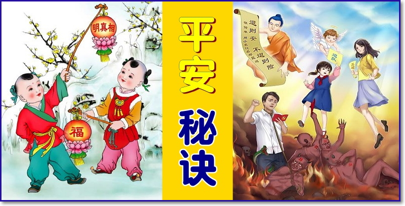
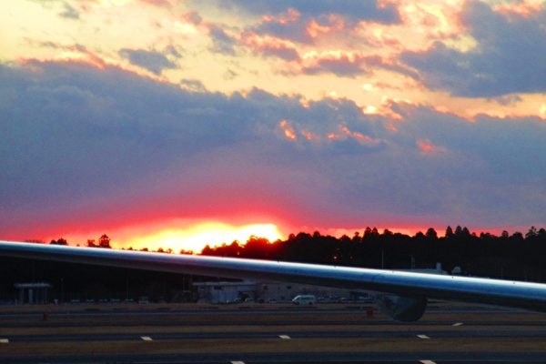
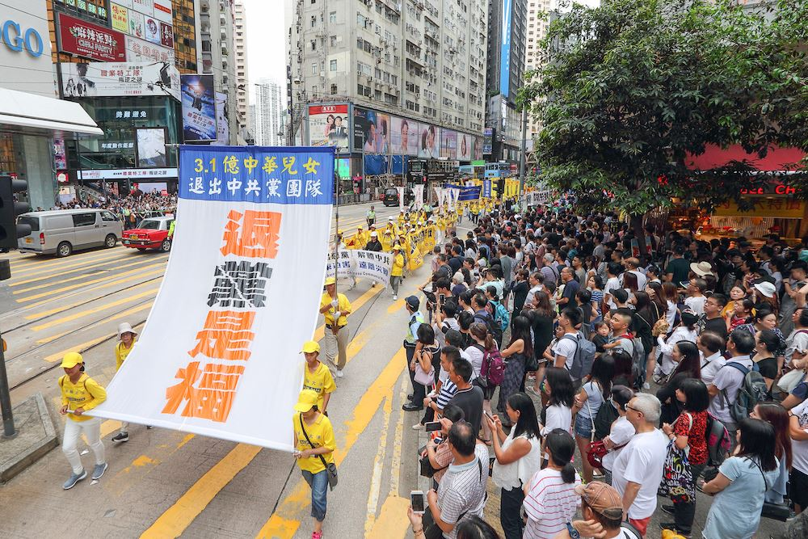
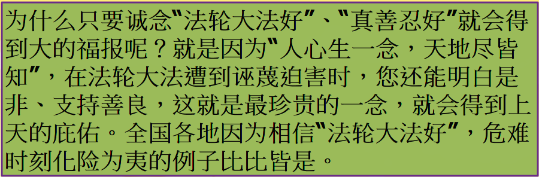
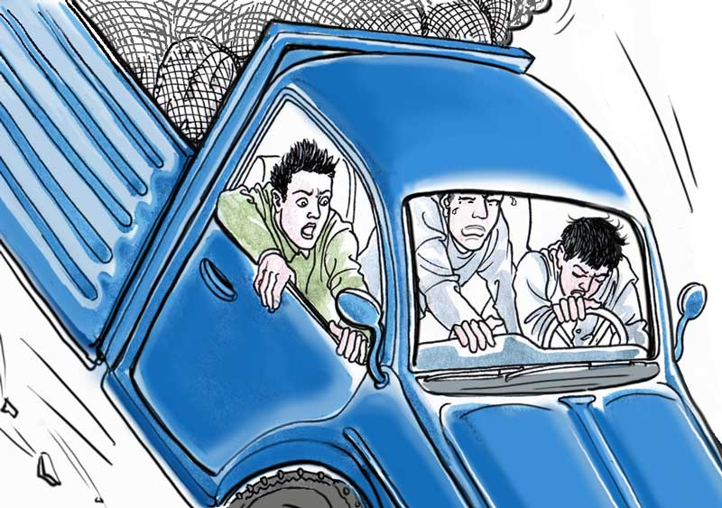
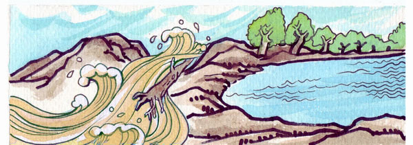
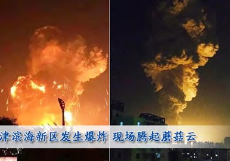

<h2>请收藏本网址，连上免翻视频即时IP    https://git.io/pamja </h2>
	

<h3>免翻视频 http://36.228.9.144</h3>
 
<h1><b><a href="https://github.com/awwkk/usdom/blob/master/forfor.md">红潮即将倾覆  天之将明</a></b></h1>

<table>
<tr>
 <td>
 <a href="https://git.io/pamja"> <h3>如何 “ 三退保命 ”</a>，<b>连上面→免翻视频 IP http://36.228.9.144 </b> →点 【三退大潮】--为什么要退党？ 可留言三退或用翻墙软件自己办理三退</h3></td>
</tr> 

<tr>
 <td>
 <a href="https://git.io/pamja"> <h3>如何 “ 三退保命 ”</a>，请点击翻牆网站  https://git.io/opopop  下载 { 翻牆软件 }→找 { 大紀元網站 }  ( http://www.dajiyuan.com ) 三退</h3></td>
</tr>
  </table> 

<a name=list><b>目錄</b>

<table>
 <tr><td width=640>
 <a href=#b>◆ 羊血为记与三退声明</a></td>
  <td width=240><a href=#b>正见网</a></td>
 </tr>

 <tr><td width=640>
 <a href=#b-1>◆ “三退”得福报：这老头儿越活越年轻了</a></td>
  <td width=240><a href=#b-1>正见网</a></td>
 </tr>

 <tr><td width=640>
 <a href=#b-2>◆ 发生在一个农村的几件神奇事</a></td>
  <td width=240><a href=#b-2>正见网</a></td>
 </tr>

 <tr><td width=640>
 <a href=#b-3>◆ 三退得福报 儿子转世来</a></td>
  <td width=240><a href=#b-3>正见网</a></td>
 </tr>

 <tr><td width=640>
 <a href=#b-4>◆ 在重大爆炸火灾中死里逃生的神迹</a></td>
  <td width=240><a href=#b-4>正见网</a></td>
 </tr>

</table>

<table>
 <tr><td width=640>
 <a href=#1>** 明真相三退得福报 果然真实不虚</a></td>
  <td width=240><a href=#1>大紀元新聞</a></td>
 </tr>

<tr><td width=640>
 <a href=#1-0>** 凡是“三退”的都躲过了这场灾难</a></td>
  <td width=240><a href=#1-0>大紀元新聞</a></td>
 </tr>

<tr><td width=640>
 <a href=#1-1>** 混凝土活埋得救 神速痊愈</a></td>
  <td width=240><a href=#1-1>大紀元新聞</a></td>
 </tr>

<tr><td width=640>
 <a href=#1-2>** 从撞烂的车里死里逃生</a></td>
  <td width=240><a href=#1-2>大紀元新聞</a></td>
 </tr>

<tr><td width=640>
 <a href=#2>** 地震前三天 及时下了死亡列车</a></td>
  <td width=240><a href=#2>大紀元新聞</a></td>
 </tr>

<tr><td width=640>
 <a href=#3>** 躲过地震大灾难 方知三退真的保平安</a></td>
  <td width=240><a href=#3>大紀元新聞</a></td>
 </tr>

<tr><td width=640>
 <a href=#4>** 地震中脱险的奇迹</a></td>
  <td width=240><a href=#4>大紀元新聞</a></td>
 </tr>

<tr><td width=640>
 <a href=#5>** 多亏“三退”保了我的命</a></td>
  <td width=240><a href=#5>大紀元新聞</a></td>
 </tr>

<tr><td width=640>
 <a href=#6>** 汶川地震山崩灭村 三退得福报逃出生天</a></td>
  <td width=240><a href=#6>大紀元新聞</a></td>
 </tr>

<tr><td width=640>
 <a href=#7>** 三退奇迹 一家人躲过车祸灾难</a></td>
  <td width=240><a href=#7>大紀元新聞</a></td>
 </tr>

<tr><td width=640>
 <a href=#8>** 天津某医院半身不遂病人神奇病愈故事</a></td>
  <td width=240><a href=#8>大紀元新聞</a></td>
 </tr>

<tr><td width=640>
 <a href=#9>** 玉清心：天津大爆炸虎口脱险的启示</a></td>
  <td width=240><a href=#9>大紀元新聞</a></td>
 </tr>

<tr><td width=640>
 <a href=#10>** 人间奇迹 穿越空间救命</a></td>
  <td width=240><a href=#10>大紀元新聞</a></td>
 </tr>

<tr><td width=640>
 <a href=#11>** 三退奇迹 得福报在日本大地震中幸存</a></td>
  <td width=240><a href=#11>大紀元新聞</a></td>
 </tr>

</table>

<table>
 <tr><td width=640>
 <a href=#a-0>◎ 【“三退”有福报】法轮功弟子给我指了一条生路</a></td>
  <td width=240><a href=#a-0>明慧网</a></td>
 </tr>
 
  <tr><td width=640>
 <a href=#a-00>◎ 屯里90%以上的村民都“三退”了</a></td>
  <td width=240><a href=#a-00>明慧网</a></td>
 </tr>
 
 <tr><td width=640>
 <a href=#a>◎ 明真相村民得福报、帮三退</a></td>
  <td width=240><a href=#a>明慧网</a></td>
 </tr>

 <tr><td width=640>
 <a href=#a-1>◎ 阴差阳错 躲过天津大爆炸</a></td>
  <td width=240><a href=#a-1>明慧网</a></td>
 </tr>

 <tr><td width=640>
 <a href=#a-2>◎ 洪灾中的奇迹</a></td>
  <td width=240><a href=#a-2>明慧网</a></td>
 </tr>

 <tr><td width=640>
 <a href=#a-3>◎ 长了眼睛的大火</a></td>
  <td width=240><a href=#a-3>明慧网</a></td>
 </tr>

 <tr><td width=640>
 <a href=#a-4>◎ 煤气罐爆炸　近在咫尺安然无恙 </a></td>
  <td width=240><a href=#a-4>明慧网</a></td>
 </tr>

<tr><td width=640>
 <a href=#a-5>◎ 遭遇爆炸　安然无恙 </a></td>
  <td width=240><a href=#a-5>明慧网</a></td>
 </tr>

<tr><td width=640>
 <a href=#a-6>◎ 当货车冲向了山崖 </a></td>
  <td width=240><a href=#a-6>明慧网</a></td>
 </tr>

<tr><td width=640>
 <a href=#a-7>◎ 工地塌方 被埋七天 安然脱险 </a></td>
  <td width=240><a href=#a-7>明慧网</a></td>
 </tr>

<tr><td width=640>
 <a href=#a-8>◎ 救命的一句话 </a></td>
  <td width=240><a href=#a-8>明慧网</a></td>
 </tr>

<tr><td width=640>
 <a href=#a-9>◎ 曾为中共卖命的姑父劝人远离中共 </a></td>
  <td width=240><a href=#a-9>明慧网</a></td>
 </tr>

<tr><td width=640>
 <a href=#a-10>◎ 去世之人托梦谢三退 </a></td>
  <td width=240><a href=#a-10>明慧网</a></td>
 </tr>

<tr><td width=640>
 <a href=#a-11>◎ 外科主任明真相三退　心脏病痊愈 </a></td>
  <td width=240><a href=#a-11>明慧网</a></td>
 </tr>

<tr><td width=640>
 <a href=#a-12>◎ 车祸后的醒悟：“三退”真的保命 </a></td>
  <td width=240><a href=#a-12>明慧网</a></td>
 </tr>

<tr><td width=640>
 <a href=#a-13>◎ 邻居全家“三退”得福报 </a></td>
  <td width=240><a href=#a-13>明慧网</a></td>
 </tr>

<tr><td width=640>
 <a href=#a-14>◎ “三退”真的保了女婿的命 </a></td>
  <td width=240><a href=#a-14>明慧网</a></td>
 </tr>

</table>

<table>
 <tr><td width=880>
  <h3 align="center"><a href="http://">退党、退团、退队（三退）方法  ( 可使用真名、化名、小名退 )</a></h3>
 

* 用海外邮箱发表声明 tuidang@epochtimes.com 

* 用破网软件登录 http://tuidang.epochtimes.com 

* 退党电话：001-416-361-9895    001-888-892-8757    

* 退党传真：001-510-372-0176    001-702-248-0599 

* 可先将声明张贴在适当的公共场所，以后再上网。 

◆提示：由于恐惧，中共对退党热线做了手脚，电话接通后录音告之：这是个空号，请不要打这个电话。请别上当、不要挂电话，很快能接通，请相互转告。 

◆您可能说我思想中早退了，我也不交党费了。那都不算数。因为在那个血旗面前向天发毒誓时，您是说把一生、把生命都献给邪党了。所以只有采取公开的方式退出，有行为的表示，才能除掉这么大的毒誓，才能在天灭中共的时候保平安！ 

</td>
 </tr>
</table>

<a href=#list><h4 align="right">回目錄</h4></a>
 

 
 
 
 <a name=a-00><h2 align="center"><b><a href="http://">屯里90%以上的村民都“三退”了</a></b></h2>
【明慧网】我们屯是一个七、八百人口的小屯，法轮功于1992 年从长春传出，我们屯常年坚持修炼法轮功的就有四、五十人。1999 年中共江氏集团迫害法轮功后，这个屯也是被邪党迫害最重的地方之一，从老人到小孩，几乎无一幸免地曾被绑架到看守所或被恐吓，七十多岁的就有好几位。然而，实实在在发生在屯里的事实，却让这里的百姓看到了“法轮大法好”。

<b>村书记：等我们有钱了，给法轮功盖个大炼功场房</b>

一天，一个村民去派出所办事，警察一看证件就说，你那屯炼法轮功的多吧？村民笑着说，是啊。接着，这个村民就告诉警察说：“法轮功，你不服气不行，这回你们再去屯里抓法轮功，全屯百姓都不让。”警察瞅瞅他问:为什么？这个村民娓娓道来：那一年冬天，雪下一米来深，大雪封道，送粮车出不了屯，还有两天送粮期限就到了，送不出去，政府就罚款。学生上不了学。我们村某某赶牛车送粮，车陷在雪里拉不出来，他死劲赶牛，差点把牛打死。

村书记在大喇叭里喊：共产党员、共青团员都出来清理道路积雪。可是无论怎么喊，没有一个党团员出来清雪。你看人家炼法轮功的，连老带小，年岁大的七十多岁，小的十几岁，都出来了，硬把道路清理出来了。

当各家送粮的车开在路上时，喜笑颜开，对还在清理积雪的法轮功学员竖起了大拇指。当时村书记非常感动，还特意手指着这条路留下了一张纪念照，并说，等我们有钱了，给法轮功盖个大炼功场房。

警察看着屋子里办事的村民，笑了笑没有言语。

<b>90％以上的村民“三退”了</b>

海外大纪元网站发表《九评共产党》后，一场风起云涌的退出中共邪党的“三退”大潮逐渐席卷大陆。屯里也掀起了“三退”热。

很多村民公开说：“我们相信法轮功说的都是真话，共产党迫害法轮功，电视上说的都是给法轮功造的谣！我们亲眼看到了这些人炼（法轮）功后身体好了，做啥事都为别人着想。”“我们屯没有（修炼法轮功的）人杀人和自杀的。”

一个说退（出中共党、团、队组织），大多数人都说退，有的村民主动到法轮功学员家里去要求“三退”；有的把自己的外地的朋友领到家里找法轮功学员给朋友讲真相，做“三退”。在这种形势下，连村书记也“三退”了。那个称自己是“铁杆党员”的姥爷也说：“看来共产党是完了，我也退出来吧！”目前，屯里百分之九十以上的村民都退出了邪党的党、团、队。村民外出打工都不忘了带上“法轮大法好”护身符。

村民们在法轮功中受益的事层出不穷：一次几个村民坐四轮车去城里早市卖菜。回来的路上车翻到沟里，几个人都平安无事；一个村民在中共迫害刚开始、搜法轮功书
的时候，他把法轮功弟子的书保护下来了。一天在建筑工地打工时，不慎从七楼掉下来，昏迷半个月后神奇地康复了。

<b>派出所警察说：“法轮功，得平反”</b>

每当全乡镇赶大集的日子，法轮功学员两、三个人一伙的就去集市上发法轮功资料，劝人“三退”保平安。

有一天，一个不明真相的人慌慌张张的跑到乡镇派出所，进门就对值班的警察说，“你们怎么不管呢，这法轮功（学员）就在集市上发资料。”这个值班的警察看看他笑了，说：“管啥管，我看等不到来年五月，法轮功就得平反。”这一幕正好被一个去派出所办事的法轮功学员的家属看到了。是啊，那些警察也天天看法轮功资料，都知道自己该怎么做了，谁还想替江泽民当替罪羊呢？

<a href=#list><h4 align="right">回目錄</h4></a>
 

 
  <a name=a-0><h2 align="center"><b><a href="http://">【“三退”有福报】法轮功弟子给我指了一条生路</a></b></h2>
 【明慧网】我叫王新，陕西省汉中市人。2014 年的一天，我遇到一位年迈的法轮功（法轮大法）弟子，她给我讲法轮功被迫害的真相，劝我退出中共的共青团、少先队组织。

我不知道共产党为什么要迫害法轮功，既然法轮功那么好，为什么要“围攻”中南海？为什么要去“天安门自焚”？我心中的疑惑被她一个个揭示开了，原来都是中共编造的谎言呀！我对这位老人肃然起敬。去中南海是为了上访，反映问题，“围攻”中南海是中共栽赃、诬陷的说法；“天安门自焚”是央视编导出来的，目的是嫁祸法轮功，煽动仇恨，制造迫害理由。中共执政这些年，运动不断，坏事做绝，滥杀无辜，造成八千万同胞死亡；对善良法轮功学员的迫害更是史无前例。我爽快地退出曾经加入过的共青团、少先队组织。她给我一个法轮功护身符，我象得了宝贝似的随时带在身上。

接下来发生的两件事，让我见证了明真相真的能得福报。

2016 年4 月的一天，我拉了一大卡车砂石行驶在乡间的水泥路上，忽然一只蜜蜂叮了我一下，疼得我一只手松开方向盘去抓蜜蜂。大卡车一下子冲到路边去，撞断了一棵树，接连又向前冲去撞断了路边的水泥杆，车翻了个底朝天。我被压到车底下，幸亏车的一侧在水泥杆上架着，惊恐之间，我使劲动了动身子，感觉到哪儿也不疼，我就从撞坏了的玻璃窗口爬了出来，除了胳膊被玻璃划破了点皮以外，可算是毫发无损。前来围观的人都说：这司机可能是有神保护。我心里明白，是我“三退”后法轮功师父保护了我，救了我的命。车也没有大的损伤，检修后继续使用。

2018 年正月，我拉了一卡车土正在下坡时，忽然刹车失灵向前猛冲，在拐弯处车侧翻在水泥路上快速地旋转着，车轮在地上擦得冒烟，胶皮臭味冲天，我双手死死抓住方
向盘，随着翻滚的车转得晕乎乎的时候，感觉有一股力量把我抛得远远的，清醒之后，只见路边的栏杆和花池被撞坏了，车也成了一堆废品，我却在二十来米远的地方安然无恙。在场的人都说我命大，我摸摸法轮功护身符还在身上。

我深深感谢法轮功师父两次救我，让我死里逃生，也谢谢法轮功弟子在如此严重的迫害中冒着危险告诉我真相，是法轮功弟子给我指了一条逃生的路。
 
 
 
 <a href=#list><h4 align="right">回目錄</h4></a>
 

  <a name=a-14><h2 align="center"><b><a href="http://">“三退”真的保了女婿的命</a></b></h2>
 【明慧网】2016 年腊月的一天，朋友请我女婿去喝酒。在酒桌上有两个人打起架来，女婿去拉架，被喝醉的人用凳子砸在他头上，当时就把女婿砸得昏了过去，
头上被砸的口子有四、五寸长，头脸都是血，整个一个血人，送医院抢救了三天才救过来。

医生说：“这么大的口子，而且中间的骨头都碎了，一小块骨头掉进了头腔里，只隔一层皮就掉进了脑子里。”当时人都说：“这个人完了。就是能活，不成植物人，也是个傻子。”

我听说后，到医院去看他，他也不说话，闭着眼睛。我对着他的耳朵说：“我经常给你说的法轮大法好 、真善忍好，你念了吗？” 他睁开眼睛，对我点了点头。我说：“那你就一直念吧。”女婿恢复得很快，在医院只住了二十多天就出院了。年三十他一回家，我就把师父的讲法录音送给他，让他听。第三天他就说：“我的头不痛了，医生说我只能躺着静养，现在我觉得啥事也没有了，我谢谢法轮功师父的救命之恩。”一个多月后，他就跟正常人一模一样了。

我的家人、儿子、女儿、女婿和亲友都知道法轮大法好，更知道“天安门自焚”是骗局，也早“三退”了。真心希望人们都能明白法轮功真相，看看奇书《九评共产党》，快快“三退”，就能得到上天的保护。
 
 
 
 <a href=#list><h4 align="right">回目錄</h4></a>
 

 
 <a name=a-13><h2 align="center"><b><a href="http://">邻居全家“三退”得福报</a></b></h2>
 【明慧网】我出生在干部家庭，是 2011 年退休后才开始修炼法轮功的法轮功弟子，我年轻时在潮湿环境下工作得了严重的风湿性关节炎，修炼法轮功后，风湿病
就彻底地离开了我。 

我以前的一个邻居，搬家后二十多年没有来往，两年前一次在路上遇到恢复了联系。她一直个人干，多数是推销产品（羊毛衫、保健品）。我们重逢后第一次吃饭，我就给她讲“三退”保平安的真相，她说看到香港法轮功弟子在旅游景点摆的展板了，听我一说才知道那展板上写的都是真实的，当即同意“三退”。她的生意在此以后也有了起色，连续几个月销售额在组里都是最高的。我告诉她这都是相信法轮大法好给她带来的福份。

她还把她丈夫、儿子（公务员）都叫来，他们提出了诸如：天安门自焚是怎么回事等疑问，我从法轮功的兴起讲到中共对法轮功的残酷的迫害，讲得很全面，他们认识到中共一直在用谎言欺骗民众，都同意“三退”。她还给自己的一些合作伙伴讲“三退”保平安的真相，劝退了近十个人。

不久他们一家人就在外地建立了自己的科技公司，才一年多就和民航、银行、高速公路等行业有了业务往来，现在全国三十多个省（市）轮流培训，年营业额已经几千万了，忙得不亦乐乎。她知道这一切都是法轮功的恩惠，还请了《转法轮》（法轮功的主要著作）看。
  
  
  
<a href=#list><h4 align="right">回目錄</h4></a>
 

   
  <a name=a-12><h2 align="center"><b><a href="http://">车祸后的醒悟：“三退”真的保命</a></b></h2>
  【明慧网二零一二年七月十七日】在法轮功学员坚持不懈的讲真相中，越来越多的世人明白了真相，看清了中共及江××的邪恶，更是看到了法轮大法的美好，佛法的慈悲召唤着这些有缘人，他们在明白了真相后，纷纷“三退”，得到了福报和善果，从车祸中走出劫难。

<b>（一）</b>

郑芝香是山东省平度市东营村人，今年四十九岁，以前对大法不理解，对真相也不太认同。而她丈夫了解大法真相，也主动的退出中共邪党组织。

二零零五年十月底，郑芝香和丈夫开车往龙口南山运大白菜（她妹的饭店），开车走到招远玲珑金矿上大坡时，车不知什么原因失灵，急速向后退，当时二人惊吓，心想这可坏了，要是车退到大沟里，可就没命了。正想害怕时，瞬间车连菜带人歪倒在路边。郑芝香当时被车压得臀部好久不敢动弹，不敢走路，有好心人和她把车修好，直到走到饭店，才觉得轻松点，而她丈夫却毫发未伤。

郑芝香觉得奇怪：同坐一辆车，丈夫却平安无事，她心里后怕，当坐下来她对周围人和她妹妹说车失灵的过程，她从内心发出的心声说：我也应该三退了！看人家（指她丈夫）三退了，得福报了，我要不跟着沾光，后果不堪设想。在她跟前的妹妹听了这件事，也同意三退了。

<b>（二）</b>

崔永娜是山东省莱西市武备镇高家庄村人，今年二十七岁；吴余佳是山东省龙口市黄县奄下吴村人，今年三十岁。二零零五年，二人在龙口南山一家饭店打工，二位青年为人好、勤快，了解大法真相，还经常帮助法轮功学员发真相资料，并做了三退。后来，二人结婚了。

二零一一年三月底的一天，二人开车从龙口回娘家，第二天在返回龙口的路上，为了躲一辆摩托车，撞在路边的一棵大树上，他们连人带车钻到路旁的沟里，树都被撞倒了，只有车前面的玻璃没碎，其它全碎了，车都折叠起来，二人已被压在车的底下。当路众人走到跟前时，已看不见人，就凭眼前的景象推断：人是百分之百的完了。

就在众人七嘴八舌的议论的时候，吴余佳从车底招呼人把他拉出来，崔永娜也被拖出来。当时，吴余佳腰部摔得不敢动，崔永娜当时摔的昏过去，拉到医院时才醒，经检查锁子骨断了，吴余佳腰骨裂纹，十天后出院了。过后，他们真的后怕。吴余佳对家人说：是我们了解真相、三退得了福报，是法轮大法救了我们。感谢法轮大法给了我们第二次生命。

崔永娜在还没完全康复时，一天到山上玩，不小心掉到山上的枯井里，只是把腰闪了一下，其它部位没有一点伤。

二零一一年八月十六日，已身孕四、五个月的崔永娜身体很虚弱，她从自家的楼上，从顶滚到底，心想这下可坏了，孩子可能受到影响，她爬起来后没有异常反应，一切正常。二零一二年正月她顺利产下一个胖胖的女孩，孩子非常健康可爱。

  
  
  <a href=#list><h4 align="right">回目錄</h4></a>
 

 
<a name=a-11><h2 align="center"><b><a href="http://">外科主任明真相三退　心脏病痊愈</a></b></h2>
〔中国大陆来稿〕昨天亲戚家家庭聚会，见我去了，亲戚高兴得不得了。席间他开心的对我说，他的心脏病全好了，已经不吃药了。还挽起袖子当场让别人试脉搏，感激之情溢于言表。我发自内心的为他高兴。 

事情的原由是这样的，我的亲戚是一家大医院的外科主任，医术精湛，为人也不错，可就是对大法没有正念。我经常给他讲真相，送他小册子和神韵光盘。由于受邪党毒害，他都很抵触，但我始终没有放弃。慢慢地他由反对转而接受，对大法也有了一定的了解，对我的态度也好多了。 

年前，这个亲戚检查出有严重的心脏病，靠吃药维持，精神压力很大，已经联系好北京的医院准备去做手术。我遇到他，真诚的对他讲起“三退保平安”，讲到了邪党对中国人的毒害，也讲到了诚念“法轮大法好、真善忍好”这九字吉言的神奇和大法的超常美好，劝他三退。讲完后，他终于点了点头，说：“你帮我把那个邪党退了吧，还是平安要紧，共产党太腐败了，不给它卖命了。”当时他全家都在场，全家人都跟着痛快的做了三退。我为他们全家人的得救由衷的高兴。

由这件事我认识到，救人需要有耐心。不能因为一次劝不退就认为这个人不行了，遇事多从自己心性上找原因，有融化钢铁的慈悲，就能正念救了人，世人都有明白的一面，都在等待着我们救度。只要我们扎扎实实的做到位，总会“柳暗花明又一村”。

<a href=#list><h4 align="right">回目錄</h4></a>
 

 
<a name=11><h2 align="center"><b><a href="http://">三退奇迹 得福报在日本大地震中幸存</a></b></h2>
  

 
 
法轮大法慈悲普度众生，知真相三退保命得福报。 (摄影:王嘉益 / 大纪元) 
  

在去往超市的班车上，在我前面坐着一位五十岁左右的妇女。超市到了，我们都下车了，她说她是售楼发单员，我着急进超市，可她缠着我非要带我去看房子。我说：“妹子，我和你说个事，你听说过三退保平安的事吗？”她立刻变脸说：“那是法轮功搞的，咱们不谈这个。”然后，还要带我去看房子。我说妹子我给你讲一个真实事吧。
 

今年某月某日，我去参加朋友女儿的婚礼，朋友给我们讲述这样一件事情：“女儿在大学时处了一个对象，我们俩都不同意，女儿就和对象去了日本东京工作，一次他们驾车外出，途中他们下车买东西，遇到一位妇女，知道他们是中国人，就给他们讲三退保平安，全球的退党大潮，法轮大法洪扬全世界，并讲中国大陆发生的“中国共产党亡”的藏字石，告诉他们记住法轮大法好会保平安，等等，他们同意三退，就继续上路，途中车子突然剧烈摇晃并伴有轰轰的声音，顿时天翻地覆，瞬间女儿想起相信法轮大法好会保平安这句话，他们念“法轮大法好！求大法师父救救我们”。当一切都静止下来时，他们慢慢地从倒著的车中爬出来时，惊呆了，四周一片狼藉，过后，他们知道是发生地震并引发了海啸。女儿在网上和我们讲述了这些事。” 

朋友到单位把女儿经历此事讲给同事们听，说者无意听者有心，其中有一个叫李刚的和他说：大哥你说的我可信，麻烦你，让你女儿给我把团退了吧。朋友愣了一下说，好。

事隔多日，李刚来找朋友，见面就说我请你吃大席，是你给了我保平安的信息，我才躲过一大难。他说：“事情是这样的，前几天我已经买好去某市的动车的火车票，可在临走之前，突然肚子疼，我挺不住，赶紧把票退了，去了医院，医生说没事，吃点药吧，事隔几天看电视新闻，动车出事了，列车相撞，有的车厢栽到大桥下，我一看，我退的那张动车票正是这趟车的，栽下大桥下的车厢很可能就是我买的那节车厢。我的妈呀，太吓人了。看完新闻，我一宿没睡觉，一个劲地后怕，那天我不肚子疼，我就上西天了，我的亲友都说我命大，看来三退真保平安啊，我才退几天就躲过场大难。”

事情讲完了，售楼发单员对我说：“大姐，你讲的太好了，我听明白了，谢谢你把这么重要的事情告诉我，我叫王某某，你给我退团吧。”说完我们分手了。

几个月后，我和另一个法轮功同修乘共交车去某某地，在车上意外地遇见了售楼发单员王某某，她主动热情和我打招呼，并和我说：“自从上次遇到你以后，我的工作业绩可好了，我的工资都比别人高，而且谁都贷不来款，可是我就能贷来款，别人都纳闷，怎么回事呢？我干什么都很顺利，这回我真体会到了法轮大法好啊！”最后她说你要注意安全。

我非常感慨，我想那天我要不给她讲或她不爱听就不讲，她就不能得救，我就有罪啊！我心中呐喊著，迷茫的世人啊！不要拒绝大法弟子给你讲的真相啊！真相是你期盼已久的福音啊！＠

<a href=#list><h4 align="right">回目錄</h4></a>
 

 
  <a name=a-10><h2 align="center"><b><a href="http://">去世之人托梦谢三退</a></b></h2>

 文／河南大法弟子
 

  

 
 
生命明白的一面虽被层层迷障掩埋，仍未熄灭，急想要了解生命的真相，为此等千年。（图：大纪元） 
  

 
 【明慧网二零一三年八月二十七日】一九九七年，我认识了教我高中英语的老师──田老师。由于初次的英语交谈很愉快，以及后来我在市级、国家级英语竞赛中和高考中的出色表现，田老师对我给予很高的期望，也很关心我的生活。高考后，我到另一座城市上大学，得知我家经济一直窘迫，他从微薄的工资中抽出二百元寄给了我，使我很感动。我也很尊重他，每年寒假，只要回家乡，必然备上礼物去看望日渐衰老的老师。我们师生关系亲密，简直像一家人一样。

一九九九年，中共江氏集团设计栽赃并迫害法轮功，神州大地顿时乌烟瘴气，血雨腥风。二零零七年初，我开始修炼法轮大法后，大法不仅使我身心净化，更让我明白了因缘果报。深知这么好的度人大法遭受奇冤，我就几次向田老师讲真相。但可惜，这个被中共毒害几十年，在中共各种运动中被整怕的老人，固执的拒绝了解真相。眼看着这个有着三个党员的家庭将面临失去救度的机会，我干着急却又不知如何使他们明白。

工作以后，我变得繁忙了，有时只能给田老师打电话拜年。二零一二年，由于电话号码变更未能及时通知他，没想到就在新年前半个月的一天晚上，他带着焦急忧怨的神情，托梦来问我说：“你去哪儿了，怎么还不来看我呀？”我从没有梦到这样的事，心想可能是他那边有什么事，就元神离体叫我去找他。新年那天，我想先给他打电话拜年，顺便和他约好方便的时间再登门拜访。不料，一连几通电话，他女儿都说老人睡觉了。我感觉不对劲，就在访客最少的初五那天去看他。一进院子，气氛就不好，全家人笼罩在一片愁云惨雾中。原来田老师身体罹患各种棘手病症，内脏几乎没有一块好地方了，已有大半年卧床不起了。北京、上海各大医院跑了个遍，最后家人甚至带他去河北某气功大师那儿，也没看好，无奈只得返回家，做好了最后的准备。看着形容枯槁的老人，家人整日愁得唉声叹气。

家人说他几个月前就念叨我，自己的儿女也没见他这样一天几遍的问。我明白了他这么着急找我一定是自知将不久人世，想在临走前了解真相。于是，在接下来的几天，我和妈妈同修每天到他家给他讲真相、放《风雨天地行》、神韵、给他读法。他有次指着中共迫害法轮功的真相节目，费力的说：“这都是真的。”我们点点头，告诉他：“无论是谁或哪个组织迫害了度人的佛法都要被清算的，那将是生命无比悔恨的大罪。中共迫害正法，残害众多无辜生灵，它的解体是天意，它解体的那天就是党团队员永远失去未来的时候，为了你的将来，你愿意退出中共吗？”由于太过虚弱，他只能耷拉着脑袋，微微点下头。我想到生命要自己明确表示自己的选择才能真正被救度，为证明他确实是意识清楚做的决定，就又郑重问了他一次，他连点三次头，并说：“我愿意退。”我们很高兴，一个原本固执的有缘生命终于分清正邪，摆脱了为中共邪教做陪葬的厄运了。而几天的陪护，他的家人也因了解大法，声明退出了邪党组织。

在他明白真相三退后的一星期，他就去世了。妈妈同修说：“他就是为了听真相才撑到现在的啊。”我们帮忙处理了后事，给他剪了些纸钱就回家了。

三天后的凌晨，他托梦给我。看起来脸色比生前变白了，衣服整洁一新，很庄重的到我面前，深深鞠了一躬，感谢我给他讲真相做三退，使他有了现在的生活。他告诉我如今他生活得很好，就是他那边物价太高了，说花了很多钱只能买一小簸箕玉米面，边说边拿给我看。还领我四处看了他的居住环境，好似世外田园，绿化面积很大，环境雅致，整洁清新，还有围着庄稼的栅栏，一派祥和的田园风光。我想他是去了一般常人去世后可望不可及的好地方了，想如今社会业力滚滚，常人心恶业大，哪有不修炼就免遭地狱之苦的？正是由于他在世间的最后一刻能明真相，就能得这么大福报，他能不高兴吗？

我把这个梦中见闻说给妈妈同修。她回想了一下，说当我在梦中呓语时，她正在打坐，当时她就感觉有什么东西进屋，原来是田老师感谢来了。我想我们是修正法的，阴阳两隔，去世之人一般不敢进这个场的，一定是经过师父同意，放他来的，让我再一次见证元神不灭的法理，也使我更加坚信劝人三退是真的从根本上挽救生命。

其实，和田老师在世间的师生之缘，不知是他经过了多少世的接缘才能换来今日听闻真相的机会。他曾经说：“我教一辈子书，就是只教你一个学生，我也值了。”这是生命明白的那面对大法弟子履行誓言，挽救他们的期盼心声，我们一定按照师父的要求，做好三件事，不让师父和众生失望。

最后重温师父歌词：《洪吟三》〈话有缘〉，希望有缘之人能体悟到师父的慈悲：

话有缘

人海茫茫相遇难

萍水一笑缘相连

静下心来听真相

你为此言等千年

救难大法已在传

句句天机是真言

 
 
 
<a href=#list><h4 align="right">回目錄</h4></a>
 

 
 <a name=b-4><h2 align="center"><b><a href="http://">在重大爆炸火灾中死里逃生的神迹</a></b></h2>
【正见网2013年09月19日】

2013年6月3日在吉林省德惠市宝源丰禽业有限公司，发生了一场震惊中外的因大爆炸引起大火造成的重大伤亡事故。官方网站公布死亡130多人，伤者很多。就在这场惨不忍睹的大火中，有一位奇迹的生还者，再一次见证了法轮大法的神奇，和三退之后人们真的是能保平安的真相。

我侄媳妇就在这家公司上班多年，任一车间班长，车间在二楼，工人48名。2013年6月3日上班刚点完名不一会，大爆炸发生了！大火卷着浓烟滚滚扑来，霎时间什么都看不见，就在此时她觉的自己被一股强大的气流包裹着，从离地面2米高的窗户冲出去平安落在楼下地上。这2米高的窗户没有梯子根本上不去，又是二楼，生命却能安然无恙，用我侄媳妇的话说：不知道咋出来的，就是觉的有东西包着才得逃生保命。这不是靠人力能做到的，是得到了神佛的护佑哇，三退真灵啊。这场大火夺去了那么多年轻的生命，她姑姑家的儿媳，和舅舅家的儿媳都未能幸免。

看到失去亲人的家人们悲痛万分的样子，侄媳一家人是万分感激法轮大法师父的救命之恩。

那是两年前侄媳妇来我家串门，我给她讲了真相，她明白了，并退出了团队。如今在大火中被救更证明了三退保平安的真相，通过这件事，使我更明白，更加坚定了大法弟子的责任与使命，多救人， 快救人！

请师父放心，我会越做越好的。最后在这举国欢庆中秋佳节之际，我代表侄媳妇全家向慈悲伟大的师尊叩拜！恭祝师尊中秋快乐！

谢谢慈悲伟大的师尊！

<a href=#list><h4 align="right">回目錄</h4></a>
 

 
  <a name=10><h2 align="center"><b><a href="http://">人间奇迹 穿越空间救命</a></b></h2>
 

 
 
大法大法好（fotolia） 
  

 
<b> 谁信谁得福报</b>
 

一对幸运逢凶化吉幸免于生离死别危机的夫妻，向人讲述了亲历的神奇经历－－“三退”保命：

前几天四位年轻人一起去上班，在马路上边走边聊天。突然，一辆大卡车直奔他们而来，当场撞死两位，一位重伤拉医院抢救。另一位及时的闪到了一边，幸运地躲过了这场车祸保住了性命。这位年轻人恰恰是明白了大法真相且做了“三退”（退出中共的相关组织共产党、共青团和少先队）的。 

事发时，这位年轻人的妻子在家，突然有种按捺不住的焦虑、烦躁和恐慌不安。她赶紧去想大法弟子给她讲过的那句保命的话，可是越着急越想不起来，急得团团转，最终，脑子里闪出“法轮大法好！真、善、忍好！”于是她反复的默念，心逐渐平静了下来。

待她丈夫回到家向她诉说发生的那悲惨的一幕时，妻子发现那正是自己在反复默念“法轮大法好！真、善、忍好！”的时候。丈夫说：“是法轮大法师父救了我的命，因为我做过了‘三退’，保平安了”，夫妻俩这时对大法全信服了。夫妻二人噙著热泪合十千恩万谢李洪志师父的救命之恩，感谢大法弟子冒着生命危险苦口婆心向世人讲真相。

于是，这夫妻二人找到一位法轮功修炼人B述说了事情的经过，并表示决心要修炼法轮功，请求法轮大法弟子B给他们请两本宝书《转法轮》。

当然，两本《转法轮》很快就递到了这一对年轻夫妇手中。二人非常感激，并对大法弟子说：借此机会向世人说句肺腑之言，大法弟子冒着被抓、被关押被抄家及倾家荡产，甚至失去生命的危险讲真相救度世人，实在是太了不起了！事实证明你们讲的都是真话、实话，谁信谁得福报啊！＠

责任编辑：古容

 

<a href=#list><h4 align="right">回目錄</h4></a>
 

  
  <a name=9><h2 align="center"><b><a href="http://">玉清心：天津大爆炸虎口脱险的启示</a></b></h2>
 【大纪元2015年09月13日讯】在突然降临的大灾大难面前，人的生命显得渺小而脆弱，游离在生死间，无论穷富，离去留下，似乎都听天由命。
 震惊世界的8‧12天津大爆炸，瞬间把天津滨海新区炸成一片火海。爆炸点周边数千户居民伤亡惨重；紧邻居民区的一幢公安局大楼的警察集体人间蒸发；上百名消防队员葬身火海员。这一切是在瞬间发生的，没有先兆，没有预警，夺命的横祸从天而降。 

近日有两条报导，两个在8‧12大爆炸中“虎口脱险”的故事，令人惊叹，引人深思。故事的主人公曾与死神擦肩而过，但有惊无险。因为是真人真事，而且就发生在刚刚过去的天津大爆炸期间，所以更显神奇。下面是两位作者亲述的故事。 

<b>河北省无极县一位货运司机的自述故事</b>
 

8‧12前我开车到南方一家化学公司拉货。装上物资出门检查时发现装错了货，只好又卸下来重装，因此耽误了两个小时的行程。自己怎么会装错了货呢？当时我实在想不通，拉货多年这还是第一次。

8月13日凌晨一点半到达天津，听说两小时前，天津塘沽岗发生大爆炸。再一问，更吓一跳！爆炸涉事公司，正是我要卸货的瑞海国际物流有限公司。太后怕了！如果当初我没装错货，就正好赶上爆炸时间，那一切就完了。

当时我就知道是法轮大法救了我，大法师父救了我。我姑姑是法轮功学员，经常给我讲大法的真相、大法的神奇，我有时间也听大法师父讲法，我的两个孩子每天晚上睡前也要听一会，虽然我算不上真修弟子，但一家人都相信法轮大法好。
 

<b>河北省唐山市丰润区一位生意人的自述故事</b>
 

8月12日，我和两位朋友一起到天津港瑞海物流公司附近的一家公司催讨债务。不巧的是公司经理外出，要晚上才能到家，我们只好在附近找个宾馆先住下，等第二天再说。

晚饭后九点多钟回到宾馆准备休息时，我家里来电话，说我那个不满一岁的儿子突然闹得很厉害，得看医生。我妻子如果抱儿子去医院，家里留下个五岁的女儿实在不放心，要我马上回家。我想钱再好也没有儿子重要，于是退房往回赶。回到家，发现儿子不闹了。当时还为放弃了催款有些惋惜。

第二天得知，昨晚我们才离开宾馆一个多小时后，附近的瑞海化学品仓库就爆炸了。我们住宿的旅店是重灾区，而我们逃过了一劫。过后想想，如果是其它别的事情，我也许就不会回来了，偏偏是我的宝贝儿子生病，我是一定要立即赶回来的！

再深一层想想，这是谁的巧安排，为什么让我逃离此劫？只有神佛！神佛保护好人有的是办法。我想起今年3月6日，在我儿子大满月的宴席上，我父亲的朋友杨大伯给我讲了法轮大法的真相。他还告诉我：“天灭中共”是天意，谁也挡不住。只有真心退出党、团、队组织，才能保平安。“

大伯讲的实实在在，我想想都是真事儿，于是就用真名退出了团、队组织。

这两位幸运儿之所以能在天津大爆炸中虎口脱险，是因为“顺天意 躲劫难”。河北无极货运司机，听了真相，坚信大法好，由此给他带来福报，可谓“善待大法一念，天赐幸福平安”。河北唐山丰润生意人，听了真相后用真名退出了团、队组织。“三退保平安”，此言不虚，如同上了生命保险。8‧12虎口脱险后，二人不再后怕，了悟神佛的慈悲，深感佛法无边。他们讲出了自己的生死故事，给了我们听故事的人很多弥足珍贵的启示。

责任编辑：朱颖

 
 <a href=#list><h4 align="right">回目錄</h4></a>
 

 
 
 <a name=8><h2 align="center"><b><a href="http://">天津某医院半身不遂病人神奇病愈故事</a></b></h2>

 
 
香港各界2018年声援退出中共组织大潮，游行队伍吸引许多民众和大陆游客观看。（潘在殊/大纪元） 
  

【大纪元2015年11月13日讯】明慧网十一月十三日报导，天津一位法轮功学员最近亲身经历的一位在医院坐轮椅打吊瓶半身不遂男士在退党后，当场可以走路的故事。医院的其他人亲眼目睹这一幕后称赞：真能走了，太神奇了。 

天津一位法轮功学员最近一天晚上到医院向人讲述法轮功无辜被迫害的真相。院子内有一个男病人坐着轮椅还打着吊瓶，身边有四个年轻人护理。 

法轮功学员上前搭话，询问病人的病情。这个男子说自己酗酒喝得半身不遂了。

法轮功学员问他，听说过“三退”保命吗？“三退”就是退出中共的党、团、队组织。他说，他入过党，但不想退。

法轮功学员就给他讲了中共暴力夺权后对中国人民犯下的一系列的滔天大罪，六十年中就造成八千万国人死于非命，超过两次世界大战死亡人数的总和；特别是迫害法轮大法修炼人，活摘法轮功学员的器官，高价出售牟取暴利，犯下了这个星球上从未有过的罪恶，天理不容。上天一定要灭它。法轮功学员告诉他：“如果入过党、团、队组织，宣过誓，当天灭中共时，你不退出就会成为它的陪葬品。”

法轮功学员说：你现在身体都这样了，还把著中共不放，它能救你吗？赶快退了吧，退了会得到神佛的护佑，病会好起来的。“怎么样，还是退出来吧？”

这时他同意了。这位法轮功学员帮他和在场的另外两人年轻人都取了化名退出了中共党、团、队组织。

这时，其中一个小伙子突然指著病人说：“你站起来走走。”

法轮功学员接过话头说：“你站起来，一定能走的，因为你真正明白了真相，会出现奇迹的。不用别人扶，自己走走看。”

对方不太相信，用迷惑的眼神看看法轮功学员，法轮功学员肯定地对他说：“你能走！”

于是，这位坐在轮椅上的他试着站了起来，一个人给他拿着吊瓶，他慢慢走下轮椅，一步一步的走起来，在场的人都给他鼓劲，喊：“走！走！走！真能走了，太神了！”

只见他眼里含着泪水喃喃说：“我能走了，我能走了！”这样一直走了大半圈，有几十米远，这才又坐到轮椅上。

法轮功学员告诉他：一切都是我师父（法轮功创始人李洪志先生）给你做的。师父救了你，这回你相信大法是佛法了吧？

在场的几个人当时就让法轮功学员给他们演示法轮功的几套功法，说想学法轮功。

第二天，这位退党的男士就出院了。
 
 责任编辑：高静

<a href=#list><h4 align="right">回目錄</h4></a>
 

 
<a name=b-3><h2 align="center"><b><a href="http://">三退得福报 儿子转世来</a></b></h2>
【正见网2011年12月26日】 

卢老师是我的邻居，在东城小学任教，丈夫是大学教师，只有一个儿子，在烟台大学上学。这是一个小康之家，生活美满、幸福。 

“天灭中共，三退保平安”的信息已深入千家万户，觉醒的人们纷纷退党退团退队。卢老师夫妇都是党员，儿子是团员，他们听不進多次的劝说，一直坚持不退。

俗话说：天有不测风云，人有旦夕祸福。卢老师的儿子在烟台海滨游泳时，被海浪卷走，淹死在大海里。这一噩耗就象晴天霹雳，使卢老师一家陷入万分悲痛之中，多少天都迷迷糊糊，疯疯癫癫。等他们渐渐平静、恢复正常家庭生活之后，我再一次向他们讲了真相，他们比较顺利的退出了恶党，并代表去世的儿子退了团。

一天早晨，卢老师来到我家，悄悄的对我说：“我今天夜里做了一个奇怪的梦，不知是真是假，你给我解说一下。我梦见了我的儿子，音容笑貌和生前一样，只是瘦了许多，他说：多谢妈妈替我退了团，我刚来到这边时没吃没喝的，现在好了，处处有人照顾。阎王爷说我阳寿未到，是被邪恶害死的，父母已经被救度，不久就让我转世回家。过一段时间，如果有人送孩子给你，那就是我。”我听了高兴的对卢老师说：“这梦是真的，恭喜你，卢老师。”卢老师听了高兴得不知如何是好。

大约两个月后，卢老师的一个远房亲戚生了一对双胞胎男孩，老大总是爱哭，怎么哄都没有用，嗓子都哭哑了。一天，有一位游方僧人路过这里，对他们说：“这孩子是你们一个卢姓亲戚的孩子转世，上天让他回老家，你们是养不活的，快送去吧，再拖几天会有危险的。”鲁西南的老百姓古朴善良，信神敬天，一家人都相信僧人的话，第二天便将孩子送到卢老师家中。从此两家远亲便成了近亲，经常你来我往，比过去亲热十分。

作者近日写这篇稿件时，卢老师转世的孩子已经三岁了，入了幼儿园，她丈夫这几年官升两级，成为处级干部。三退保平安、得福报，他们家就是一个实例。假如2012年有什么大劫难的话，我相信他们一定会平安度过的。

<a href=#list><h4 align="right">回目錄</h4></a>
 

 
 <a name=b-2><h2 align="center"><b><a href="http://">发生在一个农村的几件神奇事</a></b></h2>
【正见网2011年12月12日】

在辽宁某一农村有这么一个家庭，老爹八十来岁得脑血栓，几年不能生活自理，妻子身体多病，还动不动不分时间地点就迷糊过去，不醒人事！连做饭洗衣都做不了。自己一天又得干农活还得照顾这个家，四十来岁就象五、六十岁的人一样。后来他妻子炼了法轮功，不久身体好了，不仅能做家务活，照顾老人，还能骑自行车去十五里地外去赶集和到妹妹家串门。

第二件事是妻子虽然好了，但多年积蓄被老人和妻子的病都用光了，还欠了一些外债，为了还债又包了一个养魚池，起早贪黑的骑个摩托车来回跑。前年夏季一天下午四奌多钟，急忙回家帮妻子侍弄莱园地，急行中从巷子里跑出一个小孩，为躲小孩连人带车一下子摔在路旁沟里，摩托车压在身上，费很大劲在别人帮助下，爬起来，把车弄到马路上，人和车一点也没受损伤。围观的人都感到奇怪！到家妻子说你三退了，身上带着护身符，是大法保护了你，师父保护了你。他忽然明白过来，对着师父法像深深行了三个礼，谢谢师父和大法救了他，表示今后也要学法!

第三件事是他小弟弟零五年春，用四轮拖斗车往地里送糞，到地头拐弯时车脱钩，前车立起来把人拽到沟里，面部朝下趴着。还没等反应过来，车已砸下来掛勾正砸到屁股肛门边上，砸出一个一寸深二寸长一个洞，挖掉鸡蛋大一块肉，当时就昏死过去了！后来有过路的车把他救起，给他家打电话，哥哥和邻居去几个人把他送到省医院。医生检查后问明情况，说无大碍，都是肥肉，没伤筋骨，年轻人很快就能长平。可是你却捡了一条命！如果你脸朝上掉下去，车正砸在你的阴囊上，睪丸砸坏，你就一命呜呼了，谁也救不了你！你家祖上积德了。他说我退团退队了，我带着护身符呢。是大法和大法师父救了我，我感谢大法师父，他哭了！医生和去的人都说法轮功真神奇！法轮功太好了。他很快就好了，一切恢复正常。

他们家的几件亊对全村影响很大，全村人对炼法轮功的都很佩服和尊敬，有的找本村大法弟子办三退和要护身符!

<a href=#list><h4 align="right">回目錄</h4></a>
 

 
 
 <a name=b-1><h2 align="center"><b><a href="http://">  “三退”得福报：这老头儿越活越年轻了</a></b></h2>
 【正见网2017年11月08日】 

父亲十九岁参军直接就被拉上了越南战场，并入了党。他们是铁道兵，抢修铁路的时候，根本离不开，有的人累极了直接倒在水坑里就睡着了。父亲从小家庭条件很差常常饿肚子，而且他又是我奶奶四十多岁时才出生的，所以身体不那么强壮。在战争那样残酷的条件下，他得了胸膜炎，高烧不退，昏迷了一个星期，医生从他的胸腔里抽出了一脸盆黄水。部队卫生员都以为他活不成了，没想到父亲却奇迹般的活过来了。但是从那以后，父亲却落下了过敏性鼻炎的后遗症：不断地流鼻涕，不停地打喷嚏，尤其是春天的时候就更厉害了。 

上中学的时候，我们家住三楼，每次父亲一到楼下，母亲就说：“准是你爸回来了，老远就‘阿嚏，阿嚏’地报信了。”到了老年，父亲打喷嚏就更频繁了。母亲常提醒他：快拿手绢擦擦鼻涕，人老了不能惹人嫌啊！

退休后，春天的时候爸爸就不能出门了，妈妈戏称他是“害羞的大姑娘”不敢出“闺房”。因为活动少，体重急剧增加，肚子凸起像怀孕了七八个月的妇女；因为胸部弱，背也有点驼。用妈妈的话说“他整个身材是九曲十八弯！”血压也高，接近二百。母亲很是担心，建议他去跑跑步，减减肥。他说：“不行啊，年轻的时候肌肉有弹性，跑起来往起颠，老了肌肉往下坠，跑不动了！”

二零零七年在他过生日的那一天，丈夫（同修）特地请假赶了七八百里路回去为他过生日，他老人家很是感动，丈夫趁机给他讲“法轮功”真相，告诉他，“天安门自焚”是江泽民为了迫害法轮功而故意导演的一出悲剧，那些自焚的人根本就不是炼“法轮功”的，并给他分析了焦点访谈中所谓的“天安门自焚现场”的种种破绽。父亲恍然大悟：“他妈的（在中共邪党部队里养成的口头禅）江泽民这么坏，真不是东西！难怪老百姓都骂他是‘ 江贼民’，并编了一个顺口溜：江泽民像星星，吃喝嫖赌数不清！”同时丈夫（同修）还给他讲了共产党的历次运动都是在不停地整人、杀人，害死了八千万中国人。这些父亲也都亲身经历过。明白真相后父亲愉快地做了“三退（退党）”。

 “三退”后，父亲竟然主动提出要和母亲一起去跑步。每次跑到两公里外的那座立交桥头的时候，父亲都会吐出一口浓痰来，每天都是，准得很。大约过了一个月的时间，有一天，母亲突然发现听不到父亲打喷嚏了，再一看他的鼻炎也奇迹般的消失了，一量血压也接近正常了，而且佝偻了半辈子的胸脯也挺起来了。

母亲可高兴了，打电话告诉我：“你爸现在腰板也直了，鼻炎也好了，血压也不高了，再也不用像以前那样像‘大姑娘’一样躲在‘闺房’里不敢出门了。出去散步，人家都说，这老头儿越活越年轻了。”

现在，我回娘家的时候，父母什么也不让我干，并说：“平时工作忙，好不容易有点时间，快去看你的书（大法书）去吧！“
 

 <a href=#list><h4 align="right">回目錄</h4></a>
 

 
 <a name=b><h2 align="center"><b><a href="http://"> 羊血为记与三退声明</a></b></h2>
 【正见网2017年12月17日】 

《圣经》“出埃及记” 记载了一个羊血为记躲避灾难的故事。 

耶和华让摩西和亚伦告诉国王，请他允许犹太人离开埃及，否则就降下血灾。国王不相信，耶和华就降下血灾。后来，耶和华一次又一次的让摩西告诉国王，他将降下蛙灾、虱灾、蝇灾、畜疫、疮灾、雹灾、蝗灾，国王不肯相信，耶和华就一一兑现，国王还是不允许犹太人离去。又降下三日黑暗之灾，国王还是不让犹太人离去。最后，耶和华通过摩西发“击杀长子”的警告，并告诉摩西，这次他必容你们离开这里。 

之后，犹太人依耶和华所说涂羊血在门上做标记，众神看到后就会逾越而过。灾难在半夜降临，耶和华把埃及人所有的长子，从国王（法老）到囚徒的长子，以及一切头生的牲畜，尽都杀了。法老及一切臣仆，并埃及众人，夜间都起来了，全民大哀号，因为无一家不死一个人的。当天夜里，法老就召来了摩西和亚伦，允许犹太人带着牛羊群离开埃及。 

这个故事阅读了《圣经》的人都知道，可是很多人都没有联系今天的社会现实想一想，如果历史是一面镜子，那么今天的人类在道德达到前所未有的败坏之时，有没有象“羊血为记”这样躲避灾难的故事呢？

2004年11月底，海外大纪元网站连续刊登了系列文章《九评共产党》，对为祸几十年的中共盖棺定论，从政治、经济、文化等各个角度全面论述了中共的魔鬼本质与流氓本性，此后在全球发起了退党、退团、退队的“三退”高潮，大纪元开设了退党网站，可以用小名、化名、笔名或真名发表三退声明，将来发生天灭中共的大劫难时，大纪元储存的记录就是躲过大灾难的证明。

大纪元退党网站还有个郑重声明：广大的中国民众：共产党的末日就要到了。但是这个邪恶的党（魔教）在历史上却对众生、对神佛犯下了滔天大罪，神一定要清算这个恶魔。

如果有一天，神指使人类的谁对共产党清算时，也一定不会放过那些所谓坚定的邪恶党徒。我们郑重声明：所有参加过共产党与共产党其它组织的(被邪恶打上兽的印记的)人，赶快退出，抹去邪恶的印记。

一旦谁对这个魔教清算时，大纪元储存的记录可以为声明退出共产党和共产党其它组织的人作证。

天网恢恢，善恶分明；苦海有边，生死一念。曾被历史上最邪恶的魔教所欺骗的人，曾被邪恶打上兽的印记的人，请抓住这稍纵即逝的良机！

 这个“三退声明”与“羊血为记”的形式何其相似，都是神赐予人的一次生命得救的机缘，就看人怎么对待了，信与不信，一念之差，天壤之别。

今天的中国人，已经被中共的无神论、进化论、辩证唯物论毒害的善恶不分，是非不清，已经不会用正常的思维去思考问题了，不敢相信还有天理的存在。老人们经常讲：“善恶到头终有报。”一个人杀了人，这可是天大的案子，法律都要制裁他，而中共这个邪恶的党通过各种形式的政治运动，造成了8000万中国同胞丧生，迫害了中国一半以上的家庭；89年6.4用邪恶的“杀20万人换取20年稳定”的谬论血洗天安门，几十万大学生死于非命；99年7月开始至今对无辜的法轮功修炼群体的群体灭绝式的残酷迫害，致使无数的法轮功学员死、伤、残，无数的法轮功学员家庭妻离子散，数百万的法轮功学员被活摘器官牟取暴利，这一件件、一桩桩惨绝人寰的罪恶能不还了吗？常言道：人不治天治。善恶有报，这是宇宙的法则，谁也违抗不了，谁也逃脱不了，中共貌似强大的邪恶组织也逃脱不了这个宇宙规律。

 2002年6月，贵州省平塘县掌布乡发现了2.7 亿岁的“藏字石”，五百年前崩裂的巨石断面内惊现六个排列整齐的大字“中国共产党亡”，其中那个“亡”字特别的大。这是上天的示警石，对中共的死亡判决书，天要灭中共的传达方式，警示人：天要灭中共，如何保命才是关键。法轮功学员作为神的使者，把三退保平安的方法通过各种方式传达给人，而且最简便、快捷还安全有效，就看人自己如何对待了，这已经是神佛最大的慈悲了。

今年的11月底，大纪元又推出了系列文章《共产主义的终极目的》，把中共的害人本质与流氓本性再次揭露出来，目的还是为了救人，从中共邪党的手里在抢人、救人。但是机缘已经不多了，上天留给人的时间是有限的，法轮功学员不可能永远在人间救人，人间不是中共为所欲为的乐园。中共一日不亡，它要害死人的本质就不会变，上天不会无视中共不断的变换着谎言在毒害人，一旦天灭中共的大劫难到来时，人就会彻底失去得救的机缘。能不能留下，就看人如何对待法轮功真相了。

吸取历史的教训吧，珍惜法轮功真相，不要再被中共邪党的谎言所左右了。了解真相，做出选择，前面就是光明大道，就能走过天灭中共的大劫难，进入人类历史的新纪元；拒绝真相，就是要跟上中共走到底，就会在天灭中共的大劫难中充当中共的殉葬品，彻底失去生命的未来！   

 
 <a href=#list><h4 align="right">回目錄</h4></a>
 

 
 
 <a name=7><h2 align="center"><b><a href="http://"> 三退奇迹 一家人躲过车祸灾难 </a></b></h2> 
 1997年，我第一次从母亲那儿听到法轮功。母亲以前体质较差，有很多病：胃下垂、胆结石、内分泌失调、类风湿……反正很少有不生病、不吃药的时候，是我们那里有名的药罐子。母亲采用了多种锻炼身体的方法，打太极拳，健身球，甚至还练过乱七八糟的功，结果身体越来越糟。类风湿越来越严重，不能沾冷水，手指关节严重红肿变形疼痛，也影响到了日常的生活，全家人都很担心类风湿将给她和我们全家带来的后果。 

有一天母亲来电话兴奋的说：我炼法轮功了，身体一天比一天好，人也越来越精神，类风湿引起的关节红肿疼痛也不翼而飞了，法轮功才叫好哟。当时我还问她：会不会走火入魔？母亲十分肯定的回答：不会。法轮功太好了，我几十年的毛病都好了，和其它功不一样。接着又详细的讲了她修炼法轮功后的感受和变化，竭力鼓励我也修炼法轮功并给我请了一套大法书籍。 

由于母亲修炼后身体和精神上的巨大变化，全家人一致支持法轮功。后来母亲又到我工作的地方来过几次，我的朋友和同事看见她的变化都很惊奇，他们从母亲身上见证了法轮大法的神奇。

也许机缘未到，每次我看《转法轮》时不是走神就是睡觉，从没有完整的看完。直到一九九九年一月方才正式走入大法修炼的行列。

以前，婆婆对我误解很深，以至于婆媳之间、姑嫂之间矛盾突出，丈夫两头受气，自己也觉得很委屈、想不通，占着有点理经常同丈夫和朋友絮叨，越说越来劲，越说越生气。我妈和家里人经常劝我要大度，不要让丈夫为难等等，当时觉得她们说得对，也想将矛盾缓和缓和，但就是拐不过弯：凭什么我道歉，我有没错。结果有四年的时间我和丈夫都没见婆家人的面。

修炼后，师父教我们遇事要向内找，高标准要求自己，做一个无私无我、先他后我的修炼人。现在我修炼了，要按照师父说的话、按照修炼人的标准去要求自己才是个真正的修炼人呢。于是对丈夫说：我要真心向妈道歉，与她搞好关系。要在以前是不可能的事，但我和以前不同了，我修大法了，是师父改变了我。丈夫在感动的同时也记住了大法的美好。

一九九九年五月，我借送孩子回家的机会，和婆婆和小姑子言归于好，一家人终于和睦的相处了直到现在。

修炼前我的眼睛皮上经常长水泡，那时眼睛就一直涩涩的很不舒服，时常十分紧张的在镜子前观察水泡的大小和数量变化。医生说是三叉神经病毒引起的滤泡，只能控制不能根治，一旦得病毒性感冒就会发作，严重的话将导致失明，必须随时滴眼药水来控制。

炼功后没几天，滤泡又出现了。我知道这不是病，是自己生生世世的业力造成的，所以一点都不紧张，压根没想到去镜子跟前观察，更没想到用眼药水，并深信是师父给我消业……三天后，在没用任何药物的情况下滤泡消失了，这难道不神奇吗？从丈夫那难以置信的眼神看，他也受到震撼！

我儿子是一九九零年出生的早产儿，自幼体弱多病，九岁前每个月基本上有半个月的时间跑医院。自从我开始修炼，孩子也跟着我听师父讲法，不知不觉中身体变好了，即使生病了吃一点药很快就好；到后来丈夫感冒都不用吃药就好了，他还说：你炼功，我们受益，不用吃药。

二零零一年三月，我和同事外出办事。从出租车上下来准备过马路，看见左边至少二百米内没有来车，于是我边整理钱夹边左脚迈下人行道梯坎，刚把右脚迈出时身体就碰到了障碍，仔细一看：我碰到的是一辆中型货车的车厢。我和同事都看见货车的后轮从我的右脚背上碾过去，当时我想：糟了。马上转念：没什么，我是修炼大法的，不会有事的。

汽车一过，活动活动，没问题，我抬脚就走。这是同事在一边看得目瞪口呆，过了好一阵才跟过来问：怎么样？有事没？我回答：没事。

在我的黑色靴子的脚背上，带泥巴的车轮印清晰可见，那时只感觉到几根脚趾头火辣辣的。回到家给丈夫和公婆讲了此事，并给他们看来车轮印，他们给吓坏了，我才觉得后怕。我知道：我又消了大业，我只承受了小而又小的一部分，都是师父帮我承受了。对师尊的感激之情是不能用常人的语言表达的。

我的一位同事明白了法轮大法真相，相信“法轮大法好、真善忍好”。同事做了三退（退出共产党、共青团、少先队组织）的半个月后，他们全家出去旅游，一家三口妈妈坐第三排，女儿坐第二排，爸爸坐第四排。开车前，妈妈不知为什么，突然强烈要求爸爸和女儿都换坐到第三排。车开出去不久，在过一隧道时，由于车速过快发生侧翻，结果坐在第二排和第四排的人都死了，他们一家除女儿有点皮外伤外，安然无恙。出事后，同事在第一时间打电话来激动地说：谢谢。我告诉她：要谢谢大法师父，是大法师父救了你们一家。

在大法修炼中遇到的神奇的事数不胜数，以上只是其中一二，相信每个大法弟子都经历过。朋友们，请记住，敬念“法轮大法好，真善忍好”，了解法轮大法真相，就能走入美好的未来。＠

－－转载自明慧网

 
 <a href=#list><h4 align="right">回目錄</h4></a>
 

 
 
 <a name=1-0><h2 align="center"><b><a href="http://"> 凡是“三退”的都躲过了这场灾难 </a></b></h2> 
  

 
 
“三尺头上有神灵”，明真相、做三退得福报的真实故事在中国大陆比比皆是。（明慧网） 
  

 【大纪元2015年11月06日讯】11月5日，明慧网报导，一位在大陆国企中石油某化工厂当工人的法轮功学员讲述，在一场意外的工地施工事故中，凡是做了三退（退党、退团、退队）的同事都躲过了这场的灾难。 

 
 2004年，大纪元时报发表系列社论《九评共产党》 引发中国民众退出中共的精神觉醒运动以来，通过以法轮功学员为主体的退党义工十几年坚持不懈地讲述中共残暴的邪恶本质的真相，目前已有超过2.18亿海内外华人三退。据大纪元退党网站最新数据显示，11月5日一天，“三退”人数超过8.6万人。 

据明慧网报导大量事例显示，凡了解法轮功无辜受迫害真相，并认清中共邪恶本质，做过三退选择的人，在天灾人祸面前，最终都能平安度过，化险为夷。

下面是这位在中石油下属化工厂工作的法轮功学员的亲身经历：

我是二零一二年五月走入大法修炼的新学员，今年四十四岁，在国企中石油某化工厂当工人，工作三班倒。

我们班组里包括我共有七个工人，分别以A、B、C、D、E、F、G作为代号。到二零一四年除班长A和一名五十多岁的老师傅B外其余五人都“三退”（退出中国共产党及其附属组织共青团和少先队）了。

二零一四年秋天的一天，我上白班。C因家里有事请假未来上班，经工段长K（没三退）同意请另外班组的工人H替班。工段长一早安排了两项工作：

一、院内某处施工，用吊车装卸材料，需要一名施工监护人员，班长A安排我（代号G）去监护；

二、需要把一百五十多桶浓硫酸从地上运到四米高的池子里去，除我外六名工人全部参加干这个活。因劳动强度太大，工段长便弄来一个滑轮和一根棕绳，就在池子上安了一个支架，用滑轮往上吊装满浓硫酸的塑料桶（约三十至四十公斤重），两个人在上面接桶，四个人在下面拽绳子。A安排体力较好的E和F在上面接桶，A、B、H、D在下面拽绳子。

干了两小时左右，提上去一百桶左右时，工段长K来到现场说：“兄弟们辛苦了，谁累了，我换换他。”于是D便到一边休息去了。又提了十多桶后，在把一桶提到池子上要接桶时，突然装满浓硫酸的桶脱钩从四米高空掉下，摔碎了，在下面干活的班长A、老师傅B、替班工人H、工段长K都被烧伤了。

六人作业四人烧伤，可明真相的工人都由于各种原因，阴差阳错地躲过了这场灾难：C（请假）、D（由K替代正在休息）、E（在上面）、F（在上面）、G（我不在现场）。

事实告诉我们：明真相、做三退得福报真实不虚。
 
 责任编辑：高静
 
 
 
 <a href=#list><h4 align="right">回目錄</h4></a>
 

 
 <a name=a-9><h2 align="center"><b><a href="http://"> 曾为中共卖命的姑父劝人远离中共 </a></b></h2> 
 

文／书哲
  

 姑父脾气不好，还爱喝酒，而且一喝就多，为此常惹姑姑生气，但是姑父对姑姑很好，从不跟姑姑发脾气，姑姑拿他没办法。一次聊天时，我知道了姑父爱喝酒的秘密。

姑父曾经为中共卖过命，在老山一次作战中，当对方的坦克开过来时，他的排长冲出了阵地，站在坦克的前方伸臂高喊：“不许侵犯我国领土。”然而坦克继续行进，将排长压在履带下停住了，之后原地转了几个圈儿，才返回他们的阵地了。等姑父他们去找排长时，已经踪迹皆无，战友们都惊呆了，一个大活人瞬间就被辗没了。从那开始，姑父就用酒来麻醉自己，因为那一幕实在太令人无法接受了，他想不通排长为什么拿血肉之躯去跟铁家伙斗？疯了吗？

1999年12月30日，江泽民批准了《中越陆地边界条约》，将云南老山和广西法卡山一笔划给了越南。姑父明白了，他们成了中共的炮灰。

复员后，姑父去了一所大学工作，读了很多书，人变得越来越斯文了。他对一好友私下的忠告是：不要去牺牲。刚开始，好友听不懂：我又不是军人，怎么会牺牲？听了姑父解释也就明白了。

姑父说：“牺牲是指祭祀宰杀的牲畜，中共字典里的解释是骗人的。其实中共从来拿人都当牲畜，不然就不会搞运动了。不止是军人会牺牲，老百姓也会牺牲，死于灾难的人都是中共在斗天、斗地、斗人的战争中的祭品。”

好友想想还真有道理呢：“那怎样才能不牺牲？”“现在嘛，就是远远的离开中共的人，都会平平安安的。”好友说：“怪不得你总是逢凶化吉呢，脑血栓一个月就好的利利索索的，那次喝醉酒骑车，把腿都摔断了，也好的那么快，看来还真得听你的。”

现在姑父明白了当初排长的行为了，那是被中共洗脑的结果。姑父愿所有的中国人都能退出中共的党、团、队，不要去为中共牺牲。

 <a href=#list><h4 align="right">回目錄</h4></a>
 

 
  <a name=a-8><h2 align="center"><b><a href="http://"> 救命的一句话 </a></b></h2> 
 

文／秀华
  

 我的丈夫是森林防火护林员，面对的是较艰险的工作，疏通砍伐护林带。 

去年五月初一（日食）上午十时，丈夫所在的护林队在组长的带领下正用电动锯砍伐护林防火带，突然天地黑暗下来，骤然刮起一阵旋风，飞沙走石中，大树把高压电线砸断了落在地上，这可是要出人命的大事啊。当时组长拔腿便跑，跑出几步，便大叫一声扑倒在地，组员小刘跟着跑几步也倒在地上。丈夫看到此情景呆住了，急呼：“师父救我！”刚试着跨出半步，脚还未落地，就觉得有一股逆流随脚上下强烈感应，他收回脚，原地站着，却没事。丈夫和另外两名组员小王、老赵吓得一动不敢动。这时丈夫听到一个亲切的声音在耳边说：“不要跑，跳出来！”  

丈夫定了定神，按照声音说的，试着独脚跳出来，跳累了，双脚并着跳出来。这下真神了，越来越感到轻松，没事了，得救了！小王和老赵一看，也一步一步跟着跳了出来，都得救了！丈夫热泪滚滚，哭喊着：“是师父救了我的命！师父救了我的命！法轮大法好！” “法轮大法好！”“得救了！”三个人抱在一起嚎啕大哭！ 

后来他们叫来救护车，切断了高压电源，可是组长和小刘浑身乌黑，再也醒不过来了。  

丈夫回家和我说了他经历的生死劫，我真是感慨万千。我修炼法轮功十多年了，从原来的病痛缠身、脾气暴躁，变成身体健康、性情温和，丈夫看在眼里，喜在心里，很支持我炼功。一九九九年七月，中共开始迫害法轮功后，丈夫也曾迷惘、怀疑过。我经常给他讲法轮功好的真相，又有我这个真实的例证在身边，他终于明白了法轮功是好的。后来，他还退出了中共党、团、队组织。 

去年春天，丈夫所在五人一组护林队中，组员小王和老赵在丈夫的劝说下明白了真相，退出了中共党、团、队组织，但是组长和组员小刘不相信，也没退出中共组织。一个月后，生死劫难就发生了。
 

 <a href=#list><h4 align="right">回目錄</h4></a>
 

 
  <a name=a-7><h2 align="center"><b><a href="http://"> 工地塌方 被埋七天 安然脱险</a></b></h2> 
 

文／一名贵州民工
  

我是贵州人，那天我在工地上做事，老婆从外地打电话来，叫我记住“大法好”。我还不知是啥意思，就说：“好，我记住了。” 

过不久，工地发生了塌方，我和一辆大车被压到地底下去了。没有空气我好难受，心想，我只有四十岁呀，死的太可惜了……昏昏的睡过去了。后来醒了，突然记起“大法好”几个字。就感觉有一线微微的风从我鼻子下流过，象氧气一样，闻了好舒服呀。然后我又睡过去了，不知经过了多少次这样睡醒过程。  

后来我被救出地面，当时人事不知。有人告诉我在地底被埋了七天。七天没吃没喝，连气都没吸的，我还活下来了，那是“大法好”为我输送氧气救了我这条命呀！  

醒来后我第一件事就是打电话告诉老婆：我被埋在地下七天，今天我还活着，是我念“大法好”才得救的，我身体没受大伤，放心吧！ 

后来直到我和老婆见面，才真正知道“大法好”是啥意思。  

我以后会永远记住“法轮大法好，真善忍好”，还要让更多的亲朋好友、同事、熟人真正懂的“法轮大法好，真善忍好”是救命的法宝。 

 
  

 
 

 
 
 <a href=#list><h4 align="right">回目錄</h4></a>
 

 
  <a name=a-6><h2 align="center"><b><a href="http://"> 当货车冲向了山崖 </a></b></h2> 
 

  

 
 

 文／凌源市法轮功学员
 

 二零零九年九月二十三日晚七点左右，辽宁省凌源市佛爷洞乡前丈子村的一位妇女风风火火地来到法轮功学员家，刚进屋她就扑通一声给法轮功师父的画像跪下了，并连连磕头，泣不成声地说：“是李洪志师父救了我男人的命，没有大法师父，今儿我男人就摔死了。谢谢救命之恩！”弄得法轮功学员一时摸不着头脑，赶快把她扶起，问清缘由。 

原来这妇女的丈夫叫王福（化名），今年53岁，常年合伙跑运输做买卖，他九月二十三日这天一大清早开车去河北拉货。途径河北磨盘岭盘山道时，货车突然刹车失灵，车体急速地向下滑，前面几百米处就是大深沟，眼看一场车毁人亡的惨祸就要发生，车上三个人都傻眼了，只有抱着脑袋紧闭双眼等死。 

这时王福突然想起平时法轮功学员告诉他在危难时刻喊：“法轮大法好，真善忍好”，就能救命。于是在这千钧一发之际，他使出全身力气大喊：法轮大法好，法轮功师父快救命！ 

话音刚落，急速下滑的车体就像被人推了一把，掉头就往旁边一棵大树撞去，瞬间被大树卡住了。坐在车里的王福刚好是在大树一侧，是最危险的位置，可他浑身上下没受一点伤。另两个人从车下爬了出来，一人撞断了一只胳膊，一人被挡风玻璃碎片划伤了脸，但都没有生命危险。 

单说这个王福，平时法轮功学员向他讲真相他都接受，知道炼法轮功的都是好人，也早就退出了中共党团队组织（“三退“）了，所以在这次车祸当中他平安无事，两个同事也跟着受益了。 

事后这三个人宴请亲戚朋友，庆贺大难不死。在酒桌上，三个人抢着述说全过程，都说是法轮功师父救了他们的命。席间，王福还给亲戚朋友做了“三退”。

 <a href=#list><h4 align="right">回目錄</h4></a>
 

 
 <a name=a-5><h2 align="center"><b><a href="http://"> 遭遇爆炸　安然无恙 </a></b></h2> 
 

 文／江苏法轮功学员
 

 二零一零年七月二十八日上午，南京百江液化气站大爆炸，爆炸后方圆好大的区域都是受伤的人，人们哭天喊地的，受伤的人把南京各家医院都住满了。离爆炸最近的地方尸体遍地，都被大火烧焦了。 

我的一个朋友告诉我说，她家有个亲戚，那天上午正好到爆炸的地方去办事，由于之前法轮功学员帮他做了“三退”（退党、退团、退队），退出了中共邪党的一切组织，他也相信法轮大法是正法，是救度众生的法宝，并常念 “法轮大法好、真善忍好”，身上还带着“法轮大法好”护身符。 

爆炸发生时，他正走在离爆炸不远的地方，只听轰隆一声响，感觉身体好象被人猛地推了一把，摔了个大跟头…… 

等他回过神来可吓惨了，身边都是受伤的人，身上都流着血，可他一点也没有受伤，只是感觉膝盖碰在地上有点痛。他赶紧掏出手机告诉家里发生爆炸的情况，并给那位法轮功学员也打了电话，感谢她让他明白了真相，又给他护身符，感谢大法师父保护了他。

 
 <a href=#list><h4 align="right">回目錄</h4></a>
 

  <a name=a-4><h2 align="center"><b><a href="http://"> 煤气罐爆炸　近在咫尺安然无恙 </a></b></h2> 
 

 文／湖南嘉禾县钟水乡村民
 

我是湖南嘉禾县钟水乡的村民，在公路的三岔路口开了个废品收购站。二零一一年三月六日，我收了十几个废煤气罐放在我看电视的房子里，我晚上坐沙发上边烤火边看电视，不知不觉睡着了。到了十一点钟，突然煤气罐爆炸了，原因是火炉子靠煤气罐太近（只有两尺多远）。当时的爆炸声真是震耳欲聋，周围的邻居都出来看，以为出了人命。 

而我自己还不知道是怎么回事，跳起来一看，裤子从小腿以下烧去一大截，但皮肤没一点伤，也不痛；电视机还在放着节目，墙上挂的雨伞、沙发及整个房内的东西完好无损，对门我妻子还在睡觉，但外面大房子的门、窗的玻璃全部震碎，浓烟滚滚。

我一下子就想到：是法轮大法李洪志师父救了我和妻子的命。因为我房内贴着“法轮大法好！真善忍好！”的条幅，而且早在二零零九年法轮功学员就帮我退出了邪党组织，妻子、儿女都退了团队，我全家都相信法轮大法好，并经常诚心敬念。

我出来告诉邻居们，请他们都放心，是李洪志师父救了我和妻子，是因为我们相信法轮大法，所以得福报了。
 
 
 <a href=#list><h4 align="right">回目錄</h4></a>
 

 
 <a name=a-3><h2 align="center"><b><a href="http://"> 长了眼睛的大火</a></b></h2> 
 

  

 
 

【明慧网】三年前的一天下午，一位干部专程来找法轮功学员给他的妻子做“三退”（退出中共“党、团、队”），之前这位法轮功学员已经给他做了“三退”。他向法轮功学员讲述了近期发生在他家的一件神奇事。

 他说：“在我‘三退’以后不久，我住的那栋楼房失火了，火从第一单元北边烧起，烧到尽头，拐了个弯，再从我妻子住的后间睡房经过，然后大火再席卷了第三单元，大火所到之处，连房顶都烧塌，一片狼藉。惊叹的是：大火从我的住房（二单元前面一间房）周围转了一个圈，而我住的睡房却丝毫无损。

 
 围观的群众一片哗然：‘这场大火才烧得怪嘞，四周的房子烧得精光。夹在中间的连门都不进。这场火怕是长了眼睛，会认路吧。喂，某某，你是不是会施法呀？……’

 别人是不知道其中的奥妙的，可我心里明白：我的睡房可供着大法‘护身符’呢！这也是我‘三退’给我带来的福报。

 看着烧毁的其它房间，妻子后悔不已：早知道是这样，悔不该没听法轮功学员的劝告早退出来，喂，你快去帮我退了吧，早退早远离晦气。”
 
 
 <a href=#list><h4 align="right">回目錄</h4></a>
 

 
 <a name=6><h2 align="center"><b><a href="http://">汶川地震山崩灭村 三退得福报逃出生天</a></b></h2> 
 

 【大纪元2011年08月12日讯】（大纪元记者金靖报导）“那是2008年5.12大地震前的中午，我午睡得正沉，突然，有声音在耳边急切的叫醒了我：要地震了，快往村头跑！”重庆市璧山县xx镇的一个鞋匠向三退义工讲述他所经历的惊心动魄的大地震逃生经历。 

 这位三退义工告诉大纪元记者，鞋匠说，为了养家糊口，他远走他乡，到北川一个村子做皮鞋。村子坐落在两座大山之间的山脚下，进出村子都只有一条路。

鞋匠回忆道：“那是2008年5.12大地震前的中午，我午睡得正沉，突然，有声音在耳边急切地叫醒了我：要地震了，快往村头跑！我一看，没人，心想，一定是神仙点化，我没有丝毫犹豫，翻身爬起来就往村头跑去。”

“当我上气不接下气的跑到村头停下来回头一望，天啊！伴随着震耳欲聋的巨响，那村子两边的大山突然向中间一撞，好好的两座山居然撞成了三座山！中间那座山把整个村子压在了山底下，再没看见其他一个人跑出来。”

“我惊骇不已，无力地坐在了地上，庆幸自己有惊无险、大难逃生，回忆起三退义工在我回老家过新年时劝我退出了中共的少先队组织，他对我说：‘你长期出门在外，退出遭天谴的中共组织，大难来时命能保！’我当时也没多想，就同意了，不想在关键时刻神佛真的救了我，使我遇难呈祥，逢凶化吉。”

这位三退义工告诉大纪元记者，这位幸运的鞋匠回想北川大地震死里逃生的事儿，心里万分感谢法轮功师父的救命之恩。同时把自己能有幸保全生命的秘诀讲出来，希望人们在大灾大难中都能遇难呈祥，法轮功弟子说的是真的，退出中共的党、团、队组织才能保平安，这真的是天意不可违啊！
 
 
 <a href=#list><h4 align="right">回目錄</h4></a>
 

 
  <a name=a-2><h2 align="center"><b><a href="http://">洪灾中的奇迹</a></b></h2> 
 

 
 

 【明慧网二零一零年九月十日】今年一场特大洪水淹没了吉林市的许多村庄、县城，受灾最严重的要属永吉、汪起两地，无数人瞬间失去了生命。今天我要跟大家说的是发生在永吉县城的事。 

县城附近有一家工厂，七月二十七日晚，老板全家及哥兄弟几人在厂里团聚，天刚亮，家人发现厂院里已经进水了，便大声呼喊：不好啦，长大水啦。老板正帮助家人尽快向高处转移，突然想起账本还在屋里，就告诉家人快跑，自己回去拿账本，当他拿了账本反身出屋时，水已经没腰深，而且还在迅速上涨，他一看自己出不去了，就急忙爬上吊车，这时水深已达到七米，他被困在吊车上半个多小时，由于惊吓、疲劳，再加上没吃东西，他感觉快要支持不住了。 

这时他突然想起以前有法轮功学员劝他三退保平安的事（他已三退），并且告诉在危难时刻喊“ 法轮大法好，真、善、忍好”就能逢凶化吉，遇难呈祥，于是他立刻高喊：“法轮大法好！真、善、忍好！”说来真是神奇，这时他就看见水中有三个香瓜向他漂来，他捞起三个香瓜赶紧吃了两个，觉得有精神了，也不饿了。

他想总在这里也不行啊，得出去呀，不一会就看见水中漂来一些成捆的玉米秆，他用手按了按看是否能撑得住自己，一按觉得没事，于是就趴上，一直漂到地势高的一座二楼跟前，楼顶上没有水，他就上去了，在楼顶呆了几个小时，后被家人接走。他告诉家人说：“法轮功太神奇了。”

父老乡亲们，这就是法轮功学员为什么要告诉你记住“法轮大法好，真、善、忍好” 、三退（退党、退团、退队）保平安的真正原因 。
 
 
 <a href=#list><h4 align="right">回目錄</h4></a>
 

 
 <a name=a-1><h2 align="center"><b><a href="http://">阴差阳错 躲过天津大爆炸</a></b></h2> 
 

 
 

 【明慧网】当人面临灾难而不自知时，一些奇怪的情况发生了，让一些人阴差阳错地躲过了灾难。下面这则故事就发生在中国大陆，当事人幸运地躲过了2015年的天津大爆炸。 

 萧桐（化名），家住河北省唐山市。2015年8月12日，他和两位朋友一起到天津滨海新区某公司催讨债务。不巧公司经理外出，要晚上才能到家，他们只好在附近找个宾馆住下，等待第二天结账。

 晚上九点多钟，突然电话铃声响起，原来是萧桐家里打来的，是他那个不满一周岁的儿子突然肚子疼，闹得很厉害，需要看医生。萧桐的妻子一个人同时照顾两个孩子很困难，要他马上回家。萧桐他们马上退房往回赶。回到家，发现儿子的肚子疼已经好了。当时萧桐觉得事情没有办成就赶回家来了，还有些惋惜。

第二天才知道，他们离开宾馆仅一个多小时，附近的瑞海物流公司就发生了大爆炸，而他们住宿的旅店是重灾区。

萧桐认为，他们能逃过此劫全是托了杨大伯的福。杨大伯是萧桐父亲的朋友，修炼法轮功很多年了。2015年3月份，在宴席上杨大伯向萧桐讲了法轮功真相，还说中共迫害法轮功，必遭天谴，身在其中的人只有真心退出中共党、团、队组织（三退），才能保平安。在真有大灾大难到来的时候，神、佛有的是办法保护人，佛法无边。
 
 萧桐觉得杨大伯讲得实实在在，于是就用真名退出了曾经加入过的团、队组织（三退）。没想到这真是上了一份不花钱的保险，在2015年的天津大爆炸事件中救了他的命。◇
 
 
 <a href=#list><h4 align="right">回目錄</h4></a>
 

 
  <a name=a><h2 align="center"><b><a href="http://">明真相村民得福报、帮三退</a></b></h2> 

 【明慧网二零一八年五月三十一日】我是河北省的一位普通村民，今年六十八岁。

二零一五年一天，我家放树的时候，不小心砸伤了我的腿，非常疼痛，不能走路了。就在这时，我遇到了一位法轮功学员，给了我一本书，是《九评共产党》，还给我做了三退。

我一口气看完了《九评共产党》这本书，感觉非常震撼，这本书写得太好了！共产党真是太坏了！可是没想到的是我的腿竟然不疼了，能正常的走路了。

于是，我找到我村的党支书说：我退出共产党组织。之后我又诚心念：法轮大法好！真善忍好！不仅腿好了，还能正常骑自行车了。

打这以后，我逢人就讲法轮大法好，念：法轮大法好！真善忍好！不但治好了我的伤腿，让我的身体更好了，快七十岁的人了，什么活都能干！

我受益了，还想要更多的人受益。干脆我也象法轮功学员一样，并用我亲身受益的事实，劝说亲朋好友和邻村的村民，让他们也念诵：法轮大法好！真善忍好！并给他们做了三退，再把三退的名单转交给法轮功学员。

后来，我也到集市去讲真相，劝三退。现在我还带一些法轮功的真相资料，如《九评共产党》、《同化法光》、《绝处逢生》等，讲真相、劝三退和发真相资料。

我还带动了我的姐姐和姐姐的女儿一起去讲真相，姐姐的腿疼的老毛病也不治而愈。一年多的时间，我们已经三退了一百五十多人，有乡村的干部、学校的校长、教导主任、老师和普通的民众，他们大多数人都是实名三退的。

法轮大法真是太神奇了！在这里，由衷地感谢大法师父治好了我和我姐姐的腿病，谢谢师父！我们姐弟将一如既往讲真相，劝三退，回报大法师父之恩。
 
 <a href=#list><h4 align="right">回目錄</h4></a>
 

 
 <a name=1-2><h2 align="center"><b><a href="http://">从撞烂的车里死里逃生</a></b></h2> 

 2008年10月18日半夜1点接到电话，我弟弟开车在石家庄至沧州的高速公路上翻车了。我听后，想起弟弟不但三退了（退出共产党、共青团、少先队），还为大法做过很多好事，心里很有底，知道他会很平安。

 在高速上，我们看到了拖车上的那辆《北斗星》已经完全报废了，看车的样子，车上的三个人一个也活不了。

到了医院看到弟弟在急诊室坐着，另一个小伙子也没事，见到我们这小伙子激动的说：我太幸运了，太幸运了。弟弟马上接过来说：你忘了吗？你也三退了。

把弟弟送到家，家人、邻居都说：真是有神保佑，不然按常理前面两个人怎会完好无损，后面一个临时跟车的人却受重伤呢。＠
（本文摘自明慧网）
 
 <a href=#list><h4 align="right">回目錄</h4></a>
 

 
  <a name=1-1><h2 align="center"><b><a href="http://">混凝土活埋得救 神速痊愈</a></b></h2> 

 我的朋友是学法轮功的，他常给我讲大法的真相，三退保平安，相信大法好得福报的事，我家里的亲人都退了，可我就是不相信也没退。 

 天有不测风云，去年过了年，我和朋友俩一起去打工，干的活是支管道，长约一百米，宽五米高十多米的大坑内干活两边是刚支好的墙体。突然，坑上旁边几十吨重的混凝土废机座加上泥土碎石从一侧钢模墙砸向对面墙体，把我一人埋在废墟内。

那个撕心裂肺的痛呀，钢筋砸断了我一侧肋骨，斜压进肚皮一拳多深，因为无法判断连在一起的钢模钢筋哪一根吃劲，所以救援人员也无对策，已经快两个小时了，我的承受也到了极限，我绝望的说不用救我了。

这时朋友对我说现在只有我的师父能救你了，快念“法轮大法好，真善忍好”。我听他的不断的敬念著，几分钟后，他竟然神奇的把我救上了，坑上看的人目瞪口呆。

到医院检察结果是头部分粉碎性骨折，两侧肋骨一面断了八根，一面断了六根，两侧被肋骨断头挤压破碎的还有肝、脾、腰椎粉碎性骨折，一侧肾脏破碎的像豆渣一样，十五个小时后手术医生们都非常惊讶：“人都这样了，竟然没有太痛苦的表情，可真有抗性呀。”他们哪里知道是我不停的念“法轮大法好”得到的福报呀。

两个多月后，身体基本恢复正常，能到六十来米的地方挑水，还可以拿起八十多斤重的粮食口袋呢，我这条命是法轮大法师父给的，我就信师父信大法，我要用我的经历告诉人们大法神奇。法轮功在救人，赶快脱离共产邪党的一切组织，这可是性命攸关的大事，一定要严肃对待。＠
 
 <a href=#list><h4 align="right">回目錄</h4></a>
 

 
 <a name=5><h2 align="center"><b><a href="http://"> 多亏“三退”保了我的命</a></b></h2> 

我是山东威海市泊于镇金鸡村人。二零零九年正月十六早上八点左右，我开一辆大货车去送货，途经崮山镇十字路口处，由于早晨雾大，能见度低，与一辆拉海鲜的货车猛然相撞。只听轰的一声巨响，我的车头整个撞在另外一辆车的中间部位，顿时玻璃碎片飞了一地，车头严重变形。

但幸运的是，我却什么事都没有，只是手面被划了一点皮，出了一点血，我随后就自己从驾驶室下来了。

过路的行人都吓了一跳，围观过来，一个六十多岁的大爷说，看看车驾驶室都撞成这样了，司机一点没伤著，如果不是亲眼看见，谁也不会相信。大家都在议论说这司机太有福了，太幸运了，躲过了一劫。我自己也觉得太神奇了，事后我马上想起来了，原来是我在去年就退党团队了，原来是大法师父保护了我，才幸免于难，多亏“三退”（退党、退团、退队）才保了我的命啊！＠
（本文转载自明慧网）
 
 
 <a href=#list><h4 align="right">回目錄</h4></a>
 

<a name=4><h2 align="center"><b><a href="http://">地震中脱险的奇迹</a></b></h2> 

 二零零八年五月十二日下午两点过，四川省发生了罕见的8.0级大地震，无数学校、住房倒塌，无数学生、居民被掩埋在废墟中，令人悲痛。其中，北川县受灾最严重。然而，不幸中万幸的是，有很多人在此次突如其来的天灾中神奇逃生，下面就是他们的真实故事。 

 （一）夫妻俩脱险得生

在绵竹五都镇新开村三组（现划归汉旺管辖），有这样一对夫妻，妻子开了一家很大的菌子厂。

夫妻俩每天中午都有午睡的习惯，而且睡得很沉。而在五月十二日大地震发生的那一天，丈夫怎么也睡不着。

就在地震开始后，丈夫以最快的速度将熟睡的妻子架出门，扑倒在马路上（他家紧挨马路），鼻子、脸上扑满了灰，等他们缓过神来，回头一看，房子已经垮塌了。

这一对夫妻他们早已明白法轮大法教人修练真善忍的真相，而且已经退出中共。他们也为自己能逃出此劫感到十分高兴。

（二）理县的故事

有一个法轮功学员的亲戚在理县。在这次大地震中，周围的房子都倒塌了，只有他家的房子没有倒。在替邻人感伤惋惜之际，他也意识到自己的幸运是因为“一人炼功，全家受益”。修练法轮大法，不只是本人受益，也使他一家人都受益。＠

(本文转载自明慧网）

 <a href=#list><h4 align="right">回目錄</h4></a>
 

 
 
 <a name=3><h2 align="center"><b><a href="http://">躲过地震大灾难 方知三退真的保平安</a></b></h2> 

我原是一大型企业的职工，已退休二十六年多了。二零零六年春天，一位退休职工到我家来闲谈，告诉我退党团（共产党、共青团），我想，这不是搞政治吗？没接受。后来她又到我家几次看望我们，无意中又提起这件事了，我说：“退了吧！共产党现在腐败，太贪得无厌，十毒俱全，吃喝嫖赌坏事做尽，哪天它把自己腐败垮了，我们还会遭到杀生陪葬的。退！”我和妻子都退了。

二零零八年四月初，我和妻子到都江堰一宾馆避暑，我们二月份就订好房间了，四月份正式去住。五月三日下午，我觉的一身难受、心慌，痛苦极了，就打电话给女儿，叫她来把我接回家，找成都一家好医院住上一段时间医治医治。哎！结果我回家后第二天就啥事都没了，我俩都一身轻松，像好人一样舒服，我就没去住院了。哪知道五月十二号下午就发生汶川地震了。

是我们退了邪恶的腐败不堪的恶党后得救了。神没把我们看成是恶党的成员了，我们不是与他一条线的恶人了，不该判死刑了，所以我们就得救了。神救了我们俩口子。

在此我们把这个事写出来叫我们更多的人要认识到这不是搞政治，这是天灭恶党，要救好人救善人，信者就能得救。我已八十多岁的人了，说不来好听的话只是为入过党的人得救。我得救了，不能眼看更多的人无辜死于天灭之灾。所以行动起来，劝大家赶快三退（退党、退团、退队），远离遭天灭的下场！
＠（转载自明慧网）

<table>
<tr>
 <td>
如何“三退”，请点击翻牆网站<a href="https://git.io/op">   https://git.io/op  下载翻牆软件,上大紀元網站(http://www.dajiyuan.com)三退</a></td>
</tr>
 </table>

<a href=#list><h4 align="right">回目錄</h4></a>
 

 
 <a name=2><h2 align="center"><b><a href="http://">地震前三天 及时下了死亡列车</a></b></h2> 

我是一位年轻律师，以前我妈叫我退团队（共产党、共青团、少先队），我误认为是搞政治。后来亲眼见证“三退”（退党、退团、退队）保平安的事实。

我同学的女儿在都江堰读书，汶川地震前三天，别人叫她退队，她们三个少儿一起退了。第三天下午地震来了，他们全班死的只剩下几个人，她们三都得救了，而且连伤都没伤著。

我信了，坚信法轮大法能救世人，坚信三退不是搞政治，是真的在救人了。请世人坚信吧！才能得救。＠
（转载自明慧网）

<a href=#list><h4 align="right">回目錄</h4></a>
 

 
 <a name=1><h2 align="center"><b><a href="http://">明真相三退得福报 果然真实不虚</a></b></h2> 

（大陆来稿）我是山东招远市农村的一名建筑工人，一次酒后攀高，不幸失足，十米高楼掉下，安然无恙。我深知此次命得以保全，完全是相信法轮功学员所说的，而得到了李洪志大师的护佑，否则后果真不堪设想。我想把这一亲身经历写下告诉大家，希望人们也都明白真相，在大法中受益。

我常年从事高空作业，建筑楼房，妻子是一名法轮功学员。五、六年来，我从修炼的妻子身上，看到了法轮功确实是教人做好人的高德大法。妻子告诉我常念“法轮大法好、真善忍好”会得福报的，我按照妻子说的常念，并做了“三退”（退邪党、团、队）。这几年我身上总是带着大法护身符，工作顺顺当当，身体健健康康。妻子说是我相信大法好得到的福报。我虽然相信大法好，但对得福报有点半信半疑。然而在我经历的一场事故后，我确实感受到大法的超常、大法师父的慈悲、明真相得福报的真实。

二零一一年十一月一日那天，我参加完朋友家的酒席之后，直接去了工地，当我登上十米多高的楼顶时，由于饮酒过多，脚底没根，脚一滑就踩了空，瞬间一个倒翻身，头朝下穿过护栏网子坠落下来，就在半空中一股力量使我猛然抱住手脚架的一根铁管子，使我顺着铁管子，慢慢滑到了地上。当时在场的人吓得目瞪口呆，告诉我我头朝下抱铁管子的动作太神速了。

我坐在地上头脑清醒了，伸手去摸我的大法护身符，眼里含着泪，一遍又一遍的感谢大法师父救命之恩。我清楚的知道，如果没有大法师父保护，十多米高的楼，下面还是乱石，一头栽下去，不死也要摔个筋断骨折，可我却安然无恙，只是手腕擦破了点皮，这真是得了大福报了。

我用真人、真事、真心的告诉世人们，不要相信中共电视污蔑法轮功的谎言，诚心念“法轮大法好”得福报是千真万确的，希望所有的有缘人相信法轮大法是正法，赶快“三退”（退党、团、队）保平安得福报吧。

－－转载自明慧网
