

 

<h2>请收藏本网址，连上免翻视频即时IP    https://git.io/czsgz </h2>
	

<h3>免翻视频 http://61.228.186.90/300</h3>

<table>
 
<tr> <td>
<h2>上天有好生之德 
存善守德的人会得到上天庇佑 
请珍惜救助的手 
做明智的选择保平安 
https://is.gd/em1Nn8

重要选择美好人生(已办理过勿再重复)  http://389.st.anuba.cl/st/	 </h2>
<td></tr>

<tr>
 <td>
 <a href="https://git.io/pamja"> <h3>如何 “ 三退保命 ”</a>，<b>连上面→免翻视频 IP http://61.228.186.90/300 </b> →点 【三退大潮】--为什么要退党？ 可留言三退或用翻墙软件自己办理三退</h3></td>
</tr> 

<tr>
 <td>
 <a href="https://git.io/pamja"> <h3>如何 “ 三退保命 ”</a>，请点击翻牆网站  https://git.io/opopop  下载 { 翻牆软件 }→找 { 大紀元網站 }  ( http://www.dajiyuan.com ) 三退</h3></td>
</tr>
  </table> 

<h1><a href=https://git.io/souye>看更多真相</h1></a>

 <h1><b><a href="https://github.com/awwkk/usdom/blob/master/forfor.md">● 红潮即将倾覆  天之将明 ● </a></b></h1>

  
   

 

 <table>
 <tr>
  <td>
 
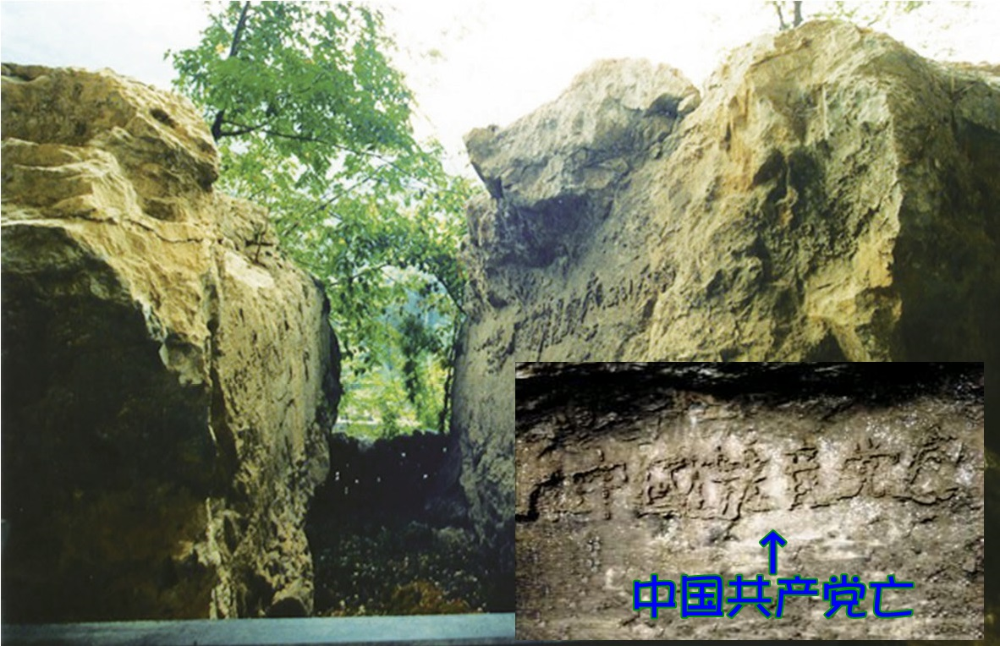

 
▲ “藏字石”石面上呈现出的字形清晰可辨。(新华网图片)
 

 
贵州省平塘县掌布乡掌布河谷，风景优美，但由于交通闭塞，其美景一直不被外人所知。进入二十一世纪后，随着中国大陆旅游业的持续升温，掌布河谷的旅游价值逐渐被人们所认识，其景观也吸引了越来越多的旅游观光者。

据媒体报道，2002 年6 月，都匀国际摄影博览会推荐该景区为摄影采风点。为采风点做准备，原任村干部王国富率乡亲们来到景区修桥补路打扫卫生，他在清除两边石壁上的树枝和腐叶时，无意中发现其中一侧的巨石断面上有“産”、“党”两个大字。当把石壁都清扫完时，竟然发现有酷似“中國共産党亡”的六个横排大字，更令人不可思议的是“國”和“產”两个字竟是繁体字，而且在六个大字后面似乎还有另外几个小一点儿的字。
</td>
  
</tr>
 </table>
 

 
  
   

  
 

  <table>
 <tr>
  <td>
   <h2 align="center"> <a href="http://">慎之又慎 三轮专家考察</a></h2>
2003年8月13日，贵州工业大学的专家到现场进行考察、鉴定，认为“藏字石”的成因是：位于中二叠统栖霞组深灰色灰岩中（距今约2.7 亿年左右），岩层中的古生物化石及生物碎屑呈似层状分布，经溶蚀及差异风化作用，使生物碎屑突出于石灰岩上。发现地质奇观的巨石，受到以上同样的地质作用。并在“藏字石”前立一碑石，铭其文曰：“无人工雕琢、塑造、粘的痕迹，是天然形成的，构成字体的矿物成分是方解石, 化学成分是碳酸钙（CaCO3）……”作为“贵州工业大学资源与环境学院”的《鉴定结论》。

2003年9月2日，贵州省地质矿产勘查开发局地质专家再次赴现场进行考察鉴定。他们在写给省政府的报告中作出的考察结论是：地质作用形成的自然痕迹，浑然天成，是以钙质海绵为主的化石无序排列巧然天成。在破裂的两块巨石字迹的周围，未发现人工雕琢、塑造、粘贴、充填的痕迹。其结论与贵州工业大学的考察、鉴定结论基本一致。

随着“藏字石” 知名度的不断扩大，不少人担心省专家鉴定的权威性不够。事隔三个月，应平塘县委、县政府的邀请，由全国政协委员、中国科学院地学部副主任、中国科学院院士、著名地质学家李廷栋，中国科学院院士、著名地质专家刘宝珺，中国地质大学教授、国土资源部国家地质公园评委、著名古生物学专家李凤麟等 15 人组成的“贵州平塘地质奇观 - 中国名家科学文化考察团”，于 2003 年 12 月 5 日至 8 日深入掌布河谷重点对“藏字石”进行实地考察。

 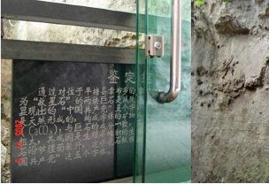

 
▲ 贵州工业大学在藏字石前立碑石作为鉴定结论 

 

 <h2 align="center"> <a href="http://">一致结论：未发现人工痕迹</a></h2>
专家一致认为，掌布河谷景区“藏字石”上的字位于距今 2.7 亿年左右的二叠统栖霞组深灰色岩中。字的均匀排列现象，虽是极其罕见的小概率，但均可从地质科学特别是沉淀地质学上得到解释和说明，“藏字石”上至今未发现人工雕凿及其它人为加工痕迹，堪称世界级奇观，具有不可估量的地质研究价值。
　　
另据专家鉴定，这块巨石，是 500 年前从拦马河谷的崖壁上坠落，落地一分为二，从此静静地卧于贵州省黔南州平塘县掌布乡桃坡村境内。

 
 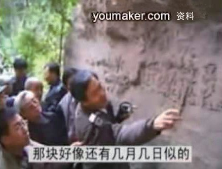

 
▲ 视频截图：中科院院士指着石头，一个字一个字地用手点着字念…… 

 

刘宝珺院士说：“平塘出现这一现象从科学的角度是可以解释的，奇怪的是它的概率太微乎其微了，这个现象在平塘出现，对于我们这样专业的人也觉得十分罕见，因此我们要保护，要研究，要利用它。” 

国土资源部教授毕孔彰说：“我们这个考察团是由区域地质学家、层积学家、地球化学家、古生物学家、构造地质学家、国家地质公园专家、规划专家以及著名教授、学者等人员组成，是很全面的，能够保证考察的综合性和完整性。” 

 
 <h2 align="center"> <a href="http://">百余家媒体追踪报道 </a></h2>
对藏字石的考察，有人民日报、中央电视台、光明日报、科技日报、旅游卫视、中国国际广播电台等20 多家媒体记者随团采访报道，包括人民网、新浪网、东方网、搜狐网、雅虎、新华网等互联网在内的100多家报纸、电视、网站转发了这一科学考察活动的消息。

2004 年6 月22日至25 日，中央电视台“走进科学”栏目组专程赴掌布进行拍摄，制作专题节目“揭秘藏字石”，并于8 月初在中央电视台七套和十套多次播出。

  
 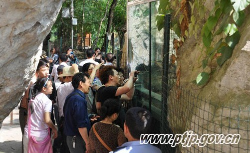

 
▲ 几年中石头就走红了，还装了防弹玻璃被保护起来了。 

 

 </td>
 </tr>
 </table>
 

  
   

 
 
 

 
  <table>
 <tr>
  <td>
    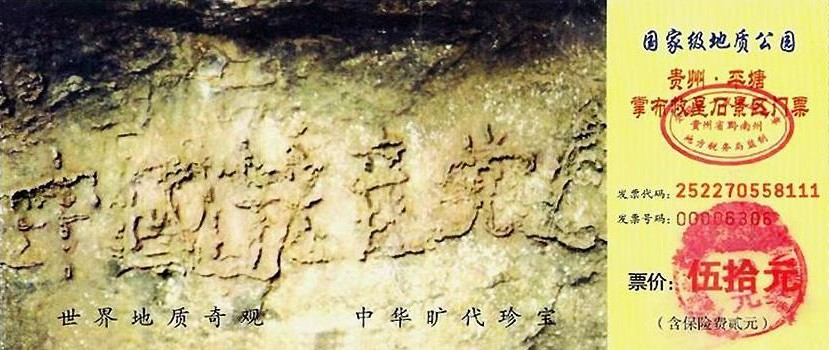

▲ 贵州平塘藏字石景区门票 
 

安徒生的童话《皇帝的新装》讲了这样一个故事：有一个很爱打扮的皇帝，被两个骗子愚弄，说他们为皇帝编织了一件华丽的衣裳，但是愚蠢和不称职的人都看不见。后来皇帝穿着这件“衣裳”出巡，人们争相观看，因为谁都不愿被认为是愚蠢的人，所以无人敢说皇帝并没有穿衣服的事实，最后，一个天真的小孩子揭穿了皇帝根本没有穿衣服的真相。 

 <h2 align="center"> <a href="http://">九常委亲见藏字石 </a></h2>
如同《皇帝的新装》一样，皇帝“奇特”的新装吸引了众多的好奇者前来观看；“藏字石”以其神奇而名声大噪，前往掌布河谷旅游观光的人与日俱增。

人们都想亲眼目睹一下六个大字的真容，当然动机各有不同：有的是好奇，有的是为了在学术方面探究一看，也有的是为了察看一下虚实。十六届政治局九个常委（温家宝、曾庆红、贾庆林、黄菊、吴官正、吴邦国、胡锦涛、李长春、罗干）先后都到掌布河谷察看过，然后都默默离去。之后罗干利用出访之机，以私人名义投资阿根廷的矿山；江泽民亲属及贾庆林、曾庆红的儿子均移民澳大利亚；其他中共高官也纷纷以各种名义安排“后路工程”，这都与“藏字石”上的六个惊天大字有关。

  <h2 align="center"> <a href="http://">统一措词不言“亡”</a></h2>
在《皇帝的新装》中，面对没有穿衣服的皇帝，没人敢说出真相；面对藏字石上的六个大字，大陆媒体没有哪个敢说那个特大的“亡”字，都统一措词，只说前五个字；而另一方面，却又大力宣传这一“旅游资源”，招揽游客。 

然而，那个“亡”字的存在，如同《皇帝的新装》中那个天真的孩子说的那句“皇帝并没有穿衣服呀”一般，简单，直白，明了，道出了有目共睹的一个事实，毋庸置疑：真相就在那里明摆着！ 

现在,我们或者去当地景区,或在网上都可以看到这一奇观。我们可以清楚地看到:那六个大字排列均匀整齐，而且还是颜体，后边隐隐约约仿佛还有落款。 

  
 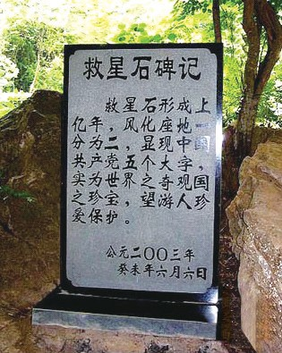

 
▲ 为招揽游客，将藏字石取名为“救星石”，却只宣传其中五个字，略去了“亡”字。 

 

 
 </td>
 </tr>
 </table>
  

  
   

 
  
   

 <table>
 <tr>
  <td>
  <h2 align="center"> <a href="http://">亿年历史在告诉未来 </a></h2>
天然的石头上生出字，且石头有2.7 亿岁。2.7 亿年，是个什么概念呢？茫茫宇宙，浩远历史, 以人有限的生命去观察宇宙无尽的时空，人类将永远无法窥其全貌，这一根本性的问题可能会成为人类永恒之迷。而这带着久远历史陈迹的石头与字，不就是历史在告诉未来吗？不就是天意的显现吗！500 年前出现简化字？  

 <h2 align="center"> <a href="http://">500 年前出现简化字？ </a></h2>
大家知道，简化字是中共建政之后才有的，只有50 年，而500 年前是没有“党”字的，只有“黨”。所以说，这个“党”字只能是指中共，而不是其它的“黨”。另外，500 年前，竟然能知晓并使用了500 年后简化的“党”字，只能说明这是神来之笔，是上天的旨意。

  <h2 align="center"> <a href="http://">与众不同的“亡”字 </a></h2>
六个字中，“亡”字特别大，且与其它字形略有不同，略有朦胧却又清晰可辨。为什么这样呢？试想，如果“亡”字与其它字一样的清晰，中共怎么敢大加宣传，让其展现在世人面前呢？正是这种特殊的“效果”，能让惯于自欺欺人的中共对石头实话“放行”，使之昭然于天下。在几年之间就迅速走红，还被安装了防弹玻璃保护起来。天意的深远，不是人能窥测的啊！

 <h2 align="center"> <a href="http://"> 妙解“中國共産党亡”</a></h2>
有高人解析道： “國、產”二字，用的是“正统”的老字，代表着“有根不亡”；“亡党”在即，“亡党”不“亡國”也，因为“中共”不代表“中国”，“中共”不等于“中国”。这一解说，同各界有关中共面临崩溃的当下话题不谋而合。另外，六个字中，“亡”字特别大，看来中共的灭亡，也是不同于历史上任何王朝的灭亡，会是一个“大灭亡”啊！

  
  </td>
 </tr>
 </table>
  

 
 
   

 
  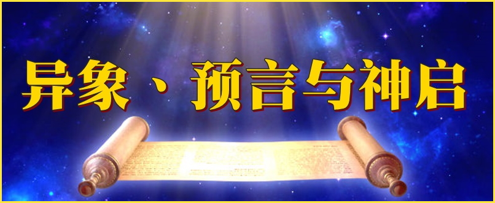
   

 
 
  <table>
 <tr>
  <td>
藏字石，天然形成的六个大字，且繁简相间，如此神奇，只能说是天意。不止这贵州的藏字石，翻开历史，我们发现，天地间那些奇景异象，无不在展示着冥冥中的天意。 

 
 <h2 align="center"> <a href="http://"> “始皇帝死而地分” </a></h2>
 《史记·秦始皇本纪》中记载，公元前211 年，一颗流星坠落到了东郡。东郡是在秦始皇即位之初吕不韦主政时攻打下来的，当时此郡是齐、秦两国的交界地。现在已是大秦帝国的一个东方大郡。陨石落地已令人震惊，然而，更可怕的是陨石上面竟然刻有〝始皇帝死而地分〞。

这件事情，像长了翅膀一样，迅速传到了秦始皇耳中。秦始皇当然震惊不已，立即派御史到陨石落地处，逐户排查刻字之人，结果一无所获。愤怒的秦始皇下令：处死这块陨石旁所有人家的人，并立即焚毁这块刻字的陨石。

人死了，石焚了，但是，秦始皇心中的阴影并没有随之而去。公元前210 年，秦始皇便“驾崩”了。秦始皇死后不久，秦朝就分崩离析了。如此看来，陨石上刻着的“始皇帝死而地分”，这七个字还真蛮灵的，难怪人们把它们视为天意!

 
 

 
▲ 陨石撞击形成的陨坑( 网络图片) 

 

 
 <h2 align="center"> <a href="http://">  “石人一只眼，挑动黄河天下反” </a></h2>
 元朝至正年间，黄河泛滥。丞相脱脱派贾鲁调集十三路民夫治理黄河。在修河之前，黄河南北就有童谣说：“石人一只眼，挑动黄河天下反”。结果在修河道的时候，挖出一个独眼石人，背后还真写着“石人一只眼，挑动黄河天下反”，接着就是农民起义的总爆发。此事件记载在《元史·志第十七下·河渠三》中。 

 
  <h2 align="center"> <a href="http://"> 吉林陨石雨</a></h2>
1976 年3 月8日15 时01 分，吉林地区方圆500 平方公里范围内降落一场世界罕见的陨石雨。当地上空先出现一个大火球，很快分裂一个较大的火球和两个小火球，鱼贯向西飞行。有100 多万人听见火球高速飞行时由冲击波发出的霹雳般的巨响，震碎了无数居民住宅的玻璃窗。场面之宏大，威力之巨猛，如同原子弹。民间流传陨石雨百年不遇，落下了3 块大石头对应3 个大人物的阳寿要尽。果然，当年周恩来、朱德、毛泽东相继去世。 

而无数的小陨石块，则对应着一场大天灾。同年7 月28日的唐山大地震，是迄今为止400 多年来世界地震史上最悲惨的一页，相当于400 枚广岛原子弹在距地面16 公里的地壳中猛然爆炸，这座百万人口的城市顷刻间被毁。24 万人死亡，16 万人重伤。 

 
 
 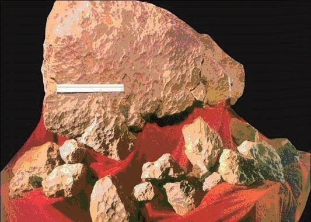

 
▲ 吉林市陨石雨博物馆内展出的陨石 

 

<h2 align="center"> <a href="http://"> 人类奇观——预言中的惊人相似</a></h2>
预言是人类文化的重要组成部分，中国许多朝代都留下了传世预言，对历史有着惊人的准确预测，堪称世界一大奇观。比较著名的神州预言包括周朝的《乾坤万年歌》、汉代诸葛亮的《马前课》、唐代李淳风的《推背图》、宋代邵雍的《梅花诗》和明代刘伯温的《烧饼歌》等。外国比较著名的预言有：法国诺查丹玛斯留下的《诸世纪》、韩国的《格庵遗录》以及圣经《启示录》等。 

众多的预言，出自不同的文化和地区，跨越不同的时代，却都预言了中国的朝代更迭、中共的产生与灭亡，及人类此时将有大劫之忧，预言了即将在中国发生的一件惊天动地的 大事：天要灭中共以及天灭中共时其追随者将被一同诛灭的可怕惨景！ 

在西方社会，《圣经启示录》这部预言影响最大。其中有关于赤龙（红兽）的论述，讲到将来某个时候，人们被欺骗着向赤龙（红兽）发了毒誓，就会被它刻上它的记号了，这个记号称为“兽的印记”，简称“兽印”。 

而很多民间的高人都知道，共产党符合赤龙（红兽）的特征。《圣经启示录》中还称，能否抹去“兽印”，将是人人都必须面临的生死之间的选择。
 
 <h2 align="center"> <a href="http://"> 《圣经启示录》中的赤龙、兽、兽的印记 </a></h2>
 一、赤龙
《启示录》第十二章三段描述一个七头十角的赤（红）龙，预言中称反对上帝的兽的一切权力来自于这个赤龙（第十三章二段）。根据《启示录》第十二章九段，赤龙名叫魔鬼，又叫撒旦，是迷惑普天下的。在现在流行的看法中，人们通常把赤龙仅仅看成是魔鬼撒旦的象征，其实《启示录》中的赤龙不仅代表魔鬼撒旦，而且有暗示，那就是共产党在另外空间的表现。

 
 二、兽
《启示录》第十三章讲，这个兽十分猖狂，满嘴说的都是冒犯上帝的话，还擅于制造事端和欺骗人们。在《旧约全书》中的丹氏（Daniel）预言中讲了这个兽的许多特征：兽行、自私自利、独裁、无法无天、吹牛、欺诈、狡猾、堕落、疯狂、卑鄙、荒淫等。

《启示录》第十三章七段还讲到，除了诬陷和亵渎神之外，兽也疯狂地迫害信徒们，一些被关进监狱，一些被酷刑折磨而死。

三、兽的印记
《圣经启示录》中还说，所有崇拜兽和戴上了兽的印记的人都将在上帝最后的审判中，喝上帝愤怒的酒，将处于万劫不复之地，永远在地狱中沉沦。

 
 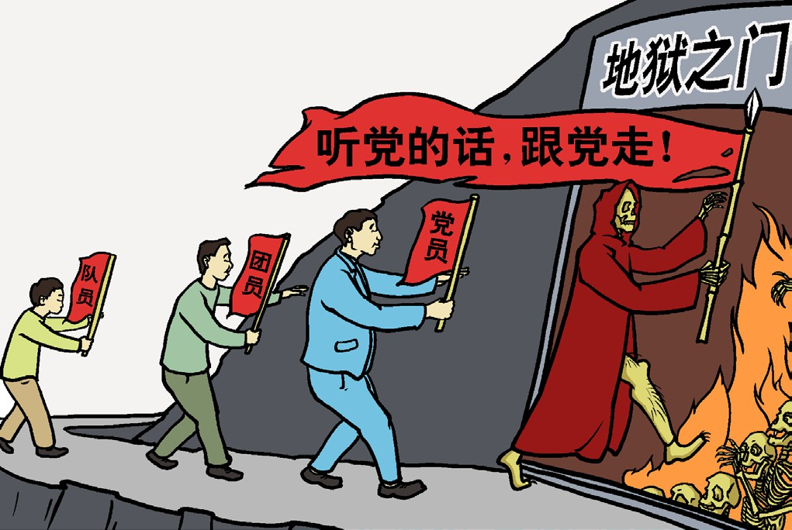

 
</td>
 </tr>
 </table>
  

  
   
   

 
  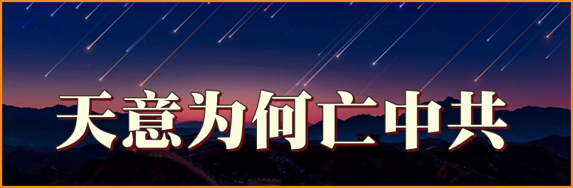
   

  
  
  <table>
 <tr>
  <td>
   <h2 align="center"> <a href="http://"> 共产党统治中国的血腥历史</a></h2>
 中共以暴力与谎言起家，从1949 年建政至今，周期性地发动了一场场迫害百姓的运动，如：三反、五反、反右、文革、六四、迫害法轮功等，暴力残害杀戮中国人，致使8000多万中华儿女在暴政下非正常死亡。

  
   
 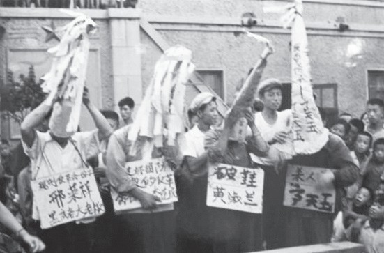

 
▲ 文化大革命： 处决13.5万多人，非正常死亡172.8万，武斗死亡23.7 万多。伤残703 万， 摧残家庭7.1 万多，被关押过的有420 万，受株连者上亿人。（网络图片） 

 

  
   
 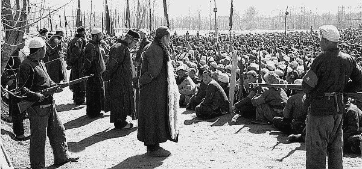

 
▲ 土改运动（1947 年至1952 年）：处决200万人，殃及近千万人。 

 

中共是一个作恶没有底线的犯罪集团。当年在发生大饥荒、饿殍遍野的时候，它不但不予救济，反而派出军队封锁道路，禁止百姓逃荒要饭，致使4000 万人活活饿死；在天安门发生民主运动的时候用坦克的履带、毒气弹、开花弹来屠杀手无寸铁的学生；在迫害法轮功的时候，以活体摘取法轮功学员的器官牟利，然后把仍有心跳和呼吸的法轮功学员推入焚尸炉烧死。这个党的本性就是残忍嗜血、天良丧尽，从隐瞒萨斯病（非典），到隐瞒四川大地震的预报，民众的死活从来就不是中共考虑的问题。 

　　
2004 年11 月19 日，大纪元发表《九评共产党》系列社论，第一次系统阐述了共产党的邪恶本质，给为祸人间一个多世纪的国际共产主义盖棺论定，特别是揭露了中国共产党长期欺骗人民的谎言邪说、流氓本性、邪教本质。 

说中共是邪教，因为它与正教有鲜明的区别。正统的宗教都是相信神的，相信善的，以育化人的道德和拯救人的灵魂为目的；而共产党不相信神灵，并且反对传统道德。以阶级斗争、暴力革命和无产阶级专政为中心的共产党教义，导致了充满血腥暴力与屠杀的所谓共产革命。

 <h2 align="center"> <a href="http://"> 中共邪教特征</a></h2>

  <table>
 <tr>
  <td width=180>教主崇拜</td>
<td width=680>共产党的历次造神运动，强制推行对党领袖的崇拜。</td></tr>

<tr>
  <td width=180>敛财</td>
<td width=680>共产党是最大的恶霸、贪污和强盗群体。</td></tr>

<tr>
  <td width=180>教义、精神控制</td>
<td width=680>供奉已无人再信的共产主义空想，强制推广无神论，把信神和精神信仰当成犯罪而严加“转化”与迫害。</td></tr>

<tr>
  <td width=180>组织严密</td>
<td width=680>从中央到街道办事处，从国营企事业单位到私人企业，从党员到少先队员，中共成员只能进不能出。</td></tr>

<tr>
 <td width=180>危害社会</td>
<td width=680>中共的历次政治运动对国家、家庭、个人、社会经济发展、文化精神生活、社会稳定、良性人际关系等等，均造成灾难性打击与破坏。</td></tr>

 </table>
 

中共向人们宣扬“与天斗、与地斗、与人斗其乐无穷”的害人理论，在这种灌输下，人们越来越远离良善，道德水准越来越低下，人与人勾心斗角，尔虞我诈，泯灭良知，金钱至上……于是，我们的生存环境被肆意破坏了，毒米、毒面、毒奶粉、地沟油、皮鞋胶囊出现了，小悦悦的惨剧出现了……

当面对世风日下、灾祸不断、满目疮痍的中华大地，我们是否想过，这一切的罪魁祸首正是中共。古人云：善恶到头终有报。这样一个集邪恶之大全的中共，必然遭到天谴！而天谴涉及的一定是每一个加入其组织的成员。

  
 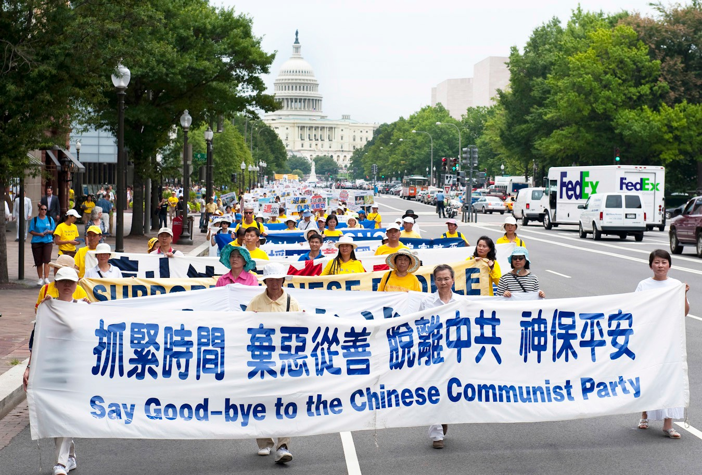

 
▲ 美国首都华盛顿的支持退党大游行 

 

  
 </td>
 </tr>
 </table>
  
 
  
  
   

 
  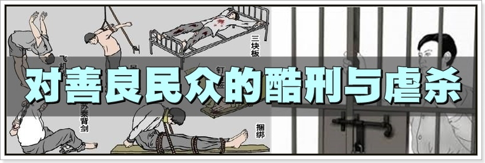
   
 
  
  <table>
 <tr>
  <td>
至2017 年 12 月，明慧网数据公布并已得到证实的消息显示，已有4154名法轮功学员被迫害致死，至少上万人被非法判刑，几十万人被非法劳教，数千人被强迫送入精神病院受到摧残，数十万人次被绑架到“洗脑班”遭受酷刑与精神折磨……无数法轮功学员被迫害得家破人亡。 
 
   
 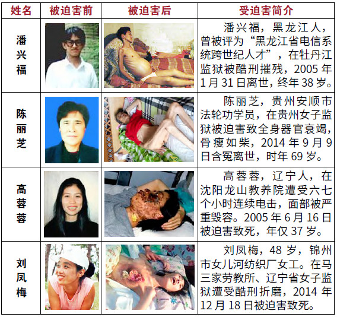

  
 
 <h2 align="center"> <a href="http://"> 酷刑演示图</a></h2>
  <table>
 <tr>
  <td width=440>
 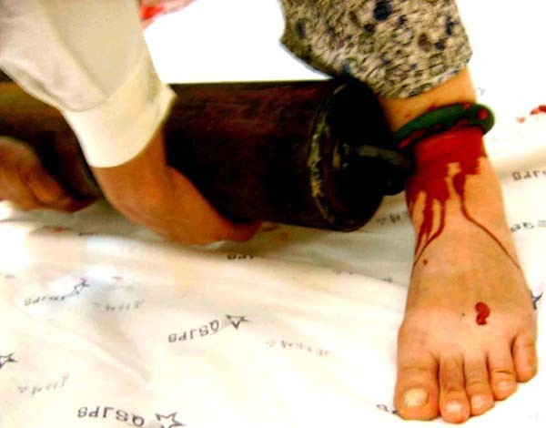

   
▲ 脚 镣 约30多斤重 

   </td>
   
<td width=440
 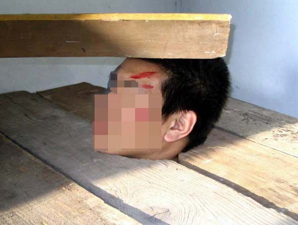

▲ 用 床 板猛砍头部 

</td></tr>

<tr>
  <td width=440>
 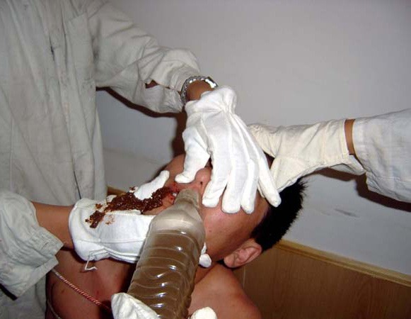

   
▲ 灌 屎 灌尿 

   </td>
<td width=440>
 

 
▲ 皮肤刷烂 

 </td></tr>
 
 </table>
 

  
  
   

 
  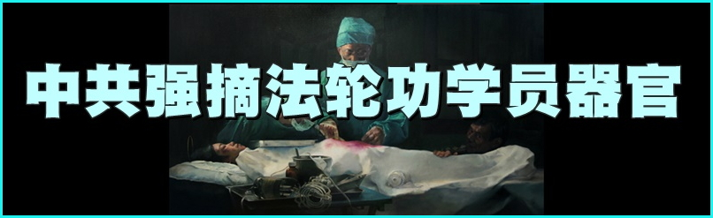
   
 
  
  <table>
 <tr>
  <td>
  <h2 align="center"> <a href="http://"> 证人指证中共强摘法轮功学员器官</a></h2>
 
 

 
▲ 证人安妮与皮特现身记者会，揭露中共活体摘取法轮功学员器官的罪行。（明慧网） 

 

2006 年3 月初，证人安妮向大纪元媒体披露，在她曾工作过的沈阳苏家屯辽宁省血栓中西结合医院，从2001 年起，约6000名法轮功学员被关进该院地下室的秘密集中营，据她了解，其中至少四分之三的人已被摘取心脏、肾脏、眼角膜、剥掉皮肤后被焚尸。她的前夫在该院工作期间曾主刀活体摘取两千余名法轮功学员的眼角膜。来自军医系统的证人指证，苏家屯医院仅是全国36 个类似集中营的一个，位于吉林代号为672—S 的集中营，关押了超过12 万的法轮功学员和异见人士，中共是通过军队系统来主导活摘以牟利，仅他本人经手伪造的自愿捐献器官资料就有6 万多份。 

  <h2 align="center"> <a href="http://"> 至少有6.5 万法轮功学员被中共活摘器官</a></h2>
  
 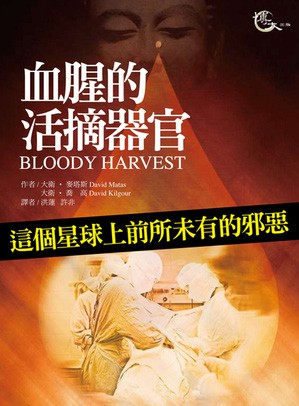

 
▲ 《血腥的活摘器官》封面 

 

加拿大国会人权委员会前主席、外交部亚太司前司长大卫· 乔高（David Kilgour）与著名国际人权律师大卫·麦塔斯（David Matas）组成的独立调查组，2006 年7 月6 日，向加拿大媒体公开了调查报告，得出结论是“大规模的、违背意愿的、对法轮功修炼者的器官掠取一直存在，而且现在仍然在继续着。”并称之为“这个星球上前所未有的邪恶”。这份报告被翻译成18 种语言，后来历经多次证据增补，第三版累计52 种证据方法佐证，并出版专书《血腥的活摘器官》。另外，大卫·麦塔斯和美国作家伊森·葛特曼（Ethan Gutmann）运用大量调查数据和事实资料得出结论，2000 ～ 2005 年间，至少有6.5 万名法轮功学员被中共活摘器官，而实际上被虐杀的法轮功学员可能超过上百万。 

美国国会、欧洲议会、加拿大国会、爱尔兰议会、丹麦国会等都进行了关于中共活摘器官罪行的听证会，强烈谴责中共这一惊天罪行。美国国会众议院丹纳·罗拉巴克议员表示：活摘器官是“魔鬼的行径”，是严重的反人类罪行。 

 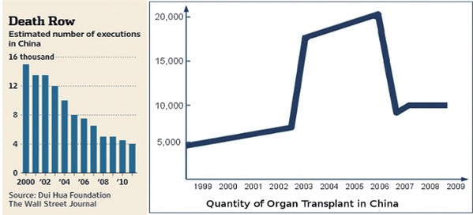

 
▲ 左图为2000年~2010年大陆的死刑人数估算，右图为1999~2009年之间大陆器官移植数量，显示2002~2007年之间大陆器官移植数量猛增。 

 

根据中国医疗器官移植协会的数据，中国在1994—1999 年，大约进行了18500 个大器官移植。而在2000—2005 年，进行了60000 个大器官移植。那么，这猛增的41500 个移植器官，供体源自何处？中共称器官来自死刑犯。 

大赦国际的数据表明，中国每年处死犯人1600 人左右，而死囚器官利用率也不过30%。据中国器官移植网提供的统计，2006年仅有22 位死者家属同意捐出亲人的器官。可见，把大陆“死刑犯器官”和“捐献器官”数量加起来，也相差甚远。在海外做移植手术，等待供体的时间通常是几年，但在中国等待时间却往往短至几周……中共活摘法轮功学员器官牟利的罪行，详情可查阅《血腥的活摘器官》一书或明慧网深度调查报告《“死刑犯”撑不起中国器官移植市场上的蘑菇云》。 

另外，“追查迫害法轮功国际组织”已掌握大量迫害证据，其中《中共活摘法轮功学员器官证据专辑》里提供的调查录音显示，是江泽民下令活摘法轮功学员器官；这一群体灭绝性的犯罪是在周永康和罗干的操控下进行的，中央政法委处级以上的官员多知情……（请翻墙访问明慧网，了解更多详情） 

<table>
 <tr>
  <td>
 <a href="https://git.io/opopop"> 下载翻墙软件 https://git.io/opopop 浏览明慧网 www.minghui.org   </a>
 </td></tr>
  </table>
 
</td></tr>
  </table>
 

  
   
   

 
  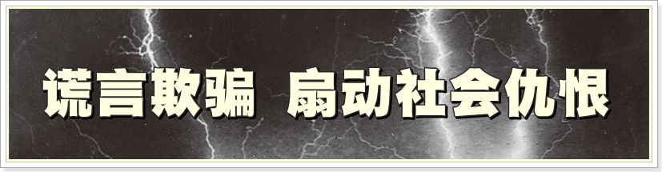
   
 
  
   <table>
 <tr>
  <td width=440>
 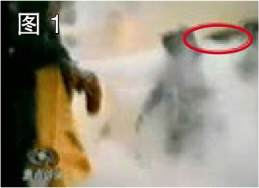

   
▲ 凶手猛击刘的头部 

   </td>
   
<td width=440
 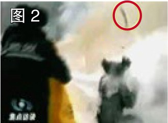

▲ 一条状物弹起 

</td></tr>

<tr>
  <td width=440>
 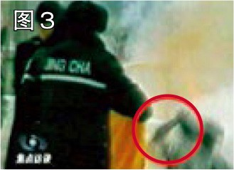

   
▲ 用手摸头，突然倒地 

   </td>
<td width=440>
 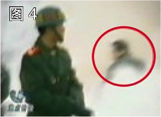

 
▲ 凶手打过人的姿势 
</td>

 <h2 align="center"> <a href="http://"> 刘春玲是被烧死还是被打死？</a></h2>
 录像慢镜头显示，被央视声称烧死的刘春玲，当时在3名军警包围中，头部遭到“便衣”致命的一击。刘春玲不是被自己点燃的火烧死，而是被早有准备的“便衣”击打致死的。

  </tr>
 </table>
 

  
  <table>
 <tr>
  <td>
中共江泽民集团为煽动中国社会对法轮功的仇恨，从1999年7月20日起，开动全国媒体对法轮功进行系统性的造谣污蔑宣传，如炮制所谓自杀、他杀、有病拒医死亡等案件，栽赃陷害法轮功。其中最典型的是炮制“天安门自焚”伪案。在迫害初期，央视每天动用7 个小时反复播出污蔑法轮功的节目，欺骗民众，煽动仇恨。

2001年8月14日，国际教育发展组织（IED）在联合国声明指出：我们的调查表明，“该事件（自焚事件）是这个政府一手导演的”。面对确凿证据，在场的中共代表哑口无言。该声明已被联合国备案。◇

   </td></tr>
 </table>
 

  
   
   

 
  
   
 
   
   
 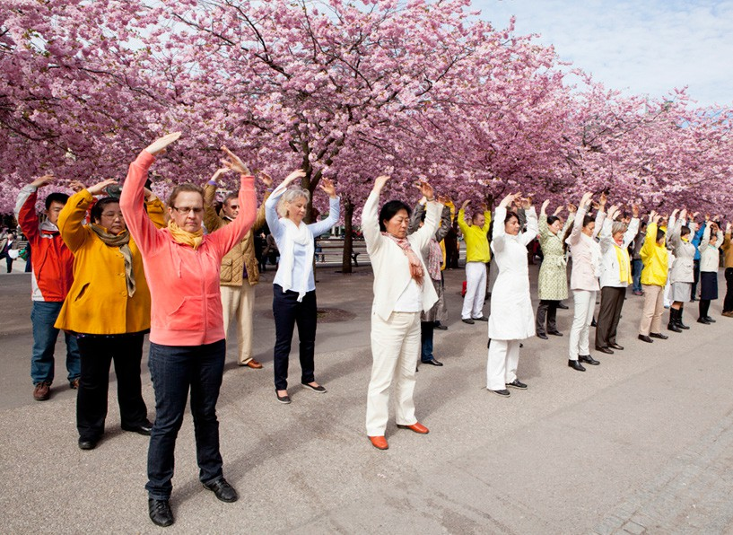

   
 ▲ 瑞典 

   
 
   
  
 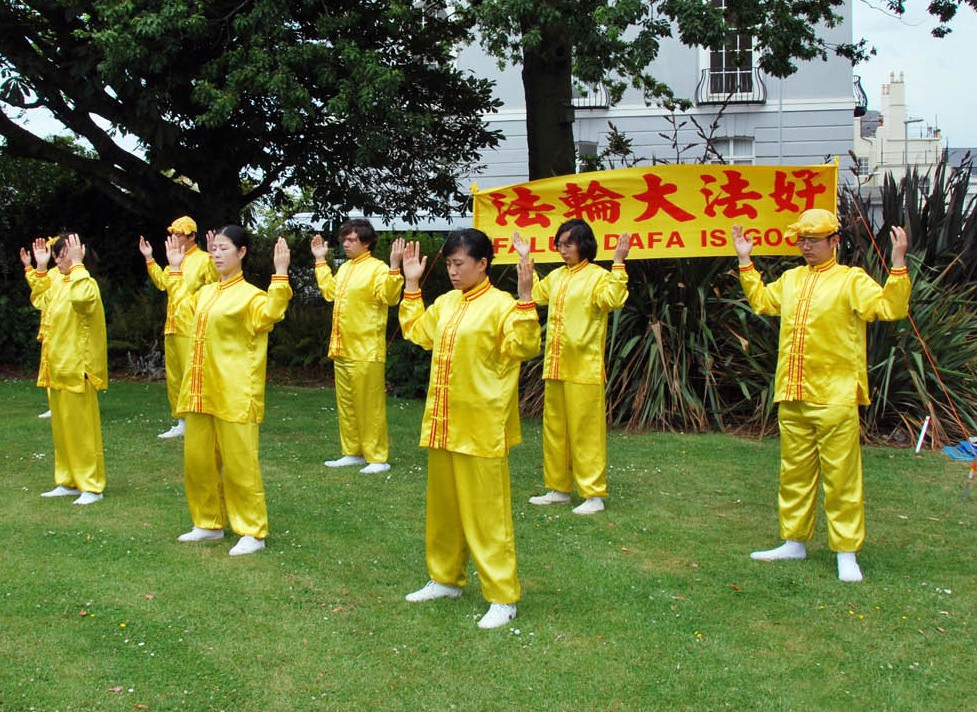

   
 ▲ 英国 

   
 
   
   
 

   
 ▲ 澳大利亚 

   

   

 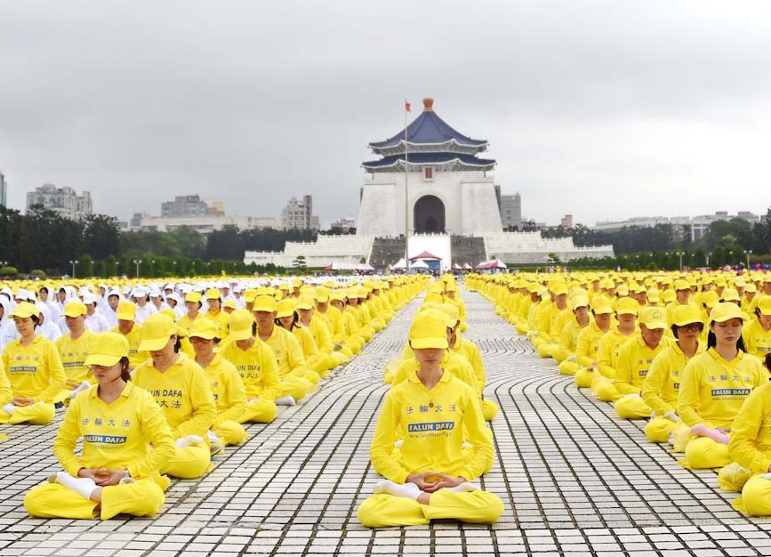

  
 ▲ 台北 

  

   

 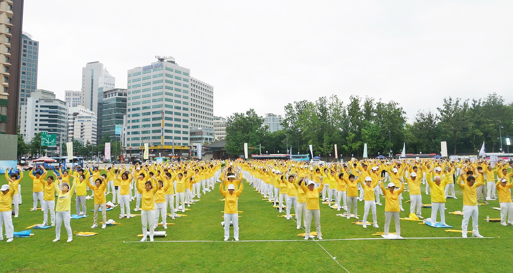

  
 ▲ 韩国 

  
   
   
   
   

 
  
   
 
   
   <table>
 <tr>
  <td>
1993 年8 月，中宣部和公安部联合召开第三次全国见义勇为先进分子表彰大会，会议专门邀请李洪志先生为与会的先进分子做免费康复治疗，效果显著。为此，中华见义勇为基金会在8月31 日发出了《中华人民共和国公安部致中国气功科学研究会感谢信》，对法轮功的神奇祛病健身功效给予了高度肯定。信中写道：“……治病效果之显著得到了普遍的称赞。接受治疗者有的因刀伤、枪伤留下的后遗症，经治疗后立刻解除了疼痛或麻木、乏力的症状；有的是脑外伤造成的后遗症，经治疗后立刻感到头脑清醒，解除了头痛、眩晕等症状；还有的是当场就消除了身体上的肿瘤；有的是在24 小时内就排出了胆结石；也有一些是胃病、心脏病、关节病等病状患者，治疗后都在当场感受到了消除病状……”  
 
   
 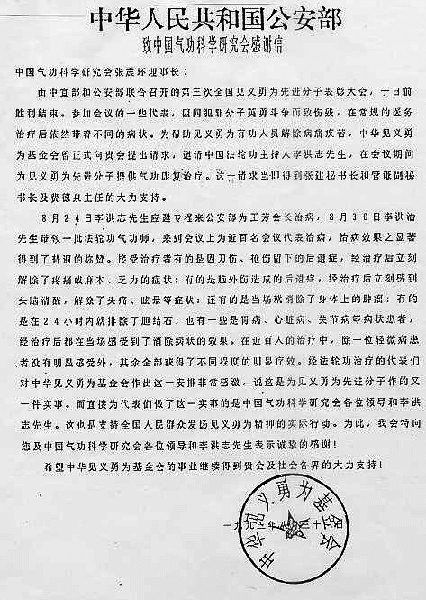

   
 
法轮功，又称法轮大法，以“真、善、忍”为根本指导，包含五套舒缓优美的功法动作。法轮功教人向善，要求修炼者努力按照“真、善、忍”标准提升道德水准。修炼法轮功不但能祛病健身，还能使人变得诚实，善良，宽容，平和。 
 
法轮功已弘传世界百余国，获得世界各国的褒奖、支持议案与信函等3500 多项。主要著作《转法轮》已被译成30多种文字，在世界各地发行，并可从法轮大法网站falundafa.org免费下载。 
 
   
   <table>
 <tr>
  <td>
 <a href="https://git.io/02"> 下载翻墙软件 https://git.io/op 浏览明慧网 www.minghui.org   </a>
 </td></tr>
  </table>
   
 </td></tr>
 </table>
 
  
   
  
   

 
  
   
   
 
  <table>
 <tr>
  <td>
广大的中国民众：共产党的末日就要到了。但是这个邪恶的党（魔教）在历史上却对众生、对神佛犯下了滔天大罪，神一定要清算这个恶魔。 
 
如果有一天，神指使人类的谁对共产党清算时，也一定不会放过那些所谓坚定的邪恶党徒。我们郑重声明：所有参加过共产党与共产党其它组织的（被邪恶打上兽的印记的）人，赶快退出，抹去邪恶的印记。一旦谁对这个魔教清算时，大纪元储存的记录可以为声明退出共产党和共产党其它组织的人作证。 
 

天网恢恢，善恶分明；苦海有边，生死一念。曾被历史上最邪恶的魔教所欺骗的人，曾被邪恶打上兽的印记的人，请抓住这稍纵即逝的良机！ 
 

大纪元 
2005年1月12日

 </td></tr>
 </table>
 
   
   
 

 
▲ “三退”数据图：至2018 年3月，在退党网站上声明“三退”的人数已超过3 亿人。

   
 
   
   
   

 
  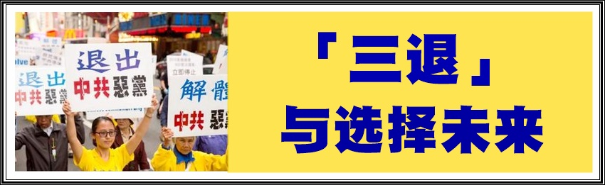
   
    
   
  
 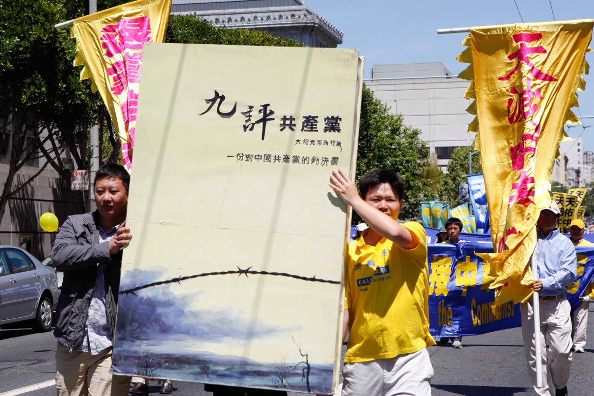

 
▲ 美国旧金山声援“三退”大游行

   
 
   
   <table>
 <tr>
  <td>  
一块巨石沉默亿年，突现六字，并成为一处风景，这是在传达天意，唤醒国人，告诉人们“中國共産党亡”。 
 
不同的预言，相似的提醒：邪恶为祸人间，赤龙逞恶一时，能否抛弃邪恶，能否抹去“兽的印记”，这将是人人都必须面临的生死之间的选择。 
 
一部旷世巨著——《九评共产党》横空出世，深刻揭示了中共的欺骗、暴力、邪教和流氓本性，告诉人们中共究竟是怎样一个恶魔。 
 
《大纪元郑重声明》郑重地告诉人们“参加过共产党与共产党其它组织的人，就是被邪恶打上兽的印记的人，要赶快抺去兽印”；在善恶生死抉择之际，给了人们最后的机会。 
 
“三退”（声明退出中共党团队）大潮风起云涌，是在提醒人们，需要用行动来表明抛弃中共，不再与邪恶为伍，从而自我救赎，选择光明的未来。   
 
   
历史走过的每一步，以及正在进行中的现在，这些看似不经意的每一笔，实则都是天意的昭示。上天安排了人类的历史和未来，但是，上天却不能够替人选择未来，人的未来必须由人自己做出选择，这是一条天理！所以，上天的种种苦心安排与警示，都是为了让人类能读懂天意，从而在人类必然会走到历史的最后那一步的关键时刻，做出明智的选择。  
 
     
 </td></tr>
 </table>
 

 
  
   

 
  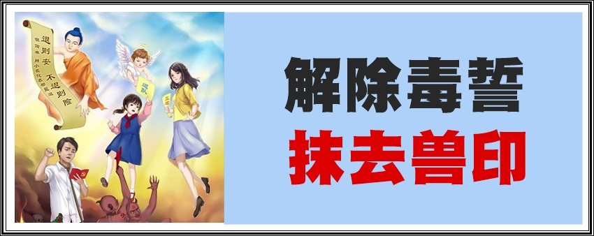
   
   
 
  <table>
 <tr>
  <td> 
在《出埃及记》中记载，当耶和华最后不得不严惩埃及人时，他让摩西提前告诉了以色列人，要他们当晚把门框上和门楣上涂上羊血，作为记号，当神击杀埃及所有人畜的头一胎的时候，见到羊血时便“逾越而过”。神应该是无所不能的，绝对有能力把谁家是埃及人，谁家是以色列人分得一清二楚，但为什么还要以色列人以血涂门呢？ 
 
这里面有个非常关键的因素，那就是人是否能理解天意，是否相信神说的话，是否按照神所说的去做，神把这种选择权给予了人。也就是说，人的未来是由自己选择的，神给了人选择的机会。当然，不同的选择，其结果也会天壤之别。 
 
有人可能说“自己心中退党就算退了，不必声明”；还有人认为“自己多年没交党费了，就算自动退党了”；或者认为“年龄大了，已经自动退团，退队了”。但这都不能抹掉加入党、团、队时举着右手宣誓而被打上的印记，无法“解除毒誓”。而天灭中共时，没有解除这个毒誓的人，就将成为中共的陪葬。 
 
只有采取公开的方式退出，有行为的表示，才能解除这个“毒誓”。神看人心，只要真心声明“三退”，用真名、化名、小名皆可。 
 
 
<<table>
 <tr><td width=880>
  <h3 align="center"><a href="http://">退党、退团、退队（三退）方法  ( 可使用真名、化名、小名退 )</a></h3>
 

* (1)用海外邮箱发表声明 tuidang@epochtimes.com 

* (2)用破网软件登录 http://tuidang.epochtimes.com 

* (3)美国热线电话:    
 001-702-873-1734       
 001-866-697-6570  
 001-858-609-9088       
 001-858-609-9099  
 001-888-892-8757

(4)加拿大热线电话:  
001-416-361-9895 
001-514-342-1023 
001-604-276-2569

(5)退党传真： 
001-510-372-0176 
001-201-625-6301

(6)各地退党团队服务中心

(7)各地大纪元报社

(8) 各地法轮功学员

* <b>可先将声明张贴在适当的公共场所，以后再上网。</b> 

◆提示：由于恐惧，中共对退党热线做了手脚，电话接通后录音告之：这是个空号，请不要打这个电话。请别上当、不要挂电话，很快能接通，请相互转告。 

◆您可能说我思想中早退了，我也不交党费了。那都不算数。因为在那个血旗面前向天发毒誓时，您是说把一生、把生命都献给邪党了。所以只有采取公开的方式退出，有行为的表示，才能除掉这么大的毒誓，才能在天灭中共的时候保平安！ 

</td>
 </tr>
</table>
 

 
 
   

 
  
   
   
 
 <table>
 <tr><td> 
 2005 年5 月，中共中央党校25 名官员集体发表声明退党；2007 年12 月8 日，江苏省灌云县陆庄村党支部32 名党员全体退党，理由是，党员官僚和腐败、脱离群众、滥用职权、暗箱操作选举、暴力征地和拆迁等等；2012 年10 月，四川剑南春职工维权，厂方找来警察抓人，打人，72 名党员职工集体公开退党；事隔8 个月，湖南省各乡镇的2000 名老放映员6 月14 日到省政府上访却遭到暴力驱散及抓捕，随后，5000 党员放映员集体决定公开声明退党，等等。  

自从王立军出逃成都美领馆事件后，许多参与迫害法轮功的政法委、“610”、公检法人员也纷纷寻找退路，声明退党，表示悔过，甚至帮助亲友“三退”。尤其是前中共政法委书记周永康及“610 ”办公室主任、公安部副部长李东生等一批迫害法轮功的凶手纷纷落马，中国民众更加认清了中共的本质，看明了中共即将覆灭的下场，顺天意而行，踊跃“三退”。  

 <h2 align="center"> <a href="http://"> 觉醒的公安局长三年“劝退”上千人</a></h2>
据明慧网报道，大陆某县一位公安局长，看了《九评共产党》和法轮功真相资料后，还认真阅读了法轮功著作《转法轮》，终于明白了法轮大法是教人修炼“真善忍”的正法，认清了共产党的邪恶本质，知道了“三退”保命的重要性，毅然带领家族中的人退出了中共的党、团、队组织。从此，他不但在工作中不再帮中共干坏事，还主动向亲戚朋友、父老乡亲以及上级领导、本局的同事和邻县的同僚讲真相，劝“三退”。三年时间，共“劝退”上千人。

 </td></tr>
 </table>
 

   

 
  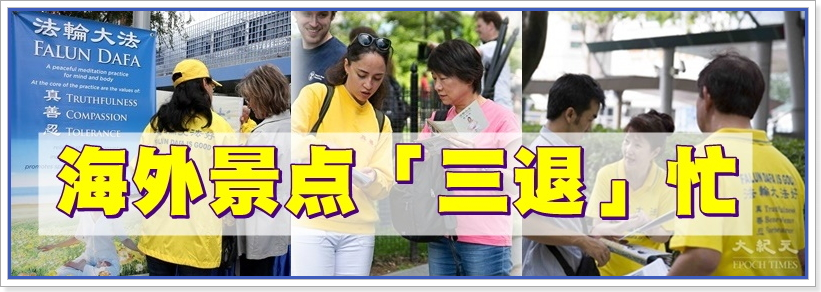
   
 

 <table>
 <tr><td> 
近年来，出国旅游已经成为中国人的旅游新时尚，在全世界各地著名的观光景点（包括香港、澳门），中国大陆游客常常是整团、整车地“三退”。
 
目前全球30 多个国家和地区已有100 多个退党服务中心，数以万计的志愿者通过各种渠道协助中国民众“三退”，并在世界各地著名旅游区设点，提供义务“三退”服务。

 
有的中国游客表示：出来就是为了“三退”的。
 
有的说：“谁不愿意平安啊，当然不愿意跟它（中共）倒霉。”
 
一位中央党校官员明白真相后欣然“三退”，说：你们法轮功文化知识层次真高，怨不得共产党都害怕，你们什么都知道。
 
一位专管迫害法轮功的公安局长登记“三退”后，与退党服务中心的义工握手说：谢谢！谢谢！我们国内见。
 

 

 
▲ 纽约曼哈顿南街海港，大陆游客观看真相展板，踊跃“三退”。

   
 

 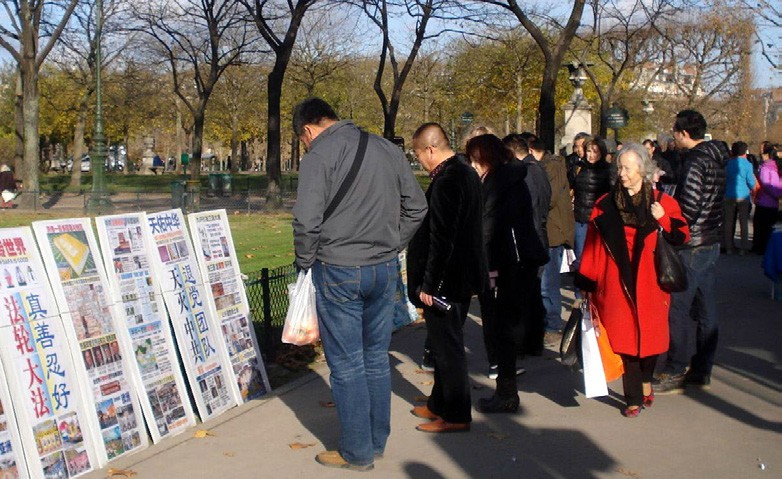

 
▲ 法国巴黎的观光景点，中国大陆的游客在观看展板，了解真相。

   
 

</td></tr>
 </table>
 

  

  

 <a href="https://git.io/souye"> 

