

<h2>请收藏本网址，连上免翻视频即时IP    https://git.io/jxdodo </h2>
	

<h3>免翻视频 http://61.228.176.210/300</h3>
 
 
<table>
 
<tr> <td>
<h2>上天有好生之德 
存善守德的人会得到上天庇佑 
请珍惜救助的手 
做明智的选择保平安 
https://is.gd/ogaavg

重要选择美好人生(已办理过勿再重复)  https://is.gd/dkbYwV	 </h2>
<td></tr>

<tr>
 <td>
 <a href="https://git.io/pamja"> <h3>如何 “ 三退保命 ”</a>，<b>连上面→免翻视频 IP http://61.228.176.210/300 </b> →点 【三退大潮】--为什么要退党？ 可留言三退或用翻墙软件自己办理三退</h3></td>
</tr> 

<tr>
 <td>
 <a href="https://git.io/pamja"> <h3>如何 “ 三退保命 ”</a>，请点击翻牆网站  https://git.io/opopop  下载 { 翻牆软件 }→找 { 大紀元網站 }  ( http://www.dajiyuan.com ) 三退</h3></td>
</tr>
 </table>

<h1><a href=https://git.io/souye>看更多真相</h1></a>

 

 
  

 <a name=list><b>目錄</b>

 
  <table>
 <tr><td width=640>
 <a href=#a-1>** 纽退党义工：三退与每一位华人息息相关</a></td>
  <td width=240><a href=#a-1>大紀元新聞</a></td>
 </tr>
 
 <tr><td width=640>
 <a href=#a>** 退党大潮冲击波：中共恐慌 全球各界声援</a></td>
  <td width=240><a href=#a>大紀元新聞</a></td>
 </tr>
 
 <tr><td width=640>
 <a href=#b>** 美国华府研讨会：三亿人三退数字真实</a></td>
  <td width=240><a href=#b>大紀元新聞</a></td>
 </tr>
 
 <tr><td width=640>
 <a href=#c>** 13年退党义工承受苦难唤醒良知的心路历程</a></td>
  <td width=240><a href=#c>大紀元新聞</a></td>
 </tr>
 
  <tr><td width=640>
 <a href=#d>** 觅真：沉睡中的中华民族正在觉醒！</a></td>
  <td width=240><a href=#d>大紀元新聞</a></td>
 </tr>
 
  <tr><td width=640>
 <a href=#e>** 见证历史 欧洲法轮功学员景点讲真相 (组图)</a></td>
  <td width=240><a href=#e>大紀元新聞</a></td>
 </tr>
 
  <tr><td width=640>
 <a href=#f>** 【特稿】三亿人三退 解体中共复兴中华</a></td>
  <td width=240><a href=#f>大紀元新聞</a></td>
 </tr>
 
 <tr><td width=640>
 <a href=#g>** 悉尼景点闻真相三退 大陆游客感叹不虚此行</a></td>
  <td width=240><a href=#g>大紀元新聞</a></td>
 </tr>
 
 
   </table>

 
 <table>
 <tr><td width=640>
 <a href=#3-0>◆ 中共省部级高官纷退党：你们真是做好事</a></td>
  <td width=240><a href=#3>大紀元新聞</a></td>
 </tr>
 
 <tr><td width=640>
 <a href=#2>◆ 海外“风景点”中共国安国保610警察三退</a></td>
  <td width=240><a href=#2>大紀元新聞</a></td>
 </tr>

<tr><td width=640>
 <a href=#2-2>◆ 中共政法委系统官员在巴黎退党</a></td>
  <td width=240><a href=#2-2>大紀元新聞</a></td>
 </tr>
 
 <tr><td width=640>
 <a href=#2-3>◆ 原38军军长司机 来美国一周真名退党</a></td>
  <td width=240><a href=#2-3>大紀元新聞</a></td>
 </tr>
 
 <tr><td width=640>
 <a href=#2-4>◆ 中共公检法系统官员退党</a></td>
  <td width=240><a href=#2-4>大紀元新聞</a></td>
 </tr>
 
 <tr><td width=640>
 <a href=#1>◆ 中国人欧洲之旅 所见所闻所行</a></td>
  <td width=240><a href=#1>大紀元新聞</a></td>
 </tr>
 
 <tr><td width=640>
 <a href=#1-1>◆ “共产党丢人哪”世界景点见证中国人觉醒</a></td>
  <td width=240><a href=#1-1>大紀元新聞</a></td>
 </tr>
  </table>
 

 
  <table>
 
 <tr><td width=640>
 <a href=#17>◎ 北加州奥克兰中秋街会 逾百名华人三退</a></td>
  <td width=240><a href=#17>大紀元新聞</a></td>
 </tr>
 
 <tr><td width=640>
 <a href=#13>◎ 中国游客悉尼景点明真相三退</a></td>
  <td width=240><a href=#13>明慧网</a></td>
 </tr>
 
 <tr><td width=640>
 <a href=#12>◎ 瑞士景点 大陆游客呼朋唤友成群三退</a></td>
  <td width=240><a href=#12>大紀元新聞</a></td>
 </tr>
 
 <tr><td width=640>
 <a href=#11-1>◎ 德国著名景点前 大陆游客踊跃三退</a></td>
  <td width=240><a href=#11-1>大紀元新聞</a></td>
 </tr>
 
  <tr><td width=640>
 <a href=#11>◎ 严寒欧洲 大陆游客“三退”热火朝天</a></td>
  <td width=240><a href=#11>大紀元新聞</a></td>
 </tr>
 
  <tr><td width=640>
 <a href=#3>◎ 瑞士卢塞恩景点　中国游客踊跃“三退”</a></td>
  <td width=240><a href=#3>明慧网</a></td>
 </tr>
 
  <tr><td width=640>
 <a href=#4>◎ 三亿人退出中共组织 大陆民众出国三退</a></td>
  <td width=240><a href=#4>大紀元新聞</a></td>
 </tr>
 
 <tr><td width=640>
 <a href=#5>◎ 全球各地声援三亿中国人退出中共 (组图)</a></td>
  <td width=240><a href=#5>大紀元新聞</a></td>
 </tr>

 <tr><td width=640>
 <a href=#6>◎ 欧洲天国乐团到访瑞士 大陆游客踊跃三退</a></td>
  <td width=240><a href=#6>大紀元新聞</a></td>
 </tr>

 <tr><td width=640>
 <a href=#7>◎ 欧洲景点　大陆游客退党自救</a></td>
  <td width=240><a href=#7>明慧网</a></td>
 </tr>

<tr><td width=640>
 <a href=#8>◎ 美中秋街会249人退出中共 华人海外喜三退</a></td>
  <td width=240><a href=#8>大紀元新聞</a></td>
 </tr>

<tr><td width=640>
 <a href=#9>◎ “三个军长退党” 纽约“四二五”活动见闻</a></td>
  <td width=240><a href=#9>大紀元新聞</a></td>
 </tr>

<tr><td width=640>
 <a href=#10>◎ 纽约游行集会声援退党　两百华人现场三退（图）</a></td>
  <td width=240><a href=#10>明慧网</a></td>
 </tr>

<tr><td width=640>
 <a href=#13>◎ 大陆游客出国“躲霾” 争相“三退”</a></td>
  <td width=240><a href=#13>大紀元新聞</a></td>
 </tr>

<tr><td width=640>
 <a href=#14>◎ 大陆客高举《九评》照相 旅游团在华府成群三退</a></td>
  <td width=240><a href=#14>大紀元新聞</a></td>
 </tr>

<tr><td width=640>
 <a href=#15>◎ 中国大陆百人以上团体“三退”渐成趋势</a></td>
  <td width=240><a href=#15>大紀元新聞</a></td>
 </tr>

<tr><td width=640>
 <a href=#16>◎ 法轮功纽约大游行 四百华人三退</a></td>
  <td width=240><a href=#16>明慧网</a></td>
 </tr>

 </table>
 
  
 
 
 <a href=#list><h4 align="right">回目錄</h4></a>
 

 
 
 
 <a name=17><h2 align="center"><b>北加州奥克兰中秋街会 逾百名华人三退</b></h2> 
 

 
 
 2019年8月24日，法轮功学员在北加州奥克兰中国城中秋街会上摆放摊位，传播真相。前来了解真相的人们络绎不绝。（明慧网）
 
  
  
 
 【大纪元2019年08月28日讯】美国加州奥克兰市一年一度的中秋街会于2019年8月24日和25日，在该市的中国城举行，吸引了各族裔民众。与往年一样，法轮功学员于24日在街会上摆放了摊位，向民众传播法轮功受中共残酷迫害真相，上百名位华人做“三退”（退出中共党、团、队组织）。 
  
 
<a name=17><h2 align="center"><b>北加州奥克兰中秋街会 逾百名华人三退</b></h2> 
 

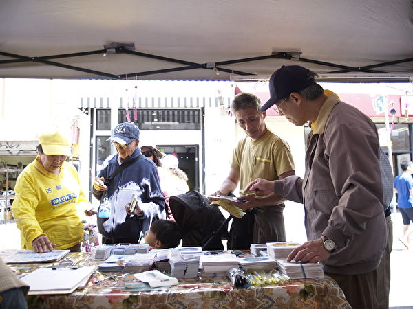
 
 
华人主动了解真相并声明“三退”。（明慧网）
 
  
  
  
 <a name=17><h2 align="center"><b>北加州奥克兰中秋街会 逾百名华人三退</b></h2> 
 

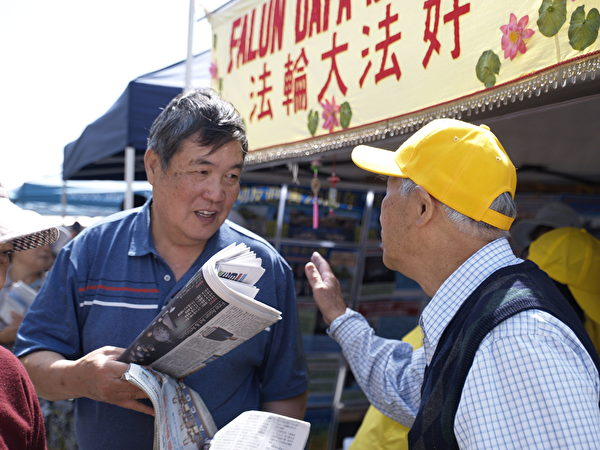
 
 
华人来了解真相。（明慧网）
 
  
  
 
<a name=17><h2 align="center"><b>北加州奥克兰中秋街会 逾百名华人三退</b></h2> 
 

 
 
华人来了解真相。（明慧网）
 
  
   
 
 <a name=17><h2 align="center"><b>北加州奥克兰中秋街会 逾百名华人三退</b></h2> 
 

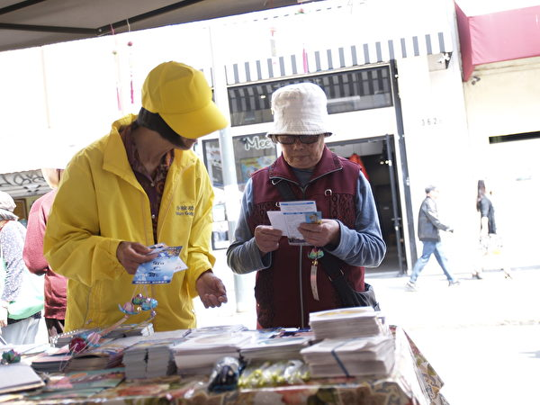
 
 
华人来了解真相。（明慧网）
 
  
   
 
 明慧网报导，当天的奥克兰中国城车水马龙，好不热闹。法轮功学员在摊位上准备了各种介绍法轮功以及揭露中共迫害的真相资料，还有《九评共产党》等真相资料，经过摊位了解真相的人们络绎不绝。许多华人主动了解真相，当天有140多人“三退”。
   
 
 <a name=17><h2 align="center"><b>北加州奥克兰中秋街会 逾百名华人三退</b></h2> 
 

 
 
华人了解了真相、做“三退”。（明慧网）
 
  
   
 
<a name=17><h2 align="center"><b>北加州奥克兰中秋街会 逾百名华人三退</b></h2> 
 

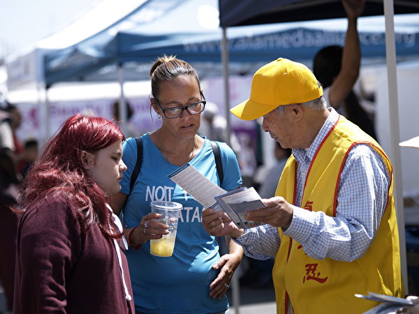
 
 
西方人来了解真相。（明慧网）
 
  
   
  
<a name=17><h2 align="center"><b>北加州奥克兰中秋街会 逾百名华人三退</b></h2> 
 

 
 
西方人来了解真相。（明慧网）
 
  
   
 
 有一位西人叫麦克辛，他索取法轮功资料后，非常仔细地阅读，并认真观看介绍法轮功及迫害真相的图片后，气愤地表示，中共政权太邪恶，人们应该反对它。一位华人唐先生在阅读完真相图片后也这么认为。
  

奥克兰位于旧金山以东，仅一条湾区大桥相隔。法轮功学员回忆，中国1999年迫害法轮功刚开始后的几年，很多华人因为被中共的诬蔑宣传所蒙骗，对法轮功有误解。当初他们经过法轮功摊位时很多人指指点点，而且态度不友善，很多人回避法轮功学员。

经过法轮功学员这么多年持续地讲真相，越来越多的华人明白了法轮功是什么，认识到中共的邪恶。现在有的华人还跟法轮功学员成了朋友，他们经过摊位时跟学员们热情打招呼。更多的人不再回避，而是欣喜了解了法轮功真相。

不少华人表示，中共就是坏，并了解了“三退”的意义。

中共篡夺政权后，害死了8,000万中国同胞。自1999年7月中共迫害法轮功以来，一直没有停止过对法轮功学员进行绑架、关押、酷刑折磨、构陷、非法判刑，甚至大规模活摘法轮功学员器官，犯下这个星球上从未有过的罪恶。

明慧网2019年2月9日发表的题为“迫害法轮功　19年间逾2万人遭恶报”中指出，截至2018年，至少有20,784名参与迫害者遭厄运。

《大纪元郑重声明》写道：“如果有一天，神指使人类的谁对共产党清算时，也一定不会放过那些所谓坚定的邪恶党徒。我们郑重声明：所有参加过共产党与共产党其它组织的（被邪恶打上兽的印记的）人，赶快退出，抹去邪恶的印记。”

自2004年11月19日大纪元发表系列社论《九评共产党》以来，中国人的“三退”运动波澜壮阔。迄今为止，在大纪元退党网站上声明“三退”的人数已突破3.4亿。

2005年6月，在美国正式注册的“全球退出中共服务中心”应运而生，正式成为中国人声明“三退”的大平台。

2012年底，美国国会及行政部门中国问题委员会（CECC）将全球退党服务中心提交的报告收录进美国国家政府档案，并由美国国家印刷总局刊物发行。该报告详细介绍了中国的“三退”运动。

2018年6月8日，在美国联邦众议员达纳·罗拉巴克（Dana Rohrabacher）的发起下，《第932号决议案》被提交给美国国会众议院外交事务委员会。该决议声援中国民众退出共产党及其附属组织，要求中共立即停止迫害法轮功。#
  

文字整理：李洁思，责任编辑：高静
  
 
 
  <a href=#list><h4 align="right">回目錄</h4></a>
 

 
 
 
 <a name=13><h2 align="center"><b>中国游客悉尼景点明真相三退</b></h2> 
 

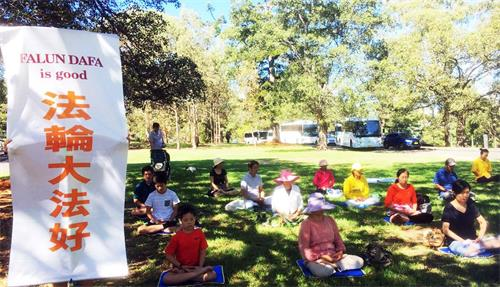
 
 
 悉尼法轮功学员在Mrs. Macquarie's Chair草坪上展示法轮功五套功法，为此地增添独特景观。
 
  
  
 【明慧网二零一九年二月十二日】（明慧澳洲悉尼记者站报道）悉尼著名景点麦考利夫人角（Mrs. Macquarie's Chair）三面环水，风景如画，悉尼大桥及悉尼歌剧院尽收眼底，是拍照留念的绝佳选择地，每天吸引着络绎不绝的世界各地游客来观赏，也是中国大陆游客经常到访的旅游景点之一。
  
 
 悉尼法轮功学员常年在这里向中国游客发放法轮功真相资料，举横幅，面对面讲真相，劝三退（退出中共党、团、队），风雨无阻。每个周末还有更多的学员在中间的草坪上展示法轮功的五套功法，给这里增添了一道独特的景观。

 <b>法轮功学员和大陆游客的交谈 </b>

不少大陆游客被法轮功真相横幅吸引驻足认真浏览，有的还与法轮功学员交谈，提出疑问。有一位游客说：“我们（在中国）接触到的媒体（宣传）就是说法轮功不好。”

法轮功学员艾莉回答道：“因为你们看不到嘛。我在这边（澳洲）学翻译的时候，我的英文老师说过一句话：被掩盖的一定是真相。否则的话它干嘛要怕你看呐？您说是不是这个道理。如果要是假的话，它为啥不让你看呐？它一定是自己做了坏事了，怕老百姓知道，所以它才掩盖起来不让咱们看，这就是为什么咱们（我们）站在这儿的原因。”

旁边另一游客问：“给你多少钱？”艾莉答道：“因为国内的消息都被封锁了，你们都得翻墙才能出来看消息。咱们没有人搞政治，您说说，打压法轮功之前中国有上亿人修炼，现在跟您少一点说，一百万人的话，一天给一块钱，一天给一百万美金，谁给的起呀？您以为那些外国政府它跟中国那些大贪官似的，贪污了上千亿了，老百姓都不知道，不是因为他们自己窝里反，被抓出来了，您说咱老百姓到哪儿知道去？在这个现在的中国根本就看不到这些事情，所以我们才站出来给您说这些。再说一天给您一块钱，您干吗？您也不干，是不是这个道理？所以咱们今天跟您讲的没有别的意思，就是告诉您一个善恶有报的道理。”

这位游客说：“知道，在香港我也看到过。在黄大仙庙，太极山顶都有看到你们。”艾莉问道：“真好！您有没有三退呀？如果还没做三退，我给您起个化名叫‘送有缘’，咱把党，团，队给退了，把向它发的誓约从心里抹掉了，谁作孽谁承担，老天爷保佑咱好人，记住了吗？大哥。不是党员吧？”

游客摇头表示不是。艾莉：“那咱们把团，队退了，好不好？”游客点头说：“嗯、嗯（表示同意）。”艾莉说：“要说‘好’才是同意。”游客又点头说：“嗯，好！好！”艾莉竖起了大拇指：“真棒！记住真、善、忍好！多了解真相。”

游客一手举着真相资料又说：“这不能带回去（中国）。”

艾莉又问：“您能不能翻墙出来看？您要能翻墙出来自己回家去看。您上大纪元网站上有翻墙软件，您自己去下载一个，到时候就能看。”游客一边离开一边说：“好，好！”走出几步的游客半回头并拱手道谢离去。

这是发生在麦考利夫人角景点上的一幕，这样的场景在这里时有看到。

 <b>科学家夫妇退党 </b>
 

 
  

 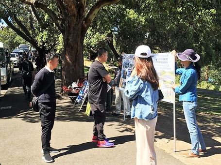
 
 
 中国游客正在认真阅读横幅上的法轮功真相
 
  
 
 
 常年在悉尼景点讲真相的法轮功学员中，也有七十多岁的阿姨们。因为修炼法轮功使得她们精力充沛、步履矫健，总是保持祥和的心态地与过往中国游客热情打招呼、介绍周围情况和照相，同时讲解法轮功真相和劝三退。
 

一天，一位大陆男游客问法轮功学员潘女士说：“我是无神论者，你能说服我吗？”潘女士问：“您是做什么工作的？”
 

男士说：“我是北京名校的教授，科研所的负责人，她（指夫人）是我的同事。我同时也是公司总经理，享受国家特殊津贴。”潘女士说：“哦，你们都是科学家呀，幸会！（他俩笑）神是客观存在的！你们研究过神吗？”男士：“没有。我没看见过神。”

潘女士答道：“我从小就相信神，炼了法轮功后才开始研究神，并亲身体验了神的存在。”“你没见过的东西就断定其不存在吗？神是高级生命，是由原子及原子以上更微观粒子构成。人的肉身是分子构成的，是低级的生命。低级物质构成的生命怎么看得见高级生命？！那是高能量物质。你知道牛顿有句名言吗？”

男士问：“不知道，什么名言？”

潘女士说：“大意是：一个研究圆的人，他知道圆内的情况，圆外他没研究，就不能妄加定论！”

男士同意地点头说：“是的。”潘女士又问：“你没研究过神，你却说你是‘无神论者’，科学吗？”（随后把手机上的一张照片递给男士看）男士赶紧问：“这是什么？”

潘女士说：“这是二零零九年六月份，在我帆布箱盖上开的二十五朵神仙界的花，叫优昙婆罗花。大约三千年才能在人间开一次，示意神在人间度人。现今距离释迦牟尼曾在人间度人已近三千年之久了。”

男士惊叹道：“啊！”

潘女士接着说：“法轮功从中国东北已传遍世界一百多个国家，许多科学家都在炼法轮功，还有许多国家领导人，各种肤色的人都在炼法轮功。为什么？炼法轮是修佛的，按真、善、忍法理要求自己的修为。贵州平塘县二亿七千万年前生成的石头上有天然形成的字‘中国共产党亡’，你是科学家，想想这是为什么？谁让石头上长那字？告示人什么？著名科学家牛顿、爱因斯坦等都走进了宗教，是为什么？他们觉得只有神学才能认识宇宙中的一切 。”

男士激动地站起身，背起双肩包高声说：“神是客观存在的！我回去就炼法轮功。你们的书（指《转法轮》）印的太少了，我会翻墙，去网上找书看看。”

潘女士问他：“您把党退了吧？”

男士说：“好，退党！”

夫妇俩很高兴地告辞走了。
 
 
 
  <a href=#list><h4 align="right">回目錄</h4></a>
  

 
 
  <a name=11-1><h2 align="center"><b>德国著名景点前 大陆游客踊跃三退</b></h2> 
 

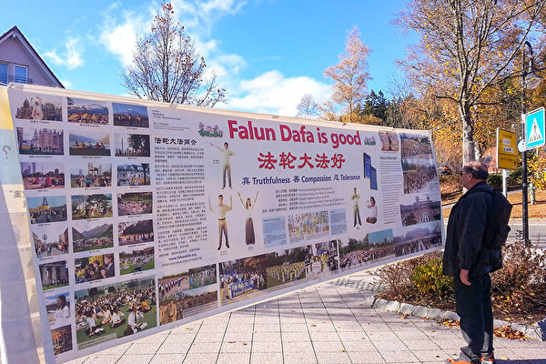
 
 
 欧洲部分法轮功学员在德国著名旅游景点黑森林缇缇湖（Lake Titisee，Black Forest，Germany）举办了法轮功信息日。（明慧网）
 
  
  
 【大纪元2015年11月10日讯】二零一五年十一月七日，德国法国的部分法轮功学员在德国著名旅游景点黑森林缇缇湖举办了法轮功信息日活动。来自德国及世界各地的游客，也包括来自中国大陆的游客对所看到的迫害真相的展板挂图感到震撼。他们有的索要真相资料；有人走向信息台，进一步了解真相；有人找法轮功学员深入交谈；很多人表示支持法轮功学员和平反迫害，制止活摘人体器官，法办迫害元凶江泽民，并在控告江泽民的请愿书上签名；不少大陆游客“三退（退出中共党、团、队）”。
 
 
明慧网欧洲通讯员报导，当天，有大约十个大陆旅游团和一些留学生等华人来此观光。很多人经过法轮功信息台时放慢脚步，眼睛注视着真相横幅、挂图和展板。其中一名大陆女游客张著嘴巴，一副震惊的样子；游客们议论纷纷：“这儿也有法轮功！”“还有不少老外呢。”“国外是自由啊，让在这么显眼的地方炼法轮功，还能宣传，真是国内国外两重天！”他们与法轮功学员交谈后，有的接了真相资料，不少人同意“三退”。 
 
 
 <b>上海夫妻：法办江泽民，我们上海人举双手赞成！</b>
 
 
一对来自上海的夫妻游客站在湖边感慨：你看人家的蓝天白云，青山绿水，湖里湖外都干净。站在这，心旷神怡，站在黄浦江边怎么就没这感觉？你再有钱，整天埋在雾霾里，喝超标水，吃不踏实（放心的）食品。
 

法轮功学员上前跟他们攀谈起来。法轮功学员与他们谈到当前共产党的腐败，并讲到一九九九年江泽民开始发动迫害法轮功，下令活摘法轮功学员体器官贩卖牟利，以及近期海内外有近20万法轮功学员和家属控告迫害法轮功的原凶江泽民。二人听到这里说：听说了，没想到会是真的；上海人最厌恶江泽民了，张口就骂他；“法办江泽民”，上海人举双手赞成！

法轮功学员说到“三退”时，丈夫说：我心里清楚就行了，没必要走表面形式吧？其妻则回应：我退。我是修佛的，我知道声明退的必要性。

法轮功学员对这位先生说：共产党的无神论害死人，虽然不勉强你现在退，但是你不声明退还真有危险。

妻对法轮功学员说：您放心，我能说通他，我可不愿意共产党完蛋时把他拉走。

法轮功学员嘱咐她，别忘了劝父母公婆所有的亲朋好友也退。她说：谢谢阿姨，你们法轮功的人心真好！

 
<b>德国名校大陆留学生从疑惑到谢谢法轮功</b>

 
德国名校的一群大陆留学生，围住法轮功学员提了很多有关法轮功的问题。
 

有人问：你为什么炼法轮功？
 

一位法轮功学员回答：我在大学读书时接触到一个地球物理系的副教授，她心脏不好提前病退了，但后来炼法轮功炼好了。当时她在校园里免费教大家炼法轮功。我试了试感觉很好。看了法轮功的书，知道法轮功教人向善，不仅自己受益，对他人、对社会都有好处。我炼法轮功二十年身心受益。

有人问：你们有工资吗？

法轮功学员说：我有正常工作，有工资。现在是义务在这里“讲真相、劝三退”，没工资，我算是退党义工吧。

有人问：共产党为什么迫害你们？

法轮功学员说：法轮功是修佛的，遵照大法“真善忍”的原则修炼，和中共的“假恶斗”完全背道而驰。法轮功对提升人的道德水平和身体健康有神奇效果，受到各阶层人士的喜爱，包括中南海高层。一九九九年上海电视台说有上亿人在炼法轮功。当时在任的江泽民生出妒嫉心，怕中国人都信法轮功师父的，没人听他了，就发起了这场迫害。

有人问：共产党镇压，是不是因为你们参与政治了？

法轮功学员说：不是。修炼人对权力没有诉求。我们劝中国人“三退”，是要救被中共毒害的中国人，帮助入过党、团、队的人，抹去共产邪灵的兽印，才能躲过天灭中共时的大劫难。另外，如果一个人相信了江泽民对法轮功的栽赃陷害，仇视法轮大法，也很危险。所以我们传播真相不是为了我们自身解脱，是为了中国人走出谎言，摆脱精神枷锁，做出顺应天意的选择。我们不希望被毒害的中国人受中共牵连一起遭恶报。

有人问：为什么说按照中国的法律，迫害法轮功是违法的？

法轮功学员说：中国宪法赋予公民有信仰的自由，但炼法轮功被迫害，是不是违反宪法？法轮功学员和平理性讲述被迫害的真相是合理合法的。另外，公安部的关于认定邪教组织的通知宣布了十四种邪教，法轮功不在上面。“两高”（最高检查院、最高法院）有个司法解释，也没提法轮功。这也说明了法轮功的合法性；也说明迫害是违法犯罪。

这时有人提醒：到点了，这群人才想起来要赶火车。

这位法轮功学员向他们说：看来你们在关注法轮功被迫害，开始认真思考问题。希望你们进一步了解真相，尽快做出善恶的选择，到退党网站声明“三退”。这群大陆留学生一边往火车站跑，一边回头，问问题的学生表示感谢：谢谢大哥，谢谢法轮功！

 
<b>大纪元郑重声明：</b>

 
2004年11月，大纪元发表系列社论《九评共产党》，系统阐述了共产党的本质，血腥历史以及邪教流氓本性。
 

大纪元2005年1月12日郑重声明：
 

广大的中国民众：共产党的末日就要到了。但是这个邪恶的党（魔教）在历史上却对众生、对神佛犯下了滔天大罪，神一定要清算这个恶魔。

如果有一天，神指使人类的谁对共产党清算时，也一定不会放过那些所谓坚定的邪恶党徒。我们郑重声明：所有参加过共产党与共产党其它组织的（被邪恶打上兽的印记的）人，赶快退出，抹去邪恶的印记。一旦谁对这个魔教清算时，大纪元储存的记录可以为声明退出共产党和共产党其它组织的人作证。

天网恢恢，善恶分明；苦海有边，生死一念。曾被历史上最邪恶的魔教所欺骗的人，曾被邪恶打上兽的印记的人，请抓住这稍纵即逝的良机！

 
<b>如何“三退”</b>

 
2005年2月，“全球退党服务中心”成立，为中国人声明“三退”提供平台。自此，全球以法轮功学员为主体的义工通过电子邮件、电话、传真、网络、面对面讲真相劝退等方式帮助人们认清中共的邪恶。
 

至2018年3月，在大纪元网站发表声明退出中共党、团、队组织的人数超过3亿人。

如何“三退”，请点击退党网站 https://git.io/tv123

责任编辑：高静

 <a href=#list><h4 align="right">回目錄</h4></a>
 

 
 <a name=16><h2 align="center"><b>法轮功纽约大游行 四百华人三退</b></h2> 
   【明慧网二零一八年十月二十三日】（明慧记者采菊纽约综合报道）二零一八年十月二十一日，周日，来自大纽约地区的部份法轮功学员，在纽约第三大华人社区布碌仑第八大道举行盛大游行，展现法轮大法的美好，同时揭露中共对法轮功学员的残酷迫害，并劝告中国同胞明真相，三退（退出中国共产党，共青团，少先队）保平安。现场民众反应热烈，对游行队伍的风采称赞不断。当场有四百多人做了三退，选择美好未来。 

  

 
  
 
 

 
  
 
 

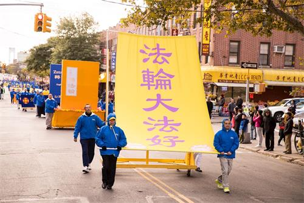
 
  
 
 

 
  
 

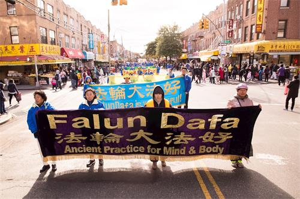
 
  
  

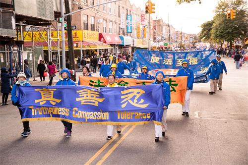
 
  
   
 

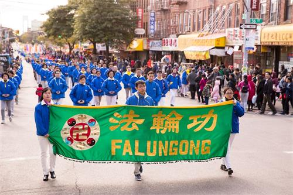
 
  
   
 

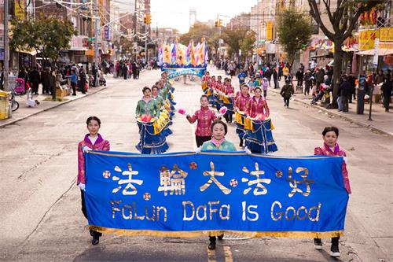
 
  
   

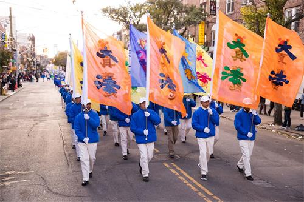
 
   
 
 

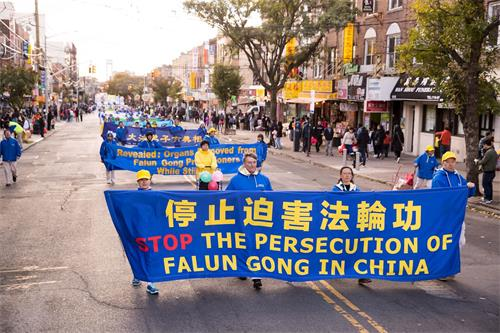
 
   
 
  

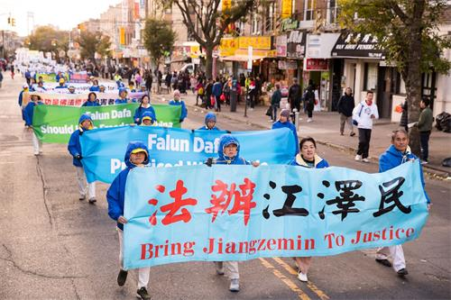
 
   
 
  

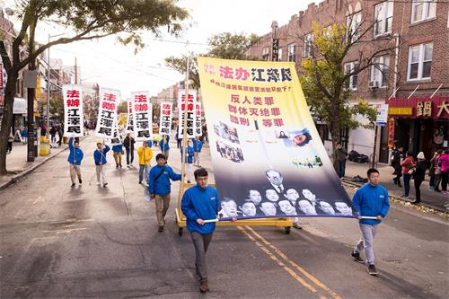
 
   
 
 

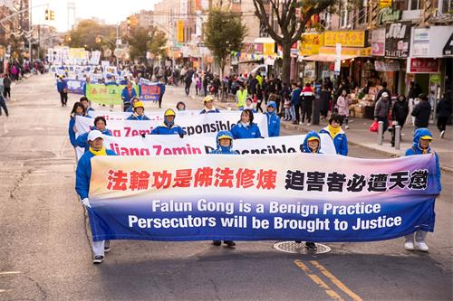
 
   
  
 

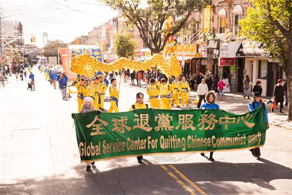
 
   
  

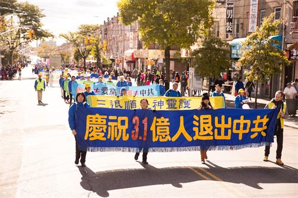
 
   
   
 

 
   
   

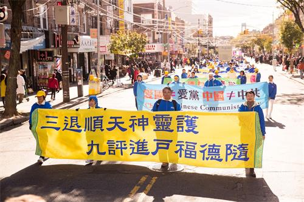
 
   

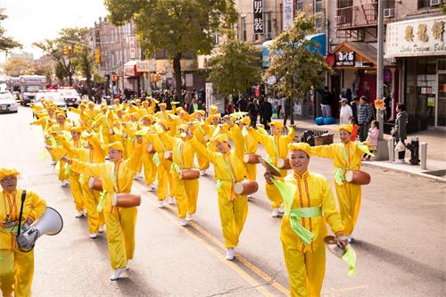
   
 
图1～18：法轮功学员在纽约第三大华人社区布碌仑第八大道举行盛大游行 

  
  
 
 上午气温陡降，寒风瑟瑟。警察们十一点之前就到了。学员们也是很早就开始为游行做准备，并集体炼功。下午两点，天国乐团雄壮的鼓乐声在八大道六十六街上响起，太阳冲出云层，暖暖地照下来，风也停歇了。 
 

八大道上，天国乐团雄壮的奏乐在前，舞龙、彩旗、小花船、横幅队等近二十组不同主题的队列有序地从六十六街行进到四十二街，一眼望去，十几条街上都是法轮大法的旗帜。壮观的游行吸引了众多市民。行人们纷纷驻足观看，很多人用手机拍照、录视频。有人说：“我都想炼法轮功。”还有人说：“看得好感动，眼泪都要掉下来了！”年轻的倪女士首次看到法轮功游行，一边忙着录下游行队伍，一边说：“真好看，如果有网络，现场就直播了。回家发到朋友圈……”
 
 
 <b>福建老移民：我想炼法轮功</b>
 
 
福建老移民李香女士说，她看到法轮功的队伍迎着疾风整齐地行走时，就感动得想掉泪，“这个功很好。他们在这么冷的天游行，就是为了唤起我们的觉悟。真、善、忍教人做好人，不能害人，我都想炼。”她竖起大拇指，对着行进中的腰鼓队连声地说：“好！好！她们多么自豪的样子，过一两年我一定要炼法轮功，大胆地参加进去！”
 
 
李女士的话匣子一打开便收不住了。“（共产党）说‘社会主义好，资本主义夹着尾巴逃跑了’，到头来共产党最愚民、害国、敛财、贪腐……”她从共产党当初骗人至深，一直谈到中领馆通过护照控制海外中国人，现在很多海外华人亲共也是因为这个。“很多人靠共产党吃饭，很多潜在特务，有活动经费拿。”她说亲眼看见许多人拿了中共的钱后，被套住了。

“我们被共产党骗了一辈子。”李女士说她看了《九评共产党》，知道了真相，也看到很多贪官“报应的日子来了”。现在她天天看《大纪元时报》，“我天天看这份报纸，人都正气一些，讲道理一些。”

福建的江先生带儿子驻足静静地看着游行，体味横幅展板传递的信息。“游行很好，以前（中共对法轮功的打压）新闻报导骗人，不民主，不真实。”他说，看了游行最大的感想就是“共产党太坏，欺骗老百姓。现在的中国，空气污染、环境恶化，经济崩溃，物价上涨，唉！”
 
 
<b>香港老移民：法轮功更爱国</b>
 
 
早年从香港移民纽约的余女士家住八大道，第一次看到法轮功的游行队伍。她对这么多人修炼法轮功感到惊讶。她说，“看了好感动，要掉眼泪了。”
 
 
余女士说，最触动她的是“法办江泽民”这条横幅。这让她想到自己的阿嬷（婆婆）和姑妈早年被共产党批斗致死的往事，“我阿嬷裹小脚的，仅仅因为‘海外有关系’，被他们折磨这么久。我阿叔早年被骗回大陆‘建设祖国’，结果回大陆后被当成特务，文革时被一次又一次地批斗，真的很凄凉！现在看到炼法轮功的好人被共产党又抓又打，我真的想哭。”

她说她对共产党的“无人性”深有体会。当一些人对法轮功呼吁停止侵犯人权的活动冠以“反中国”之名时，她总是纠正他们，“法轮功爱国胜过你们。爱国不是爱共产党，共产党害死人，共产党让自己人斗自己人，反迫害才是爱国。”

游行队伍两旁很多行人带着微笑，驻足观看。“法轮大法好”，“停止迫害法轮功”和“三退保平安”三大方阵，气势洪伟散发巨大的能量。学员们拿着真相资料和精心制作的小莲花笑脸相迎和他们讲真相劝三退。
 
 
<b>听天国乐团演奏要掉泪</b>
 
 
游行开始，天国乐团一演奏，有位女士就带着两个女青年到学员那儿要莲花，学员问她三退了吗？女士说退了，她觉得法轮大法好，她介绍两个女青年来拿莲花，其中一个女青年以前就三退了，另一个没有退，学员就帮她三退了。游行开始后，学员又见到那位女士，女士告诉学员，听到天国乐团的音乐她很激动，听到想掉眼泪。
 
 
在游行途中，学员见到一个女青年，兴致勃勃地给天国乐团拍照，学员过去给她资料，她立刻接过来，学员跟她讲三退，她痛快地答应。她听到天国乐团的演奏，也很激动。
 
 
<b>观众踊跃三退</b>
 
 
一位法轮功学员给一个四十多岁的女士送上一朵莲花说：“我给你送福来了。法轮功提倡真善忍，道德回升身体健康，全世界有一百多个国家和地区在炼，你相信会给你带来福报。”那位女士很高兴接过莲花说：“謝谢！今天天这么冷，风这么大，你们还大老远地给我们送福，真了不起！”学员接着问她：你三退了没有？她说小时候戴过红领巾，早就退了。学员告诉她，那只是到年龄地退出，而要去掉当时发的为共产主义献出生命的毒誓，需要声明退出中共组织。她高兴地退了。 
 

这时旁边的观众围上来争着要莲花，做三退。其中一位观众说：上次没要到莲花，这次是等着你们来要莲花，请多给几朵，带给家人。有的自己退出中共组织了，还叫旁边人快拿莲花赶快三退。其中一人自己报了真名，退出了少先队。
 
 
<b>明真相做三退</b>
 
 
在观看游行队伍时，有两位青年人看到舞龙队，竖起大拇指说：好威武，真为中国人争光。中国人有五千年辉煌文明，历史悠久。当腰鼓队走过来时，他们又说：这鼓把我们中国人都敲醒了，要做炎黄子孙，不做马列子孙，听法轮功的话，退出党团队，保平安。他们还连声感谢旁边给他们讲真相的学员。 
 

游行期间共有四十五人声明退出退出中国共产党，共青团，少先队，一百二十四人退出共青团和少先队，二百五十人退出少先队。 
 
 
 
  <a href=#list><h4 align="right">回目錄</h4></a>
 

 
  <a name=15><h2 align="center"><b>中国大陆百人以上团体“三退”渐成趋势</b></h2> 
 

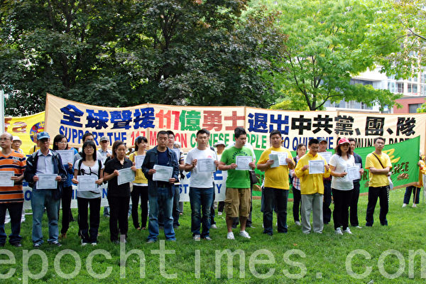
 
  
随着中共腐败及迫害人权的恶行在大陆暴露的越来越多，大陆民众不耻与中共组织为伍渐成时尚，除了自己三退（退党、退团、退队）之外，还非常乐意帮助别人三退。图为多伦多退党集会现场有多伦多来自中国大陆的21位华人领取了他们的“三退”证书。（摄影：孙泰利/大纪元）
 
 

 【大纪元2012年09月02日讯】（大纪元记者高紫檀报导）随着中共腐败及迫害人权的恶行在大陆暴露的越来越多，大陆民众不耻与中共组织为伍渐成时尚，除了自己三退（退党、退团、退队）之外，还非常乐意帮助别人三退。

 近日，退党义工“梅姨”告诉大纪元记者说，大陆三退形势发生很大变化，民众踊跃三退的情况常令她感到非常感动，不但有企业主愿意向数百名职工劝三退，也有大陆民众三退后帮助收集愿意三退人的名单。曾有一名老大爷收集了130多人联名三退的名单寻找三退的渠道，他接到退党义工电话时激动的说：“可找到你们了！”

梅姨讲述了几个帮助中国大陆人三退的故事。

 <b>老大爷收集130人联名三退名单 寻找三退渠道</b>

梅姨说，有一次，一位老大爷接到她的电话，刚听她说了几句，还没等她讲到三退呢，这位老大爷直接说：“法轮功你好！我正找你们呢！”

梅姨一听，就问：“有事吗？”这位老人家说：“有事！我们现在已经联名130多人要求三退，名单已经在我这儿了，怎么把名单给你们发过去呀？”

梅姨一听，马上明白了，这位老大爷一定是明白真相的，梅姨赶紧把海外退党中心的传真号码给了这位老大爷，告诉老大爷：发传真到这个号码就行。

老大爷认真记下传真号码后，又叮嘱梅姨：“你记得我的电话号码呀，我还要跟你联系。”

<b>企业老板愿意帮助数百名职工三退</b>

还有一次，梅姨打电话到大陆时是一位企业老板接听的，他认真的听了梅姨给他讲述三退保平安的事。

梅姨问他是党员吗，对方说“是”，梅姨就告诉他：“那帮你取个化名三退吧，共产党做的坏事太多，社会也会有灾难，天灭中共，咱们都是善良的老百姓，取个化名三退保平安，躲过这场灾难！”对方满口答应。

梅姨就帮他取了个化名并征得他的同意后，又照惯例问他：“你身边有没有朋友？家人？”想帮他的身边人也三退了。

这位企业主说，没有，但他现在单位上班，单位职工很多，将近500人。“我也想帮他们三退，不都说帮人三退功德无量吗？！我也想积功德。”

梅姨就说：“那你可以给他们讲讲，也希望他们三退。”这位企业主说：“可以呀，可以给他们说呀，但他们的名字怎么办呢？”

梅姨就又提供了退党传真号给他，请他收集愿意三退人员的名字发传真过去，自然可以办理三退。

这样的事情并不是一例，还有一位接听电话的同样是一位私营工厂的老板。他接到了梅姨的劝退真相电话后不但自己退了，还主动告诉梅姨，他的工厂还有280名工人，他也想帮工人们三退了。

梅姨同样告诉他说：“这样不行，得他们本人同意，并且还要有名字。”

这位先生请梅姨想想办法，梅姨就说，那我给你个传真号，你收集好同意三退的人的名字，发传真过来，就办理三退。对方说好，并记录了梅姨提供的传真号。

<b>三退是民众表达不耻与中共组织为伍的最佳方式</b>

近年来，随着网络的发达和中国民众的觉醒，中共的贪污腐败、迫害人权、倒行逆施、欺骗民众等种种恶行逐渐暴露于公众视野，中国民众纷纷通过各种手段在各种场合表达对中共的愤慨。中国人一般都曾被中共欺骗加入过“党、团、队”，而“三退”则是民众表达不耻与中共组织为伍的最佳方式。

近日，大陆新浪网一位自称法制杭州站编辑、记者的博主还发微博，公开表示退出XX（共产）党员身份，并告诫同行不要再昧著良心再欺骗百姓，受到热棒。

另一位退党义工燕子告诉大纪元记者说，现在大陆民众了解真相的深度和广度和以前都不一样了。谈起王立军逃馆、薄熙来政变、谷开来杀人、大连尸体工厂把中国人尸体做成标本卖到海外展览等，民众都非常乐意听和交流。一谈到共产党的腐败，造假，迫害法轮功的罪行，民众都是很认可的，很多人听到三退电话都毫不犹豫的三退。

梅姨也说，现在呀，打三退电话到中国大陆，劝人们三退比以前容易多了，如果接电话时是吃饭时间，经常是一家一家的，一桌一桌的三退。以前每天只能帮几十个人三退，现在有时一天可帮上百人三退，最近有一天就退了119个人（不包括发传真要求三退的）。

联络本文作者请发邮件到：gaozhitan@gmail.com

（责任编辑：姜斌）
 
 
  <a href=#list><h4 align="right">回目錄</h4></a>
 

 
  <a name=a-1><h2 align="center"><b>纽退党义工：三退与每一位华人息息相关</b></h2>  

 【大纪元2012年08月23日讯】（大纪元记者易凡新西兰奥克兰采访报导）自《九评共产党》引发三退大潮以来，退党网站上三退的人数已突破了一亿两千万。这个不断滚动的巨大数字背后，浸透了无数退党义工们的默默付出，新西兰的小李就是其中的一位。 

 三十出头的东北小伙笑起来牙很白，眉宇间透著一股英气。尽管小李一边上学一边还在打工，但他每天抽出一个多小时的时间给中国大陆打电话劝三退，三年多来劝退了1,500多人。小李表示，人活着应当做一些有意义的事。他希望自己能尽自己的一份力量，加速中共的早日解体。

三退是否与每一位华人息息相关，是很多人不解的问题。对此，小李表示：“中共执政60多年，各种运动使八千多万同胞非正常死亡。当今的中国，各种社会乱象，贪污腐败，有毒食品横行，道德沦丧已经到了触目惊心的地步。这一切都与中共直接导致有关。”他说：“善恶有报是亘古不变的真理！中共将受天谴是迟早的事！而党团队是中共的细胞，你加入了就是它的一份子，那么它受天谴时你就会被牵连。”

小李说：“我们中国五千年的传统文化中没有共产主义，无论是佛家、道家还是儒家文化都讲究宽容与仁爱；而共产党讲的是斗争哲学、暴力革命与无神论。美国国会图书馆馆长披露，共产党源自于黑帮组织光照帮，它的会标是一只披着羊皮的狼。而共产党的老祖宗马克思是外国人，他是撒旦教秘密组织成员。”

“即使站在另一个角度，退出中共也不仅仅是一个形式。”小李说，“人所做的一切在另外空间里都有记载。一个人一旦发誓加入党团队，那么在他的右手与额头就会打上兽记，因为中共在另外空间里是一条红色的恶龙。根据《圣经启示录》，‘所有崇拜兽和戴上了兽记的人都将在上帝最后的审判中，喝上帝愤怒的酒，永远在地狱中沉沦’。”因此，“你如果不声明退出，这个印记就无法抹掉。所以退出党团队不是为我，也不是为别人，而是为每个人自己，为你选择美好的未来。”

小李表示，根据古人的说法，天灾人祸其实是上天对人的警示，而退出中共组织后得福报的例子比比皆是。他衷心希望每一位华人朋友幸福平安。

（责任编辑：张莉莉）
 
 
 <a href=#list><h4 align="right">回目錄</h4></a>
 

 
 <a name=14><h2 align="center"><b>大陆客高举《九评》照相 旅游团在华府成群三退</b></h2> 
  

 
  
图为华盛顿DC地标建筑之一杰斐逊纪念堂 。（李莎／大纪元）
 
 

 【大纪元2015年10月27日讯】（大纪元记者李辰美国华盛顿DC报导）位于华盛顿的美国航空航天博物馆前有一道独特的风景线，部分法轮功学员长年在这里设立法轮功真相点，向中西方游客讲诉法轮大法的美好，揭露中共迫害的真相，声援发生在中国大陆的控告江泽民大潮。10月24、25日，和往常一样，一批批大陆游客在这里和法轮功学员相遇，很多人聆听了真相后认清中共的邪恶本质，选择脱离中共“三退”（退出中共党、团、队，简称“三退”）。 

 有的大陆游客“三退”后表示，早就等待着退党这一天；有的人“三退”后高举《九评》、《绝处逢生》等真相资料，分别以“美国国会大厦、华盛顿纪念碑，美国国家艺术馆”为背景照相，希望留下这珍贵的经历留念；有的人临别前含泪和法轮功学员拥抱；有的表示，他们盼望审判迫害元凶江泽民的一天早日到来；也有很多中西方游客签名，希望制止中共活摘法轮功学员器官，支持法办江泽民。 

 

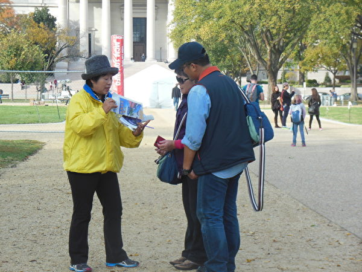
 
  
华盛顿DC法轮功学员王女士正在和游客讲真相。（李辰／大纪元）
 
 

 
  

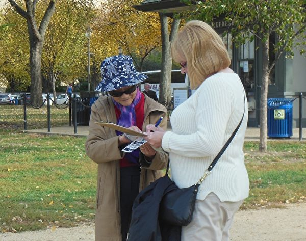
 
  
华府游客（右）签名反迫害，支持法办江泽民。（李辰／大纪元）
 
 

 
   

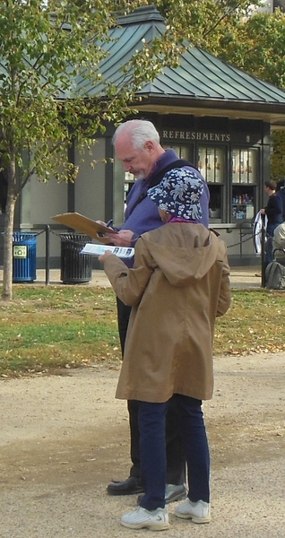
 
  
华府游客（后）签名反迫害，支持法办江泽民。（李辰／大纪元）
 
 

 <b>三五成群的中国游客退党、团 “早就盼著这一天了” </b>
 

“三退”义工之一法轮功学员王女士介绍，10月24日，从美国航空航天博物馆那边走过来几个人，和普通的老百姓打扮不一样的，看起来像高官 ，有一个人下车后往前走。 

法轮功学员王女士迎上去，笑呵呵地说：“先生您好，欢迎您到美国来旅游，带着平安幸福回家，带着有用的信息回国，现在老百姓为了保护自己，都在给自己做三退呢，现在已经有两亿多人退出党、团、队，高官都在退，退出就是福分。”待王女士说完，这第一个高官模样的中国游客很干脆，就退了。

这时又走过来了两个中国游客，他们和第一人互相打招呼，王女士上前说，“前面哥俩好啊，现在都在做‘三退’，咱也别落下，出国一趟不容易，旅游也挺辛苦的，平平安安地回家是咱们的福分。现在老百姓都在做‘三退’，这是一种天象变化，上天呵护咱们善良的人，退出党团队就是神佛要呵护的人；不退出来，就是老天要淘汰的人啦。咱们也信天意，得天福，起个化名，退出来，代表咱一颗善良的心，好不好？先生你叫永安，你叫永福，送你们哥俩两位永永远远的平安、健康、幸福。”

这两个人就说：好。他们很自然也退了。

航空馆对面的美国国家美术博物馆外面的一处地方坐了5位中国游客。王女士上前说：“你们5位哥俩都在这坐这，相见就是缘分啊，跟你们说一件事情。”王女士接着给他们讲三退保平安，讲完之后，就跟他们起名：家平、家安、家贵、家福、家乐，希望他们“三退”。

王女士还说：“现在高官都在群退，老百姓都在群退，咱们哥几个也来个群退，一块退出共产党、团、队，大家都躲灾、躲难、保平安，好不好？”其中一个人最干脆，说：好！其他3个人也笑呵呵地跟着说好，跟着退了。

这时唯独有一个人没有表态。王女士跟他说：“哥四个都退了，咱们也别落下呀。大灾大难的时候，咱们哥五个都能得到神佛的平安呵护，堂堂正正地得到呵护，多幸运啊，能都到神佛呵护的人，可不是一般的人，非常有福分啊。退出来，好不好？”这时这个人开口说：好。

王女士对他说：“你这一声好，值千金值万金，一个人平安，全家幸福。”

这样，这8个人全部退了，其中3个人还拿了《九评》、退党特刊等资料、藏字石。其中一个高官的模样退出共产党后向王女士说，我早就盼著这一天了（指：退党），其他几个人听到后都笑了。
 

<b>“三退”大陆游客高举《九评共产党》照相 和法轮功学员含泪拥抱</b>
 

10月25日，从对面的航空航天博物馆那边走过来了两位先生，来到法轮功真相点的展板前看真相。 

王女士上前说：“先生，欢迎您来看展板真相，能来看真相的人都是非常了不起的善良好人。现在有个‘三退’大潮，有2亿多人退出党、团、队。咱也别落下，我也送你个化名。”其中第一位先生就退了，另一个人听了在场其他法轮功学员讲真相后也退了。

这第一位先生手里拿着手机，王女士接着对他说：“先生，你把展板的内容照下来吧。回去后给亲朋好友看，他们没有像您这样有福气，来美国看真相。吃的、喝的都有用完的时候，唯有把这个珍贵的真相带回去，是无价之宝，救命啊。”这位先生听完王女士的话就把这几张展板的内容全部照相照下来了。

王女士表示，看他挺善良就给了他一本《九评》书，并且接着说：“《九评》很珍贵啊，你看一看，你什么都明白了。“这位先生这时就拿着《九评》，转过身来，手里高举《九评》过头，王女士就给他照了张相。

照相后，这位先生手里拿着好几份真相资料就往前走，王女士说：“华盛顿航天博物馆的这周围，都是世界著名的旅游景点，照几张相带回去，给亲朋好友看，留个纪念吧。我可以在这几个地方给你照几张相。”

他非常高兴地说：“好，好啊。”这位先生在国会山、美术馆、自然博物馆、华盛顿纪念碑等景点前都照了相，这位先生每到一处，自己把手里的真相资料换一个、举起来，照一张相。王女士介绍，他拿着照相的包括：《九评》、《绝处逢生》、明慧特刊《藏字石揭秘》等真相材料。

照完了，这位先生表示挺感谢，这时和他一起过来的另一位已经“三退”的朋友，也跟着走上来了。王女士对他说：大哥，刚才这位照相，你没照到。你们一块同行的，我给你们哥俩一块照几张吧。

这位老先生非常高兴 ，手里还拿着《九评共产党》系列文章的报纸。他把报纸展开举起来照相，周围的人也都看到了。

王女士表示，“这几个景点都跟他们照了，照完了之后，我真的心里头很感动，我就上前，跟他们一起三人拥抱在一起，还有另一位法轮功学员在场，她也加入进来，4个人拥抱在一起，互相拍著肩膀。我流泪了，看到一位先生眼眶也湿润了。”

王女士说：“中国人都像你们哥俩这样的，真的有正念、善良，中国就有希望了。”后来他们千感谢万感谢，反反复复跟王女士握手几次手后，告别走了。
 

<b>年青男女：我们盼望着审判江泽民的一天早日到来</b>
 

王女士还介绍，10月25日中午的时候，过来一对小年青，一看就像是一对恋爱对象，女孩很漂亮，王女士觉得他们是韩国人或日本人，结果一打招呼，是中国人，男孩入过少先队，女孩入过共青团。 

王女士说：你们这么年轻，送给你们个好听的名字，你（男的）叫阳光，你（女的）叫明月，祝你们两位生活得美满幸福、吉祥如意。退出来，躲灾躲难保平安。他们说：好，阿姨，谢谢您。

王女士接着就跟他们法轮功真相、中共栽赃的天安门自焚案、大量法轮功学员被活摘器官、大陆出现的控告江泽民大潮等。

“现在迫害法轮功真的维持不下去了，今年5月，最高法院‘有案必立，有诉必理’以后，4个多月时间，已经有超过19万法轮功学员和家属，状告江泽民，把控告书递交到最高法院、最高检察院。已经有11万多得到回执。迫害法轮功的元凶江泽民，千古罪人啊，罪恶滔天，现在起诉江，顺天意，得民心。”

最后这位男青年说：阿姨，我们盼望着审判江泽民的一天早日到来。

王女士表示自己也挺感动地，对他说：你真了不起，你这句话说明太明白真相了。这一句话，惊天地、泣鬼神，你会得到大福报的。
 

<b>2005年1月12日大纪元发表郑重声明：</b>
 

“广大的中国民众：共产党的末日就要到了。但是这个邪恶的党（魔教）在历史上却对众生、对神佛犯下了滔天大罪，神一定要清算这个恶魔。 

如果有一天，神指使人类的谁对共产党清算时，也一定不会放过那些所谓坚定的邪恶党徒。我们郑重声明：所有参加过共产党与共产党其它组织的(被邪恶打上兽的印记的)人，赶快退出，抹去邪恶的印记。一旦谁对这个魔教清算时，大纪元储存的记录可以为声明退出共产党和共产党其它组织的人作证。

天网恢恢，善恶分明；苦海有边，生死一念。曾被历史上最邪恶的魔教所欺骗的人，曾被邪恶打上兽的印记的人，请抓住这稍纵即逝的良机！”
 

<b>美国国会录入退党中心报告到国家政府档案</b>
 

2012年年底，美国国会及行政当局中国委员会（CECC）将“全球退党服务中心”提交的一份报告录入美国国家政府档案，该档案由美国参议院，众议院的部分议员、美国国务院副国务卿、美国国务院东亚事务助理国务卿等高级行政官员共同列名发表。 

该报告详细介绍了发生在中国的退党运动，内容表示，发生在中国的退党大潮如星火燎原，一些知名人士甚至用真实姓名“三退”，其中包括中共安全谍报系统官员、中共驻外大使馆官员、海外中国学者精英人士等；退党运动将为中国带来美好的未来。

该报告指出，退党不是旨在推翻中共的政治运动，而是一场基于个体的精神觉醒运动；中共的灭亡是其自身邪恶和反宇宙的必然结果；中华民族已存在五千年，历经朝代更替，中国依然屹立；共产政权是中国历史上最为黑暗、邪恶的政权，当其退出历史舞台，中国将迎来民族的复兴。# 

<table>
<tr>
 <td>
如何“三退”，请点击翻牆网站<a href="https://git.io/op">   https://git.io/op  上大紀元網站三退</a></td>
</tr>
 </table>

责任编辑：高静
 
 
 
 
 <a href=#list><h4 align="right">回目錄</h4></a>
 

 
 
 <a name=13><h2 align="center"><b>大陆游客出国“躲霾” 争相“三退”</b></h2> 
  

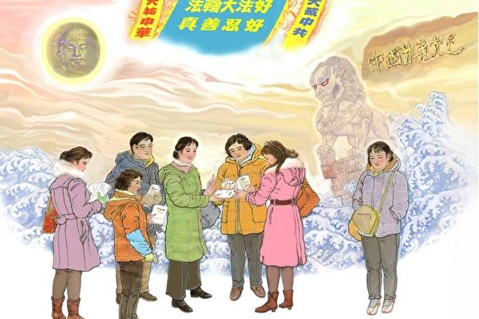
 
  
近日，因中国大陆阴霾天气，出来“躲霾”的大陆游客多起来，尤其是北京游客叫苦连天，北京游客见到欧洲景点上向各国民众讲述法轮功被迫害真相的法轮功学员特别亲热，纷纷表示三退。（明慧网）
 
 

 【大纪元2015年12月31日讯】欧洲旅游淡季游客减少，但是进入十二月，因中国大陆阴霾天气，出来“躲霾”的大陆游客多起来，尤其是一群群北京游客叫苦连天：“就是因为北京的雾霾，我们才出来的！”上海、广州、沈阳、长春的游客也抱怨他们那里空气质量远不如以前，“雾霾天出门也得戴口罩”。

 北京游客见到欧洲景点上向各国民众讲述法轮功被迫害真相的法轮功学员特别亲热。有人三退（退出中共党团队）了以后不放心，回来问：“我的退党化名叫什么来着？能不能给我写下来？”问清楚后，自己记下来收好，又高高兴兴地走了。

<b>北京游客：谢谢法轮功救我们！</b>

这天，瑞士景点又来了一群北京游客。有游客对法轮功学员说：“帮助把我们也办出来吧，简直没法活了！”“我们移民不成，只能听天由命啦！”“我们也是难民，叙利亚是战争难民，我们是生态难民。”法轮功学员安慰游客：别太悲观，移民也不是那么简单的事，都想移民也不现实。但是，现在有自救的办法。只要你顺天意，就能躲劫难保平安。有神佛保佑。听法轮功学员这么说，游客马上静下来，等著听怎么躲劫难。

法轮功学员说：北京雾霾首次发了红色警报，说明北京空气污染恶化。我也是北京人，心里不是滋味。有游客大声说：“别回去了，那不是人呆的地方！”法轮功学员说：为什么大半个中国有雾霾，还有扩散的趋势，中国大好河山变成了不是人呆的地方？谁之过？

有游客：“政府玩命卖汽车、开工厂啊！”又有游客说：“改成单双号出行也没见管用？”法轮功学员说：你们出来走了好几个国家，到处是汽车，沿路工厂也不少，怎么没有雾霾？游客说人家国家重视环保。

法轮功学员说：我们国家为什么不重视？游客说：都是共产党的贪官为赚黑心钱，不管国家利益，不管老百姓的死活。法轮功学员说：中国环保方面有一堆大大小小的法律，为什么没人照办没人管？游客说：官商勾结捞完钱就跑了。公安法院都买通好了，警察法官就替他们说话，官官相护。法轮功学员说：这就说到根儿上了，中国环境污染到毒水、毒食、毒气，是共产党一手造成的，是中共造成的。

游客听了都点头称是。法轮功学员说：还不止这些，共产党干了更加丧尽天良的事！迫害法轮功，把信仰“真善忍”的大批好人抓起来，不仅酷刑折磨，江泽民还下令活摘法轮功学员的人体器官卖了赚钱发财。江泽民和共产党互相利用，犯下了反人类罪！

有游客表示已经听说了。

法轮功学员接着讲：人无德，就会有天灾人祸。中国的雾霾绝不是偶然发生的，背后有人祸。天降灾于人！知道雾霾空气检测出什么成分？和火葬场焚尸炉里排放出来的烟一样，呛人的腥臭味也一样。

听到这里，有游客焦急地问：“那怎么办？”法轮功学员说：只有“三退”能保平安，谁想躲过这场劫难，不跟着恶党恶人倒霉，要声明退出共产党的一切组织，作废毒誓，抹去兽印，免遭淘汰，求神佛的保佑。现在我给大家起化名，想退党自己认领，入过什么退什么。我帮忙上退党网站登记退。一群北京人大声回应：“退！”问一个，退一个，“好”、“退”、“谢谢”、“托你们的福，你也保重啊！”“谢谢法轮功救我们！”

<b>东北游客：有钱有车管什么用！？</b>

景点一女游客绕开法轮功学员走。法轮功学员说：你出来一趟不容易，遇到我也不容易，还躲躲闪闪的，我真为你着急。你看雾霾不断地发生，越来越厉害，那不就是天警示人嘛！这么冷的天，我站着等著大伙，就是要告诉你怎么躲劫难，是不是为你好？

女游客站住了，不好意思地说：跟您说实话，出来之前我还觉得自己的日子比以前强多了，买了车，买了房。出来一看，那没法跟人家比，有钱有车管什么用啊，最基本的生活水平都没有！看人家这的空气，一口气敢吸到底；这的水，一眼能看到底，山是山，水是水，多痛快啊！这才像人待的地方。对比国内，感觉真不是滋味。我虽然不是北京人，我们东北的空气也远不如以前了，污染得厉害，那真是不敢大口喘气。

法轮功学员讲了中国天灾背后的人祸，中共面临灭亡。

女游客说：您讲的很实在，是为我们好。那有什么办法呢？法轮功学员说：有办法，就看你听不听了。女游客：那你快说说！法轮功学员：听说过三退吗？女游客不以为然地说：噢，听说过。法轮功学员：你可别不当回事。你要是入过党、团、队的话，举过拳头发过誓，把一生献给党，那是向恶党发了毒誓。发过毒誓是有痕迹的，天灭中共的时候，难逃一劫，一起被淘汰。女游客紧张地说：“我没入过党！”法轮功学员说：共产党组织包括党、团、队，哪样不退都危险，都是不安全因素。她说：“那好，帮我退了吧。”

女游客掏出一包大枣、核桃仁，塞到法轮功学员手里说：这是祖国的，你那么爱国，爱我们同胞，你得收下。见法轮功学员推辞，她说：“你们真是好人，我都不知道怎么感谢你们，就给我这个面子吧。”法轮功学员收下礼物，从自己兜里掏出块巧克力回赠给她。她高兴地接过去掰开，分给周围做了三退的游客吃。一群人高兴地向法轮功学员道谢。

<b>《九评共产党》引发退党大潮</b>

2004年11月大纪元发表系列社论《九评共产党》，深刻揭露了中共的邪恶本质，在中国引发了全民精神觉醒的退党大潮，至今已经持续了11年多。宣布退出中共组织的声明开始不断地涌进大纪元编辑部。目前在大纪元退党网站上公开声明退出中共党、团、队组织的人数已超过2.2亿人。“三退”者涵盖社会各行各业、各省份地区，也包括不少中共中高层干部。

2005年2月22日，一些志愿者主动正式成立了“全球退党服务中心”，为中国民众退出中共党、团、队提供各种退党通道的服务，并在世界各地开设退党服务站（点），海内外法轮功学员成为主要的志愿者。

2012年年底，美国国会及行政当局中国委员会（CECC）将“全球退党服务中心”提交的一份报告录入美国国家政府档案，该档案由美国参议院、众议院的部分议员、美国国务院副国务卿、美国国务院东亚事务助理国务卿等高级行政官员共同列名发表。

<b>大纪元郑重声明</b>

2005年1月12日大纪元发表郑重声明：劝告中国民众：共产党的末日就要到了。但是这个邪恶的党（魔教）在历史上却对众生、对神佛犯下了滔天大罪，神一定要清算这个恶魔。如果有一天，神指使人类的谁对共产党清算时，也一定不会放过那些所谓坚定的邪恶党徒。赶快退出中共组织。一旦谁对这个魔教清算时，大纪元储存的纪录可以为声明退出共产党和共产党其它组织的人作证。

<table>
<tr>
 <td>
如何“三退”，请点击翻牆网站<a href="https://git.io/op">   https://git.io/op  上大紀元網站三退</a></td>
</tr>
 </table>

责任编辑：高静
 
 
 
 
 <a href=#list><h4 align="right">回目錄</h4></a>
 

 
 <a name=12><h2 align="center"><b>瑞士景点 大陆游客呼朋唤友成群三退</b></h2> 
  

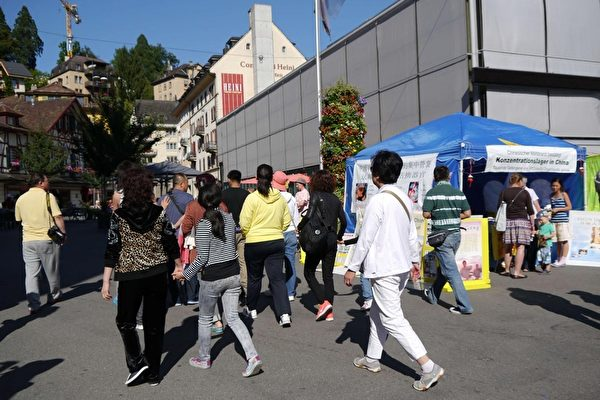
 
  
在瑞士卢塞恩景点，中国游客路过法轮功信息摊位。（明慧网）
 
 

 【大纪元2015年10月31日讯】欧洲的秋季，旅游进入淡季，瑞士景点大陆游客团渐少，但景点上，退党服务中心的义工劝三退（退出中共党、共青团、少先队）的人数却一点不少。义工反馈：特别是十月中旬以来，我们三言两语，对方就退了。一人退了不算完，往往再招来几位亲戚朋友也退，引来一群游客三退。义工和大陆游客谈笑风生，相互拥抱。

 
<b> “让共产党蒙惨了 冤枉法轮功了”</b>
 

据明慧网报导，有三位大陆女士边和义工拥抱，边激动地说：我们让共产党蒙惨了，冤枉你们法轮功了。法轮功好，揪出江泽民这个大卖国贼，为民除害，谁说你们不爱国！

1999年7月开始，江泽民集团对法轮功学员迫害手段之一“名誉上搞臭”的实施，是由中共绝对控制的媒体进行的。编造所谓自杀、他杀等案件，极尽能事对法轮功及其创始人进行诬蔑和抹黑宣传。其中最具蛊惑性的仇恨宣传就是“天安门自焚伪案”嫁祸法轮功，欺骗了众多的中国老百姓。该伪案后被包括服务于联合国的国际教育发展组织（IED）在内的多个国际组织认定为虚假编造。

在景点上，下车的大陆游客，见退党服务中心的义工发有关法轮功真相的资料，就直奔过来问：是法轮功吗？是退党的吗？有什么新消息？当得到义工肯定答复后，常有人说“法轮大法好”！很多人主动要求三退，退了就走。有人说常翻墙，什么都知道，不用讲了。材料也不用了，网上能找到。

10月26日在卢塞恩景点，一个多小时里，一位退党服务中心的义工劝退了90名大陆游客。“那是问一个退一个，没有摇头的。”

一中年女游客，迳直走到退党义工跟前问：你管退党吗？义工：是啊，你退了吗？她说：可我不是党员，还用退吗？义工：要退。退党，指的是三退，不仅是退党，还包括退少先队、退出共青团，入过什么退什么。因为都是中共的邪恶组织，加入时发过毒誓，不清除就很危险。她说：噢，如果说三退，我还没退。义工：我帮你起个化名退队退团吧？她拿了一份真相资料说：那好，退吧。

<b>“谢谢帮退了 现在最想要的就是平安”</b>

旁边的石椅上，坐满了歇脚的大陆游客。一位六、七十岁的老先生见那位女士要了资料带走了，问义工：什么材料？义工：江泽民是汉奸卖国贼。老先生说：那得来一份。义工递给他时说：如果我没猜错，你肯定入过党，还是老党员。他一听又笑了。

义工问：您知道三退的事吗？老先生说：听说了，现在谁不知道这事啊？！义工：那您退了吗？他一听又笑了。义工：您笑，那就是没退呗。老先生说：怎么都让你说着了。

义工对老先生说：咱们见面就是缘分。您知道，现在已经有二亿多中国人三退了，因为“天要灭中共，三退保平安”。对共产党、江泽民的邪恶，您可能比我了解得还清楚。他说：江泽民不就是共产党员吗？还是党主席！义工：您想想，江泽民坏不坏？共产党坏不坏？他说：哎呀，坏透了！义工：现在反腐抓的这些贪官道德败坏，腐败透顶，个个不但是共产党员，还都是跟着江泽民迫害法轮功的人。现在谁不恨江泽民？谁还相信共产党？我想您也不相信吧？老先生呵呵又笑了说：这回又让你说着了！义工：那我帮您起个化名退吧，退党退团退队？他爽快地说：好！谢谢你。

坐在石椅上的其他几位大陆游客，都看着、听着刚才义工和老先生的这番对话。义工说：大伙都点头笑了，是给了老先生一个赞，表明你们也讨厌江泽民，不信共产党，对不对？一群人都应声：没错。义工：你们出来一趟不容易，要能把平安幸福带回去，这趟就没白出来。七、八个人高声说：退！谢谢帮我们退了，现在最想要的就是平安！

<b>“人家不糊涂不傻 可别把咱们落下”</b>

“过来，快过来！”就听第一位退党的老先生招呼远处的同伴。他对走过来的三人说：听听人家讲的，特别好，句句在理上。义工：谢谢夸奖。这说明您真明白了，真的认清了共产党本质，为您高兴啊。老先生：该谢的是你，麻烦你也再给他们说说。这三人听了义工讲真相后，都说退，夸义工诚恳。

三人和义工道谢后离开了。过了一会，老先生招呼义工：你看见了吗？刚才那三人，正给那群人说呢，都是你给他们讲的，“现在都有二亿人三退了，退了能保平安，人家不糊涂不傻，可别把咱们落下。”老先生绘声绘色地学给义工听，又幽默地说：你看，在你这儿听了，又上那边讲去了，他们帮你宣传呢，怕你一人忙活不过来。

义工笑着走过去，就听有人说，“对，咱也别做傻子！”有游客问义工：是法轮功吗？义工：是啊。游客：那好，快给我们说说。义工说：现在你们手里拿的就是关于江泽民的材料，从他当汉奸出卖国土，怎么腐败治国，祸国殃民，到怎么迫害法轮功，下令活摘法轮功学员人体器官贩卖牟利。游客一边翻看手里的资料，一边大骂江泽民。

<b>“江泽民是最坏了 该告他”</b>

义工接着说：二亿多人三退了，你们知道了，再告诉你们个新消息，已经有十九万人状告江泽民。游客：江泽民是最坏了，该告他！有游客问：“两高”真收状子了？义工：收了。今年五月开始的新规定，有案必立，有诉必理。全国各地的法轮功学员陆续向北京的最高检察院、最高法院投刑事控告状。

<b>“亡的是共产党 保的是国家”</b>

游客说：这回江泽民是彻底玩完了，关他的笼子都打开了，就等着他进去呢。还有游客说：江泽民老底都揭出来，共产党还不完！其他游客说：还真应了那句话，反腐亡党，不反腐亡国。又有游客回应：对啊，亡的是共产党，保的是国家啊！

导游招呼游客上车。义工说，还想和大伙多聊聊，你们要走了，回去慢慢看手里的材料，看明白了回去给大伙讲讲，先三退保平安吧。游客：好，咱们大家都平安，你也平安！法轮功真了不起，在国外不容易啊！保重！保重！一群人都退了，高高兴兴上车了。

<b>《九评共产党》引发退党大潮</b>

2004年11月大纪元发表系列社论《九评共产党》，深刻揭露了中共的邪恶本质，在中国引发了全民精神觉醒的退党大潮，至今已经持续了11年多。宣布退出中共组织的声明开始不断地涌进大纪元编辑部。目前在大纪元退党网站上公开声明退出中共党、团、队组织的人数已超过2.16亿人。“三退”者涵盖社会各行各业、各省份地区，也包括不少中共中高层干部。

2005年2月22日，一些志愿者主动正式成立了“全球退党服务中心”，为中国民众退出中共党、团、队提供各种退党通道的服务，并在世界各地开设退党服务站（点），海内外法轮功学员成为主要的志愿者。

2012年年底，美国国会及行政当局中国委员会（CECC）将“全球退党服务中心”提交的一份报告录入美国国家政府档案，该档案由美国参议院、众议院的部分议员、美国国务院副国务卿、美国国务院东亚事务助理国务卿等高级行政官员共同列名发表。

<b>大纪元郑重声明</b>

“中国共产党亡”的 “藏字石”面世一年多之后，大纪元网站发表《九评共产党》系列文章，深刻揭露了中共的邪恶本质、血腥历史以及邪教流氓本性。2005年1月12日大纪元发表郑重声明：

“广大的中国民众：共产党的末日就要到了。但是这个邪恶的党（魔教）在历史上却对众生、对神佛犯下了滔天大罪，神一定要清算这个恶魔。

如果有一天，神指使人类的谁对共产党清算时，也一定不会放过那些所谓坚定的邪恶党徒。我们郑重声明：所有参加过共产党与共产党其它组织的（被邪恶打上兽的印记的）人，赶快退出，抹去邪恶的印记。一旦谁对这个魔教清算时，大纪元储存的纪录可以为声明退出共产党和共产党其它组织的人作证。

天网恢恢，善恶分明；苦海有边，生死一念。曾被历史上最邪恶的魔教所欺骗的人，曾被邪恶打上兽的印记的人，请抓住这稍纵即逝的良机！”

<table>
<tr>
 <td>
如何“三退”，请点击翻牆网站<a href="https://git.io/op">   https://git.io/op  上大紀元網站三退  https://git.io/tv123</a></td>
</tr>
 </table>
责任编辑：高静
 
 
 

  <a href=#list><h4 align="right">回目錄</h4></a>
 

 
  <a name=11><h2 align="center"><b>严寒欧洲 大陆游客“三退”热火朝天</b></h2> 
  

 
  
铁塔翻新工程将于2012年初动工。（MIGUEL MEDINA/AFP/Getty Images）
 
 

 【大纪元2016年03月03日讯】（大纪元记者黎平报导）中国新年前后，一些大陆游客在欧洲景点见到退党服务中心做义工的法轮功学员就抱拳拱手说：“给法轮功师父拜年！问大法师父好！”有游客高呼：“法轮大法好！法轮功是正能量！”一拨拨游客拉着法轮功学员合影拍照说：“借借你们的福气，沾沾你们的神光！你们是中国的希望，都盼你们早日回去呢……”

 多年来，出国旅游的中国人时常都能在海外看到或接触到以法轮功学员为主的退党服务中心的义工们活跃在各类公共场所和旅游景点，他们向大陆民众讲诉法轮功无辜遭受中共残酷迫害的真实情况，揭露中共的谎言暴力专制，劝告中国人脱离中共──“三退”（共产党、共青团、少先队）以保平安。 

2004年底，大纪元报社发表系列社论《九评共产党》，全面系统地揭露了中共的罪恶历史，剖析了其反天、反地、反人类的邪灵本质及给中华民族带来的深重苦难与危机。

《九评》引发海内外中国人“三退”的大潮。据大纪元退党网站数据显示，至目前为止，已有超过2亿2千万的中国民众宣布退出中共的“党、团、队”组织。

11年来，中国民众的三退行动已引起国际媒体及外国政府的关注，2011年俄罗斯经济分析研究院把上亿中国民众公开声明退出中共党的相关组织列为“全球前三大事件”。美国参众两院2011年分别通过决议案，支持中国民众退党。2012年底，美国国会及行政部门中国问题委员会（CECC）将全球退党服务中心提交的报告收录进美国国家政府档案。

以下为欧洲退党中心的义工们分享他们帮大陆民众劝三退的一些小故事。

过年之际，正值欧洲的严冬，却是大陆学生寒假期间，所以来了不少学生团、家长带着孩子的家庭团。法轮功学员介绍：这些日子遇到的有缘人特别多，三言两语，说说就退。有景点反馈：讲一个退一个，和过去不一样了，劝三退容易多了。夫妻互相鼓励双双退；大人退了喊孩子来退，孩子退了，喊大人来退；朋友互相招呼都来退；学生成群的退。
 

<b>瑞士卢塞恩：一团游客挨个退，没剩下几个</b>
 

法轮功学员潘大姐对一群大陆游客说：你们看这年前年后大变天，今天冷，明天热。昨天是夏天穿裙子，今天是冬天穿棉袄。上海游客说他们那里降温到零下十度，崇明岛水厂的大水管都冻裂了。游客都说天气异常得心里发慌，是不是要出事？ 

潘大姐说，“人在做，天在看”，人干了坏事，能不遭天报吗？“人无德，天灾人祸”。 游客议论风水命相，都说今年猴年不太平，网上传猴年要变天，要出大事！潘大姐说，天灭中共，共产党要完了，还不是大事？游客说，都盼共产党快完蛋，可我们老百姓凭什么跟着倒霉？

潘大姐说，想躲劫难有办法，“三退保平安”。见游客不以为然，潘大姐接着说，天津大爆炸，瞬间一片火海；重庆沉船，转眼四百多人淹死了；深圳渣土山滑坡，多少人被活埋！这样的劫难来了，你能怎么样？劫难来之前，有人告诉你吗？有游客问，退党就管用了？

潘大姐说，“三退保平安”，这是神佛指给人逃生的路。凡是加入过党、团、队的，必须要声明退出去，把加入时举著拳头“把一切献给恶党”的毒誓宣布作废才行，你才能得到神的护佑。顺天意，就能躲劫难，保平安。而且，要抓紧时间赶快退，中国的大变局和现在的天气一样，说变就变。共产党可能一夜之间就倒了，它真倒了，你再退，就不管用了。因为你发过的毒誓（举拳宣誓将一生献给共产主义）没作废，表明你还是中共体系里的一份子，天灭中共的时候，会一起被淘汰。

听了潘大姐这番话，游客不再沉默了，“我退，我退！”每人领个化名就退，然后道谢离开。后面的围上来接着退，一拨接一拨。一团三、四十位游客基本都退了，最后没剩下几个。那位中年男导游在旁边看着，招呼退了的游客上车，没退的，他也不催。
 

<b>老党员：江泽民太坏了，神都不能饶他！</b>
 

一老先生站在旁边听听真相，见大伙登记完三退后都陆续散开了，他走过来说：我算是老共产党员了，有三十五年的党龄，但是我把共产党看透了，你讲的一点不错！共产党是好话说尽，坏事做绝，尤其那个江泽民，坏透了！他祖上就不好，他爹是汉奸，他也是汉奸，还是大卖国贼！坏人排队，江泽民是头一个。 

潘大姐说江泽民镇压法轮功，下令活摘法轮功学员人体器官贩卖，迫害信仰“真善忍”的修炼团体。老先生说：“江泽民是太坏了，人不饶他，神也不能饶他！”

潘大姐问他退党了吗，他说：“那还不退？退！没有什么舍不得的。”
 

<b>预备党员：共产党我不进去了，队团我退出来！</b>
 

一小伙儿听了真相后说：“我是预备党员，我还没进去呢。”潘大姐说：“不进去好啊，但是以前入过队、入过团也要退，不退不安全。”他说：“您刚才讲的多明白啊，共产党我不进去了，队、团我退出来。麻烦您帮我退了吧。” 

 

<b>老政法退党后，喊来妻子朋友也退</b>
 

一位六十多岁的大陆游客，他告诉法轮功学员潘大姐，自己是政法委的老人，干了大半辈子。潘大姐问他对法轮功怎么认识？他说“心知肚明”， 潘大姐问此话怎讲？他表示法轮功是好的。问他退了没有？他说：“那我就退吧，在您这退了。”登记后，他喊妻子过来退。妻子有点犹豫，他催促她：“退吧退吧！”妻子说：“那好吧，退了。”
 

这时，他又喊同团的一中年女游客过来退。女游客说：“退什么呀，听天由命吧！现在有一个小时的快乐我都享受。”潘大姐问为什么这么悲观？她说，整天在雾霾里，不就是吸毒吗？哪时死哪时算吧。潘大姐问知道退党吗？她说知道，没入过党。潘大姐说是三退，包括党团队。她听了为什么三退保平安后，立时同意退，并千恩万谢眼前的珍姐，说这趟旅游太值了，捡了条命回去。然后，她滑著舞步离开了。
 

<b>德国景点导游：我退了，也应该支持别人退！</b>
 

法轮功学员在德国中餐馆遇到一位大陆团导游。给他真相资料，他接了，还多要了几份，说过会放到车上让游客自取。 

交谈中，提到还有导游听从中共的那套，阻挡大陆游客了解真相。他说，以前我也那样，怕被举报，砸饭碗。现在形势明显不一样了，我注意了，习近平也不反对法轮功，我干嘛还听江泽民的那套？政策早晚得变。去年我退了，我觉得自己退了，也应该支持别人退，更不能阻拦别人退。法轮功告诉我，不能只顾挣钱，得分清善恶，行善积德，自然有福报。我当导游这些年，一直在听法轮功讲，人家春夏秋冬站在外面讲，为什么？为我和我家里好，我懂好歹啊！我也学你们与人为善，做人得讲点儿良心！
 

<b>英国剑桥前做了三退的一群群学生：谢谢阿姨！</b>
 

来英国剑桥大学参观游览的大陆游客，学生更多。法轮功学员周女士对大陆学生说退党保平安，都乐意接受。给他们讲天安门自焚伪案，告诉他们想学业有成，有美好未来，一定要记住，爱国不能爱党。中共干了很多坏事，天要灭它！来了劫难，如果你们三退了，就能得到神佛的护佑，不受恶党牵连，躲过劫难。听到这，学生们都高兴了，说：“噢，好的，现在就退！谢谢阿姨，谢谢阿姨！”

最近周女士遇到上海团五位游客。前面三位是年岁大的，说都退休了。周女士一说退党，三位二话没说都表态同意退。后面跟上来二个年轻人，小伙儿说：“阿姨，我们都知道，凡是共产党反对的都是好的。”周女士问：“法轮功呢？”小伙儿：“法轮功肯定好啊！”周大姐给他们登记了三退，都要了材料，说回去好好看看。
 

<b>波兰华沙的大陆游客和以前不一样了</b>
 

法轮功学员张女士说今年遇到的有缘人特别多。华沙不是大陆的热门景点，但是大陆天南海北的游客也不少。一群年轻游客听了真相后对张姐说：“大姐，你真和气啊，说得对啊，是这么个理。谢谢你！” 

在华沙，张女士遇到的大陆人，无论是旅游的，出差的，还是刚出来的华人讲三退，都不反感、不紧张，也不惊讶，而且谈一个，成一个，一劝就退。

张女士和大陆游客交谈时，说到自己是炼法轮功的，问对方：“你们怕不怕？”大部分人：“那有什么可怕的，现在和以前不一样了！”张女士感慨，真的不一样了，以前，对方一知道你是法轮功，马上紧张起来，有了戒备，防着你，有很多忌讳。

责任编辑：高静
 

 <a href=#list><h4 align="right">回目錄</h4></a>
 

 
 <a name=3-0><h2 align="center"><b>中共省部级高官纷退党：你们真是做好事</b></h2> 
 

 【大纪元2015年04月16日讯】（大纪元记者徐亦扬综合报导）2004年11月19日，大纪元发表系列社论《九评共产党》。至今，“三退”（退出中共党、团、队）大潮席卷海内外。目前，大纪元新闻网站上的三退人数已经超过两亿，三退的人数每天在12万人左右。在世界各地的著名旅游景点，随处可见退党义工为海外民众和大陆游客提供三退服务。 

 
 义工们发现，现在大陆游客接受真相并三退越来越容易，甚至有旅游团整团三退，并且真名登记三退的人多了，支持和感谢法轮功的人也越来越多。而在这些三退的中共党员中，有许多是中共各级官员，甚至是高官。 

<b>探亲部级高官退党</b>
 

美国圣地亚哥法轮功学员张女士常年到退党服务点做义工、劝三退。一次，一辆崭新的凌志轿车在退党义工的桌子不远处停了下来。车里下来一位中年人并来到桌前，他指著车里的一位年长者说：“他是我哥哥，从大陆来探亲，想问问你们在这里退党是怎么一回事？” 

义工过去告诉年长者：“《九评共产党》揭露了共产党的邪恶本质，引发了全球海内外华人三退的大潮，你一定要看，你是它的一员，一定要远离邪恶保平安。”长者表示，回去会看《九评》并同意退党。

一旁的弟弟告诉退党义工：“我哥哥可是部级高官啊！”义工于是告诉他，希望他回到大陆后向体制内的人讲一讲在美国的退党见闻，他点头表示同意。
 

<b>省委书记退党</b>
 

欧洲退党服务中心义工潘女士说，这些年义工们遇到不少中共各级官员，尤其是大官，不怎么费劲，讲讲就退了。也有不少人是主动来退党的，像这样的人都说看过《九评》。 

潘女士表示，一名官员退党后，其身边的秘书告诉她：“这是我们的省委书记。”潘女士当时递给他一本《九评》，跟他讲了几句真相，他就决定退党，还对潘女士表示感谢。

2013年底，一名大陆来的先生站在景点等人，他承认自己是“正部级干部”，接了潘女士给的《九评》，听她说了几句就表态：“我了解情况，我退。”
 

<b>副厅级干部：你们真的是在做好事啊！</b>
 

加拿大义工董女士每天都要往大陆打两个小时的劝三退电话。今年中国新年时，董女士的一通越洋电话打过去，对方一位男子问：“什么事啊？”董女士告诉他，要“三退保平安”。看对方不出声，她就继续告诉他三退的意义。 

听完后，对方还是不出声，董女士说：“请问你们家有人是党员吗？赶紧退出来就管用了，因为神佛看人心，真心退了就平安了。”

对方终于出声了：“我是副厅级干部，你说我能不是党员吗？！”

男子开始滔滔不绝起来。他说：“平时接到这种电话我都不听，今天很认真听完你的讲述，不知怎么就觉得特别高兴和特别的相信，其实之前也有人给我讲过这些事，我都不太愿意听，而今天就很特别，我很乐意听，因为突然觉得：你们真的是在做好事啊！中国现在这种局势，谁还管别人啊，就你们了。”

董女士问：“那我给你起一个‘洪福’的化名马上退了，你同意吗？”他激动地说：“同意，同意，太好了，太好了，谢谢，谢谢！”
 

<b>安全部门党委书记：我退！我退！</b>
 

1月底，欧洲进入冬季时令，已是旅游淡季，但大陆游客和过去同期人数相比却明显增多。对一走一过的团队，游客们一下车，等候的退党服务中心义工便迎上去劝退。
 

义工给坐在石凳上歇脚的一排人讲真相，其中一人说：“你别说了，我们这里有安全部的一块出来了。”义工说：“安全部是搞安全的，劫难来了，他能保证自己安全吗？”大伙一听都笑了。义工说，谁明白真相，选择退了，谁安全；谁不退，谁不安全。”

大伙静静听着。有人说：“那是我们党委书记，他要退了，我们都退。”义工说：“你们退了，他也会退的，我刚才讲真相他也在听嘛。”于是这几个人就都点头退了。

那名党委书记对来到跟前的义工说：“材料我不拿了，我们一群人手里都有了，留给别人看吧。我退！我退！”
 

<b>“法轮大法师父好”</b>
 

美国首都华盛顿DC不仅是美国的政治中心，也是旅游胜地，宇航博物馆便坐落在国家广场的中间地带，是游客们的必到之处。 

一天，法轮功学员给五六名衣冠楚楚的中共高官讲真相，说完后，劝他们三退。其中一名官员立刻同意三退。学员请他记住“法轮大法好、真善忍好”九字吉言，他马上举起拳头喊了一遍，突然他再一次将拳头高高举起，伸直胳膊，大声喊道：“法轮大法师父好！”声音之洪亮，响彻了广场。

学员惊叹道：“先生啊，您的大善之举惊天地、泣鬼神啊，你一定会有大福报的。”他笑着说：“对，我相信我一定会有大福报的。”周围其他几位官员也都会心的笑了。
 

<b>国企人员整团退党</b>
 

圣保罗是巴西第一大城市，这里云集了二十多万华人。25街、东方商城等大商厦是拉美地区最大的百货批发集市，也是全巴西华人最密集的地方。法轮功学员在这里讲真相、劝三退，时常几句话就能打开对方的心结，使对方同意三退。华人接真相资料、听真相的人也越来越多。 

在一个博览会上，法轮功学员遇到中国大陆参展团的一群国企人员，他们每人都接了真相资料和《九评》。再经过他们展台时，见到他们的“头儿”在专心看 《九评》，学员问他看《九评》的体会，他说：“这上面说得都对，共产党就是这么坏！”

他们有人说：“我们每次到国外参展，都看见有你们法轮功，一拨一拨地像你们一样。”学员说：“看来你们都听过真相、知道真相，那就退吧？”一厂长说：“退！退！都退！”一团人就都退了。
 

<b>结语</b>
 

以上仅是世界各地的退党义工们劝三退小故事里的一缕花絮。有退党服务中心义工表示，最近经常接到要求真名三退的电话，多半是中共官员在海外景点接到真相小册子，回到住处仔细看过明白了真相，按著小册子上提供的退党热线电话打过来，要求三退，而且就用真名退。

从中可见，退党大潮已势不可挡，中共已越来越遭世人唾弃。而两亿人三退更是一个时代觉醒的标志，它展示了中国人坚强的道德勇气，开创了一个道德觉醒的时代：即使在中共最黑暗的残暴高压下，人们也要选择光明与自由。

了解真相，放弃对中共的幻想才是中国人得救的唯一希望，中共这个恶魔犯下了滔天罪行，天灭中共的脚步越来越近，迫害法轮功的高官纷纷落马。还没有觉醒的世人，赶快退出中共的党、团、队，不做它的陪葬品，为自己选择美好的未来。

责任编辑：孙芸
 

 <a href=#list><h4 align="right">回目錄</h4></a>
 

 
 
  <a name=g><h2 align="center"><b>悉尼景点闻真相三退 大陆游客感叹不虚此行</b></h2> 
 

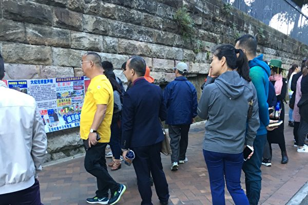

  
游客在看真相展板（何蔚/大纪元）

 

 【大纪元2017年08月21日讯】（大纪元记者何蔚悉尼报导）悉尼歌剧院是澳洲著名的旅游景点，也是中国大陆游客的必到之处。大陆游客在游览这座临海的著名建筑以及周围美丽的港湾景色的同时，往往还能见闻很多发生在中国，但在国内却听不到和见不到的事情，由此扩大了眼界，增加了见识，还有机会对他们的人生做出关键的选择，添一分不虚此行的感觉。

每天上午，一辆辆满载游客的旅游巴士会停靠在麦觉理街（Macquarie St）近悉尼歌剧院的一侧，游客们下了巴士后沿着麦觉理街走几分钟，便到了悉尼歌剧院。在游客必经的道上，有一堵巨大的岩石墙，沿墙竖有近十米长的横幅链。游客可以看到横幅上展示了很多的图像和文字信息，上面包括中国人未知的、关于中共执政至今，八千多万中国人死于其暴政；江泽民当政时期将344万平方公里的土地出卖给俄国；89年6 •4天安门大屠杀和1999年以来中共对近一亿法轮功修炼人的残酷镇压等事实。横幅也展示了法轮大法在世界上100多个国家传播， “真、善、忍”的法理使上亿人受益的真相信息。

 

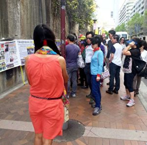

  
游客在看真相展板（何蔚/大纪元）

 

 <b>年轻女子景点了解真相：意外收获</b>
  

一天，两位大陆年轻女子从旅游巴士上下来，走在麦觉理街上，看到挂在那里的横幅链，就停下来看。她们一部分一部分地看得很仔细，并向一位走上前去与她们攀谈的法轮功学员问了很多问题，也认真听了她的解说。 

当听到法轮功已在世界上一百多个国家传播，而且世界各地有相当大数量的人修炼法轮功时，她们很惊讶：“我们以前并不知道这个。”于是，她们很有兴趣的听法轮功学员讲了为什么法轮功在那么多国家受到欢迎的原因，明白了法轮功是遵循真善忍原则修炼，教人做好人，并对人的身体健康有极大帮助的一种佛家修炼功法。

当看到横幅上介绍，中国驻悉尼领馆前外交官陈用林原是负责监控在悉尼的法轮功团体的，但在目睹了法轮功人的善良与真诚，和认识了中共的邪恶后，他最终选择了脱离中共，并在澳洲和国际上揭露了中共体制内的很多罪恶。她们表示：这令人震惊！随即把这些信息拍了照，存放起来。她们还了解了什么是“三退”（退党，退团和退队）和为什么要三退的原因，其中一位女子马上就退出了共青团。另一位表示自己会到大纪元网站上去做三退。

当听到有一种破网技术可以帮助她们在国内翻墙了解国外信息时，她们特别高兴，马上就学了这个技术，表示这很有用，并说回去后会上网了解更多的信息。

她们对那位法轮功学员说，没有想到了解了很多原来不知道的事，很震撼。并说，我们出来就是想要自己来看，来听海外的事情，不想被什么人控制，被动地接受被允许知道的那点东西。她们还拿了很多的资料，包括《九评共产党》。她们感到这是意外的收获。
 

<b>男游客悉尼歌剧院前退党</b>
 

一天，几个官员模样的大陆游客下了一辆小巴士后向悉尼歌剧院走去，他们看到一位女士向他们打招呼：“各位先生你们好，出来一趟不容易，了解了解真相吧。 ” 其中一位男的便对这位女士说：“止步。不用说了。”那位女士便停下了脚步。他们继续向前走去观景和拍照了。 

这几个游客在往回走时，又遇上了刚才的那位女士。只听她对他们说：“先生们好，又遇上你们了，这也是缘分。今天能够来到海外，能够听到真相不容易啊，知道真相才能知道为什么要三退，才能知道为什么三退能保平安。”那位女士接着一一告诉了他们原因，也告诉了他们法轮功学员为什么在遇到游客和导游的各种不友好对待时，还要在这里对他们讲真相。

这时，这几位游客的态度缓和了。那位女士对其中一位在用手机照相的男士说： “先生，不管你是当大官的还是当小官的，抓住这个机会三退。如果你入过党，就答复一下，可以用化名退党。” 那男士回答说：“我是。” 女士就给他起了一个化名。他说：“好啊。”在简短的对话中，这位男子就退出了共产党。

紧接着那位女士笑着对另一个男士说：“先生，你也明白了吧。抓住机会三退吧。”那男士爽快地说：“好啊，我要！” 女士赶紧也给他起了一个化名。这位男士也做了三退。随后，这几个大陆游客向等在路边的巴士走去，很快上了巴士。

巴士在启动的时候，那位女士对他们说：“请记住法轮大法好，真善忍好。遇事遇难时一定要念，真的能’遇难呈祥’啊！” 他们隔着玻璃窗笑着向那位女士挥手致意。

责任编辑：宗敏清
 
 
 
 
 
 
 
 <a href=#list><h4 align="right">回目錄</h4></a>
 

 
  <a name=10><h2 align="center"><b>纽约游行集会声援退党　两百华人现场三退（图）</b></h2> 
 

 

 【明慧网二零一一年三月二十八日】（明慧记者采菊纽约报道）二零一一年三月二十七日星期日，中国人民退出中共党、团、队（三退）的人数即将突破九千二百万之际，纽约各界人士在布碌伦的唐人街举行盛大游行集会，祝福这九千多万伟大的生命，唤醒更多华人同胞尽快脱离邪党走向光明与新生。

纽约州众议员詹姆斯•太迪寇（James Tedisco）向本次退党集会的组织者——全球退党服务中心发来贺信。他说：“自由是神圣的，上帝赋予了所有人在地球上的生存权利。在中国，共产党政权统治已超过六十年，几百万人民一直为获得宗教和政治自由而发出声音。全球退党服务中心为争取人权和自由社会所作的努力应该得到赞扬。”

<b>游行撼人心，民众争三退</b>

游行队伍浩浩荡荡，头看不到尾。壮观的天国乐团在前开道，乐手们个个气宇轩昂，一首首雄壮的乐曲随着指挥棒喷薄而出，震撼着围观的民众。接下来的队伍举着各式真相横幅，还有数量众多的真相展板，传递着真诚的呼唤：天要灭中共，三退保平安。雄狮跳跃，为三退的众生喝彩。身着金色服装的腰鼓队殿后，鼓手们神采飞扬，鼓槌上下舞动，“法轮大法好”的乐曲一路欢快地唱来，撒播着希望的甘露。

 “全球退党服务中心”的义工们也竭诚为围观的民众提供三退（退出党、团、队）服务，民众们也非常踊跃。有的和义工聊天，了解更多真相；有的主动写上自己的名字三退；有的全家三退。一位义工游行下来就退了六十多人，另一位退了四十三个，还有不少义工退了十几，二十个的。游行下来，围观民众当中就有二百多人退出中共党、团、队。

前来布碌伦唐人街购物的耆老刘先生看到集会的队伍，驻足观看良久后感叹说：“中共的政治制度就是虐待人民，这样的政权还能存在到今天，我真的难以理解，要放在其它国家，早就没有了……我七十年代末来到美国，活了这么大年纪，很清楚它的手段，很多人有怨无处诉，中共现在除了钱还有什么可以和西方的文明和民主比呢？”

他强调说，将来中国的变化一定和法轮功有关系，唐人要想有为，就应站出来。

李先生(William Li)路过唐人街看到游行队伍后对记者说，他虽然是在美国出生长大的第二代移民，但他正在研习东方文化，考查东方的历史、政治和周边国家之间的相互影响。 “我看到一些中、英文的退党声明，看到共产党对整个中国、甚至是对世界上其他国家的人民所带来的影响，而不是小部份地区，所以这个游行很重要。”另外，他也愉快地说，“腰鼓队的表演提醒了我所学到的中国文化，而且不论什么样的年龄都可以参加，让我想到了中国新年。”

一位不敢透露姓名的中年人说，他来美四年多，在大陆时亲眼看到很多法轮功学员被当局抓捕，他的亲友中就有。他眼眶发红地说：“很多人都是无辜的，但是我不敢讲。”他表示支持法轮功学员打出的“天灭中共”横幅，因为“谁做皇帝无所谓，对人民好不好才是最要紧的。”

两位围观的中年人边看边聊，一位说：“如果在大陆这样(公开游行)，马上就被捕了，这就是人权问题，在大陆你再大的委屈也不能说。”

围观的陈先生说他二十六日已经办了三退手续，因为“在美国生活了，要那个少先队没有意义”。他的朋友郑先生评述游行队伍说“很壮观”。刚从大陆逃到美国几个月的李先生，昨日拿到三退的证书，他说：“美国这里很自由，与国内很大的对比，站在街上感觉心情都不一样，就是爽。”

<b>中共在解体 三退迎新生</b>

游行队伍穿过布碌伦的唐人街，接着在热闹的街口集会。各界人士参加集会，发表精辟的见解，多位发言者指出，九千一百多万中国人选择与中共决裂，反映了中国人民的觉醒，也意味着中共已处于崩溃瓦解之中。而当前国际社会的独裁暴政逐一瓦解，更为中共敲响了丧钟。

追查迫害法轮功国际组织发言人汪志远表示，中共执政以来，是对整个民族文化的摧毁，对全民的迫害，不只是法轮功学员。法轮功学员是其中被迫害的一部份, 但是对法轮功学员的迫害是极其残酷的。九千万的退党是中国全民族民众对中共邪恶程度已经认识了的表现。
 

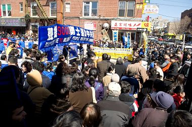

 
追查迫害法轮功国际组织发言人汪志远在声援三退集会上发言

 

 集会上，汪志远还公布了追查国际搜集到的一位中国武警目击法轮功学员被活体摘取器官的录音。它证实了共产专制工具对于共产党的抛弃。汪志远说，这个政策执行者、体系内的崩溃正在来临。

录音的公布引来到场民众的震惊。诗人黄翔对中共残酷迫害法轮功学员感到愤慨，同时他表示，互联网的普及将会加速解体共产专制制度。

<b>李天笑博士：中共突然垮台并不令人意外</b>

纽约时事评论员李天笑以“为何中共突然垮台并不令人意外”为题发表演讲。他说， 今天已有九千一百多万中国人退出了共产党及其附属组织。这个庞大人群决裂中共，说明中共的统治基础已被掏空，说明解体中共正在成为全民参与的救国与自救行为，说明中国的剧变和一个没有共产党的新中国即将来临。

李天笑说，如果说中共今天突然垮台了，那将毫不奇怪，因为人民已经觉醒。这表现在两方面。 首先，在人民眼里，中共早已丧失了基本的公信力。李天笑说，“人无信不立，国无信则衰（老子语）”。中共摧毁了中国人几千年道德诚信的基础，其结果反弹到自己，成为其垮台的原因。一个靠谎言维持的政权必然遭到人民的抛弃。三退正是人民抛弃中共的步伐和进程。导致中共会突然垮台的另一个原因是人民已经不能容忍中共的暴力统治。中共把一切人推到了它的对立面 ，兴致勃勃地为自己的灭亡准备了充足的条件。中共用暴力镇压堵死了自己的后路，激起了人民各种形式的抗暴活动。是中共选择了自绝于人民，选择了人民抛弃它。

与会演讲嘉宾还包括唐柏桥、王军、刘刚和刘国华等民主人士。他们向九千一百多万退出中共组织的勇士表示祝贺的同时，谴责中共迫害法轮功与异议人士的暴行。

集会现场，吴国发等三十多位华人公开退出中共党、团、队，并领取了三退证书。吴国发表示，非常荣幸在集会现场公开退出中共组织，从心里感到高兴。颁发三退证书仪式后，现场又有十多名华人随即报名退出中共党、团、队。

据全球退党服务中心介绍，该中心收到越来越多的人报名退出中共相关组织，很多是主动寻求协助。这说明中国民众不断地在觉醒，身体力行，摒弃中共。
 
 
   <a href=#list><h4 align="right">回目錄</h4></a>
 

 
  <a name=9><h2 align="center"><b>“三个军长退党” 纽约“四二五”活动见闻</b></h2> 
 

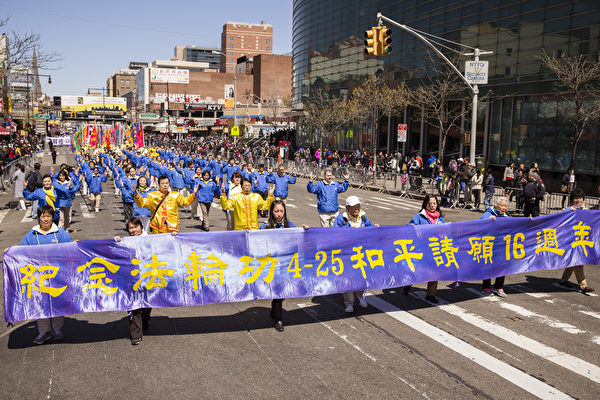

 
2015年4月25日，纽约法轮大法弟子举行反迫害大游行。（爱德华／大纪元）

 

 【大纪元2015年04月27日讯】（大纪元记者谢东延报导）4月25日，大纽约地区约2千名法轮功学员在纽约法拉盛举行纪念“4.25”法轮功学员和平理性上访16周年及声援全球2亿中国人退出中共的大游行和集会。活动期间，有不少法轮功学员向大纪元记者讲述近年来帮助中国人退出中共党、团、队组织过程中的生动故事。 

 <b>两千大纽约地区法轮功学员举行大游行和集会</b>
  

16年前的4月25日，中国上万名法轮功学员为争取自由合法的信仰权利自发到国家信访局和平上访，时至今日，海内外的法轮功学员还一直秉承著“真、善、忍”的原则进行和平理性的反迫害。至2015年4月14日，超过2亿中国人在退党网上声明退出中共党、团、队。 

25日，约两千名来自大纽约地区的法轮功学员齐聚纽约法拉盛举行大游行和集会，纪念法轮功学员和平上访16周年及声援全球2亿中国人退出中共。

活动开始是法轮功学员排成各种方阵的、延绵数里的大游行，沿途有数万市民围观、拍照。游行结束后，法轮功学员在法拉盛图书馆外举行集会，有十多名来自法拉盛的
人权组织代表、民主政党代表和4.25亲历者在集会上发言。
 

<b>法轮功学员劝“三退”故事生动感人</b>
 

在活动中，有几位长期通过电话向大陆和在景点向中国人讲真相、劝“三退”的法轮功学员向大纪元记者讲述了她们劝“三退”过程中的一些生动精彩的故事。 

 

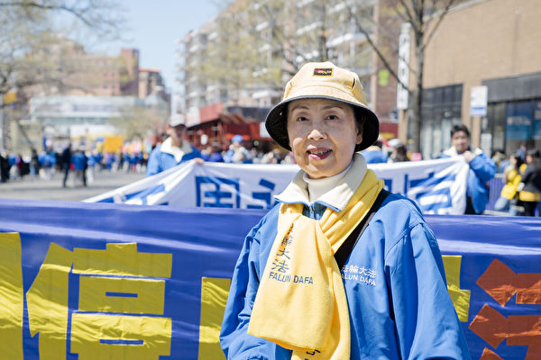

 
 2015年4月25日，约两千名法轮功学员在纽约法拉盛举行大游行和集会。在活动中，法轮功学员闫女士向大纪元记者表示，现在愿意接听真相广播录音的中国人越来越多了。（摄影：谢东延/大纪元）

 

 <b>◎辽宁610国保大队长：我都听明白了</b>
  

“‘三退’人数超过2亿人后，我们就专门打电话给大陆的公检法官员，希望他们了解这个形势，不要再参与迫害。”法轮功学员闫富兰女士兴奋地告诉大纪元记者。
  

看起来温文优雅的闫女士原是哈尔滨京剧团演员，从外表看至多也就五六十岁的样子，其实今年她已经有71岁了。更让人想不到的是，她在21年前曾经脑中风，当时嘴歪、手脚全都不能动，后来修炼法轮功一个月后痊愈，现在手脚麻利根本就看不出来曾经患病。

闫女士介绍说，她平时与其它国家的法轮功学员们专门针对大陆的公检法官员打电话播放真相录音，其中包括：中共活摘器官调查、目击法轮功学员被活摘器官的武警证言、周永康和徐才厚等迫害法轮功官员落马真相等等。

闫女士说，她们接力打电话到迫害法轮功的辽宁某市610国保大队长家，开始这个国保大队长接电话就骂人，打电话的法轮功学员慈善地跟他说，“你是国家公务员，知道这样骂人不好吗？你会让你的孩子跟你学吗？”，这个国保大队长就不吱声了。法轮功学员接着说：“你是因为不了解真相才会骂，你明白真相，你自然就不会再骂了。”结果，这个国保大队长就听完了真相广播。第二天，法轮功学员继续接力打，国保大队长哀求说：“你们不要再打了，过年前我就把你们的人放了，我都听明白了。”

今年3月初，天津公安局指使各公安分局绑架了二十多名法轮功学员。闫女士和其他法轮功学员就接力打真相电话给天津的各个公安分局讲真相。在一天的大陆凌晨时间，真相电话打到一个公安分局，开始对方听一点就挂掉，后来再打就愿意听了。法轮功学员先放的是有关“活摘器官”的真相录音，对方听着听着突然发出了惊讶的“啊”的一声。接着再放“2亿中国人‘三退’”的录音，只听对方在听的过程中不断地发出“啊”“啊”的惊讶声。

闫女士还介绍说，去年她们曾经给河北某市检察院官员家打电话，是他的妻子接的电话，他的妻子接电话听了真相广播之后说“法轮功讲得多好啊！”，该官员过来一听就说，这是法轮功的。然后，他们夫妻俩都听完了真相录音广播。

闫女士感慨地说，现在愿意接听广播的中国人越来越多了，以前一听就挂掉，现在不少听完才挂，完全不愿听的，已经是少数了。  

 

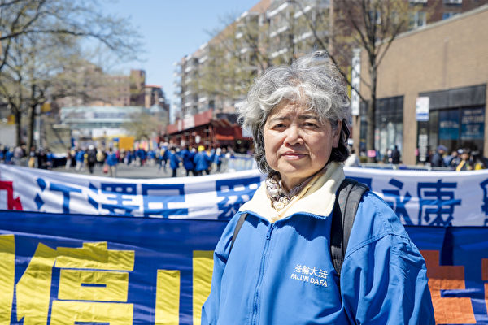

 
2015年4月25日，约两千名法轮功学员在纽约法拉盛举行大游行和集会。在活动中，法轮功学员裴女士向大纪元记者讲述了她身边的法轮功学员一次劝退三名现役军长的故事。她还说，中共的高官比普通老百姓更清楚中共的内幕，他们更容易接受真相。（摄影：谢东延/大纪元）

 

<b>◎三个军长退党</b>
 

今年刚到美国的法轮功学员裴女士，原来是在天津医药科学研究所从事生物医学工程研究，因为坚持信仰曾经被中共迫害过数次，其中判过两次劳教。在迫害中，她凭著对“真、善、忍”的信念，正念正行反迫害，前后只是被非法关押过两个多月。 

在这次游行过程中，裴女士碰到一名搞医学研究和深入研究过宗教的华人，当她给这名华人讲真相、劝“三退”时，这名华人爽快地写上自己的名字。

“现在形势真是变化很大。”裴女士说，她以前在大陆到农村讲真相、劝“三退”还曾被一个村书记拿着镐把威胁过。自从2012年、2013年中共内斗的黑幕曝光，迫害法轮功的官员相继落马后，有很多中国人的态度发生了转变。她说：“在大陆每次出去讲真相，都能劝退二三十人，到农村更是可以劝退七八十人。”

她还说，2014年下半年，中共前军委副主席徐才厚被调查后，她身边的一名法轮功学员无意中把电话打到了某军区里面，当时三个军长正在一齐喝酒。当军长们知道这是法轮功学员打来的真相电话都大感意外。听完真相后，三名军长都同意声明退出中国共产党。

裴毅女士说：“其实，中共的高官比普通老百姓更清楚中共的内幕，他们更容易接受真相。”她还举例说，2013年的夏天曾经把电话打到安徽某中等城市的市委书记那里，开始这名书记还未明白，随着讲真相的深入，最后这名书记答应法轮功学员会记住“法轮大法好”。 

 
 

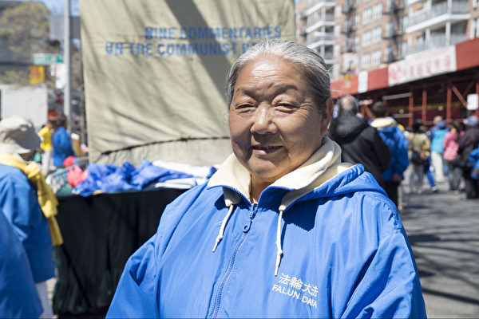

 
2015年4月25日，约两千名法轮功学员在纽约法拉盛举行大游行和集会。在活动中，法轮功学员郁女士告诉大纪元记者，一名在2012年刚获世界级文学奖的大陆著名文学家托人给他真名退出中共党、团、队。（摄影：谢东延/大纪元）

 

 <b>◎大陆著名文学家托人真名“三退”</b>
  

今年75岁，原在新疆伊梨当医生，现在在法拉盛真相点讲真相多年的法轮功学员郁女士告诉大纪元记者，在2012年的时候，一名当时刚获世界级文学奖的大陆著名文学家托人给他真名退出中共党、团、队，而且受托人也为自己和妻子发表声明退出中共组织。 

 

 
2015年4月25日，约两千名法轮功学员在纽约法拉盛举行大游行和集会。在活动中，76岁高龄法轮功学员袁女士向大纪元记者讲述了在纽约17码头的法轮功学员怎样心怀慈悲劝一群大陆来旅游的公安退出中共的过程。（摄影：谢东延/大纪元）

 

 <b>◎一群大陆警察在景点“三退”</b>
  

现在来美国旅游的中国游客越来越多，很多法轮功学员在游客集中的景点设立真相摊位，帮助中国人退出中共党、团、队组织。 

原在大陆任教员的袁女士今年已经76岁高龄，但思维清晰、口齿灵利，一直长期坚持到景点讲真相。她向记者讲述了去年在纽约17码头法轮功学员劝退一群大陆来美国旅游的警察的故事。

她说，当时有一群游客在真相点前等候，从他们的表情看非常不友好，而且发现他们的皮带扣上有公安的标志。一名杨姓法轮功学女学员就上前给他们讲真相，他们就围着杨女士开骂、讲反话，有一人更是偷偷拿烟去烫杨女士的裤子。杨女士当时就感觉到了灼热，但是忍着疼痛用慈悲去感化这些警察，给他们讲真相。在真相面前，这批警察不再吱声了。他们听明白真相后，全部都同意声明退出中共。他们的面目表情也从开始的凶相转变成有说有笑的高兴样了。

最后，袁女士感慨地说，大陆的警察真是可怜，被中共蒙骗参与迫害，最后害人害己都不知道。如果不是法轮功学员坚持给他们讲真相，他们将来就会成为中共的陪葬品了。

责任编辑：李晓清
 

 
 <a href=#list><h4 align="right">回目錄</h4></a>
 

 
 
 <a name=f><h2 align="center"><b>【特稿】三亿人三退 解体中共复兴中华</b></h2> 
 

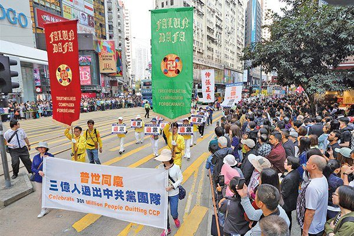

 
2018年3月23日，在大纪元退党网站上声明退出中共党、团、队组织的人数突破三亿。这是三退运动的新的里程碑，这一天将被载入史册。（李逸/大纪元）

 

 【大纪元2018年03月23日讯】2018年3月23日，在大纪元退党网站上声明退出中共党、团、队组织的人数突破三亿！三亿中国人，堂堂正正地与邪党决裂，庄严地宣告心灵的自由。三亿中国人，摆脱邪恶枷锁，重获尊严、欢庆新生。亿万中华儿女的精神觉醒，呼应和推动着历史的巨变。这是三退运动的新的里程碑，这一天将被载入史册。 

 2004年11月19日，大纪元推出系列社论《九评共产党》，揭露共产党反天、反地、反人的邪教本质，对共产党及中共盖棺论定。被红魔欺骗、毒害的大陆百姓，从中获得了启发与感召，纷纷公开声明，退出曾经加入过的共产党组织，向世间最邪恶的政权、最大的黑帮说“不”。 

退党不是参与政治，亦非为夺取权力，而是从道德基点出发的心灵救赎。退党人员来自社会各界，包括中共各级官员、机关干部、企业家、知识分子、律师、军人、警官、工人、农民、运动员、博士生、硕士生、大学生等。退出者在声明里表述了内心的变化过程，并以亲身经历揭露中共的罪行。

每一份三退声明，都是对中共的宣判书，撼动着谎言与恐怖的红墙；每一份三退声明，都是闪光的自由浪花，汇入时代的长河。不断攀升的三退数字，标志着个体与民族的希望和生机，昭示了中共覆灭崩溃的结局。退党运动，似春雨润物，洗去毒素、恐惧和耻辱；退党大潮，波澜壮阔，势不可当。
 

<b>《九评》编辑部巨著──乱世明灯</b>
 

20世纪的人类社会，见证了共产主义导致的惨烈灾难：谎言、恐怖、饥荒、战乱、屠杀……在共产党执政的国家里，一亿生灵非正常消亡，几十亿人被暴政蹂躏。上个世纪末，柏林墙倒塌，苏东剧变，去共产主义运动在世界许多地区展开。人们痛定思痛，谴责共产邪恶学说，清除共产意识的毒害，希望悲剧不再重演。 

然而，目前仅存的几个共产党政权仍在兴风作浪，特别是中共，继续作恶。它对内奴役人民、封锁真相，对外大举渗透、策划颠覆。红潮同时侵蚀著西方社会的道德与文明根基，对世界和平构成威胁。共产主义的阴影，远未散去。

进入21世纪，共产极权与自由民主阵营的对峙更加尖锐。在表层意识形态差异的背后，实际上是一场正义与邪恶的较量。在此关键时期，《九评》编辑部陆续推出经典巨著，揭穿共产党的本质和阴谋，为世人指引航向。
 

<b>1.《九评共产党》</b>
 

《九评共产党》指出：“共产党也是一种生命，但其反自然、反天、反地、反人，是一种反宇宙的邪恶生灵。”《九评》历数中共自起家到建政后对中国及中国人民犯下的种种罪恶，从历史、文化及道德层面促使读者反思。 

在中共窃国半个多世纪之后，《九评》首次揭示了民族苦难的根源，指出了民族重生的契机所在：“从生命中清除中共灌输的一切邪说，看清中共十恶俱全的本质，复苏我们的人性和良知，是平顺过渡到非共产党社会的必经之路，也是必要的第一步。”

《九评》犀利深邃，高瞻远瞩，撕开了中共的画皮。各界盛赞《九评》，中共喉舌媒体哑口无言。 

  

 
《九评共产党》横空出世，引领回归。退出邪恶共产党，自救、救国、救民。（大纪元）

 

 <table><tr><td>
《九评》下载 <a href="https://git.io/sos">https://git.io/sos</a></td>
 </tr>
 </table>

 中国自由主义法学家袁红冰教授认为，《九评》是一场伟大的精神启蒙运动，表现出了大智大勇以及对中国人民历史命运深深的关切。 

高智晟律师在2005年12月22日写道：“无论《九评》作者系谁，该宏文背后蕴藏着的空前智慧及空前的力量价值将永垂人类正气青史。” 

法广电台前中文部主任吴葆璋称《九评》为“世界思想史上的经典”、“民主中国的奠基石”。

山东大学退休教授孙文广认为，《九评》对启蒙中国人起著不可磨灭的作用。他说：“对一般民众来讲，要想认识中共，必须通过《九评》才能看清楚其真实面目。”

旅居德国的著名学者仲维光先生指出，《九评》是一个很彻底、很完善的文献。他说：“在所有1989年解体的东欧共产国家的长达半个多世纪的反抗共产党的运动中，从来没有这样对共产党的系统认识，更没有在此基础上提出以退党来解体邪恶的。”“从前提上、方法上、历史意义上、社会影响上，从各方面来看，这都是独一无二的。”

乌克兰前共产党书记、首任总统列昂尼德．克拉夫丘克曾在多个场合向媒体及政要推荐俄文版《九评》。他说：“（《九评》）是对共产主义意识形态和共产党的总判决”，“提供了很多引人思考的史料，不仅仅揭露共产党的邪恶，更引发亿万人在读过之后开始退党，这本书给了你一个机会去更广泛地思考。”

迄今，《九评共产党》已被翻译成三十多种语言，在许多国家出版。在全球一百多个城市，举行了五千多场“九评”研讨会、新闻发布会、集会、图片展等活动，共有上万名专家、学者、政要、媒体人、共产主义受害者演讲发声、揭露共产主义罪行。
 

<b>2.《解体党文化》</b>
 

2006年9月，大纪元发表系列社论《解体党文化》。此书剖析了党文化的形成历史、成因、表现和危害，揭露中共用无神论、唯物论破坏神传文化的精华、否定传统文化的恶行，以期帮助中国民众彻底破除党文化，恢复正常思维，重建道德和文化，走向民族的复兴与新生。 

这本著作指出：“天灭中共，此乃天意。”“《九评共产党》及其掀起的退党大潮，正是天意在人间的展现。而解体党文化，清除党文化的毒素，正是顺天意而行的必然之举！”

《解体党文化》同样赢得了读者的好评和强烈反响。在海外许多城市举办了“解体党文化”研讨会，各界民众在会上探讨了中共党文化对中国人的毒害，以及如何从精神上清除共产主义流毒，从心理上摆脱对共产党的恐惧。 

 

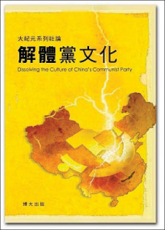

 
《解体党文化》剖析了党文化的形成历史、成因、表现和危害。（博大出版社）

 

 <table><tr><td>
 《解体党文化》下载
 <a href="https://github.com/mia2018/bnhh/blob/master/epub/jtdwh-ap1.epub?raw=true">音频epub电子书</a></td>
 </tr>
 </table>

 
 
 <b>3.《共产主义的终极目的》</b>
 

2017年11月19日，《九评》编辑部发表新书《共产主义的终极目的》，以独特的视角、前所未有的高度，深入地剖析共产主义对人类文化与道德的破坏，以及共产党意欲毁灭人类的邪恶图谋，使人们更加清醒地认识到共产主义的危害。 

书中揭示：“共产主义不是一种学说、一种社会制度、一个失败了的尝试，它是一个邪灵，其目的是通过毁灭文化、败坏道德来毁灭全人类。” 

 
 

 
《共产主义的终极目的》由博大出版社发行。（博大出版社）

 

 
 <table><tr><td>
《九评》下载 <a href="https://git.io/tgc">https://git.io/tgc</a></td>
 </tr>
 </table>

 当前中国大陆山河破碎，人心魔变，乱象丛生。在西方，多个国家被共产主义悄然蚕食，道德下滑，危机四伏。在迷局困境中，《共产主义的终极目的》振聋发聩，惊醒迷中人。

对照现实，人们惊觉，共产党与中共所为，一直在泯灭善良、颠倒善恶、滋生邪魔，确确实实是“堵死天堂路，打开地狱门”。对于这样的邪灵、邪恶，怎能不驱除、不抛弃？

上海维权律师郑恩宠说：“这本书犹如一颗彗星，照亮了黑幕下的中国。”

原中国政法大学人文学院哲学系教授游兆和表示，“这本书帮助世人认清共产主义的邪恶本质，认清它的一系列计划、路线图及各种手段，也警示中华民族、人类文明面临着巨大的危机，同时指明出路。”

许多读者把此书比作“救世良方”。有人评说：“《九评共产党》就像九把斩妖利剑，斩了红魔共产党；《共产主义的终极目的》就像金色的阳光，将彻底解体中共邪灵。”

<b>三退是伟大创举</b>

《九评》引发的退党大潮被誉为史无前例的瓦解邪恶的创举，堪称人类历史上最伟大的人性复兴。

2004年11月28日，《大纪元时报》收到了第一则退出中国共产党的声明。2005年1月1日，大纪元建立退党网站（tuidang.epochtimes.com），专门发布中国民众退出中共党、团、队的声明，统计数字实时在网上更新。

2005年1月12日，《大纪元郑重声明》发表，呼吁“所有参加过共产党与共产党其它组织的（被邪恶打上兽的印记的）人赶快退出，抹去邪恶的印记。一旦谁对这个魔教清算时，大纪元储存的记录可以为声明退出共产党和共产党其它组织的人作证”。

2005年2月，“
