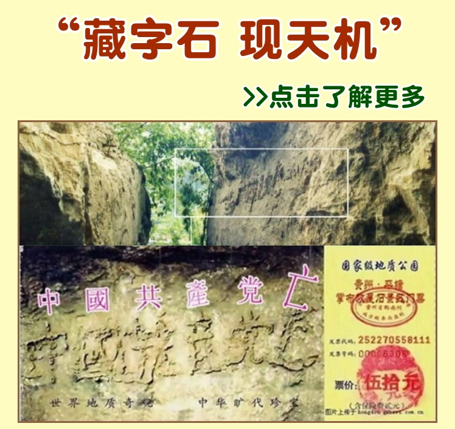
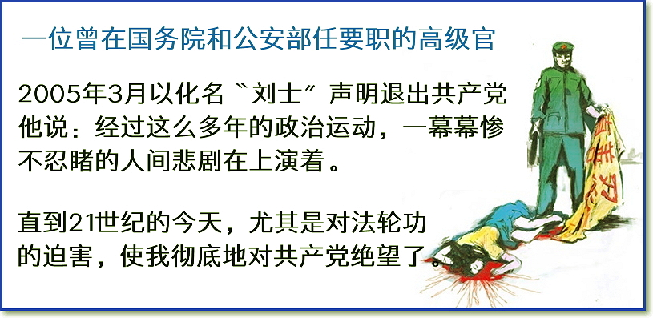
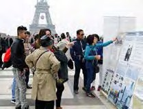

<h2>请收藏本网址，连上免翻视频即时IP    https://git.io/jiuren </h2>
	

<h2>免翻视频 http://61.228.179.68/300 </h2>

<table>
 
<tr> <td>
<h2>上天有好生之德 
存善守德的人会得到上天庇佑 
请珍惜救助的手 
做明智的选择保平安 

重要选择美好人生(已办理过勿再重复)  http://89338.st.anuba.cl/st	 </h2>
<td></tr>

<tr>
 <td>
 <a href="https://git.io/pamja"> <h3>如何 “ 三退保命 ”</a>，<b>连上面→免翻视频 IP http://61.228.179.68/300</b> →点 【三退大潮】--为什么要退党？ 可留言三退或用翻墙软件自己办理三退</h3></td>
</tr> 

<tr>
 <td>
 <a href="https://git.io/pamja"> <h3>如何 “ 三退保命 ”</a>，请点击翻牆网站  https://git.io/opopop  下载 { 翻牆软件 }→找 { 大紀元網站 }  ( http://www.dajiyuan.com ) 三退</h3></td>
</tr>
 </table> 
 

<h1><a href=https://git.io/souye>看更多真相</h1></a>

 

 

  
   

 

  
   

  

  图：“藏字石”石面上呈现出的“中國共產党亡”六个大字清晰可辨，昭示着“天灭中共”的天意。上图是新华网图片，下图是风景区的门票。

<table>
  <tr>
    <td>
  2002 年6 月， 在贵州省平塘县掌布乡发现了2.7 亿岁的“ 藏字石”，长7 米，高3 米，重百余吨，五百年前崩裂的巨石断面内惊现六个排列整齐的大字“中國共產党亡”，每个字一尺见方，其中那个“亡”字特别的大。 

中国的各路地质专家经实地考察后一致认为，这“藏字石”上未发现任何人工的痕迹，乃天然形成，堪称世界奇观。 

国内多家媒体报道，但都隐去“亡”字，“藏字石”的图片还被赫然印在贵州“藏字石”风景区的门票上。 

一方高踞崖壁的巨石，历经亿年风雨，阅尽天地沧桑，突然断裂落地，“开口说话”——断裂为两半，断面上呈现一尺见方的几个大字，排列整齐，形成完整的一句话；又经历了五百年的寒来暑往，封尘除去，真颜露出，这藏字之石终于展现在了人们面前，这究竟是怎样的一种神奇，又蕴含了怎样的一种玄机？</td>

  </tr>
</table> 
  

   

 

  
   

 

  
  

  
   <table>
  <tr>
    <td>
     <h2 align="center"><a href="http://" > 《九评》引发“三退”大潮 </a></h2>
 2004年11月，大纪元发表系列社论《九评共产党》（简称：《九评》），揭开了共产党的邪恶本质后，在其后的十多年间，中华大地上出现了一种独特的现象，人们阅读《九评》，传播《九评》并开始了退出中共党、团、队组织的“三退”精神觉醒运动。

十多年的时间里，涓涓细流汇成大潮，三退大潮席卷中华，到2018年3月23日，已经超过3.0亿中国人在大纪元退党网站上声明退出中共的党、团、队组织，用理智和良心为自己选择了光明的未来。 

浩浩荡荡的三退大潮带着上天的意志和不可阻挡的力量奔腾向前，它再清楚不过地表明，历史和人民在选择抛弃共产党！ 

  
  <table>
  <tr>
    <td width=440>
  <a href="https://git.io/9p9pos" >◆ 看《九评》https://git.io/9p9pos  </a>
  </td>
   <td width=440>
  <a href="https://git.io/opopop" >◆ 索取翻墙软件 https://git.io/opopop </a>

    </td>
       
  </tr>
</table> 
  
   </td>
  </tr>
</table>    
  
  <table>
  <tr>
    <td>
   <h2 align="center"><a href="http://" >◆ 104名警察集体“三退”</a></h2>
   在国内，“三退”保平安已深入到中国大陆的各个角落和阶层。很多人在自己明白真相后即自发地传《九评》促“三退”，政府机构、公司企业集体观看《九评》和声明退党、退团、退队（三退）也渐趋公开化, “三退”已成为人们时下聊天的一个热门话题。 

      
2015年10月的一天，东北某地的一名法轮功学员打电话帮助四川某地的104名警察做了“三退”，其中九十八人是党员。 

当时，法轮功学员的一个电话打过去，接电话的是一个声音很浑厚的男子。法轮功学员告诉他“三退”保平安的事，问他：“戴过红领巾吗？”他说：“戴过、戴过，我还入过党呢！你赶紧给我都退了吧，我早就想退，不知道上哪退，这回太好了！”法轮功学员说：“那我就给你退了吧！”他说：“要得！要得！”法轮功学员问了他的姓氏，给他起了化名办了“三退”。 

这位警察接着说：“我们都是警察，我身边还有这么多人，怎么办呢？他们都还没退呢，你也给他们退了吧！”法轮功学员说：“好吧！请他们都报上名来，声明退出的是党、团、队的哪个组织。于是这些警察就轮番向法轮功学员报出姓名，有名有姓共104人的“三退”名单就这样诞生了！ 
  
</td>
  </tr>
</table>   

   <table>
  <tr>
    <td>
   <h2 align="center"><a href="http://" >◆ 觉醒的公安局长三年“劝退”上千人</a></h2>

据明慧网报道，大陆某县一位公安局长，看了《九评共产党》和法轮功真相资料后，还认真阅读了法轮功著作《转法轮》，终于明白了法轮大法是教人修炼“真善忍”的正法，认清了共产党的邪恶本质，知道了“三退”保命的重要性，毅然带领家族中的人退出了中共的党、团、队组织。从此，他不但在工作中不再帮中共干坏事，还主动向亲戚朋友、父老乡亲以及上级领导、本局的同事和邻县的同僚讲真相，劝“三退”。三年时间，共“劝退”上千人。   
   </td>
  </tr>
</table> 
   
<table>
  <tr>
    <td>
   <h2 align="center"><a href="http://" >◆ 中共中央党校25 名党员集体退党震惊中南海 </a></h2>
2005 年5 月16 日，中共中央党校25 名不同部门的党员集体向大纪元声明退出共产党，事件震惊中南海。他们在集体退党声明中
说： 
<b>“我们是来自中共中央党校各个不同部门的官员，我们中间有‘老革命’、‘老干部’、‘老党员’，还有中青年在职官员，有正副部级、局级、处级官员，有一般科员和普通官员，也有博士生、研究生等。我们大家都同意借你们的《大纪元时报》退党专栏，刊登我们众多官员的退出共产邪灵的声明。”

“其实据我们知道，中央党校中，90% 的党员如果条件允许都会退党。为什么要退党，《九评共产党》讲的很清楚，中共从起家就是以欺骗，谎言，暴力杀人为基础，各种运动杀人、致残少说也有1-2亿中国人，确实是邪党、邪教、流氓党……”

“不能再被中共邪党、邪教、邪灵操控了，我们要从心灵上彻底铲除中共邪恶势力，重新做诚实、善良、正直、勇敢、乐于助人的好人。所以我们正式宣告，完全退出中共邪教。我们还呼吁其他的中共各级官员，像我们一样勇敢退党，退出共产党，让中国更早跨进民主、自由、人权、法制的美好富强的国家的行列。”
</b></td>
</tr>
</table>
  
 
<table>
  <tr>
    <td>
<h2 align="center"><a href="http://" >◆ 党政军官员汇入退党潮 </a></h2>

来自全球退党中心的消息称，现在有很多人通过旅游的方式退党。

近几年来，北美、欧洲、大洋洲、亚洲各大城市旅游点都有退党中心义务工作人员为大陆游客办理“三退”服务。在欧洲、香港、东南亚地区，出现了中国大陆游客整团、整车退党的现象。出国旅游的相当部分人士是中共各级官员。

全球退党服务中心透露，一些很高级别的大陆官员对中共非常绝望，他们有的是自己打电话到退党热线，有的是委托心腹秘书或家属登记，用化名退党。

 

 
▲ 成群结队的中国游客在法国巴黎铁塔下的法轮功真相点观看法轮功真相展板。  
  

一位30 年代入党、曾在国务院和公安部任要职的高级官员，2005 年3 月以化名“刘士”退出中共。他说：“经过这么多年的政治运动，一幕幕惨不忍睹的人间悲剧在上演着，直到21 世纪的今天。尤其是对法轮功的迫害，使我彻底地对共产邪党绝望了。”“我了解许多中共内幕，知道得越多越绝望。由于众所周知的原因，我不能讲得太多。其实包括总理温家宝在内的许多中共领导人，对法轮功的迫害很了解。”“刘士”在退党声明最后说：“为了我的灵魂能在另一个世界中安息，现特请我的晚辈代我用化名，严正声明退出共产邪党等一切有关组织，彻底（与共产党）决裂，所有誓言全部作废！”

另有中共国务院某办的一名官员，2004 年12 月以化名“华天明”退党，他的退党声明是：“无可奈何当打手！！！！对不起了，中国人民！！唯望共产党早点死亡。”
2005 年3 月1 日，核工业所属军工系统46 名党龄30 至50 年老干部，郑重宣布退出中共。2005 年“七一”前夕，来自河北、山西、辽宁、吉林、黑龙江的47 位前中共军官集体退党。这47 位转业军官中，副师职1 人，正副团职4 人，正营职6 人，副营职及以下的有36 人。他们说：几年前转业到地方后，经济政治待遇尽失，生活困苦，上访无门，在“三退”大潮的感召下，大家决定集体退党。
</td>
</tr>
</table>

<table>
  <tr>
    <td>
<h2 align="center"><a href="http://" >◆“三退”大潮　 势不可挡</a></h2>
      2004 年12 月3 日，大纪元退党网站收到第一份退党声明。

2005 年新年，海外50 位华人专家和学者集体声明“三退”，此为首例集体“三退”，被认为“拉开了华夏儿女集体脱离马列魔教的序幕”。 
至2006 年4 月，声明“三退”的中国人超过1000 万。 
至2011 年8 月，声明“三退”的中国人超过1 亿。 
至2015 年4 月15 日，声明“三退”的中国人超过2 亿。 
至2016 年3 月13 日，声明“三退”的中国人超过2 亿3000万，占中国总人口的六分之一。 
至2018 年3 月，声明“三退”的中国人超过3 亿  
  据退党网站记录显示，目前每天约有10 万中国人声明“三退”。

  

 
  
 自从王立军出逃成都美领馆事件后，许多参与迫害法轮功的政法委、“610”、公检法人员也纷纷寻找退路，声明退党，表示悔过，甚至帮助亲友“三退”。尤其是前中共政法委书记周永康及“610 ”办公室主任、公安部副部长李东生等一批迫害法轮功的凶手纷纷落马，中国民众更加认清了中共的本质，看明了中共即将覆灭的下场，顺天意而行，踊跃“三退”。
 
</td>
</tr>
</table>

<table>
  <tr>
    <td>
<h2 align="center"><a href="http://" >◆ 海外景点“三退”忙</a></h2>
     近年来，出国旅游已经成为中国人的旅游新时尚，在全世界各地著名的观光景点（包括香港、澳门），中国大陆游客常常是整团、整车地“三退”。

目前全球30 多个国家和地区已有100 多个退党服务中心，数以万计的志愿者通过各种渠道协助中国民众“三退”，并在世界各地著名旅游区设点，提供义务“三退”服务。
有的中国游客表示：出来就是为了“三退”的。

有的说：“谁不愿意平安啊，当然不愿意跟它（中共）倒霉。”

一位中央党校官员明白真相后欣然“三退”，说：你们法轮功文化知识层次真高，怨不得共产党都害怕，你们什么都知道。

一位专管迫害法轮功的公安局长登记“三退”后，与退党服务中心的义工握手说：谢谢！谢谢！我们国内见。 

      
   

▲纽约曼哈顿南街海港，大陆游客观看真相展板，踊跃“三退”。  

 
     
      
   

 
▲法国巴黎的观光景点，中国大陆的游客在观看展板，了解真相。  

 
     
</td>
</tr>
</table>
 
   

  

 
  

  

