

<h1>请收藏本网址，连上免翻视频即时IP    https://git.io/zfsan </h1>

<h2>免翻视频 http://61.228.179.68/300 </h2>
	

<table>
 
<tr> <td>
<h2>上天有好生之德 
存善守德的人会得到上天庇佑 
请珍惜救助的手 
做明智的选择保平安 

重要选择美好人生(已办理过勿再重复)  http://7566.st.anuba.cl/st	 </h2>
<td></tr>

<tr>
 <td>
 <a href="https://git.io/pamja"> <h3>如何 “ 三退保命 ”</a>，<b>连上→免翻视频 IP http://61.228.179.68/300 </b> →点 【三退大潮】--为什么要退党？ 可留言三退或用翻墙软件自己办理三退</h3></td>
</tr> 

<tr>
 <td>
 <a href="https://git.io/pamja"> <h3>如何 “ 三退保命 ”</a>，请点击翻牆网站  https://git.io/opopop  下载 { 翻牆软件 }→找 { 大紀元網站 }  ( http://www.dajiyuan.com ) 三退</h3></td>
</tr>
  </table> 

 
<h1><a href=https://git.io/souye>看更多真相</h1></a>
	
 
+ <a href='https://github.com/gofanben/gm/blob/master/mp4/ccs05.mp4?raw=true'>视频：《上苍为何落泪》纪念长春305插播壮举</a>
+ <a href='https://github.com/gofanben/gm/blob/master/mp4/CQSD-1s.mp4?raw=true'>【传奇时代】永恒的电波（上)</a>
+ <a href='https://github.com/gofanben/gm/blob/master/mp4/CQSD-2s.mp4?raw=true'>【传奇时代】永恒的电波（下)</a>
+ <a href='https://github.com/gofanben/gm/blob/master/mp4/OwQA4tZUShUeb.mp4?raw=true'>中国人，你被骗了吗？除夕夜的天安门自焚是骗局！</a>
+ <a href='https://github.com/gofanben/gm/blob/master/mp4/immolation_56k.mp4?raw=true'>焦点访谈录像 25:54</a>
+ <a href='https://github.com/gofanben/gm/blob/master/mp4/si_chn_08152002_56k.mp4?raw=true'>录像片：是自焚还是骗局？（2002年8月15日新版）28:59</a>
+ <a href='https://github.com/gofanben/gm/blob/master/mp4/zfzxPalV32.mp4?raw=true'>是自焚还是骗局 13:57</a>
+ <a href='https://github.com/gofanben/gm/blob/master/mp4/jxgs.mp4?raw=true'>录像：追查国际“天安门自焚疑案”调查纪实 08:55</a>
+ <a href='https://github.com/gofanben/gm/blob/master/mp4/zf_mp3.mp4?raw=true'>明慧网广播电台 天安门自焚是中共栽赃陷害法轮功的骗局(mp4) 03:32</a>
+ <a href='https://github.com/gofanben/gm/blob/master/mp4/zf.zip?raw=true'>明慧网广播电台 天安门自焚是中共栽赃陷害法轮功的骗局(mp3) 03:32</a>
+ <a href='https://github.com/gofanben/gm/blob/master/mp4/20170123_000925-video.mp4?raw=true'>武警与医生 揭16年前“天安门自焚”造假 03:56</a>
+ <a href="https://github.com/gofanben/gm/blob/master/mp4/tambg2.mp4?raw=true">“天安门自焚”追查报告  10:27</a>

<h1 align="center"><b>明慧专题：<a href="https://github.com/gofanben/gm/blob/master/mp4/zfzxPalV32.mp4?raw=true">“天安门自焚”真相</a></b></h1>

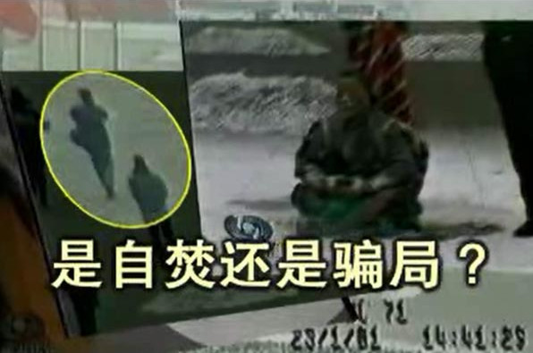</a>

 
2001年1月23日（除夕）下午，天安门广场“突发”5 人自焚事件。 事发仅 2 小时，新华社以超乎寻常的速度向全世界发出英语新闻，声称“自焚者是五名法轮功学员”。但是，美国之音记者打电话向北京公安局和公安部查证，答复竟然是不知道有这回事。喉舌的宣传口径竟然抢到了公安调查的前面！

如此迫不及待，已经暴露了这并非突发事件，而是一场准备充分的阴谋——假如真是突发事件，是根本来不及准备的。

当局的准备不仅仅是这些，央视紧跟着推出了攻击法轮功的“自焚新闻”、“焦点访谈”，而且强制全国各界、各企事业单位观看，反复“学习”。然而事与愿违的是， 反复播放的录像却暴露了越来越多的破绽，显出这是一场骗局。

<h1><b>法轮功明确指出：</b></h1>
<h2><b>炼功人不能杀生，自杀有罪</b></h2>
法轮修炼大法是由李洪志先生创编的佛家上乘修炼大法。在李洪志大师的著作《转法轮》中明确指出：“炼功人不能杀生”，李洪志先生还在 《悉尼法会讲法》中指出：“自杀是有罪的。” 真正的法轮功学员不会去自焚。

<b>自焚伪案疑点：</b> 
<b>女主角被当场灭口？</b>

<h1 align="center"><b><a href="https://github.com/gofanben/gm/blob/master/mp4/jxgs.mp4?raw=true">录像：追查国际“天安门自焚疑案”调查纪实</a></b></h1>

“追查迫害法轮功国际组织”成立于二零零三年一月，是以追查取证和国际起诉迫害法轮功相关人员为重点的独立常设国际机构。本组织的使命是：追查迫害法轮功的一切罪行以及相关的机构、组织和个人。无论天涯海角，无论时日长短，必将追查到底；行天理，再现公道，匡扶人间正义。

2001年1月23日下午2点41分，北京天安门广场发生了震惊中外的“自焚”事件，中国官方新华社和中央电视台第一时间迅速报道，指称参与”自焚”的五人和两名“自焚未遂者”为法轮功学员。法轮功学员否认了指控，并指出“自焚”行为严重违反法轮功的原则和教导。一些国际媒体和第三方国际机构也提出质疑。美国<华盛顿邮报>记者的实地采访证实，“自焚”者并非法轮功学员，而国际教育发展组织所提供的“自焚”现场录像分析更指出，中国政府涉嫌一手策划导演了这场“天安门自焚”事件。事实真相究竟如何？

鉴于此案性质严重，影响巨大，本组织在得到有关“自焚”疑案的多方举报后，特于2003年1月23日成立“天安门自焚事件调查委员会”，对此案进行了多方位深入详细的取证调查。

<h2>“天安门自焚”疑案调查纪实</h2>

（一）对王进东和刘葆荣的语音鉴定

在“天安门自焚”事件中，有个多次出场的重要人物：王进东。我们来看看这位被中国政府称为“自焚”事件的组织者王进东。

[“自焚”录像中王进东的镜头，央电视台的三集《焦点访谈》节目中的王进东]

这就是王进东。我们接到多起举报指证，在“自焚”现场的王进东与《焦点访谈》节目中的王进东不是同一个人。

追查迫害法轮功国际组织根据举报，对王进东进行了多角度的追查取证。首先我们委托世界先进的中文语音识别实验室对前后出场的王进东作了语音鉴定。音像资料取中国自央电视台的《焦点访谈》节目。

台湾大学语音实验室在中文语音的辨识、合成、检索、验证、及口语对话等方面拥有相当丰富而先进的技术，曾率先完成全世界第一台能相当正确辨识任意文句的中文语音的电脑。

[采访台大语音实验室语音鉴定专家]
承追查国际所委托，对于王进东的语音鉴定，我们采取了先进的“语者验证（Speaker Verification）”技术，将常用于语者验证高斯混合模型（Gaussian Mixture Model，GMM）用于对王进东等前后出现的语音进行比较鉴定，……

[语者验证结果报告分析，图表，仪器显示等。专家叙述]
从这些语者验证结果报告中，可以得出十分确定的结论：积水潭医院中被烧伤（或第一集中被烧伤）的王进东与其他两集《焦点访谈》节目中的王进东不是同一个人。

台大语音实验室：语者验证结果报告。

[王进东前后出场镜头特写，定格，大字字幕]
两个“王进东”！

[王进东“自焚”现场打坐镜头，旁白]
此鉴定结果与本组织通过其他渠道对王进东真实身份的追查结果相吻合。追查国际从可靠途径查获：参与“自焚”的“王进东”是由一名现役军人扮演。

（二）对刘思影的死因调查
“自焚”事件中，有一个叫刘思影的小女孩被严重烧伤。

事发后，刘思影和其他几位伤者被送往据称是北京治疗烧伤最好的积水潭医院。追查国际对积水潭医院参与治疗刘思影的医务人员进行了调查。

经过详细调查，我们从积水潭医院参与治疗刘思影的医务人员处得到惊人消息：

“刘思影在烧伤基本治疗得差不多了，身体已基本恢复正常，已打算出院的时候突然死亡，死因可疑。”

刘思影死前一段时间，包括死亡前一天，3月16日，周末休息前的星期五，心肌酶谱和其他各项检查均正常。然而3月17日，星期六的中午11-12点左右医生突然发现刘思影已处于病危状态，并很快死亡。另3月17日上午8-9点钟时，积水潭医院负责人和北京市医政处处长曾到刘思影病房探视，与刘思影说了很多话。

谁谋杀了刘思影！？

（三）失踪的两个多小时

[“自焚”现场录像，部分原声报道]

据新华社2001年1月30日对自焚事件的报导称，1月23日14时41分，在人民英雄纪念碑的东北侧，王进东首先点燃火焰，“不到一分钟，几名民警连用４个灭火器，迅速扑灭了这名男子身上的火焰，并用值勤警务车将其迅速送往医院救治。”几分钟后，人民英雄纪念碑北面，４名相距不远的女子点燃了身上的汽油。仅过了一分半钟，火焰均被扑灭。“事件发生后不到７分钟，北京急救中心的三辆急救车也及时赶到现场，将伤者紧急送往北京治疗烧伤最好的积水潭医院。”

从新华社报导的“自焚”开始的时间下午2点41分加上7分钟的灭火、送上救护车的时间和从天安门广场到积水潭医院20多分钟的正常车程（对急救车行驶应短于此时间），这些“自焚”人员应该在下午3点多被送到积水潭医院。

根据调查，积水潭医院多位工作人员确认，“自焚”者至少在晚上5点以后才被送到积水潭医院。那么，从下午3点左右到晚上5点左右，中间至少有两个小时以上的时间，新华社的报导无法解释这些人去了哪里？原本20多分钟的车程为什么花了急救车两个多小时？

在这失踪的两个多小时里到底发生了什么？

（四）对刘春玲的死因调查

[刘春玲被击打镜头]
从中央电视台《焦点访谈》节目中关于自焚的现场录像可以看到，有一名身穿大衣的男子手持一重物，用力向死者刘春玲的头部击打，导致刘春玲急速倒地，并用手护卫被打的左侧头部。追查国际有理由认为刘春玲极有可能是在现场被打死，而非被烧死。现场这一名身穿军大衣的男子很明显不是在参与救人，而是要置刘春玲于死地！

[定格穿军大衣的男子]
这个人是谁？他为什么要谋杀刘春玲？

根据以上的调查结果和证据，本组织确认“天安门自焚”事件是中共建政以来的一桩极大的阴谋，涉及恶性谋杀和栽赃陷害。该案牵扯的各方关系复杂，犯罪元凶可能直接涉及到中国原国家主席、原党总书记和当时和现在都是军委主席的江泽民。追查国际将继续深入地追查此案，公布事实真相，并将调查结果报告相关国际机构和各国司法及人权机构，进行法律起诉，直至将所有犯罪者和阴谋策划者绳之于法。

策划“天安门自焚事件”的嫌犯和主谋

身穿军大衣、拿重物击打刘春玲的凶犯

谋杀了刘思影的嫌犯

追查迫害法轮功国际组织
“天安门自焚”事件调查委员会

2003年5月2日
<h1 align="center"><b>◎天安门警察背着灭火器巡逻？</b></h1>
<table border="0" cellspacing="3" cellpadding="3">
<tbody>
<tr>
<td align="center"></td>
</tr>
<tr>
<td align="center">澳洲《时代报》（The Age）2004年10月16日的报道对央视的自焚录像做出强烈质疑：“警方事先不知情，却在90秒内，携带大量消防设备出现在画面中。”</td>
</tr>
</tbody>
</table>

<h1 align="center"><b>◎衣服烧烂，头发却耐火？</b></h1>

<table border="0" cellspacing="3" cellpadding="3">
<tbody>
<tr>
<td align="center"></td>
</tr>
<tr>
<td align="center">警察晃着灭火毯等镜头，棉衣裤子烧烂，头发还完好，火烧后盛着汽油的塑料瓶完好翠绿。央视女记者承认自焚“摆拍”。</td>
</tr>
</tbody>
</table>

<h1 align="center"><b>◎谁是画面外的摄影师？</b></h1>

<table border="0" cellspacing="3" cellpadding="3">
<tbody>
<tr>
<td align="center"></td>
</tr>
<tr>
<td align="center">图中的男子在军警间从容拍摄。国际社会质疑：央视自焚录像有远景、移动拍摄的近景，还有多个自焚者在不同位置的特写，并且录下了声音，显然摄影师做好了准备才能做到的专业拍摄。</td>
</tr>
</tbody>
</table>

<h1 align="center"><b>◎自焚的王进东是法轮功学员吗？</b></h1>
<table border="0" cellspacing="3" cellpadding="3">
<tbody>
<tr>
<td align="center"></td>
</tr>
<tr>
<td align="center">自称“老学员”的王进东竟然不会双盘腿。</td>
</tr>
</tbody>
</table>

<table border="0" cellspacing="3" cellpadding="3">
<tbody>
<tr>
<td align="center"></td>
</tr>
<tr>
<td align="center">王进东的大拇指不是法轮功的正确动作——指尖轻轻接触，而是错误的上下重叠。</td>
</tr>
</tbody>
</table>

<h1 align="center"><b>国际教育发展组织：该事件是由政府一手导演的</b></h1>
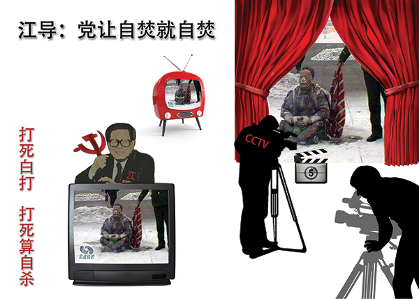

<b>2001年8月14日，在联合国倡导和保护人权附属委员会第53届会议上，天安门自焚案被当场揭穿。国际教育发展组织（IED）发言说：“我们的调查表明，真正残害生命的恰恰是中共当局……我们得到了一份该事件（天安门自焚案）的录像片，并从中得出结论，该事件是由这个政府一手导演的。”面对确凿证据，中共代表团哑口无言，没有辩辞。该声明已被联合国备案。 </b>

<h1 align="center"><b>联合国会议大厅里，正义的声音再次响起</b></h1>

文/法轮功学员日内瓦报导

【明慧网2001年8月18日】继八月三日发言谴责中共当局对法轮功的迫害及人权侵犯之后(见明慧八月十四日报导)，国际教育发展组织(International Educational Development, IED)八月十四日在联合国倡导和保护人权附属委员会(The United Nations Sub-Commission on the Promotion and Protection of Human Rights)第53届会议第六项议程中再次发言，强烈谴责中共当局的“国家恐怖主义行为”。

IED八月十四日的声明中说：“政府对人民施行的国家恐怖行为所导致的严重人权迫害远远超过任何其他形式的恐怖主义行动。当一个政权施行国家恐怖行为时，国际社会就将面临大量人权侵犯案例和难民而不知所措的困境。中国对法轮功修炼者的残暴迫害就是这样的例子。”

“我们在八月三日的发言中描述了我们对法轮功的观察了解。中国政府代表在随后的答复中企图以诬陷法轮功残害生命破坏家庭来为其国家恐怖行为辩护。我们的调查表明，真正残害生命的恰恰是中共当局。是中共当局对法轮功修炼者的虐杀而导致家庭破裂。伤害生命的不是法轮功，而是极端残暴的酷刑、精神病院里的摧残、劳改营的奴役、以及其他类似的迫害。正如‘国际先驱导报’八月六日报导，连中国政府都承认施行酷刑折磨以消灭法轮功的政策。中共当局并企图以今年一月二十三日天安门广场上的自焚事件为证据来诬陷法轮功。然而，我们得到一份自焚事件的录像分析却表明，整个事件是由政府一手导演的。我们现有该录像的拷贝，有兴趣者可来领取。”

“联合国‘关于酷刑折磨’的特派专员在他最新的年度报告中指证了中共当局对成千上万法轮功修炼者的拘捕和折磨。联合国‘关于非法、任意或集体屠杀’的特派专员，‘关于对妇女暴力’的特派专员也做出了类似的指证。我们正在整理的证据表明至少有五万名法轮功修炼者被关押在监狱、劳改营、或精神病院里，至少数千人遭受殴打并有很多人被折磨致死。几十万上百万人的安全受到严重的威胁。联合国的人权机制明显已经无法处理如此大量的人权侵犯案例，国际社会也将很难容纳如此多的难民。因此，联合国‘保护人权附属委员会’以及整个国际社会应当紧急干预中共当局的国家恐怖主义行为”

IED的发言再次引起轰动， 许多人前来索取声明的文本和自焚真相的录像。IED的这个声明也再次进入联合国官方的记录。

中国代表团在八月三日曾对IED的指控加以面对抵赖。这一次，面对凛然的正义之声和确凿的证据，中国代表团噤声不得，连抵赖的机会都放弃了。

与此同时，与会的欧洲美洲法轮功学员奔走在联合国人权高级委员会威尔逊宫，向联合国各种人权机构递送大陆法轮功学员传递出来的各种迫害案件，引起了十几个特派专员办公室的重视。这方面的情况我们将陆续加以报导。

国际教育发展组织八月十四日的声明的原文见： 
http://www.clearwisdom.net/emh/articles/2001/9/9/13711.html

<h1 align="center"><b>法轮功禁止杀生和自杀</b></h1>

 
  
【明慧网二零一四年一月七日】（明慧评论员文章）<b>法轮功是上乘佛家修炼大法，明文禁止杀生和自杀。任何以自杀、杀生行为诬陷、诋毁法轮功的人，都不敢让人系统地、不带任何观念地、静心地阅读法轮功原著，特别是《转法轮》一书，也不敢让人亲身体验法轮功的功法，因为坏人也知道：很多人都是有良知的，看见真相就不愿再相信谎言。</b>

为了各位的前程，希望大家都来看《是自焚还是骗局》这个十三分钟的录像短片，即便是在百忙之中，很值得看，不看以后可能会非常遗憾！如果能静心通读《转法轮》一书，就更好。

中共就是中共，本性绝不会改变，就如同狼绝不会变成狗或者羊。十三年前的“天安门自焚”骗局虽然早已被揭穿，但命令烧书、禁书的那些中共罪人，总是在寻找欺骗更多人的机会，想多拉一些人陪绑，其中包括海外出于各种目的想和中共走近的人，并借此延缓中共被治罪的那一天的到来。

历史上对正信的迫害从来就没有成功过，现在中共对法轮功“真善忍”真理的迫害更是从一开始就注定了失败。从1999年7月至2014年1月，这场对法轮功的政治迫害已持续十五年了，法轮功学员在中国大陆和平、理性的反迫害言行，通过海外明慧网对迫害黑幕的揭露，也持续十五年了，迫害行为赖以藏身的主要场所——劳教所已经解体，迫害走入末路之末。在这种情况下，又有人到海外拿自焚骗局作招牌，象开假面舞会似的演戏，这一次，目的是骗谁呢？

自焚真相是本世纪重大信息。知道才能心明眼亮，明白才有未来、有光明、有希望。

<b>相关历史概要：</b>

1）法轮功是佛家上乘修炼大法，以《转法轮》一书教人按“真善忍”做好人、提高道德境界，并辅以五套动作优美缓慢的功法。从1992年5月公开传出，至1999年7月，短短七年间，学炼法轮功的人数已高达一亿；因祛病健身、回升社会道德的显著功效，法轮功在中国的声誉家喻户晓。

2）1999年6月，中共专门为迫害法轮功而成立了权力凌驾于公检法之上的“610办公室”。

3）1999年7月，中共首恶江泽民、罗干出于妒嫉和个人利益，发动了对法轮功的全面迫害。但当时，中国大陆有太多的人都经历过“文化大革命”，也都知道法轮功的功效，所以对这场政治迫害不以为然，对政府发动的“百万签名声讨法轮功”等活动消极对待。同时，大批法轮功学员自发地走向北京信访办、天安门广场，为法轮功说公道话。

4）江泽民发布的密令中，最臭名昭著的是对法轮功“名誉上搞臭，经济上截断，肉体上消灭”、“往死里打，打死算自杀”、“打死不查身源，直接火化”。

5）为维持和广泛推动这场迫害法轮功运动，2001年1月23日，江泽民、罗干之流，在天安门广场推出了一场自导自演的自焚事件，并动用全中国的媒体，用这场伤天害理、残害生命的黑戏，嫁祸法轮功。

6）“天安门自焚”骗局推出一周后，人们疑问重重。于是中共操控中央电视台，推出了一个以自焚为题的“焦点访谈”节目，攻击法轮功。然而通过对“焦点访谈”的录像进行慢镜头播放和分析，人们却发现了更多的漏洞。比如，在这场事件中当场失去性命的刘春玲，不象被焚烧致死，而是被突然来自脑后的重物击打致死，而神秘的击打者是军警模样。中央电视台的自焚画面中还有王进东的现场大特写，一名警察站在他的身边，拿着灭火毯，悠闲地等着王进东喊口号，然后机械地把灭火毯盖在王的头上。“王进东”浑身衣服被烧得七零八落，可是他两腿中间装汽油的绿色塑料雪碧瓶却完好无损。

7）法轮功是佛法修炼，禁止杀生和自杀。1995年出版的法轮功主要著作《转法轮》〈第七讲〉中专门有“杀生问题”一节，其中写道：“杀生这个问题很敏感，对炼功人来说，我们要求也比较严格，炼功人不能杀生。”1996年法轮功创始人李洪志先生在《悉尼法会讲法》时，当有弟子问，“杀生是一种很大的罪业，一个人他自杀算不算罪呢？”李先生回答：“算罪。……所以自杀是有罪的。”

8）尽管江罗监制的自焚事件漏洞百出，但想在政治上捞票的人，常年将此伪案和骗人用的“标准答案”塞入中国大陆中小学校的教科书、考试题、招工表格，从儿童、青少年学生做起，制造对法轮功的恐惧和仇恨。 

<h1 align="center"><b>华盛顿邮报做出历史证言：自焚的火焰照亮了中国的黑幕</b></h1>

 
<b>在自焚事件两周后，华盛顿邮报记者菲力普•潘发表《Human Fire Ignites Chinese Mystery》（自焚的火焰点燃中国的黑幕）的调查报道，该记者到自焚者之一的刘春玲的居住地开封市采访，刘的邻居告诉记者：“没有人曾看到过她炼法轮功。”</b>
 
  
作者：菲力普.P.潘（Philip P. Pan）

【明慧网编注：2001年1月23日（农历除夕）天安门自焚事件发生之后，中共新华社一反层层请示、迟迟不报的常态，在有关公安部门值班人员尚不知晓的情况下，以惊人速度报道了自焚事件，并一口咬定此事乃法轮功所为。随即，法轮功纽约信息中心于美东时间1月23日上午通过本网站发表了题为“中共制造自焚惨案，新华社造谣陷害法轮功”的声明，稍后又通过国际媒体向中共和世界发出呼吁，呼吁尽快进行第三方独立调查。一周之后，中共掌控的中央电视台抛出自焚死亡女子刘春玲之女、12岁的小学生刘思影被焚烧后的悲惨画面，在加紧开展强征签名、大面积逮捕等一系列迫害行动的同时，公开煽动公众对法轮功的仇恨，挑动群众斗群众。
2001年2月4日，华盛顿邮报在头版发表题为“自焚的火焰照亮了中国的黑幕——当众自焚的动机乃为加强对法轮功的斗争”的惊世调查文章，向世界提供了包括以下几点在内的事实：

◆刘春玲不是开封本地人，生前在夜总会靠陪吃陪舞谋生； 
◆刘春玲曾不时殴打老母和幼女； 
◆从来没人见到刘春玲练过法轮功。

下面是上述华盛顿邮报调查文章的中译稿：】

华盛顿邮报：自焚的火焰照亮了中国的黑幕
——当众自焚的动机乃为加强对法轮功的斗争
图片说明：五名据新华社称是法轮功的成员于1月23日在天安门广场自焚；1月30日的中国国家电视中播放了该镜头。(路透社)

2001年2月4日星期日，华盛顿邮报海外报道，A01页：

中国开封消息：在这个曾经繁华的城市的东边有一个地方叫做苹果园，但这里已经没有了苹果树，而只有单调的混凝土建筑和成群失业的人在泥泞的街上闲逛。刘春玲(音译)和她12岁女儿，刘思影(音译)就住在这儿，六号楼四层的一个公寓里。

母亲是一个平静而内向的女人；女儿是一个活泼的五年级学生，从不忘记微笑并和别人打招呼。邻居们回忆了刘春玲奇怪而悲伤的遭遇：她有时打孩子，她曾把她年迈的母亲赶走，她在一家夜总会工作，靠陪伴男人挣钱。

但是没有人认为36岁的刘春玲可能会加入被禁精神运动法轮功。并且，没有人注意到她和她的女儿是何时失踪的。

接下来，他们上了国家的电视，她们的身体在天安门广场上被桔红色的火焰吞没。刘思影躺在担架上出现在镜头中，她的脸和唇呈焦黑色，呜咽着：“妈妈！妈妈！”而她的妈妈，据新闻报道说，已经死了。

开封市位于河南省中部，在北京以南350公里之外。是什么原因促使刘氏母女以及另外三个来自开封的人在1月23日，即中国的除夕，向他们自己的身体浇上汽油而点火自焚呢？一场进行中的激烈斗争正在回答这个问题。五名被选派者轮流上镜，作为邪教牺牲品，或者反对政府镇压的正直的抗议者，或者生活在快速变化的社会的边缘而被绝望地疏远了的人们。

执政的共产党发起了一场倾尽全力的运动，利用该事件来证明他们将法轮功宣布为危险的X教的正确，以将中国和海外公众的意见扭转为反对这个18个月前遭到中共取缔的团体。中共一直不遗余力地镇压这个团体，并不时对其使用暴力战术。

每天从早到晚，国家掌控的媒体都要对法轮功及其在美国的创始人李洪志发动新的攻击。学校被命令对学生进行有关该教派的“教育”；工厂、办公室和大学组织里要组织讨论和会议；远在西藏的宗教领导人也发表按演讲稿准备的谴责声明。在开封，邮电局发行了反法轮功的首日封……

中国还利用该事件向香港施加压力以取缔法轮功，这是对这个前英国殖民地对本地事务有自治权的“一国两制”的一个检验。法轮功在香港合法存在，但是保安局局长在星期四警告说警察准备密切监视该团体的活动。法轮功领导人坚持说刘氏母女以及她们的同伙应该不是法轮功学员。法轮功是一种综合了佛家，道家思想和中国传统气功的功法。他们说，法轮功明确禁止暴力和自杀，并暗示说中国政府导演了这一事件。

另一些人权活动家说这五名自焚者是为了抗议政府对法轮功的镇压，因为该镇压导致了数千人被捕，以及105人被残杀在拘留所。

在中国有出于政治动机而自杀的传统。中国上一个王朝开始的时候，是1640年，数百人宁可自杀也不生活在满洲人的统治下。大约250多年前，数名学生自杀以抗议清朝拒绝建立共和宪政。不久之前，有无数中国人放弃生命以逃避毛泽东在文化大革命中对人权的肆意践踏。

但是当众自焚却是史无前例的。在开封，这个拥有70万人口的前帝王首都，一个千年之交的世界上人口最密集的城市，大多数居民对刘和其他人的行为认识模糊。

“他们使开封蒙羞，他们是中国在世界面前蒙羞。太过分了！”汤绍华（音译），这个在刘家附近卖蔬菜的60岁的人说。

“我不是说我不相信政府，但是我也不是说我相信它，”刘晓宇（音译），39岁，她一边在开封夜市包饺子一边说。“政府控制了新闻。我们现在都知道这一点。”

出租车司机王朝辉（音译）说他认为法轮功象其他的宗教，并说谴责这个拥有数百万修炼者的团体中的5个人的行为是不公平的。无论如何，他说，对法轮功的镇压肯定要平反。

“中国现在不一样了，他们不能把所有有这种信仰的人都抓起来，”他说，“这只会把事情搞糟。”

王说中国必须面对的真正问题是为什么如此多的人信仰法轮功。“人们对社会不满，”他说。“这才是问题所在。”

象中国的其他地区一样，开封在共产主义意识形态失去吸引力后经历了各种宗教的回潮。在过去10年，大量的居民皈依基督教，佛教，道教，以及法轮功。在该团体被禁以前，有数百人在城市的公园里打坐炼功。法轮功吸引了中国各个领域的人，－－共产党员，高级军官，政府官员，教师，以及数百万生活在社会边缘的人。在开封，这个一些工厂关闭，经济衰退的城市，许多人寻求精神信仰。国家媒体对这五个自焚者为什么加入法轮功只字未提。刘思影和另外三名幸存者都因严重烧伤而住院，北京则拒绝所有对他们的探视请求。一个开封官员说，只有中国中央电视台以及官方的新华社可以与他们的亲人及同事交谈。刘家的一个来开门的男子将一切提问都推给政府。

但刘春玲在苹果园的邻居将她描述为一个生活波折并遭受心理问题折磨的女人。国家媒体说78岁的郝秀珍（音译）是她的养母。邻居说在刘去年将郝秀珍赶出家门前，她们母女经常吵架。

“她有毛病，”邻居刘敏（音译），51岁，说。“她打她母亲，她母亲就又哭又喊。她也打她女儿。”

对于刘如何养活自己，以及女儿父亲的去向也有许多问题。邻居说，刘不是开封本地人，南方广东省的一个男人为她付房租。另一些人，包括22岁的邻居魏剑（音译），说刘在当地的一个夜总会工作，她靠陪吃陪舞赚取报酬。

从来没有人见她练过法轮功。

（明慧网编译 2001年2月4日） 

<h1 align="center"><b>法新社：中国禁止烧伤者被家人探视</b></h1>

AFP：China Forbids Families of Burned Falun Gong Members From Seeing Them

【明慧网2001年2月13日】 译者注：2001年1月23日，在北京天安门广场发生5人自焚事件，法轮功方面明确表示，由于法轮功禁止杀生和自杀，并且伤者行为及言论不符合法轮功的教导，因此认为他们并非法轮功弟子。中共方面借此机会诽谤，抹黑法轮功，一口咬定5人为法轮功学员。目前法轮功方面正呼吁第三方独立调查。以下是法新社的一篇报道。

 
法新社2001年2月9日报导 --

<b>法新社北京2001年2月9日消息：中国禁止五名在天安门广场自焚人员的家属去医院探视他们，伤者中包括一个12岁的女孩，他们都仍生命垂危。

刘思影的奶奶星期五从她河南省中部的家中通过电话告诉法新社，这个女孩的所有亲属都被禁止去北京探视她。“当局说谁也不能见她，”这位老大妈不安地说。“他们命令我不得接受任何采访…我只能说这些。我必须撂电话了，再见。”</b>

除了诸如新华社这样的政府喉舌可以进入医院会见伤者，政府拒绝了所有的外国和国内记者采访伤者的要求。

负责救治伤者的北京积水潭医院的一个官员确认说，“610办公室”，这个负责调查法轮功活动的机构，禁止伤者家属以及记者的探访。该官员说，“家属都没来探视。他们必须经过610办公室的批准，但610办公室不会批准的。”

同时，警察将刘家里里外外翻了三遍，以寻找证据，另一个亲属告诉法新社。“他们拿走了一些材料。我们不知道他们拿走了什么，但是刘思影的奶奶都80多岁了，所有这些对她的压力太大了。”“我担心她受不了了，”该亲戚说。

<h1 align="center"><b>古罗马大火与天安门自焚伪案</b></h1>
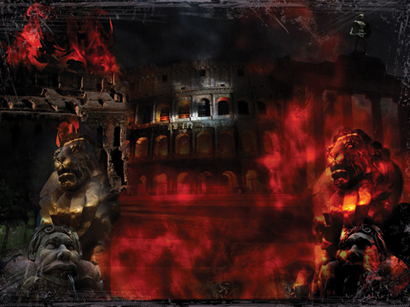 
  
文: 明理

【明慧网二零一一年十月十日】古罗马史学家泰西塔斯曾记载：“在皇帝的私人竞技场上，一些基督徒被蒙上兽皮，让狼狗活活咬死，另一些人被紧紧地捆在十字架上，点燃后作为黑夜中的火炬。身穿驭手服装的皇帝和人群混在一起欣赏。”谁是导演这场对基督徒的暴行呢？是一个名叫“尼禄”的罗马皇帝。

公元六十四年七月十八日夜晚，罗马城发生了大火，根据塔西佗的记载，大火蔓延很快，烧了五天。按普遍说法，大火是尼禄皇帝为夺取城中富贵人家的财产及嫁祸基督徒而指令军队放的。

城中十四个区有三个全部烧光，七个严重毁坏。有人说尼禄是纵火者。有些人甚至宣称看见尼禄站在高塔上穿着戏装，面对下面一片火海，弹奏着里拉琴，演唱他那关于特洛伊城陷落的民谣。

火灾之后，尼禄大兴土木，为自己建造了金碧辉煌的宫殿。人们对他更加反对了，公开说他放火是为了自己建造皇宫。面对这种指责，尼禄选中了基督徒来承担责任，先是指控他们纵火，后来又指控他们“仇视人类”。因为当时这些基督徒大都是穷人、奴隶和异乡人，迫害他们最容易。但是尼禄残酷屠杀基督徒的行为最终引起罗马人民的反对，罗马因此走向衰落和灭亡。

事隔二千年之后，在中土大地上，另一场“大火”燃烧了起来。

二零零一年一月二十三日，震惊中外的“天安门自焚”案发生。中共喉舌新华社一小时后向海外发布消息，称五名法轮功学员在天安门自焚，后改口为七名。

然而，中共的喉舌“中央电视台”播出的“天安门自焚”新闻节目疑点重重，例如，天安门广场面积大而且空旷，并没有陈列灭火器，何以在“自焚者”点燃身上汽油的短时间内就有这么多灭火器对齐“救火”？点燃汽油短时间内就会把自身烧死，“中央电视台”并不是每天二十四小时开着多台摄影机对准广场，何以有那么多摄影机多角度地把“自焚”镜头、包括特写镜头摄制下来？现场死亡的刘春玲，电视慢镜头中清晰显示是被一个身披军大衣的人从身后击中头部而倒下的……

同日，法轮大法信息中心发表题为<a href="img/35642128213.jpg">“中共制造自焚惨案，新华社造谣陷害法轮功”</a>的声明，呼吁对事件进行第三方独立调查。

二零零一年二月四日，美国《华盛顿邮报》发表的报导《自焚的火焰照亮了中国的黑幕──当众自焚的动机乃为加强对法轮功的斗争》，指无人见过“自焚”中死去的刘春玲练法轮功。

二零零一年八月法轮大法明慧网发布了《录像片：深入分析天安门自焚疑案》，揭示自焚骗局中的种种细节。

同月十四日，国际教育发展组织在联合国倡导和保护人权附属委员会第五十三届会议中发表声明，指天安门自焚事件是“政府一手导演”的，并谴责中共以“国家恐怖主义行为”迫害法轮功。

二零零三年一月二十日“追查迫害法轮功国际组织”于美国成立并宣布将“天安门自焚”事件列为第一个调查对象。二零零三年五月十四日，“追查迫害法轮功国际组织”在美国华盛顿召开新闻发布会，公布对“天安门自焚”事件的调查报告。报告显示，国立台湾大学语音实验室对“天安门自焚”事件中王进东的声音进行的独立语音分析表明，中央电视台在三次节目中所播出的王进东的声音不是来自同一个人。

二零零三年十一月八日，由北美非营利民间中文电视台“新唐人”制作的分析二零零一年天安门自焚事件的影片《伪火》（False Fire）获第五十一届哥伦布国际电影电视节荣誉奖。

至此，“天安门自焚”是中共制造、用以栽赃陷害法轮功的真相已大白于天下。

法轮功以“真、善、忍”为修炼原则，不但免费为民众祛病健身，而且普遍使人心道德回升，修炼者遍布世界各地、各个社会阶层，来去自由。法轮功明确禁止杀生，并明确指出自杀是有罪的。法轮功自一九九二年传出至今，除了中共炮制的“自焚”，无论在中国大陆和海外各国，从来没有发生过任何另外一起类似事件。

中共自一九九九年“七二零”开始迫害法轮功之后，不断栽赃陷害，为迫害制造借口。但法轮功太正了，中共使尽浑身解数编造谎言也无法掀起“斗争”高潮，于是，中共江罗集团铤而走险，重拾古罗马尼禄的肮脏手段，搞出了“天安门自焚”伪案，挑起人们对法轮功的仇恨，从而达到加剧迫害法轮功的目的。

迫害正信是不得人心的，所以强大的罗马在迫害基督教中最终走向了衰落和灭亡；今天的中共在迫害法轮功以来，为了打击“真、善、忍”而不断鼓吹“假、恶、暴、色情”的东西，使社会越来越不可收拾，中共也越来越不得人心。现在，一亿人的“三退”（退党、退团、退队）大潮已呈不可阻挡之势，明智者都抓紧时间退出中共，以保平安。

<h1 align="center"><b>突破封锁的先驱者(上) 追记12年前长春3.05插播 </b></h1>
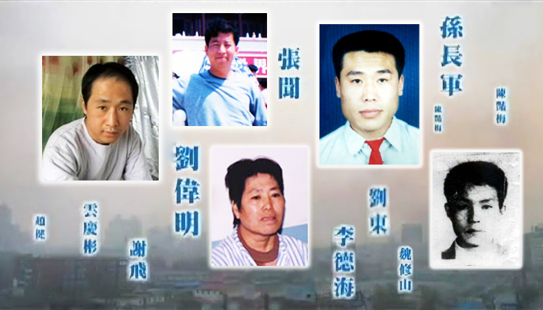 

<b>2002 年 3 月 5 日,《是自焚还是骗局》等真相电视片在长春有线电视播出,长春沸腾了! 震惊的人们纷纷电话告诉亲友同事，让他们打开电视看真相——原来天安门自焚是假的！原来对法轮功的报道是栽赃啊，原来国外都知道法轮功好啊……

这次成功的电视插播,是大陆有线电视网络争取自由、传播真相的杰作，民众都站在了正义一边。江泽民听到之后,怒不可遏地发出密令“杀无赦”！警方开始疯狂地在全城大搜捕。约 5000 名法轮功学员在长春被抓了,不计其数的人被迫流离失所,参与长春插播事件的18名法轮功学员,侯明凯在派出所被打死,15人被非法判刑4至20年(至今8人已被酷刑折磨致死),另2人失踪。</b>

文: 宇正

【明慧网二零一四年三月五日】 
目 录 

（一）梁振兴　团队的创建者 
（二）精英团队 
（三）刘成军　栋梁的传奇 
（四）沸腾的长春 
（五）英雄喋血 
（六）疯狂的审判 
（七）丹心照汗青 
（八）开创未来的先驱者 
（九）生命换来的光明

2002年3月5日晚7点19分，长春市惊愕了、沸腾了。

长春有线电视八个频道同步播出了《是自焚还是骗局》、《法轮大法弘传世界》等真相节目，震惊的人们纷纷电话告诉亲友同事，让他们打开电视看真相——原来天安门自焚是假的！原来对法轮功的报道是栽赃啊，原来国外都知道法轮功好啊……

在这强大的视觉冲击力下，40多分钟的法轮功节目，吉林省长春市30万有线电视用户，约十万人看到了真相；随后，在邻近长春的松原市，又有几万有线电视用户看到了这些节目——明白真相的人们，都站在了正义的一边！

“祝贺你们！”人们纷纷向法轮功学员道贺。很多人以为禁令解除了，法轮功要平反了，有人公开上广场散发真相传单，连监视他们的人都拍着他们的肩膀说，“好样的，了不起！”得到了本该属于自己的知情权，掀开了长期的封闭和压抑，长春人民都跟着扬眉吐气。

“马上离开！”一个军方朋友用电话给法轮功学员报信了，长春的军队要戒严了，警察全部出动，全城搜捕。原来听到消息后，当时在京参加“两会”的吉林省和长春市官员吓得直冒冷汗，恼羞成怒的江泽民下达了“杀无赦”的密令，公安部副部长刘京赶往长春限期破案。

为什么中共当局这样惊恐，这样仇恨，这样疯狂？为什么“3.05”事件能在国内、国际上产生那么大、那么持久的影响？甚至开启了突破网络封锁的新时代？还是让我们从头讲述，追记这些坚贞不屈的勇者，怎样创造了这段史诗般的奇迹。

<b>（一）梁振兴　团队的创建者</b>

<table border="0" cellspacing="3" cellpadding="3">
<tbody>
<tr>
<td align="center">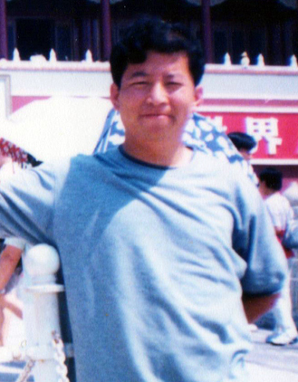</td>
</tr>
<tr>
<td align="center">图1：梁振兴，一个成功的房地产商</td>
</tr>
</tbody>
</table>
<b>浪子回头</b>

吉林省省会长春，一个并不富庶的老工业城市，梁振兴在这里过着优渥的生活。他是一个成功的地产商，没有家庭背景，通过个人奋斗，他在九十年代就拥有几十万个人资产。阔绰的生活，社会的污染，也把他变成了一个花花公子。

法轮功（法轮大法）自1992年由创始人李洪志先生从长春传出以来，吸引了数万长春人。文化广场是其中一个炼功点，梁振兴的家就在街道的另一面，他常常凝望着窗外的这群风雪无阻的炼功者，在钦佩中掺着几分好奇。终于在1996年，一个寒冷的早晨，他走进了这群人。

一切免费，热心教功。在当时普遍用气功挣钱的环境下，这无私的口号的确让人震撼。他试着一炼，感觉很好，看看法轮功主要著作《转法轮》，“真善忍”的理念让他明白了人生的真谛。他从此浪子回头，改掉了花天酒地、夜不归宿的恶习，濒临破裂的家庭重归于好。他介绍了很多亲朋好友来炼功，不久他就成了辅导员。

<b>空前的迫害 艰难的抗争</b>

法轮功的迅速发展引起了当局的恐慌。中共内部情报说法轮功短短几年就吸引了7000万人，超过了党员人数。喉舌报纸向法轮功发难，便衣特务出现在炼功点，和平请愿被记录在案。

1999年7月19日，中国的公检法、武警、军队全面进入了一级战备状态。7月20日，全国开始了大抓捕，报纸、网络、电台、电视开始全面攻击法轮功，抛出了一个个惊人的污蔑法轮功的案例（事后证明都是谎言，被揭穿后连媒体都不再提了），全面煽动着民众对法轮功的仇恨……

怎么办？梁和许多炼功人一样，他们知道“真善忍大法”是他们一生追寻的真理，如今法轮大法蒙冤，为正义伸冤、捍卫真理就成了义不容辞的责任，何况他们都是法轮功的切身受益者。那时每天都有成千上万的法轮功人士到北京上访，这是一个中国公民唯一的合法的伸冤渠道了，但是上访者都被非法抓捕，押回原籍拘禁。

这群善良的法轮功学员，他们认为精诚所至，金石为开。所以决定去北京上访，向政府讲述真相，请当局收回错误的禁令。

事实证明他们太天真了。中共的政治运动，一贯用暴力和谎言打击良善，制造血腥恐怖，维持其专制的稳定。这场运动，比起10年前的“六四”屠杀请愿的大学生，还要邪恶。中共当局就是用谣言开道，用暴力手段来铲除法轮功。当时的信访局，已经成了诱捕法轮功学员的地方。

10月1日，他们在上火车前被公安抓捕，被刑讯，被刑拘，被劳教——这一切在中共的法律里找不到依据，当局歪曲法律，制造了一起起冤案。

<b>囚室三剑客</b>

梁振兴的铮铮铁骨，让劳教所十分头疼。一个劳教所用酷刑也不能使他屈服，就想法把他推给别的劳教所去收拾。2000年，梁被转到长春苇子沟劳教所时，在那里他遇到了刘成军和刘海波，这两位难友的故事后面会集中讲到。他们“三剑客”，开始“并肩作战”。

劳教所每次攻击法轮功时，哪怕是开大会，甚至司法局、劳教委、市局的领导在场，梁振兴和刘成军等人就会当场站出来，揭露谎言，卫护正义的尊严，每次都在对他们的暴打中混乱收场。但他们毫不畏惧，下次还会挺身而出。

2001年1月23日，北京当局一手炮制了震惊中外的“天安门自焚”假案，当局说五名“法轮功抗议者”在北京天安门广场自焚，嫁祸栽赃法轮功。媒体掀起了新一轮的攻击，全面点燃了民众对法轮功的仇恨，为镇压制造借口，迫害进一步升级。江泽民下了“打死白打死，打死算自杀”的指令，当局不再限制对法轮功的酷刑，迫害致死的案例，在明慧网上几乎天天都有报道。

梁振兴和他的同伴们知道这个弥天大谎是最害人的，如何彻底揭露它、曝光它？他们在劳教所苦苦思索着。

<b>豁然开朗</b>

2001年底，他们陆续劳教期满释放。梁振兴回家后，在明慧网上看到了纪录片《伪火》。这部在第51届哥伦布国际电影电视节上获荣誉奖的影片，凭借严谨的剖析，以无可辩驳的证据，让人们看到原来“央视天安门自焚录像”破绽百出，是栽赃法轮功的一起伪案。这正是世人需要的真相。

明慧网上一篇文章让梁豁然开朗。文中提到截断电视传输，将VCD机接入线路播放真相节目的可行性——这就是他找到的最有效的方式，比以前的小喇叭广播、真相气球和海量传单更有效！

用这种全新的方式，揭露这个世纪谎言，必须要组建一个团队。

<b>（二）精英团队</b>

<b>风云际会</b>

梁振兴马不停蹄，去和长春功友们交流想法，寻觅人才。当时52岁的周润君也萌生了插播的想法，和他不谋而合。这位大姐把自己租的一处毛坯房作为基地，也去帮着组建团队。

32岁的刘伟明是有线网络电视的专业人员，精通电子技术，他毫不犹豫地来做技术攻关。

28岁的张闻，是精干的电工，他和刘伟明一起绘制了有线电视网络图。

26岁的雷明是团队的小兄弟，他来自白山市。他是快餐师，双手灵巧，还有着运动员般的身法。他创造过一个空前绝后的奇迹：在北京天安门广场上展开请愿的横幅，警察们冲上来围攻他，他竟穿出包围，把穷追不舍的警察们，迷失在蜘蛛网般的胡同里，全身而还。

31岁的李德海是通化市人，他家是养牛的，正在给他攒钱结婚。他因为讲真相被警察追捕，流亡到长春。他为人爽快，身手麻利，也成了团队的主将。

一个个精英纷至沓来，组成了一个18人左右的团队。团队有五位技术主力，这“五虎上将”除了上述4人，至今还有一位不知道名字，也许就在那些在抓捕中被整死的无辜者中。

<b>内部分歧 阻力重重</b>

该不该这么做？梁振兴在和长春功友们的交流中，遇到了空前的阻力，大多数人反对。他们认为这样会激起民众的反感，事与愿违。反对者扩散着自己的言论，希望更多的人来阻拦这个计划，梁开始感受到压力。

唐风，一位高大威严的长春功友，因为坚强不屈受到了普遍的尊重。因为有些功友对插播行动不理解，建议唐风去劝劝梁振兴、与他深入切磋、探讨一下，是否应该继续开展这一行 动。于是，唐风约梁振兴在长春市三道街街头市场见面。在熙熙攘攘、人头传递的街头，通过长时间的交流、切磋，唐风被梁振兴的心怀救度众生的大善、大勇的精神感动，认同插播 行动是可行的壮举。唐风回来后，将见面过程向功友们转述，功友们也都理解了插播的行动并正念支持。

深思熟虑之后，梁确信自己的计划是正义的，是把知情权还给广大民众，人间不该是谎言的舞台，这些真相本该属于大众。梁也知道做这件事情的风险和代价，他的女儿今年要高考，这是女儿命运的关键转折点……但看到几乎天天都有功友被迫害死，这场谎言构筑的迫害太邪恶了，而民众被谎言迷惑着扭曲了正义感，在迫害中推波助澜……他只能置个人的情感和幸福于度外。但是团队内部，会不会听到风言风语开始动摇？

<b>蓄势待发</b>

值得自豪的是，插播团队精诚一心，义无反顾。

梁振兴出资购买设备，周润君负责后勤，给大家做饭，刘伟明传授技术，有人学练，有人整理资料，还有人掩护、帮忙，配合的很默契。

但是，2002年2月16日晚上传来消息，梁对大家说：离长春不太远的鞍山市，有线电视短暂插播了法轮功真相，但没能持续……咱能成功么？

我们的技术是过关的，只要充分演练，配合得当，一定能成功！技术组的回答，给了所有人底气。于是继续推进，开始了实战演练。

大家坐公交车到郊外，在张闻的指导下，穿上电工脚蹬子，带着绝缘手套爬电线杆。刘伟明领着人们到农村“实战”。他安放插播设备，播放七彩竖格画面的光盘，让人去各家检查有线电视信号，结果很多频道都是这样清晰的影像——预演成功！

<b>主帅落难</b>

2002年2月下旬，梁振兴拖着疲惫的身体回来了——他为插播忙了两个多月了，整天在外边跑，找人手、买设备，协调团队的一切，应付内外的压力……过度的疲劳和压力几乎压垮了他。他双眼无神，坐在那直冒虚汗。

团队已经成熟了，梁在劝说下回家休息。可是刚回家没几天，2月27日，他被一个朋友的电话叫醒，催他尽快回公司整理文件。结果半路杀出了警察——诱捕！他大喊着“法轮大法好”的口号，被塞进警车。周围人交头接耳：又在抓法轮功了。

梁知道是插播走漏了消息，因为他也没干别的事。彻夜的酷刑逼供，他艰难地支撑着，也在担心着团队的安危：他们会被告密么？他们有危险么？他们何时进行？能成功么？能持续多久？能把真相节目播放完……

多想无益，酷刑何惧？扛着吧，他在牢狱中坐镇，要给大家争取时间……

<b>（三）刘成军　栋梁的传奇</b>

<b>挑起大梁</b>

得知梁被抓的消息后，很多人紧张了，酷刑逼供，梁能挺得住吗? 如果这儿也暴露了，那就前功尽弃了！转移？散伙？还是坚守？

周姨做的“最后的晚餐”，大家吃不出味道，甚至有人等着警察敲门。

但是有人不担心，他就是新来的刘成军。我们前面提到过，刘成军和梁振兴是英雄相惜的难友，他知道梁铁骨铮铮，而且他知道假如这个住所暴露了，在得到梁出事的消息前，这里就会被端了。

法轮功里没有行政式的领导，梁振兴只是一个牵头人，现在常把他们叫做“协调人”，大家志同道合，有事商量着办，全凭自愿。所以梁被捕后，团队并没有多少群龙无首的失落，只要有人挑头，大家商量，团队就可以继续前进。

最后找来的刘成军，现在主动接替了梁振兴，挑起了大梁。

<b>分兵派将</b>

3月3日晚上，也就是梁振兴被捕后的第5天，刘成军把大家召集到一起。在并不明亮的客厅里，刘成军说：因为3月6日要审判一批功友，要赶在这个之前，把真相告诉世人，在舆论上对牢狱中的功友们给予道义的支持。这样把时间提前到3月5日，行不行？

大家一致同意后，刘成军开始排兵布阵了，兵分四路！

他先对刘伟明说：“你负责长春的一条主干线。”刘伟明欣然应允。

他又笑着问孙长军：“你行不行？要行，你就负责长春的另一支主干线。”孙长军的语气有些犯难。因为长春那两条主干线很粗，操作难度很大。而孙长军负责整个插播技术的文稿，还没整理完，还没向明慧网上传。

刘成军就对张闻说：“你负责这一支吧。”张闻爽快地答应了。他是电工，钳子玩儿得特别溜，很专业。

刘成军和另一个主力说：“咱俩一伙。李德海，你领一个，我领一个，咱们四个上松原。那儿我最熟，咱们负责那里的两条干线……雷明，你配合张闻；孙长军，你配合刘伟明。”然后跟其他人说：“你们在周围正念掩护。3月5日晚上7点，插播的节目开始播放，四地同时进行。”

时间确实很紧。晚上每组先自己组装设备，每套设备在电视上显示成功后，又帮助别人互相检查了一下。带上精良的工具，还有自己改进的正规工作服，这些都是周润君精心筹备的。周润君说：“你们走吧，屋里的日用品我负责运走。这儿又会变成一个毛坯空房。”——这就是团队当时的家，简陋的没有装修的毛坯房，没有任何家具。

<b>副帅的传奇</b>

  
至此，故事的重心落到了接替了主帅的刘成军的身上，他的故事精彩非常，我们还得从头讲起。
<table border="0" cellspacing="3" cellpadding="3">
<tbody>
<tr>
<td align="center">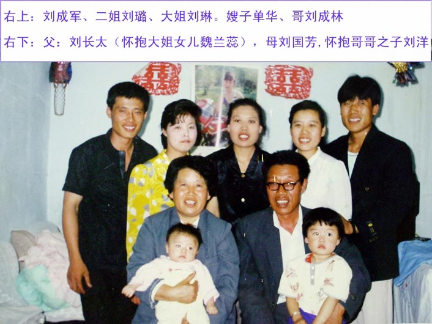</td>
</tr>
<tr>
<td align="center">图2：刘成军的全家福，右1为刘成军，中间是大姐刘琳</td>
</tr>
</tbody>
</table>

31岁的刘成军高大魁梧，方脸直鼻，浓眉大眼，目光炯炯，显得十分威严。他家在离长春很邻近的农安县，他是仓库管理员。炼法轮功前，他是当地社会上有名的人物——很能打架，没人敢惹。但是法轮功把这个社会上的混混，变成了一个打不还手、骂不还口、舍己为人的“真善忍”的信仰者。他的巨大变化，让亲朋好友都看到了法轮功的威力。

99年中共迫害法轮功后，他几次去北京上访都被抓回来拘留。于是他改为去天安门打横幅请愿，至少这样能让人们看到有人在为法轮功鸣冤。2001年10月1日，他第三次来到天安门广场，高举横幅向人群高呼：“法轮大法好！”警察和便衣们扑了上来，他边跑边喊，直到在广场绕了三周，才被围截打倒。

他不报姓名，任凭酷刑的折磨，同时绝食抗议，用生命为大法鸣冤。他四肢被固定在北京一公安医院的病床上，灌食导致他面部、鼻腔、口腔、咽喉都严重受伤，尽管这样，他还在给周围的人讲着法轮功的真相，最后警察竟然哀求他：“你怎么才能吃饭啊？只要吃饭就放你回去。”他回答：“我要看《转法轮》。”

《转法轮》是法轮功的主要著作。中共自1999年7月20日开始，就一直抹黑法轮功，断章取义地造谣，如果人们能看到《转法轮》，一切谣言都将不攻自破。所以当局一直在对法轮功学员抄家，收缴销毁法轮功的全部书籍。但是当时很多警察在偷偷地看这本书，有不少人看后明白了一些真相，不再苟同中共的倒行逆施。

刘成军这次是幸运的，这幸运是用生命的抗争换来的。警察给他找来一本《转法轮》，不久还真放了他。也是因为那时去天安门广场为法轮功请愿的太多了，北京及其周边的城市的看守所、拘留所、收容所爆满，很多法轮功学员在酷刑折磨后仍然不报姓名，有的就释放了。这样的故事，在当时的明慧网上多有报道。

但是后来，这种幸运便不复存在，甚至变成了巨大的悲剧——在北京所有不报姓名的请愿者，整汽车、整火车地被秘密押往集中营，被集体失踪——迫害法轮功升级了，秘密活摘器官贩卖，焚尸灭迹开始了，由此造成了2003—2007年中国大陆器官移植数量蘑菇云式地暴增，在官方有据可查的数据里，有6.5万例活体器官移植没有合法来源，而当时的一些录音证明：全国很多医院疯狂地进行活体器官移植，有的大夫直接告诉咨询者：“各地医院都是这样（器官供体是法轮功学员）。”

（可通过破网软件下载电话录音证据：http://www.zhuichaguoji.org/node/35848）

刘成军回来之后，靠炼功很快恢复了身体。他知道上访、请愿都没用了，就开始在当地印刷法轮功真相传单和小册子。他开着大卡车，经由302高速公路，把整车的真相资料送到他的家乡农安县和周围的乡村，由此得到了“大卡车”的外号。

这样做风险很大，他再次被抓。在看守所里，狱警开始还想暴打他，可他走近了三米高的拘留所围墙，用犀利的目光“照”着狱警：“谁敢碰我你就试试！”

狱警们真被吓着了，于是开始流传刘成军的神话：他一口能吃下去一个包子，他是“黑社会老大”；他上边有关系……其实刘成军也仅仅是震慑他们而已，“打不还手，骂不还口”是《转法轮》中的“法理”，他从修炼开始直到生命的最后一息都没有违背过，尽管他后来遭受了无尽的殴打和酷刑的折磨。

10月末一个寒冷的早晨，人们都在熟睡，刘成军冲到墙边，翻墙而出。狱警怕担责任，把越狱的版本后来改成了“他们把刘成军放了”。

越狱在北京等戒备森严的看守所是不可想象的，但在僻远的县城却偶有发生。2000年时，唐山某拘留所，抓来的十多个去北京上访的法轮功学员从大烟道爬出，再次去北京上访，唐山市局愤怒地撤销了这个拘留所。

后来刘成军又因为讲真相被抓进劳教所，在那里结识了梁振兴，结下了这段奇缘。

现在我们把视线拉回2002年3月5日晚7点。刘成军和李德海分别带人，在松原市前郭县两条有线电视主干线上，插播了法轮功真相节目。打车回去的路上，呼啸的警车从对面疾驶而过。

回到住处，刘成军总想出去看看结果，就一个人走了。第二天上午他回来了，激动地流着眼泪说：成功了！谢谢你们！公共汽车上都在说法轮功真相，一条支线上播了20多分钟，另一条支线播了半小时，自焚真相都播完了，老百姓看明白了，县城轰动了！

<h1 align="center"><b>突破封锁的先驱者(中) 追记12年前长春3.05插播 </b></h1>

文: 宇正

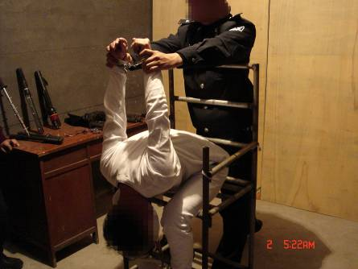

  
【明慧网二零一四年三月六日】（接上文）

<b>（四）沸腾的长春</b>

2002年3月5日19:19，长春有线电视八个频道同步播出了《是自焚还是骗局》和《法轮大法弘传世界》。震惊的人们纷纷电话告诉亲友同事，让他们打开电视看法轮功。

<b>扬眉吐气</b>

《兰台内外》杂志的副总编张忠余走进了一家小店，一群人正围着电视，兴奋地看着、议论着，店主见来了个干部模样的人，马上紧张地换频道，连换了几个频道，播的都是《是自焚还是骗局》。

“这节目很好，就看这个吧。”张忠余话音一落，店主放心了。电视里的节目主持人正解析央视“焦点访谈”节目的“天安门自焚录像”，逐个指出里边的破绽，看完后大家恍然大悟：原来这是一场彻头彻尾的骗局，以牺牲鲜活生命来构陷法轮功的！接下来的内容是法轮大法传世界，受到各国政府和机构褒奖的历史镜头和视频……（使用翻墙软件突破中共网络封锁后，可下载视频的中文版：）
http://www.minghui.org/mh/articles/2004/2/17/67484.html

美国《标准周刊》（The Weekly Standard）在2010年12月6日发表了长篇报道：《进入细微的电波——几位不为人知的中国烈士如何帮助全世界的自由事业》，文中这样记录了当时的长春：法轮功的节目在八个频道播放了50分钟，积聚了超过10万的观众，随着消息的传开，观众越来越多，人们互相打电话，说他们会马上打开电视。在一些居民区，当地中共官员变得绝望，切断电源，使街道陷入黑暗。在其它居民区，比如在文化广场附近，人们走到街上庆祝。禁令结束了！法轮功平反了！几个修炼者从工厂和藏身之处走出来，公开发资料。邻居、孩子、陌生人，甚至戴着红袖标的老太太都接近他们，每个人都在说话，跑过去，笑着拍着他们，祝贺他们。有几个人怀疑这不是政府的广播，但他们仍然开心的笑着轻声问：你们是怎么干成的？你们法轮功真了不起！而且这时看起来他们似乎真的是被平反了，快乐和笑声到晚上十点都没有停止……

得到了本该属于自己的知情权，揭开了长期的封闭和压抑，长春人民都跟着扬眉吐气。明白真相的人，都站在法轮功一边，都在骂当局祸害好人。

在一家小卖部，一位女士进来就问老板：“你昨天晚上看没看那个法轮功真相？”老板说看了，她说：“哎唷！我昨天晚上没看电视。太遗憾了！”

长春居民魏利生说：“3月6号早晨，老板看到我就说：‘法轮功真厉害，那些老百姓都评论哪，天安门自焚，电视上报导说，那是共产党栽赃陷害法轮功演的戏，法轮功弘扬世界……’”

<b>惊恐的中共</b>

中共的报道刻意掩盖了百姓大众的声音，只说插播中接到了2000多次报警电话——但比较一下长春的数万中共各级官员和警察，这2000个报警电话比例太小了，反而在告诉我们，更多的干部和公安在黄金时间段收看了真相，并不报警。其实只要会独立思考，谁也不会站在谎言的一边。

3月6日，长春南关区法院门口，一长串的警车停在法院一侧护卫着，如临大敌。因为成千上万的老百姓自发云集到这里，布满了整个大马路，甚至挤到了周围的小胡同里。大家都知道天安门自焚是假的了，都想看看今天公审10个发真相资料的法轮功（学员），到底咋判？百姓议论说：“人家法轮功发传单说的是真话，没犯法，人家无辜，你判个啥？”

<b>倾城大搜捕</b>

但是百姓还不知道，气急败坏的江泽民已经下了“杀无赦”的密令，“六一零”头子刘京赶往长春督战，限期破案。

插播的当晚，军队开进长春戒严了！警察全部出动，开始了大搜捕。每个警察都有抓人指标，完不成就下岗，相关领导撤职。抓法轮功（学员）不需要任何法律手续。据警察讲：“上级有令，杀人放火都不管，就抓法轮功（学员）。”倒行逆施使长春市治安恶化，一个月内暴力、杀人、强奸恶性案件不断。

红色恐怖笼罩着长春——这要干啥呀？来点真的就这样？非得让老百姓信你的假话？还让不让人活了？……民怨再次升腾。

第一轮搜捕，5000多法轮功学员被抓，都被刑讯逼供，逼迫他们交待插播的线索。长春的浩劫开始了。

<b>（五）英雄喋血</b>

<b>雷明　第一个被抓之后</b>

3月5日晚八点，雷明和张闻在最后撤离时被发现，雷明没有跑掉——他比张闻更有速度，更有时间撤离，很可能他在吸引注意力，掩护大家——他们组有7个人啊。

雷明被抓到清明街派出所，背铐着坐在地上，身上仅剩的200元钱被抢走。不久来了很多警察，把他架了出去。派出所门外站满了人，有很多人拿着麦克风摄像机，围上来对雷明采访，却被警察们推开——足见当时影响之大，惊动了如此多的记者。

雷明被押到市局，动刑之后又被蒙上眼罩，一路警笛，押到净月潭宾馆的地下包房，房间里摆放着铁老虎椅和各种刑具……雷明又被架上铁老虎椅，双臂绕过椅背，用牛皮带套着手铐，死死拉向椅子底下的铁梁，手铐硌着腕骨，双臂被两个警察拉到极限，还在下拉，雷明疼得汗水湿透了全身，几乎昏了过去，最后一个恶警猛踹手铐，才把牛皮带扣到了极限，警察们已经累的上气不接下气。

<table border="0" cellspacing="3" cellpadding="3">
<tbody>
<tr>
<td align="center"></td>
</tr>
<tr>
<td align="center">图3：演示铁老虎椅酷刑之一</td>
</tr>
</tbody>
</table>

房间没有暖气，警察扒开雷明的衣裤，用两根电棍同时电脖子、嘴、心脏、下体……电棍充电时，换上警察用塑料袋套在雷明头上，人要憋昏时，突然松开，刚喘了几口气又被套上了，反复折磨不停，然后，用烧红的螺丝刀烫脖子，烫得皮开肉绽，再上电棍，再电伤口。还把一个大铁桶套在雷明头上猛敲，震耳欲聋……

四、五个小时后，紧勒双臂的牛皮带崩断了，雷明右胳膊脱节了，小臂紫黑，象残废了一样悠荡着，双手肿得象馒头，手指粗了二、三倍。

铁椅上酷刑4天4夜，雷明被扔进了铁北看守所。看守所一见满身是伤，马上拒收，警察说这是特案，才同意接收。到了监号，犯人们都惊呆了，雷明满身是电击的焦糊斑，烫伤、电伤、勒伤，惨不忍睹。牢头说：“以前我不信法轮功被迫害的这么严重，今天我彻底信了，这共产党要完了。”

<b>抓刘成军　放火加枪击</b>

3月23日晚，20余辆警车包围了前郭县山后屯，一群恶警象土匪一样闯入刘成军的姨父柳长发家。让柳家做饭，还把刘成军的表弟带到派出所毒打了一个多小时，威胁要把他84岁的姥姥抓来，这样逼着问出了刘成军的下落。

凌晨1点多，公安部督办、省厅指挥、长春市局、松原市局、前郭县公安局、农安县公安局联合组成的专案组，杀向山后屯，7辆警车包围了柳家，点燃了柳家的两个柴草垛，很多村民都惊起救火。藏在里边的刘成军跑了出来，多处被烧伤，恶警在众目睽睽之下用碗口粗的大棒一顿暴打，然后砸上镣铐，松原恶警李伯武（音）往刘成军腿上连开两枪，叫嚣着：“这回我看你往哪跑！”。然后把刘成军塞进小车后备箱，又抓了柳长发夫妇扬长而去。

柳家三口被关押到前郭县看守所11天。刘成军表弟等被打成胸内伤，姨父柳长发被打得大腿肌肉离骨。

<table border="0" cellspacing="3" cellpadding="3">
<tbody>
<tr>
<td align="center">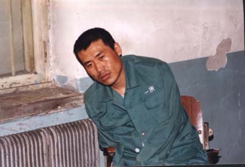</td>
</tr>
<tr>
<td align="center">图4：刘成军最后一张照片，胳膊不在袖内，人已无力坐直</td>
</tr>
</tbody>
</table>

刘成军被绑在老虎凳上52天，遭受了各种酷刑，牙都被打掉了，腹膜被撕裂导致小肠疝气。

<b>长春浩劫</b>

5000多人在大搜捕中被抓，至少有6人在一个月内被酷刑致死，其中大多数人并没有参与插播。

李容，35岁，吉林大学毕业生，原在吉林省药物研究所工作，警方称她在抓捕中坠楼身亡，死因真相待查。

沈剑利，34岁，吉林大学应用数学系教师。3月6日，沈剑利被抓，4月下旬被酷刑折磨死时，她丈夫郑炜东也是法轮功学员，也在关押中。

<table border="0" cellspacing="3" cellpadding="3">
<tbody>
<tr>
<td align="center"></td>
</tr>
<tr>
<td align="center">图5：吉林大学教师沈剑利</td>
</tr>
</tbody>
</table>

一名不知姓名的男学员，30多岁，3月16日，被长春锦程公安分局刑警大队活活打死。该法轮功学员身体多处受伤，内脏被打得破裂多处，身体已经严重变形。

刘义，34岁，3月18日被抓，被打死在绿园区公安分局刑警大队办公室里。

李淑芹，女，54岁，3月20日被长久路派出所抓走，在长春第三看守所被折磨致死。

刘海波，前面提到过他，他和插播团队的主帅梁振兴在劳教所就认识了。他是春城医院的放射理疗师，一直抵制迫害，多次被拘留。一次某小学举办法轮功“罪行”展，强迫小学生去观看。他知道那些重复了千百次的谎言会占据孩子的心灵，是良知的毒药，就走进去扯掉了所有的展板，捣毁扔进了垃圾箱，全身而退，如入无人之境。

3月10日晚，刘海波从家中被抓，家中5000元现金和身上的钱被抢走，警察当着他妻子和两岁儿子的面，打断了他的脚踝。凌晨1点多，刘海波命丧公安局，年仅34岁。

一位现居澳洲的姓霍的警察披露，刑讯到最后，他看到两个警察把一个高压电棍插入刘海波的肛门里电击内脏，几分钟之后，警察开始叫喊：刘海波没心跳了！对外谎称其死于心脏病，尸体被秘密火化，随后又抓了他的妻子。

<table border="0" cellspacing="3" cellpadding="3">
<tbody>
<tr>
<td align="center">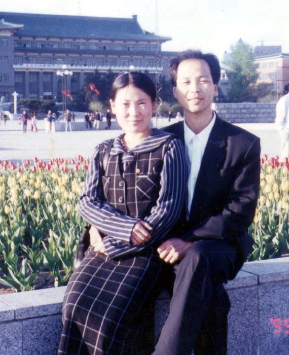</td>
</tr>
<tr>
<td align="center">图6：刘海波和他的妻子</td>
</tr>
</tbody>
</table>

后来一位在大搜捕中被抓的女学员投书明慧网：“……当时他们怀疑我也参与了此事，把我当成了‘重要人物’。我在下班途中被劫持到绿园区派出所，七、八个警察围着打我……一个姓黄的向我家属骗去了几千块钱，说是能把我弄出来。在刑警队，我被双手吊铐，仅脚尖着地，后来我双臂四十多天没有知觉。最后把我带到了市局一处，当时一处在净月潭宾馆包了地下一层的房间，每间都设有铁老虎椅，恶警高朋、张行（他们读“航”音）非常狠毒，专门电女学员的乳头、阴道，他和恶警姜忠各持一根电棍架到我的脖子上电。把我电得从头到脚满身都是糊点，糊点是恶警用电棍顶住不离开，一直电糊才形成的。还用黑塑料袋把我闷得昏死过去。

“后来我在看守所遇到王玉环和陈艳梅。恶警姜忠审王玉环时，用大头电棍电她，还把她弄到净月潭的山坡上，全身捆得跟一个棍似的，然后两个人抬着她往树上撞，她说都以为自己回不来了。”

<b>（六）疯狂的审判</b>

<b>人数与死讯</b>

2002年4月1日，中新网报导说：“3月5号晚长春市和松原市的电视插播事件是长春市梁振兴、周润君、赵健、刘成军、云庆彬等18人所为。”

到庭审时只剩下15人。从上一集6人被酷刑整死我们可以看出：缺失的3人中，有人已被酷刑折磨致死——这是中共公检法知法犯法，是严重的杀人犯罪，官方媒体不经意间，露出了端倪。

<b>侯明凯 死亡与庆功宴</b>

插播团队中的侯明凯，前边没有提到过他。他精明强干，精通电器，身体健壮，在牢狱中展现了对酷刑超强的承受力。他有猴子一样的身法，人也象猴子一样活泼，经常逗得大家哈哈大笑。

插播成功后，他回到了老家吉林市。警方通缉他，悬赏5万元，并升官二级！

他试图再次插播，但没有成功。后来施展自己最擅长的技术，象猴子一样爬上树，放上一个扩音器，在公安局里谴责发动迫害的江泽民。2002年8月20日，侯在长春功友家里被抓，在绿园公安分局被连续毒打到凌晨4点后死亡，年仅34岁。

据当时和侯明凯同时落难的人讲：“吉林市六一零和国保大队的人在我家抓了我、侯明凯和另两位法轮功学员。我被铐在门口暖气管子上，门敞着。侯明凯被押在我对面的屋子，门关着。那屋里劈里啪啦地打人，侯明凯没喊一声。有的恶警打累了就到我屋里休息，喝水，嘴里还说‘这人很经打。’

“一个女警说：‘这个催泪弹咋就没起作用呢？差点把自己催了，这个人真有刚！’后来很多屋的警察都被叫到那间屋子，打骂声不断，不到半小时就听他们说：‘侯明凯完了，不行了’。但是恶警为掩盖杀人罪证，故意跑到关我的屋子里说‘侯明凯跑了，从窗户跳出去跑了’。我们在六楼，恶警一直在房间里酷刑逼供，不可能跳窗，我心里非常明白他肯定是被打死了。另一个功友，胳膊被打断成好几节。”

<table border="0" cellspacing="3" cellpadding="3">
<tbody>
<tr>
<td align="center"></td>
</tr>
<tr>
<td align="center">图7：侯明凯遗物中的照片：妻子和女儿侯雨辰</td>
</tr>
</tbody>
</table>

在江泽民对法轮功“打死算自杀”的政策下，警察们完全丧失了人性，毫无负罪感，因为将得到悬赏的升官和重金，杀人的警察们开了庆功宴！

<b>疯狂的法庭</b>

2002年9月18日，市中级法院“公开审判”前，插播团队的幸存者们被拉到法院的单独房间，被电击得在地上翻滚，警察边电边吼：“到庭上能不能不喊、不吱声。”据知情者透露，陈艳梅、刘成军等被毒打电击了很长时间。法庭上，两个法警控制着一名法轮功学员，为了不让他们讲出真相，法警使劲掐他们的脖子，就是这样梁振兴、刘成军等人还当庭揭露当局的谎言，高呼法轮大法好，法警累得直换人。

后来法警再次把他们拖进房间，强抓着他们背铐的手按手印，还说：“这可是你自己按的啊。”梁振兴、陈艳梅、刘成军等人再次被毒打，后来被抬回监室。狱警声称：“法庭上的一切，与我们都没有关系，那是公安局干的。”

他们的刑期，是99年中共迫害法轮功以来最重的： 
梁振兴（37岁，团队的创建者，因一周前被抓，未亲自参与插播，冤判19年）； 
周润君（女，52岁，牵头者之一，冤判20年）； 
刘伟明（32岁，技术总监和主将，冤判20年）； 
刘成军（31岁，副帅，冤判19年）； 
张闻（28岁，主将，冤判18年）； 
雷明（26岁，主将，冤判17年）； 
李德海（31岁，主将，冤判17年）； 
孙长军（24岁，主将，冤判17年）； 
赵健（女，35岁，冤判15年）； 
云庆彬（37岁，冤判14年）； 
刘东（37岁，冤判14年）； 
庄显坤（29岁，冤判11年）； 
魏修山（35岁，冤判12年）； 
陈艳梅（女，40岁，冤判11年）； 
李晓杰（女，31岁，冤判4年）。

当局指认的18人的团队，判决缺失3人：其中刘海波和侯明凯被抓后即被打死，还有1人可能就在被酷刑整死的人群中，被当局隐匿。

重刑和暴政引起了世界舆论的激烈谴责，插播团队突破封锁，争取言论自由的壮举，受到了国际社会的颂扬。 
 
<h1 align="center"><b>突破封锁的先驱者(下) 追记12年前长春3.05插播 </b></h1>

文: 宇正

 
【明慧网二零一四年三月七日】（接上文）

<b>（七）丹心照汗青</b>

<b>监狱的摧残</b>

刘成军被关进了吉林省第二监狱（俗称吉林监狱）一大队。监狱长李强，副狱长刘长江，一大队大队长赵京，副队长王建孔指使罪犯开始实施新的迫害。

刘成军被拖到水房，臀部被打得肿得很高、溃烂，连短裤都脱不下来了，木板木棍被打折了好几根。用手编腰带抽脸、抽眼睛，腰带上的大纽扣都打碎了……目击者（刑事犯）佩服地说：“刘成军真是一条硬汉，被打时一声不吭。”

2003年8月底，在一大队坚贞不屈的刘成军，被转到五大队。赵京到五大队当大队长，和副队长林志斌，伙同罪犯郭树铁迫害法轮功学员。刘成军从来都拒绝做看守所、劳教所、监狱的奴工，因此被迫害的更为严重。刘成军绝食抗议，开始了生命的抗争。

他把自己的狱内购物卡给了其他法轮功学员，嘱咐他们都买成营养品，分给那些被关小号和其他需要补充营养的功友们。看到一位功友的衣服破了，他一边为他缝补，一边给大家唱了一首歌曲《祝福》——这是狱友自编的词曲，鼓励大家坚忍刚强，走好正法之路。功友们听着，泪流满面。

绝食10天，滴水未进，已经远远超过了绝食绝水七天即死的极限，管教戴俊这才把他送进狱内医院抢救。刘成军已被迫害得脱相，吐字说话都很困难，医院确诊为尿毒症，公安医院和吉林市中心医院都下了病危通知。

10月21日，监狱通知了家属。那时刘成军大姐，法轮功学员刘琳，第二次被劳教释放刚两天。家属赶到吉林市中心医院，那时刘成军已奄奄一息：整个人骨瘦如柴，全身到处是伤痕，眼窝深陷，看不清东西，咽喉重度感染，说话很吃力，心、肾都重度衰竭。

大姐握着他的手，哭着说：“我现在就给你办保外就医，很快就回家。”

刘成军艰难地说：“啥…也…别…执…着。”大姐也同样是坚贞不屈的法轮功学员，他看着大姐在流泪，就一个字一个字地鼓励道：“大觉不畏苦　意志金刚铸　生死无执著　坦荡正法路”（《洪吟二》〈正念正行〉），在场的人都失声痛哭。

<b>高洁而去</b>

监狱要给办保外就医，竟然被刘成军家乡农安县的“六一零”拒绝！约12月初，刘成军又被送回监狱，直接关进了小号。曾经魁梧威严、震慑狱警的刘成军，那时已经不能站立，大便失禁。

2003年12月24日，刘成军被转到长春中日联谊医院。在这圣诞节前夕的平安夜，奄奄一息的刘成军要了纸笔，写下了人生最后的五个字：“法轮大法好”。

12月25日家人赶来，见刘成军七窍流血，身上全是血，腿上脉管象拉开了，满地是血。他全身是伤，器官重度衰竭。几乎发不出声的他，艰难地指看护他的犯人说：“他，端屎、端尿，我走了，你们要善待他，救度他。”在场者无不动容落泪。

12月26日凌晨四点，经过21个月的炼狱摧残，高洁的刘成军离开了人世，年仅32岁。当天，监狱纠集大批警察，不顾家属反对，未经尸检，强行火化。

看到儿子惨死，刘成军的父亲刘长太和老伴当时就不行了，老伴哭昏了过去，刘长太嗓子当时起了一个鸡蛋黄大小的血泡，呼吸困难，差点堵死过去。刘长太老人说：“我一定要讨个公正的说法，不然我无法度过余生啊！我怎么也想不明白，一个学做好人、一心向善的人，为什么要遭到如此恶毒的虐杀？法律和公理何在？人间正义何在？他们用了什么恶毒的手段害死了我儿子？我儿子临死时鼻孔、耳朵、大腿等处都在流血，这究竟是为什么？！”

在刘成军被迫害死后，“六一零”又派人到刘家蹲坑、骚扰。刘成军的大姐刘琳2004年12月17日，又被北京市公安局非法抓捕，被通州看守所非法关押一年。

家破人亡，在不断的打击和折磨下，2005年3月28日，刘长太老人含冤而逝。

<b>丹心照汗青</b>

刘成军被害死4年后，2007年9月5日，在澳洲纽省的议会大厦，某人权基金会的颁奖典礼上，将“丹心汗青奖”，授予打破新闻封锁的“3.05长春插播团队”的代表——刘成军。

这一奖取名于南宋民族英雄文天祥的千古名句“人生自古谁无死，留取丹心照汗青。”该人权基金会说：刘成军的选择在对抗江泽民集团残酷迫害法轮功的背景下，是可歌可泣的义举。他将作为二十世纪中华民族的人权卫士，流芳百世。

颁奖的纽省上议员格尔顿•莫里斯表示，刘成军获得丹心汗青奖，是留给历史的见证。

代表刘成军领奖的张先生在致谢辞中说：“五年前刘成军和他的同伴们为了突破封锁让人们看到法轮功的真相所做的壮举，震撼了世界。这个奖项提醒人们：在中国经济繁荣假相之下，令人发指的反人类罪仍在发生。有多少人为了经济利益，正丧失人类赖以生存的道义原则，又有多少人能够预见，中共对‘真、善、忍’的打压，对传统文化和道德的摧毁，将给中国及世界带来灾难。愿这个奖项能够使更多人了解到真相的意义和价值，让我们一起来维护正义和尊严，结束这场迫害、为我们自己，也为我们的民族奠定一个美好的未来。”

未来的美好，总是在当今的苦难中孕育。我们将继续追踪这个团队的命运。

<b>（八）开创未来的先驱者</b>

大抓捕中5000多人被抓，数千家庭妻离子散；插播团队的15人被判刑，更多人被劳教；7人先后被公安局酷刑整死；在吉林监狱，刘成军被害死，云庆彬被折磨得精神失常，孙长军肋骨被打断，双肺空洞，胸腹积水，腹胀如鼓，生命垂危……但这并不是撕开谎言铁幕的全部代价，迫害还在继续。

<b>雷明 保外就医仍不放过</b>

继刘成军被监狱害死后，被判17年的雷明，在吉林监狱受尽酷刑：毒打、弹眼球、捏睾丸、上抻床、死人床……不到2年，就被残害得生命垂危，2004年被保外就医。

回到家的雷明人已残废，原来130斤的体重，只剩下70斤，奄奄一息。父母没有经济来源，仅有的一点积蓄都给儿子补养身体了。但是当局仍不放过，监狱、派出所、居民委，不断来施加压力，一旦雷明身体有所恢复，就得收监。为了不再被抓，在雷明能走路后，二老忍痛让他出去躲躲。

2006年8月6日，伤势太重的雷明，在流亡中去世，年仅30岁。老实忠厚的父母得知独生子被迫害致死后，悲痛欲绝。

<table border="0" cellspacing="3" cellpadding="3">
<tbody>
<tr>
<td align="center"></td>
</tr>
<tr>
<td align="center">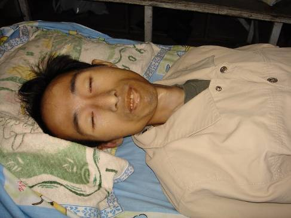</td>
</tr>  
<tr>
<td align="center">图8：雷明的两张照片，上：被迫害前；下：被监狱迫害至生命垂危，保外就医。</td>
</tr>
</tbody>
</table>

<b>魏修山 在监狱失踪</b>

魏修山，前面提到过，他是插播中的配角。他1999年因为上访被非法批劳教1年，在苇子沟劳教所时，拒绝认罪，拒穿劳教服，被恶警用电棍摧残，但他一直都没穿，连犯人都说：“真了不起，队长这么恶你都不怕，都拿你没办法。”

他给劳教犯们讲法轮功是咋回事，解开谎言的枷锁后，大家都知道法轮功好，好几个犯人说将来出去跟他学大法。他始终不屈服，被非法延期关押11个月，在解除劳教的鉴定上，他写道：“我出去后继续修炼法轮大法，证实大法是超常的科学，是能度人的好功法。”

2002年10月，他参与插播被冤判12年。在吉林监狱受尽酷刑，被折磨至生命垂危，2003年10月，送到医院后失踪。

<b>梁振兴 四个监狱轮番迫害</b>

故事的结尾，我们回到团队的主帅梁振兴身上。本系列的开头讲到：梁在插播的前几天被诱捕，在看守所里被刑讯逼供，他承受着酷刑，为团队争取着宝贵的时间。插播之后，警察发现梁振兴隐瞒了重大案件，不断地长时间提审他，每次他都是伤痕累累的被抬回来。

<table border="0" cellspacing="3" cellpadding="3">
<tbody>
<tr>
<td align="center">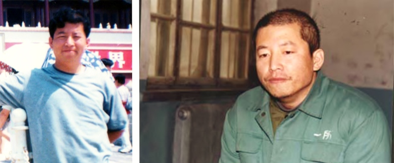</td>
</tr>
<td align="center">图9：梁振兴的两张照片，左：迫害前；右：在看守所（官网），头左部发迹上可见血污</td>
</tr>
</tbody>
</table>

在法庭上，他看到了他残缺的团队。通过大家互相鼓励的眼神，和法庭的质证，他才知道大家出色地完成了使命！这是令他最欣慰的。他和刘成军象在劳教所一样，当众揭露谎言，卫护正义，被身后的法警猛掐脖子，累得法警直换人。庭审后他又被殴打电击，后被抬回看守所。

2002年11月，被冤判19年的他，被押进吉林省第二监狱（俗称吉林监狱）。这个不见天日的监狱，对大法弟子的酷刑没有停过，如今已经至少整死20人，另有几十人致残、致疯。当时迫害梁振兴，六监区监区长魏向辉明确指示：“对法轮功人员决不能手软。”

毒打、电棍、老虎凳、抻床、死人床、关小号、插肋骨、弹眼睛、捏睾丸、指甲里钉大头针、烫烙……两年多酷刑用尽，实在没办法，人都快不行了，才转到别的监狱推卸责任。

<table border="0" cellspacing="3" cellpadding="3">
<tbody>
<tr>
<td align="center">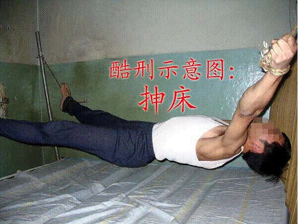</td>
</tr>
<tr>
<td align="center">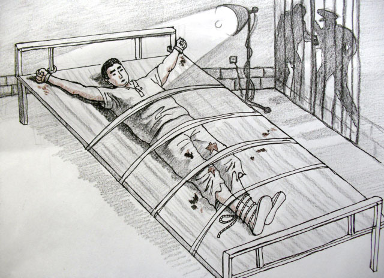</td>
</tr>  
<tr>
<td align="center">图10：酷刑抻床（上）和死人床（下）</td>
</tr>
</tbody>
</table>

2005年3月29日，他被转到长春铁北监狱。监狱惨绝人寰地迫害梁振兴，监狱里的法轮功学员纷纷起来抗议、声援。监狱害怕了，很快又给他转狱。

不管在哪里，任凭怎样折磨，他都给周围人讲真相。很多犯人同情他，敬佩他，监狱就安排最没有人性的犯人残害他。

2005年8月，他被转到最为凶残的四平石岭监狱。监区长尹首东、管教杨铁军、狱警武铁、张业军等伙同犯人，用8根电棍一齐电他，电得他全身满是焦糊斑，下体被电糊，一个乳头整个被电焦、脱落。2006年6月5日家属接见时，人们穿着短袖，梁振兴插着鼻饲管，穿着棉衣还说冷。他大哥想撩开棉衣看看，狱方匆匆将梁振兴架走。四平监狱快把他折磨死了，就又把他转走。临走时，他嘱咐那些折磨他的犯人们：“记住法轮大法好，祝你们有个幸福的未来。”很多人最终被感动了。

2010年元旦，他又被转到公主岭监狱。4月12日家属探视时，梁振兴骨瘦如柴，走路困难，声音沙哑。4月25日狱方通知家属去公主岭市中心医院，梁振兴在那里抢救，瘦骨嶙峋，右眼几乎失明，肺严重病变，脚肿的象馒头，痛苦得直咬牙……5月1日上午，铁骨铮铮的梁振兴停止了呼吸，年仅46岁。

对梁振兴的死，西人媒体这样报道：“带领发明网络信息自由才能的人死在了中国，他的死就像其他法轮功学员们一样，在历史的记录中留下了光辉的一页。”

遗憾的是，一直被封闭在监狱里的梁振兴，还不知道他和他的团队，开启、奠定了一个崭新的传播真相的时代。长春插播的巨大成功，撕开了中共谎言的铁幕，电视插播在多个地方兴起；同时，强大的宣传效果，最终促成了对互联网封锁的历史性突破——令中共金盾工程束手无策的破网软件诞生了！

<b>（九）生命换来的光明</b>

<b>不灭的真相之光</b>

暴政和迫害吓不倒真正的勇者，谎言和封锁挡不住真相的传播。长春的巨大成功之后，电视插播在封闭的大陆此起彼伏。

据自由亚洲电台报导：2002年9月6日19：15，甘肃白银市白银公司的有线电视插播了法轮功真相，持续15分钟，十万职工及家属都能看到；10月19日晚，在西南某市有线电视插播约2小时；2003年1月23日，东北某市某小区有线电视插播了“天安门自焚案真相”等内容，超过半小时。2003年8月，通过无线发射，华南地区大面积播放半个多小时，有数万民众收看到了真相……

<b>破网软件</b>

2010年1月，美国国务卿希拉里•克林顿发表演说，呼吁不管付出多大的代价也要促成国际互联网信息的自由。政府愿意拨款，去开发一个新的软件，能让公民们自由地发表意见。

只有一个群体做到了，而且早就做到了。美国《旗帜周刊》11月27 日报导，这个团体就是法轮功。他们开发的突破网络封锁的软件，不但风靡中国大陆，而且传遍伊朗，在伊朗大选消息被当局封锁的关头，破网软件成了伊朗人民向外传递信息的“救生索”。

破网软件这个创意，源于长春的3.05插播，梁振兴的团队突破了有线电视网络的封锁，出乎意料的巨大效果，推动了法轮功团体对互联网封锁的突破。

<b>为了民众的知情权</b>

美国记者伊森•葛特曼（Ethan Gutmann）这样写道：“全球互联网自由联盟”（Global Internet Freedom Consortium），这个主要由海外修炼法轮功的电脑工程师组成的群体，近年来开发出自由门、无界浏览和动态网等突破网络封锁的软件，帮助数以百万计的中国大陆民众绕过中共设立的防火墙，获得自由世界的资讯……所有这一切都是从长春这个城市开始，开始于一个叫梁振兴的人……尽管这个人从来没有得到过诺贝尔奖，但这位辞世的人是真实存在的。”

谎言扭曲了同胞们的良知，扭曲了人们的正义感，掀起了人们对“真善忍”信仰者仇恨——而真相化解了这一切，把知情权还给了民众。明白了真相的人们，都站在了正义的一边，奔走相告着真相的消息，甚至在长春3.05插播的次日，上万人自发到长春法院，去谴责中共，声援被审判的真相传播者——公道自在人心。

传播真相的正义之举，在任何一个正常的社会中，都是受到鼓励的。从插播电视，到建立起数十万个家庭真相资料点，中国大陆的真相遍地开花；在海外，从创办自由媒体，到开发出一代代突破网络封锁的软件，法轮功真相已经传遍全世界。如今，法轮功洪传世界百余国，逾1.5亿明白真相的中国同胞在海外大纪元网站上声明三退（脱离中共党、团、队组织），选择自由美好的未来，这正是人心所向，天象所趋。

避难到美国的张忠余，前面我们讲过的那位《兰台内外》杂志的副总编，如今感慨地说：“恐怖高压阻隔不断人们对真理的渴求，谎言与暴虐改变不了人心。尽管14年的血雨腥风使无数人身心受到摧残，令千万个家庭破碎，但自古以来，迫害正信者从来都没有成功过，中共在自毁中走向分崩离析，而法轮大法洪传世界一百多个国家和地区，给世界以希望与光明。”

突破封锁，还给大陆人以知情权，长春的法轮功学员，特别是插播团队，他们义薄云天，无私无畏的壮举，照亮了大陆这段最黑暗的历史。为争取新闻自由、言论自由、信仰自由，为最基本的知情权，中国乃至全世界的法轮功学员们，做出了巨大的付出。

（全文完）

<b>更多</b>

<h1 align="center"><b><a href="https://github.com/gofanben/gm/blob/master/mp4/tambg2.mp4?raw=true">追查报告举证中共 “天安门自焚” 伪案</a></b></h1>

<table border="0" cellspacing="3" cellpadding="3">
<tbody>
<tr>
<td align="center"></td>
</tr>
<tr>
<td align="center"><a href="https://github.com/gofanben/gm/blob/master/mp4/tambg2.mp4?raw=true">“追查迫害法轮功国际组织 ”近期发布“天安门自焚”追查报告。图为追查国际图标。（追查国际）</a></td>
</tr>
</tbody>
</table>

【大纪元2017年09月27日讯】 “追查迫害法轮功国际组织 ”近期发布“天安门自焚”追查报告，列四大证据举证，2001年1月23日在北京天安门广场发生的“自焚”事件，是中共策划的构陷法轮功的骗局。

以下是追查国际的四大证据解析：

<b>证据之一，语音鉴定央视节目中的 “王进东” 前后不是同一个人</b>

  
2003年3月12日，追查国际委托台湾大学中国语语音实验室，对3集中共中央电视台的《焦点访谈》节目中连续出现的人物——王进东做语音检验鉴定。发现，在天安门广场喊话的自焚主要成员“王进东”的声音，与最后在劳教所接受记者采访的“王进东”的声音，不是同一个人。也就是说王进东至少是由两个人扮演的。

 

根据这一证据推断，这次事件导演的思路可能是，开始出场的人形象是正常的，最后接受记者采访的人是外貌有烧伤后遗症的。

这样表面上似乎是合理的安排，却忽略了声音是不会因为体表烧伤而改变的。人的声音具有和指纹一样的特征性，声音的这个鉴定结果就确定了此案造假的性质。

<b>证据之二，“自焚”人员在天安门到积水潭医院的护送途中涉嫌被调换</b>

根据新华社2001年1月30日对“自焚事件”的报导，2001年1月23日14时41分在天安门广场发生“自焚”，事件发生后不到7分钟，三辆急救车就赶到现场，自焚者在下午3点之前被枪救脱离现场送往积水潭医院。按理说天安门到积水潭医院大约十公里的宽阔通敞的道路，当天又没有交通堵塞的报导，有警车开道的急救车只需二十分钟左右就可送到。

可是，追查国际调查该院医护人员得知，他们是在大约晚上5点多才被送到医院。那么，从下午3点到晚上5点多，期间约有2个小时的时间，急救车去向不明，涉嫌“自焚”人员被调包。

这2小时时间差，就可以解释自焚成员王进东为何前后不是同一个人。很可能，“王进东”就在那期间被调换为外貌有烧伤后遗症的人，只是面上是用厚厚的沙布覆盖了。

<b>证据之三，“准备出院的刘思影突然死亡 死因可疑”</b>

追查国际通过可靠渠道从积水潭医院参与治疗“自焚”人员的医务人员处得知，参与自焚的成员之一，十二岁的刘思影，在2001年3月17日，身体恢复健康出院的当天上午，北京市医政处处长和医院负责人到刘思影病房探视，与刘思影说了很多话，“刘思影当时还活蹦乱跳的”。可是，当他们离开后，大约两小时，医生突然发现刘思影已进入病危，并迅速死亡。而死亡前1天刘思影的心肌酶谱和其他各项检查还均为正常。涉嫌刘思影被谋杀灭口。

<b>证据之四，刘春玲涉嫌是在“自焚”现场被打死</b>

从中央电视台《焦点访谈》节目中关于自焚现场录像的慢镜头可以看到，刘春玲被一穿军大衣的男子用重物击倒。而且，这个物件在打击刘春玲头部的时候，一条形物体被打飞了，从头上部飞过去了。因此刘春玲极有可能是在现场被打死灭口，而不是被烧死。

从整个事件的设计看，刘春玲、刘思影，这母女注定是要死的。这样一场恶性事件和它以后要发挥的作用，不死人就不像了。而且，还要能极大地挑起民众的同情和愤怒。这对母女，尤其是一个未成年的小女孩就是极好的人选。可是，这对母女又是最难控制的人，特别是不懂世事的小女孩面对复杂的社会状况，很难保证她不泄密。所以，安排她们死就是可以理解的了。

此外，一个突发的自焚事件，又是在最敏感、戒备森严的天安门广场，一定是秘密进行的。而且，只烧了1-2分钟。可是，中央电视全程录像报导，远镜头、近镜头、特写镜头，拍得那么清楚完整！？很多警察拿着灭火毯、灭火器都在现场同步灭火。这样多方面，全方位临时合作成功急救，没有事先安排，可能吗？！

“追查国际”表示，综合上述证据，“天安门自焚”事件，是江泽民中共当局策划的一场构陷法轮功的犯罪行为。#

文字整理：叶枫，责任编辑：高静

<h1 align="center"><b>看清自焚骗局　我走入大法修炼</b></h1>

文: 大陆大法弟子

  
【明慧网二零一七年七月二十八日】

  
<b>缘归大法</b>

高中时，一位历史老师在课堂上批判法轮功，他最后说：法轮功是信“真、善、忍”的，还把三个大字写在了黑板上。我心里一震：真、善、忍是好的呀，他怎么会批判呢？那一次，我记住了法轮功和“真、善、忍”。

一九九九年以前，我从未见过法轮功学员，后来又看到电视上反复播“天安门自焚”的新闻，我觉的这是政治吧，挺恐怖的，与自己好象也没什么关系。

有一次，我和丈夫得到一张法轮功学员散发的光盘，看后明白了，原来“天安门自焚”是政府导演造假嫁祸给法轮功的，有很多存在明显破绽的镜头被慢放、分析、揭露出来了。我觉的这件事的邪恶超出了想象，很气愤，政府为什么要造假陷害好人呢？如此下去国家还有希望吗？

我丈夫是一个善良、有正义感的人，一直厌恶共产党整人、造假那一套，他告诉我，共产党反对的东西，很多都是好的，历史上文化大革命、“六四”北京天安门屠杀学生都是这样，共产党既然反对法轮功，那他就要了解法轮功到底是什么。

二零零七年，我们从明慧网请到了李洪志师父的著作《转法轮》一书，并观看了师父的讲法录像，走入法轮大法的修炼中。我觉的师父讲得太好了，解答了人生中许许多多的疑惑，就是我一直在寻找的佛法真理。

<b>修炼前后的变化</b>

我以前体弱多病，严重痛经，年纪轻轻就特别怕冷，冬天要睡电热毯，因为肾不好而导致脸和眼睛水肿，同事开玩笑说我像“林黛玉”，风都吹得倒。我丈夫以前有偏头痛、高血压，经常失眠。我和丈夫修炼法轮大法快十年了，以前的疾病都好了，身体越来越好，脸色白里透红，人显得年轻，我丈夫甚至看上去比实际年龄小十岁。

我和丈夫曾因信仰法轮大法而遭受共产党的迫害，被迫失去工作、非法关押、酷刑折磨，我们坚信法轮功教人按真、善、忍做好人没有错、向世人讲清真相反迫害没有错。也有人劝我坚持信仰而吃苦“不值得”，后来几乎没有这样说的了，更多的人表现出对法轮功学员经历魔难依然坚信真理的佩服。我和丈夫现在家庭和睦，身心健康，都有不错的工作，家人中也有不少人明白了真相，支持我们修炼，朋友中也有向我们借阅法轮功书籍的。

师父在《转法轮》中讲：“人人都有一份工作，而且还要干好工作”。我悟到，在工作中接触常人社会，可以修炼自己的心，向世人证实大法的美好。我现在的工作单位中，老板和很多同事都明白了真相，知道法轮功是教人做好人的佛家功法，共产党在迫害好人，对我的工作表现和人品很认可。修炼法轮大法后，我感到智慧越来越多，工作能力提升得更快，特别是写东西的灵感源源不绝，别人看了还觉的好、能获得正的启悟，这些都是修炼法轮大法后的真实受益。

我以前对传统文化了解很少，比较自私。通过学法轮大法使我明白了妒嫉、争斗、贪欲等等执著心，从根本上都是私心，修炼就是修去私心、提高道德的过程，是内心实实在在的净化和升华。在这个过程中，我渐渐体悟到放下执著的轻松快乐，感受到内心的充实和平静。感恩师父让我们走入修炼，这条工作中证实大法的修炼之路是师父给我们开创的，我一定要走稳、走好，让更多世人明白真相，有一个好的未来。

共产党通过历次政治运动破坏了中国传统文化，使社会道德下滑，特别是年轻一代在对待两性关系上比较随意轻浮。我同许多八零后、九零后的人一样，不明白古人讲的“万恶淫为首”是什么意思。修炼法轮大法后，我意识到问题的严重，色欲使人造业甚多，还败坏着社会的道德伦理。我更明白了洁身自好做人的重要性，作为一个真正有决心提升道德的人，这一点是必须要做到的。回想当初做人的轻浮不堪，我感恩修炼了法轮大法，感恩师父从肮脏的泥潭中将我捞起、渐渐洗净。

现在我和丈夫夫妻关系和睦、稳固，能够彼此尊重对方，真诚坦荡，遇事多为对方着想，别人担心的家庭问题，在我们家里都没有。在亲朋好友们看来，家庭关系是值得羡慕的。

<b>婆罗花开送福音</b>

感恩慈悲伟大的师父，让我们走入法轮大法的修炼中，身心健康，实实在在的提高心性，成为对家庭和社会都有益的人。感谢冒着危险为世人讲真相的同修，十几年来，他们顶着巨大的压力证实大法的美好和师父的清白，苦口婆心的让被谎言毒害的人们能听到佛法的福音，才让我和丈夫有缘修炼大法。这样的大善之举不是一般人能做得出来的，是在法轮佛法中修炼出的慈悲心。

修炼法轮大法后不久，我家的阳台上开放了圣洁的优昙婆罗花。记得《西游记》中有这样一句话：“夫人身难得，中土难生，正法难遇：全此三者，幸莫大焉！ ”在红尘的迷茫中找寻，今生能幸遇师父、缘归大法，是我最大的幸福。

如今法轮大法已洪传全世界一百多个国家和地区，法轮功书籍被翻译成近四十种语言在全球出版发行，吸引不同文化背景、不同肤色的人走入修炼，使无数有缘者受益。善良的朋友，希望你能珍惜宝贵机缘去了解法轮大法的真相，退出党、团、队组织，使自己和家人都得到佛法的福佑！

<h1 align="center"><b>《江澤民其人》 （120） 《江澤民其人》：天安門「自焚」偽案</b></h1>

<table border="0" cellspacing="3" cellpadding="3">
<tbody>
<tr>
<td align="center">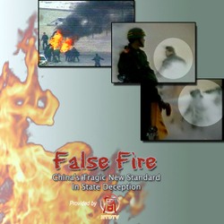</td>
</tr>
<tr>
<td align="center">2001年1月23日，正是中國農曆的大年三十，江澤民、羅干等人導演「天安門自焚」事件。不久，一本十年前出版的暢銷小說《黃禍》在中國遭到查禁，小說第二章中有一個情節是有人買通絕症患者「自焚」，以達到栽贓他人併進行政治迫害的目的。此次天安門「自焚」與《黃禍》的這個情節驚人相似。很顯然，小說被查禁顯示其中存在某種不可告人的陰謀。揭露「天安門自焚」真相的影片《偽火》獲得第51屆哥倫布國際電影電視節榮譽獎，該紀錄片揭開了「自焚案」部分漏洞。（大紀元資料圖片）</td>
</tr>
</tbody>
</table>

【大紀元2015年05月30日訊】《江澤民其人》第十七章：三個代表自吹自擂 自焚偽案黑幕驚天（2000、2001年）

<b>2.天安門「自焚」案</b>
（4）

<b>蹊蹺的「自焚」案</b>

公元2001年1月23日，正是中國農曆的大年三十，正當千家萬戶忙著掛燈籠、貼春聯，歡歡喜喜迎接新世紀第一個春節的時候，北京的「心臟」天安門廣場突然濃煙四起，烈火熊熊，上演了一出震驚中外、史無前例的火燒活人的大慘劇。來自河南的一男四女在身上澆上汽油，要慘烈地自焚而死。

火點起來一分鐘之內，一名女子當場死亡，其餘四人身上的烈火在「一分半」之內被盡數撲滅，然後警車「風馳電掣般」將被嚴重燒傷的四人送往「急救中心」……兩個小時之內，新華社即向全世界發佈英文消息，稱五名「法輪功練習者」在天安門「自焚」。

<table border="0" cellspacing="3" cellpadding="3">
<tbody>
<tr>
<td align="center">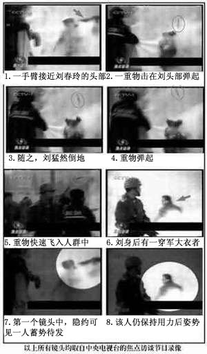</td>
</tr>
<tr>
<td align="center">央視天安門自焚鏡頭的慢動作重放證實劉春玲是被惡警打死。天安門自焚是中共策劃的一場騙局。（明慧網）</td>
</tr>
</tbody>
</table>

很快中央電視台就出現了12歲的懵懂女童，19歲的花樣少女，聽信「妖言」，在「愚昧」的「邪火」中「點燃自己」，為了「昇天」而被燒成了黑炭、滿臉燎泡的女童痛苦地一聲聲喊著「媽媽」，躺在醫院的病床上還伸著被燒得黑漆漆的小手念念不忘要去「天國」……

如此悲慘和荒謬的鏡頭一經播出，把民眾的憤怒情緒挑動到了不可控制的地步，很多人把自己以前看到的法輪功的神奇和法輪功學員做的好事全都忘記了。好像政府的說辭比自己親眼所見、親耳所聞還可靠。已經相對沉寂了一段時間的官方宣傳機器像吃了搖頭丸一樣，興奮地再次全力開動，各色各樣的人爭先恐後地在電視裡義憤填膺地「聲討」法輪功，為了達到最佳效果，央視還時不時插上一兩個觸目驚心的「自焚」恐怖鏡頭……

看到這一切，江澤民長長舒了一口氣，緊鎖的眉頭終於打開了。江緊接著指示輿論一定要跟上，要趁熱打鐵。

在江澤民的親自命令下，全國大小媒體掀起新一輪批判高潮。從1月31日開始的四天內，新華社和中新社的網絡版分別就有107篇和64篇批判及聲討法輪功的文章，超過14個省市自治區的「各界群眾」紛紛出來譴責法輪功。除了黨政軍各級領導、各「人民團體」都要表態支持中央的「英明決策」以外，各個基層組織也要召開大小揭批會議，聲討「邪教組織的滔天罪行」。中央電視台每天還要播放各界人士的隨機訪談，並反覆重播，一定要做到家喻戶曉，人人皆知，使民眾對法輪功的仇恨扎上根。

<b>疑點重重</b>

與此同時，海外多家媒體以及法輪功網站卻從「自焚」事件發生的第一天就開始質疑整個事件。

慢鏡頭清楚表明當場死亡的劉春玲是在現場被警察用重物擊打致死。流傳廣泛的電視片《是自焚還是騙局？》是對中央電視台自焚錄像的慢鏡頭分析，新唐人電視台據此製作的記錄片《偽火》獲第51屆哥倫布國際電影電視節榮譽獎（2002年1月製作）。法輪功學員還多次在大陸插播真相片《是自焚還是騙局？》，江澤民對此異常恐懼，全力封殺。2002年3月5日晚長春法輪功學員在8個有線電視頻道插播45分鐘真相節目後，庫恩在《江澤民傳》中說江澤民是「10分鐘」後就立即作出強烈反應。

記錄片《是自焚還是騙局？》分析道：

「如果慢鏡頭分析中央電視台的錄像，發現自焚中的劉春玲，不是被燒死，而是在現場被打死。

新華社說劉春玲自焚死亡。如果把鏡頭放慢，可以看見當劉春玲正在火焰中掙扎時，有人用物體猛擊她的頭部，劉春玲隨即倒地，一條狀物快速彈起，從死者腦後飛出數米遠，又以極快的速度從空中落下。那麼誰是兇手呢？如果把那一時刻鏡頭止住，可以看見揮動的手臂接近劉春玲的頭部，穿著軍衣的武警正走向鏡頭前面，在他身後，一名身穿大衣的男子正好站在出手打擊的方位，仍然保持著一秒鐘前用力的姿勢。

劉春玲腦後飛起來的條狀物，有人說是打人的兇器，有人說是劉春玲的頭髮，有人說是劉春玲的衣物。但是，不管是甚麼，這件物體不是順著強大的滅火劑氣流方向飛出，而是騰空而起，逆向朝著拿滅火器的警察飛去。說明這個物體不是滅火器衝下來的，而是重物擊打腦部所致。而且，飛起的條狀物被打得彎曲，可見出手打擊的力量之大，下手之狠。甚至我們還可以看到，劉春玲在倒地之時，左手不自覺地抬起來觸摸被打擊的部位。」

十二天以後，美國著名的《華盛頓郵報》在頭版發表報導《自焚的火焰照亮了中國的黑幕──當眾自焚的動機乃為加強對法輪功的鬥爭》，報導公佈了郵報記者去劉春玲生前所在城市河南開封調查的結果﹕從來沒人見到劉春玲練過法輪功。

中央電視台的自焚錄像充滿了破綻，更多的疑點還包括：

1）天安門廣場並沒有滅火器，警察也從不背著滅火器巡邏，怎麼可能在幾分鐘之內備齊十幾個滅火器及滅火毯？

2）王進東喊口號的聲音錄製效果清晰響亮，拍攝距離當在十米之內。除非事發前攝像機已經到位，並已處於待機狀態，否則不可能在短短一分鐘內搶拍下滅火過程。

3）「自焚」中嚴重燒傷的12歲的小女孩劉思影，因為呼吸道吸入性損傷做了氣管切開術。但隨後的畫面中，劉思影卻接受中央電視台「焦點訪談」記者採訪並正常說話，甚至在新華社記者面前能唱歌。

4）在「焦點訪談」節目中，在天安門呼喊不倫不類口號的王進東兩腿中間還放著盛汽油的塑料瓶。從節目畫面中看，王進東的衣服和兩膝蓋處的褲子已經被火燒破，但是他兩腿中間盛汽油的塑料瓶卻在高溫和火焰下竟然沒有任何的變形或損壞。如此明顯的破綻，不能不令人懷疑這一切都是在演戲。

果然，當央視「焦點訪談」負責採訪的女記者李玉強事後在團河勞教所採訪時，被非法關押的法輪功學員趙明質疑雪碧瓶的破綻，她毫不掩飾地解釋了那個不可思議的現象：「那是我們補拍的鏡頭，如果知道露餡兒就不放那個鏡頭了。」為何要補拍鏡頭，王進東為何全力配合？中間顯然有某種預謀。

2001年8月14日，國際教育發展組織在聯合國會議上發表正式聲明：「中共當局企圖以今年1月23日天安門廣場上的自焚事件為證據來誣陷法輪功。然而，我們得到一份自焚事件的錄像分析卻表明，整個事件是由政府一手導演的。我們現有該錄像的拷貝，有興趣者可來領取。」

這份聲明公佈後，參加聯合國會議的中共代表團噤若寒蟬，連抵賴的機會都放棄了。

不久，一本十年前出版的暢銷小說《黃禍》在中國遭到查禁，小說第二章中有一個情節是有人買通絕症患者「自焚」，以達到栽贓他人併進行政治迫害的目的。此次天安門「自焚」與《黃禍》的這個情節驚人相似。很顯然，小說被查禁顯示其中存在某種不可告人的陰謀。

在這場「自焚」驚天大案中，受害者不僅僅是「自焚」偽案的參與者，也包括億萬中國民眾。這場惡毒陰謀的策劃者江澤民，用毀滅活生生的人的生命為代價，欺騙了無數人，把對法輪功的仇恨播入人們的心中，為對法輪功大開殺戒而舖平道路。使用現代化的宣傳工具，在億萬人眾目睽睽之下造假欺騙，進行這樣大規模的煽動仇恨，江澤民又創造了一個恥辱的「歷史記錄」。

然而，江的一切都是建立在謊言欺騙的基礎之上，所以當人們從情緒激憤中冷靜下來，當人們從傳播中的一份份真相材料中看到事實的時候，埋葬江的正是他自己對人民的欺騙。

江澤民很清楚，這一真相一旦曝光於民眾，則自己陰險、惡毒、殘暴、狡詐的嘴臉馬上暴露無遺，再沒有比這更令其感到恐懼的了，所以江極力封鎖這一真相，「天安門自焚事件」成了江最為恐懼、最怕曝光的事件之一。

江精心策劃的「殺手鑭」反而成了對他最致命的定時炸彈，這也許正應了那句古話，「人算不如天算」。

（版權歸大紀元所有，歡迎轉載，不得更改）

責任編輯：肖笙

<h1 align="center"><b>用“自焚”栽赃法轮功　办案警察恶报连连</b></h1>

文: 大陆法轮功学员

  
【明慧网二零一五年五月二日】自从二零零一年中共央视抛出“自焚伪案”后，中国各地的地方官员，不遗余力的将当地发生的“自焚”栽赃到法轮功学员的身上，一则推卸责任，二则欺骗百姓。

  
大连普兰店公安局就做过此类栽赃诬陷法轮功的事，当时的办案警察遭恶报，至今还住在医院里承受着病痛的折磨。

二零零一年后，普兰店市房屋搬迁重建，老居民都面临着政府给予的搬迁通知，既然搬迁，老百姓都希望政府能给予他们充分的经济补偿，毕竟他们离开的是自己居住了半辈子的房子。有的给予的条件优越同意搬迁，而有的人给予的经济补偿就不是很乐观。其中的一户人家可以说是个“钉子户”了，政府相关人员跟他接洽也没有达到他的满意，政府人员就准备将他的家强拆。就这样他上告无门，有一天他听说政府相关人等在普兰店台山。他去了后正赶上普兰店政府人员还没有撤离，他就带着助燃设备跑到一个楼顶，说如果不答应他的搬迁补偿条件而强拆的话，他就要在这个楼顶上自焚！当时的一个普兰店检察院的女检察官大声说：“有本事那你就烧啊！”大家本以为他也就是吓唬人，没想到此人听了以后，还真就点起火，被活生生烧死。

当时这件事情在普兰店影响很大，可曾想这桩政府和百姓的经济纠纷案件，却让普兰店公安局的某些人动了歪脑筋，找来了当时任职普兰店丰荣派出所时年三十多岁的崔开斌，来办理此案，并内部命令让他将这件自焚事件栽赃到法轮功身上。更对许诺崔开斌这件事情办成了，就给予他亲属一套住房和不菲的金钱。崔开斌为了经济利益，丧失了良知和理智，整个事件经由他诬陷编造后，成了又一类栽赃法轮功的“自焚”伪案，此伪案被大连相关报纸正式报道，散毒之广，当时有普兰店人出差到南方都看到了这个伪案的报道。

崔开斌侦办此案，昧着良心的所作所为，为他埋下了恶报的种子。不长时间，他老婆与他离婚，带着儿子离开了他。随后，他就整天的目光呆滞，到后来不跟人接触。听说去过他家的人都说，他家里肮脏不堪，以致到后来行动不便不能自理，于二零一四年十一月份被送入医院，至今还住在医院里承受着痛苦。

<h1 align="center"><b>没有游人的“天安门自焚”</b></h1>

文: 中国大陆人

  
【明慧网二零一四年十月八日】二零一四年“十一”长假期间朋友相聚，大家说起了“天安门自焚”的穿帮事。

  
A：电视一演我就知道是假的。

B：你当自己是亨特（神探的名字）呀，一下就识破了？

A：别忘了，看热闹是中国人的通病。哪儿出事人们都会围着看，比警察都多。那些人自焚时，周围除了警察就是军人，咋就没有游人呢？

大家都说A无愧于“智多星”的称号，立刻破案。我们都是了解了法轮功真相后，才知道“天安门自焚”是假的，是中共演的杀人戏。

<h1 align="center"><b>北京戒严了　谁能去天安门自焚？</b></h1>

文: 大陆大法弟子

【明慧网二零一四年一月十日】二零零一年一月江泽民一手导演的天安门自焚骗局，十几年来已经被曝光得体无完肤，今天被邪党豢养了这么多年的陈光标在纽约抛出来造谣。可见这是邪党早就预谋好了的。陈光标纽约重提自焚伪案，这是中共邪党又一次自己打自己的嘴巴。

  
记得那是二零零一年一月二十三日，传统大年三十早上六点我坐火车去北京，本打算去天安门，当火车走到一半路时，也就是上午九点钟左右，有三个警察来到我坐的那节车厢，因为是年三十，车上没几个人，他们一眼就看到了我，问我去哪，我说去北京，让我把车票拿出来，我把车票给了他们，其中一人说，一看就是炼法轮功的。他说，赶快回去吧，现在北京戒严了，你去都下不了车就得被抓起来。也给我们找麻烦。说着，就叫来两个女列车员，连拉带推把我拉下车，正好返回承德的火车进站，就把我推上了去承德的火车。把我拉回了承德。

我到承德的时间是中午十二点多钟。下午两点天安门有人自焚了。北京戒严，承德的警察怎么知道？而且还在路上拦截法轮功学员上访，是事先通知的吗？整个北京都戒严了，那天安门会不戒严？怎么还能让人去点火自焚呢？！不难看出，是邪党自己要搞自焚栽赃法轮功，才戒严的。上午戒严，下午就自焚。谁都明白是谁搞的。太可笑了。

现在大陆大多数被中共利用参与迫害过法轮功的警察都在逐渐明白真相，不再为邪党迫害法轮功了，而且好多人都退出邪党组织。邪党已看到它的末日到了，还不死心，就又抛出了陈光标。好吧，我们反过来利用这个事件，让还没有明白真相的人赶快明白真相。

<h1 align="center"><b>法轮功禁止杀生和自杀</b></h1>

【明慧网二零一四年一月七日】（明慧评论员文章）法轮功是上乘佛家修炼大法，明文禁止杀生和自杀。任何以自杀、杀生行为诬陷、诋毁法轮功的人，都不敢让人系统地、不带任何观念地、静心地阅读法轮功原著，特别是《转法轮》一书，也不敢让人亲身体验法轮功的功法，因为坏人也知道：很多人都是有良知的，看见真相就不愿再相信谎言。

  
为了各位的前程，希望大家都来看《是自焚还是骗局》这个十三分钟的录像短片，即便是在百忙之中，很值得看，不看以后可能会非常遗憾！如果能静心通读《转法轮》一书，就更好。

中共就是中共，本性绝不会改变，就如同狼绝不会变成狗或者羊。十三年前的“天安门自焚”骗局虽然早已被揭穿，但命令烧书、禁书的那些中共罪人，总是在寻找欺骗更多人的机会，想多拉一些人陪绑，其中包括海外出于各种目的想和中共走近的人，并借此延缓中共被治罪的那一天的到来。

历史上对正信的迫害从来就没有成功过，现在中共对法轮功“真善忍”真理的迫害更是从一开始就注定了失败。从1999年7月至2014年1月，这场对法轮功的政治迫害已持续十五年了，法轮功学员在中国大陆和平、理性的反迫害言行，通过海外明慧网对迫害黑幕的揭露，也持续十五年了，迫害行为赖以藏身的主要场所——劳教所已经解体，迫害走入末路之末。在这种情况下，又有人到海外拿自焚骗局作招牌，象开假面舞会似的演戏，这一次，目的是骗谁呢？

自焚真相是本世纪重大信息。知道才能心明眼亮，明白才有未来、有光明、有希望。

相关历史概要：

1）法轮功是佛家上乘修炼大法，以《转法轮》一书教人按“真善忍”做好人、提高道德境界，并辅以五套动作优美缓慢的功法。从1992年5月公开传出，至1999年7月，短短七年间，学炼法轮功的人数已高达一亿；因祛病健身、回升社会道德的显著功效，法轮功在中国的声誉家喻户晓。

2）1999年6月，中共专门为迫害法轮功而成立了权力凌驾于公检法之上的“610办公室”。

3）1999年7月，中共首恶江泽民、罗干出于妒嫉和个人利益，发动了对法轮功的全面迫害。但当时，中国大陆有太多的人都经历过“文化大革命”，也都知道法轮功的功效，所以对这场政治迫害不以为然，对政府发动的“百万签名声讨法轮功”等活动消极对待。同时，大批法轮功学员自发地走向北京信访办、天安门广场，为法轮功说公道话。

4）江泽民发布的密令中，最臭名昭著的是对法轮功“名誉上搞臭，经济上截断，肉体上消灭”、“往死里打，打死算自杀”、“打死不查身源，直接火化”。

5）为维持和广泛推动这场迫害法轮功运动，2001年1月23日，江泽民、罗干之流，在天安门广场推出了一场自导自演的自焚事件，并动用全中国的媒体，用这场伤天害理、残害生命的黑戏，嫁祸法轮功。

6）“天安门自焚”骗局推出一周后，人们疑问重重。于是中共操控中央电视台，推出了一个以自焚为题的“焦点访谈”节目，攻击法轮功。然而通过对“焦点访谈”的录像进行慢镜头播放和分析，人们却发现了更多的漏洞。比如，在这场事件中当场失去性命的刘春玲，不象被焚烧致死，而是被突然来自脑后的重物击打致死，而神秘的击打者是军警模样。中央电视台的自焚画面中还有王进东的现场大特写，一名警察站在他的身边，拿着灭火毯，悠闲地等着王进东喊口号，然后机械地把灭火毯盖在王的头上。“王进东”浑身衣服被烧得七零八落，可是他两腿中间装汽油的绿色塑料雪碧瓶却完好无损。

7）法轮功是佛法修炼，禁止杀生和自杀。1995年出版的法轮功主要著作《转法轮》〈第七讲〉中专门有“杀生问题”一节，其中写道：“杀生这个问题很敏感，对炼功人来说，我们要求也比较严格，炼功人不能杀生。”1996年法轮功创始人李洪志先生在《悉尼法会讲法》时，当有弟子问，“杀生是一种很大的罪业，一个人他自杀算不算罪呢？”李先生回答：“算罪。……所以自杀是有罪的。”

8）尽管江罗监制的自焚事件漏洞百出，但想在政治上捞票的人，常年将此伪案和骗人用的“标准答案”塞入中国大陆中小学校的教科书、考试题、招工表格，从儿童、青少年学生做起，制造对法轮功的恐惧和仇恨。

<h1 align="center"><b>李玉强——自焚骗局背后的鬼魅</b></h1>

文: 了然

【明慧网二零一四年一月十五日】江泽民为规避法律，逃脱制裁，在对法轮功制定迫害政策时就有这么一条：“一般不发红头文件，只密码电传或口头传达，不署名，一概说是‘中央批示’”。所以，那些参与迫害的上层官员平时表现得非常低调，连他们担任的迫害法轮功的职务都不在公开报道中提及。

  
例如最近被中共抛出的李东生，过去提到他的职务就是宣传部副部长、中央电视台副台长或公安部副部长。而他主要担任的迫害法轮功的“610”办公室副主任、主任及中共中央处理法轮功问题领导小组副组长的职务就鲜少提及。同样，对于炮制的构陷法轮功的伪案中所牵扯到的恶徒，中共也是能隐藏就隐藏，能掩盖就掩盖，能不让露面就不让露面，其目的除规避法律逃脱制裁外，还有更重要的一点，就是避免民众对这些参与者直接进行质疑。

中共炮制天安门自焚伪案后，在央视的“焦点访谈”节目中有一个系列性的报道。在有关自焚的所有的采访报道中只有一个叫“李玉强”的女记者。按照常理，这么大的震惊世界的案件应该有一些著名的记者出面担纲报道才是。可是这个“李玉强”，是一个随着自焚的发生而现身的人物。自焚前，没有人知道她的身份和她的姓名；自焚后，她的名号虽为外界所知，但是关于这个女人的所有视频与图像，从来没有正面显露过，电视中的所有镜头都是利用侧面或背景来代替，民众对她是只闻其声未见其面。她的神秘直到今天都没有人能揭开。可见中共对罪恶的包裹是如何的处心积虑！

李玉强究竟何许人也？自焚前名不见经传；自焚后的十年间，连中央电视台的工作人员中，竟然都没有人知道她。中央电视台一名工作人员向海外媒体披露李玉强的情况时说：“其实她不是编制内的，我们也不知道她打哪来。其实她做的那些节目，我们内部的很多人也都不喜欢，都想躲她远些，怕沾上晦气。她自己都不露脸儿，平时都鬼鬼祟祟的。”

其他的工作人员也分别表示：“她是上头派来的，我们也管不着”，“她属于610直接管的”，“她专做这种（诽谤）法轮功的节目”，“我们也不知道她的去向”，“我们联系不到她”……更多的央视人员表示，根本不认识她，不知道她的来历。

这不奇怪吗？报道中说她是央视的记者，可是央视竟然无人知道她，你说她有多神秘！这非常明确的说明：“610”炮制天安门自焚伪案之前，对所涉及到的一切都作了精细的部署。

但是，在央视也不是说所有的人都不知道她，李东生应该非常了解她。因为李东生当时任中央电视台副台长，而且还是中共中央“610”办公室副主任，是江泽民集团迫害法轮功主抓宣传的重要头目，所有在央视播放的构陷法轮功的节目应该都得经过他的审批。李东生很可能就是李玉强最直接的顶头上司。

炮制天安门自焚伪案这样的惊天大案，任何一个政府部门都不可能单独完成。它涉及到情报、公安、卫生、宣传、外交等诸多部门，但就公安部门来讲，就涉及国保、国安、特警、交警与天安门执勤的警察等。能将这一切统筹在一起进行操控的只有迫害法轮功的“610”，因为在迫害法轮功之初，江泽民就赋予了“610”凌驾于法律与政府之上的一切权力。中共中央“610”不管是谁主使炮制了这桩伪案，都少不了在中央“610”办公室内主抓宣传的副主任、又时任广播电影电视总局副局长的李东生。李东生在这之前担任过中共电视台副台长，主抓的就是“焦点访谈”。他本人就是靠在央视创办焦点访谈起家的。

二零零二年初，李玉强曾在河北省会“法制教育培训中心”，和被非法关押的法轮功学员进行过所谓的“座谈”。当时有法轮功学员问她自焚镜头的种种疑点和漏洞，尤其是已烧得焦黑的王进东，两腿间夹的盛汽油的雪碧瓶子却完好无损的漏洞。面对大家有理有据的分析，李玉强不得不承认：王进东腿中间的雪碧瓶子是他们后放进去的，此镜头是他们“补拍”的。这也充分说明，李玉强不只在自焚后对自焚者进行了采访，而且在自焚时，她本人就在现场。也就是说，李玉强全程参与了自焚伪案的炮制，并且随后又制作了诬陷法轮功的系列访谈。

一个不为央视工作人员所知的女人能对外打着央视记者的名义进行采访并在央视进行系列报道，谁有这样的权力？看来只有在“610”内掌管宣传的头面人物，又对央视非常熟悉的李东生能做出这种邪恶而周到的安排。

向来低调的李东生被抛了出来，而且将他十多年来最大的罪恶职务也一并抛出。李东生在迫害法轮功的十四年中，尽管他的职务能从宣传部门调到公安部门，可是这样的变动又完全是以他“610”办公室主任的身份而进行的调整。李东生被宣布的罪名是“严重违法违纪”，这当然包括他担任“610”办公室副主任、主任职务时所犯下的一切罪恶。审理李东生的违法违纪，必定少不了他参与炮制的天安门自焚伪案。届时，李玉强的本来面目必将大白于天下。

<h1 align="center"><b>为自焚者开的绿灯为何如此诡异？</b></h1>

文: 他山

  
【明慧网二零一四年一月十四日】为中共江泽民集团站台的大陆商人陈光标，在大陆大肆炒作一番之后跑到美国，宣称要收购美国《纽约时报》。尽管是痴人说梦，仍然于二零一四年一月七日在纽约举办了所谓的“新闻发布会”。而发布会的主题则变成了他重新炒作十三年前的天安门自焚案，声称要为自焚者郝惠君和陈果母女捐款整容。其“挂羊头卖狗肉”之举，令舆论大哗。

  
众所周知，“天安门自焚”是由中共江泽民集团导演的一场栽赃法轮功的闹剧。二零零一年八月十四日，“国际教育发展组织”就在联合国会议上，就“天安门自焚事件”强烈谴责中共当局的“国家恐怖主义行径”，指责中共对法轮功的构陷，涉及惊人的阴谋与谋杀。声明指出：录影分析表明，整个事件是“政府一手导演的”。中共代表在证据面前，无词以对，尴尬狼狈。依据中共发布的自焚录像制作的电影《伪火》荣获了第五十一届哥伦布国际电影电视节荣誉奖。可以说在国际上，天安门自焚已经被公认是中共栽赃法轮功的一桩伪案。

面对国际舆论的谴责，毫无道德底线的中共却仍然在国内坚持着它的谎言。中共不但封锁外界关于天安门自焚伪案的任何资讯，还将参与自焚者软禁起来，完全与世隔绝。二零零五年一月二十四日明慧网披露：“陈果母女一起被软禁在开封市北郊福利院中，有一名叫展金贵的开封市公安局退休警察，负责对陈果母女的禁卫。公安人员常年二十四小时值班，她俩不得与任何外人接触。”

在如此严密监禁的情况下，陈光标是怎样将郝惠君、陈果带出国的呢？郝惠君母女从她们参演了自焚伪案后，从来都没有自由过。而将此二人软禁起来的指令绝对不可能是一个市政府或省政府作出的指令，发出这个指令的最低机构也得是中共中央“610”。中共软禁她们的目的，一个是害怕外界对她们的直接调查，另一个则是为了日后的再次利用。

陈光标作为一个商人，能将严密监禁状态中的自焚者带出国，肯定得到了江泽民集团的指令。将自焚者带出国的时机又是政法系统遭遇清洗、迫害法轮功的“610”办公室主任被调查之际。

由此看来，为母女俩开的绿灯是何等的诡异。不但没有中共高官开绿灯自焚者出不了国；十三年前，没有高官特许的绿灯，自焚者也根本达不到自焚的目的。

原中国铁道建筑总公司职工李志河曾撰文提到：中共在二零零一年一月二十三日一手导演的“天安门自焚”丑剧，实在是让我震惊！因为那天早上我一上班，单位领导就找我谈话说：“今天上午十点开始天安门地区全部戒严，你这几天哪儿也不能去，特别是不能去天安门。”后来“天安门自焚”事件一出来，我全明白了。大家可能也都看到了，中央电视台导演的那个自焚录像中，广场上除了警车、警察和救火的、自焚的，还有谁？戒了严的广场为什么就偏偏放这几个自焚的人进去？

陈光标重抄自焚伪案的消息一传出，一位北京法轮功学员就在网上曝光了“天安门自焚”伪案发生时，她所亲历的一些片段。她写道：二零零一年天安门自焚事件发生前，北京当地片警上门让她写“春节期间不出门”的保证书。片警说，江泽民下令：春节期间公安系统要确保法轮功学员去天安门的人数为零！如出现一个法轮功学员去到天安门，公安系统就会被层层追究责任。这可难住了公安系统，有人出主意让户籍警挨家挨户的登门让法轮功学员写保证：保证春节期间不外出，不写就送去拘留所。

这位法轮功学员出于为片警的考虑签了名。可是当天晚上，片警又来了，说所长不放心，派他到家看着她不许外出，还说： “今天你们有七个法轮功学员在天安门自焚了……”学员说这不可能，不写保证的都被拘留了，“我写了保证你还到我家看着我，有谁能去天安门？”她还想起最近表弟想步行穿过天安门，刚从地铁口出来，就被搜身，不许他接近天安门。

显然，中共炮制天安门自焚时，对天安门广场的戒严是何等的严厉。那么那些自焚者们是怎么走进了天安门广场？谁为他们开了绿灯？看看中共当时播放的自焚录像就什么都明白了，自焚者一点火，瞬间就象变戏法一样拿出了一二十个灭火器，原来这一切都是被安排好了的。

法轮功明确要求修炼人都不能自杀和杀生，自称是法轮功修炼者的郝惠君母女连这个最基本的道理难道都不知道？她们是有意的配合了中共，还是被中共设置了圈套？中共为何要囚禁她们十三年？从中共两次为她们打开绿灯的诡异中，人们很容易辨别出自焚案的真伪。

<h1 align="center"><b>奸商纽约跳梁　再曝自焚骗局</b></h1>

文: 飞鸣

【明慧网二零一四年一月八日】大陆一名商人作势要收购《纽约时报》，可是今天（2014年1月7日）在纽约的记者会上，却让两个烧伤患者背诵中共栽赃法轮功的台词，并声称要帮助她们整容。这种依附中共权势的商人是奸商，这种以行善为名做奸恶之事者是流氓。看够了恶俗炒作的公众不会被奸商的跳梁丑剧所欺骗，奸商的表演只能展示自己的下作，只能再次曝光其身后鬼魅所导演的自焚骗局。

  
任何人被烧伤都是值得同情的悲剧，可是这不等于被烧伤者可以被有权有钱者利用来煽动仇恨。发生在2001年1月的天安门自焚是中共导演的骗局，被中共江泽民集团大肆炒作煽动仇恨，加剧对法轮功善良民众的血腥迫害，造成难以计数的法轮功学员被酷刑折磨致残、致死。

如今，这个奸商在纽约上演丑剧，虽然在海外不会造成什么影响，却会被中共一言堂的喉舌媒体出口转内销，用来在国内再次煽动仇恨，不知又会有多少无辜的法轮功民众遭到迫害，不知又会有多少信仰真善忍的好人被关入洗脑班被灌输奸商的谎言。奸商今后依附权势所赚的钱将会是血钱，是其无法偿还的罪恶。

法轮功明确禁止杀生和自杀，在自焚事件发生之前的九年（1992年～2001年）和之后的十三年（2001年～2014年），在中国大陆和海外，从来没有发生过一起法轮功学员自焚的事件。自焚者的所作所为和法轮功的教导背道而驰，她们的行为怎么能算在法轮功头上呢？

奸商把两个自焚烧伤者当作演员背诵中共栽赃法轮功的台词，有记者问自称叫“陈果”的烧伤者：记者自己也读过法轮功的书籍，法轮功认为自杀、杀人都是不对的，并没有鼓励自焚的内容，为什么还要去自焚，而且还把后果都算在法轮功身上呢？

这个烧伤患者“陈果”回答说：是听信了刘云芳的话，刘云芳是整个事件的策划人。

可见，“陈果”的自焚和法轮功没有关系，而是被一个叫刘云芳的人误导。这个刘云芳就是中共喉舌所谓的“自焚”七人中的一个，是那个在现场没有给自己浇汽油的人，此人来历不明，至今不敢面对海外媒体的质证。除了刘云芳，还有一个叫刘葆荣的自焚未遂者，她在中央电视台上的表演前言不搭后语，她说的什么“黑烟”、“白烟”等荒诞不经的言论在法轮功的书籍中根本找不到踪影，是中央电视台杜撰的胡言乱语。她在电视中说自己在自焚前喝了半瓶汽油也是荒唐的假话。自焚为什么要喝汽油？喝了半瓶汽油竟然没有中毒？中共造假漏洞百出，中央电视台兜售自焚骗局的“焦点访谈”实为“焦点谎谈”。

 
  
发生在2001年1月23日（大年除夕）的自焚过程不过两分钟，警察手里出现了很多个灭火器，显然是提前预备好的。央视播出的镜头有近景、远景和特写，而且有麦克风录下的口号，摄影师甚至抓拍到小孩喊妈妈的镜头。自焚者之一的王进东在电视画面中点火自焚后，两腿间的雪碧瓶竟然完好无损，里面的半瓶液体被央视指证为汽油，在烈火中也没有燃烧。警察拿着灭火毯，对镜头摆姿势不给王进东灭火，等王喊完莫名其妙的口号，才把灭火毯盖在王的头上。显然，这场所谓的“自焚”是中共导演的假戏。这场假戏一经播出，其穿帮之处就立即被戳穿。如今奸商在纽约再次替中共重复早就被揭穿的谎言，深得中共厚黑之劣。

奸商号称要收购《纽约时报》，不过是个吸引视线的幌子，其目的是替中共重炒自焚冷饭。中共霸占了大陆所有的媒体撒谎行骗、煽动仇恨，自由社会的媒体怎么会被依附于中共的奸商所收买？和《纽约时报》齐名的《华盛顿邮报》在自焚事件发生后的2001年2月4日，在头版发表题为《自焚的火焰照亮了中国的黑幕——当众自焚的动机乃为加强对法轮功的斗争》的调查文章，文章说，死于自焚的刘春玲的邻居们从来没有人见她练过法轮功，邻居将她描述为一个生活波折并遭受心理问题折磨的女人，她打她的养母，在夜总会靠陪吃陪舞赚取报酬。

这些说明刘春玲不是法轮功学员。法轮功教人向善，提升道德。法轮功学员绝不会殴打父母，也不会做“三陪”这种工作。有心理问题的刘春玲和她的12岁的女儿刘思影成了中共造假的牺牲品而惨死，可怜的小女孩刘思影至今仍然被中共的中小学课本用来向天真的孩子们灌输诋毁法轮功的谎言。

<table border="0" cellspacing="3" cellpadding="3">
<tbody>
<tr>
<td align="center">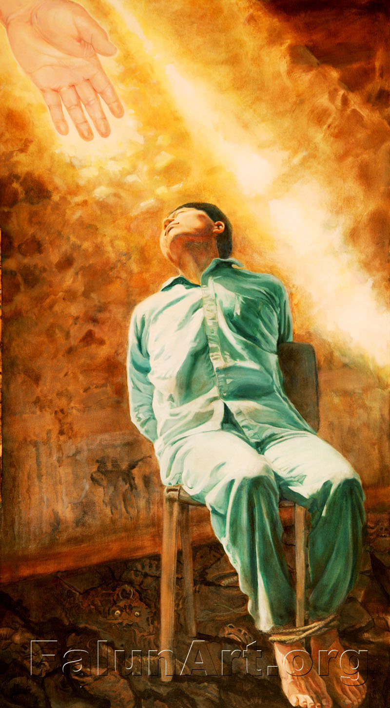</td>
</tr>
<tr>
<td align="center">真善忍美展画作:“刘成军坚忍不屈的精神</td>
</tr>
</tbody>
</table>

假如奸商还有一点天良真的想要行善的话，他应该帮助那些被中共虐杀的法轮功学员的父母和孩子，尤其是刘成军、梁振兴等人的亲人，他们因为插播有线电视揭露自焚骗局而被中共活活折磨致死。他也可以帮助高蓉蓉等人的家人。高蓉蓉女士因为拒绝接受中共劳教所的所谓“转化”而被电击毁容，直至被折磨致死。他还可以帮助那些被中共酷刑折磨致残的法轮功学员，中共的监狱、劳教所和洗脑班在酷刑“转化”这些法轮功学员时，还在强迫他们观看中央电视台关于自焚伪案的“焦点谎谈”。奸商在纽约上演的丑剧，是在往他们的伤口上撒盐。

<table border="0" cellspacing="3" cellpadding="3">
<tbody>
<tr>
<td align="center"></td>
</tr>
<tr>
<td align="center">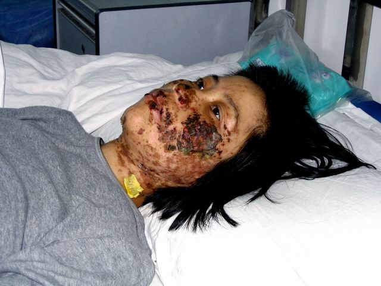</td>
</tr>  
<tr>
<td align="center">2004年5月，沈阳市法轮功学员高蓉蓉（女，37岁）被沈阳龙山教养院连续电击致面部严重毁容，生命垂危。2005年3月，高蓉蓉被马三家劳动教养院关押，同年6月16日被迫害致死。</td>
</tr>
</tbody>
</table>

即使奸商不想帮助法轮功学员和家人，他也可以帮助因抗议城管暴行愤而自焚的小贩（这类自焚是真正自发的自焚，是中共喉舌媒体从来不高调报道的自焚），他还可以帮助因抗议拆迁而集体喝毒药自杀的访民。奸商是不会做这些的，奸商声称要在美国帮助自焚者整容，其实奸商是在帮助中共江泽民集团整容，为这个沾满民众鲜血的犯罪集团整容。

奸商有小聪明但是没有大智慧。当前，迫害法轮功的“610办公室”的现任头目李东生和610的上司周永康已经成为阶下囚，而李东生在成为610头目之前任职中央电视台，因为通过焦点谎谈节目兜售自焚骗局得以升官发财。但是结果呢？这两人都是以害人始，以害己终。此次纽约丑剧，不过是奸商幕后牵线者的狗急跳墙，丝毫无济于事，只能加速其覆灭。

老百姓这些年常说：人在做，天在看。利令智昏，投机取巧，到头来机关算尽，反误性命。奸商之变诈几何哉？止增笑耳。

<h1 align="center"><b>中共制造“自焚”惨案，新华社造谣陷害法轮功</b></h1>

文/法轮大法信息中心

  
【明慧网二零零一年一月二十三日】 自1999年5月中共公安部抛出“香山集体自杀”的谣言以来，江泽民一伙陷害法轮功学员“自杀”的谣言和行动一直都在暗中多方进行，至今从未曾间断过。大陆各地也一再传出大陆公安和地方政府在严刑逼供时威胁法轮功学员说“上面说了，打死就算自杀”的控诉。

  
日前新华社抛出所谓法轮功学员春节之际在天安门广场“自焚”的诽谤“新闻”，其用心无非在于为江泽民把法轮功说成“邪教”和进一步血腥镇压法轮功制造依据。

所有认真读过《转法轮》的人士都非常清楚：法轮功严禁杀生。自1992年5月法轮功问世以来，亿万法轮功学员一直都在坚持“真善忍”的修炼原则，反对任何形式的杀生，因此更不会如此残忍地对待自己的生命。

众所周知，江泽民政权贪污腐败，蔑视宪法法律和百姓的基本人权，已经把改革开放中的中国大陆搞得哀鸿遍地、危机四伏。下岗工人示威、农民绝望而暴动、军队为瓜分钱财火并，民怨民冤如积蓄中的火山岩浆，抗议之声此起彼伏。18个月以来，无端受到残酷镇压的法轮功学员持续和平请愿，自然形成了天安门广场一个最为引人注目的请愿团体，但法轮功决不是因投诉无门而在天安门广场请愿的唯一一个民众团体。新华社抛出的所谓天安门“自焚”惨案，是中共直接或者间接地一手造成的，现在他们不但不思悔过，反而拿来进一步栽赃法轮功，实为丧尽天良、无道致极。

关心时事的人们可能还记忆犹新，不久前中共外交部刚刚对外声称“没有一个人因为修炼法轮功而被关进劳改营”就爆出了仅马三家子一个劳教所便关有数百名法轮功学员的媒体新闻。加拿大公民张昆仑教授因炼法轮功而被多次拘留、施以电刑并被判劳教三年的大量事实报道，更是对中共谎言宣传的有力驳斥。

在此，我们严肃声明，新华社所谓的自焚报道纯属栽赃陷害。法轮功学员从来没有、今后也决不会采取任何形式的杀生行为。同时，我们呼吁各国媒体，警惕中共宣传中一贯使用的欺骗伎俩，以免被江泽民利用，卷入血腥肮脏的红色政治。

（2001年1月23日午）

<h1 align="center"><b>汽油剧毒能毒死人</b></h1>

【明慧网二零一三年六月七日】2013年6月3日《钱江晚报 》报道了一则《误把汽油当饮料，三岁儿子没能救回来》的新闻。
文中说：5月31日下午，在义乌后宅出租房里，章某见自己的摩托车没油了，便从房间里提来一只装有汽油的饮料瓶给摩托车加油。这时，儿子正在旁边玩耍。几分钟后，章某在房间里突然听到儿子的哭叫声，跑出来一看，发现儿子将塑料瓶里的汽油喝到肚里了。章某见状，赶紧给儿子喂水，并拨打120求救。等送到稠州医院抢救室，医生检查发现孩子已经脉搏微弱，经多名专家抢救无效后死亡。一次对汽油的误食造成小孩的死亡，造成了一个巨大的悲剧。

可见汽油的毒性是很大的。但是很多人不知道其中的厉害，因为在生活中也很少有这样的经验教训。不过，这则新闻让我想起12年前的另一个关于喝汽油的报道，当时很多人以为报道是真的。但是细看就知道事情的真伪。

在2001年1月23日（农历除夕）天安门广场假自焚事件中，中央电视台报道“自焚未遂”的刘葆荣在自焚现场张嘴猛喝几口汽油……，事后数日刘某在接受采访时却觉得喝汽油没有什么中毒症状，也没有谈到喝汽油后被抢救的经历。为什么呢？因为她根本就没有喝汽油，也没有被送到医院抢救，所以她也不知道喝汽油是极其痛苦的，而且会导致人死亡，而中央电视台的那些个造假记者们和这个事件阴谋策划者也不知道这个喝汽油的严重性，所以就没把喝汽油当回事，觉得反正是撒谎，以为添点喝汽油的细节可增加谎言的可信性，谁知道是越描越黑，欲盖弥彰。而许多老百姓也不知道这一点，但是今天看了这个小孩误食汽油身亡的报道，在活生生的案例面前，人们知道了喝汽油的严重性，对比之下，也就更加清楚看到了中央电视台的造假报道。根据医学资料，口服汽油每公斤体重7.5 克即致人死亡。刘喝半瓶大雪碧瓶的汽油竟没有一点中毒症状，这分明是骗人！

在天安门假自焚案中还有诸如：小女孩气管切开能唱歌；假自焚者王进东的头发、眉毛烧不着等等违背常识的事情，相信你通过这些事实，能够看清天安门假自焚案的骗局，了解真相，不要再被中共邪党的愚民宣传迷惑！

<h1 align="center"><b>自焚谎言十二载　人心觉醒真相明</b></h1>

文: 唐恩

【明慧网二零一三年一月二十三日】一九九九年七月二十日中共江氏集团动用整部国家机器迫害法轮功，为了实行“肉体上消灭、经济上搞垮、名誉上搞臭”的灭绝政策，不断制造“假新闻”，编造一连串自焚、杀人、敛财等弥天谎言，企图激发民众对法轮功的仇恨。这些“假新闻”中，荼毒世人最严重者，莫过于二零零一年一月二十三日炮制的“天安门自焚事件”，意图诬蔑陷害法轮功，以所谓的五人“自焚”谎言欺骗海内外民众。

  
<b>天安门自焚伪案 漏洞百出</b>

如果把十二年前的中央电视台“天安门自焚事件”录像画面进行慢镜头分析，便会暴露出很多疑点，说明这场“自焚”事件完全是一场精心布局的预谋与骗局。

一、在“自焚”事件中被大面积烧伤的小女孩刘思影气管被切开后四天就能接受采访并能唱歌。

二、《焦点访谈》录影证实，刘春玲没被火烧死，却被警察用重物击打头部倒下。

<table border="0" cellspacing="3" cellpadding="3">
<tbody>
<tr>
<td align="center"></td>
</tr>
<tr>
<td align="center">央视天安门自焚镜头的慢动作重放证实刘春玲是被警察打死，天安门自焚是中共策划的一场骗局。</td>
</tr>
</tbody>
</table>

三、天安门巡逻的警察几分钟内从两辆警车里拿出二十多个灭火器和灭火毯“应付”该起“突发事件”。

四、北京积水潭医院治疗“自焚”大面积烧伤者，不作任何防护，允许记者近距离采访，完全违反医学常识。

五、“王进东”在自焚时衣服已被烧焦，但是最易燃烧的头发还在头上，他腿间的盛满汽油的雪碧瓶却完好无损。在他喊出那句似是而非的口号之前，警察手中的灭火毯却在他头上悠闲的摇晃很久，没有丝毫灭火的急迫。

<table border="0" cellspacing="3" cellpadding="3">
<tbody>
<tr>
<td align="center">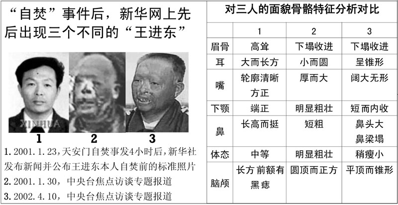</td>
</tr>
<tr>
<td align="center">“王进东”的三张对比照片证明自焚是伪案</td>
</tr>
</tbody>
</table>

六、在央视和新华社的“自焚”报导中，先后出现了三个不同的“王进东”。台湾大学语音识别实验室受“追查迫害法轮功国际组织”委托，对王进东的声音作了语音鉴定，得出明确结论：《焦点访谈》第一集中的王进东与后来的王进东不是同一人。“追查迫害法轮功国际组织”经可靠途径查获：参与“自焚”的“王进东”是由一名现役军人扮演。

不仅上述造假的凿痕太过明显，《华盛顿邮报》在二零零一年二月四日头版头条发表了调查报告《自焚的火焰照亮了中国的黑幕——当自焚的动机乃加强对法轮功的斗争》。邮报记者亲自到自焚身亡的刘春玲的家乡开封实地调查，邻居们说从来没有人看见过刘春玲炼法轮功。

<b>《伪火》影片获奖 民众明了真相</b>

国际教育发展组织于该年八月十四日在联合国会议上，就天安门自焚事件，强烈谴责中共当局“国家恐怖主义”的行为：所谓“天安门自焚事件”是对法轮功的构陷，涉及惊人的阴谋与谋杀。声明中说：从录影分析表明，整个事件是“政府一手导演的”。中国代表团面对确凿的证据，没有辩词。该声明已被联合国备案。

令中共极度难堪的是，二零零三年十一月八日由新唐人电视台制作、揭露“天安门自焚真相”的纪录片《伪火》，从各国参赛的六百多部影片中脱颖而出，获得第五十一届哥伦布国际电影电视节荣誉奖。该奖项在纪录片领域享有盛誉，其历史仅次于“奥斯卡”。《伪火》影片以触目惊心的画面和精辟严谨的分析，揭示了“自焚”案的诸多疑点，从而证实了整个事件是中共栽赃法轮功而炮制的伪案。

<table border="0" cellspacing="3" cellpadding="3">
<tbody>
<tr>
<td align="center"></td>
</tr>
<tr>
<td align="center">获奖影片《伪火》的视频可在《获奖影片：伪火（中文版）》中下载观看。</td>
</tr>
</tbody>
</table>

为了阻止“自焚真相”的传播，江氏集团曾下令对电视插播“天安门自焚真相”的法轮功学员“杀无赦”，导致长春法轮功学员刘成军等多人被活活折磨致死。中共喉舌媒体加工的自焚录像欺骗了众多世人，获奖影片《伪火》却在海内外广泛传播，无数民众正是通过了解“自焚真相”从而明了中共迫害法轮功的真实情况。

<b>大批民众按手印　挺身声援反迫害</b>

在长达十三年的迫害中，法轮功学员不畏强权，无惧暴力，以真实对谎言、以和平对暴力、以善良对残酷，锲而不舍的向世人澄清事实，讲明真相，揭露中共编造的谎言，启发人们的善念良知，真相已大白于天下。更有无数的世人被法轮功学员们真诚、慈悲与坚定的信仰所感动，甚至加入反迫害的行列。

近年中国民众制止迫害之声也持续不绝，与迫害初期的不敢吱声迥然不同。二零一二年二月二十五日，因修炼法轮功的王晓东被非法抄家、绑架、抢劫及抓捕，河北省沧州地区泊头市富镇周官屯村全村三百户各派一名代表在呼吁书上签名，要求市检察院释放王晓东，此联合签名按手印的请愿书引起中共中央政治局的震动。

<table border="0" cellspacing="3" cellpadding="3">
<tbody>
<tr>
<td align="center"></td>
</tr>
<tr>
<td align="center">河北省泊头市富镇周官屯村三百多户村民联名按手印、加盖公章要求释放法轮功学员王晓东，撼动中共中央政治局。</td>
</tr>
</tbody>
</table>

二零一二年六月七日，河北省正定县法轮功学员李兰奎被“六一零”人员绑架到正定县看守所，再被转到石家庄市洗脑班关押迫害。中共警察肆意迫害好人的恶行，引发了正定县很多百姓的强烈不满，七百多位民众集体自发联名声援营救被绑架的李兰奎。

<table border="0" cellspacing="3" cellpadding="3">
<tbody>
<tr>
<td align="center"></td>
</tr>
<tr>
<td align="center">七百多位民众自发联名声援营救法轮功学员李兰奎</td>
</tr>
</tbody>
</table>

大规模民众联名上书这样的事件在中国越来越多，去年五月二十九日，河北唐海县五百六十二位村民按手印，支持释放法轮功学员郑祥星；黑龙江则有一万五千民众为素不相识的法轮功学员挺身而出，站出来支持当地替父鸣冤的秦荣倩，在她的《喊冤昭雪书》上签名并按上大红手印。秦荣倩的父亲秦月明，因坚持信仰法轮功而被当局关在监狱中酷刑折磨致死。

<table border="0" cellspacing="3" cellpadding="3">
<tbody>
<tr>
<td align="center"></td>
</tr>
<tr>
<td align="center">黑龙江省有超过一万五千民众为素不相识的法轮功学员挺身而出，在替父鸣冤的秦荣倩的《喊冤昭雪书》上签名并按上大红手印</td>
</tr>
</tbody>
</table>

前年法轮功学员周向阳的家乡河北省秦皇岛昌黎县，约两千三百位善良民众联名支持其申诉，在当局把周向阳的妻子李珊珊抓走后，又有五百多民众联名救助。大批村民选择支持无辜受迫害的法轮功学员，是中国民众面对中共暴政，挺身选择正义的壮举，也是人心觉醒及全民反迫害的发轫。

中共炮制自焚伪案，只突显了自身的愚蠢无知。随着真相广传，人心日渐觉醒，自二零零四年十二月开始，迄今已有一亿三千多万有识之士退出了中共的党团队组织，现在正以平均每天有六万多人退党的速度逐步解体中共。曾经为虎作伥、助纣为虐的人们应该慎思明辨，早日分清正邪与善恶，为自己选择光明美好的未来。

<h1 align="center"><b>同样的烈火焚身，“待遇”为何如此不同？</b></h1>
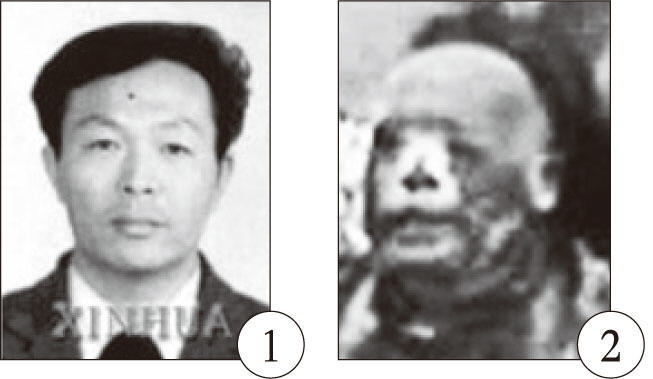 
  
文: 正信

【明慧网二零一二年七月三日】七月一日晚，一打开国际互联网，就看到报导说，六月三十日天津蓟县最大的商场莱德商厦发生火灾，滚滚浓烟笼罩全城，商厦内多人选择跳楼逃生，场面惨不忍睹。据现场附近的目击者爆料，因六月三十日正逢周六，商场顾客如潮，员工加顾客至少有上百人死亡。然而中共新华社报导称，初步确认十人死亡，十六人受轻伤，事故原因正在调查。

  
莱德商厦是座五层的老楼，其中柜台密集，空间狭小，上下层之间靠一部十二人电梯和自动扶梯联系。有知情者说：“火灾时只有商厦一层的人逃了出来，三层以上的应该很难逃生……”民众们在网上纷纷发帖怒斥说：“尸体过百，却只报告死十个。掩盖事实，目的是为县里各个领导减轻责任。他们从未为死的人想过！当官的真不是人啊，竟瞒报死伤人数！”“有关部门发假消息；有关媒体被封嘴；监管部门要逃避责任。失去亲人的人……”“我的帖子被删了四次！我愤怒至极！太敏感不能发？”“这么多人知道真相，居然还能出现这样的官方数字？！”……

其实这么多年生活在中国大陆，老百姓早已熟知了中共的恶习，但凡发生死亡、灾害事件的，一定要把伤亡人数缩小、缩小、再缩小，同时在第一次报导事件时一律称：事故原因正在调查中。把伤亡人数缩小，目的一个是所谓的维持稳定，继续保持其虚假的歌舞升平的大好形势；再一个就是把大事化小、小事化了，为日后减轻对责任人的追究做铺垫；而称“事故原因正在调查”，则能给中共一个充足的缓冲时间，以找到一个对其最有利的、最能够糊弄老百姓的借口。所以从十几年前的洛阳大火，到近年上海的“11·15”特别重大火灾，再到中央电视台配楼火灾，无一例外，隐瞒伤亡人数、火灾详情。

然而唯独有一场火，反而一反常态的在事发两小时后，反复播放，而且向全世界用英文播报了事件，中央台记者多角度、全方位的拍到，远景、近景、特点镜头一应俱全，把小事搞大，也没有称“事故原因正在调查”。那就是二零零一年一月二十三日下午发生在天安门广场上的所谓“自焚”，中共媒体在没有充份调查的情况下，一口咬定“自焚”，声称他们是“法轮功学员”。

同样是灾难、死人，为什么播报的口径、所受的“待遇”如此不同呢？理由很简单，蓟县大火也好，洛阳还是其它地方大火也好，那是因当局管治不力造成的，大厦消防设施不到位，消防安全没有保障，但在上哄下骗中，却都能消防检验合格。而“天安门自焚”的大火之所以要报，并要第一时间报，随后又是全世界、全国范围内、全方位的大报、特报、反复报，目的只有一个，那是为了抹黑法轮功，为進一步迫害制造舆论的。因为当时“江氏集团”在经过一年半的打压之后，发现不仅没把法轮功打倒，相反越来越多的人开始对这场迫害反感并转而支持法轮功：“管那帮炼功的老头、老太太干什么？让他们炼吧！”

在蓟县大火中，多位网民亲眼看到人们从三楼、四楼跳下摔死，至少有百十来人被直接送到火葬场……在这样有众目睽睽、亲眼所见为证的情况下，当局为什么依然漫天撒谎，强称只有“十人死亡，十六人受轻伤”？（也许这个数字会有所增加，但绝不会报导真实的情况。）因为强盗的逻辑是：不管你有多少人看到，你毕竟只是少数，能直接听到你说真相的，也只是当地的少部份人；而当局控制着全部的国家宣传机器，它一句谎言，就能够覆盖全国几亿观众。你当地人不信，其它更多地方的人会信，因为他们无从了解真相。再加上“谎言重复一千遍就是真理”的邪恶逻辑，它就是要这样欺骗、撒谎、强奸民意！

“天安门自焚”中又何尝不是这样呢？虽然早在“自焚”伪案发生半年后的二零零一年八月十四日，国际教育发展组织（IED）就已经在联合国会议上公开声明：“我们得到了一份该事件的录像片，并从中得出结论，该事件是由这个政府一手导演的。”当时在座的中共代表面对此景，哑口无言。而在二零零三年十一月，分析天安门自焚案的纪录片《伪火》，获第五十一届哥伦布国际电影电视节荣誉奖。在国际社会已经广泛知道“天安门自焚”“是中共一手导演的骗局”时，它为何仍然敢在国内肆无忌惮的欺骗老百姓？不也是基于同样的原因吗？国际社会再多人知道，但国内老百姓却必须得在中共的铁墙内，看中共要他们看的新闻，听中共要他们听的声音，中共不允许或不想要他们听到的声音，统统被隔绝在铁墙之外！所以说，“中国的言论自由”确切的说是“中共的言论自由”！

但是，包装再精美的谎言终究都是谎言。记的有一句话说：“谎言可以在一段时间内欺骗所有的人，也可以在所有的时间内欺骗部份的人，但却不能够在所有的时间欺骗所有的人。”事实的确如此。早在大约十年前，笔者在北京打出租车和一位的哥聊“天安门自焚”内幕时，笔者刚开个头，的哥就接到：“咱北京谁不知道天安门自焚是假的！”即使在偏僻的农村，老百姓也在口耳相传“天安门自焚是中共骗局”的真相。二零零六年，我和一堂姐讲起法轮功，堂姐说：“听说天安门自焚是假的，有一次我坐货车去城里办事，货车司机跟我讲的。他说听人讲自焚是假的，还说了很多疑点呢。”

纸包不住火。当中共的谎言被人们一个个戳穿时，就是撕去它漂亮的画皮，显现出魔鬼真面目的时候，那时它必将被正义的利剑斩碎！

<b>附：“天安门自焚”破绽分析：</b>

<b>破绽一、王进东：真身，还是替身？</b>

在“天安门自焚”案中，中共说现场打坐并喊口号的那个人是“王进东”，他是“法轮功学员”。然而从央视自焚录像的慢镜头分析看，这个人既不是“王进东”，更不是法轮功学员。

 
  
上图左边是央视自焚录像中公布的王进东的一寸标准照，高鼻梁，高眉骨，大长方耳，下颌端正。右边是在同一录像中，在现场参与“自焚”的王进东，短鼻子，塌眉骨，小圆耳，下颌粗壮。同一录像中公布的同一个人，头部照片明显差异。如果说差异是因为自焚导致的变形，那为什么在头发、眉毛都完好的情况下，骨头、耳朵会被烧变形呢？

央视自焚录像中的王进东，从盘腿、打坐的姿式到呼喊的口号，都与法轮功没有任何关系，却被中共硬栽赃为是“法轮功学员”。

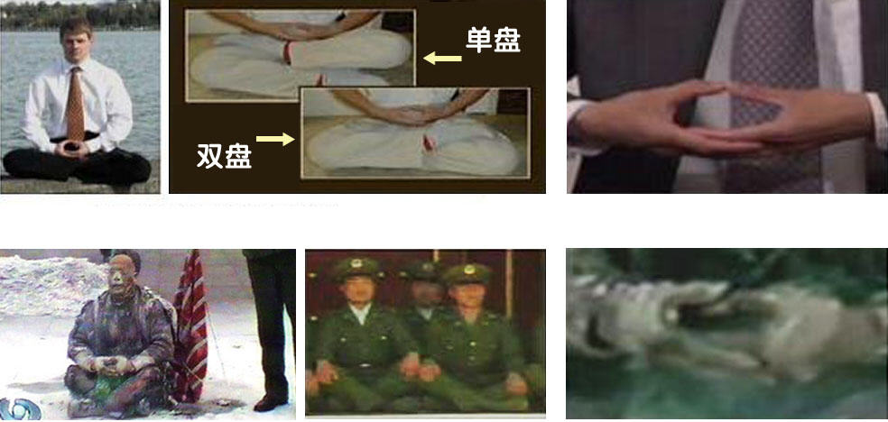 
  
法轮功要求的是双盘，至少也得是单盘，而被新华社称为自一九九七年就开始练法轮功的“老学员”王进东，散盘的双腿都翘的高高的，被外界认为是中国军人标准的坐姿。法轮功要求两手结印时，两大拇指尖正对，这是法轮功中最基本的动作，而王进东则两拇指相压。这一切都说明，他根本就没练过法轮功，也不可能是法轮功学员。

<b>破绽二、大火烧不坏的塑料汽油瓶</b>

在央视自焚录像中，看上去烧相惨重的王进东，胸部和腿部的棉衣被烧破，露出皮肉，然而夹在他被烧烂的双腿间的两只装汽油的塑料雪碧瓶，却奇迹般的颜色翠绿，且完好无损。

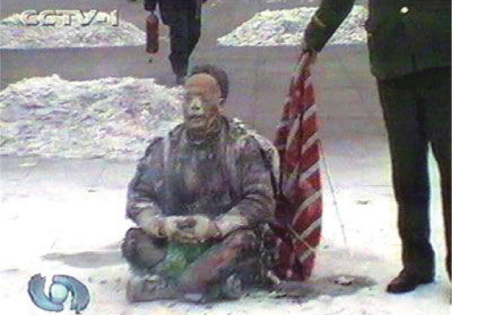 
  
任何的造假都经不起历史的检验，二零零二年，自焚案的唯一采访记者李玉强，在河北省会法制教育培训中心（中共设立的对法轮功学员非法进行洗脑的黑窝），被非法关押在那里的法轮功学员问及王进东双腿间的汽油瓶的事情，李张口结舌，不得不承认：雪碧瓶子是他们放进去的，这个镜头是“补拍”的。

<b>破绽三、刘春玲：烧死，还是打死？</b>

另一当场死亡的刘春玲，被央视说成是被“自焚”之火烧死，然而从慢镜头录像分析中，人们看到：刘春玲是在现场被人用重物活活打死的。

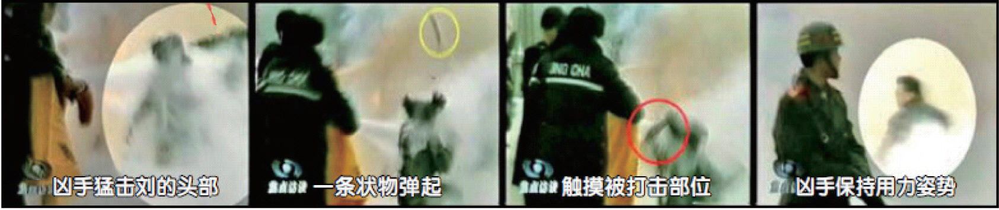 
  
<b>破绽四、刘思影：是真切气管，还是愚弄百姓？</b>

中央台的自焚录像中，积水潭医院烧伤科的副主任医生李迟说，参与自焚的几个烧伤者，都伤势严重，需要马上做气管切开手术。然而令世界医学界感到震惊的是：十二岁的小女孩刘思影，在气管切开不到四天的时间内，面对记者李玉强的采访，说话底气十足，嗓音清脆，并对全国观众唱了她最喜爱的歌曲。稍有医学常识的人都知道，气管切开手术的切口在声带的下方，做了这种手术，根本就不可能这么快正常说话，更不要说嗓音清脆的唱歌。不怪说，国际社会看到央视自焚录像后，都惊呼中共“创造了医学奇迹！”

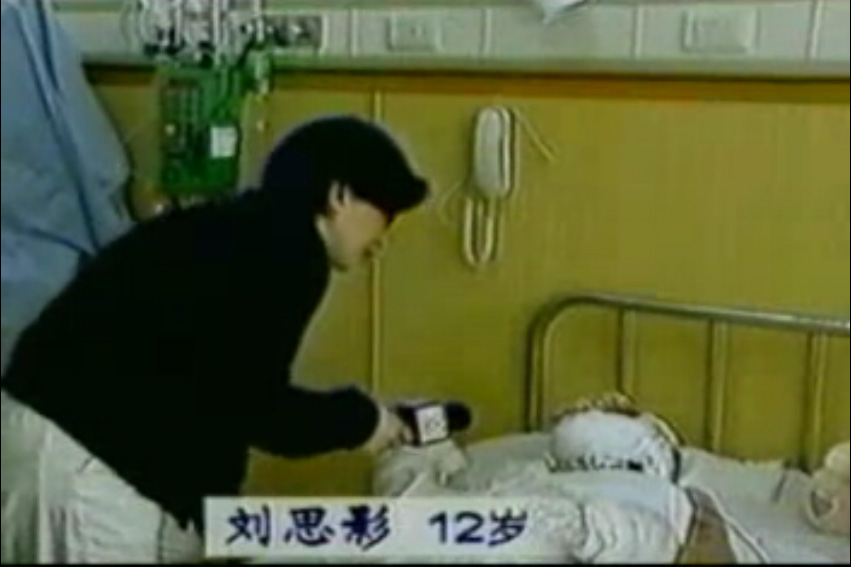 
  
<b>破绽五、央视记者在天安门等人自焚？</b>

天安门自焚录像中，远景、近景、特点镜头一应俱全，并可看到一身背摄像机者在现场慢慢的自由拍摄。通常突发事件，能够被拍到已属不易，能够被中央台记者“碰巧”的、多角度、全方位的拍到，如果没有事先的策划与准备，更是天方夜谭！

中共说，这场自焚录像是由安装在天安门广场上的监视摄像机拍摄的。如果真是这样，画面应该是远景、自上而下、角度固定的，然而央视自焚录像中，不仅可看到远景画面（如图六），还可以看到近景及面部特写画面（如图三），并可明显看出摄像机是移动、跟踪拍摄的。

当海外媒体质疑这些近距离及特写镜头是哪里来的时，中共称，是在现场的CNN记者拍到的。然而CNN国际部发言人称：他们的记者并没有拍摄到任何画面，因为在事件的一开始，他们的摄影师就被逮捕，摄影器材被没收。谎言再一次被戳穿！

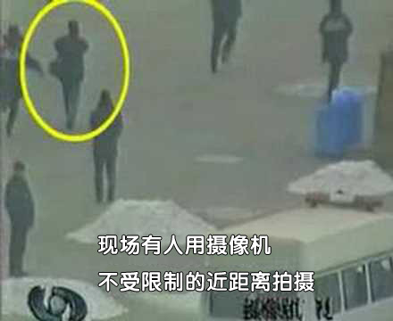 

<h1 align="center"><b>天安门不应是中共造假的戏台</b></h1>

文: 德元

【明慧网二零一一年十一月二十一日】天安门是中国的象征之一。天安门始建于明朝永乐十五年（1417年），时称为承天门。清朝顺治八年（1651年）更名为天安门，取“受命于天，安邦治民”之意。此后，天安门广场上发生了许多重大的、对中国历史发展有着相当影响力的历史事件。

  
<b>中共建政把天安门变成造假的戏台</b>

中共建政在天安门，这自然是中共历史中的大事。而就连这件事情的历史记录，都得经过多次造假才能呈现给中国人，因为中共自己都无法面对历史的真相。

例如，收藏在国家博物馆的油画、所谓的《开国大典》曾四次修改，其作者董希文也因种种政治原因而饱受迫害。《开国大典》完成后才三年，就发生了“高饶事件”。作为中共副主席、政治局委员的高岗于1954年初被撤销职务，8月自杀身亡，此后又被开除出党。于是中共要求董希文修改《开国大典》，将画面上的高岗形象抹掉。

“文化大革命”开始后，刘少奇成了党内最大的“走资本主义道路的当权派”而被打倒。博物馆又通知董希文在画面上去掉刘少奇。董希文此时已得了癌症，然而他仍然抱病奉命到博物馆亲自進行修改，在刘少奇的位置上改画了董必武。

经过四次造假之后的油画《开国大典》，删去了中共6个副主席中的2个：刘少奇（用董必武代替）、高岗（用一盆花代替）。

又例如，一九八九年的六四事件，中共动用野战军，出动坦克，用达姆弹在北京市天安门广场附近及通往广场的道路沿线屠杀市民和学生，却称学生和市民们为暴乱和动乱。中共又谎说戒严部队在天安门广场执行清场任务的过程中“没有死一个人，没有轧伤一个人。”

时至今日，此事件被中共刻意淡化和掩盖，至今仍严格限制有关六四的议论。许多中国80后的年轻人不知道有此事的发生。而中共为了使其屠杀合法化，在电视媒体上对全国传递“共和国卫士”尸体被烧的枯焦，腹部被剖开，肠子部份外露的惨相。让人们以为市民和学生是“暴徒”，相信中共的屠杀是“平暴”。而在这样的惨剧中，学生、市民、军人都是中共的受害者，因为正是中共一手造成了六四事件中的军队入北京、暴力冲突和开枪屠杀，导致了学生、市民、军人的死亡。

<b>“天安门自焚”是中共再次用天安门造假</b>

而这种用焚烧人体来造假的妖魔化手法，十几年后又出现在迫害法轮功的“天安门自焚”伪案中。

“天安门自焚”是中共制造、用以栽赃陷害法轮功的恶性事件。二零零一年一月二十三日，震惊中外的“天安门自焚”案发生。中共喉舌新华社一小时后向海外发布消息，称五名法轮功学员在天安门自焚，后改口为七名。

然而，中共的喉舌“中央电视台”播出的“天安门自焚”新闻节目疑点重重，例如，天安门广场面积大而且空旷，并没有陈列灭火器，何以在“自焚者”点燃身上汽油的短时间内就有这么多灭火器 “救火”？点燃汽油短时间内就会把自身烧死，“中央电视台”并不是每天二十四小时开着多台摄影机对准广场，何以有那么多摄影机多角度地把“自焚”镜头、包括特写镜头摄制下来？现场死亡的刘春玲，电视慢镜头中清晰显示是被一个身披军大衣的人从身后击中头部而倒下的……

二零零一年八月法轮大法明慧网发布了《录像片：深入分析天安门自焚疑案(26分钟)》，揭示自焚骗局中的种种细节。同月十四日，国际教育发展组织在联合国倡导和保护人权附属委员会第五十三届会议中发表声明，指天安门自焚事件是“政府一手导演”的，并谴责中共以“国家恐怖主义行为”迫害法轮功。

<b>中共掩盖天安门前的重大历史真相</b>

在中国的历史上，天安门前不仅有中共导演的自焚伪案，也有来自全世界各地的法轮功学员冒着生命危险，在天安门广场和平请愿的壮举。而这些铭刻在历史中的一幕幕，却是中共想方设法封锁，不想让中国人了解的。其中部份法轮功学员在天安门上访后，被中共动用国家机器和军队活摘器官致死，这重大的历史真相，正随着中共退出历史舞台被一步步的揭示给世人。

<table border="0" cellspacing="3" cellpadding="3">
<tbody>
<tr>
<td align="center">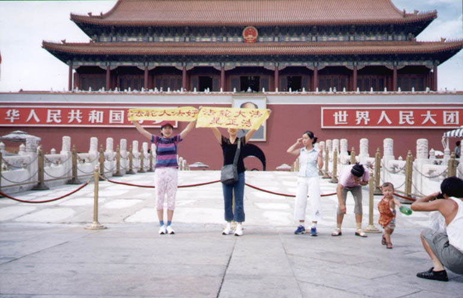</td>
</tr>
<tr>
<td align="center">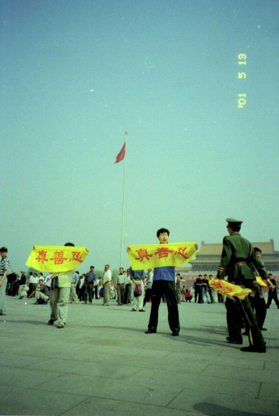</td>
</tr>  
<tr>
<td align="center">天安门前和平上访的法轮功学员</td>
</tr>
</tbody>
</table>

加拿大法轮功学员泽农曾写下《我为什么去天安门广场》一文，文中说：“法轮大法来自于你们的家乡──中国，来自你们那博大精深而又美好的文化。没有大法，就没有今天的我。就是带着这份深深的敬意，我踏上了你们的国土，为你们而来，向你们讲清真相。我希望通过我这张西方的面孔和纯净的心，能够唤醒你们心中的善念。请不要追随江泽民及其帮凶迫害法轮功，因为这会使你们陷入灾难。我不反对中国政府，也不反对中国。实际上，自从修炼法轮功以来，我已对中国文化和中国人民有了更深的理解。这也是我觉得我必须去中国的原因。”

“……宇宙大法在当今这样的乱世中传到了这个世界，而法轮大法学员不顾一切风险将真相传递给你们。他们将成为未来的英雄，将永远被记载于未来的中国文化和世界史册之中。亲爱的朋友，我跨越千山万水来到这里，就是想告诉你：你也同样希望在历史中作为正的生命被后人记住。你也一定听说过‘善有善报，恶有恶报’的道理，不要忘记，你的未来亦遵循这样的法则。”

<table border="0" cellspacing="3" cellpadding="3">
<tbody>
<tr>
<td align="center">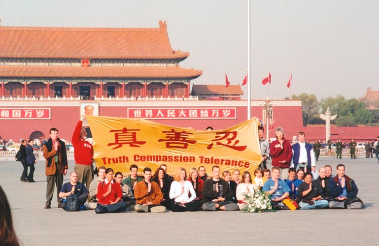</td>
</tr>
<tr>
<td align="center">三十六名西人法轮功学员去北京天安门证实大法、抗议迫害</td>
</tr>
</tbody>
</table>

十年前和三十六名西人法轮功学员去北京天安门证实大法、抗议迫害的德国法轮功学员玛丽昂回忆道，即使对他们这些西方人，警察都会进行威胁、甚至是动手打人，他们如何对待去天安门上访的中国法轮功学员就可想而知了。他们非常害怕让别人看到我们，如果他们做得对，他们为什么这么害怕呢？这不正说明他们知道自己做的事情见不得人吗？

玛丽昂对中国人讲出了自己的心声：“为了中国人，我去了天安门，我最想对中国人说的就是：法轮大法是中国正统文化的一部份，是一条正道，是全人类的财富。”

<h1 align="center"><b>自焚谎言如三聚氰胺</b></h1>

文: 飞鸣

【明慧网二零一一年九月十七日】中共一直在通过学校的课本对天真的孩子们进行洗脑，灌输谎言，煽动仇恨，毒化心灵。以前对所谓的“地富反坏右”竭力抹黑，胡说什么世界上三分之二的人处于水深火热之中，现在又在小学的所谓“品德与社会”课本中对教人向善的法轮功进行诋毁，用中共自编自导的自焚谎言栽赃法轮功，在孩子的心灵中播下对“真善忍”的仇恨。

  
中共的课本虽然打着“品德”的幌子，但中共官员们贪污淫乱，是品德最恶劣的团伙。在中共的统治下，喉舌媒体中充斥着谎言，市场上泛滥着假货。而中共课本里的谎言，恰如三鹿奶粉中的三聚氰胺一样，在毒害着无辜的孩子。三聚氰胺毒害着孩子的身体，而自焚谎言则是在毒害着孩子的心灵。

中共的课本称：小学五年级的学生刘思影，在二零零一年一月二十三日下午，在妈妈的带领下，来到天安门广场，点燃身上的汽油自焚。中共课本以此来诽谤法轮功。其实中共课本的谎言早已被当年华盛顿邮报的报道所揭穿。

二零零一年一月二十三日（农历除夕）天安门自焚事件发生之后，中共新华社一反层层请示、迟迟不报的常态，以惊人速度报道了 自焚事件，并一口咬定此事乃法轮功所为。随即，法轮功纽约信息中心于美东时间一月二十三日上午通过明慧网发表了题为“中共制造自焚惨案，新华社造谣陷害法轮功”的声明，稍后又通过国际媒体向中共和世界发出呼吁，呼吁尽快进行第三方独立调查。

一周之后，中共掌控的中央电视台抛出自焚死亡女子刘春玲之女、十二岁的小学生刘思影被焚烧后的悲惨画面，在加紧开展强征签名、大面积逮捕等一系列迫害行动的同时，公开煽动公众对法轮功的仇恨，挑动群众斗群众。

二零零一年二月四日，华盛顿邮报在头版发表题为“自焚的火焰照亮了中国的黑幕——当众自焚的动机乃为加强对法轮功的斗争”的调查文章，向世界提供了包括以下几点在内的事实：

（1）从来没人见到刘春玲练过法轮功。 
（2）刘春玲生前在夜总会靠陪吃陪舞谋生。 
（3）刘春玲殴打老母和幼女。

第（1）点说明刘春玲不是法轮功学员，那么她和刘思影的自焚显然和法轮功没有关系。第（2）点和第（3）点也说明刘春玲不是法轮功学员，因为法轮功教人向善，提升道德，法轮功学员绝不会殴打父母，也不会做三陪这种卖淫的工作。可怜的刘春玲女士和小女孩刘思影被中共利用来炮制自焚伪案栽赃法轮功，成了中共造假的牺牲品。

以下是华盛顿邮报文章的相关描述：

但刘春玲在苹果园的邻居将她描述为一个生活波折并遭受心理问题折磨的女人。国家媒体说78岁的郝秀珍（音译）是她的养母。邻居说在刘去年将郝秀珍赶出家门前，她们母女经常吵架。
“她有毛病，”邻居刘敏（音译），51岁，说。“她打她母亲，她母亲就又哭又喊。她也打她女儿。”

对于刘如何养活自己，以及女儿父亲的去向也有许多问题。邻居说，刘不是开封本地人，南方广东省的一个男人为她付房租。另一些人，包括22岁的邻居魏剑（音译），说刘在当地的一个夜总会工作，她靠陪吃陪舞赚取报酬。

从来没有人见她练过法轮功。

九九年七月中共开始迫害法轮功的初期，就在动用所有的媒体连篇累牍地散布着诋毁法轮功的谎言，中共警察更是大规模地抓捕修心向善的法轮功学员。为向世人澄清真相，不断有法轮功学员来到北京天安门广场，向人们展示法轮大法好，多次被国际媒体报道，很多百姓也越来越倾向于同情法轮功学员。中共江氏集团的迫害难以为继，就在天安门广场上演了这出“自焚”丑剧，嫁祸于法轮功，又以惊人的速度，通过其喉舌媒体竭力渲染自焚，并谎称自焚者是法轮功学员，其目的是为了抹黑法轮功，阻止法轮功学员在天安门广场的和平抗议，煽动民众的仇恨情绪，为加剧迫害法轮功寻找借口。

<table border="0" cellspacing="3" cellpadding="3">
<tbody>
<tr>
<td align="center"></td>
</tr>
<tr>
<td align="center">在中央电视台播出的假戏中，做了气管切开手术的刘思影，在伤后四天就带着插管声音清晰的接受采访，还有兴致唱歌，完全违背基本医学常识。</td>
</tr>
</tbody>
</table>

中共的中央电视台播出的自焚事件的报导也充斥着拙劣的造假。比如做了气管切开手术的刘思影，在伤后四天就带着插管声音清晰的接受采访，还有兴致唱歌，完全违背基本医学常识。做了气管插管手术之后，因为几乎没有气流能通过声带，患者在早期根本无法开口说话。即使是在病情稳定，气道和喉头的水肿消退后， 患者也只能发出口齿不清、四面漏气的声音。又比如自焚者王进东两腿间盛着汽油的雪碧瓶在火焰中完好无损。王进东背后的警察拿着灭火毯，悠闲的等待着王进东喊完口号后才 把灭火毯盖在他头上，这显然是在拍戏。

更可笑的是，警察本来是不背着灭火器巡逻的，所谓“自焚”的当天，天安门广场却突然事先存放了很多的灭火器材。警察几分钟内从两辆警车里拿出二十多个灭火器和灭火毯应付所谓的“自焚”“突发”事件。喉舌媒体的记者更是早就知道了将要发生的一切，有备而来，拍摄的有近景、远景和特写，而且有麦克风录下洪亮的口号，摄影师甚至抓拍到小孩喊妈妈的镜头。显然，这场所谓的“自焚”是中共导演拍摄的煽动仇恨的假戏。

大陆的父母们对有毒奶粉中的三聚氰胺都已经有所戒备，但是对中共课本中的自焚等谎言也不能掉以轻心。这些谎言在孩子的心中播种仇恨，污染孩子的心灵，对孩子的人生会带来非常恶劣的影响。希望孩子的父母和教师们都能看清中共谎言，让孩子了解真相，抵制中共的有毒课本。

<h1 align="center"><b>明慧网两则报道证明自焚是伪案</b></h1>

文: 李寂然

【明慧网二零一一年二月九日】时值中共炮制的天安门自焚伪案十年，海内外众多仁义之士纷纷撰文深入揭露这一惊天罪恶之际，一位法轮功修炼者找出了天安门自焚伪案发生前，明慧网发表的两则有关中共图谋利用自焚构陷法轮功的报道。这两则报道从一个独特的侧面揭示了中共意图栽赃法轮功的阴险，以及法轮功修炼者对于自焚的真实态度。

  
中共对海外资讯封锁最严重的网站就是法轮大法明慧网。明慧网开通于一九九九年六月，致力于正面报导关于法轮大法以及大法修炼者的信息与相关真相资料。特别是一九九九年七月二十日迫害全面公开以来，明慧网大量刊登了大法弟子在中国大陆遭受残酷迫害的第一手见证资料、案例。明慧网对大陆官方媒体所造谣言进行澄清、对被谎言掩盖的关于法轮大法的事实进行披露，并一直正面报导法轮大法在世界多国的弘传，以及世界各地大法弟子的修炼心得、认识切磋等方面的文章。

关于明慧网，法轮大法创始人李洪志先生告诫弟子：“重大问题一定看明慧网的态度”。那么明慧网在报道关于自焚的情况时，也就是正式表达了法轮功修炼者对于自焚的态度。值得着重说明的是，明慧网关于自焚的态度在中共炮制天安门自焚伪案前就已经非常明确了。我们先来看这两则报道。

二零零零年十月十一日明慧网在大陆综合消息栏目里有这样一个报道：

“【大陆】内部消息：邪恶势力计划制造自焚假相

“大陆，据六一零内部消息，邪恶势力计划焚烧大法弟子，造成自焚假相，用来诬陷法轮功。望各地大法弟子密切关注。”

二零零零年十二月十二日明慧网大陆综合消息里有关自焚的一个报道是这样的：

“警惕‘扮演法轮功的’阴谋破坏

“据一位了解公安的同修说：‘有的公安人员冒充大法弟子联络、组织学员切磋，以图抓捕大法学员；还有的公安人员装成学员在天安门广场背《洪吟》，以诱骗大法弟子上当。据公安人员自己称：用此方法“一贴就是一片”’。

“另据一学员说她听人家说，在（公安宿舍区）有一天凌晨四、五点钟听见‘小喇叭’喊：‘扮演法轮功的集合’，并重复多遍。

“希望大法同修在证实大法、说明真相过程中要保持警惕。还有，近来又听到‘有多少法轮功学员要在什么时候到天安门自焚’的传言，也值得同修们的注意。”

这两则报道都不长，而且相隔时间也仅两个月，透露出来的观点都指向了“自焚”。报道明确说明消息来源都是来自于迫害法轮功的中共“六一零”与公安系统。如果我们和中共炮制的天安门自焚伪案联系起来就会发现，在时间上可以说已经很接近了。中共炮制的自焚伪案是在二零零一年一月二十三日，与后一篇报道的时间仅差四十二天。所以从时间上看，这些来自于中共内部的传言决不是空穴来风。因此我们可以明确地说，中共在炮制天安门自焚伪案前就已走漏了风声，也等于是说中共早已着手准备利用自焚栽赃法轮功的毒计了。

我们细心一下就会发现，第二则消息的来源应该是北京。报道中有这样的文字：“另据一学员说她听人家说，在（公安宿舍区）有一天凌晨四、五点钟听见‘小喇叭’喊：‘扮演法轮功的集合’，并重复多遍。”虽说全国各地都有特务冒充法轮功学员，可是达到集中程度并且在凌晨四、五点钟就采取行动的也只能是在北京，目标很可能就是天安门广场。

当然，法轮功修炼者关于自焚的态度在报道中也是显而易见的。法轮功修炼者是绝对反对任何形式的自焚的，他们早已看穿中共妄图利用极端事件来栽赃法轮功的罪恶目的。特别是第一则报道，简直就把中共炮制天安门自焚伪案的意图来了个提前通报。

如果我们把两则新闻的内容结合起来看，就会发现，中共炮制的自焚，竟然都没有超出这两则报道的范围：目的是为了诬陷；手段是自焚；有的自焚者，比如王进东，海外早就分析到了，追查迫害法轮功国际组织经可靠途径也已查到，参与自焚的“王进东”是由一名现役军人扮演的。

综上所述，这两则消息发表在法轮大法明慧网上，而且又在自焚发生之前，说明了两个大问题：一个是法轮功对自焚的态度是明确反对的，再一个就是指出中共准备利用自焚的形式对法轮功进行构陷。

其实这两则新闻和中国民主党国内负责人林春水透露的消息是可以相互佐证的。林春水透露：公安部一高级官员曾经向他提供的消息指出：王进东二十三日自焚，贾春旺二十二日就知道消息；在中央政法委的会议上，罗干曾经说：“即使我们王进东不自焚，也会有张进东、李进东等跳出来表演。”所以说，单单从自焚走漏的消息就能确定天安门自焚完全是中共一手导演的意欲栽赃法轮功的丑剧。

关于天安门“自焚”的传言在自焚前就已经为相当一部份人知晓了，这些人当然大都是中共内部的人。当然有一些大法弟子也听说了这样的传言，只是没有把它当回事，没有认识到中共恶党会如此的邪恶。例如，明慧网在二零一零年十月十三日有一篇文章这样写道：

“二零零一年过大年前，我向单位领导提出要到父母家过年，单位领导明确告诉我说，大年三十期间，法轮功人员要在天安门广场搞‘自焚’，你千万不要去北京，否则我没法向上级交代。我当时说，不可能，作为炼功人绝不会出现这种事情。我曾经问过单位领导，我说这些消息来自何处，他们说上级开会说的，是上级通知下来的，北京方面通报下来的，要严格控制本单位炼法轮功的外出，绝不允许本单位炼法轮功的人员去北京天安门广场搞自焚。按照常理，若不是中共邪党自导自演这场闹剧，既然它都能一级一级通知各地基层单位，有人要在天安门广场搞自焚，并明确说是大年三十，要想制止这件事情的发生，根据中国的现状及邪党的势力和防范能力，它完全可以控制天安门广场不让任何人出入，怎么会在天安门广场发生这场‘自焚’闹剧呢。唯一能解释的，就是邪党想利用这场闹剧，抹黑法轮大法，挑起不明真相的中国人对法轮功的仇恨，达到镇压法轮功，愚弄人民的目的。”

要彻底揭露天安门自焚伪案的日期已为期不远。随着三退大潮的迅猛推进，中共解体的日子也在一天天逼近。中共一旦解体，对这起自焚伪案的侦破是非常容易的，因为所有的线索都指向了中共的高层。

<h1 align="center"><b>刘思影的气管切开了吗？</b></h1>

文: 了然

【明慧网二零一一年二月五日】中共十年前炮制的天安门自焚伪案中，最能刺痛人心灵的恐怕就是那个年仅十二岁的刘思影被抬上救护车前凄惨的呼喊“妈妈”的声音了。中央电视台的录像及新华社的报道显示，因为刘思影有吸入性灼伤，为避免呼吸的气流感染因此做了气管切开。可是气管切开后，刘思影还能口齿清晰地回答记者的提问，这难免令人生疑。人们自然要问：刘思影的气管真的切开了吗？

  
这当然只有两种可能，要么切开气管了，要么没有切开。我们分开分析一下也就清楚了。

一种是气管没有切开。可是为什么报道中要说气管切开了呢？显然就是为了借加重她的病情而进一步加重世人对法轮功的仇恨。可是这又带来另一个问题，明明没有切开气管，报道中却说气管切开了，那以后小思影出院后说出真实的情况怎么办？怎么封得了一个孩子的口？要露了馅那不是弄巧成拙吗？可是后来的发展也非常明确地说明一个问题，小思影在被利用完毕后就被灭了口。这样看来就更明显了，报道她的气管切开就是为了加重世人对她的同情，根本无须考虑以后的问题。只要对栽赃法轮功有利，说气管切开更能增加仇恨的话，那就报道说她气管切开了。

这从另一个方面也能得到解答，试想，中共已经内定小思影的母亲刘春玲死亡，这从《伪火》的分析中已经非常明确了，那么还留小思影干什么呢？一个十二岁的孩子，根本不可能经得起记者的简单质疑。把大人以种种借口软禁起来（郝惠君、陈果母女一直被软禁至今）还能找到一些借口，可是把一个孩子永远软禁起来，恐怕再华丽的说辞也会变得苍白无力，最好的办法就是将她灭口。这从刘思影的蹊跷死亡中也可看出来，小思影是在脱离危险期，各项生理指标都已趋正常的情况下突然死掉的。刘思影是在被利用完毕后灭的口，可是虐杀她的旨意却是在报道之前就已经定下的，甚至在中共炮制自焚伪案时就已经内定好了。

另一种可能就是气管确实切开了。可是气管切开后怎么还会口齿清楚地答记者问和唱歌呢？这只能有一种解释，那就是有人在冒充孩子回答记者。为什么要找人冒充？当然也是为了煽动世人对法轮功仇恨的同时，让人感觉法轮功的可怕，因为刘思影的答话中非常明显地带有栽赃法轮功的目的。

综合上面的分析，我们看到，不管是哪一种，都是以更恶毒的构陷法轮功为目的的。当时采访刘思影的神秘记者李玉强曾在法轮功学员的追问下被迫承认，有关王进东两腿间的雪碧瓶为何在高温下保持完好的问题时曾说：这个镜头是补拍的。那么如果就这个问题质问李玉强，她会怎么回答呢？是说找人模仿的小思影的声音，还是说她的气管根本就没有切开？只有这两种可能，难道还有第三种可能吗？除非象中央电视台那样耍无赖：气管切开了就是能唱歌！

<h1 align="center"><b>她的身份为何如此神秘？</b></h1>

文: 了然

【明慧网二零一一年二月一日】随着中共炮制的天安门自焚伪案十年的到来，中共媒体重炒自导自演的自焚伪案，试图对法轮功进行再一轮的抹黑。但这同时也引起海外媒体的高度关注和对自焚伪案的再度挖掘。在对自焚伪案真相的再揭露过程中，以前一些较为模糊的问题因新的证据的出现也逐渐地明朗。相当引人注目的就是央视《焦点访谈》系列自焚报道中一个独特记者的身份，对该记者身份的追踪与揭露也使得中共一直捂紧盖死的这幕丑剧到了再也捂盖不住的地步。

  
这名记者就是自焚伪案发生后，在中共《焦点访谈》播出的系列栽赃法轮功的节目中始终不正面出镜的“李玉强”。当然，李玉强只是一个名字而已，是不是这女记者的真实姓名至今还不为人知。这个李玉强可是“见首不见尾”的特殊人物，甚至包括她的记者身份都得不到最终的确定，但是这恰恰给了世人一个认清中共玩弄伎俩以图掩盖其罪恶的机会。

中共媒体关于自焚的系列报道中，始终只有李玉强这一个记者身份的人，而且这一系列报道与自焚相关的记者、编辑也都是她一个人担任，这不能不让人怀疑李玉强身后有一个写作班子在运作。当然，参与炮制自焚伪案的关键人物不只一人，比如十年前的那场自焚录像始终找不到录像的摄影师。当然这名摄影师也是不允许公开露面的，人们还无法知道其具体情况。

按照常理，这么大的震惊世界的案件应该有一些著名的记者出面担纲报道才是。可是这个“李玉强”，根据最新调查的情况得知，她是一个随着自焚的发生而现身的人物。自焚前，没有人知道她的身份和她的姓名，是一个被中共“养在深闺人未识”的女子；自焚后，她的名号虽为外界所知，但也是始终“犹抱琵琶半遮面”，关于李玉强的所有视频与图像，李玉强从来没有正面出过镜，都是利用侧面或背景来代替。所以她对于外界来讲，永远保留着一份神秘。

她为何要保留着这份神秘？须知，记者属公众人物，很多记者想出名还来不及呢，她为何要将自己的真实身份深深地藏起？

我们换一个角度看就明白了。如果真是法轮功修炼者自焚，那可是中共求之不得的，它会如此遮遮掩掩吗？它巴不得更多的知名的媒体与记者采访呢。那样，不用自己左右舆论，公众就能把法轮功给摆平了。可是中共对于自焚这样的惊天大案的报道却是自始至终地完全承包了，中共垄断性的报道足以说明炮制自焚伪案的阴谋。而出面承包者很可能就是这个神秘的李玉强。

李玉强究竟何许人也？自焚前名不见经传；自焚后的十年间，连中央电视台的众多人员中，竟然仍没有人知道她的下落。李玉强始终是一个神秘人物。

中央电视台一名工作人员日前向海外媒体大纪元披露李玉强的真实身份：“其实她不是编制内的，我们也不知道她打哪来。其实她做的那些节目，我们内部的很多人也都不喜欢，都想躲她远些，怕沾上晦气。她自己都不露脸儿，平时都鬼鬼祟祟的。”

其他的工作人员也分别表示：“她是上头派来的，我们也管不着”，“她属于610直接管的”，“她专做这种诽谤法轮功的节目”，“我们也不知道她的去向”，“我们联系不到她”……更多的央视人员表示，根本不认识她，不知道她的来历。

法轮功修炼者依据央视播放的自焚伪案的录像制作的《伪火》已经全面揭开了中共的阴谋。十年后对李玉强身份的挖掘使得对自焚伪案的认识更趋全面和深入。李玉强虽说收起了自己的尾巴，对中共这个创作班子来讲，也等同于全身而退了。可是恰恰因为她长达数年的隐身，甚至包括在现身期间的神秘，给了世人一个认清中共罪恶的机会。人们一个简单的疑问就能把中共炮制的自焚伪案给驳倒：对法轮功栽赃的天安门自焚案连篇累牍的系列报道中，报道者为何只有一人而且如此神秘？

李玉强现在在干什么？她是否也已经被中共丢弃？还是继续又藏在了中共的深闺？不管怎样，她的神秘身份必定有曝光的那一天，因为中共解体的日期在一步步逼近。

揭开李玉强神秘面纱的日子与中共解体的时间哪一个先到来呢？让我们拭目以待！

<h1 align="center"><b>由天安门“自焚”伪案想到的</b></h1>

文: 中国大陆法轮功学员

【明慧网二零一一年一月三十一日】“天安门自焚”伪案十年之际，邪党企图再次恶毒构陷法轮功，这一次又推出了陈果母女为反面教材，再一次利用人们的同情心，混淆和掩盖事实真相，加深欺骗和毒害世人。

  
殊不知，“天安门自焚”伪案早已为民众识破：

首先，《天安门“自焚”真相》已在国内外广泛传播。2002年1月北美中文电视台“新唐人”制作了揭露2001年“天安门自焚真相”的纪录片《伪火》（False Fire），该片从各国参赛的六百多部影片中脱颖而出，于2003年11月8日荣获第51届哥伦布国际电影电视节荣誉奖。

“国际教育发展组织”于2001年8月14日在联合国会议上，就“天安门自焚事件”，强烈谴责中共当局的“国家恐怖主义行径”：所谓“天安门自焚事件”是对法轮功的构陷，涉及惊人的阴谋与谋杀。声明指出：录影分析表明，整个事件是“政府一手导演的”。中共代表团面对确凿的证据，没有辩词。该声明已被联合国备案。

其次，陈果的同学能够证明：陈果99年脱离法轮功，早已误入歧途。

陈果的同学王博，在《王博自述被恶党欺骗、洗脑及利用的经历》里披露：“我在上中央音乐学院期间认识陈果，虽然她以前炼过法轮功，但从99年我认识她的时候开始，她已经不看《转法轮》，也不认为李洪志师父是我们的师父。她认为河南有一个叫刘某某的才是真正的‘高人’，而且，还邀请我和我的母亲去河南听所谓的高人‘讲法’……”

王博，音乐才女，中央音乐学院拔尖的好学生。可是她却因为修炼法轮功被非法劳教，在劳教所受尽折磨和欺骗。她是陈果的同学，中共逼她做伪证，被骗上过《焦点谎谈》。王博离开劳教所后，被警察软禁，逃脱后不久全家被抓捕。6位律师出于职业道德，义务为她和她父母做无罪辩护，可她全家还是被判重刑，原因是讲出了自己在劳教所遭受的肉体精神迫害、以及陈果99年前就不再修炼法轮功的事实。

还有一位法轮功学员韩崇文（2001年时29岁，未婚），也是陈果的同学，被非法关押在北京女子劳教所七大队一年多，劳教前正在考研。劳教警察对其转化洗脑，逼她为“陈果自焚”做什么证，但在高压迫害下，警察们最终也没有得到他们想要的“供词”。

再次，是中共一手导演了天安门自焚案。

1999年7月，中共发动了对法轮功的残酷迫害，谤佛谤法，上亿的修炼群众被推向政府的对立面，上百万人被投入劳教所、监狱、精神病院遭受酷刑和药物迫害。至今已有三千四百多人被迫害致死。

面对铺天盖地的迫害和被蒙蔽的世人，法轮功学员和平理性的讲清真相，内部数据表明仅2001年3、4月，走向天安门广场有登记在册的有83万人次，还不算有打死也不报姓名的。学员们走出来是为了告诉世人“法轮大法好！停止迫害！”而江泽民政治流氓集团为了维持迫害，欺骗民众，一手导演了天安门自焚嫁祸法轮功，利用了陈果母女等人。

国安所掌握的监控手段达到了非常严密的程度，尤其在北京，特务便衣司空见惯，电话通讯实行监控。在这种情况下，为什么陈果能够“安全”联系其他几名所谓学员，大年三十能够发生在天安门的自焚呢？！而且拍摄手段极其高明，报导非常迅速，欺骗效应明显。明摆着是中共要达到其想看到的结果。

中共掌控着所有的军队，司法和媒体，所谓“三人成虎”、“谎言重复就等于真理”，宣传上的欺骗，政治上的高压，法律上的变态，利益上的诱惑，邪恶的指导思想，这一切使得中共的仇恨宣传非常得势，民众真的有人被欺骗了。自焚疑案中中共所扮演的角色，就是一个策划导演者，一个杀人者，一个说谎者。

最后，致命的破绽打翻中共血腥的底牌。

想到陈果母女的悲惨命运，不由得人不想起另一对可怜的母女——刘思影母女。

在天安门自焚伪案中，对中共最有致命打击的破绽，应该就是当场死亡的刘春玲到底是被烧死的还是被便衣打死的。中央电视台自焚录像的慢镜头非常清楚地显示出，在灭火现场有一便衣用力抡起来一只胳膊，手里还握着一条用来打人的物件，朝刘春玲的后脑猛击过去，造成该女子当场倒地死亡。这一慢镜头破绽被揭露出来之后，中共从没有回应过，而且在后续的自焚炒作中也去掉了这一组镜头。事实上，美国“华盛顿邮报”的记者在自焚事件发生之后，但在中央电视台播放自焚节目之前，就曾亲自到河南开封询问刘春玲的邻居，邻居们说从没见过刘春玲练过法轮功。刘春玲的女儿刘思影也死得很可疑。中共一直称其病情稳定，外界也指望小孩能透露更多实情，却被中共突然宣布“猝死”。

对于天安门自焚，还有人在不断想补充明显的疑点：那就是刘春玲被异物击中脑部的时候我们能明显看到刘春玲身上的火已经被扑灭，而她的长发却居然还完好无损！说明“救火”速度太快了！估计也就在几秒钟内就把火扑灭了，这不明摆着是中共自编自导的吗？同时，还有一个很大的破绽：在长发都没被烧掉的情况下，人却被“烧死”了，简直是奇迹，我想这也是她被异物打死的一个最好的佐证。

“自焚”案发生后，笔者也曾经到开封当地走访，在刘春玲住所区，虽然中共的欺骗效应仍有表现，没有看到民众对中共迫害法轮功的“民愤”，但是也有不少人有对此案冷静、理智、清醒。有人说“是公安部的人干的”。有人说“刘春玲没有炼过功”。

总之，中共的邪恶与歹毒是不可想象的，目前我们可能不能得到案件的每一个细节，但是中共邪恶的面目已经欲盖弥彰。中共对法轮功的犯罪已经无可偿还，恶人只有等恶报。而随着大法弟子深入的揭露谎言，曝光邪恶，善良的中国人正在看清真相，走出谎言的漩涡。历史和现实表明，中共流氓集团是最坏的，最邪恶的，最恶毒的。谎言如毒药，快快找真相！

<h1 align="center"><b>世纪伪案“天安门自焚”再曝光</b></h1>

【明慧网二零一一年一月二十二日】（明慧网记者成祥综合报道）在中共为迫害法轮功、煽动民众仇恨的系列谎言中，2001年1月23日中共自编自演的“天安门自焚”是它攻击“真善忍”法轮大法的阴毒一招。在“自焚”骗局越来越广为人知的今天，中共喉舌新华社再次胆胆突突地推出个所谓采访，企图欺骗中国人，可谓掩耳盗铃，自欺欺人。

  
2011年1月21日，《青岛早报》、陕西西安《华商报》、《大连晚报》、《济南时报》都遮遮掩掩地转载“本版稿件据新华社”的报道。不过这篇“采访”，除了两个“自焚”者的名字之外，另外两个当事人：新华社记者、“中国关爱协会的工作人员”，都未敢给出名字，记者的名字只用了“新华社记者”；整篇文章的图片几乎全来自于一个至今隐藏在幕后诬蔑法轮功而不敢公布真实身份的下流网站。

十年前的1月23日，大年三十，天安门广场发生震惊世界的“自焚”伪案。中共喉舌第一时间报导此案诬陷法轮功，但是漏洞百出。随后不久，海外媒体从央视“焦点访谈”的慢镜头中揭示：刘春玲是被现场的警察用重物击打致死，从而戳穿了这场骗局，央视焦点访谈在重播那段录像时删去了刘春玲被打死的镜头，不过真相片却被联合国备案，海外制片人拍摄的电影《伪火》也在向全世界披露真相。中共的骗局随着“警察背灭火器巡逻、塑料瓶儿烧不破、气管切开了还唱歌……”笑料的传播，让人们进一步地认清了中共阴险邪恶的面目。

Get Flash to see this player.

引自明慧网：<a href="https://github.com/gofanben/gm/blob/master/mp4/si_chn_08152002_56k.mp4?raw=true">录像片：是自焚还是骗局？</a>

十年来，中国大陆法轮功学员不畏艰险、冒着被抓捕关押的危险，把“自焚真相”影像、文字资料传播给民众，人们在见到炼法轮功的亲戚朋友时，更要问个究竟，多少人自叹：“又被共产党骗了！几十年来它哪次说过真话？！”“天安门自焚”这个世纪伪案反而成为了民众了解中共造假手段的有力工具。

在过去的几年中，中共不时导演对“自焚”者的采访，试图弥补损失，用骗局来掩盖骗局，但每次结果都事与愿违，更多的造假被揭穿。

<b>陈果母女被常年软禁</b>

十年前，当人们从中共央视看到十九岁的面貌姣好的女大学生陈果被烧得面目皆非后，多少人叹息、愤恨法轮功，却没想到真正阴险毒辣的凶手中共正在幕后窃笑。中共的造假手段经过几十年的锻炼，可谓集邪恶大全，正如《九评共产党》一书中所说，只有你想不到的事，没有共产党干不出来的事。

据知情者2005年1月24日在明慧网上披露：“陈果母女一起被软禁在开封市北郊福利院中，有一名叫展金贵的开封市公安局退休恶警负责对陈果母女的禁卫。公安人员常年24小时值班，她俩不得与任何外人接触。在自焚骗局广为人知的今天，用公安人员私下讲的话说就是，看似政府对她俩关心、不让她们死，其实是政府打击法轮功用的活标本。”

在中共严密封锁消息、24小时软禁陈果母女的情况下，目前的陈果就是中共刀俎下的“鱼肉”，不论她死活都是中共利用来欺骗民众、煽动仇恨的工具；即使活着，也在中共的掌控下，无法自由地讲出真相。所以她的真实情况外界无从知晓。

在中共导演的“自焚”的角色中，主要人物之一的王进东盘腿的姿势、嘴里喊出的话告诉人们，他根本不是法轮功学员，有分析指出，他可能是一个中共公安、具体实施导演计划的内线。

当场被打死的刘春玲——《华盛顿邮报》在2001年2月4日头版头条发表了调查报告《自焚的火焰照亮了中国的黑幕》。邮报记者菲力蒲‧潘亲自到刘春玲的家乡开封实地调查发现，邻居们说从来没有人看见过刘春玲炼法轮功。

而12岁的刘思影，这个气管被切开后，还声音洪亮地唱歌的无辜小女孩，在“自焚”伪案发生的第二天，就有评论指出，因为她不够被逮捕的年龄，但是中共绝对不会把她留作活口，所以她一定会死。果不其然，在半年后，在恢复得非常好、身体情况非常稳定的情况下，刘思影突然死亡。她的情况永远成为一个谜。

把美好的烧到最令人痛心的程度，把与法轮功没有任何关系的灭口；当然还得找一个能四处游说的代表，他当时还得表现的最为“坚强”，既拒绝施救，又大呼口号。这样的安排可真是煞费苦心。

<b>王博及其母亲披露：陈果的真实身份</b>

2007年4月27日，河北石家庄市中级法院对法轮功学员王博一家非法二审开庭。北京六位律师以一个律师群体出现在辩护席上，不顾中共的阻挠，首次当庭为受迫害法轮功学员所做的无罪辩护，令中共惊恐。

而王博又揭开自焚伪案的又一骗局：其中的“自焚者”陈果，是王博的同学，原来学过法轮功，1999年结识王博的时候，陈果已经不练法轮功了。

王博在2005年的一个自述中说：“我在上中央音乐学院期间认识陈果，虽然她以前练过法轮功，但从99年我认识她的时候开始，她已经不看《转法轮》，也不认为李洪志师父是我们的师父。她认为河南有一个叫刘某某的才是真正的‘高人’，而且，还邀请我和我的母亲去河南听所谓的高人‘讲法’……”

陈果说的那个所谓“高人”是刘云芳，就是中共喉舌所谓的“自焚”7人中的一个，就是那个在现场没有给自己浇汽油的人、说话前后矛盾者。

关于陈果的身份，新华社的报导内容前后矛盾，先称陈果的母亲郝惠君1997年练习法轮功，后称陈果“在母亲的影响下，1996年起，她也练起了‘法轮功’”，时间前后矛盾。

王博的母亲刘淑芹也披露，因为王博知道陈果事情的真相，为了封住王博的嘴，中共不惜动用一切手段，迫害王博一家人。

如王博的母亲所言，在王博案进展的过程中，中共流氓集团的头子之一罗干亲自到当地干涉案子的结果。明慧网2007年5月24日报导，5月14日王博案审判长吕玲到北京开会汇报案情；5月16日，中共政法委书记罗干流窜到石家庄督阵；此后一直找不到王博案法官。直到5月21日，吕玲把责任推到一审法院；而一审长安区法院法官说，一审法院做不了主，其实结论已经有了，维持原判。

<b>公安部高官透露“自焚”内幕</b>

在“自焚”伪案发生后的十年中，有很多知情人向海外透露的消息证实，天安门“自焚”是中共一手策划的，在事件发生前，中共内部就已有消息走漏出来。

中国民主党国内负责人之一林春水曾经向海外透露，公安部一高级官员1月28日向他提供的消息指出：王进东23日自焚，贾春旺22日就知道消息。

他还表示，在中央政法委的会议上，罗干曾经说（大意）：“根据掌握的情况，即使我们王进东不自焚，也会有张进东、李进东等跳出来表演。”

明慧网2010年10月13日发表文章，大陆一位知情者披露，2001年过年前，他所在单位领导告诉他，大年三十期间天安门广场要发生自焚，并告诉他说，这个消息是上级通知的，北京方面下来的。该文分析说，按照常理，若不是中共自导自演这场闹剧，既然它都能一级一级通知各地基层单位，有人要在天安门广场搞自焚，并明确说是大年三十，要想制止这件事情的发生，根据中国的现状及邪党的势力和防范能力，它完全可以控制天安门广场不让任何人出入，怎么会在天安门广场发生这场“自焚”闹剧呢。

也有来自中共喉舌内部的人士向海外披露，所谓的“自焚”是当局策划、喉舌配合造假。

<b>自杀有罪，“自焚”依据何来？</b>

真正修炼法轮大法的人都知道，法轮功教导人们做到“真、善、忍”。相反，杀人是罪大恶极的，自杀同样是有大罪的。那么那些杀人的、自杀的，能是法轮功学员吗？不按照法轮功的修炼原则做，而是背道而驰，无论中共喉舌如何造谣，这些人决非法轮功学员。

从“焦点访谈”中可以看出，所有这些“自焚”者都不了解法轮功，只是凭着对佛教的一点点肤浅的了解，在电视上胡说八道，讲出的话都是与法轮功原则相违背的。

从1999年至今，中国大陆和全世界的法轮功学员，都一直在讲清真相，国际社会和大陆民众对于法轮功学员十多年来和平理性坚忍的讲真相、反迫害的精神给予了高度赞誉。这么长久的时间和这么众多的法轮功学员，又有谁像参与天安门“自焚”伪案的那几个人一样，搞自杀自毁的极端方式？

在2002年5月，所谓的“自焚”者王进东面对西方媒体，也不得不承认，法轮功没有教他自焚。

曾有评论质问陈果母女：究竟是谁让你去参加这个所谓“天安门自焚”的闹剧的呢？你能否从法轮功的教导中找出所谓的“自焚依据”？

该评论还指出：问题的焦点是，新华社说法轮功让陈果自焚，陈果也说练了法轮功才自焚，但从2001年1月自焚登场以来，我们看到、听到的全部材料中，只看到新华社及其“证人”逻辑混乱、自相矛盾的对法轮功的诬陷造谣。

可怜的陈果母女，不管当初是什么原因被中共骗去“自焚”，现在都成为中共利用来欺骗民众、煽动仇恨的工具，永远无法摆脱。

<b>央视“焦点访谈”女记者李玉强承认“自焚”镜头有假</b>

明慧网2003年5月14日报导《央视“焦点访谈”女记者李玉强承认“自焚”镜头有假》一文披露，中央电视台“焦点访谈”女记者李玉强2002年初曾当众承认“天安门自焚”镜头有假。
<table border="0" cellspacing="3" cellpadding="3">
<tbody>
<tr>
<td align="center">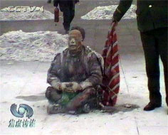</td>
</tr>
<tr>
<td align="center">央视焦点访谈节目的录像：王进东在天安门广场上安稳地坐着，警察拎着灭火毯在他身后静静地站立，等王进东对着镜头喊完台词，才盖上灭火毯；而且王进东两腿中间的塑料汽油瓶在大火中不燃烧、不变形。</td>
</tr>
</tbody>
</table>

央视焦点访谈节目的录像：王进东在天安门广场上安稳地坐着，警察拎着灭火毯在他身后静静地站立，等王进东对着镜头喊完台词，才盖上灭火毯；而且王进东两腿中间的塑料汽油瓶在大火中不燃烧、不变形。
该文披露：“2002年初，李玉强在河北省会法制教育培训中心采访王博时，曾和那里被非法关押的大法学员进行所谓的‘座谈’，当时有法轮功学员问她‘自焚’镜头的种种疑点和漏洞（尤其是已烧得黑焦的王进东，两腿间夹的盛汽油的雪碧瓶子却完好无损）。面对大家有理有据的分析，李玉强不得不承认：广场上的‘王进东’腿中间的雪碧瓶子是他们放进去的，此镜头是他们‘补拍’的。她还狡辩说是为了让人相信是法轮功在自焚，早知道会被识破就不拍了。”

从99年法轮功被迫害后，李玉强就利用中央电视台《焦点访谈》的“记者”身份，多次参与制作对法轮功进行诋毁和诽谤的节目，几乎所有恶性诽谤法轮功的节目，无论文字和电视，无论现场记者和编辑都出自于李玉强之手。值得注意的是，在每次的电视采访中，李玉强从来没有在电视上正面出现过，总是采访侧面、背影或黑光来遮盖其真实相貌。曾有人举报称李玉强身份神秘，与中央“610办公室”关系密切。（注：李玉强由于参与制作“自焚”伪案，已被“追查迫害法轮功国际组织”立案追查。）

<b>国际揭露骗局　中共丑行曝光</b>

尽管中共精心策划了“自焚”事件，但是真相被披露后，这一世纪伪案使中共的丑恶彻底曝光，成为它在国际上无法摆脱的梦魇。

“国际教育发展组织”于2001年8月14日在联合国会议上，就“天安门自焚事件”，强烈谴责中共当局的“国家恐怖主义行径”：所谓“天安门自焚事件”是对法轮功的构陷，涉及惊人的阴谋与谋杀。声明指出：录影分析表明，整个事件是“政府一手导演的”。中共代表团面对确凿的证据，没有辩词。该声明已被联合国备案。

2002年1月北美中文电视台“新唐人”制作了揭露2001年“天安门自焚真相”的纪录片《伪火》（False Fire），该片从各国参赛的六百多部影片中脱颖而出，于2003年11月8日荣获第51届哥伦布国际电影电视节荣誉奖。（以下链接可以观看该影片：http://www.falsefire.com/download/zf.wmv）

<table border="0" cellspacing="3" cellpadding="3">
<tbody>
<tr>
<td align="center"></td>
</tr>
<tr>
<td align="center">新唐人电视台制作之影片《伪火》获第51届哥伦布国际电影电视节荣誉奖（2002年1月制作）。</td>
</tr>
</tbody>
</table>

《基督教科学箴言报》的文章引用海外法轮功发言人的话，说法轮功是禁止自杀的，“自焚”是中共当局制造的骗局。美联社的报导也以法轮功的理论，说中国的报导是诽谤该组织。英国《金融时报》更指出：“没有任何证据表明自焚者是法轮功的人。”

路透社的电讯写道：“北京正在利用身体被烧焦的恐怖形象，来作为与法轮功打传媒战的最新武器。”《华盛顿邮报》发表社论，呼吁布什新政府要在宗教暨政治自由上敢于和中共政府碰硬。

华尔街日报的伊恩•约翰逊（Ian Johnson），一位富有洞察力的新闻记者跟踪这一事件，他的怀疑由报导这起事件的速度引起，他注意到官方媒体“以非同寻常的敏捷报导了‘受害者’的死亡事件，这意味着，或是死亡事件的发生时间比报导中所说的时间要早，或是这个一贯谨慎的媒体已获上级批准快速推出电子报导和电视传送。”

Media Channel的责任主编丹尼•斯盖特（Danny Schechter）撰文指出：“还有比这更富有戏剧性的吗？人们在北京的心脏——天安门广场自焚。CNN有线新闻网当时在那里，警察碰巧手边有灭火器，受害者的极度痛苦的表情被完全地拍摄下来以送交国家电视播放，然后他们被紧急送往医院。尽管政府控制的媒体一反常态地立即发布了这一新闻报导，制作录像却花了一个星期的时间才得以播出。”

在中共借自焚伪案诬蔑迫害法轮功的真相被全世界知晓的今天，中共再次拿出这篇空洞无物的谎言，可谓搬起石头砸自己的脚，明知强弩之末而强为之，欺人欺己。然而，所有以“政治任务”为借口，昧良知释放谎言的中共媒体、相关责任人，都将承担历史责任。

<h1 align="center"><b>从烧伤程度看自焚造假（图）</b></h1>

文: 云莲

  
【明慧网二零一零年八月十九日】发生于二零零一年一月二十三日下午的天安门自焚案是中共栽赃法轮功的惨剧，今天我们从涉案人员的烧伤程度来看一下中共对这起案件的特意安排。

关于天安门自焚，中共媒体的报道都是相同的，更有央视的焦点访谈节目的录像相印证。第一个点燃自身的是王进东，间隔几分钟后，郝惠君、陈果母女与刘春玲、刘思影母女才相继点燃。从中共的报道中我们也可以看出，当时扑灭郝惠君、陈果、刘春玲、刘思影身上的火焰时间总共才一分半钟，给王进东灭火的时间也是不到一分钟。当时每个人都有四至五个灭火器围着灭火。在扑救第一个着火的王进东时，王还拒绝扑救。新华社是这样报道的：“就在众多民警拼尽全力扑救时，这个男子一面继续高喊×教口号，一面不停掀开盖在他身上的灭火毯，拒绝施救。”

<table border="0" cellspacing="3" cellpadding="3">
<tbody>
<tr>
<td align="center"></td>
</tr>
<tr>
<td align="center">央视焦点访谈节目的录像：王进东在天安门广场上安稳地坐着，警察拎着灭火毯在他身后静静地站立，等王进东对着镜头喊完台词，才盖上灭火毯；而且王进东两腿中间的塑料汽油瓶在大火中不燃烧、不变形。</td>
</tr>
</tbody>
</table>

十九岁的陈果烧伤面积达80%，深三度烧伤近50%，头、面部四度烧伤，形成黑色焦痂。十二岁的刘思影全身烧伤面积达40%，头、面部四度烧伤，双眼睑外翻，颜面、双手基本毁损。

据见过郝惠君的人讲，她虽没有女儿烧的严重，也是一只眼睛被烧瞎，剩余的一只眼睛只能通过一个黄豆大的孔去看。嘴唇烧掉了，头上也被烧的不长头发；手脖上缠着一条毛巾，因为手已经没有了，她要用毛巾擦拭嘴里流出的口水。看上去真象一个木偶。她们母女二人是由专人二十四小时护理的。

王进东烧的最轻。虽说被判了刑，但是因为他批判法轮功的态度最为彻底，又接见记者又写书的，不但上电视，还频频到其它非法关押法轮功学员的地方去“现身说法”，见过他的人当然比较多了。他都没怎么烧伤，连头发都是完好无损的。

我们不禁要问，第一个点火的王进东为何烧的最轻？民警发现他“自焚”时，即使一见火焰立马就想到了这是人在自焚，可首先得找灭火器啊。报道中说的明白，五人自焚者中只有王进东是拒绝施救的。不管从哪一个方面分析，第一个点火的都不应该是被烧的最轻的一个，而只能是最严重的一个。这是常情常理。

如果我们照着这个疑问的思路去分析的话，会发现自焚烧伤的“安排”是相当有讲究的。当然这个安排只有导演这件事情的中共知道了，那就是什么人必须烧死，什么人烧伤到什么程度，这个安排必须非常的细致，不然的话回答不了自焚后所造成的现实。

先说死掉的刘春玲母女。美国著名的《华盛顿邮报》在二零零一年二月四日的头版头条发表了调查报道《自焚的火焰照亮了中国的黑幕——当众自焚的动机乃为加强对法轮功的斗争》。邮报记者菲力蒲•潘亲自到开封实地调查，邻居们说从来没有人看见过刘春玲炼法轮功。由此可见，刘春玲的所谓烧死就是内定好的了。因为一个与法轮功没有任何联系的人去自焚，从她身上找到质疑自焚的疑点太多，所以为了造成民众心理承受程度的无比惨痛，就必须要找一个人在现场死掉，刘春玲就这样被中共选中了。这在《伪火》中也有相当明确的揭露，因为央视播放的录像中，导致刘春玲死亡的是抽向她头部的物体；要在迅速扑灭的火焰中把人搞死，恐怕也只有这样一种方式。

<table border="0" cellspacing="3" cellpadding="3">
<tbody>
<tr>
<td align="center"></td>
</tr>
<tr>
<td align="center">央视天安门自焚镜头的慢动作重放</td>
</tr>
</tbody>
</table>

刘思影的死就更好解释了。怎么能留着一个孩子呢？这个孩子有什么样的智力能够面对世界媒体的质疑？她当时十二岁，谁能保证在以后若干年的岁月中，她不会把她所知道的实情说出去？所以，当她被抬上救护车痛苦的呼喊“妈妈”，以及在切开气管后清晰的回答记者用以栽赃法轮功的问题，以煽起民众对法轮功的仇恨后，她的死也就成了必然。须知，刘思影是在脱离生命危险后，没有任何征兆的情况下死掉的。

<table border="0" cellspacing="3" cellpadding="3">
<tbody>
<tr>
<td align="center"></td>
</tr>
<tr>
<td align="center">违反医学常识的央视自焚录像：小女孩刘思影在做了气管切开手术几天后带着插管，声音清晰地接受采访并唱歌。记者不穿卫生服，不戴口罩，直接采访。</td>
</tr>
</tbody>
</table>

郝惠君与陈果母女是自焚者中最漂亮的。特别是陈果，中央音乐学院的大学生，花一般的年龄，花一样的容貌。从她的照片中看到，她长的娟秀苗条，一身的清纯。郝惠君是一个音乐教师，也有着优雅的气质，不俗的外表。那么为什么要留着她们母女？显然是在为这次自焚留下所谓的证明。证明什么呢？这母女二人在对记者的回答中，以及后来在中共为“转化”法轮功学员所扮演的角色中，人们不难看出，这母女二人正在用自己的所谓亲身经历竭力构陷着法轮功。

我们从这个角度很容易看出中共自焚案的造假来。把美好的烧到最令人痛心的程度，把与法轮功没有任何关系的灭口；当然还得找一个能四处游说的代表，他当时还得表现的最为“坚强”，既拒绝施救，又大呼口号。这样的安排可真是煞费苦心。然而人们的一个简单的质疑就把这一切伪装都剥下了：为何最美的烧的面目全非？为何与法轮功没有关系的要当场打死、以后害死？最先点火的为何会毫发无损？

当然还有一个相应的质疑，这些人当时就是被恰到好处的烧到中共所需要的程度的吗？是不是在医院里被做了手脚？

天安门自焚伪案过去九年多了，世人对它的质疑从来没有停止过。有些事恐怕连当事人自己都说不清。而说的清的人能够自曝其丑吗？

不管中共怎么遮掩，造假留下的痕迹总归会被揭穿的。人权团体“国际教育发展组织”于二零零一年八月十四日在联合国会议上，就“天安门自焚事件”，强烈谴责中共当局的“国家恐怖主义行径”：所谓“天安门自焚事件”是对法轮功的构陷，涉及惊人的阴谋与谋杀。声明指出：录影分析表明，整个事件是“政府一手导演的”。中共代表团面对确凿的证据，没有辩词。该声明已被联合国备案。

更令中共极度难堪的是，二零零三年十一月八日由新唐人电视台制作、揭露“天安门自焚真相”的纪录片《伪火》，从各国参赛的六百多部影片中脱颖而出，获得第五十一届哥伦布国际电影电视节荣誉奖。《伪火》以触目惊心的画面和精辟严谨的分析，揭示了“自焚”案的诸多疑点，从而证实了整个事件是中共企图栽赃法轮功而炮制的造假案。

<h1 align="center"><b>阴谋制造自焚案，江泽民视百姓生命为草芥</b></h1>

【明慧网2001年2月2日】中国大使馆官员：

  
有关“天安门广场自焚案”，请转告江泽民政府：

视百姓生命为草芥，制造“自焚案”，必会焚自身。

虽然江泽民政府煞费苦心制造了“自焚案”，以使其在镇压法轮功问题上内外交困、四面楚歌的情况下，背水一战，再度掀起反法轮功的高潮。但是，作茧者必自缚。视他人生命为草芥者必遭天谴。

翻开李洪志老师的《转法轮》，里面有这样的话：“炼功人不能杀生”。在《法轮佛法（在悉尼讲法）》中曾回答弟子的提问：

“问：那第三个问题就是书里边说到杀生问题。杀生是一种很大的罪业，一个人他自杀算不算罪呢？

答：算罪。现在这个人类社会不好了，什么千奇百怪的事情都出现了。……人的生命是有安排的，你破坏神的整体全局的顺序，通过你做的对社会尽的义务，人与人之间有这样的关系连带着。死了，那么整个这个顺序是不是打乱神的安排？你给他打乱了他不放过你呀，所以自杀是有罪的。”

既然李洪志老师不让学员自杀或杀人，那么江泽民政府就只有开动它的造谣机器去造谣了。

中国的国家安全局有这样的机构：专门制造谣言。

江泽民政府制造的谣言丰富而邪恶，诸如“香山自杀”、“上千人自杀”、“天安门自焚”等，其用心何在呢？就象它手下的打手们所称的：“打死白打，说你自杀”。因为只要人民轻信它们的谣言，它就可以大开杀戒，而无所顾忌。还可以煽动不明真象的群众仇恨法轮功。一举多得，何乐而不为呢？

可是这种邪恶的如意算盘却是打错了。对江泽民政府的造谣诬陷，先不说千万法轮功修炼者必知其险恶用心，更有千万看过法轮功书籍、了解法轮功的人士，深知法轮功人士必不会做出残酷对待生命的事情。而自焚案中多处的漏洞、疑点(请看所附文章：天安门广场自焚”疑点大全)，更让人看到江政府导演的闹剧的拙劣。

无论现在和将来，陷害他人者必将受到应有的报应。

我们奉劝那些江泽民的帮凶们，尽快认清不惜制造自焚案，陷害善良民众的江政府的本质，弃恶从善，不要跟江泽民一条道走到黑。否则，你们也终将偿还你们所做到一切。

玩火者必招自焚也。

（华盛顿DC法轮功学员） 

<h1 align="center"><b>中共制造“自焚”惨案，新华社造谣陷害法轮功</b></h1>

文/法轮大法信息中心

  
【明慧网二零零一年一月二十三日】 自1999年5月中共公安部抛出“香山集体自杀”的谣言以来，江泽民一伙陷害法轮功学员“自杀”的谣言和行动一直都在暗中多方进行，至今从未曾间断过。大陆各地也一再传出大陆公安和地方政府在严刑逼供时威胁法轮功学员说“上面说了，打死就算自杀”的控诉。

  
日前新华社抛出所谓法轮功学员春节之际在天安门广场“自焚”的诽谤“新闻”，其用心无非在于为江泽民把法轮功说成“邪教”和进一步血腥镇压法轮功制造依据。

所有认真读过《转法轮》的人士都非常清楚：法轮功严禁杀生。自1992年5月法轮功问世以来，亿万法轮功学员一直都在坚持“真善忍”的修炼原则，反对任何形式的杀生，因此更不会如此残忍地对待自己的生命。

众所周知，江泽民政权贪污腐败，蔑视宪法法律和百姓的基本人权，已经把改革开放中的中国大陆搞得哀鸿遍地、危机四伏。下岗工人示威、农民绝望而暴动、军队为瓜分钱财火并，民怨民冤如积蓄中的火山岩浆，抗议之声此起彼伏。18个月以来，无端受到残酷镇压的法轮功学员持续和平请愿，自然形成了天安门广场一个最为引人注目的请愿团体，但法轮功决不是因投诉无门而在天安门广场请愿的唯一一个民众团体。新华社抛出的所谓天安门“自焚”惨案，是中共直接或者间接地一手造成的，现在他们不但不思悔过，反而拿来进一步栽赃法轮功，实为丧尽天良、无道致极。

关心时事的人们可能还记忆犹新，不久前中共外交部刚刚对外声称“没有一个人因为修炼法轮功而被关进劳改营”就爆出了仅马三家子一个劳教所便关有数百名法轮功学员的媒体新闻。加拿大公民张昆仑教授因炼法轮功而被多次拘留、施以电刑并被判劳教三年的大量事实报道，更是对中共谎言宣传的有力驳斥。

在此，我们严肃声明，新华社所谓的自焚报道纯属栽赃陷害。法轮功学员从来没有、今后也决不会采取任何形式的杀生行为。同时，我们呼吁各国媒体，警惕中共宣传中一贯使用的欺骗伎俩，以免被江泽民利用，卷入血腥肮脏的红色政治。

（2001年1月23日午）
