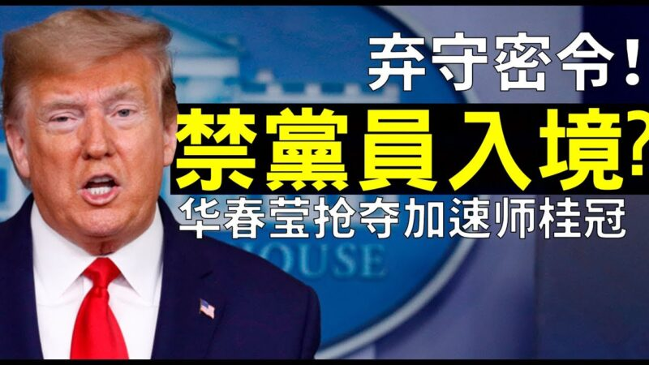

<a name=top>

<h1>美拟禁中共党员及家属入境</h1>

<h1><a href=https://github.com/gofanben/gm/blob/master/3tgd.md>三退途徑 https://bit.ly/2DRwJoU</a></h1>

<h3><a href=https://bit.ly/2RQM1hX>(请收藏)更多免翻 https://bit.ly/2RQM1hX</a></h3>

<a href =#6>美拟禁中共党员入境 党媒直呼“比断交严重”</a>

<a href =#5>美拟禁中共党员及家属入境 女袁木回应火了</a>

<a href =#4>多消息证实美拟全面反共 制裁党员及家属</a>

<a href =#3>中科院核安全所90多人集体辞职 网曝内幕</a>
	
<a href =#2>传中共党员将被禁止入美国？网络欢腾</a>

<a href =#1>美拟禁中共党员及家属入境 “退党”成热搜</a>
	

<a name=6>
<h1 align="center"><b>美拟禁中共党员入境 党媒直呼“比断交严重”</b></h1>

有消息称，美国拟全面禁止中共党员及亲属入境，已经在美国的要驱逐出境，受影响人数高达2.7亿。(NOEL CELIS/AFP via Getty Images)

【新唐人北京时间2020年07月17日讯】美国正在起草下一步制裁中共方案，有知情人士透露，美国拟全面禁止中共党员及亲属入境，已经在美国的要驱逐出境，受影响人数高达2.7亿。这个爆炸性消息引发网络热议，关于“<a href="https://www.ntdtv.com/gb/退党.htm">退党</a>”的搜索直线上升，引发<a href="https://www.ntdtv.com/gb/中共当局恐慌.htm">中共当局恐慌</a>，党媒直呼这“比中美断交还严重”。

美中紧张关系持续升温之际，《纽约时报》7月15日报导，有消息人士透露，美国政府正考虑以2017年曾经针对穆斯林所使用的《移民和国籍法》（Immigration and Nationality Act），全面禁止中国共产党党员及他们的家人赴美。

报导引述多名不具名的知情人士说，这份仍在起草中的总统公告，可能还会授权美国政府，撤销目前身在美国的中共党员及其家属的签证，将他们驱逐出境。另外，这项草拟中的公告还可能限制中共解放军成员和国企高管前往美国，他们中的很多人都是党员。

消息说，该计划的细节尚未最后敲定，川普是否接受该计划目前无法确认。

纽约时报这篇报导引发国际舆论关注，不少媒体转发了相关消息。中共声称有9191.4万党员，美政府内部初步估算，可能受到影响的中国人高达2.7亿。

美国拟禁止中共党员入境的爆炸性消息，引发<a href="https://www.ntdtv.com/gb/中共当局恐慌.htm">中共当局恐慌</a>。中共官媒《环球网》发文回应称，如果美国的共产党禁令是真的，这比中美断交还要严重。文章强调中共当局要做最坏打算。

值得一提的是，中共党刊《求是》杂志15日发表了中共中央总书记习近平的文章，再次强调必须坚持党的领导。有分析指，中共面临内忧外患，党内四分五裂，习近平权威遇到严重挑战，此文意在寻求党内支持。习近平把自己和中共捆绑，要求保党保权，然而，稍有理性的人都能看清当前的形势，有谁会愿意跟随中共一同埋葬呢？

有意思的是，与中共当局反应形成强烈对比的是，网路上对于美国拟禁止中共党员入境的消息一片欢腾和叫好声。

推特上华人网友Willson评论道：“这才叫精准打击，把老百姓和党员分开，结果老百姓还因为党员被制裁叫好。”

中国网民感谢川普：“中国老百姓没有一个不欢迎这个政策的吧。我感动得哭了。”

“中共官员的恶梦来了。”

“这是正道，必须查清政治背景。中共党员及其家属入境美国必须查清背景。”

也有西方网民说“早该如此”（long overdue），“禁止共产党员进入美国的决定非常正确！既然他们相信共产主义，他们就和纳粹一样，没有资格与自由世界交往！”

还有网友劝中共党员尽快<a href="https://www.ntdtv.com/gb/退党.htm">退党</a>，“中共党员是一种政治身份，当制裁是针对这种政治身份、意识形态时，你就不属于人民了。现在退党也许还来得及。”

“如此大快人心的事，定要奔走相告。魔鬼的同盟者，就是魔鬼，无需辩解。如有悔悟者，就应该怎么进去的，怎么退出来，这才是负责任的表现。”

据悉，自7月15日起，Google Trands上“退党”的搜寻急速飙升，而且中国范围内的搜索趋势大增。有网友分析，能用中国ip搜索谷歌的应该是中共特权人士，多数是中共高级党员，这个现象表明，美国禁中共党员入境的震慑力相当大，已引起中共党内恐慌。

中国范围内的搜索趋势。（Google Trends网页截图）

总部位于纽约的<a href="https://www.ntdtv.com/gb/全球退党服务中心.htm">全球退党服务中心</a>表示，由他们发出的“退党证书”可获得美国当局承认。

该中心主席易蓉对新唐人说：“今天早上就有四个人打电话到（退党）办公室，说要领退党证书。他们是从美国不同的地方打来的，他们说是看到这个报导了。”

根据美国移民法律，如果申请入籍者隐瞒自己是共产党员，通过欺诈而入境、入籍，一旦遭到举报，可能被吊销绿卡，并遭遣返。

（记者罗婷婷报导/责任编辑：戴明）

网址转载：https://www.ntdtv.com/gb/2020/07/17/a102895682.html

<a href=#top><h6 align="right">回上方</h6></a>

<a name=5>
<h1 align="center"><b>美拟禁中共党员及家属入境 女袁木回应火了</b></h1>

中共外交部发言人华春莹。（视频截图）

【新唐人北京时间2020年07月17日讯】美中关系持续恶化之际，有关川普（<a href="https://www.ntdtv.com/gb/特朗普.htm">特朗普</a>）政府正在考虑全面禁止<a href="https://www.ntdtv.com/gb/中共党员.htm">中共党员</a>及其家属入境美国的消息，刷屏网络，Google的大数据显示搜寻“退党”的次数大增。有女袁木之称的中共外交部发言人华春莹回应称，感到“可悲”，引发网民狂轰。

继《纽约时报》15日报导有关美国拟禁止<a href="https://www.ntdtv.com/gb/中共党员.htm">中共党员</a>及其家属入境美国后，多家美媒也从各自的消息源证实，美国政府确实在讨论对所有中共党员及家属的旅行禁令。

据悉正在草拟中的这项总统令，除了禁止中共党员和其家人来美，或还授权有关政府部门注销已经在美的中共党员及其家人的签证，导致其被驱逐出境，以及可能禁止中共党员的子女就读美国的大学。

《华尔街日报》引述知情人士的话说，<a href="https://www.ntdtv.com/gb/川普政府.htm">川普政府</a>高级官员正在讨论禁止中国共产党党员及其家人访美的计划，签证禁令的具体细节仍在讨论中，包括是否只适用于尚未在美国的中共党员和家庭成员；还是将在美国的中共党员及其家属一起驱逐出境。

路透社引述消息人士表示，讨论此事的美国高级官员已经开始散发可能的总统令草案，但审议仍处于初期阶段，尚未将这个议题提交给总统。跨多个联邦机构的美国官员正在参与这一讨论，其中包括考虑是否阻止共产党员的子女在美国读大学。

近年来，前往美国的中国人逐渐增多，2018年就有300万。中共声称有9200万党员，美国政府内部的初步估算，这一制裁计划涉及的人数将达2.7亿人。

《纽约时报》引用专家的声称，因为相关事件涉及人数巨大，会引起中国人的舆论愤怒。

但事实恰恰相反，这个爆炸性的新闻一出，网络上一片叫好声和欢腾声，包括受到严控的大陆微博上。

<strong>网友：比港人喊“全党死清光”更绝</strong>

中国网民感谢川普说这一招老百姓都欢迎，西方网民也说“早该如此”（long overdue）。

有香港网民留言说，美国这一招比港人喊出的“全党死清光”更绝 ！

也有人赞叹“川普干了一件名垂青史的大事！以事论事，这件事必须点一万个赞赞赞赞赞……”

不少网友说，“中共官员的恶梦来了。”

“中国老百姓没有一个不欢迎这个政策的吧。感动得哭了。”

“这是正道，必须查清政治背景。中共党员及其家属入境美国必须查清背景。”

“如此大快人心的事，定要奔走相告。魔鬼的同盟者，就是魔鬼，无需辩解。如有悔悟者，就应该怎么进去的，怎么退出来，这才是负责任的表现。”

“中共党员是一种政治身份，当制裁是针对这种政治身份、意识形态时，你就不属于人民了。现在退党也许还来得及。”

还有海外华人说，“我知道一个朋友的父母来美国后申请绿卡，因为女儿是美国公民，很快就进入面谈，移民官问老夫妻两人是不是共产党员，他们说‘是的’，结果，移民官告诉他们回去退党6年后再来。”

<strong>女袁木华春莹称“可悲”引嘲讽</strong>

7月16日下午中共外交部举行例行记者会。华春莹被问到相关问题时，她说，对于有关言论的真假，无从核实，如果报导属实，只能让人感到美国的“可悲”。“作为世界上最强大的国家，美国还剩下什么？它会给世界留下什么样的印象？”

华春莹并反问提问的外媒记者，对于美国近期作出一系列行为的看法，是否认为美国的做法恰当。

网民纷纷嘲讽华春莹：“美国不欢迎共产主义渣滓。”“花大妈面露桃花心里悲，美国的房子怎么办?”“人家不欢迎你到人家家里去，谁可悲啊！”“中共党员干部的巨额财产和家属子女都在美国及西方各国。华叫春骂得越大声，说明他们越害怕。”

“华春莹自己在美国就有房，今天语气还算镇定，但说辞就软了，其实可悲的是他们这些人，反美工作赴美生活玩不转了。”“她肯定悲啦，她苦心经营让孩子去美国落户然后自己在美国安享晚年的计划都泡汤了。”

<strong>胡锡进“强烈不满”引抨击</strong>

环球时报主编胡锡进在微博上表达“强烈不满”，声称“这种大周旋将给今天年轻人的人生环境打下烙印”。

网友留言嘲讽，“谈个党员被禁，你都能扯到年轻人身上，绑架年轻人，你可真中肯”。“影响到你的利益了吧”？“老胡你天天骂美国这下如愿了吧，这个结果也是你想要的。这样也不会骂美国是工作，去美国是生活了。”

相关消息在华人圈中也引起轩然大波，Google的大数据显示，搜寻“退党”的次数开始大幅增加。

据中共公布的最新统计数据，中共党员人数为9191.4万，推特网民纷纷表示，“这位数字真吉利”，因为9191.4的谐音是“就要就要死”，这真是天意，天要灭中共。

（记者李韵报导/责任编辑：戴明）

网址转载：https://www.ntdtv.com/gb/2020/07/17/a102895681.html

<a href=#top><h6 align="right">回上方</h6></a>

<a name=4>
<h1 align="center"><b>多消息证实美拟全面反共 制裁党员及家属</b></h1>

图为美国签证。(Fotolia)

【大纪元2020年07月17日讯】（大纪元记者徐简综合报导）消息人士透露，川普（特朗普）政府正在考虑全面禁止中共<a href="https://www.epochtimes.com/gb/tag/%E5%85%9A%E5%91%98.html">党员</a>及其<a href="https://www.epochtimes.com/gb/tag/%E5%AE%B6%E5%B1%9E.html">家属</a>入境美国，成为华人圈中热门话题。周四（7月16日），多家美国媒体证实了这一信息并非空穴来风。

据悉正在草拟中的这项总统令，除了禁止中共<a href="https://www.epochtimes.com/gb/tag/%E5%85%9A%E5%91%98.html">党员</a>和其家人来美，或还授权有关政府部门注销已经在美的中共党员及其家人的签证，导致其被驱逐出境，以及可能禁止中共党员的<a href="https://www.epochtimes.com/gb/tag/%E5%AD%90%E5%A5%B3.html">子女</a>就读美国的大学。

继《纽约时报》率先报导了美国拟禁止中共党员及其<a href="https://www.epochtimes.com/gb/tag/%E5%AE%B6%E5%B1%9E.html">家属</a>入境美国后，多家美国媒体也从各自的消息源证实，美国政府确实在讨论对所有中共党员及家属的旅行禁令。

<h2>入境禁令或涉近2.7亿人 家属<a href="https://www.epochtimes.com/gb/tag/%E5%AD%90%E5%A5%B3.html">子女</a>皆受限</h2>

知情人士对《华尔街日报》说，川普政府高级官员正在讨论禁止中国共产党党员及其家人访美的计划，有关潜在签证禁令的讨论尚处于初期阶段，也没有实施时间表，目前不知道川普是否会批准这一计划，但此举将进一步加剧华盛顿和北京之间的紧张关系。

知情人士还说，签证禁令的具体细节仍在讨论中，包括是否只适用于尚未在美国的中共党员和家庭成员；还是追溯使用，如果追溯，可能导致已在美国的中共党员及其家属一起被驱逐出境。

而路透社的消息人士在不愿透露姓名的情况下表示，讨论此事的美国高级官员已经开始散发可能的总统令草案，但审议仍处于初期阶段，尚未将这个议题提交给总统。

报导说，跨多个联邦机构的美国官员正在参与这一讨论，其中还包括考虑是否阻止共产党员的子女上美国的大学。

前往美国的中国人逐渐增多，2018年就有300万。据美国政府内部的估算，这一制裁计划涉及的人数将达2.7亿人。

<h2>共产党“就要就要死”？</h2>

这一消息已经在华人圈中引起轩然大波，Google的大数据显示，搜寻“<a href="https://www.epochtimes.com/gb/tag/%E9%80%80%E5%85%9A.html">退党</a>”的次数开始增加。

有海外华人说，“我们很有可能在不久的未来见证一次川普版‘清党’运动的历史，也是一个真正脱钩的开始……”

6月30日，中共当局公布最新统计的中共党员人数为9191.4万，海外推特网民或发推或留言表示，“这位数字真吉利”，因为9191.4的谐音是“就要就要死”，并指“这真是天意”，认为是天要灭中共。

责任编辑：林妍

网址转载：https://www.epochtimes.com/gb/20/7/16/n12261505.htm

<a href=#top><h6 align="right">回上方</h6></a>

<a name=3>
<h1 align="center"><b>中科院核安全所90多人集体辞职 网曝内幕</b></h1>

今年6月，中国科学院核能安全技术研究所九十多名科研人员集体辞职，引发社会关注。（官网图片）

【大纪元2020年07月17日讯】（大纪元记者张北综合报导）今年6月，中国科学院核能安全技术研究所（下简称核所）的九十多名科研人员<a href="https://www.epochtimes.com/gb/tag/%E9%9B%86%E4%BD%93%E8%BE%9E%E8%81%8C.html">集体辞职</a>，引发社会关注。该所人事处承认员工是被挖走，更有消息指所长吴宜灿因私鼓动员工对抗院方，离职的人都去了其在外成立的公司。

核所是中国科学院合肥物质科学研究院的下属研究所。综合陆媒报导，核所最多曾拥有500名科研人员，但这几年人才快速流失，到去年只留200人。此次90多人辞职后，所里仅剩100人左右。

辞职的人中大多都是博士毕业，拥有事业编制。他们一个月工资一万多元人民币，还享有位于科学家园的福利房（2011年竣工，均价17,000元/平方米）。

据《中国经营报》报导，<a href="https://www.epochtimes.com/gb/tag/%E9%9B%86%E4%BD%93%E8%BE%9E%E8%81%8C.html">集体辞职</a>事件的导火索是院方强制更换核所自行聘请的保安，核所科研人员认为自身权益被侵犯。

一名疑似核所职工的用户在知乎上写道：“院方在不（进行）任何提前沟通情况下拆门禁，还有不少保安巡逻，把研究所前后门锁住，对科研人员没有一点尊重，有些女同事都惊恐哭了。”

而研究院的一名中层领导则表示，核所有涉密的项目，换正规的保安公司和门禁卡，才能防止外人进入工作区域。这一说法似在暗示涉密项目的安全性已受到威胁。

与此同时，知乎上多名自称是前／现核所员工的用户发帖曝光此次事件<a href="https://www.epochtimes.com/gb/tag/%E5%86%85%E5%B9%95.html">内幕</a>。

有人说，核所此次离职事件并不仅仅是因为换保安这个表面原因。“换了保安后，科研资料还能不能带出来？毁掉一些不想示人的材料、账目就不那么容易了。”

一名认证为科大讯飞软件开发工程师的用户表示，自己是核所的前科研人员。据他爆料，集体辞职事件或由中国科学院院士、核所所长吴宜灿组织，与研究院改革有关。

研究院此次改革，将一些管理、财务等问题收归院一级统一管理，这影响了研究所领导的权力，吴宜灿便利用他们对改革的不满，劝说他们跳槽到自己在外的公司上班。

爆料者还表示从研究所辞职的流程非常繁复，他当年只是所里劳务派遣的硕士，离职时找了32个领导签字，流程走了半个月；如果达到组长级别，辞职甚至需要提前两年申请。现在这么多人要求在短时间内离职，如果没有领导允许，仅签字一项就会被耽搁很久。

还有员工透露核所以前常常周六开会，进门就有人收走手机。今年5月，所里开会动员员工辞职，会间举例跳槽的某女同事买了宝马，某男同事买了保时捷，讲话人的ppt最后一页放了辆名车，并喊大家“快上车”，很多同事当时表了忠心和决心。

核所的在读研究生成了被这一事件殃及的池鱼。有人说，“我们这帮无辜的学生才是最大的受害者！本想好好读个研，招谁惹谁了？？突然导师就辞职了，内网还断网了，几乎所有的科研资料都用不了，这种状态已经持续2个多星期了，毕业遥遥无期！怎么就这么倒楣摊上这种事！！！”

责任编辑：高静

网址转载：https://www.epochtimes.com/gb/20/7/16/n12261417.htm

<a href=#top><h6 align="right">回上方</h6></a>

<a name=2>
<h1 align="center"><b>传中共党员将被禁止入美国？网络欢腾</b></h1>

中国有超过270万中国公民持有10年美国签证。(Mark RALSTON/AFP)

【大纪元2020年07月16日讯】（大纪元记者徐简综合报导）在美中紧张关系升温之际，7月15日外媒报导，<a href="https://www.epochtimes.com/gb/tag/%E7%BE%8E%E5%9B%BD.html">美国</a>政府考虑全面禁止中国共产党<a href="https://www.epochtimes.com/gb/tag/%E5%85%9A%E5%91%98.html">党员</a>及其家人前往<a href="https://www.epochtimes.com/gb/tag/%E7%BE%8E%E5%9B%BD.html">美国</a>，已经在美国的要驱逐出境。中共声称有9200万党员，美政府内部初步估算，可能受到影响的中国人高达2.7亿。

《纽约时报》于15日引述消息人士的话透露，美国政府正考虑以2017年曾经针对穆斯林所使用的《移民和国籍法》（Immigration and Nationality Act），全面禁止中国共产党<a href="https://www.epochtimes.com/gb/tag/%E5%85%9A%E5%91%98.html">党员</a>及他们的家人赴美。

《纽约时报》报导还引用专家的说，因为涉及人数巨大，会引起中国人的舆论愤怒。

但事实好像恰恰相反，这个爆炸性的消息一出，引发网络上的一片叫好声和欢腾。中国网民感谢川普，说他这一招老百姓都欢迎，西方网民也说“早该如此”（long overdue）。

有的香港网民留言说，美国这一招比港人喊出的“全党死清光”更绝 ！

也有人说，“中共官员的恶梦来了。”

“中国老百姓没有一个不欢迎这个政策的吧。我感动得哭了。”

“这是正道，必须查清政治背景。中共党员及其家属<a href="https://www.epochtimes.com/gb/tag/%E5%85%A5%E5%A2%83.html">入境</a>美国必须查清背景。”

还有海外华人谈体会说，“我知道一个朋友的父母来美国后申请绿卡，因为女儿是美国公民，很快就进入面谈，移民官问老夫妻两人是不是共产党员，他们说‘是的’，结果，移民官告诉他们回去退党六年后再来。”

有网民预测，“重点不在于拒签，是为进一步升级做铺垫。”

“如此大快人心的事，定要奔走相告。魔鬼的同盟者，就是魔鬼，无需辩解。如有悔悟者，就应该怎么进去的，怎么退出来，这才是负责任的表现。”

“那些硬说中共党员就是中国人民的人，怎么看待这个禁制令？”

“中共党员是一种政治身份，当<a href="https://www.epochtimes.com/gb/tag/%E5%88%B6%E8%A3%81.html">制裁</a>是针对这种政治身份、意识形态时，你就不属于人民了。现在退党也许还来得及。”

“ccp的党员就是无条件服从ccp的木偶，只是ccp的工具、传声筒、打手，没有资格享受人的尊严和权利。”

“现在加入共产党这帮人，没有一个动机是纯正的，是一帮精致利己主义者，道德品质是十四亿中最坏的那帮人。因为现在的中国，谁还信共产主义，别说这帮普通党员，就是那些以习近平为首的所谓国家领导人有信的吗？今天凡是加入共产党哪一个不是想在这粪坑中捞点啥？”

“有钱办到美国的投资移民的中国人通常都是党员。因为不是党员就很难赚钱。马云、马化腾等企业家也早就入党了。政府部门的工作人员相当比例是党员，非党员很少。”

“禁止共产党员进入美国的决定非常正确！既然他们相信共产主义，他们就和纳粹一样，没有资格与自由世界交往！”

也有网民质疑，中共党员人数庞大，实际操作起来没那么简单，另外一些网民纷纷支招。

“很简单啊，<a href="https://www.epochtimes.com/gb/tag/%E5%85%A5%E5%A2%83.html">入境</a>的时候让入境人员在自己的主要社交媒体上发表一条，主题是‘我郑重申明我不是中共党员’的信息，如有虚假愿意承担入境国一切的处罚，然后才可以入境。当然如果后续确实被发现造假，那就处罚喽！ ”

“根本不用担心美国如何辨别共产党员，记得美领馆有个部门，会对申请美签人员进行抽查，比如打电话去他单位核实他的身份和经济状况，同理，一个电话就可以知道他是否在申请材料上撒谎，一旦发现撒谎，美国<a href="https://www.epochtimes.com/gb/tag/%E7%AD%BE%E8%AF%81.html">签证</a>的规定是终身拒签，即使入籍美国后，也会被撤销公民身份，遣返回国。”

“最好的方式就是在<a href="https://www.epochtimes.com/gb/tag/%E7%AD%BE%E8%AF%81.html">签证</a>申请表上增加一项‘是否共产党员’，如果填‘是’，一律拒签，如果填‘不是’、后面查出来是，一律法办。”

“让他们看六四纪录片、九评、解体党文化，过得了测谎的留下，过不了得给多一次机会，不行的驱逐。”

责任编辑：叶紫微

网址转载：https://www.epochtimes.com/gb/20/7/16/n12260330.htm

<a href=#top><h6 align="right">回上方</h6></a>

<a name=1>
<h1 align="center"><b>美拟禁中共党员及家属入境 “退党”成热搜</b></h1>

2019年10月20日，纽约部分法轮功学员在布鲁克林举行游行，声援3.4亿勇士三退（退出中共党、团、队）。（戴兵／大纪元）

【大纪元2020年07月17日讯】（香港大纪元记者张晓慧综合报导）在中美关系紧张升温之际，7月15日外媒报导，美国政府考虑全面禁止中国共产党党员及其家人前往美国，已经在美国的要驱逐出境。中共声称有9,200万党员，美国政府内部初步估算，可能受到影响的中国人高达2.7亿人。

《纽约时报》报导指，建议方案也针对中共军队及国企高层，这些人大部分也是<a href="https://www.epochtimes.com/gb/tag/%E4%B8%AD%E5%85%B1%E5%85%9A%E5%91%98.html">中共党员</a>。这项计划尚在讨论阶段，仍有机会被美国总统川普否决。白宫国家安全委员会及国务院发言人均拒绝评论消息，国土安全部发言人则未回复记者提问。

消息传出，“<a href="https://www.epochtimes.com/gb/tag/%E9%80%80%E5%85%9A.html">退党</a>”一词的搜索热度激增，“Google趋势”的关键词热度显示，到16日晚8时热度已经升至满分100分，而且这些搜索绝大部分来自中国大陆。

<h2>禁止共产党及附属组织成员移民美国</h2>

美国现行的《移民法》已经禁止共产党员移民美国，然而并没有禁止共产党员入境。冷战时期通过的美国《移民及国籍法》（Immigration and Nationality Act of 1952），规定共产党员及其附属组织成员不得移民美国。1990年的《移民法》（Immigration Act of 1990）也仍然保留禁止共产党员移民的条文。

虽然有不少中国大陆移民隐瞒自己的共产党员身份从而取得居留权，但也有移民后共产党员身份暴露而被惩罚的案例。2016年1月14日，伊利诺伊州瑞柏市（Naperville）华裔男子林路（Lu Lin，音译）因申请美国籍时隐瞒自己的共产党员身份及与中共情报部门的关系，被美国联邦政府控以“移民欺诈”，并在2018年被取消公民身份。

《纽约时报》报导还引用专家的话说，因为涉及人数巨大，会引起中国人的舆论愤怒。但事实好像恰恰相反，这个爆炸性的消息一出，引发网络上的一片叫好声和欢腾。大陆网民感谢川普，说他这一招老百姓都欢迎，西方网民也说“早该如此”（long overdule）。

有香港网民留言说，美国这一招比港人喊出的“全党死清光”更绝！也有人说，“中共官员的恶梦来了。”“中国老百姓没有一个不欢迎这个政策的吧。我感动得哭了。”“这是正道，必须查清政治背景。<a href="https://www.epochtimes.com/gb/tag/%E4%B8%AD%E5%85%B1%E5%85%9A%E5%91%98.html">中共党员</a>及其家属入境美国必须查清背景。”

有网民预测，“重点不在于拒签，是为进一步升级做铺垫。”

“如此大快人心的事，定要奔走相告。魔鬼的同盟者，就是魔鬼，无需辩解。如有悔悟者，就应该怎么进去的，怎么退出来，这才是负责任的表现。”

由于美国并无中共党员登记资料，难以辨别谁是共产党员，网民纷纷为美国想办法，指可以要求入境的人在其主要社交媒体上声明自己不是共产党员；美国领馆在发出签证时，也可以打电话向其工作单位核实等。

在香港的连登讨论区上，网民对此热烈讨论。不少网民留言引用法轮功学员的口号“<a href="https://www.epochtimes.com/gb/tag/%E9%80%80%E5%85%9A.html">退党</a>保平安”。

<h2>大纪元：为退出中共组织者作证</h2>

在2004年《大纪元时报》发表了系列社论《<a href="https://www.epochtimes.com/gb/nf3541.htm">九评共产党</a>》，揭开退出中共运动的序幕。至今为止，已有超过3.6亿人在<a href="https://tuidang.epochtimes.com/">大纪元退党网站</a>宣布退出中共及其附属组织共青团、少先队。

2005年1月，大纪元发表郑重声明：“如果有一天，神指使人类的谁对共产党清算时，也一定不会放过那些所谓坚定的邪恶党徒。我们郑重声明：所有参加过共产党与共产党其它组织的（被邪恶打上兽的印记的）人，赶快退出，抹去邪恶的印记。一旦谁对这个魔教清算时，大纪元储存的纪录可以为声明退出共产党和共产党其它组织的人作证。”

<h2><a href="https://www.epochtimes.com/gb/tag/%E9%80%80%E5%85%9A%E8%AF%81%E4%B9%A6.html">退党证书</a>获美移民官认可</h2>

洛杉矶退党中心的负责人李海伦介绍，退党中心帮助不少申请居留权的中国人办理<a href="https://www.epochtimes.com/gb/tag/%E9%80%80%E5%85%9A%E8%AF%81%E4%B9%A6.html">退党证书</a>，并获得移民官认可。她介绍一个案例是来自大陆的单先生，他曾前往《大纪元时报》在洛杉矶的办公室要求实名声明退党，并取得退党中心的证书。2009年，单先生因为没有合法居留身份被移民局警察逮捕，但他凭借退党证书以及海外的民运党派中国民主党的入党证书，在法庭自我辩护一小时后取得了政治庇护许可。

2018年4月22日，纽约法轮功学员集会纪念“4·25”和平上访19周年，呼吁解体中共迫害，支持退党自救。全球退党服务中心主席易蓉为18位公开退出中共党、团、队的华人颁发三退证书。（戴兵／大纪元）

有纽约律师也对大纪元记者表示，为中国大陆人办理移民手续时，会帮助他们取得“退党服务中心”的证书，该证书是受移民官认可的法律支持文件。

<h2>袁弓夷游说 将共产党定为犯罪组织</h2>

香港实业家袁弓夷近来也向美国政界游说，希望推动“天灭中共运动”，主要目标是推动美国立法将中共定性为反人类犯罪集团，再推倒中国的网络防火墙，“让老百姓知道，原来共产党是非法的，不敢参加（中国共产党），可以退党就退党，共产党这个机器就走不动，这是我的目标。”

袁弓夷说，共产党员不可以拿共产党的好处、特权，执行共产党的犯罪命令，一边称自己是好人，因为共产党就是一个犯罪组织。

<h2>“<a href="https://www.epochtimes.com/gb/tag/%E9%80%80%E5%85%9A%E4%BF%9D%E5%B9%B3%E5%AE%89.html">退党保平安</a>”深层意义</h2>

大纪元15年前的郑重声明，提供在共产党被清算时，可以证明自身不认同共产党的方法，免于被一起清算的厄运。今年3月10日发表的特稿更进一步说明“<a href="https://www.epochtimes.com/gb/tag/%E9%80%80%E5%85%9A%E4%BF%9D%E5%B9%B3%E5%AE%89.html">退党保平安</a>”的深层意义。

现在疫情有迹象将进入新一轮的大爆发。刚逃离香港到美国的香港大学病毒专家闫丽梦警告病毒没有治疗的疫苗。大纪元特稿《<a href="https://www.epochtimes.com/gb/20/3/10/n11928818.htm">病毒针对共产党而来</a>》一文，再次提醒人们跟党走的危险性。

文章开篇写道：“今年以来，中共肺炎（俗称武汉肺炎、新冠肺炎）因为中共的隐瞒而迅速向全球蔓延，演变为令世界惊恐的瘟疫。瘟疫虽无情，但并非无迹可循，尤其是在中国之外的扩散趋势，鲜明地点出了病毒的风向和目标：它是冲着共产党而来的。”

文章分析了全世界在今年3月份疫情的受灾情况：中共的“亲密战友”伊朗疫情惨重；“一带一路”盟友意大利成疫情最严重的欧洲国家；中共的欧洲伙伴国疫情严峻。“相较于欧美中东各国，中国大陆周边地区的疫情更为直观地映射出与中共的亲疏远近。例如截至3月9日，中国近邻韩国累计确诊7,478例，名义上是中国之外疫情第二严重的国家。与中国有大海相隔的日本累计确诊512例，而与大陆相邻的香港和台湾，累计确诊分别为115例和45例。台湾死亡1例，香港死亡3人。而且香港的早期病例全是大陆过去的，后来感染的还包括防暴警察及亲政府人士。”

最后文章写道，武汉瘟疫虽给世人带来病痛甚至死亡，但历史和现实都指出消解瘟疫、趋吉避凶的明路：那就是认清灾厄的根源，明晓中共的真相；脱离中共、拒绝中共，就能远离灾厄、不受瘟疫侵害。

中共肺炎病毒是冲着共产党而来的，认清灾厄的根源，退出中共党、团、队组织就能远离灾厄，常保平安。图为2017年5月12日纽约万人共庆法轮大法日，游行队伍中“天要灭中共 退党保平安”的横幅穿过曼哈顿。（戴兵／大纪元）

《九评》编辑部已指出：“神的慈悲与威严同在！神在看着每个人的内心。一个人在此时此刻的抉择和所为，就会决定他（她）的未来。”

病毒仍在肆虐，警钟再次响起！曾经加入中共组织的人，可在大纪元网站发声明，退出中共党团队。远离中共，脱离中共，拒绝中共，作为个人、组织和国家，都可以因此而回避病毒侵害，选择美好未来。

责任编辑：连书华

网址转载：https://www.epochtimes.com/gb/20/7/16/n12261905.htm

<a href=#top><h6 align="right">回上方</h6></a>
