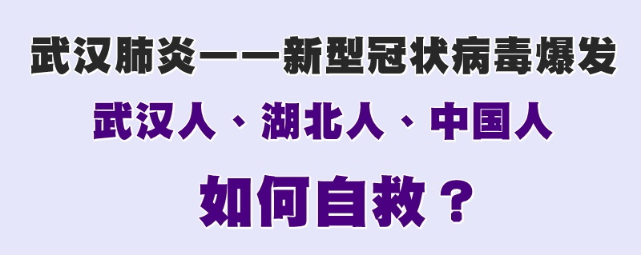

 

<h1>免疫有良方</h1>

<!--
<a href="http://61.228.177.38/300">-->
 

<h3>请收藏本网址，连上免翻视频 https://bit.ly/3ezRQKo </h3>
	 
 
<a name=top>
 

<h3><a href="https://bit.ly/3asSXIA">请多传破网软件，使更多的人了解真相从而得救，这是给自己积福德。 https://bit.ly/3asSXIA </h3>

<h2><a href="https://bit.ly/2RQM1hX">看更多真相 https://bit.ly/2RQM1hX</h2>

<h2>大纪元每日新闻 武汉肺炎——新型冠状病毒爆发</h2>

<table>
 <tr>
<td><a href="/download/nf1358885.html?raw=true">
<h2><b>武汉肺炎——新型冠状病毒爆发.html (双击右键,另存文件) (手机-下载连结)</h2></b>
</td>
</tr> 	

<tr>
<td>
<a href="/download/top.html?raw=true">
<h2><b>全球要闻.html (双击右键,另存文件) (手机-下载连结)</h2></b>
</td>
</table>

<!--
<a href="http://114.43.38.167">
-->
 
<a href =#j>【特稿】越亲中共疫情越重 防疫有良方

<a href =#d>疫情凶猛 炼五套功法 除恶疫(置顶)

<a href =#i>真相语音电话：瘟疫中的千金良方（更新）(置顶)

<a href =#h>一位武汉肺炎患者的获救经历(置顶)

<a href =#g>广播：平安度过劫难的护身符(置顶)

<a href =#f>广播：武汉肺炎真相(置顶)

<a href =#e>广播：疫情凶猛，自保有妙招(置顶)

<a href =#b>不怕瘟疫的人 (置顶)

<a href =#a>疫情到来如何自救 (置顶)
 
<a href =#78>疫情高峰上班 纽约护理员念真言出入平安

<a href =#77>【免疫良方】纽约女商人染疫 念九字真言痊愈

<a href =#76>【珍言真语】气功师见证12实例 九字真言显奇迹

<a href =#75>疫情冲击下 台湾企业董事长生意欣荣的秘诀

<a href =#74>【免疫良方】巴黎三位染疫者奇遇记

<a href =#73>【免疫良方】华人现染疫症状 念真言化险为夷

<a href =#72>任世豪：“四二五”与瘟疫解方

<a href =#71>疫情冲击下 澳洲女业主顺利脱困的秘诀

<a href =#70>欧洲游客染瘟疫 痛斥中共后奇迹康复

<a href =#69>疫灾中自保 村大队长让一家三代人“三退”

<a href =#68>诚念“九字真言”治愈疫病的神奇故事

<a href =#67>瘟疫肆虐 村长带领全村人“三退”自救

<a href =#66>【抗疫良方】染疫绝望中 留日女生奇迹康复

<a href =#65>【免疫良方】加男染疫住院 念真言神奇康复(加拿大)

<a href =#64>【抗疫良方】魁北克人突遇事故 神奇恢复(加拿大)

<a href =#63>【抗疫良方】中共病毒无药可治 她却绝处逢生(法国)

<a href =#62>武汉肺炎在我们家族失去了传染力

<a href =#61>家住武汉百步亭小区的亲戚武汉肺炎好了

<a href =#60>医院没看好的病　诚念“法轮大法好”好了

<a href =#59>江苏医生：保全自己、战胜邪恶有唯一的方法

<a href =#58>武汉人用真名三退后全家得救

<a href =#57>妹妹念“法轮大法好”　武汉肺炎好了

<a href =#56>诚念九字真言　中共病毒消除

<a href =#55>两武汉医生患武汉肺炎 数日康复————叩谢李大师

<a href =#54>【退党中心特稿】中共祸害广 国人快“三退”

<a href =#53>他们怎么康复的？

<a href =#52>武汉感染者：感谢法轮功送的自救秘诀

<a href =#51>说说“神目如电”

<a href =#50>修德避瘟疫 选择定祸福

<a href =#49>传诵“大法好”　他人平安、自己也平安

<a href =#48>武汉肺炎 同学念九字吉言两日得愈

<a href =#47>警察昨天喊着要抓我　今天连连说谢谢我

<a href =#46>我的老乡也在传真相

<a href =#45>谎言本身就是毒素　真相是最好的疫苗

<a href =#44>欲摆脱瘟疫 先远离红魔

<a href =#43>姥姥避瘟疫的法宝

<a href =#42>《刘伯温碑记》点明避开瘟疫的真言

<a href =#41>武汉民众：谢谢法轮功学员的真心相救

<a href =#40>最危险、最愚蠢的举动——火线入党

<a href =#39>梦中三次大疫神警示人： 大疫不可怕大法能救命

<a href =#38>悉尼集会：声援三亿五千万人退出中共

<a href =#37>大难前的慈悲

<a href =#36>清洁工：武汉肺炎 我有抵御的秘方

<a href =#35>大毒当前要自救——不是秘密的秘密

<a href =#34>他从疑似“武汉肺炎”凶症中走出来

<a href =#33>救世的灵丹妙药

<a href =#32>北京某区宣传部副部长：国难当头　感谢你们救人

<a href =#31>中共大祸临头 国人当自救

<a href =#30>中共为什么要掩盖疫情真相

<a href =#29>疫情阴影下 武汉人在德国三退：我心踏实了

<a href =#28>控制疫情真实信息　只为维护中共自身

<a href =#27>九字真言小故事：汶川地震山崩地裂的那一刻

<a href =#26>瘟疫中的千金良方

<a href =#25>历时八天击败“莫名凶症”

<a href =#24>一个比口罩更有效的自我保护方法

<a href =#23>《大明劫》中的大疫之劫

<a href =#22>古罗马的三次大瘟疫

<a href =#21>突发突止的古希腊瘟疫

<a href =#20>武汉警察：谢谢法轮功还想着我们

<a href =#19>奇迹就在一念间

<a href =#18>摆脱现代年兽

<a href =#17>武汉肺炎与保命要诀

<a href =#16>疫情被瞒 中国民众失望愤怒 纷纷“三退”

<a href =#15>相声表演者死里逃生的神奇故事

<a href =#14>九字真言小故事：白血病患者的痊愈

<a href =#13>【文史】瘟疫肆虐 为何有人能避开它？

<a href =#12>瘟疫使者不敢到谁家散播瘟疫

<a href =#11>大难“三退”保平安 “九字”吉言是金方

<a href =#10>治疗瘟疫的良方

<a href =#9>武汉疫情远超想像 中国人如何自救

<a href =#8>疫情中请牢记法轮大法好

<a href =#7>大疫当前，中国人应觉醒
 
<a href =#6>鼠年到 “天灭中共”正在进行时
 
<a href =#5>中共是否会放弃感染病毒的中国人？
 
<a href =#4>顺应天意 神才会为你开出一条路
 
<a href =#3>抵抗瘟疫 这篇网文给你新思路！
 
<a href =#2>疫情如火　中共草菅人命
 
<a href =#1>再一次的隐瞒和欺卝
 

<a name=78>
<h1 align="center"><b>疫情高峰上班 纽约护理员念真言出入平安</b></h1>

图为纽约法拉盛的法轮功学员真相资料点，“九字真言避大难，退出中共保平安”的展板，每天在提醒过往的路人，记住“法轮大法好、真善忍好”的救世真言。（林丹／大纪元）

【大纪元2020年05月22日讯】（大纪元记者林丹纽约报导）纽约市是全美“中共病毒”瘟疫的“震央”，在三月底、四月初疫情的最高峰期，纽约的确诊病例数和死亡人数以“子弹列车”的速度飙升。除必不可少的“必需行业”仍运行外，整座城市基本陷入停摆，街头空无一人，人人禁足，关门闭户。

纽约州长库默（Andrew Cuomo）形容，这个病毒就像“隐形的敌人”，就像“恶兽”，它弥散在空气中。那段日子，纽约城弥漫着萧杀的气氛，彷如末日来临。

65岁的利珍是一名家住皇后区的华裔护理员，护理行业是政府规定的基本服务行业，在疫情期间没有停止运作，即使在疫情高峰期，在人人都躲在家里“避瘟神”的日子，利珍也要天天出门上班，从皇后区到布碌崙，照顾一对年老体弱的夫妇。利珍每天穿梭于公交、地铁中，路上要花两三个小时，承受很大的风险，但是利珍说，她一点都不害怕。

利珍5月20日接受采访说，那时新闻天天在说有多少人中招，有多少人死亡，整座城市如临大敌，“街道上不见人影，公交车上空无一人，地铁车厢也空空荡荡，很多时候只有我和一两个流浪汉在地铁车厢内”，利珍说，那时每天出门上班的自己，真有一种“出生入死”的感觉。

“但是我不害怕，我相信法轮功说的，我天天念着‘法轮大法好，真善忍好’出门，我觉得很好，很踏实。”

利珍说：“别人跟我说，你要小心，千万不要出门呀，你天天坐公交地铁不害怕吗？我说我不害怕。他们问我为什么不害怕，我说我天天念‘法轮大法好，真善忍好’，你也试试。”

“我念了‘法轮大法好，真善忍好’这九个字，感到老天爷保护着我，保佑着我，我在人人都感到危险时，一点害怕的感觉都没有，而且心里很踏实。”

图为行人在法拉盛接过法轮功学员所派发的“法轮大法好，真善忍好”小莲花吊坠及法轮功资料。（林丹／大纪元）

利珍说，她不仅自己念这九个字，还叫身边的朋友念，“我对朋友说，念这九个字真的很好，你们也试试念”。

利珍要照顾的老人对她每天在外面跑有所担心，当然最主要是害怕每天在外面的利珍会把病毒带到他们家中，但利珍对他们说，不要担心，“我对他们说，我天天念‘法轮大法好，真善忍好’，不会有事。你们的儿子来看过你们吗？还不是害怕不来了？我不来的话，谁来照顾你们？我为什么这么危险还敢来？因为我不怕，因为我知道念‘法轮大法好，真善忍好’就没事。”

对于她是怎样知道念“法轮大法好，真善忍好”这九个字对避疫、抗疫管用的，利珍说，她每天看新唐人电视台，看《大纪元时报》，“我每天晚上6点到9点看新唐人，家里还订了《大纪元时报》，家里人都看，我觉得这两个媒体说的是对的，我和家人都很喜欢看，每天都看。”

利珍说，她也在法拉盛地铁口接过法轮功学员发的资料，如《疫情肆虐，如何自救》、《肺炎疫情如火，如何自救？》等，还有印着“法轮大法好，真善忍好”的小莲花吊坠，“那些资料我都看了，我要了一些小莲花，在家里挂起来。”

利珍想对法轮功学员表达她念了“九字真言”后的感受，在5月17日（周日）这天，她去法拉盛缅街法轮功学员所设的真相资料点，当时真相点的义工张伟琪和陈丹在那里派发法轮功资料。

资料点的义工张伟琪对记者回忆道，“那天，这名护理员到了真相点，对我们说，她念了‘法轮大法好，真善忍好’，感觉很好，心里很踏实、平安；还说，她每次经过真相点，听到《九字真言》这首歌，就特别舒服，真是太好听了，还留下电话，说记者可以采访她。”

图为行人接过法轮功学员所派发的“法轮大法好，真善忍好”小莲花吊坠后，非常珍惜，马上挂在推车上。（林丹／大纪元）

每天，法拉盛街头法轮功资料点反复播放《九字真言》这首歌，歌词只有九个字，那就是“法轮大法好，真善忍好”，反复吟唱。悠扬、舒缓、慈悲的歌声在街头飘荡，沁人心扉，动人心弦。

真相点义工张淑君说，很多行人听到这首《九字真言》歌后，都放慢脚步或停下来，接过法轮功学员所派发的真相资料，拿回家阅读，或当场就了解起来，像利珍这样的例子还有很多，“大疫下很多人都开始思考，明白了法轮功学员说的是真的，接受资料的人比以往更多了。”

利珍对记者说，“我天天念‘法轮大法好，真善忍好’，永远不会改变，一直会念下去。”

责任编辑：家瑞#

网址转载：https://www.epochtimes.com/gb/20/5/21/n12127280.htm

<a href=#top><h6 align="right">回上方</h6>

<a name=77>
<h1 align="center"><b>【免疫良方】纽约女商人染疫 念九字真言痊愈</b></h1>

长岛女珠宝商最近经历了一次生死关，受神保佑恢复了健康。（受访者）

【大纪元2020年05月20日讯】（大纪元记者施萍纽约报导）今年三月份，一个居住在长岛的犹太女珠宝商不幸感染新冠肺炎（中共肺炎），在家瘫痪在床。在经过几个星期呼吸困难的恐惧后，幸获朋友相助，念“法轮大法好，真善忍好”九字真言后身体恢复，目前已经开始正常工作。

盖德（Osnot Gad）是一个美籍犹太人，上个世纪六十年代移民美国，是一个家族珠宝生意的掌管人。今年73岁，每年在世界各地旅游，寻找奇石异宝做首饰材料。

今年三月份，弟弟一家从曼哈顿来到长岛度周末。之后一周以后，她发现自己失去味觉，开始发低烧。再一周后全身疼痛起不来床。医生诊断她得了新冠肺炎。

盖德遵医嘱自己在家隔离，逐渐变得呼吸困难，她感到了死亡的恐惧。

“那种无法呼吸的恐惧是巨大的，因为你一个人，旁边没有亲人，我在想，如果下几分钟中我喘不上来气，我也不能叫任何人来给我送去医院。因为我中毒了，他们也会被传染，那种害怕亲人受到感染的恐惧是极其折磨人的。”盖德在5月18日接受大纪元记者采访时说道。

四月底的一天，她的一个叫安娜的法轮功学员朋友来电话，得知她的情况之后，告诉她念“法轮大法好，真善忍好”九字真言，并发给她网上链接以及法轮大法真相。

在没有任何办法的情况下，盖德开始学念九字真言。在学习发音的过程中，她惊奇地发现她可以呼吸了。在之后的两三周内，盖德从中共病毒中恢复。

“这个口诀确实让我喘上气来了，我不知道别人的经历，反正这是我亲身经历的。在我慢慢学习这个口诀的过程中，我必须停下来，正确读出每个字，我对安娜说，不管谁创造了这个口诀，真的是让人正确呼吸的方法。”

她说，“我不知道这背后的原因是什么，这就是我的经历。我现在不管是睡前，还是醒来的时候，还是在我走路的时候，还是我有不好的想法，或者抑郁的时候，我都念这个口诀，在过去的两三周内，我恢复过来了。”

5月18日Gad接受大纪元记者采访，讲述自己的神奇经历。（大纪元）

盖德发现，念九字真言不仅让她从中共病毒中走了过来，而且她过去的心脏病以及其它病状都消失不见了。

“我不相信神迹，但是我边念九字真言边呼吸，确实全面改变了我的能量水平。”她说，现在她感觉自己充满活力，每天走步两英里，并开始了日常的工作。

她现在已经联系了长岛的修炼法轮功的学员，她想学炼法轮功。“我要感谢法轮大法，真的，我必须感谢法轮大法，感谢安娜，是神把她和法轮大法发送到我身边的。”

盖德说，“我昨晚睡不着觉，我就念这个口诀，于是我就睡着了。一觉醒来，看到一个明亮又美丽的早晨，这对我来说太神奇了。这是如此珍贵的一份礼物！”

最后盖德表示，“我想说，这个口诀不是治了我一个病的问题，我有很多病，心脏病等等，可这一切不好的症状都消失了。这个口诀对那些有呼吸问题的人，对血管有问题的人……所有人，我敢说他对任何人都是有好处的，不只是对这个病毒患者，对任何人都好。”

目前，盖德刚刚开始读法轮大法的著作，她领会到“只有做好人，才能调动起我们内在的力量，并使用它。”她说，越来越有兴趣深入了解法轮大法了。“可能我所剩的年岁并不多了，但只要有一天能够接受师父的教诲并吸收进灵魂，我都不胜感激。”

责任编辑：杨亦慧#

网址转载：https://www.epochtimes.com/gb/20/5/19/n12122008.htm

<a href=#top><h6 align="right">回上方</h6>

<a name=76>
<h1 align="center"><b>【珍言真语】气功师见证12实例 九字真言显奇迹</b></h1>

【珍言真语】香港气功师李姑娘：善念正能量打败病魔，12次神奇经历；亲历奇迹，尿酸消失；希望港人都念九字真言，细胞充满正能量；正统信仰都教人向善。（大纪元香港新闻中心）

【大纪元2020年05月14日讯】（香港大纪元记者黄采文、梁珍报导）人称李姑娘的气功师，二十多年来在香港教人练某门派气功。四年前，她见证了科学都难以解释的神奇事迹后，亲身实践，此后开启了一连串神奇经历。

这集大纪元《珍言真语》制作团队，请来李姑娘，由她亲口详述这神妙事例……

李姑娘1993年罹患癌症，经姐姐介绍回北京学气功。1999年，成为助理气功师；隔年经过考核，成为气功师。与此同时，李姑娘在香港教人练功。逾千位癌症患者向她学功，她提倡的健康之道：气功、运动、食疗，加上保持心平气和与充足睡眠。

2016年一天，她正苦恼如何帮助功友的三岁外孙，小男孩罹患血癌，正在医院里接受化疗。她将烦恼告诉同乡好友钟太。钟太也是炼功人，不过，她不是李姑娘的功友，钟太炼法轮功。

钟太说：“你信不信？教他念九个字，‘法轮大法好，真善忍好’。”

“他才三岁不懂得念。行吗？”

“又不要用钱买，也不要吃下去，就念行，念不了也没有坏的效果。”钟太说。

李姑娘告诉男孩母亲。男孩母亲虽抱持怀疑，仍姑且一试。她扶着儿子的手，在他耳边一遍又一遍地念，“‘法轮大法好，真善忍好’，好像唱歌一样，一直念、一直念……”

一段时间，医生抽血检查，“这几天的血挺好”。再过一段时间，小男孩病情奇迹似的好转，医生特准男孩放假出院三个月，“她之前要求医生，让儿子放三个月假，医生不肯。”

一段时日，李姑娘路经钟太经营的店铺，“李姑娘，那个小朋友怎么样了？”李姑娘马上打电话问男孩母亲。“没事了！”李姑娘又问：“现在可以进食了吗？”“吃得、睡得、拉得、玩得，现在和姐姐出去玩了。”

原来男孩出院后，妈妈继续对他念“法轮大法好，真善忍好”，三个月后回医院复诊，“什么事都没有了。”

挂上电话，李姑娘惊讶得难以置信。不过，钟太则气定神闲说了一段小故事。

一位医师每天途经钟太店铺前一定说声：“早上好，阿姐。”一天他说，自己患了肠癌，过完年得进手术房。钟太要他真心念“法轮大法好，真善忍好”。

过年后，钟太却又见到这位医师，“李医生你上班了？你不是要开刀吗？”他说，“不用了。”原来手术前最后一次CT检查显示正常，癌细胞不翼而飞。“多年来，他走过店铺时不是讲‘早上好，阿姐’，而是‘法轮大法好’。”

“我要实践，我一定要实践！我是读物理的，牛顿三大定律我都要实验。”虽是气功师，又练气功23年，李姑娘尿酸过多，手指因此变形，定期看中医仍无法根治，痛苦不堪。

于是每天晚上睡觉前，她端正身子，心诚地一遍又一遍地念“法轮大法好，真善忍好”，一边念，一边搓揉变形的手指数数，十个手指一轮，就是十次，每天念两轮、三轮，“念着念着，手指变形已经好很多，尿酸不知不觉也好了。”

李姑娘兴奋不已，将自己的亲身经历告知儿子、孙子、家人、功友，要他们也一起诚心念“九字真言”。肺部长有两公分肿瘤的姐姐，也听李姑娘的话，念了一段时间后，李姑娘陪姐姐到医院做例行检查。

医生看着X光说：“阿婆你哪里有事？你没事的。”李姑娘请医师调出之前的X片，医师看着X片上两公分的肿瘤，再看看新照的片子，“我不觉得有肿瘤，那肯定没有啊。”

“不知不觉，我就用这个方法帮助很多人。”她说，已有12个真实事例，“各个都神奇！”

禁不住央求，她又说了一例。

李姑娘的一位功友，自己没念“九字真言”，却在大嫂无预警晕倒送医时，想起李姑娘的建言。

功友在急诊室里，看见医生对无意识的大嫂做检查，大嫂毫无反应。她扶起大嫂的手，“李姑娘告诉我的九个字有没有用啊？”她开始不停地念“九字真言”，“听不听得到啊？嫂子。”

“突然她嫂子的手指动了一下，有知觉了，接着她嫂子流出泪来，却说不出话，后来就完全清醒了。也没吃药，跟正常人一样就下地了。”李姑娘生动地说着。

那么她的嫂子出院了吗？医生说：“要研究一下。”不久，找不出原因的医师，就让她出院了。

于是，李姑娘也不再练原来那门气功了，她上了法轮大法的“九天学法炼功班”，连续九个晚上看法轮功创始人李洪志先生的讲法录像，“从头听到尾，没有一句骂共产党的，（中共）为什么说X教呢？也没有一句叫我们做坏事的。”李姑娘请一本《转法轮》，“以后每晚不是念九字真言，我就要读《转法轮》。”

疫情当前，李姑娘说：“我希望全香港人都一起念这九个字，这真是个正能量，希望香港人一起同心，过这个难关，一定能过。增加我们正能量，这个世界就会好些。”

<iframe src="https://www.youtube.com/embed/GTeMdYdhu-I" width="560" height="315" frameborder="0" allowfullscreen="allowfullscreen"></iframe>

以下为访谈内容整理。

<h2>养身第一是心平气和 气功中医食疗治疗顽症</h2>

记者：78岁的李姑娘，她用她的方法治疗了一千多个癌症的病人。

李姑娘：我做了几十年的会计。我有病之后，我的四姐在北京，她得了卵巢癌，之后转为肺癌，她得病六年了，她跟我说：你不要化疗，你来北京学某门派气功。

我学功以后回香港推广，我对我的病友说：治疗癌症要综合治疗，化疗是加速死亡，因为好细胞坏细胞一起杀死，最好是气功加中医，再加上食疗，人生养生四大要素里边第一是心平气和，我们今时今日做不到，2014年开始我们就不能心平气和了。第二是均衡的饮食，第三是适当的运动，第四是充足的睡眠。我经常对我的病友说：我们要做善事，不要做恶事，不要做坏人。

后来偶然认识同乡客家人梅县的钟太。她爸爸是印度华侨，我也是印度华侨，就很聊得来。我就说我的历史，我14岁怎样回大陆被共产党欺骗，1974年来香港的，她也知道我天天在哪里练功，知道我有癌症，从来都没有跟我说：你要改学炼法轮功，她天天在店铺一有空就去看《转法轮》。

有一天，我跟她说我遇到一件困难事，我的病友几十岁阿婆得了脑癌，她的男外孙三岁大得了血癌，在医院化疗。钟太说，你信不信，教他念九个字，“法轮大法好，真善忍好”。我说，“他才三岁不懂得念。行吗？”她说，“又不要你用钱买，也不要你吃下去，你就念，念不了也没有坏的效果。”

我就跟小朋友的妈妈说，小朋友的妈妈也是抱着怀疑的态度回应我，我说，“你们念吧，继续念，你们真的要念。”我说，效果怎样要告诉我知道，她说好啊。她就真的是在医院里边念“法轮大法好，真善忍好。”

<h2>念九字真言“法轮大法好 真善忍好” 小孩奇迹好转</h2>

记者：三岁懂得念吗？

李姑娘：是小朋友的妈妈念，她妈妈扶着他的手念，在他耳边念给他听。我们讲国语，“法轮大法好，真善忍好”好像唱歌一样，一直念，念到有一天医生说：“这几天的血挺好”，因为他三五天就要抽血。

过了一段时间医生就和她说：“放你三个月假”，因为她要求过医生放三个月假给她的儿子，医生不肯。不知道过了多久，我走过钟太的铺子，她问我，那个小朋友怎么样了？我马上打电话问，结果他妈妈说没事了。我问他现在能吃东西吗？因为那时候他不能吃东西，“吃得、睡得、拉得、玩得，现在和姐姐出去玩了。”

记者：就这样好了？

李姑娘：这么好，很长时间，三个月，不过三个月出来，孩子的妈妈还继续念，三个月之后回去检查，什么事都没有了。这是第一个例子。

我和钟太讲这个结果，她说，“李姑娘，离我两个铺位的那个李医生都是这样。”李医生过年前因为肠癌要去开刀，以前他走过钟太的铺子打招呼：“早上好，阿姐”，知道他过完年要开刀，钟太就告诉他九个字，并要求他用心地去念，念完之后，过完年，一天，钟太发现他：“李医生你上班了？你不是要开刀吗？”李医生说，“不用了，医生说，因为开刀前最后查一次CT，没事了。”到现在这么多年，现在他走过钟太的店铺子时不是讲“早上好，阿姐”，而是“法轮大法好”。

他改变了打招呼的方式，“法轮大法好”。有一次我坐在那里，他对着我和钟太叫“法轮大法好”，我说，这个人干什么？就是李先生。这个例子告诉我，我要自己亲自实践一下。

<h2>李姑娘亲身实践显奇迹 尿酸消失</h2>

李姑娘：我要实践，我一定要实践。我是读物理的，牛顿三大定律我都要实验。我就是尿酸过多，整个手现在都是歪的，每一个月到一个半月要去一个中医那里，老中医用三菱针，三个角的针烧得很红，拿姜搓我这里，搓搓，哎呀，痛死我了，他就这样挤，老中医说：李姑娘这就是尿酸，就要挤，挤到它没有了，但是两个月不到又长出来。

那么我就实践一下。每天晚上洗完澡，我就在床上很诚心地念，我是讲国语的，念念然后睡觉。我最少都要念20次，“法轮大法好，真善忍好”，十个手指头就一轮，第二次就两轮，有时间就三轮，念着念着，这个手指变形已经好很多，根本就不会再长出来了。

记者：多长时间就有这个效果了？

李姑娘：不知不觉，后来我就用我的方法去帮助很多人。

记者：什么时候开始用这个方法帮人？

李姑娘：2016，就是那个小朋友之后。其实我是第二个例子，李先生（的例子）是钟太告诉我的。我实践的第三个例子就是陈大姐八十多岁，她每次去看医生就会打电话“李姑娘，你陪我去行不行？”我就去她家里，她是独居的，扶着她坐车，去东区医院。

有一段时间我说，“陈大姐，你很久没有叫我带你去看医生了。”她说：“不用了。”我说为什么，她说，“自己能走了。”“你怎么能走呢？”她说以前晚上睡觉不好，一个小时要起来一次，自从念了九字真言“法轮大法好，真善忍好”之后，现在晚上最多去一次，睡觉的质素就好了，第二天起来就不会晕了，走路就不怕了。

<h2>12次神奇经历之后 李姑娘决定诚听佛法－－法轮大法</h2>

记者：总共多少个例子念九字真言？

李姑娘：12个了，我有记录的。之后我就问钟太，哪里有得上“九天学法炼功班”，她就告诉我在油麻地。她第一次带我去，那么我就九个晚上在那里听李洪志老师讲法，从头听到尾，没有一句骂共产党的，为什么说他X教呢？也没有一句叫我们做坏事的。我就请一本《转法轮》回来。后来我每晚就不是念九个字，我就要读《转法轮》。

记者：12个例子，还有没有比较特别的？

李姑娘：有特别的，再讲一个神奇的，其实各个都神奇。

我们同一个屋村叫阿芬，她有卵巢癌，和我学功的，我发觉很长时间没有看见她，有一天在商场看见她，“阿芬为什么这段时间没有看见你行功？”她说被调到九龙那边工作了。

记者：你之前练气功，练了多少年？

李姑娘：从1993年一直练到2016年。

记者：23年，所以之前你教很多人练气功，其中一个就是卵巢的病人？

李姑娘：“给九个字你念”，我马上传讯息给她电话里这九个字，我说，“你要念了，试一下念。”她说好啊。这个已经不知道是第几个例子了。没多久，又在商场碰到她，我说：“阿芬你有没有念？”她说：“哎呀，李姑娘，我的嫂子有奇迹。”

一天一早她哥哥打电话来，嫂子晕倒了，送到东区医院，她就马上赶回东区医院，在急诊室那里分流，她找到嫂子真的不行了，医生来，嫂子不知道，又摸她的鼻子，又挠她的脚、又挠她的手都没有反应。阿芬就扶着嫂子的手，“李姑娘告诉我的九个字看有没有用？”她马上想到我告诉她的九个字，在嫂子面前不停地念，不知嫂子听不听得到啊，就一直在那里念念念。突然她嫂子的手指动了一下，有知觉了，她很开心，接着她嫂子眼泪流出来，说不出话。医生来都没有办法说要等，分流上面的病床，哥哥去买毛巾牙刷准备住医院，上去她继续念，念到她的嫂子喘了一口气，啊，讲出来了，眼泪真的流出来，整个人清醒了。也没吃药，跟正常人一样就下地了。

记者：有没有告诉医生她念了九字真言？

李姑娘：没有啊。医生说要研究一下，那就让他研究吧。（后来医生说）可以出院了！你们都没事了。她就出院了。

还有一个是我的病友的家姐，她得到一个肌肉没力气的病（重症肌无力），她每一次晚上都要去她家姐那里，背她到洗澡房洗澡。洗完澡送家姐回房间她才回家。她自己本人是肺癌，她叫她家姐念这九个字，念到现在她家姐不用她背了，扶着浴室的栏杆，自己可以去浴室坐凳子，拿着花洒自己洗澡。

<h2>缘分不强求 正统信仰都教人向善</h2>

记者：觉得为什么念这九个字会有用呢？

李姑娘：我那时候真的是不知道，就念着，我以前信观音菩萨，现在我的儿子全部都改成念九字真言了。

我家姐更神奇。她在印度一出生心脏就有问题，我14岁，她大我一岁15岁就回了大陆。回大陆之后，有一天她在学校心脏跳得很厉害，就送她去人民医院，一去立即就把她的心脏开了刀。等到我第三个家姐读完医之后，看回这个报告，偷偷跟我们讲，“她不用开都可以，但是不能告诉她，告诉她就会有压力了。”

来到香港之后，她右边乳房出现一颗东西，良性的。玛丽医院给她开刀之后，就跟她说，你这么大年纪也不会再结婚了，也不会生宝宝，要乳房干啥？不如把你左边也一起开了吧，两个一起开，这样就又一个刀疤。那后来她右边的肺又出问题了，因为她现在脑在退化了，没力气，后来脑子有点糊涂，我就用A4纸，用笔写好大的那九个字放在她床边，她起不了床，我说：“你看到就念一次，看到就念一次。”她这里有个肿瘤，就去到律敦治医院，我年年都要带她去看医生，医生就照X光，说：“阿婆你哪里有事？你都没事的。”我说，“医生她不是没事哦，她有事的噢。”“有什么事啊？我看到片子都不觉得。”“上一次有一个右边的（肿瘤）。”医生问我（肿瘤）多大，其实我知道是2cm的。他就查到说：“上次就有一个2cm的，你们自己放弃不开刀的嘛。”因为我不让他们开刀。我问医生，“她的心里面是一层皮包着一条肋骨，你怎么下刀？”医生说，如果要那的话，我们整条肋骨要切断的，我说那岂不是死得更快，我说我放弃，所以我家姐就签字放弃了，我也签字放弃了。

那医生就说：“我现在不觉得有多坏。我不觉得（有肿瘤）。那肯定没有啊，有的话我就觉得有肿瘤啊。”

家姐左眼是瞎的，右眼视力也很差，我又带她去东华东医院看医生。有一次也是念了这九个字。我就问医生，“医生啊，我家姐的视力有没有进步啊？”“没进步。”我问有没有退步啊？“没退步。现在越来越老眼睛就应该越来越退步，她现在都没退步了，难道不是进步吗？”我说：“对，你说的对，医生你说的对”

例子太多啦！我记得了这么多嘛。我跟我以前的功友说，“讲缘分，你信就念这九个字。”一个牙医，我说，“你学医生的你信不信？”“我信，这么多年跟你学功都没害过我们。也不用吃下去，也不用钱买，那不就念咯。”她天天都念的！

我整天都在念。我跟我儿子都说，你要念啊，天天念，跟我的孙子也这么讲，我的外孙，他现在天天都要出去做事。我也跟他讲，家族每个人都知道的。我说，善恶有报你信不信。最大的恶报是什么？两个。第一个最大恶报就是，虐待打骂自己的父母，或者长辈；第二个呢，攻击、诋毁，禁止别人的宗教信仰。所有正统的宗教信仰，都是叫我们向善，这是人类最基本的良心。我们人类之所以千秋万代留下来就是因为我们有一个仁慈的心，互助的心，不是斗争的心。

<h2>希望港人都念九字真言 细胞充满正能量</h2>

记者：那你觉得这九个字，你自己念有什么感受，为什么会有效果？

李姑娘：看到了实践了的，是不是，连我这么多病友那么多例子，有一个说，用了四、五千元，中医又不行，西医又不行，痛到不得了，是乳癌的痛，我说，“不如你念那九个字，试一下。”念完之后两个星期，打电话来汇报给我说，“我现在吃辣椒都行了。”接着她问我，哪里可以买到《转法轮》这本书，她每晚读《转法轮》，天天炼法轮功。

我希望全香港人一起都念这九个字，这真是正能量，就是我们的细胞里面都充满正能量，希望香港人一起同心，过这个难关，一定能过。增加我们正能量，这个世界就会好些。

责任编辑：连书华 ＃

网址转载：https://www.epochtimes.com/gb/20/5/14/n12108533.htm

<a href=#top><h6 align="right">回上方</h6>

<a name=75>
<h1 align="center"><b>疫情冲击下 台湾企业董事长生意欣荣的秘诀</b></h1>

李育宽用“真、善、忍”的精神带领公司逆势成长。（明慧网）

【大纪元2020年05月09日讯】2020年4月1日，台湾侨茂不动产董事长李育宽，带着几位企业界人士来到台北市一处法轮功9天学法炼功班。其中一位女士问：“李董，你带我们来学法轮功，对公司经营有什么好处吗？”

李育宽爽朗笑道：“帮助太大了！”

“简单来说，修炼法轮功后身体健康了，身体一健康情绪就稳定，情绪一稳定就不容易生气，当你不容易生气，无形的干扰和阻力自然相对远离。而你也因为这样的改变，在面对伙伴、厂商和竞争对手时，不仅少了嫌隙和隔阂，更多了良善真诚的互动，你说这不是大有助益吗？”

将时光拉回7年前的4月1日，同一个地点、同一个时刻的9天班，因朋友推荐而来的李育宽，正聚精会神地看着法轮功创世人李洪志师父的讲法录像。

法轮大法博大精深的法理，为他揭开从小百思不解的谜题。“人从哪里来？要往何处去？生命来到世间的真正目的是什么？”

“这三个古往今来无数圣贤高僧都解不开的疑惑，我却在大法中明白了一切！”李育宽说。

自那以后，穿越迷雾的生命，李育宽的境遇有了扭转乾坤的局面。

<h2>远离恶习 身强体健</h2>

36岁那一年，李育宽离开为人作嫁的大公司，创立了侨茂不动产，历经前十个月的亏损赔本后，开始平步青云、风生水起，但他也在事业有成、交际应酬间染上诸多恶习。

那时他抽烟、喝酒、打牌、上酒家各样都来。

修炼前，他有着四十多年烟龄，每天至少要抽一包烟，谁劝都不行。和他一起吃饭的人也知道他一定要有酒，无酒不欢！更常在牌桌上一边喝酒、一边抽烟。

可修炼后，他说也奇怪，“这些沉迷的瘾好，我并没有刻意去戒，就是自然而然不喜欢、不想做了。”

面对李育宽的改变，朋友们说什么的都有。

有的问他，是身体有病吗？也有的更直接，笑他这些常人娱乐都没有了还活着干啥！但慢慢地，朋友们亲眼见证了发生在李育宽身上的改变。

“经过一年时间的冲击，现在百分之百的人都知道我因修炼法轮大法，不再吃喝嫖赌了！”他说。

李育宽改变的不只是陈规陋习，他的身体本质、心性境界更呈现脱胎换骨的风貌。

以前的他黑瘦干瘪到连自己都看不下去，为了增胖可谓用尽各种方法。有人要他戒烟，说烟戒了自然就胖了，为此李育宽刻意戒烟4年，却一点效果都没有。还练过各种气功，缴了不少学费，却怎么努力也胖不到60公斤。

可是，修炼后他自然胖了六、七公斤，长期犯病的痔疮、脂肪肝、五十肩、香港脚都不翼而飞，就连原本快掉光的头发竟也止跌回升、茂密了不少。

现在的李育宽面色红润、皮肤透亮富有光泽，许久不见的人看到他的第一句话是吃惊问道：“你气色怎么变得这么好？是有什么方法吗？”

法轮大法带给人们本质上的升华和提高，源源不绝的能量充满修炼者身体的所有粒子之中。

“我在炼五套功法的过程中，会觉得自己的身体被高能量物质不断地充塞和堆积，让我有一种身体是不是快变成透明的感受。”他说。

奇妙的经历不只一样。在李育宽刚开始学炼没多久，突然从鼻梁传出缕缕清香。“那是我在人世间从没闻过的味道，这样的现象持续三个多月，久久不去，每当芳香扑鼻而来，顿觉神清气爽，心情也特别舒畅。”

还有一次在睡梦中，他亲身体会到“一股温润的热流、巨大的能量，从头顶自上而下流遍全身，充斥每个细胞，再从脚底唰地出去，那真真切切的感受，就和师父在《转法轮》书中写的一模一样。”

见过各种场面、活过大半辈子的李育宽，从来不曾体会到这样的幸福。当瘦骨嶙峋的身躯强健起来，心猿意马的思绪透彻明净，李育宽发现自己在大法中所获得远远超过他的想像。

<h2>先他后我 身体力行</h2>

随着学习法轮大法日深，李育宽的心情变得平静，思虑益加清楚，对事情的判断与决策也更为全面精准。

过去，他有一个理念叫六四哲学，如果亏钱，我亏六对方亏四；如果赚钱，我赚四对方赚六，也就是如果我要赚到钱，那么我一定要先让别人赚钱。

这样的利他哲学在李育宽学了法轮功后，更能扎实深入地明白修炼人要呈现的是什么，那不单是经营原则，“更是自己在修炼中从内而外、身体力行的风范”。

李育宽解释：“大法的内涵博大精深，就一个‘先他后我’就能让我反复思考，我是不是纯粹地为对方着想？做任何事情是不是都能设身处地考虑别人？对方会反对，是不是因为自己有什么地方不对？”

这样的思维在他的生命里不断地影响碰撞着。

所以他常对伙伴说，不要每天都将算盘摆在胸前斤斤计较，再怎么算也算不过上天，更严重的是最后都算到了自己。就算企业成功需要很多条件，资金、人才或技术，“但这些东西都抵不过你有一颗真正为对方好、想要别人幸福成功的善心”。

心正而后身正，言正而后行正，对修炼人而言，点点滴滴、一步一个脚印的实修更为关键。

“有时候说得再多，也抵不过自己的以身作则，怎么样把在大法中领悟的法理透过一言一行表现出来，让他们知道我修炼法轮大法后成为一个什么样的人，那就是我想带给伙伴的身教和公司永续的文化。”他说。

李育宽举例，公司里不一定都是认真负责的伙伴，也有一些尸位素餐、游手好闲之辈。按常理讲，这样的人在一般公司很快就被开除了。

“但我想尽各种办法来协助他们，比如透过教育训练加强基本功，协助他们和客户接触，如果业绩不好心情沮丧，还有专人心理辅导，不管怎么样，我都不想放弃任何一位伙伴。”

“因为我明白他们不会无缘无故来到这里，我们之间一定有着千丝万缕的因缘，尤其今世身而为人都是了不起的高层生命，是经过千辛万苦才能在大法洪传之际来到人间，我更不能因为一时的表现将他们看扁了。”

<h2>在正向能量中突破重围</h2>

也许因为李育宽的善待他人、上行下效，所以尽管2020年中共病毒（武汉肺炎）肆虐全球，中小企业一片恐慌低迷，李育宽仍能在逆境之中带领同仁稳扎稳打、突破重围！

李育宽说：“除了该做的防范工作不能少之外，我的心境不曾慌张与担忧，因为我很清楚疫情爆发的原因和修炼人的使命是什么。”

“虽然我并没有期待今年能有多少成长，但让人意外的是，在同业都下滑的同时，我们第一季的达成率竟然逆流而上、高达105%！”

在法轮功的修炼中，李育宽领悟到宇宙中的万事万物都存在着“真、善、忍”特性，如果每个人也能在一思一念中做到真诚、善良和忍让，那么宇宙中纯正的能量自然在你身边围绕，不好的业力和干扰也就没有生存空间了。

过去几年来，李育宽一直叮嘱各个主管和伙伴，要查找自己念头的出发点是不是都是为了别人好，当与顾客、同事互动的时候，是不是能在一走一过间把美好留给对方？当与他们发生矛盾的时候，是不是都能先向内找出自己的不足？

这样注重心性修炼的模式行之多年后，让李育宽的伙伴们多能用正向思维看问题。

李育宽说：“也自然而然地在疫情严峻之际，公司内外形成一股正面的能量，在善的循环中稳定成长，化危机为转机。”

责任编辑：高静

网址转载：https://www.epochtimes.com/gb/20/5/8/n12094125.htm

<a href=#top><h6 align="right">回上方</h6>

<a name=74>
<h1 align="center"><b>【免疫良方】巴黎三位染疫者奇遇记</b></h1>

巴黎地区疫情最严重，截至5月18日，大巴黎死亡人数高达6766人。图为5月11日，巴黎乘客在Saint-Lazare火车站。(BERTRAND GUAY/AFP via Getty Images)

【大纪元2020年05月21日讯】（大纪元记者吴沃报导）“4月的一天，房客阮塘先生打电话给我，电话的另一头，传来他虚弱的声音说，他生病了。”住在巴黎的越南裔翠安（Thuy Anh）回忆说。尽管有禁足令限制，但作为房东，翠安意识到房客情况危急，她出门赶了过去。

翠安原籍越南，是一名电子工程师，她于2019年3月份开始修炼法轮大法。据明慧网5月9日报导，在巴黎禁足期间，她亲自见证了三位中共肺炎病患奇迹般治愈的奇遇。

中共肺炎（武汉肺炎）在全球肆虐，巴黎地区的疫情在法国最严重。截至5月18日，大巴黎死亡人数6766人，住院人数7927人，重症人数824人，治愈22,420人。

<h2>房客被确诊 两天后症状全部消失</h2>

那天，翠安到了房客阮塘（Nguyen Tong）的公寓。阮塘说，要把浴室天花板上的“洞”堵上，因为从那里进来的冷空气使他生病了。

翠安进浴室里检查，她发现阮塘所说的“洞”，其实是室内的通风换气孔，而且外面还有风叶挡板，“这个洞不可能使他生病。”她心里对自己说。

从浴室出来，翠安来到阮塘的床前，只见他躺在床上，盖着两层被子，蜷缩著身子，加上他头上还戴着羊毛帽，那样子好比一只毛绒玩具熊。“我看不到他的脸，只听见他的声音在颤抖。”

她说，“他在发烧，卧室的暖气已调到最大，热得像蒸笼，但他却仍感到非常冷，在被窝里直发抖。”

阮塘告诉说，前一天夜里，他就感到身体很虚弱，曾打了急救电话，救援的人来了，给他吃了退烧药后就离开了，他的烧却一直没有退。

看到阮塘如此状况，翠安决定留下来照顾他。

“我并没有因为他在发烧而感到害怕（被传染）”，翠安想到了自己是位修炼法轮大法的学员，她说，“我开始向他介绍法轮大法，讲述我自己的修炼故事：去年，在我修炼法轮功几个月后，新年之际回越南与家人团聚时，我的母亲居然认不出我了，说我变得年轻漂亮了（身心健康）。”

到了下午大约5点，翠安在离开阮塘之前，在纸上写下了“法轮大法好！真善忍好！”递给他，并嘱咐他反复默念这句话，会有转机。

第二天中午，翠安再去看阮塘。“当我进入他的卧室时，发现暖气关小了，他镇定地躺在床上，一个被子摊在一边，另一个被子盖在胸前。”

翠安一边观察着室内的变化，一边询问阮塘的感觉如何，“他说，早上感觉很好，起床出去买了矿泉水和食物。”

“这让我感到非常吃惊，这是真的吗？这就是我昨天下午见到的那只冷得发抖的玩具熊吗？”她心里惊呼道。

原来阮塘整个晚上都在诵念：“法轮大法好！真善忍好！”

当天下午，阮塘由于咳嗽频繁出现咳血，他不放心，去医院做检测，结果显示中共病毒呈阳性。电话里，“我告诉他不要担心，继续诚心地念诵‘法轮大法好！真善忍好！’”翠安说。

到了第三天，阮塘的中共肺炎症状全部消失了，不再发烧，也不咳血了。他在医院逗留了两天后，医生就让他出院回家。最让翠安感到高兴的是，阮塘出院第一时间就电话告诉了她。

法国法轮功学员翠安（Thuy Anh）正在炼法轮功的第五套功法。（本人提供）

<h2>78岁姑姑染疫半昏迷 “良方”救了她</h2>

3月中，法国爆发疫情后，病毒的快速传播让人们担忧。翠安的姑姑阮氏红玉（Nguyen Thi Hong Ngoc）今年78岁了，也不幸感染了中共病毒，而且症状严重，近10天持续发高烧不退，乃至后来进入昏迷状态，需要重症急救，“但姑姑的儿子一直没有告诉我们消息。”翠安说。

到了3月末的一天，正在翠安的亲戚们焦虑地互通电话，询问姑姑阮氏红玉的情况时，翠安才知道消息。

“我听闻后，第一时间就给陪伴姑姑的表弟打电话，并传送给他李洪志师父的讲法录音，让他立刻播放给姑姑听，还让他帮忙给姑姑念‘法轮大法好！真善忍好！’，我还告诉表弟，这是最有效、最简单能救姑姑的办法。”她说。

“表弟马上按照我说的去做了。我心里还是不放心，想办法一定要让姑姑听到我亲口对她说，效果会更好。”

翠安继续说，“可是处于疫情隔离期，不允许我们去医院见姑姑，她又处于昏迷状态，怎么办呢？我决定试试直接给姑姑打电话。电话接通了，当时姑姑略微清醒，居然接了我的电话。我大声地告诉她，要诚心念诵‘法轮大法好！真善忍好！’净心听师父讲法，安心休息。”电话的那头，我只能听到姑姑微弱地“嗯”、“嗯”答应着。

奇迹出现了，第二天早上，姑姑的症状都消失了。“她居然给我打来电话，我们聊了20分钟。姑姑对我说：‘以前你们一直劝我看《转法轮》，我都没有看，现在你放心吧，我一定看。’”

几天后，姑姑就出院回家了。

<h2>叔叔为朋友请“九字真言”</h2>

据翠安介绍，在她们的大家族中，有二十多人修炼法轮功。她说：“平时，我们都会向那些尚未炼法轮功的家人介绍功法，特别嘱咐他们要记住‘法轮大法好！真善忍好！’这九字真言，可以救命，保平安。我的叔叔今年已经79岁了，他也知道九字真言。”

4月份，法国疫情扩散很严重。一天，“我叔叔打电话给我，说他的好朋友阮图泰（Nguyen Tu Thai）不仅患上了喉癌，而且还感染了中共病毒，正处在非常危险的时期。他向我要九字真言的具体内容，想救这位朋友的命。”翠安说。

“其实，我叔叔早就知道九字真言的内容，家人们的手机里、邮箱里都存着呢，他应该不会忘的。”

翠安解释，“原来叔叔之所以再一次向我要，是因为他相信法轮大法弟子亲口说出的这九个字会不一样，会带有更多的能量。于是，我大声地给叔叔念‘法轮大法好！真善忍好！’让他告诉那位朋友，诚心念就好使。”

第二天早上，阮图泰先生给我叔叔打电话表达谢意，因为他感觉好多了。两天后，他的病毒症状就消失了，医院允许他出院回家。

到了5月最近几天，翠安遇到了阮图泰先生，他感激地向她说：“是九字真言救了我！”并表示希望拜读《转法轮》一书。

据翠安透露，经历了法轮功的神奇后，她的房客阮塘开始阅读《转法轮》了，并希望学习五套功法。她的姑姑也同样提出要参加集体炼功。

责任编辑：周仁

网址转载：https://www.epochtimes.com/b5/20/5/21/n12127092.htm

<a href=#top><h6 align="right">回上方</h6>

<a name=73>
<h1 align="center"><b>【免疫良方】华人现染疫症状 念真言化险为夷</b></h1>

北卡华人疑染疫，念真言化险为夷。图为北卡罗来纳州和田纳西州之间的大烟山国家公园（Great Smoky Mountains National Park）（公有领域）

【大纪元2020年05月05日讯】（大纪元记者林丹纽约报导）住在美国北卡州的华人颜先生，近期出现了发烧、咳嗽等中共病毒（武汉肺炎、新冠肺炎）症状，服抗生素也不好转，他非常担心。他的法轮功朋友告诉他，要念“法轮大法好，真善忍好”，颜先生相信并照做，结果是平安无事。

下面是他的自述：

3月初开始，武汉肺炎在美国迅速蔓延，我3月25日左右突然开始发低烧，我请人帮我在纽约买中国产的抗生素，因为我在中国的时候若有头疼脑热，一般都吃那几种抗生素，而且我在美国没有医保，看医生不方便，所以我就吃中国产的抗生素，以帮助退烧。

以前我吃这些抗生素一般都有效果，但是这次抗生素不起作用，烧一点都没有退。这时我真的开始担心了，怀疑自己是不是真的感染了新冠病毒（中共病毒）？

我在教会的朋友劝我还是去医院做个测试吧，在忐忑不安中，在发烧发了一周后，4月1日我去了一家医院做测试。医生用长棉签深入鼻腔的深部取样，并拍了肺部X光，照肺的结果说我没事；也抽了血等等。

过了两天，新冠病毒测试结果拿到了，是阴性的。

这时我稍微放宽心，不过低烧没有减退，咳嗽更厉害了，咳得我背部都疼了起来。

我很难受，这时我又担心起来了——本来没有武汉肺炎的，会不会是4月1日去了医院反而感染上了呢？当时医生还让我从口腔测体温，这是很容易受到感染的，我越想越后悔，觉得自己真的是没事找事，害怕自己在检查时反而感染了新冠病毒（中共病毒）。

我在纽约有法轮功朋友，他们都是真诚的人，我甚至把“后事”向一位法轮功朋友交代了——如果我有不测，希望她能关照我的女儿。但我的法轮功朋友告诉我，只要我念“法轮大法好，真善忍好”，就能逢凶化吉、保平安。

4月16日，我与法轮功朋友通电话时，她就对我说，你开口念“法轮功大法好，真善忍好”，我听后，马上就跟着她开口念了两遍。

她对我说，因为法轮功是按宇宙特性修炼，这句口诀的能调动宇宙正的因素，净化身体，净化空间场。她还说，她的师父李洪志先生说过，如果全身的细胞念“大法好”，会发现整个身体内都在震动。

我说我相信念这句口诀有效，因为法轮功是气功，这么多人的陈疴顽疾通过炼法轮功好了，这是有目共睹的，所以法轮功主张念的口诀，我也相信会有效果，因为气功本来就是调动能量，有科学上还没充分认识的神奇之处。

法轮功朋友又向我发来电影《危难时刻》的链接，这是讲新冠病毒在武汉肆虐时，确诊感染的人念了“法轮大法好”而病好的故事。

果真，到了晚上我的烧退了。人也感觉舒服了很多。第二天早上，咳嗽明显减轻。我发烧一般是在下午，下午特别难受，但第二天下午，虽然还有点烧，但我感觉比之前好多了。

我的法轮功朋友，又给我发来了获奖电影《归途》的链接，这是讲大陆一名著名电影演员患晚期淋巴癌，后来修炼法轮功而奇迹痊愈的故事。我也浏览了。

我跟法轮功朋友说，新冠肺炎一般都是发高烧的，我是低烧，所以我不怕，也希望你的师父保佑我。她说，你的信心真可贵，一定能帮你。

由于我的低烧和咳嗽又出现了，我还是每天吃抗生素，但是没有消退，我又担心起来了——会不会真的在4月1日去做检查的时候被感染了？我的法轮功朋友叫我坚持念“法轮大法好，真善忍好”。

为了排除担心，我再一次听教会朋友的建议，又壮着胆第二次去医院做新冠病毒的检测。

我是4月21日去检测的，4月22日出了结果，还是阴性。这样我心里一块大石落地了。

这些天，渐渐地， 我的咳嗽越来越少，几乎没有了，讲话有力气了、畅顺了，感觉也越来越好。我很高兴，我跟我的法轮功朋友说，谢谢您们的师父保佑了我！

责任编辑：杨亦慧 

网址转载：https://www.epochtimes.com/gb/20/5/5/n12085023.htm

<a href=#top><h6 align="right">回上方</h6>

<a name=72>
<h1 align="center"><b>任世豪：“四二五”与瘟疫解方</b></h1>

诚念九字真言“法轮大法好、真善忍好”，疾病痊愈。（明慧网）

【大纪元2020年04月25日讯】一九九二年五月传出的法轮大法，也称法轮功，一九九二年五月由李洪志先生传出的佛家上乘修炼大法，以宇宙最高特性“真善忍”为根本指导，按照宇宙的演化原理而修炼。经亿万人的修炼实践证明，法轮大法是大法大道，在把真正修炼的人带到高层次的同时，对稳定社会、提高人们的身体素质和道德水准，也起到了不可估量的正面作用。 资料： * 国家体总：法轮功祛病健身有效率高达97.9%（图） * 法轮功健身功效北京万例调查报告 * 法轮功收到的褒奖和支持议案 * 关于法轮功的一些历史事实 * 法轮功传出的历史过程 * 法轮功传出时期的历史图片 * 法轮功书籍出版和发行情况一览 * “425”真相 * “720”见证 * 法轮功的真实故事 录像： * “自焚”真相： 书籍 * 《绝处逢生》（明慧丛书，法轮功祛病健身故事集） 中文版 * 《绝处逢生》（明慧丛书，法轮功祛病健身故事集） 英文版 * 《同化法光》（明慧丛书，现代人的修炼故事）法轮大法（法轮功），使李洪志先生在《转法轮》卷二“佛性”一文中说，“一种观念形成后，会控制你的一生，左右这个人的思想，以至于这个人的喜怒哀乐。这是后天形成的。如果这个东西时间长了，会溶在人的思想中，溶在真正自己的大脑中，它会形成一个人的秉性。”我们不妨这样说，修炼就是在宇宙法理的指导下返本归真的过程。系统的了解宇宙最高法理和大法修炼，需静心通读《转法轮》。 法轮功学员、法轮大法弟子的修炼体会： * 初学园地 * 古代修炼故事修炼者身强体健、心性道德提升，仅凭口耳相传即迅速广传于全中国。一九九九年四月二十五日，上万名中国大陆法轮功学员闻悉天津警察抓打法轮功学员的消息后，赶到中南海附近的国务院信访办公室，为在天津市被非法逮捕的四十五名法轮功学员和平上访，得到当时总理的亲自接待与妥善处理，当晚和平落幕，此即“特指一九九九年四月二十五日，数以万计的法轮功学员到北京为法轮功和平上访的日子。 一九九九年四月二十四日，天津市有关部门动用防暴警察抓打法轮功学员，抓走其中45人。大陆各地个别法轮功学员及时得闻天津暴力流血事件的消息后，于1999年4月25日匆匆赶到位于中南海附近（府右街）的国务院信访办公室上访。此次上访得到当时国务院总理的亲自接待和开明处理，因而于当晚和平结束。 造成“4.25”事件的一些主要相关事件： （1）1996年6月17日，中国官方媒体《光明日报》发表《反对伪科学要警钟长鸣》评论员文章，称法轮功宣扬迷信，是“伪科学”。官方媒体首次公开攻击法轮功。1996年7月24日，中共中央宣传部下属新闻出版署向全国各省市新闻出版局下发内部文件，以“宣扬迷信”为由，禁止出版发行《转法轮》、《中国法轮功》等法轮功书籍。 （2）1997年初，中国公安部在全国进行调查，搜集罪证欲定法轮功为“邪教”。全国各地公安局调查后均上报反映“尚未发现问题”，调查就此停止。 （3）1998年5月，中国国家体育总局对法轮功进行全面调查了解。同年9月由医学专家组成的小组为配合此次调查，对广东12553名法轮功学员进行表格抽样调查，结果表明祛病健身总有效率为97.9%。1998年5月，北京电视台《北京特快》栏目利用本台记者在北京玉渊潭法轮功炼功点采访炼功学员时的法轮功学员介绍炼法轮功的好处的镜头，来播放中国科学研究院院士何祚庥对法轮功的攻击，称法轮功为“封建迷信”。 （4）1998年7月21日，中共内部个别人利用中国公安部一局，发出公政[1998]第555号《关于对法轮功开展调查的通知》，称法轮功为“邪教”，公安部据此对法轮功实行了一系列“先定罪、后调查”的行动，包括对法轮功辅导员的电话、行踪进行监听和监视、取缔法轮功炼功点、强行驱散炼功群众、抄家、私闯民宅、没收财产等。 （5）1999年4月11日，科痞何祚庥在中国天津教育学院《青少年科技博览》杂志上发表题为《我不赞成青少年练气功》的文章，再次引述1998年在北京电视台用过的已被证明为不实的例子批判法轮功。 （6）1999年4月，中国科学院何祚庥在天津教育学院《青少年科技博览》上发表诬蔑法轮功的文章，内容与事实不符，造成了很坏的影响。4月18日开始，天津学员到有关部门澄清事实。杂志副主编承认何的文章不符合事实，表示会改正。但到第二天，编辑改口说，上级有指示，不能承认错误。一些学员听到消息后，纷纷到该编辑部反映事实、讲理。4月23日、24日，天津公安动用防暴警察殴打反映情况的法轮功学员，造成流血事件。警察并抓了45名法轮功学员，还抄了他们的家。 （7）1999年4月25日当夜，中共中央总书记江泽民发信给中共中央政治局常委及其他有关领导，称“共产党如果战胜不了法轮功，那将是天大的笑话”。这封信被当作中共内部机密文件层层向下紧急传达。四二五事件，转眼已历二十一年。正逢武汉肺炎（中共病毒）疫情严峻之际，格外让人感慨。

证诸中外历史，如瘟疫等天灾都是纲常不振、人心崩坏之际出现的。以史为鉴，因此，明晓因果、回归信仰是正本清源之道。自古以来，社会风气颓废、道德沦丧之时，往往伴随着瘟疫的大流行。古代敬畏天地神明，笃信善恶有报，有云“作善降之百祥，作不善降之百殃”。先贤睿智，引人深思。

“四二五”当天一万多人上访过程极其安静平和，没有口号标语，也未阻碍交通，只是单纯向“信访办”反映真实情况。警察看到访民们一派祥和、平静，索性跟法轮功学员聊天起来了，彼此和谐、互敬，而无严肃氛围。最被世人称道的是，在场没有一个人乱扔垃圾，附近的居民频频称赞：这些群众的素质让人钦佩。

高尚自律的行为，源于正信的力量。法轮功要求学炼者恪遵“真、善、忍”，修心重德，“严以律己、宽以待人”，为社会带来清新脱俗的风貌。这原本是中国重整道德、归正末世人心的绝佳契机。可叹的是，“四二五”事件过后不到三个月，一九九九年七月二十日中共与江氏集团动用整部国家机器明慧网上所说的迫害，一般特指中共对法轮功的迫害。迫害法轮功，对法轮功学员非法关押、洗脑、指九九年七月二十日以来，中共为逼迫法轮功学员“转化”所采取的名目繁多的残酷手段。其中包括：死人床；摧残性灌食（用非医用塑料粗管灌浓盐水、辣椒面、大粪等）；形形色色的手铐、脚镣、吊刑；形形色色的棍、棒、鞭打（橡胶棍、狼牙棒、皮鞭、铜丝鞭、钢筋条、荆条等）；竹签、铁钉钉指甲、穿骨、铁钳子拧肉；惩罚性灌食（用粗塑料管灌辣椒水、浓盐水、大粪）；冬天全身浇凉水、脱衣服在室外冷冻，数伏炎夏在太阳下曝晒，火烙；多日不让大小便；地牢、水牢；老虎凳、坐板、蹲小号、坐铁椅子；强奸、轮奸、性虐待女学员；形形色色的电刑、多根高压电棍同时长时间电击（电击口腔、头、面部、胸、乳房、阴部等）、熬鹰、穿针、燕儿飞；倒挂、吊背铐；压床板、火烧炮烙、喂小咬、浇冰水、锥刑、链铐游监、活埋人、电磁震荡、烈日曝晒、开车拖拽、打毒针、灌屎尿、灌迷魂药，劈胯，等等，上百种不止。 部分酷刑演示图请见： * 明慧汇编：酷刑示意图（专辑1） * 大连市非法关押场所的酷刑示意图 * 明慧小册子：酷刑示意图（专辑1） * 中共迫害法轮功的精神酷刑与虐杀（下） * 楚天血泪（五） * 从“劈人”极刑到“劈胯”酷刑酷刑乃至活摘器官，迄今已核实至少有四千四百多名法轮功学员被迫害致死，难以计数的修炼者被迫害至家破人亡、妻离子散。

此后中共治理下的中国大陆，道德下滑严重，为谋私利不择手段，假食品、冒牌货与各式“山寨版”早已司空见惯。从毒奶粉到地沟油，从经济数据到硕博士文凭，只要有利可图，就会造假、欺诈。世风日下，人心不古，近年中国大陆屡见“碰瓷”勒索，各地频传“见死不救”的冷血之举。两相对照，法轮功学员的高洁行谊，宛如浊世清莲，出淤泥而不染；幽兰原本芬芳出尘，可以广植遍满山谷，无奈当权者恶意钳制，终致中原大地乌烟瘴气。

中共窃政七十年来，充满了斗争、仇恨、屠杀、谎言和恐惧，把人们心中的道德理念、善恶标准彻底颠倒与破坏。中共推崇的“造假、邪恶、斗争”蹂躏了华夏神州，加上长期灌输“无神论”的邪恶思想，导致许多中国人视“三尺头上有神灵”为封建迷信，诋毁为愚夫愚妇之说。

在武汉肺炎的疫情中，很多人发现该病毒向世界扩散的路径，总是依循着与中共关系密切的国家、城市、组织和个人一路攀延。在这场瘟疫中染疾或不幸丧生的个人，许多是共产党员或排斥神佛的唯物主义者，几无例外，正所谓大疫有眼，近墨者黑。

既然此番病毒是冲着中共而来，任何与中共为伍的国家或个人，都可能成为病毒选择性感染的目标，沦为中共的陪葬品。因此，崇尚正信、敬天信神才是消解瘟疫、趋吉避凶的康庄大道；认清巨祸根源、拒绝中共，既是一盏指路明灯，也是免受瘟疫侵害的灵丹妙药。

《九评共产党》书中提及“天灭中共”，其意指中共是危害世间的邪灵，人类要坚守良知善念，顺应天意，神佛就会帮助世人清除红魔。现在很多人看清了中共正是最大的病毒，是全人类的公敌。从中共百般管控疫情，钳制真实言论，罔顾民众性命，足证红魔之害，远甚于病毒本身，人祸犹猛于天灾。

近期很多中国人走过劫难的经历验证了：只有真心诚意的退出中共相关组织，早日摆脱邪恶烙印，就有幸出现奇迹，远离灾祸。保命的护身符就在眼前，不必外求，不用花一分钱，也免奔波之劳，只要诚念“法轮大法好、真善忍好”与选择“三退”，就能得到神佛护佑。欲摆脱瘟疫，先远离中共；一念之善，新生光明有望。

“四二五”和平上访铸就的道德丰碑，是人心归正的起点，也是再造中国的希望所在，而中共却断送了这天赐良机。平安走过瘟疫劫难是全人类的心愿，只有回归谦卑、从内心崇尚良善，才能获得上苍庇佑，从而远离灾厄。

转自明慧网

责任编辑：莆山

网址转载：https://www.epochtimes.com/gb/20/4/24/n12059199.htm

<a name=71>
<h1 align="center"><b>疫情冲击下 澳洲女业主顺利脱困的秘诀</b></h1>

墨尔本一家理疗及康复联合保健中心的业主范梅（Mai Pham）女士和母亲一起炼法轮功第五套功法——神通加持法。（明慧网）

【大纪元2020年04月23日讯】这次中共病毒（武汉肺炎）疫情在澳洲爆发后，社会经济遭遇严重损害，<a href="https://www.epochtimes.com/gb/tag/%E5%A2%A8%E5%B0%94%E6%9C%AC.html">墨尔本一家联合保健诊所业主的生意一开始也受到很大冲击；但她确很快渡过难关，甚至还在扩大生意规模。

明慧网报导，范梅（Mai Pham）是<a href="https://www.epochtimes.com/gb/tag/%E5%A2%A8%E5%B0%94%E6%9C%AC.html">墨尔本一家联合保健诊所的老板，也是一位补救性按摩治疗师，她表示，在困境中，正信让她获得毅力、智慧和平和的心态，希望自己的故事能分享给更多人。

外表清丽、性格豪爽的范梅是越南移民，五年前在墨尔本西区创办了一家理疗及康复联合保健中心，成功运营至今。

这次中共病毒在澳洲的疫情爆发，政府下达禁足令、同类的理疗保健门诊店纷纷关门。虽然范梅的康复中心门诊预约曾一度清零，但她不辞退员工和治疗师，依然维持运营。

慢慢地，新客户数量奇迹般地达到疫情爆发前的80%，收入保持盈余。她还增聘了治疗师。她笑着说，经过会计师的审计，即使增加了雇员，自己的公司还是“不够资格”申领政府因为疫情为保证就业而发给雇主的工资补贴（Job Keeper Payment）。

这些都是如何办到的呢？范梅回答：“我相信一切都有安排，该有的一定会有，不该有的也争不来。所以，从（疫情）一开始，我就没有丝毫的紧张和忧虑，保持着修炼后才有的平静心态，自始至终都没有担心钱的问题，只有简单的一念——就是按部就班地应对。”

“而能有今天的成功，秘诀就是遵从‘真、善、忍’原则。因为我修炼了<a href="https://www.epochtimes.com/gb/tag/%E6%B3%95%E8%BD%AE%E5%8A%9F.html">法轮功。”范梅说。

有意思的是，范梅的员工也没有一人表现出着急或者担心。“他们都很开心和我一起共同面对挑战，所以我有一个非常坚强的团队。”她说。

<h2>前台经理：愿意在这里工作一辈子</h2>

对范梅修炼前后的变化，体会最深的就是她的核心管理人员、前台经理缇娜（Tina）。

2017年底，缇娜曾因为对范梅过于坚持自我的管理方式不满而辞职，去了其它公司。失去左膀右臂，公司又遭遇电脑被骇客攻击，所有的客户资料丢失，她回忆当时的自己快要崩溃，“电脑被骇客攻击的那一天，我当时都不记得自己是怎么回到家的。之后整整一个月我都处在极度的焦虑中。”

就在范梅精神状态处于崩溃的边缘之际，她想起了<a href="https://www.epochtimes.com/gb/tag/%E6%B3%95%E8%BD%AE%E5%8A%9F.html">法轮功。

她回忆道：“之前有越南的亲人给我推荐法轮功，我也在越南探亲时亲眼见证了大法的神奇。但回到澳洲，虽然有时也拿起亲人送给我的大法书籍读一读，但并没有认真对待。”

直到这次受到双重打击，自己“左右臂”的离去，以及遭到黑客攻击丢失了所有客户的资料，范梅说：“这时候，我才开始认真阅读法轮功的书籍——<a href="https://www.epochtimes.com/gb/tag/%E3%80%8A%E8%BD%AC%E6%B3%95%E8%BD%AE%E3%80%8B.html">《转法轮》。”那是2018年的2月。

读完<a href="https://www.epochtimes.com/gb/tag/%E3%80%8A%E8%BD%AC%E6%B3%95%E8%BD%AE%E3%80%8B.html">《转法轮》之后，范梅终于明白了人为什么会不开心，会有那么多的麻烦。“大法让我彻底改变了为人处世的方式，我变得平和、耐心，不好的性格也扭转过来了。”

此外，范梅的大女儿当时12岁，有严重的便秘，过去9年间一直在吃药，和她一起修炼后，女儿不仅身体好了，人也变得更甜美，也学会关心别人了。

这时距离缇娜离开公司将近3个月，范梅找到缇娜，诚恳和她交谈，并分享了自己修大法后的身心变化。交谈后，缇娜同意回来工作。

“缇娜当时说，再试一下，看看情况如何。结果，一年之后，她对我说：‘我决定为你工作一辈子’。”

原来，缇娜看到范梅修炼后的为人处世变了。

范梅说：“在她的眼中，过去我的脾气很坏，根本不听她的意见，难以理喻。”而修炼大法后的范梅与以前大不一样，人变得有耐心，无论是对待员工还是客人，都是考虑别人在先，而且总是很开心。

范梅说：“缇娜是一名基督徒，她说从我身上学到了很多。我想，是因为经常和她分享修炼上的体悟吧。当有人问起她在我这里工作的感受，她总是说：如果任何人想为了赚钱来这里，那是走错门了。但如果你想为社区做点什么，这里是最适合的地方。”

总结自己的经营之道，范梅说：“修炼让我放下了对利益的执著，我总是把客人放在最中心的位置。如果了解了某个客户当时的病情后，并知道我们的经验还不足以应对时，那么我一定会把客户推荐给经验更丰富的同行。”

范梅说：“我觉得自己变得越来越愿意帮助别人。”客户们感受到了范梅的真诚和善良，口耳相传。

<h2>一年前的决策 成为渡过难关的基础</h2>

就在公司提供的各项专科理疗服务非常受欢迎、预约不断的时候，一年前，范梅决定扩展业务，增加针对残疾患者的服务——职业治疗门诊（Occupational Therapy service）。

“回想当时的决断，我常常感叹，冥冥之中已有安排。”范梅说。

当时，她的博士丈夫——一位环境科学家，对此不理解，理疗保健服务的生意这么好，为什么找麻烦去增加新的服务类别呢？

因为开发职业治疗服务需要投资扩建特别设计的治疗室、添置辅助设施和工具，最难的是找到合适的职业治疗师。范梅曾苦寻六个月都无法聘请到一位适合的人选。

范梅说：“当时针对残疾人，包括因工受伤的顾客，政府出台了资助残疾人的福利政策——全国残疾保险计划（The National Disability Insurance Scheme，简称NDIS）。对我们来说是一种新型的服务，我当时就觉得可以尝试一下，也许对公司的发展有好处吧。”

然而，一年来，虽然新服务项目的客人数量在稳步增加中，但绝大多数的收入还是来自原有的理疗服务。

2020年3月，中共病毒（武汉肺炎）疫情在澳洲爆发，虽然外出看病是允许的，但顾客都不敢出门了，很多理疗门诊被迫歇业。当时范梅没有停业，但也基本没有什么顾客。

“即使如此，我也没有辞退任何一位员工，我已经打算承担所有费用。同时，保持内心的冷静和祥和，寻找应对方式。”

大约四周前的一天晚上，范梅正在思考应对策略的时候，在社交媒体上浏览，突然看到一位美国的职业治疗师通过视讯会议的方式指导病患进行康复治疗的视频。“我立即明白，这就是我要找的。”

范梅当晚就学会了相关的视讯软件和操作。第二天，她让员工收集资料，四天内完成了所有的设置，团队里的职业治疗师们都准备好使用这一新的远程治疗手段。接下来通过邮件和电话，告诉所有的顾客，公司可以通过网络让残疾病患不用出门就接受治疗。

“我发现在澳洲同类的、只有门诊服务的理疗中心里，我们是最早转型视讯保健服务的公司。而一年前开发的这个服务类别（职业治疗）——可以利用视讯远程提供服务。”

“我现在知道是为什么开发了这一新服务项目。”她说。

就这样，范梅的生意恢复正常，虽然理疗服务还是很少有人预约，但职业治疗服务越来越忙碌。

范梅对待顾客也更用心了。很多人都不敢上街，但为了顾客的需要她连续数周天天去上班。“有些客人在治疗过程中需要用到一些工具，我会亲自去专卖店购买再到邮局寄给顾客，这些都是不收钱的。”

范梅表示，相比因疫情导致很多澳洲的生意和机构遭受损失，他们的收入完全能达到收支平衡。

“疫情当前，我没有贪念，是按照利润最小化的策略安排工作。”就是说，不是硬性规定在家要完成8小时工作量，而是让治疗师在为一定量的顾客提供服务之余，有时间照顾好自己的家人，特别是目前政府规定在家上学的小孩。因此，治疗师都有基本的工作量和收入，公司也能保证有足够的收入达到盈余。

是什么原因能让范梅在疫情的冲击下，能冷静对待，还处处替他人着想？

她说：“因为每天都阅读《转法轮》，工作的时候，总是能想起书中的内容，提醒我应该如何对待他人，如何有效地工作。按照师尊（法轮功创始人李洪志先生）说的去做，这是能让公司正常运营的真正原因，就这么简单。”

墨尔本一家理疗及康复联合保健中心的业主范梅（Mai Pham）女士和母亲一起炼法轮功第五套功法——神通加持法。（明慧网）

<h2>母亲曾坚决反对范梅修炼 也走入大法修炼</h2>

范梅的父母一个多月前来澳探亲。两位老人因为听信谎言担心女儿的安全，曾经反对范梅修炼，特别是母亲，曾经很严厉地要求范梅放弃修炼。

但是，这次探亲让他们亲身感受到了女儿修炼后的巨大变化：变得平和、耐心，大外孙女把妈妈当朋友，小外孙女乖巧聪明，女儿把家里家外都照顾得很好；特别是在疫情冲击下，面对挑战，生意如此顺利地摆脱困境，展现了智慧、沉稳和坚忍。

范梅说：“如果我不修炼大法，这些品质，对他们来说是不可想像的。”

范梅说：“大法赋予的智慧太超常了。”

“公司生意曾一度停摆，但我能在一个晚上学会所需的软件技能，如果不修炼，我也会觉得根本做不到。而且职业治疗需要极大的耐心，因为有了修炼的基础，我没有感到很困难。”

两位老人的观念因此彻底转变了。父亲鼓励母亲和女儿一起修炼，现在母亲每天清晨都和范梅一起炼功。

母亲还表示，回到越南后将和邻居以及朋友们一起天天去炼功点炼功。

此外，很多老相识、老顾客都对范梅越来越显年轻漂亮感到很好奇和欣羡，问她是不是做过整容手术？希望她分享“往回长”的秘诀。

她说，“这时，我会递上法轮功的传单，告诉他们：因为我修炼法轮大法，每天按照‘真善忍’原则去规范自己的言行。我的内心更纯净简单。”

从去年11月起，范梅在自己的店内举办法轮功免费教功班，每月一次，吸引了周边的民众来参加。目前因为疫情暂时中断。

“这一切都让我更加相信‘真、善、忍’的力量。”范梅女士说。

“如果我没有拜读师尊的著作，就无法归正领导公司的不正确方式。如果不修炼，我无法让公司运营到今天，很可能疫情一爆发公司就会一蹶不振。”

“‘真、善、忍’的原则提醒我如何应对生活、工作，如何与人相处。我的体会是，当我因此能够变得更加镇定自若的时候，我的整个公司的员工都拥有积极正向的想法，没有人再害怕这种病毒。”

范梅希望企业家们在面临瘟疫大流行的挑战时，也能够从‘真善忍’的原则中受益。

责任编辑：高静#

网址转载：https://www.epochtimes.com/gb/20/4/22/n12053052.htm

<a href=#top><h6 align="right">回上方</h6>

<a name=70>
<h1 align="center"><b>欧洲游客染瘟疫 痛斥中共后奇迹康复</b></h1>

64岁的康妮·布里克斯（Connie Brix）在认清中共邪恶本质后，从中共病毒（武汉肺炎）的病症中恢复健康。（大纪元）

【大纪元2020年04月14日讯】（大纪元欧洲记者站徐简、琳达报导）康妮·布里克斯（Connie Brix）女士最近有了一个“奇遇”，她本来不幸出现了全球蔓延的中共肺炎（武汉肺炎，新冠肺炎）病症，但是一件神奇的事，使得她病情消失，转天康复。

今年64岁的康妮住在丹麦日德兰半岛（Jylland）的中部城市，跟其他退休的欧洲人一样，她经常去各地旅游。

2月18日，康妮独自离开家，跟一位女性朋友会合后，一起去了西班牙，并在2月26日回到丹麦。

在西班牙旅游期间，当时正值嘉年华（狂欢节）期间，人们意识不到，一场恐怖的瘟疫正在向西班牙逼近。

康妮和朋友分别两次坐火车，去了两个不同的西班牙城市游玩。在西班牙期间朋友就出现了咳嗽症状，随后，康妮在2月20日左右也开始咳嗽。

2月26日回到丹麦后，康妮在28、29日开始发烧。大约过了一周左右，3月5日，她出现了专家们指出的新冠肺炎（中共肺炎）的典型症状：“失去味觉，呼吸变得困难”。

3月13日，在病情加重的情况下，康妮在医院透视检查肺部等处，X光透视显示，她出现了肺炎和支气管炎症状，医生建议她用Penezilin（盘尼西林）治疗。

然而，她的病情更重了，出现了“中共肺炎”的各种症状。

3月23日她感到呼吸非常困难，24日医生让她吸氧，但几乎没有什么效果。三天后，她在医院里采用了医生建议的一种新型的肾上腺皮质激素吸入器，这种治疗每天需要做两次，需要一个月的疗程。

3月26日，住在另一城市的康妮的弟弟班尼·布里克斯（Benny Brix）给她打电话问询她的病情。

在聊天的过程中，康妮提起了人们现在最关心的瘟疫蔓延全球的事情，她气愤地说，因为中共的不诚实，导致全球疫情散播，自己也被殃及，对于中共的卑劣行为感到“非常生气”。

中共从最初就在掩盖疫情，官方对外的宣传，从“不传人”、“有限传人”到“无症状者，少有传人”再到“可防可控”，导致各国无及时预警防范，仅2个月时间，疫情就快速扩散到世界各地。

截止2020年4月14日，全球中共肺炎感染人数1,942,360，染疫死亡人数121,726。这还不包括中共隐瞒的死亡人数。

日前，美国情报部人员也透露相关报告“中国隐瞒新冠感染和死亡人数”。

康妮表示：现在中共又欺骗世界，说中国不再有感染者了，还在中国国内大肆庆祝，鼓掌欢呼。但事实上，中国的死亡人数估计是当局公布的十倍还不止。

康妮的弟弟班尼是一位法轮功学员，班尼从修炼人的角度，进一步向姐姐详细介绍、解释了这场瘟疫的来龙去脉。康妮气愤不已，她痛斥道：“中共太坏，使得瘟疫在全球爆发，极大地伤害了人类世界。”

此刻，班尼提醒她，还记得前几年教给她的“九字真言”吗？康妮笑着说：“我还记得前半段，‘法轮大法好’，后半段记不起来了。”班尼告诉她，那是“真善忍好”。接着，姐弟俩一起念着中文发音的“九字真言”：“法轮大法好！真善忍好！”

与此同时，出乎意料的奇迹发生了，二天以后，康妮发现自己咳嗽止住了，她可以轻松地跟别人谈话聊天，而且还能骑着自行车在街上转了。

康妮·布里克斯的病奇迹般好转，这个变化显示只要认清中共的邪恶，从心底里不接受它、抵制、谴责它，就可以平安度过生命的危机。而那九字真言“法轮大法好！真善忍好！”更是人们在难中的福音，可以为自己带来平安和健康。

一个简单的事实是，中共的专制统治一直是中国长期以来各种潜在流行病和大瘟疫的根源。美国国会众议院前议长纽特·金里奇（Newt Gingrich）在福克斯新闻发表文章表示，中共病毒（武汉肺炎）的传播是由于中共政府管理混乱、官员腐败和撒谎成性造成的。

大纪元特稿指出，中共肺炎虽然给世人带来了病痛甚至死亡，但历史和现实都指出了消解瘟疫、趋吉避凶的明路：那就是认清灾厄的根源，明晓中共的真相；脱离中共、拒绝中共，就能远离灾厄、不受瘟疫侵害。

责任编辑：高静

网址转载：https://www.epochtimes.com/gb/20/4/14/n12030636.htm

<a href=#top><h6 align="right">回上方</h6>

<a name=69>
<h1 align="center"><b>疫灾中自保 村大队长让一家三代人“三退”</b></h1>

海外法轮功学员举行声援中国人退出中共党、团、队组织的游行活动。（明慧网）

【大纪元2020年02月14日讯】自“中共病毒”（武汉肺炎）疫情爆发以来，中共一直在掩盖实情、草芥人命。海外法轮功学员利用各种途径帮大陆民众认清中共邪恶的本质，“三退”（退出中共党、团、队组织）自保平安。

2019年12月8日，武汉出现第一例“不明原因肺炎”患者后，中共当局就隐瞒实情。最早在社交媒体上公开肺炎疫情的八位医生，被当局以“在网络上发布不实言论”为由，遭警示、训诫，甚至被要求在训诫书上签字。

其中于2019年12月30日最早披露疫情的““吹哨人”李文亮医生，却因感染“中共病毒”在2020年2月6日病逝。他的死讯在大陆社交媒体上激起人们的愤怒和大量涌现“我要言论自由”“我要真相”的帖文。

而在武汉2020年1月23日封城前，人们从中共当局得到的是“未发现明确的人传人证据”“疫情是可防可控的”的信息，以致全城的人没有防疫，错失遏制疫情的良机，随后瘟疫一发不可收拾，蔓延海内外。

然而，中共至今仍在撒谎，人们依然不知道染病者和死亡者的实情。

越来越多的中国人认识到，只有远离中共、“三退”才能自保。

“三退”起源于大纪元在2004年11月19日发表的系列文章《九评共产党》，该文全面揭露了中共邪恶、残暴的历史，自此掀起“三退”大潮，至今已有3.5亿中国人退出中共组织。自“中共病毒”泛滥后，每天平均4万余人在大纪元“退党网站”上声明“三退”。

以下是海外法轮功学员给中国人讲真相、劝“三退”的真实故事。

<h2>村大队长让一家三代人“三退”</h2>

美国旧金山法轮功学员张女士曾在北京医院高级护理病房当过二十多年的护士。她说，针对这次“中共病毒”她仔细阅读了海外病毒专家们对这个病毒的研究报导，在给疫区的民众打电话时，通过自己长年在临床的经验，告诉他们病毒的危害性以及自保的方法。

今年中国新年刚过，在给湖北一个村的大队长拨通电话后，她说自己是医学的，要把真实的信息告诉他，“这是我的天职”。对方没挂电话，静静地听。

张女士告诉他，据海外的科学家报导，这个新冠病毒包括多个病毒，如萨斯病毒、艾滋病毒、埃博拉病毒等等（的特性）。她说自己有过二十多年的临床经验，知道一般的病毒只通过单个途径传染。

而这个新冠病毒可说是五毒俱全，它可通过多途径传染，如接触、飞沫、眼睛、消化道、最严重的是通过气溶胶在空气中漂浮传染；而且病毒已变异，能完全破坏人的免疫系统，造成全身的功能衰竭、甚至突发心肌炎猝死。

“这个病毒最早出现时，中共不告诉老百姓，错过了遏止疫情的黄金时间。武汉市政府在年前还举行了‘万家宴’，成千上万的人聚集在一起，互相感染，所以中共是邪恶的，不管百姓死活。”

大队长一直屏息静听，紧张地问：“这个病毒有这么厉害啊？”张女士说，“是的，到目前为止还没有治疗这个病毒的特效药。人们只有自保了。”

接着，张女士说，中共是西来幽灵，它破坏中国传统文化，给人们长期灌输无神论，在历次运动中迫害死八千多万中国人，尤其是它迫害法轮功至今长达二十多年。

“法轮功是上层佛家修炼大法，而中共让人人去骂法轮功，这造多大的业啊。这是谤佛，天理不容啊。你赶快退出中共的组织，把你身上的‘兽记’（曾经发过的誓言——为共产主义奋斗终生）抹掉。”

张女士给大队长讲了半个多小时。最后大队长说：“我听明白了，我要退党！还要让我一家三代人都退！”

大队长的太太是中共党员，他有三个儿子（两个儿子早前已去世）、一个女儿，还有七个外孙、外孙女，大队长希望让他们都退出中共的组织，并给他的两个去世的儿子用真名退党。

张女士告诉他一定要让他的家人都知道“法轮大法好、真善忍好”，同时也要告诉他周边的亲戚朋友，让他们都平安。大队长爽快地答应了并且由衷地感谢张女士。

<h2>疫区中的医生三退自保</h2>

近日，欧洲法轮功学员张女士打通了武汉一所医院的医生的电话，对方是心内科的一名男医生。张女士告诉他，自己是海外的华人，看到武汉的瘟疫，武汉人遭受这么大的灾难，尤其是李文亮医生的去世，让她感到痛心。

听罢那位医生也叹气，表示无奈，但对共产党还报有希望，说政府正在努力改善。

张女士说：“人应该有自己的判断，可惜在中国只有一种声音，而人们一直生活在谎言中，这是最可怕的，是这个制度造成的。”

她告诉对方自己也是学医的，看到海外医疗系统和国内的有很大的差别。国内医患关系紧张，医生收入低，为了创收，开辟医疗市场，就导致民众过度医治的问题，比如小病大治，效果不佳，花费昂贵，就会带来患者的不满情绪等诸多问题。

男医生认同她的看法，认为中国的医生收入很低，如同“技工”，并承认海外的医疗制度很优越。

张女士又回到瘟疫的话题上，说：“我在海外看到许多报导，武汉的疫情很惨烈，死了很多人。”医生也感叹，说人在灾难面前很渺小。

张女士接着说：“在灾难面前，人该和神佛结善缘，会有善报的”。医生笑了，说自己不相信这些。

张女士谈出自己修炼法轮功的经历，以前患过不治之症，能活到今天在医学上是个奇迹，亲身体验到法轮功的神奇和美好。人们看不到的不一定不存在，并告诉医生要“三退”，才能得到神佛的保佑。

医生被说动心了，说自己是党员，同意退出来。

不久前，张女士还给武汉近郊的一所医院打了电话，接电话的是一位做影像工作的男医生。她告诉他，自己是法轮功修炼者，很为疫区的人们担心。

医生大概在电话里能感受到张女士的那份真心，没撂下电话，还和她聊了起来。他说自己曾在德国进修过，常常看到法轮功学员举办的活动，当时觉得很惊讶，在德国有这么多人在炼法轮功，认为法轮功学员能坚持这么多年很不简单。

张女士劝他“三退”，他说自己信基督教。张女士解释道，中共宣扬无神论，信神的人如果不与它在心灵上切割的话，所信的神就无法保护人……

最后医生说：“好，我是党员，退出来。”

<h2>中使馆人员退党</h2>

2020年1月底，欧洲的三退义工潘女士在一个超市遇到一位中国男士，从此人的穿着和举止来看猜测他是使馆人员，就问他，对方点头。潘女士接着问他是否知道武汉瘟疫的事，他说全都知道。

潘女士说：“天灭中共，要顺天意。我告诉你一个保命的办法，不花钱，也不给你带来任何危害，你可以用化名‘三退’，我给你起个名字，你就可以退了。”

男士：“起个什么名字？”

潘女士：“就叫‘好未来’。”

男士：“好，谢谢！”

潘女士：“你遇到危难时，或者有害怕的时候，你就喊‘法轮大法好！’”

男士：“怎么喊？”

潘女士：“你可以大声喊，小声喊，开会时默默地喊，随时随地都可以喊啊。”

男士点头笑了。在和他道别时，潘女士告诉他，相信他一定会有个美好的未来的，并请他告诉他周围的人保平安。男士谢谢她的好意，并说：“有缘下次再见。”

<h2>海外展会上明真相</h2>

2月7日至2月11日，德国法兰克福举办大型国际交易会，五六百名中国展商参展。因为“中共病毒”的问题，有些中国展商没能出来。

法轮功学员邓女士利用两天的时间给中国展商讲真相。明白真相后的人们都顺利地退出中共组织。也有的人开始时很抵触，但最终还是明了真相。以下是她遇到的几个印象深刻的例子。

邓女士来到一个展位，展商是两位30来岁打扮时髦的女士。邓女士主动和她们打招呼：“你们好，你们现在还能出来真的很幸运，大陆许多城市因为瘟疫封城了，希望你们把平安带回去。”两位女士看着她，没吱声，显出冷淡的样子。

邓女士继续说：“瘟疫其实是冲着坏人来的，我们好人不怕。我修炼法轮功，信仰‘真、善、忍’，相信神佛，邪不压正，所以不怕。”

两位女士以嘲讽地口吻说，“哦？你们也不怕自焚啦？”

邓女士笑了笑，平和地说：“你们是指中共导演的‘天安门自焚伪案’啊，此案早被国际社会公认是中共一手导演的世纪伪案了。”

2001年1月23日（除夕）下午，中共为加重迫害法轮功，在天安门广场炮制了一出漏洞百出的自焚丑剧，随即迅速向全世界公布自焚者是法轮功学员。

邓女士给两位女士分析“自焚伪案”中的一些疑点。比如，从慢镜头中可以看到所谓自焚的刘春玲实际上是被人用重物击中头部而死的；烧伤者中那位小女孩是她的女儿刘思颖，女孩在气管切开后还能唱歌，不几天就被灭口死亡了，等等。

邓女士告诉她们，联合国国际教育发展组织于当年的8月14日在联合国倡导和保护人权附属委员会第53届会议中，强烈谴责中共当局的“国家恐怖主义行为”，指出自焚案是中共为栽赃陷害法轮功，挑起人们仇恨的伪案。

两位女士静静地听完她所讲的后，态度有了明显的好转，接着又问了她一个问题：“你出来做这件事（劝三退），拿多少钱？你肯定在海外生活得不好，不然不会出来干这种事的。”

邓女士说：“我在这里任体育教师，生活得很好，完全不是为钱出来的，我是利用自己的业余时间出来，为了让大陆百姓了解真相，尤其现在国内爆发了瘟疫，我要告诉你们保平安的办法。”

“现在国内许多人被关在屋里，出不来。你们还能出国，了解了真相，你们保了平安，回去后，还能让你们的家人也平安啊。”

两位女士听后释然地笑了，连声说，“对！对！”

邓女士最后告诉她们要“三退”，中共干尽坏事，人们一定要赶快脱离它。人在做，天在看。灾难临头，谁选择了善良，神佛会保护好人。

最后，两位女士一个退党，一个退出共青团。

<iframe src="https://www.youtube.com/embed/TEZoX2wlysc?list=PL49195970994DFDBA" width="600" height="338" frameborder="0" allowfullscreen="allowfullscreen" data-mce-fragment="1"></iframe>

<h2>“三退”的意义</h2>

多年来，中国的“三退”大潮也引起国际社会的关注，得到欧美政要的支持。

美国国会及行政当局中国委员会（CECC）主席克里斯·史密斯（Chris Smith）议员致信支持退党运动。他写道：“退党大潮改变了中国人的人心和思想，把许多人从中共的灌输和腐败中解脱出来。”

美国国会资深众议员罗拉巴克（Dana Rohrabacher）说：“我知道他们（三退义工们）的付出——在似乎没有任何机会压倒控制中国的中共流氓政权的情况下，他们坚定、顽强地站出来，鼓舞着其他中国人，也鼓舞了整个世界。”

波罗的海国家爱沙尼亚的欧洲议会议员克兰先生（Tunne Kelam）认为“三退”重要：“脱离共产党是给当权者的一个非常重要的信号，当然也是广大民众的一个重要信号，那就是中国民众期待开放和宽容的社会。这对在欧洲生活的民众来说是令人鼓舞的现象。”

责任编辑：高静

网址转载：https://www.epochtimes.com/gb/20/2/14/n11868618.htm

<a href=#top><h6 align="right">回上方</h6>

<a name=68>
<h1 align="center"><b>诚念“九字真言”治愈疫病的神奇故事</b></h1>

他们诚念“法轮大法好、真善忍好”，在疫灾中逢凶化吉。（明慧网）

【大纪元2020年02月19日讯】（大纪元记者罗琼综合报导）中共病毒（武汉肺炎）造成的瘟疫正以惊人的速度吞噬着全球人的生命，至今海内外医学届仍没有遏止及治逾此病的良药。然而诚念九字真言“法轮大法好、真善忍好”使很多染疫病患者得到康复，创造了人间神迹。

以下来自中国的真实故事证实了诚念“九字真言”的神奇效应。

<h2>诚念“九字真言”三天痊愈</h2>

法轮功学员A的妹妹嫁到了武汉，在“中共病毒”被曝光之时，A就提醒她注意预防。然而她受中共虚假宣传的影响，没有把A的提醒当回事儿，还到当地的医院去送外卖。

2020年1月23日，她的身体开始出现了不适的状况：全身乏力、头晕、手脚酸痛、发低烧等。她开始以为自己感冒了，吃了些感冒药，却无效。她这才意识到问题的严重性，可别染上了“中共病毒”啊！

1月27日，A得知她的情况后，告诉她诚心念诵“法轮大法好、真善忍好”九字真言，并将法轮功音乐发给她听，她照做了。

第二天，她告诉A，烧退了，症状改善了许多，但还感觉有些胸闷，呼吸有些困难。A叮嘱她继续诚念“九字真言”，多听法轮功音乐。

到了第三天，她告诉A身体全好了，可以做家务事了。

刘忠（化名）是一名法轮功学员的家属，遇事常念“法轮大法好、真善忍好”，一次次顺利地闯过了难关。

2020年1月21日下午，刘忠去银行办事，回家后，身体不适，他以为是这几天奔波劳累造成的。傍晚，他开始发烧、呕吐、浑身无力，吃不进一口饭。修炼法轮功的妻子提醒他，赶紧念“法轮大法好、真善忍好”，还给他听法轮功李洪志师父的讲法录音。

那一夜他烧得很厉害。第二天天亮时，他就退烧了，喝了粥，还去上班了。

1月29日下午，刘忠身体上之前的症状又有点复发，浑身滚烫、高烧，他硬撑着回到家，便倒在床上。但他继续听法轮功师父的讲法录音。只要不睡觉，他就听；第二天，接着听。

正月初一，他一直高烧，粒米不进。

这几天来的持续高烧，使他怀疑自己染上了武汉肺炎，还产生了到发热门诊去检查的念头。

正月初二，他坚持着去单位值班，可喜的是烧退了，也开始吃饭了。他说：“我知道是法轮大法师父救了我。”

<h2>新冠肺炎重症患者七天康复</h2>

家住湖北省武汉市的李先生，今年80岁。2020年1月中旬，老人不幸被确诊患有“中共病毒”，在一家医院住了6天后，医院非让他出院，让他去大医院。

大医院人满为患，互相推诿，他只好在家，可病情却一天天加重，造成肾衰竭，导致昏迷。直到2月初，他才住进了武汉金银潭医院。医生跟其家人说，老人的求生欲望很小，不愿配合。

老人的一位亲戚是法轮功修炼者，得知情况后给老人打电话，告诉他什么也别想，就念“法轮大法好、真善忍好”九个字，情况定会好转。

当时李先生记不住，就记住“法轮大法好”五个字。他每天诚心默念这五个字，病情一天天好转，肺炎的症状逐渐消失，人的精神状态也好了。

到了第七天，医生给他做检查，确认他的核酸检测呈阴性，便让他第二天就出院了。

老人身上出现的神奇变化，使其亲友们见证了法轮功的神奇。

<h2>老伴的“中共病毒”症状20小时消失</h2>

一位法轮功学员住在武汉，大年一过就被封城，接着居住的小区也被封了，居民不能出门。

一天下午，他的老伴开始咳嗽，并伴随着嗓子疼。她给自己测体温：36.5℃，正常。一个多小时后，她再测，体温升为37.4℃，她开始紧张了。又过了一阵，她拿着体温计叫他看：38.5℃。

这时已是晚上，他也有些紧张了，体温升得这么快，像是“中共病毒”的症状。老伴不敢去医院，害怕被隔离。那时，药店都已关门，他已80岁，老伴76岁，晚上行动不方便，怎么办呢？

他是1996年开始修炼法轮功的，他对老伴说：“现在没有别的办法了，只有大法，只有大法师父能救你了，快念‘九字真言’吧。”

老伴说她念了，他说：“你没有真念。平时我给你讲大法的事，你总是不在乎，有时还说些不敬师不敬法的话。过新年那天，我针对当前的大瘟疫，又给全家人详细讲了一次真相，但由于你们成天被恶党谎言洗脑，对我讲的真相似信非信，一边念‘九字真言’，一边看歌颂恶党的电视，唱歌颂恶党的歌曲。你这样脚踩两只船，根本没有诚意，不是真心，师父怎么保护你呢？！”

接着他说：“我一人炼功，我们全家人都受了益的。可是你们都不知感恩，家里敬有师父的法像，你们谁都没有去敬拜过师父。你现在到师父法像前去叩拜师父，给师父认错，求师父救你吧！”

求生的欲望让老伴变了，这次她真信了，并按照他说的立即去叩拜了法轮功师父，给师父认了错，有空就诚心诚意地念“法轮大法好、真善忍好”。

晚上10点钟，她上床睡觉，不一会就大汗淋淋。第二天早晨3点，他起来炼功时，看到老伴的体温已降到了37.7℃。早上8点多钟时，她的体温降到了37.3℃；下午1点多钟，体温是36.5℃，完全正常了。她既不咳嗽，嗓子也不疼了。

诚念“法轮大法好、真善忍好”，只过了20小时，老伴的症状就全消失了。

<h2>瘟疫面前不害怕</h2>

2020年大年的第二天下午，小魏（化名）去沈阳市某大型超市购物，没想到正赶上那两天商品打五折，人山人海。在拥挤的人群中，小魏买了点东西后就回家了。

当天傍晚，小魏开始咳嗽，第二天就发烧，不想吃东西。小魏没在乎，不料症状越来越严重：起不了床，好像内脏都肿了；呼吸困难，咳嗽得很厉害，像要吐血了；全身无力，骨头痛，头也痛；盖上厚厚的棉被，全身却冷得发抖。

当时，“中共病毒”已蔓延到全国。小魏不害怕，想起了法轮功学员告诉的话：“在遇到危难时，你要诚念‘法轮大法好、真善忍好’这九字真言，能逢凶化吉。”

小魏忍着病痛，诚心念“法轮大法好、真善忍好”，只要不昏睡，就念，用心默念。高烧四天后，小魏退烧了，还有点咳嗽；两周后就彻底好了。

小魏把这段经历告诉了亲人们，大家都非常震惊。随后，家里患胃病的老人也开始认真念“法轮大法好、真善忍好”了。

<h2>“中共病毒”患者两日痊愈</h2>

2020年2月2日，武汉封城后，法轮功学员B与武汉的一名同学联系，想问问那里的疫情，得知同学陪妻子就诊时，不幸被传染上“中共病毒”。但是医院没有床位，让他在家里自行隔离。他家里还有一个不满10岁的孩子及两位老人，情况非常危急。

很早以前，B曾给这位同学讲过法轮功真相，他做了“三退”。B问他：“‘九字真言’你还记得吗？它能逢凶化吉。”同学说忘了。B就再次把九字真言——“法轮大法好、真善忍好”告诉他，并嘱咐他不停地念，全家都念，一定会有转机的。

2月4日，B再次与同学联系。同学告诉B：“今早醒来，所有症状都消失了，一身轻。”

<h2>“九字真言”为什么能帮人避难？</h2>

正如上文所述，在瘟疫中，“九字真言”确实能给受灾的人带来了的福音。这不免引起了人们的深思：为什么它能够使人逢凶化吉呢？

明慧网上刊登了不少回答此问题的文章，在此择取几个要点。

法轮功（也称法轮大法）是上乘的佛家修炼大法，以宇宙特性“真、善、忍”的原则指导人们，自1992年5月开始在中国公开传出后，不仅使人身体健康，还使人变得善良、宽容、平和，利己利民利国。

早在1998年，中国国家体育总局曾组织专家，对近35,000名法轮功学员做了五次医学调查，结果表明：修炼法轮功祛病健身有效率高达98%。

现代科学家已经认识到，人所发出的思维就是物质，例如人的善念可以改变水的分子结构，使其变得美妙，也就是说发出的思维越正，物质越纯。中国古老的医学理论《黄帝内经》中有“正气存内，邪不可干”的说法，正气就能抵挡邪气。细菌、病毒、瘟疫皆属于邪气。

南宋诗人文天祥在狱中写的《正气歌》中所表达的浩然正气使得各种邪气和疾病不得侵其身的豪情壮志，给人留下深刻印象。文天祥陷狱三年，在痛苦中写下了这首千古绝唱。在诗中他点出“水、土、日、火、米、人、秽”七气，自己要以“以一正气而敌七气”。

他写道：“孟子曰：‘吾善养吾浩然之气。’彼气有七，吾气有一，以一敌七，吾何患焉！况浩然者，乃天地之正气也，作正气歌一首。”

正气能驱邪，这种正气也许是当今修炼界说的高能物质吧。

法轮功创始人李洪志先生在其著作《转法轮》中写道：“现在用仪器在气功师身上测到了次声波、超声波、电磁波、红外线、紫外线、伽玛射线、中子、原子和微量金属元素等成分 ……”

修炼人发出的功中带有高能物质，具有强大的杀菌作用，炼功人的身体健康就不言而喻了。

任职于瑞士诺华制药公司（Novartis）的董宇红博士，于2016年6月发表了一篇关于修炼法轮功延长癌末病患者的生命及改善或治愈其症状的论文，被公开发表在美国权威的临床肿瘤学会（ASCO）的官网上。

针对中共病毒，海外的法轮功学员给大陆疫灾区的民众不断打电话，叮嘱他们诚念“法轮大法好、真善忍好”，因为他们在念的时候，可以产生正的能量。

资料来源：明慧网

责任编辑：高静

网址转载：https://www.epochtimes.com/gb/20/2/19/n11880232.htm

<a href=#top><h6 align="right">回上方</h6>

<a name=67>
<h1 align="center"><b>瘟疫肆虐 村长带领全村人“三退”自救</b></h1>

2018年3月，香港法轮功学员举行声援3亿人退出中共党、团、队组织的盛大游行活动。（大纪元）

【大纪元2020年02月12日讯】（大纪元记者罗琼报导）“我们农民没有文化，但是单纯，也不愿意招中共的晦气，所以什么党、团、队都退干净了。村长说了：‘退干净了，瘟神就不来了。’……”

以上是大陆的一位农民网友给海外法轮功学员写的帖子中的一段话，说全村人在村长的带领下都“三退”了（退出中共党、团、队组织）。自从“中共病毒”（武汉肺炎）泛滥、疫情蔓延到全国及海外，大陆民众通过各种途径明白真相后，纷纷声明退出曾经加入过的中共一切组织。

许多人在声明中表明自己对中共邪恶本性的认识，认清目前在中国发生的瘟疫是中共造成的人祸，中共隐瞒实情、瞒上欺下、草芥人命，同时表达对无辜受害者的同情和悲哀，并要彻底与中共决裂、自保自救。

近日来，大纪元退党网站显示，平均每天有四万多中国民众声明“三退”。2004年11月19日，大纪元发表系列文章《九评共产党》之后，至今已有超过3.5亿中国人“三退”。

本文摘录2020年2月1日至2月13日期间，中国民众在大纪元三退网站上发表的部分“三退”声明，以及明慧网相关内容的报导。

<h2>村长带领全村三退自救</h2>

“中共病毒”爆发后，作为退党服务中心的主力，海外法轮功学员义务通过各种形式向大陆民众传递真相、帮助人们“三退”保平安。

明慧网2020年2月13日报导，一位海外的“三退”义工投稿明慧讲述，最近，通过网络劝“三退”讲真相，收到不少反馈，得知国内大量网友利用封城在家的时间，积极翻墙“三退”自救。他碰到有第一次翻墙三退的网民；也有很多人以前就“三退”了的，还有不少人帮家人“三退”。

其中，这位义工给大陆一位能翻墙上网的农民网友劝“三退”时，得知，他村里的村长帮全村的人都做了“三退”。

这位农民告诉义工：“我们村在村长的带领下，都退了，县城的好人给我们登记的名号（注：声明三退者的名字，可以是化名、别名等），我们都记住了，在大纪元退党网（做的‘三退’），谢谢好心人，‘法轮大法好！’”

义工提醒他，退出共产党，还要退出共青团、少先队组织，因为凡是发了毒誓为共产主义奋斗终生的人，就等于把自己的生命献给了邪党，所以都得把毒誓废除掉。

农民回答说：“村长说了：‘退干净了，瘟神就不来了。’这话我们信，我们受共产党的气，不会支持坏人的。也许全国都退了，共产党就没电了。盼着老天爷把中共这妖精收了，我们农民也像个人似地活着，有人的尊严。‘法轮大法好！’”

义工回复说：“农民在国外、非共产国家都是自己的主人，有自己的农庄。不是农民如何，是中共妖魔把农民害得没有尊严。（老天）现在就在收灭中共这妖魔，但跟着它走的，不清醒的人，可能就没有机会了。你们是单纯的好人，受上天神佛庇护。你们得谢谢你们村长，就像1959年三年大饥荒那样，那时，有的村长顶着共匪压力，藏粮食救人，都得大福报了，有的福报子孙外加延寿。现在你们村长号召村民‘三退’自救那福报更大。”

<h2>中国发生的疫情是人祸</h2>

大纪元三退网站上，有化名为“阿波”的人士声明退党，写道：“目睹庚子疫难，吾族吾民，呼天抢地，民不聊生。吾国君臣，歌舞升平，朱门酒肉，淫威欺民。痛恶之极！这厢中南海里，欢娱淫乱，声色犬马。那厢珞珈山下，疫厉不止，尸骨如山。”

“吕娣、梁徐丽”声明“三退”，说：“现今中国发生的疫情，其实就是人祸，是共产党的不作为和邪恶自私所致。对无辜的大众的遭遇感到悲愤，同时也非常担心自己的家庭。”作为一个普通百姓，“也只能祈祷大家都能安全度过这场灾难”。

来自深圳的“迎春、接福、春望”声明退团、退队，写道：“很多年前我们都不相信法轮功学员讲的真相，看到今天武汉的民众叫苦连天、有病医院不收、有家不能回，只能等死这种现象，只好自救。所以我今天主动找到法轮功学员要‘三退’，感谢你们的付出！”

<h2>对不尊重生命的悲叹</h2>

声明人“大彻大悟”说，从读书到大学毕业再到参加工作，身边也能接触到讲真相的法轮功修炼者，一开始很不理解他们。自从“中共病毒”爆发后，他在墙外看到了很多真实的消息，才觉得自己之前对共党认知得太肤浅。

他看到国内大部分的人还是被大陆媒体迷惑，喊“加油”、“一起加油”的口号，但真正解决问题的人却压根看不到。而对老百姓在病房里面的真实报导压根看不到，前线的医生讲出来的真话也听不到。除了封锁资讯，中共就是把那些说真话的人说的话当成“谣言”。

“我觉得真的很可悲。感觉中国人民的生命是别人随意玩弄权力的棋子。可悲！可悲！可悲！”

“我希望真正从思想上退出共党的邪恶组织，做个真正的清醒的华夏民族子孙，而不是共党的棋子。我要退出所有参加过共党的少先队、共青团组织。” 
“三退”

声明人“胡大海”于2020年2月10日在大纪元网站上写道，最近发生在中国大地的瘟疫是“人祸”，给他带来了极大的心理压力。

他表示，虽然并不掌握第一手资料，但认为是武汉病毒研究所的生化武器泄漏。为武汉乃至全国人民的牺牲深感震惊和不安。

“中国共产党不配做这片土地上人民的执政党。原先我只是不认同，现在我是痛恨。任何人生命只有一次，看看那个方舱医院（无医、无药、无针的状况），这个党如此不尊重中国人民的生命权，我为中国变成这个样子感到可悲。”

<h2>中共欺瞒人民</h2>

声明人“肖继伟”说，“我在无明状态下加入了中共邪党的少先队，现在武汉疫情如此严重的时候，中共政府还在隐瞒实情，不为民做实事，不顾老百姓的性命，让我们明白这是个邪恶至极的政府，所以要退出曾经加入过的少先队组织！”

退出中共组织的“杨宁”感慨道：自己几十年来一直被中共欺骗，看不到真相，如今终于看清了这一切，感到“愤怒、悲哀”。从小被洗脑灌输的共产主义思想竟然如此“邪恶不堪”。

“‘中共病毒’事件使无数生灵灭亡，国家隐瞒消息。中共的行为让人痛心，此劫不求自保，但求灭亡中共邪魔，彻底让它在人间消失。”

化名为“崇山峻岭”的人士写道：“今天通过‘中共病毒’，我看到了魔鬼在荼毒生灵，酿造劫难，这和文化大革命，所谓的三年灾害饿死几千万民众有什么区别？！通过隐瞒疫情、不作为、封城，红会拦截救援物资，春晚强行插入武汉诗歌，却是为了党表功绩的恶心笑话……”

他说：“这是民众的麻木养出的邪恶、酿出的灾难”，是这些年的麻木所付出的惨痛代价。

他说自己已到30岁，上有老下有小，还要为了他们活着，为了下一代不被洗脑，走向诚实善良，自己要做好引导，因而声明“三退”：“还回心灵上的纯洁和自由，并愿意帮助更多的人找回自己的纯洁、善良。”

一位署名为“卢沟桥的小女子”的女士说：“我要言论自由，我要真相。没有言论自由，就没有新闻自由；没有新闻自由，就没有知情权；没有知情权，就像活在黑暗中，内心充满了恐惧。从此刻起，我声明，与共产邪党决裂！我要自由！”

<h2>瘟疫有眼</h2>

“王勇”已有二十多年的党龄了，当时入党是“为了升职快，能捞取更多的好处”，他现已是飞机长。看到这次武汉肺炎来势凶猛，死了很多人，他非常害怕，因为他干的那个行业是高危职业，机组人员会接触很多旅客，容易被传染。

可是，他说即使这样，在党委书记面前他还得违心地表态：“我是共产党员，领导安排我飞哪里都可以，我不会休假。”

“在这个体制内已经习惯了说假话，其实我现在非常害怕被传染。”

有人告诉他：“瘟疫是有眼睛的，退党废掉毒誓能保平安。”他表示自己非常愿意退出共产党。

他以前曾向党委书记提出过退党，没被同意；现在听人说，只要心里同意，明明白白地退出共产党，化名也可以。“太好啦！我要退出共产党和其一切相关组织。”

<h2>上天的警示</h2>

河北的“赵明、周慧”等8人声明退团、退队。他们看到传染病已在全国大面积扩散，人们都已经感受到威胁。可是，即使这样，大陆媒体依然在煽动人们仇视法轮功。

“看到这些我们非常生气，他们不说拒绝西方发达国家的救援是怕西方媒体的真实报导，宁可让人民在党的领导下紧跟无神论去见马克思。”

“我们知道这（瘟疫）是因为中共引导中国人迫害佛法、迫害‘真、善、忍’的正信招来的上天的惩罚与警示，我们赶紧退出这个邪恶的组织。”

他们还注意到，现在上大纪元等网站非常难，一些人还在拿所谓“反党”的帽子来煽动欺骗民众，从而煽动人们排斥法轮功学员们发的真相资料。

对此他们发出质问：“共产党犯多大的罪，才能使中国人惊醒！？”

<h2>三退网站郑重声明</h2>

2005年1月12日，大纪元三退网站郑重声明，中共邪党（魔教）在历史上对众生、对神佛犯下滔天大罪，神一定要清算这个恶魔。

“如果有一天，神指使人类的谁对共产党清算时，也一定不会放过那些所谓坚定的邪恶党徒。我们郑重声明：所有参加过共产党与共产党其它组织的（被邪恶打上兽的印记的）人，赶快退出，抹去邪恶的印记。一旦谁对这个魔教清算时，大纪元储存的记录可以为声明退出共产党和共产党其它组织的人作证。”#◇

责任编辑：高静

网址转载：https://www.epochtimes.com/gb/20/2/11/n11861714.htm

<a href=#top><h6 align="right">回上方</h6>

<a name=j>
<h1 align="center"><b>【特稿】越亲中共疫情越重 防疫有良方</b></h1>

大纪元编辑部特稿。（大纪元）

【大纪元2020年04月23日讯】今年以来，中共病毒（俗称武汉肺炎、新冠肺炎）在中共的掩盖和隐瞒下迅速扩散，对世界造成了无可估量的损失。瘟疫看似无常，其传播趋势却鲜明地点出了病毒的目标和目的：它冲着共产党而来，淘汰中共及其因素。

迄今，中共病毒已蔓延至全球大部分国家，逾260万人染疫、近20万人病亡。在巨大的生命和经济损失面前，各国政府和民众亟需反思这场瘟疫与共产党的关系，个人和国家应如何避疫自救？

共产党在世间肆虐的历史，是一部交织着战乱、饥荒、瘟疫和死亡的黑暗史。《九评》编辑部的文章指明，“共产主义的本质是一个邪灵”，其终极目的是毁灭人类，而中共则是共产邪灵在世间的最后代表。中共70年暴政，害死八千万中国人，破坏中国传统文化和道德；近30年来，从1989年屠杀学生，到1999年镇压法轮功修炼者，再到现在对更大范围民众的欺凌打压，中共的暴力和谎言给中华民族和世界带来深重灾难。

在海外，近40年来，中共一直以经济利益为诱饵，用全球化、孔子学院、“一带一路”等计划为遮掩，通过政治、经济、文化、教育、科技等各种渠道向各国腐蚀渗透，散播共产意识形态，“引诱人远离神背叛神，达到最终毁灭人的目的。”

那些受利诱的国家和地区在与中共加强往来、为其站台的同时，却不知厄运也随之而来。这次“中共病毒”的扩散之势，清晰地勾勒出它循着与中共关系密切的国家、城市、组织和个人一路蔓延。

<h2>美国纽约为何成为重灾区</h2>

截至4月23日，根据约翰‧霍普金斯大学统计网站的数据，美国确诊病例逾84万，病亡逾4万人。而纽约州确诊人数占全国的三分之一，病亡数占据近半。

美国疫情严峻，与其过去为中共输血、站台有很大关系。

自1972年尼克松总统访华后，美国在政治、军事、外交、经济、金融、教育、科技等领域里以多种形式向中共提供了关键的支持，尤其是美国让中共加入世贸（WTO），为其打开了国际社会的大门，造成巨额的西方财富被挪移到中国，使中国成为“世界工厂”。

美国政界和智库认为，是美国重建了中国，养肥了中共。对中共的重新认识与政策改变，只是最近几年的事。没有美国的帮助，没有那么多跨国公司、高科技巨头和大财团的支持，中共不可能从一个经济濒临崩溃的政权迅速发展到可以挑战美国的“邪恶轴心”。

纽约作为世界第一都市，是全球经济、金融、商业和媒体的中心，同时对全球政治、教育、娱乐具有极大的影响力，还是联合国总部所在地。鉴于其特殊地位和影响力，纽约为中共站台或输送利益，会起到不可估量的作用。

代表美国金融资本的纽约华尔街，多年来向中共“输血”，成为替中共政权续命的幕后金主。

中共通过渗透纽约的经济、金融、商业、媒体、文化、教育、华人社区等各个领域，向国内输送商业、技术等各方面利益，向海外输出中共意识形态和人权迫害，同时企图攫取世界领导权，与美国分庭抗礼。

坐落于纽约的联合国等国际组织被中共渗透、操控就是明证。本次大疫爆发后，世界卫生组织在秘书长谭德塞的操纵下，替中共隐瞒疫情，释放错误信息，误导各国防疫。

以上这些因素令纽约成为今年中共病毒的重点攻击目标。

<h2>中共的“亲密战友”伊朗 疫情惨重</h2>

伊朗是中共的“亲密战友”，虽然疫情数据看起来没有一些欧美国家高，但鉴于其与中共都是专制政权，对疫情采取了隐瞒和“维稳”措施，外界认为，伊朗官方发布的确诊和死亡人数都被极大地缩减。

值得一提的是，许多伊朗高官染疫，其中多人病亡，第一副总统和卫生部副部长等政要纷纷“中招”。

伊朗多年来因支持恐袭和核武而遭受国际制裁，几乎与世隔绝，这次之所以遭中共病毒重创，完全是因为中共而惹“疫”上门。

中共是伊朗的后台，长期以来一直为伊朗政权提供经济和武器支援，甚至为了威胁和掣肘民主国家而向其提供了关键的核武技术。此外，中共公然违反贸易禁令，大量进口伊朗石油，并在过去10年中，在伊朗进行巨额投资，成为伊朗最大的贸易伙伴。在中共2013年起推行的、输出共产主义霸权的“一带一路”计划中，伊朗是重要一环，是中共渗透欧亚非的战略枢纽。

<h2>越亲共疫情越重的欧洲诸国</h2>

排除隐瞒疫情的中共和伊朗，西班牙目前是仅次于美国的重灾区，20万国民染疫、2万人死亡，甚至首相桑切斯的三位至亲以及内阁副首相都确诊感染。

惨重疫情向西班牙发出强烈警示，政府的亲共路线给该国带来不幸。

西班牙是1989年“六四”之后，第一个向中共示好的欧盟国家，首相桑切斯2018年上台后选择了进一步向中共靠拢，不但和中共再次确定“战略伙伴关系”，而且官方对中共的“一带一路”倡议表示欣赏。当中共因为隐瞒疫情而遭各国批评之际，桑切斯还多次表示支持中共。

意大利也是欧洲的重灾区，它遭中共病毒重创的根源，也在于政府与中共的“亲密”关系。

意大利是发达民主国家G7的成员国，却不顾西方盟友的反对，于2019年3月与中共结盟，“加强全面战略伙伴关系”，并成为欧洲首个签署中共“一带一路”协议的国家。

意大利还与中共结成74对友好城市，其中就包括感染和死亡人数最多的伦巴第大区及米兰、威尼斯、贝加莫等城市。

英、法、德等欧洲大国如今也陷入中共病毒的泥沼，国民蒙受巨大损失，甚至英国首相都染疫，还一度住进重症室。这些国家有一个共同点，就是近年来都与中共很“亲近”。例证之一就是，中共欲借华为5G渗透全球，但英、法、德都无视美国的警告，给华为公司开绿灯。

这些国家中疫情最严重的区域，从英国伦敦、法国瓦兹省到德国北威州，也都与中共结下“友好关系”。

在大疫冲击全球的当下，欧洲诸国的遭遇给世人拉响了警报。

<h2>中国近邻 疫情轻重有别</h2>

相较于欧美各国，中国大陆周边地区的情况更直观地映射出疫情与中共的关联。

日本、韩国、香港、台湾，同为中国大陆近邻，港台感染人数远少于日韩，个中差异的关键莫过于其对中共的态度。

日前，日本和韩国感染人数都已过万，而与大陆经贸和人员往来更加密切的香港和台湾，确诊人数分别只有一千出头和四百多，其中香港的早期病例全是大陆输入，后来的感染者包括防暴警察及亲政府人士，而台湾的绝大多数病例也都是境外输入。

韩国自1992年与中共建交后，开始逐步加强与中共的经贸关系。本届政府上台后，也与中共靠近，加大双边投资。

尽管日本政府与中共的关系并不亲近，但是大量的日本公司在中国投资，从而依赖中共，并为中共“输血”。日本与中共结成256对友好省市关系，其中北海道、东京、爱知县等地区疫情严重。

香港、台湾虽然与大陆经贸关系异常紧密，但港台民众并未被利益蒙蔽心灵。2019年香港民众觉醒，发起声势浩大的反送中运动，不但吹响了和平抗暴、解体中共的号角，同时也促使台湾民众认清了中共的真面目，坚定了拒绝中共的决心。

在台湾，人民没禁足、经济没暂停，感染和死亡人数却是全球最少之一。台湾的防疫成绩，关键就在于不信中共，对受中共操控的世界卫生组织也不盲从。

香港和台湾的疫情，揭示了在中共肺炎大瘟疫中，防疫和自救的成功秘诀——拒绝中共，才能抵御中共病毒！

<h2>防疫良方——远离中共 谴责中共</h2>

大瘟疫往往来无踪去无影，但其指向却有迹可循，这从历史的记载也可见端倪。例如明朝末年的鼠疫，剑指大明军却不染李自成和清朝军队；罗马帝国曾发生四次大瘟疫，据记载，基督徒可以免疫，因此这被认为是惩罚迫害基督徒的作恶者。

可见，瘟疫的降临并不偶然。本次疫情由中共的罪恶引发，并因中共的隐瞒而在全球扩散。病毒的蔓延，清晰地呈现出以中共为目标的选择性传播，它针对共产党而来，淘汰中共和亲共分子。海外疫情最严重的地区，都是和中共走得近的，为中共输血、站台的。不少染疫的个人也是如此。这实际上为各国政府和民众指出了一条直达心灵的“救生通道”。

近日，媒体报导了一些中共病毒感染者在谴责中共后奇迹康复的例子。

今年3月，西班牙第三大党VOX党（也被译作声音党、呼声党或民声党）的党魁阿巴斯卡（Santiago Abascal）和第二把手、秘书长史密斯（Javier Ortega Smith）等3位政要先后感染中共病毒，但是在他们谴责中共后，3人的中共肺炎症状都消失了。

3月下旬，定居法国的土耳其女子马克布雷‧塞维姆（Makbule Sevim）确诊感染中共病毒，无法进食，医生告诉她“无药可治”。塞维姆痛不欲生，甚至想要自杀。她的外甥修炼法轮功，建议她诚心念“法轮大法好！ 真善忍好！”塞维姆抓住这救命生机照做了，果然感觉好多了。她说：“每念一次都让我有死而复生的感觉，一次又一次，这真是一个奇迹！”现在塞维姆恢复了健康，又可以继续工作和料理家务。

今年2月，丹麦的康妮‧布里克斯（Connie Brix）女士在西班牙旅游时感染中共病毒，3月份病情加重。之后康妮得知了中共肺炎瘟疫真相，便痛斥中共隐瞒疫情、危害世界。未料想，两天后，康妮的症状消失，奇迹般地康复。

在中国大陆还有这样的例子，有病患确诊中共肺炎后，痛斥中共隐瞒疫情等种种恶行，之后奇迹康复，但是在中共洗脑宣传的欺骗下，以为自己的病是中共治好的，又对中共感恩戴德起来。结果，病毒回来了，检测转阳性，中共肺炎又复发了。

以上事例表明，对中共的认识和态度，直接影响到对中共病毒的“免疫力”——拒绝中共、谴责中共，是抵抗中共病毒的良方；相反，为中共站台，亲近中共，则可能招引病毒上身，甚至在治愈后复发。

大瘟疫面前，每个人都渴望平安与健康。面对这种突如其来的灾难，现代科技与管理手段的作用是有限的。但千百年来，神一直在呵护着人类。仰望上苍，秉持内心的善良，反思自己的行为，拒绝最大的邪恶代表——中共，就可以得到神的护佑。这是人类远离瘟疫的最根本保障。

如果有人不幸感染了中共病毒，不妨真心念“打倒中共恶魔”，或许奇迹就会出现。

远离中共，谴责中共，不为中共站台，作为个人、组织和国家，都可能因此减轻甚至避免病毒侵害，迎接美好未来。

瘟疫因为中共而来，也将因为人们对中共的态度而改变。由于种种原因，有人不愿接受、相信、正视这个问题。但出于对人类健康的关切与责任感，我们希望点破真机，让更多民众能从中受益，免受瘟疫之苦。愿善良的人们早日度过这场危机与劫难。

大纪元编辑部 
2020年4月23日

网址转载： https://www.epochtimes.com/gb/20/4/19/n12042989.htm

<a href=#top><h6 align="right">回上方</h6>

<a name=a>
<h1 align="center"><b>疫情到来如何自救</b></h1>  

【明慧网二零二零年一月二十八日】目前，武汉肺炎疫情已在中国失控蔓延。二零二零年一月二十七日最新官方报道：全国省市区中只有西藏未被攻陷，其它省市自治区直辖市全部出现疫情。中共从疫情出现以来一直隐瞒真相，甚至瞒报死亡数字。参与二零零三年非典等多次疫情应对的专家指出，“此次武汉肺炎疫情比二零零三年非典饣重十倍”。

面对这次武汉肺炎疫情，中共采用的方法就是封城，湖北所有的城市全部封闭。大陆七省市暂停省级客运，包括北京、天津、上海、河北、西安、山东、海南均采取暂停所有省际长途客运及旅游包车业务。除西藏外，几乎所有省市区都升级警戒。研究专家预计，武汉新冠状病毒的感染人数将在14天内超过25万，而且病毒将在北上广等大型城市出现爆发。现在，很多人选择闭门不出，专家也告诫人们要戴口罩、多喝水、勤洗手。不过，这只是让大家做好防护，维护公共卫生安全而已，解决不了根本的问题。

面对可怕的疫情，面对着生死存亡，我们真的没办法了吗？其实在我们中华民族的传统文化中就有相生相克的理存在。无论有多大的疫情必然有克制和解决它的办法。

什么办法呢？就是在这二十年中法轮功学员一再告诉大家的九字吉言：“法轮大法好 真善忍好”。退出中共的党、团、队组织，诚念“法轮大法好 真善忍好”，就能保命、保平安，就能抵御和祛除可怕的瘟疫。

中国有句老话：心诚则灵，也有的说：宁可信其有不可信其无。是的，在这生死存亡的关键时刻，不妨我们放下自己的观念，不妨我们去试一试法轮功学员告诉我们的保命方法。不需要您花一分钱、也不需要您更多的劳累。人命关天，无论是感染了武汉肺炎的或是没感染到的，我们都希望您能诚心的去试一试。如果真在您身上发生了奇迹，那是您的福份，是上天庇护了您。法轮功教人向善，救度众生。人心生出善念，就会得到神的护佑。

朋友们：中国有句老话：机不可失、失不再来。切莫错过啊！

附：故事二则

<b>诚念法轮大法好的奇迹</b>

在明慧网第十届法会《人间小住　完成使命》一文，写出了一位法轮功学员的女儿，在二零零四年十二月二十六日南亚大海啸中的经历：“二零零四年圣诞节，女儿和朋友去泰国有名的普吉岛海滨度假，期间，震惊世界的印度洋海啸发生了！可就在那吞噬了几十万生命的巨浪来袭之前的二十多分钟，女儿乘船离开了普吉岛前往另一景点皮皮岛（也是重灾地）。

在去皮皮岛的航程中，女儿在船上享受着阳光美景，压根都没感到波涛汹涌的海啸正悄无声息的从船下潜过，袭向普吉岛。当女儿看到海水变的浑浊并得知真相后，立即对身边同伴说：快念“法轮大法好！”同伴疑惑道：管用吗？女儿坚定的回答：“管用！”

结果女儿和同伴都安然无恙。女儿太幸运了，如果她从普吉岛晚走二十多分钟，或者早到同样是重灾地的皮皮岛哪怕半小时，都绝无可能躲过这场灾难。数小时后，当她返回普吉岛时，素有人间天堂美称的海岛已变成人间地狱。她走进酒店，只见大堂里横七竖八全是尸体。回程前女儿把身上带的钱全部捐给了当地受灾民众。

凡是得知女儿这次经历的亲朋好友无不为她庆幸，更觉的神奇的不可思议！

<b>大劫时总有人能幸免于难</b>

世上有很多这样的例子，每当大劫大难降临时，总有人能幸免于难，平安历劫。民国三年（1914年），大理府所辖的四个县发生地震，其中以大理城内震灾最为惨烈，房屋、城墙全都倒塌，唯有寺院中的宝塔没倒，矗立如故。当地震摇晃得很剧烈时，有些地面裂开巨大的缝隙，从中喷出火焰，向外蔓延燃烧。惊恐的人们争相逃命，有的人脚下土地裂开，身陷坠落，刚要出来，地面又覆合起来。来不及逃出的人，有的被截断腰肢，有的仅露一头在地面。犹如身陷火焰地狱，惨不忍睹。城中有数千户居民不幸罹难，幸存者寥寥无几。

当时，有两家金箔店铺，一户是赵家的万昌号，一户是杨家的湛然号。震灾发生时，地火烧到这两家门前，便自动熄灭了。两家人口各有数十人，全都安然无事。众人均知，赵杨二家数代相承乐善好施的门风，而且又敬重佛门，在现实生活中修心束己，不伤害他人。（事据《虚云和尚自述年谱》）

网址转载：http://www.minghui.org/mh/articles/2020/1/28/疫情到来如何自救-400403.html

<a href=#top><h6 align="right">回上方</h6>

<a name=b>
<h1 align="center"><b>九字真言小故事：不怕瘟疫的人</b></h1>
  
【明慧网二零二零年一月二十五日】〖中国沈阳来稿〗近日，我经历了一场与无名疾病对决的较量，结果我赢了。事情是这样的：二零二零年新年的第二天下午，我去沈阳市某大型超市购物，没想到人山人海的，原来新年这两天商品打五折。但既然来了我还是买一点东西，并安心的排队等着交款。
当天傍晚开始咳嗽，第二天就发烧，不想吃东西。我没在乎。不曾想症状越来越饣重：发烧让我躺在床上起不来，好象内脏都肿了，呼吸困难，咳得很厉害好象要吐血了，全身的骨头都痛，头也痛，还有麻木的感觉，盖着厚厚的棉被还感觉冷！

尽管这样，我一点没有害怕，因为我心里装了救命的法宝：念“法轮大法好，真善忍好！”坚持念，烧了四天，不烧了，只是咳嗽。历时两星期，我彻底好了。

当亲人们知道我是诚心敬念“法轮大法好，真善忍好”而平安无事时，胃不舒服的老人相信了，也开始认真念“法轮大法好，真善忍好”了。

是呀，自从我明白法轮功真相，并退出中共的团、队组织后，再也不怕什么疾病、瘟疫、灾难了，因为我知道了无数的人因敬念“法轮大法好，真善忍好”而绝处逢生，知道了法轮功来到世间是来救人的。

我知道，其实不只是我，所有把“法轮大法好，真善忍好”这九字真言记在心里的百姓们，都会不害怕瘟疫，也不会害怕灾难，因为与神佛站在一起的人，都会得到神佛的保护，都会拥有美好的未来。

English Version: http://en.minghui.org/html/articles/2020/1/28/182989.html

网址转载：http://www.minghui.org/mh/articles/2020/1/25/九字真言小故事-不怕瘟疫的人-400056.html

<a href=#top><h6 align="right">回上方</h6>

<a name=1>
<h1 align="center"><b>再一次的隐瞒和欺卝</b></h1>

【明慧网二零二零年一月二十四日】十七年前，当非典已经开始加速蔓延时，中共的大小官员们却隐瞒了这一真相。
十七年后的今天，武汉肺炎已被发现之后，当地政府居然明确表示不会“人传人”，并且还搞了四万人新年聚餐，发免费的活动券搞数万人的游园，对于存在肺炎传播可能视而不见。

<b>十七年的轮回</b>

回顾二零零二年年底的情况，非典出现，从广东到北京、到二零零三年开两会，中共一直未公布疫情真相。直至无法隐瞒时，二零零三年四月中共卫生部才正式承认存在非典疫情，但是卫生部官员却声称：“非典型肺炎疫情已得到有效控制。”事后大家知道，很多患者及医护人员死于非典，或者治愈后仍有饣重后遗症。

同样，从去年年底到今年年初，武汉肺炎出现，从武汉、到广东、北京，甚至香港、新加坡、泰国，感染人数从个例到十位数、百位数，再到全国不少城市出现疫情，一月二十一日突增超过三百，十六位医护人员被感染，实在隐瞒不住了才采取紧急措施。这距离疫情出现已有四十多天，错过了最佳控制时间。

再看美国，一人从武汉飞回美国后感到不适，经检查发现肺炎，第二天就公布了疫情。而中国的官员在疫情蔓延时还表示“不会人传人”，在公共场所不用戴口罩。目前来自卫生部门最高机关的口径依然是：“当前疫情仍‘可防可控’”。直到一月二十一日武汉市才给政府系统下通知，除特殊情况不能离开武汉。

二零零三年，中共将对付萨斯上升到关系到政权“生死存亡”的高度。中共内部传达了江泽民的命令“任何地方再出现萨斯瘟疫扩散，当地政府党政官员就地免职”。由于中央“就地免职”的铁令，各地政府官员层层下压，都千方百计地歼灭和隐瞒萨斯，非常普遍的手法是更改萨斯病人死亡通知单的死因。武汉亦如此，主要领导都没有给百姓一个交代。面对牵涉到民众安危的公共卫生安全，政府不仅不能尽责，反而为了维护自己的乌纱帽而隐瞒实情。

武汉疫情刚开始出现时仅仅是个例，老百姓以为有了非典的教训，政府能有效控制疫情，也不会再象当年一样隐瞒疫情。但是错了，大家又一次被欺卝。十七年过去了，象一个轮回，中共在真相与谎言面前，没有任何变化，在世人的生命与所谓的“维稳之间”，中共大小官员的眼中只有“维稳”，没有对于生命的敬畏与尊重。真相再一次被中共的铁幕掩盖。

<b>谎言与真相的较量</b>

在过去的十七年当中，何止“非典”这样的重大疫情被中共隐瞒？

对于谎言成性、奉行“假恶斗”的中共来说，其最难容忍的无疑是不与其同流合污者。武汉刚开始出现疫情时，有八位市民因说出实情而以“造谣”被抓。疫情升级之后，人们才明白过来，有人写文章称，向“造谣者致敬”，他们才是敢说真话的人。

就在中国大陆的土地上，就在我们的身边，每天每日都上演着一幕幕的悲剧，从无数上访者以寻衅滋事罪被关押，到正义律师以颠覆国家罪被抓捕，再到坚信真、善、忍的法轮功学员被迫害，都突显了中共与人民为敌。中共所谓的危害国家利益、人民利益，其实是害怕执政者的利益被动摇。法轮功使人道德升华，使社会和谐，在世界上弘传一百多个国家和地区，唯独不能被中共所容忍，几乎每天都有中共法庭非法判决法轮功学员。

当有人揭露法轮功学员在遭遇酷刑转化时，中共主动让外界与媒体到监狱参观，看到的是春风化雨，吃穿住用，一应俱全，证明现在是“历史上人权最好的时期”，然而当参观的人一走，法轮功学员就从小黑屋释放出来，因为这时无论你如何呐喊，都没有人听得到的了。

当有人把活摘法轮功学员器官的真相，告诉国际社会时，中共卫生系统正式开始建立器官捐献体系，然而直到现在这个体系也无法澄清过去十余年数万例的器官移植的真实来源与供体记录。在二零一九年，英国独立法庭正式宣判，中共活摘器官真实存在。

当我们把目光移到稍远一些：

在一九六一年，由于大跃进、跑步进共产主义炼钢铁的人祸，而导致数千万人饿死时，直至现在中共官方仍未正式承认。

在一九六六年，文革批斗中，多少人被斗死、自杀，到最后有多少人遇难，中共领导的回答是，这永远是一个谜。

在一九八九年，六四天安门广场枪杀学生时，从第二天声称未杀一人，直至现在中共一直从未改口承认哪怕一丁点儿错误。

难道行恶者，可以一直这样残暴下去吗？古人有一句话，人不治天治，还有一句话，多行不义必自毙。坏事做多了，就得偿还，这是亘古不变的规律。仍然跟随中共迫害法轮功学员的行恶之人，如不知悔改，抓捕、绑架、拘禁、非法判刑善良的法轮功学员，恶报就在眼前。

所谓离头三尺有神灵，上天在看着这一切，有的人与灾难近在咫尺，但安然无恙，有的人远在天边，却瘟疫上身。

善恶只在一念间，福祸从来由心定。还在执迷跟随中共迫害好人，自以为聪明的糊涂人，该清醒清醒了！

网址转载：
http://www.minghui.org/mh/articles/2020/1/24/再一次的隐瞒和欺卝-399891.html

<a href=#top><h6 align="right">回上方</h6>

<a name=2>
<h1 align="center"><b>疫情如火　中共草菅人命</b></h1> 

【明慧网二零二零年一月二十五日】肺炎是“废言”的苦果，疫情是控制“舆情”的报应，封城是“封口”的代价，这样的网上评论越来越多，被武汉疫情惊醒的世人对政府隐瞒不报、疏于防控越来越清醒。

信息公开是最好的疫苗，可以让社会付出最小的代价。但是中共将维稳高于一切，漠视百姓生命。老百姓在白白地为中共的不作为付出生命。

武汉市召开两会期间，为了维稳，称没有一例新增病例，会后则隐瞒不住，病例出现暴增。目前死亡案例大部分发生在武汉，同时武汉还有很多人等待确诊，甚至有人已经被发了病危通知书，但没有检测盒而不能确诊。

不仅如此，武汉市公安局为了封口，还对八名所谓“散布谣言者”进行处罚。疫情爆发后，武汉市两名律师向武汉市公安局申请信息公开，解释处罚依据。至今，武汉市对媒体采访仍百般阻挠，不允许医生接受采访。

新年到来，疫临城内，医生们昼夜不停地接诊，连检测盒、防护服都不够用，患者找不到住院床位只能在家自我隔离。在万分紧急、全国人民心系武汉的关键时刻，湖北省政府则召开团拜会，歌舞升平，遭到网民饣厉抨击。甚至连官方媒体《湖北日报》高级记者张欧亚也发微博，认为武汉应立即换帅。

武汉、黄岗、鄂州、利川一天封四城，全国十八个省市启动一级防控措施。湖北等地口罩奇缺，但对于海外捐赠却不能接受，被网民指官员为了面子而良心泯灭、草菅人命。这些做法被人称为“冠状病毒”，这或许是中共治下，比猛烈的新型冠状病毒更顽固、更邪恶的病毒。

正如一位专家所说：“管控人民最饣密的政府，一定也是保护人民最无能的政府，这是一条与物理法则一样可靠的政治法则。”

在中共治下，天灾永远与人祸相伴，从所谓的“三年自然灾害”，到文革、“六四”、迫害法轮功、非典及此次疫情，中共一直在打着维稳的幌子在草菅人命，他们维护的不是国家稳定，而是执政者的政权稳定；他们考虑的不是人民的利益，而是他们自己头上的乌纱帽。疫情肆虐，生命的代价反而让人看清中共的邪恶本质。

网址转载：http://www.minghui.org/mh/articles/2020/1/25/疫情如火-中共草菅人命-400042.html

<a href=#top><h6 align="right">回上方</h6>

<a name=3>

<h1 align="center"><b>抵抗瘟疫 这篇网文给你新思路！</b></h1>

武汉封城，出现物资匮乏、抢购。（Getty Images）

【大纪元2020年01月27日讯】神秘肺炎来势汹汹，据英国帝国理工学院公共卫生专家尼尔·弗格森教授分析，全球感染者或已达10万人，大部分在武汉。

自1月23日封城后，武汉市民的命运牵动国内外华人，善良的人们向武汉民众送出了许多祝福和抗瘟疫建议，纷纷谴责中共当局草菅人命。

一位网友说：“个人能做的，就是注重家居个人卫生，尽量不要外出。更重要的是心存善念，行善积福。须知种恶因，收恶果。”

现今，近千万武汉市民被困家中，十分无奈，逃出去的受到排查和防堵。此际，武汉人最需要温馨、实际的小贴士。

1月25日，明慧网刊登了一篇中国沈阳来稿《不怕瘟疫的人》，正好切题。所有疫区民众，以及其它地区担惊受怕的人都可借鉴。

作者自述：“近日，我经历了一场与无名疾病对决的较量，结果我赢了。”

事情是这样的：2020年新年的第二天下午，作者去沈阳市某大型超市购物，店时人山人海，作者耐心地排队交款。“当天傍晚开始咳嗽，第二天就发烧，不想吃东西。我没在乎。不曾想症状越来越严重：发烧让我躺在床上起不来，好像内脏都肿了，呼吸困难，咳得很厉害好像要吐血了，全身的骨头都痛，头也痛，还有麻木的感觉，盖着厚厚的棉被还感觉冷！”

尽管如此，作者一点没有害怕，而是坚持反复念‘法轮大法好，真善忍好！’一直烧了四天，后来不烧了，只是咳嗽，也感觉没力气。“历时两星期，我彻底好了。”

作者说，“当亲人们知道我是诚心敬念‘法轮大法好，真善忍好’而平安无事时，胃不舒服的老人相信了，也开始认真念‘法轮大法好，真善忍好’了。”

故事很简单，一个病毒感染的人没有就医，没有用药，自行恢复，堪称奇迹。“法轮大法好，真善忍好”被称作“九字真言”，这些年来，大陆法轮功学员在向亲友和其他同胞讲真相时，经常会提到它。真诚、善良、忍让，正是心怀善念的综合表现，融汇正气，可以抵抗“邪”气、包括病毒入侵。

回看历史，公元542年，罗马爆发了涉及整个欧洲的第四次大瘟疫，疫情非常惨烈，一天当中就有5千到7千人、甚至上万人死去。当时，亲历此劫的历史学家伊瓦格瑞尔斯记载了许多人病发身亡的惨状，他还记下了特殊现象：“也有一些人甚至就居住在被感染者中间，并且还曾与死者有所接触，但是他们却完全不被感染。”看来，瘟疫攻击哪个人，是有选择性的。

联系到武汉疫情，目前，医学界束手无策，中共也未交待病毒来源。因此，我们需要跳脱单纯的卫生领域，进行道德层面的反思：中共几十年来以无神论治国，摧毁了传统文化，宣扬无神论，操控媒体、宣传和教育系统，篡改史实，制造了无数谎言，使得几代中国人背离了仁、义、礼、智信，导致贪官奸商横行，是非颠倒，道德败坏。这样的社会，邪气笼罩，当然会招致灾异。

在大纪元网站的中共肺炎（俗称武汉肺炎）专栏下，大批读者留言反馈。有人说：“请多传破网软件，使更多的人了解真相从而得救，这是给自己积福德。”还有人写：“诚心默念“法轮大法好”、“真善忍好”，大难来时命能保！”江苏网友跟评此贴：“我信呀，虽然是在江苏的健康人。”

患病的肌体需要驱邪气，聚正气；一个腐烂的社会，需要重建道德，归正人心。所以，相信“真、善、忍”，向善、行善，肯定会为您带来福报。

责任编辑：高义

文章来源 : https://www.epochtimes.com/gb/20/1/27/n11824834.htm

<a href=#top><h6 align="right">回上方</h6>

<a name=4>
<h1 align="center"><b>顺应天意 神才会为你开出一条路 ——摩西以杖划海的现实意义</b></h1>

只有顺应天意，神才会为我们开出一条道路，有神的加持，一切皆有可能。(Fotolia)

摩西以杖划破红海，一个简单的动作，之所以成就了人类史上最伟大的一次渡海，成为许多民族追求自由的精神象征，是因为这是凭人力做不到也想不明白的，这是神迹在世间大显。

<h3><b>贵为埃及王子</b></h3>

摩西一出生就面临了死亡。

以色列人由于家乡闹饥荒，就带着家人移居埃及，但后来，埃及人以苛暴的手段奴役以色列人，到公元前13世纪，摩西降生于一以色列家庭中时，正赶上埃及法老下令杀死所有新出生的以色列男婴。

摩西的父母为保其性命，就把他装在一个抹上石漆和石油的蒲草箱里，然后放到河边的芦荻中。

法老的女儿、埃及公主发现了婴儿，认出他是以色列人的后代，心生恻隐，决定收养他，摩西的母亲就作了摩西的奶妈。摩西长大后，被带进皇宫，做了埃及公主的儿子，起名摩西，即从水里拉出来之意。

[英]劳伦斯．阿尔玛—塔德玛爵士（Sir Lawrence Alma-Tadema），《发现摩西》（The Finding of Moses），布面油画，1904年作，136.7×213.4cm，私人收藏。（公有领域）

在王宫接受贵族教育，摩西尽得埃及的一切学问，说话行事都很有才能。直到40岁，他一直过着王子的生活，但孩童时从母亲那里接受的对神的信仰，摩西从没有忘记。

一天，摩西见一埃及士兵殴打他的以色列弟兄，便冲上去，失手杀死了埃及士兵，之后摩西被迫逃亡。

《圣经》说，虽贵为埃及王子，摩西情愿为义而受苦，他认为有比埃及的财物更宝贵的东西，所以摩西宁可与神的子民同受苦害，也不愿享受罪中之乐。

<h3><b>旷野牧羊四十年</b></h3>

后来摩西在米甸旷野定居下来，过着平凡的生活，他娶了游牧民族祭司的女儿，生儿育女，照养家庭，在旷野牧羊达四十年之久。

旷野牧羊完全改变了摩西。摩西曾经学识渊博、才能卓越，但旷野磨砺使摩西明白，没有神的帮助，只凭血肉之躯及世聪辩才，难成大事，敬畏神才是智慧的开端。摩西学会了忍耐、温柔、怜悯及谦卑的美德，他的血气、他的骄傲、他的自我，一点点都被磨去。直到摩西已能够放下自己的时候，才能担当起神托付的使命。

其实，从摩西一出生，神就为他的一切做了细致的安排。

摩西（公有领域）

<b>缺什么补什么 神赐他神通</b></h3>

80岁的时候，耶和华呼召摩西出来，叫他率领受奴役的以色列人离开埃及，到富饶的迦南美地。

耶和华让摩西去见法老，谦卑的摩西自觉不能胜任：法老当时是一个大帝国的君王，拥有庞大的军队，而他拙口笨舌，没有权势、没有声望、没有能力，凭什么站在法老面前，要求带几百万的以色列人离开埃及？

但神已经选中了摩西，神对他说：“我必与你同在。”

一根摩西牧羊用的普通木杖，经过神的加持，成了无所不能的法器。神赐摩西口才，指教他应该说的话。摩西缺什么，神就为他补充、健全什么。

于是顺服的摩西离开了旷野，入宫去见法老，要求法老释放色列人。内心顽梗的法老悖逆不信上帝，神就在埃及降下十灾警告法老，经历了第十场天灾后，法老这才容许摩西带以色列人离去。

<h3><b>摩西杖指 海水分开</b></h3>

摩西带着200万以色列人离开奴役之地，按照神为他们选定了的路线前行，日间有云柱，夜间有火柱，引领照亮了他们的道路。

不久，法老带领了600辆战车，想追回这些离去的以色列奴隶。当以色列人走到了红海边时，眼看就要被埃及人追上了。面对汪洋的红海，前去无路，后有追兵，以色列人绝望了。

绝望之后就是恐惧、抱怨，以色列人认为在埃及，虽忍受奴役、腐败，还可以苟活，而今却死无葬身之地，但摩西对百姓说：不要怕。

然后摩西按照神的吩咐，把他的神仗——那经过吃苦忍耐而得的法器，伸向红海。耶和华兴起了大东风，但见海水霎时分开，一条平地从以色列人的脚下一直延伸到对岸，在水竖起的墙垣之间，以色列人安全穿过了红海。而此时，追赶在后面的埃及军兵也跟着追入了红海。

待以色列人全部到达对岸后，耶和华对摩西说：你向海伸杖，让水复合。于是摩西再次向海伸杖，分开的水复合了，埃及法老的士兵、马匹、车辆全部被回流的海水淹没。

米开朗基罗制作的摩西塑像。（Jörg Bittner Unna/wikipedia）

<b>摩西过红海被考古发现证实</b></h3>

摩西以神杖分海，在这个空间的表现就是自然界突然兴起东风，使海水霎时退去现出干地。

摩西过红海目前被考古发现证实：比如，红海附近的Ichtheophagi部族人有古老的报告，证实从前曾发生海水大回流；早在上世纪70年代，《圣经》考古学家约翰‧罗恩就在红海西奈山东边的阿卡巴湾水域，发现了一些被珊瑚包绕的古代战车残骸，后来他多次潜水并获得更多证据，证实所发现之物是当年法老追击以色列人的战车的车轮，还有西奈石柱的翻译文字等等，也证实摩西过红海是历史史实，此文对这些证据不做赘述。按照现代考古学家Nelson Glueck的说法，“至今所有考古学上的发现，没有一项是与《圣经》文献相抵触的。”

<h3><b>过红海后神迹再显</b></h3>

摩西带领以色列人过了红海后，虽获得了自由，但进入迦南美地之前，他们经过了一段旷野之路，这一段不长的路，以色列人走了四十年。

过红海后，摩西领以色列人往前行，旷野行走三天都找不到水。后来找到的是苦水，不能喝，摩西寻求神的帮助，耶和华将一棵树指给摩西，摩西把树丢在水里，水就变甜了。后来也是奇迹连连，没有水，摩西举杖击打磬石，活水被引出来；夜晚，有鹌鹑飞来遮满了宿营，为以色列人补充肉类；清晨，天上降下白色吗哪，滋味如同搀蜜的薄饼……

后来也是奇迹连连，没有水，摩西举杖击打磬石，活水被引出来。图为意大利画家哈科波·巴萨诺（Jacopo Bassano）所绘，西班牙普拉多博物馆藏。（公有领域）

一切都在神的安排之下。当百姓因水苦向摩西发怨言时，他们不知道，在下一站，神早就为他们预备了十二股水泉。旷野之路就是神对他的选民的试炼，能进入应许之地的人，一定也是一个全新的、为神所祝福之人，而先知摩西，在进入迦南地之前就离世了，离世时120岁，身体康健。摩西完成了在世间的使命，他所求不为流奶流蜜的人间美地，他的光耀原本也不在地上。

<h3><b>我们就处在神迹大显的时代</b></h3>

天云光彩照耀，强风劲吹，大海让开一条道路，上百万民众穿过惊涛号吼的海墙，红海被一分为二的瞬间，被带入了人类永恒的坐标。摩西以杖划破红海的这个简单动作，之所以成就了人类史上最伟大的一次渡海，成为许多民族追求自由的精神象征，是因为这是凭人力做不到也想不明白的，这是神迹在世间大显。

今天，我们同样处在一个神迹大显的时代，千千万万的法轮功修炼者，走出了历史上最黑暗最残暴的中共的血腥镇压，他们每个人，在世界各地的每一处，都展现了数不胜数的神迹。

如今世界的大纷争、大动荡，已经汇成了一个浩浩荡荡的世界大势，就是普世价值与撒旦魔鬼的冲撞，就是有神论与无神论之间的正邪交战。世人已经认清，一个反神的体制，一定是危害全人类的邪恶渊薮。

一个无神论政权，缺乏高于政党私利的神圣价值，怎能判断它之上神的安排？以一时的利益、权势、情感，怎么能揣测历史大势？中共支持谁，或者谁认可了中共，注定了谁就会失败。今天，在中共的逼迫下，香港能够守住、台湾能够守住，也是因为顺应了天灭中共的天意。

那些还在小心翼翼地迎合、追随中共，唯恐被其遗弃，宁可苟且而暂得安全的人，应有远见卓识了，你倚靠一个道义上完全崩溃的邪党，神都不护佑，怎么会有个人的“平安”、“发大财”？

在神的加持下，无论多强大的铁幕防火墙都会轰然倒塌。掩盖的事，没有不露出来的；隐藏的事，没有不被人知道的。中共的每一件加倍掩盖之事，都是它的败事与丑事。只有顺应天意，神才会为我们开出一条道路，有神的加持，一切皆有可能。

<strong>参考资料：</strong>

《圣经》 
Josh McDowell《铁证待判》

<em>点阅【<a href="https://www.epochtimes.com/gb/tag/%e8%81%96%e7%b6%93%e6%95%85%e4%ba%8b%e6%84%9f%e6%82%9f.html">圣经故事感悟】系列文章。</em>

责任编辑：李婧铖

文章来源 : https://www.epochtimes.com/gb/20/1/23/n11816364.htm

<a href=#top><h6 align="right">回上方</h6>

<a name=5>
<h1 align="center"><b>中共是否会放弃感染病毒的中国人？</b></h1>

【大纪元2020年01月28日讯】最近，有人在微博上发贴说，“我个人觉得共党会放弃大部分感染病毒的中国人”。这话对于那些表示“相信政府”、“武汉必胜”的中国人来说，无异于当头棒喝。还有人在怀疑，政府不至于那么坏吧，习近平不是在正月初一一大早就专门召开会议，成立了疫情工作领导小组吗？

然而，以上博主得出这样的结论，并不是没有根据。当他听说“当年Sars非典，台湾治疗一个感染患者平均花费30万人民币”之后，才联想到“中国共产党这次想治好所有人，需要大量的钱，如果病人花的钱太多，共产党维稳费用吃紧，对他们的独裁政权（就会）产生影响”。

有不信邪的可能会说，武汉市卫健委不就在肺炎爆发的紧急状态下，立即拍板说，“医疗费政府兜底”，甚至连“在各发热门诊留观的病人”，门诊费都“由政府买单”吗？“人医院救，单政府买”，中共党媒也是这么附和的。

但武汉网友“李涵2020”以及与其有着相似经历的肺炎（疑似）患者却都在经历着“政府买不了单”的现实。该网友在网上讲述全家的心酸经历时，尤其提到，当“其父亲在武汉市中心医院被查出疑似感染中共病毒（俗称武汉病毒、新型冠状病毒）肺炎”之后，医院的答复是“隔离病房床位满了”；然后，她“把父亲送去金银潭医院，但那里也没有床位”；接下来，又“找了六医院、武昌的省人民医院，都没能住进医院”。

如今，像“李涵2020”父亲这类“正在与死亡抗争”的疑似肺炎病人，别说接受治疗了，就连医院都住不进去，甚至连被确诊的机会都没有。试想，面对这种“一床难求”的困境，中国老百姓还会计较“一旦确诊，治疗免费；如果不确诊，自费”的政治骗局吗？这或许才是武汉当局敢夸下“买单”的海口的真正原因。这种承诺背后的潜台词是，你能住进医院，就算你狠；你死不了，我才给你买单。

中共明知患者得不到救治，还谎称“医疗费由政府买单”，这不明摆着在欺骗老百姓吗？在人命关天的大事面前，都不忘行骗术、耍花招，请问，中共会救老百姓于危难？财政吃紧是事实，但不想救人的邪念也不假。中共放弃医治、救助的不仅是已感染了病毒的人，甚至连未感染的，也都处在被抛弃的绝境中。

有消息称，“中共肺炎疫情持续扩散，以致中国各地商家及购物网站上的口罩被抢购一空”；“在武汉封城后”，至少有“8家医院相继发出公告，向社会各界征集捐赠的防护物资”。在口罩等医疗物资告急的情况下，中共当局不仅对“不法商人趁机涨价，发灾难财”睁只眼、闭只眼，甚至还执意“拒绝外援，声称不接受境外势力的东西”。

有网友发文称，“美国纽约华人捐赠5万美元的口罩，被上海海关扣下，然后说，我们不接受境外势力的东西！这些捐赠者都傻眼了，他们说我们哪儿有什么势力啊？”还有人在网上疾呼，“现有公益捐40万个口罩（300箱），从咸宁输送到武汉，现在在路上卡住了……，大家可以帮忙吗？”另有网友和他的十几个朋友“出资说通了4家做医疗器械的朋友，募集到了4407箱口罩和护目镜”，然而正当他“联系做消毒液的朋友时”，就被湖北打来的电话威胁、警告，“说要么闭嘴，要么给我找个地方过年”。这位仁兄不禁感慨，如今在中国，“说真相的代价，就是坐牢”。

不难想像，在致死率极高的病毒快速传播的危急状况下，做不好防护，就等于致人于死地。眼睁睁看着老百姓置身在病毒蔓延的疫区，中共却拒绝外援，不让人有机会进行自我防护，可见这个恶党把自己的面子看得比人命更重要。说白了，中共根本就不把人命放在眼里。

几年来，中共“倒退”的言行举止已让中国笼罩在“回到毛时代”的诡异氛围中。结合此时中共对身陷瘟疫中的老百姓置之不理的样子，就不难发现，毛所认定的“要奋斗就会有牺牲”、“死3亿人没关系”的看法仍对“习时代”的中国产生着巨大的影响。

在毛这种冷血的“人命论”的指引下，中共甚至炮制出所谓“牺牲精神”，让中国人把“活着干，死了算”、“一不怕苦，二不怕死”、“生是党的人，死是党的鬼”等不把人命当回事的论调牢记于心，还把“为共产主义奋斗终身”、“甘愿为共产主义牺牲一切”之类的毒誓写进加入中共“党、团、队”的誓词中，诱骗青少年“为党牺牲”。

如今，天灾人祸降临，中共同样高举着“牺牲精神”的大旗，“丧事喜办”、“变事故为故事”、大力歌颂“勇于为党献身”的“英雄”，以此来蒙骗中国人继续为其卖命。就连中共某高层干部都已承认，能让中共党官“在所不惜”的，正是中国平民的生命。

既然中共不怕牺牲人命，那么大疫当前，自然是“国家稳定”比中国人的性命更重要。若按这种标准来掂量，就会惊悚的发现，中共何止要放弃已感染病毒的不幸者，任何有违“和谐”、“太平”的中国人都可能遭到封杀、抛弃，甚至被消失。这对于中共来说，不过是小意思。在中共的界定下，自己不主动杀人，就算是无比仁慈了。

可见，中国现在最可怕的并不是什么病毒、瘟疫，而是中共这个杀伤力胜过一切病毒、吞噬人命的速度超过一切瘟疫的巨型毒瘤。只有剜出这颗毒瘤，中国这块土地上的亿万民众才有活路可走。

责任编辑：莆山

文章来源 : https://www.epochtimes.com/gb/20/1/27/n11826030.htm

<a href=#top><h6 align="right">回上方</h6>

<a name=6>

<h1 align="center"><b>鼠年到 “天灭中共”正在进行时</b></h1>

2019年7月21，香港，法轮功学员举行反迫害20年大游行。图为“抛弃共产邪教”的竖幅。（李逸／大纪元）

【大纪元2020年01月27日讯】黄历鼠年已至。祸害中国近百年的中共，正面临灭顶之灾。

<h2>“中共肺炎”是中共制造的最新人祸</h2>

由于中共的高压与欺骗，“武汉肺炎”（中共肺炎）正蔓延全中国，扩散全世界。

哈佛大学流行病学家Dr.Eric Feigl-Ding说：导致“中共肺炎”的新冠状病毒的R0值是3.8，这是热核武器级别的瘟疫。

美国约翰·霍普金斯大学健康安全中心科学家Eric Toner，曾对与“中共肺炎”相同类型的病毒进行全球传染病模拟。根据他的预测模型，该病毒在18个月内可致6500万人传染死亡。

截至北京时间1月27日03时，中共官方数据显示：全国确诊2094例，疑似2684例，死亡56例。除西藏外，中国大陆31个省、自治区、直辖市全部沦陷。

中国大陆以外，新加坡、马来西亚、泰国、越南、韩国、日本、尼泊尔、美国、加拿大、法国、澳大利亚、台湾、香港、澳门都出现确诊病例；英国、意大利、芬兰、菲律宾出现疑似病例。

武汉第五医院医生微信传出：“我们已经顶不住了，门诊挤满了病人，24小时都满满的。”病人跪求救救他们，而所有的防护用具都用光了……。

2020年1月1日，8个武汉市民率先向全世界发出“中共肺炎”的警报，竟被中共以“传播谣言”查处。之后，中共一再欺骗说，没发现人传人，没发现医护人员被传染，疫情可控、可防、可治。至1月20日，武汉失去了将疫情控制在最低限度的最宝贵的20天时间。

“中共肺炎”是最近20年来中共制造的一系列人祸中的最新一宗。

<h2>迫害法轮功是最近20年中共犯下的最大罪恶</h2>

中共当政70年，发动了50多场血腥残暴的政治运动，害人无数。

1999年7月20日至今的20年，中共发动的持续时间最长、波及范围最广、涉及人数最多、酷刑折磨手段最邪、后果最严重的政治运动，是对按“真、善、忍”做好人的法轮功修炼群体的疯狂大迫害。这场迫害已持续20年。

2019年，中共内外交困、四面楚歌、国难当头之际，仍在继续迫害法轮功。

据明慧网信息初步统计，2019年，中共绑架骚扰近万名法轮功学员，其中，非法抓捕6,109人次，强制送洗脑班383人，抄家3,124人次；非法判刑789人，非法庭审851场，非法批捕435人，构陷到检察院、法院1,137人；被绑架的法轮功学员中，80至90岁112人，70至80岁350人。

20年来，中共大规模活摘法轮功学员器官，被称为“这个星球上前所未有的罪恶”。去年6月17日，英国伦敦“独立人民法庭”做出判决：中共反人类罪成立，其活摘良心犯器官已大规模存在多年，并仍在进行，法轮功学员是器官供应的最主要来源。

去年9月24日，资深律师哈米德·萨比将“独立人民法庭”的有罪判决和调查结果，提交联合国人权理事会。萨比表示，中共活摘器官，比纳粹残害犹太人的毒气、红色高棉的屠杀、卢旺达的屠杀更邪恶，“这是本世纪最严重的大规模暴行之一”。

中共迫害法轮功20年，是中共急剧败坏的20年：中共成了全世界欠血债最多的政党；全世界最大的卖国政党；全世界破坏传统文化最邪的政党；全世界最大的国家恐怖主义政党；全世界最腐败的政党。

中共罪孽之大、之深、之广，罄竹难书。

<h2>贵州藏字石预告中共的末日来临</h2>

2002年6月14日，贵州省平塘县掌布乡发现了一块“藏字石”，上书“中国共产党亡”六个大字。

2003年12月，10位中国著名地质专家和5位人文学家，经过全面、细致的考察后，一致认为，“藏字石”距今已有2.7亿年的历史，属于二叠统栖霞组深灰色岩，六个大字没有人工雕凿及其它人为加工的痕迹。

2.7亿年，不要说中共，就连中共的老祖宗马克思都还远没有出生。但是，“中国共产党亡”六个大字，却早就被刻在贵州大山深处的悬崖峭壁上。对此，唯一合理的解释是，神以这种特殊的方式，将未来可能祸害人类的中共的结局提前做了预告。

中共迫害法轮功的第3年，“藏字石”被发现，预示中共的死期将至。

<h2>《九评共产党》揭开“天灭中共”的序幕</h2>

全世界法轮功修炼者，实修之后都体会到：法轮大法于国于民有百利而无一害。

但是，中共为什么要迫害法轮功？

2004年11月，大纪元推出系列社论《九评共产党》，有史以来第一次将中共反天、反地、反人类、反神佛的本质昭告天下，并最早提出“天灭中共”的说法。

九评问世，如惊雷，震醒许多人对中共的迷梦，由此在全世界掀起一个退出中共党、团、队大潮。据大纪元退党网站统计，现在已有逾3亿5千万中国人退出了中共党、团、队组织。

“三退”大潮，是中国人“做炎黄子孙，不做马列子孙”的伟大觉醒过程。

<h2>自由世界围堵中共的态势正在形成</h2>

2016年11月的美国总统大选，又出了一件大奇事。没有任何从政经历的亿万富翁川普（特朗普），出乎相当多有权、有钱、有名、有学问的人的意料之外，当选美国第45任总统。

川普对共产主义、社会主义深恶痛绝。

从2017年起，川普一改过去4任美国总统对中共的绥靖政策，将中共作为美国的最大威胁和头号战略对手。

2018年以来，美国以贸易战为先导，从军事、科技、间谍、宗教、人权、台湾、香港、西藏、新疆、意识形态等诸多领域，发动对中共的全面围堵。在美国带领下，自由世界围堵中共的态势正在形成。

<h2>香港反送中运动是中共垮台的前奏</h2>

去年6月，香港反送中运动爆发。这是中共统治香港22年不断侵蚀香港的自治与自由积累的各种矛盾的一次总爆发。

中共将它过去20年在大陆迫害法轮功的各种邪招搬到香港。因为香港是一个国际化的大都市，中共在香港做的一切坏事，通过互联网迅速传遍全世界。中共“假、恶、斗”的真面目，为全世界越来越多的人所认识。

香港反送中运动宣告中共“一国两制”在香港破产。2020年台湾总统大选结果，则宣告中共“一国两制”统一台湾方案破产。

半年多来，香港抗争者喊出的最响亮口号是“天灭中共”。“天灭中共”，即神灭中共，这是当今最大的天象变化。

<h2>鼠年到 “天灭中共”正在进行时</h2>

全世界法轮功学员和平、理性、坚韧反迫害20年，对香港人、台湾人、大陆人、美国人，以及全世界一切有良知的人，认清中共的邪恶本质，起到了非常大的作用。

2019年，3亿4千万中国人退出中共党、团、队组织，香港反送中运动，中共间谍王立强叛逃澳大利亚，中美贸易战，腐败分子继续大肆贪腐，中共战狼外交处处碰壁，非洲猪瘟迅速蔓延全中国，鼠疫惊现北京，台湾总统大选，以美国为首的自由世界对中共的围堵等，从国内到国外，一系列重大事件接连不断发生，正从根本上动摇中共的根基。中共这堵墙已经摇摇欲坠。

2020年，中共制造的最新人祸——“中共肺炎”，引发的巨大恐慌和强大民怨，很可能反过来，给中共致命一击。

责任编辑：高义

文章来源 : https://www.epochtimes.com/gb/20/1/27/n11824186.htm

<a href=#top><h6 align="right">回上方</h6>

<a name=7>
<h1 align="center"><b>大疫当前，中国人应觉醒</b></h1>

六四麻木沦物欲，物欲横流迷东西； 
妖共毒性却未改，剥夺信仰殖愚鄙； 
有难何曾党同担，封城保己无顾忌； 
一线生机系于天，退出邪党显神奇。

责任编辑：高义

文章来源 : https://www.epochtimes.com/gb/20/1/26/n11821946.htm

<a href=#top><h6 align="right">回上方</h6>

<a name=8>

<h1 align="center"><b>疫情中请牢记法轮大法好</b></h1>

【大纪元2020年01月26日讯】目前，武汉肺炎疫情已在中国失控蔓延。最新的已有830宗人被感染，死亡25例。这还不是事实的全部，中共从疫情出现以来一直隐瞒真相，甚至瞒报死亡数字。

导致“不明肺炎”的病原体是一种新型冠状病毒，目前还没有针对性的药物和疫苗。我们比较熟悉的二零零三年的非典（SARS）、中东呼吸综合症（MERS）都是由冠状病毒引起的。因为中国官方报道的不透明、“舆论维稳”的需要，许多人都不知道这次疫情是否和当年SARS一样具有高致死率，而参与二零零三年非典等多次疫情应对的专家指出，“此次武汉肺炎疫情比二零零三年非典饣重十倍”。

人们计划中的走亲访友、大聚会、度假游也受疫情影响，很多人选择闭门不出，专家也告诫人们要戴口罩、多喝水、勤洗手。不过，这只是让大家做好防护，维护公共卫生安全，而真正让您躲过灾难的却是法轮功学员告诉您的九字吉言：“法轮大法好，真善忍好”。

中国有句老话叫“心诚则灵”，法轮大法是上乘佛家大法，指导修炼人按照“真善忍”的宇宙特性去修炼，提高心性，不断升华自己，现已洪传一百多个国家，受到各国民众的欢迎。而中共灌输的是无神论、“假恶斗”，从三反、五反、文化大革命、六四屠杀大学生，再到迫害法轮功、活摘法轮功学员器官，中共迫害死大批中国人，引发人怨天怒。只有摆脱中共的束缚，退出中共党团队组织，诚心敬念这九字吉言，就能够躲过大灾难，为自己选择美好的未来。

<b>大地震中的奇迹</b>

法轮功从一九九二年洪传至今近二十年，许多法轮功学员身心受益，不治之症不翼而飞，他们把法轮大法的福音告诉家人、朋友及素不相识的人，使众多生命受益，甚至躲过劫难。

据明慧网报道，二零零八年五月十二日四川汶川大地震当天，十一名四川绵竹的法轮功学员在一起学法交流。大地震时往外跑已来不及了，大家齐喊“法轮大法好”，请师父救命，接着齐念发正念的口诀，大概近三分钟时间大客厅没震动、没摇晃了，但是听到对门邻居的房门和四周的房屋摇晃震动的声响仍像过火车一样的响个不停，等心平步稳时，他们从烟雾灰尘的楼上下来，看到周围空中烟雾浓浓，人们衣冠不整，哭的哭、喊的喊、有的头破血流，而这些法轮功学员安然无恙，家中财产也没有损失。

另一名北京的法轮功学员说，她丈夫的姐姐来京游玩，了解真相后选择了“三退”（退出中共党、团、队），回去后让丈夫、女儿及父母也选择了“三退”。

她姐姐家所在的四川省汉旺镇是地震的重灾区。地震时她正在小区的娱乐室里跳舞，舞场里大约有三十多人，地震来时，大家都惊慌失措地往门口跑，大嫂当时就感觉有一股力量在往外推她，她左脚迈出门槛后，右脚刚迈出门槛一点，房子就倒塌了，右脚脚后跟受了一点轻伤。她出来后还救了一位被埋在碎石堆里的姐妹，但由于伤势很重，后来得知也没有活过来，三十多人的舞场里死了十九人。

大嫂的父母在地震时躲到了厕所里，也没有受到伤害。而他们居住的四层小楼，被震得四层屋顶见了天，整座楼房往地下陷了下去，楼梯被震出大裂缝。

真是万幸啊！大姐后来对我说：“如果不是那股神奇的力量推我，我早已不在人世了，我的邻居、同学、同事差不多家里都有受重伤的，死亡的，有的家庭甚至只留下一人了。我真得感谢你啊！法轮功真能保平安啊！感谢你们的师父救命之恩啊！”

一位四川青川（地震中心）七十多岁的老婆婆在地震后，拿出身上的护身符，兴奋的对法轮功学员说：“这是好东西，能保命！管用管用。”地震那天中午，她和老伴还有一亲戚饭后正在午休，儿子突然打两个电话叫快起床，到幼儿园去接孙子。她觉的奇怪，平时都是四点半接，今天怎么这么早接？在儿子的催促下他们慢慢起床下楼。刚走到院子中间突然大地剧烈震动，房屋摇动倒塌，伴随震耳欲聋的噼啪声，尘土扑面而来，瞬间人失去知觉，什么都不知道了。不知过了多久，慢慢苏醒发现自己还活着，天昏昏的，周围一片废墟，自己楼房也倒塌了，赶紧找老伴和亲戚，把他们摇醒，发现三人都活着，没致命的伤。这时才想起孙子，三人搀扶着摸索着穿过废墟来到已倒塌的幼儿园，看到一位老师领着三个孩子，孙子大哭着扑上前，一家人抱头痛哭。老师心有余悸的告诉他们，孙子在午休时突然拉肚子就和这两小孩睡在进门处，她今天值班坐在门口才躲过劫难。

因为她姐姐十多年前患半身不遂，修炼法轮功后全好了，她家亲属在青川、汶川共有二十六人，全三退了，并且都非常相信法轮功，每人珍藏着真相护身符。大地震中所有亲属二十六人全活着，没有大碍。可街坊四邻死的死、伤的伤，甚至有全家遇难的。他们知道这是得到了法轮大法的保护。

<b>南亚大海啸中的二十分钟</b>

在明慧网第十届法会《人间小住　完成使命》一文，写出了一位法轮功学员的女儿，在二零零四年十二月二十六日南亚大海啸中的经历：“二零零四年圣诞节，女儿和朋友去泰国有名的普吉岛海滨度假，期间，震惊世界的印度洋海啸发生了！可就在那吞噬了几十万生命的巨浪来袭之前的二十多分钟，女儿乘船离开了普吉岛前往另一景点皮皮岛（也是重灾地）。

在去皮皮岛的航程中，女儿在船上享受着阳光美景，压根都没感到波涛汹涌的海啸正悄无声息的从船下潜过，袭向普吉岛。当女儿看到海水变的浑浊并得知真相后，立即对身边同伴说：快念“法轮大法好！”同伴疑惑道：管用吗？女儿坚定的回答：“管用！”

女儿太幸运了，如果她从普吉岛晚走二十多分钟，或者早到同样是重灾地的皮皮岛哪怕半小时，都绝无可能躲过这场灾难。数小时后，当她返回普吉岛时，素有人间天堂美称的海岛已变成人间地狱。她走进酒店，只见大堂里横七竖八全是尸体。回程前女儿把身上带的钱全部捐给了当地受灾民众。

凡是得知女儿这次经历的亲朋好友无不为她庆幸，更觉的神奇的不可思议！”

<b>张家口货车大爆炸前 小工“就想回家”</b>

还有一个例子。在明慧网的《善待大法弟子得福报　幸运躲过大爆炸》一文中，记述这样一件事情：“二零一八年十一月二十八日发生在张家口市的大货车大爆炸事件中，五十多辆车被毁，大货车里和周围的货车司机全部遇难，可一位大法弟子的儿子却因明白大法真相，诚念：“法轮大法好，真善忍好”而避开了灭顶之灾。

这位大法弟子的儿子叫小工（化名）。十一月二十八日那天夜里十一点左右，小工感到异常疲倦困乏，但就是不想在车上睡，于是就花了五、六十元钱，乘出租车回家睡觉去了。一个多小时后，小工到家刚洗完脚，就接到爆炸现场的排在很后边的司机朋友打来的电话问：“你在哪呢？快来看看，这里发生爆炸了，你的车……”

小工一听，很快赶到爆炸的现场，看到的竟然是数十辆五、六十吨的大卡车的残骸，自己的车也被烧毁，排在他的车的前后车的司机都不幸遇难。据说爆炸原因是化工厂氯乙烯泄露，导致一辆化工原料的大货车突然起火、爆炸。

小工明大法真相，始终保护修炼法轮功的家人，平时在自己的车上挂着法轮功的真相护身符，他在这次大爆炸中得到了福报，神奇的避开了这场灾难！他和全家人以及他的朋友都感恩大法师父救了小工的命！

中共讲战天斗地，但碰上天灾人祸却毫无办法，而法轮大法的九字吉言却能保您平安，此言真实不虚。如果遇到法轮功学员送给您护身符，请千万不要拒绝，也不要错过选择“三退”（退出中共党团队）的机会。

——转自明慧网

责任编辑：莆山

文章来源 : https://www.epochtimes.com/gb/20/1/25/n11821049.htm

<a href=#top><h6 align="right">回上方</h6>

<a name=9>
<h1 align="center"><b>武汉疫情远超想像 中国人如何自救</b></h1>

2020年1月23日的香港街头，人们纷纷戴上口罩预防武汉肺炎感染。(Anthony Kwan/Getty Images)

【大纪元2020年01月25日讯】武汉疫情有多严重？大陆除西藏外的省份都已沦陷，确认病例和死亡数字持续上升，境外感染案例也在增加。1月23起，武汉等湖北十几个城市相继“封城”。1月24日，中共下达旅游禁令，北京关闭了故宫、长城等景点，取消了庙会等活动，开始排查武汉人；上海关闭了迪士尼。

这些现象说明：疫情危急，中共官方公布的数字和信息绝不可信。武汉等地几千万居民将自生自灭吗？

<h2><strong>武汉告急 政府在哪里？</strong></h2>

日前，从武汉民间流出的视频和消息令人心惊。病人排长队等候诊治，一些患者在几家医院间辗转却看不上病，医生和护士心力交瘁。1月24日，一位刚下班的医护在视频中向亲友哭诉，真正的疫情“比电视报导的可怕多了，蛮多的病人，医生估计有10万病人。”

还有医生说，医院没有领导，死了很多人，尸体没人收，“我不需要加油，我需要全国都知道武汉在发生什么！”

据陆媒报导，1月23日，武汉大学人民医院、武汉大学中南医院、华中科技大学同济医学院附属协和医院、武汉市中心医院、湖北省儿童医疗中心、武汉市中西医结合医院、湖北省中医院等8家医院先后发出公告，向社会各界征集捐赠医疗防护物资：护目镜、N95口罩、外科口罩、一次性医用口罩、医用帽、防护服、手术衣、防冲击眼罩、防护面罩等。

红十字会开始倡导给武汉捐款捐物。一位网友说：“可是我想到了为43斤女大学生筹了百万、却只捐出2万的‘9958儿童紧急救助中心’”，“我想到了连最基本的‘只捐女童’承诺都做不到的“春蕾计划”，最后的结果是，道歉、改正、象征性记过，与此同时，删评论、撤热度、控风向。”

有大陆网民举牌抗议：“中央政府放弃武汉了吗？”外媒评论：“堂堂武汉，找不到几个口罩，堂堂全球第二大经济体，为什么疫情一来顾此失彼惊慌失措？”

答案很明确，在中共眼里，武汉算什么？几千万人命算什么？武汉事件已成全球焦点，却上不了《人民日报》的头三版，也不影响春晚的喜庆。从去年12月至今，中共官员瞒报疫情，操控病毒检测和确认权，公安传唤披露真相的市民，断然将几千万人封在城内，却不保障物资供应，无耻又残暴。

大饥荒饿死多少人？文革害死多少人？“六四”枪杀多少人？活摘器官黑幕有多深？中共摧毁传统，迫害良善，无恶不作，它有什么手段使不出来？

        <iframe width="635" height="356" class="video_frame" src="https://www.youtube.com/embed/JupPHpxBVNM?wmode=transparent&#038;wmode=opaque" allowfullscreen></iframe>
	

<h2><strong>海内外华人情牵武汉</strong></h2>

目前，处境最艰难的是被封堵在城内的武汉等数千万湖北民众，大批病人得不到及时有效的治疗，医护人员体力透支，坚守的记者也欠缺乏防护设备。

国内外华人纷纷慨叹：“看了真的是为他们的人民感到愤怒&#8230;&#8230;那么多无助的民众，崩溃的医护，匮乏的帮助，怎么还在一片歌舞升平”

“生活在谎言治国的地方，人民就是在这样地生活，实在可怜又可悲！敢讲真话的人们，都变成了寻衅滋事罪！”

“一党政权就是这样，人民都不会有知道的权利看清楚……看看香港跟台湾一直在反共产，加油希望你们保重。”

“人不好了，不好的日子就会来！”“事实摆在眼前，小粉红全哑了”，“看到都心痛，受苦的都是老百姓，愿上帝怜悯武汉人。”

“看到我火滚，把八个敢说真话的抓了，疫情爆发初期，不可能不知情，只为官职，不顾老百姓人命，还说要向世界输出人类命运共同体。有中共一日，就是世界和平的大患。”

<h2><strong>武汉人、湖北人、中国人如何自救？</strong></h2>

现在，世界闻“武汉”色变，视“中国旅客”为安全隐患。中共官员渎职、欺骗甚至更恶毒的阴谋搞出来的祸乱，害惨了武汉和湖北人，坑了全中国。这不是第一次危机，而且，只要中共还在，也不会是最后一次。

笔者的武汉朋友传来消息：“恐慌啊！”亲友全部困在家里，武汉形同“死城”。

是的，封城无期，物品供应断链，疫情未得遏制。灾难片《卡桑德拉大桥》电影里为了控制病毒而封闭整列火车，让它改道、冲向失修大桥的情节会成真吗？恐怖剧何时结束？

除了消毒、佩戴口罩、避开人群、少食禽类，人们怎样积极自救呢？若条件允许，请考虑以下举措：

第一，将武汉等疫区、地区的防疫和生活信息向外传送，让外界了解大陆的真实情况。迄今，从武汉传出的视频和采访等起到了重要作用，对中共造成压力，在一定程度上迫使它有所顾忌。

第二，尽量“翻墙”，了解境外关于武汉疫情的报导、外国政府的相关措施、医学专家的分析，以及海外网友对武汉民众的关心和建议。

第三，《黄帝内经》云：“正气存内，邪不可干。” “邪”指的是致病因素，“正”不仅指人自身的调节能力，还包括明辨是非、拒绝邪恶的正念。

如今，武汉、湖北和中国民众不仅面临神秘病毒的侵袭，更面对中共这个最大的毒源体。因此，要保持“正气”，则需要抗拒暴政。

如果您曾经加入过中共的党、团、队组织，希望您尽快声明退出，发自内心的与中共决裂。不要再相信中共的宣传，更不能为它卖命。一个人倒下了，金钱、地位还有何用？

自古以来，天灾人祸都与世间道德败坏紧密相连，瘟疫更是特大预警。中共蔑视生命，无论本国人还是外国人，都不在话下。因此，认清中共本质，脱离中共，至关重要。

一位武汉医护人员对家人说，“千万不要相信政府，要靠自己。”与中共这个最疯狂的病毒一刀两断，来个光明磊落，乃上上策。我们的善念和正念就是希望所在。

责任编辑：高义

文章来源 : https://www.epochtimes.com/gb/20/1/25/n11820349.htm

<a href=#top><h6 align="right">回上方</h6>

<a name=10>
<h1 align="center"><b>治疗瘟疫的良方</b></h1>

《基督殉道者最后的祈祷》（The Christian Martyrs Last Prayer），描述了古罗马残酷迫害基督教徒的情景：竞技场周围的柱子上，左边是遭受火刑的基督徒，右边是十字架处死的基督徒，中间一群基督徒则将被猛兽撕碎，而看台上无数的民众毫无同情心的观看着这惨烈的情景。（明慧网）

【大纪元2020年01月30日讯】谈起瘟疫，总会想起印象非常深刻的两个故事，既可以让人明白瘟疫的可怕，又可以让人知道如何避开这个可怕的灾难。

历史上规模最大的瘟疫要属古罗马遭受的瘟疫了，前后经历了400多年，而这400年瘟疫史中，有300年是古罗马迫害基督徒的历史。公元54年至68年间，古罗马皇帝尼禄（Nero）故意在罗马城纵火，然后嫁祸于基督徒。为了煽动民众的反基督教情绪，尼禄指使一些理论家编造了不少针对基督徒的谣言，把所有古罗马社会的恶行都强加在基督徒身上。尼禄还命令将不少基督徒投进竞技场中，罗马权贵们在大笑中看着这些人被猛兽活生生地撕裂咬死。他甚至吩咐人把很多基督徒与干草捆在一起，制成火把并排列在花园中，然后在入夜时点燃，照亮皇帝的游园会。60年后，即公元125年，罗马发生第一次大瘟疫（Plague of Orosius），夺走一百万人的生命。尽管如此古罗马依然没有放弃迫害基督徒的法令，40年后，即公元166年，罗马发生第二次大瘟疫（Plague of Antoninusor Galen）。“每天死2,000人，皇帝Marcus Aurelius也未能幸免。罗马人口被灭掉三分之一，首都君士坦丁堡死了一半。”80年后，即公元250年，僭主德修斯发出敕令，命令基督徒必须在选定的反悔日放弃自己的信仰，否则将受到地方总督的审判。身为基督徒的政府官吏或被罚为奴隶，或被没收家产；最坚定者被处死。至于平民，处境更是悲惨至极。这一次间隔时间很短，同年，罗马开始第三次大瘟疫（Plague of Cyprian），每天约死5,000人，波及整个罗马，一直持续16年之久。可是罗马皇帝依然没有警醒自己的错误，公元303年，戴克里先皇帝又发出敕令，开始了“罗马帝国政府发动的最大一场宗教迫害”，众多摧毁教会、收缴圣经和屠杀教士的暴行发生。伴随着对基督徒的迫害，罗马帝国不断遭到天灾和瘟疫的打击，经济状况不断恶化，日尔曼部落和波斯帝国也开始侵犯边远地区，罗马帝国走向没落。公元542年，罗马开始第四次大瘟疫（Plague of Justinian），历史学家伊瓦格瑞尔斯亲身经历了这次结束性的彻底惩罚。此次瘟疫之强大波及整个欧洲大陆。强大的罗马帝国被彻底摧毁。

看似强大的帝国，铁打的江山，却在瘟疫中被彻底摧毁。中国从古至今也都有瘟疫流行的历史，可是很多皇帝因为敬天信神的缘故，往往使瘟疫能够得到一定的抑制和消除。有一个与天遣有关的故事给人印象很深。

明朝人缙云在未取得功名之时，元旦早起，出门遇见很多大鬼，形体面貌狰狞，于是大声呵斥问因，众鬼回答说：“我等疫鬼，每年初来到人间散布疫情而已。”缙云说：“我家也有吗？”鬼说：“没有。”缙云说：“为何得以避免？”鬼曰：“您家三世积德，看见人有恶行则阻止，有善行则表赞，子孙应当显耀门户，我们怎么敢进入？”说完就不见了。这一年瘟疫盛行，缙云家独无恙。

瘟疫之可怕看看今天发生在中国的冠状病毒瘟疫就知道了，可是我们的古人却能够给我们躲避瘟疫的良方，即行善积德。陈抟老祖有云：瘟亡不由运数，骂地咒天。意思是说，瘟疫来临时生命的存亡不是由于人的运气好坏，而是因为人类亵渎天地神灵，才是导致恐怖瘟疫大流行的原因，在这种瘟疫中能否平安度过，与人对天地神灵的态度有关。所以行善积德的人可以避免瘟疫找上门，古代帝王遇到瘟疫，下诏罪己，愿以一身受罚，免天下百姓受苦，德被苍生，就可驱除瘟疫，普济天下。

在人类历史中发生过很多次瘟疫，有专家做过分析，发现很多瘟疫都是从动物身上起源，传染给人，经过一定的传染途径，传遍全城、全国、全世界。所以人们的对付瘟疫方面也积累了很多经验。就像当今中国发生的瘟疫，地方政府和专家给出很多应急方案，多洗手，讲卫生，不去人多的地方，不吃野生动物，有迹象者隔离治疗，为避免传播还会封城、封省。这些方法都在一定程度上抑制病毒的传播。全国的医学专家也都在积极的研究消灭病毒的方法。可是这些都是在物质层面来解决问题，存在于人身的有物质身体，也有精神意识，很多时候人的精神也可以对物质身体起作用，物质和精神是相互影响的。看了如此多的有关瘟疫的报导，很少有人从精神层面来分析瘟疫流行的原因及解决办法。从前面两个故事看，无论是东方和西方，都把精神信仰方面的原因看作瘟疫流行的主要原因，因为古罗马迫害基督徒，由动物传播，而导致瘟疫。因为古人缙云家行善积德，虽然该地区发生瘟疫，其家人却得以幸免。那么如今瘟疫流行起来的原因，物质层面是野生动物传播，精神层面是什么原因呢？

古罗马的四次瘟疫，采取的办法是消灭传染源，被感染瘟疫的人死亡后迅速掩埋。街上到处都是尸体。有人不能承受丧亲之痛，抱着亲人的尸体希望染上瘟疫一同死去，可是却平安无事：也有的人想尽办法预防，却未免一死。瘟疫好像长了眼睛一般，应该死亡的人无论防范措施再好，也难逃一死，不该死亡的人抱着尸体也死不了。这无一不是在告诫人类，瘟疫并非简单的病毒传播，它体现的是神的旨意，而神的旨意就是赏善罚恶。

历史是一面镜子，可以让我们从中得到教益，从而做的更好。如今在中国大陆发生的这次瘟疫已经呈现无规律蔓延的状态，从中我们也可以得到一些反思：

1. 现代医学远非我们想像中发达。科学的发展使人类社会有了巨大进步，从而使人类陷入另外一种信仰迷信科学。而医学作为现代科学的分支，对人类解决各种疾病确实起到巨大作用，可是科学不是万能的，医学也不是包治百病的。医学也是有局限的，正如人们所知的各种慢性病，如糖尿病，被人称为治不了的癌症。现代医学根本无法根治，只能暂时抑制病情的发展，人们治病是为了把病治好，而不是缓解病痛。所以我们不能迷信医学，有时候医学可能会引导我们走向死胡同，对待疾病要从多方面，多角度看问题，别钻进死胡同出不来。

2.人类需要内省。如果从物质层面看，似乎看不出来瘟疫流行起来的规律。可是如果从精神信仰方面看，就可以发现瘟疫出现的根本原因，每当人类出现迫害正教信仰，主政者逆天行事的时候，就会有瘟疫出现。古罗马大瘟疫如此，中国古代的各种瘟疫也是如此。古代帝王面对天灾瘟疫，首先想到的就是自己执政的缺失，而下罪己诏，从而解决天灾瘟疫。唐太宗时期，大将军党仁弘因贪污巨资被判处死刑。但唐太宗倚重党仁弘，认为他是难得的有功之才，便下圣旨，将死刑改为流放边疆。事后，唐太宗认识到自己是出于私情而罔顾法令，他寝食难安，于是召大臣检讨：“国家的法令，皇帝应该带头执行，我袒护党仁弘，实在是以私心乱国法啊。”然后他下“罪己诏”，说自己在处理党仁弘这件事上，有三大过错：一是知人不明，错用党仁弘；二是以私乱法包庇党仁弘；三是奖罚不明，处理不公正。

贞观二年，长安大旱，蝗虫猖獗。唐太宗视察灾情，看到很多蝗虫，便抓了几只蝗虫在手，对它们说起话来：百姓靠粮活命，你们却吃他们的粮食，你们就是百姓的害虫！百姓有什么问题，也都是我一人的过错。如果你们这些害虫有灵，就把我的心吃了，不要再祸害百姓！说完就要吞食蝗虫，左右近侍马上劝唐太宗不可入口，说蝗虫不干净，吃了恐怕会生病。唐太宗说：“朕要的就是这效果，我希望老天把灾祸降在我一人身上，我为什么要害怕得病啊？”然后不顾侍从的拦阻反对，就吞下了蝗虫。当年，蝗灾就消除了。

历史的教训会给我们很多启示，也希望当今的人类能够从历史中得到教训，不要犯同样的错误。

3.人类的道德水平需要提高。如果说因为道德不够高而遭到瘟疫，很多人会不服气，可是老天是公平的，人的道德在神的眼里是有衡量标准的。被神认可的道德不是社会主义道德，也不是对中共邪党的忠诚，更不是社会名人宣讲的所谓道德。而是流传千年的正法正教的道德，用一句简单的话讲，就是“真、善、忍”这一普世价值的道德。这是得到全人类的认可，诸神的加持的。人们衡量一下自己是否做到了“真、善、忍”，就知道自己的道德水平如何了。

每天看到官方报导的疫情通告，每个人心里都会十分心急，希望这瘟疫快点过去，希望治疗瘟疫的药物尽快研发出来，希望少死一些人。可是大家心里也都清楚，民间的情况永远比官方报导的更严重，情况更加不容乐观。所以在治疗瘟疫方面，本人也做了一些研究：

“真、善、忍”这一普世价值，也是人类应该遵守的道德，现在已经被普遍认同。那么最先提出“真、善、忍”的是法轮功的创始人，经过上亿法轮功学员的实践，证明给人的身体和心灵都带来极大好处。翻看明慧网，几乎每天都有因为修炼法轮功，而身体健康，顽疾消除的故事。如果是因为修炼法轮功而身体变化，也许是因为法轮功有一些修炼的动作，能够给人的身体带来变化。可是还有另外一种现象，就是其人不修法轮功，只是认同法轮功的理念——“法轮大法好 真善忍好”，也能够化险为夷，遇难呈祥。曾经看过一个案例，某人遭遇严重车祸，医生已经无药可救，无术可施，可是其人的意识中却存有一念——“法轮大法好 真善忍好”，这样不停的心里念下去，居然奇迹般的活了下来。由此可见，即使没有修炼法轮功，只要我们能够认同法轮功理念(其实这也是普世价值)，也可以带来身体的变化。

在查阅明慧网的过程中，发现这样的事例已经不是一例两例，近十几年来，已经有很多很多的案例了。而因为修炼法轮功身心健康的事例，从1992年法轮功传出到现在，27年的时间从来都没有间断过。法轮大法给人类带来健康已经被上亿人证明，已经被时间证明是真实的事实了。

既然修炼法轮功有如此大的好处，不修炼法轮功者常念“法轮大法好 真善忍好”也能够化险为夷，那么在中国，持续镇压法轮功20年，这是在做一件什么事情啊？！这是在对全人类犯罪啊！从披露出来的对法轮功学员的镇压迫害手段中，已经极其残忍，更为残忍的是中共指使高技术的医疗人员活体摘除法轮功学员的器官，贩卖牟利。法轮功学员承受了极大的痛苦而死去。那么，在中国，有多少人在谴责中共针对法轮功学员的反人类暴行呢？有多少人又在助中共为虐，帮助中共迫害法轮功学员呢？如今中国爆发的这次瘟疫，如果人们常念“法轮大法好 真善忍好”能够好病，而中共又在极力镇压法轮功，不让人们知道救命的这九字真言，这是不是中共在谋害全中国人民啊！中国人，该清醒了啊！

目前，从中共官方报导看，还没有官员为此瘟疫事件承担责任，我们看到的更多是中共官员在相互推卸责任，受灾民众的真实情况得不到真实的报导，网络还在封锁民间的真实消息，更多的民众在中共官员的扯皮中失去生命。生命是可贵的，可是如果把生命交给草菅人命的中共，那就是太傻啦！只有脱离中共的思维，才能够正确思考问题，才能找到解决问题的思路。

从最近十年的中国情况看，中共统治中国的能力越来越差，镇压中国人的本领却越来越大了。如果从历史角度看，如今的瘟疫就是对中共政权的警示，如果再这样逆天而行，中共灭亡也不是不可能的啊，古罗马帝国那么强大，四次瘟疫就可以彻底摧毁，中共算得了什么呢！而那些追随中共的人也该想一想了，到底是随中共一起灭亡，还是脱离中共，保住自己的性命？我是中国人，我希望中国富强，我也希望中国人在这次瘟疫中都能够逃过一劫，仅以此文表达我对受难中的中国人的一点关心吧！#

责任编辑：萧明

文章来源 : https://www.epochtimes.com/gb/20/1/29/n11830784.htm

<a href=#top><h6 align="right">回上方</h6>

<a name=11>
<h1 align="center"><b>大难“三退”保平安 “九字”吉言是金方</b></h1>

【大纪元2020年01月29日讯】

肺炎病毒肆虐狂 共产邪灵是毒王 
毒遍全国毒世界 谁信恶党必遭殃 
疫情封锁欺瞒卝 泄出实情关牢房 
最佳防控失时机 万家宴开仍照常 
百姓生死无人问 政府只为维稳忙 
病源传播皆不知 专家胡说能控防 
国外各地也遭难 国内各省却无恙 
爱国肺炎惹众骂 疫情爆发人心慌 
封城封市交通断 自生自灭心绝望 
柴米油盐菜肉缺 超市物品一抢光 
天价口罩买不到 高烧检测排队长 
缺医少药难事多 居家隔离日惶惶 
医务人员悲无奈 教育专家夫妻亡 
人间地狱处处在 鬼哭人嚎尤凄凉 
媒体舆论皆谎言 真情不报传假相 
悲泣骂声遍地起 四个自信甚荒唐 
道德败坏良知缺 打压正信人性丧 
战天斗地无神论 祸国殃民是恶党 
刘基预言早说定 人愁大难在湖广 
十愁难过猪鼠年 人定胜天何其狂 
大难当前保平安 赶快三退弃邪党 
诚念“法轮大法好” “真善忍好”记心上 
无私无畏善心存 “九字”吉言是金方 
消灾避难可安康 事事如意多吉祥 

责任编辑：任慧夫

文章来源 : https://www.epochtimes.com/gb/20/1/29/n11829501.htm

<a href=#top><h6 align="right">回上方</h6>

<a name=12>
<h1 align="center"><b>瘟疫使者不敢到谁家散播瘟疫</b></h1>

人间的大瘟疫由神控制着。(fotolia)

中国民间传说，当上天决定降瘟时，会出现五位瘟疫使者，或疫鬼，奉命行使散瘟职责。他们将瘟疫散在何地，那一带就会出现瘟疫。根据一些记载看，并不是所有人家都会遭到瘟疫肆虐，有些家门他们就不敢进去。

状元少时吹笛 驱瘟疫使者
南宋状元赵逵很有风骨，力主抗金，拒绝秦桧重金贿赂，曾经遭到秦桧打压和排挤。秦桧死后，赵逵步入朝堂，深得宋高宗赞誉。

据民间记载，赵逵年轻时，还有过吹笛驱逐瘟鬼的故事。赵逵八岁那年，跟随父亲迁徙到资中盘石县北街居住。青少年时代，赵逵喜欢在夜里乘凉时，绕着大街吹奏笛曲。

有一年，资州发生瘟疫。一天，他照常吹着笛子来到茶肆，有一个老妇对赵逵说，最近有五人来店里喝茶，一见到你吹笛走过，他们赶紧各自回避。此后疫病停止了。人们猜想那五人正是五位瘟神使者。

后来有一位容貌很像炳灵公（东岳大帝第三子）的秀士来到茶店，叮嘱老妇说：“赵逵有济贫之心，日后必获善果。”说完，他就不见了。老妪就将这话转告赵逵，赵逵赶到庙里礼谢神明，忽然从空中传来神语声：“来年你必会大魁天下。”绍兴二十一年，赵逵果中状元。

至清朝光绪十年（1884年），饱学之士包弼臣到资州任学正。他听说了赵状元吹洞箫驱瘟鬼的故事，便在学署门前写了副对联：
“假胜地作诗寮，倘子渊有灵，当吹起洞箫，助予叠韵；
得诸生为雅友，问郑虔何事，只斟满斗酒，与尔消愁。”

在骆成骧的建议下，他又题写一幅对联：
“纯而后肆，读制策万言，重文艺尤先器识；
正以祛邪，听长笛三弄，为芦生即动鬼神。”

富豪施药救人 积无量阴德 疫鬼不敢侵
清代刘奎（字文甫，自号松峰山人）所著的《松峰说疫》记载了一则故事。昔日，城中发生大瘟疫，有一位白发老人，教一富豪家买药，施舍给城里的百姓。不仅染疫的病人痊愈了，富豪全家也都免于疫病。

据说，有人看见二个疫鬼经过富家门口，彼此对视，说：“这个富人阴德无量，有善神保护着，我们怎么敢进去呢？”

对此，刘奎评价道：“阴德无量，这实在是祛疫的良方。世人应当记到心眼里。”

三代隐恶扬善 疫鬼不敢入侵
宋朝缙云显达之前，有一年元旦出门，遇到几个恶鬼，于是问他们干什么去？恶鬼们说：“我们这些疫鬼，准备在人间散播瘟疫。”

缙云忙问：“我家会有瘟疫吗？”疫鬼说：“没有。您家三代隐恶扬善，日后必当贵显。我们怎么敢进去呢？”说罢，这些疫鬼就消失了。

放生行善 瘟鬼不插死旗
太湖附近有一个村落，居住在这里的百姓，几乎都从事屠宰业，惟独沈文宝全家好善护生，并且常常买活物放生。有一年，太湖流行瘟疫。有人看见众瘟鬼拿着一把旗子，彼此相视说：“放生行善的沈家除外，其余各家都要插上旗子。”不久之后，全村村民都得瘟疫死了，惟独沈文宝阖家免遭疫难。

瘟疫令人谈虎色变，却也不是针对所有人。《封神演义》中，吕岳与姜子牙大战，被紫阳洞杨任所灭。姜子牙奉元始天尊敕命，封吕岳为瘟神，命他率领瘟部六位正神“凡有时症，任尔施行”（时症：感受四时不正之气而产生的病症）。从小说的描述看，人间的大瘟疫由神控制着。＠*#

瘟神图片来自清末北京民俗画家周培春《民间神像图》（Album Paintings of Household Gods）。（公有领域）(fotolia)

文章来源 : https://www.epochtimes.com/gb/19/11/21/n11671842.htm

<a href=#top><h6 align="right">回上方</h6>

<a name=13>

<h1 align="center"><b>【文史】瘟疫肆虐 为何有人能避开它？</b></h1>

尼古拉斯．普桑Nicolas Poussin (公元1594～1665)1630年油画《阿什杜德的瘟疫》（The Plague of Ashdod），法国。（维基百科）

以地中海为中心，曾有一个横跨欧、亚、非三大洲的帝国，即罗马帝国。这个强盛的大帝国，最终在四次大瘟疫的侵袭下，渐渐走下历史舞台。大瘟疫的威力究竟有多大，能够摧毁罗马帝国？

[法]居勒－埃里．德洛内（Jules Elie Delaunay，1828-1891），《被瘟疫侵袭的罗马城》（Peste à Rome），1869年作，巴黎奥塞美术馆藏。（艺术复兴中心提供）

 
 透过史学家伊瓦格瑞尔斯对这场瘟疫的描述，他说：“有些人是从头部开始发病的，眼睛充血、面部肿胀，继而是咽喉不适，再然后，这些人就永远的从人群中消失了。有些人的内脏流了出来；有些人身患腹股沟腺炎，脓水四溢，并因此引发高烧。这些人会在两三天内死去。”瘟疫疯狂肆虐，整个罗马城到处散发着尸首腐烂的味道。
虽然这场瘟疫摧毁了庞大的帝国、销毁了数以千万计的生命，但也有人在瘟疫的侵袭中，没有受到任何伤害。根据伊瓦格瑞尔斯所述，“有些人甚至就居住在被感染者当中，而且还与死者接触，但他们完全不被感染”。

令人谈虎色变的大瘟疫，似乎不是针对所有人，“它”也会网开一面？套用中国民间的说法“瘟神”，若把瘟疫比作鲜活的生命，那瘟神会对哪些人网开一面？又或者能躲过瘟疫的，又会是哪些人？

下面几则小故事，或许能为人们提供新的视角与思考观点。

<b>庾衮侍疾不弃 兄长死里逃生</b>

庾衮的父母想带着他和弟弟们到外面躲避瘟疫。但是庾衮不肯离开哥哥。图为元《四孝图》局部。（公有领域）

晋朝时期，有一位隐士叫庾衮，是晋明帝皇后庾文君的伯父。庾衮年轻时，就以勤俭、好学、孝友而闻名。

晋武帝司马炎咸宁年间（275年至280年4月），西晋爆发大瘟疫。在这场瘟疫中，庾衮的两个哥哥不幸染病身亡，另一个哥哥也染上瘟疫。

疫病饣重，瘟气正盛。庾衮的父母想带着他和弟弟们到外地躲避瘟疫。但是庾衮不肯离开哥哥，亲友强行拉他，他也坚持守着生病的哥哥。他对众人说：“我天生不怕瘟病。”

亲友没有办法，只好留下他和染病的兄长。亲友离开后，庾衮昼夜不眠，悉心的照料哥哥。有时他还抚着病亡兄长的棺柩，哀恸流涕。

时间转眼即逝，就这样过了一百多天，瘟疫渐渐平息、停止。等家人回到村子里，惊讶地发现，庾衮和染疫病的哥哥朝夕相处，竟然没有染上瘟疫，依旧安然无恙；而且在庾衮的照料下，哥哥的病也快痊愈了。

村里的长辈都惊讶不已，感叹道：“这孩子真是奇异！能守护人们不敢守护的人、做人们不敢做的事。真是岁寒之后，才知道松柏的坚贞。”

由此，这些父老才知道，凶猛肆虐的瘟疫并不是传染给所有人。面对大难，不畏生死、坚守保护他人的人，瘟疫对他网开一面。

<b>高僧暑天祈雪 阻止瘟疫</b>

大清光绪二十六年（公元1900年），八国联军入侵北京，慈禧带着光绪皇帝、群臣等逃往长安（西安）。当时，庆亲王奕劻听说虚云和尚是得道高僧，就请他伴驾西行，以保圣驾平安。

当时长安爆发大瘟疫，死于疫病的百姓难以计数。时值高温酷热的八月，不仅疫情传染迅速，就连尸首也很快腐烂，整座长安城弥漫着腐烂的气味。

虚云和尚（公有领域）

虚云怜悯百姓，发愿举行祈雪大会，以阻止瘟疫蔓延。在虚云的感召下，近千名僧人前往卧龙寺鼎力相助。在高大的祈坛上，虚云昼夜不息诵念祈愿。

祈雪大会进行到第七日，天气忽然大变，当天下午空中飘下了鹅毛大雪。但虚云并未就此停止，为了陕甘宁旱情及瘟疫，虚云又坐禅七日。不久，长安内外蒙上厚厚白雪。

虚云以至善精诚感动了上天，于八月酷暑天祈得大雪，阻止了迅速蔓延的瘟疫。

<b>孝感动天 疫病自退</b>

大清顺治甲午年三月，晋陵城发生了一场大瘟疫。瘟疫来势汹涌，疫情迅速传播。图为元《四孝图》局部。（公有领域）

 
大清顺治甲午年三月，晋陵城发生了一场大瘟疫。瘟疫来势汹涌，疫情迅速传播。有的一家几口人全都丧命，有的全巷弄内也没几人幸存。瘟疫肆虐，令人不寒而栗、胆颤心惊。当时，就算是家族至亲也不敢互相探望，慰问病情。

城东有一户顾姓人家，男主人叫顾成，娶钱氏的女儿为儿媳。就在钱氏回娘家省亲期间。顾成先感染了瘟疫，之后妻子、儿子等八人也都相继感染，全都病倒在家中。无计可施的一家人，只能听天由命。

钱氏听说夫家染病的消息，当下心急火燎，急于回夫家照料，却被父母竭力阻止。钱氏对双亲说：“丈夫娶妻，原本就是为了照顾公婆亲人的生死大事。现在公婆全都病倒了，而我却忍心不回去探望，这和禽兽有什么区别？我回去后，即便是死，也不敢奢望父母照顾。”说罢，钱氏就独自上路回夫家。

这时却发生了一件奇事。

大白天，顾成的家人看到鬼物互相说：“诸神都护着孝妇回来了！如果我们不赶快回避，将遭受不小的天谴！”

钱氏回夫家后，悉心地照料家人，顾家的八口人因此渐渐痊愈，后来，全都得以活命。

在凶猛肆虐的大瘟疫中，有人为了他人的安危，将自己的生死置之度外，结果却出人意料。

如此舍己为人的事迹，令人称颂。这是否也说明了，瘟疫会对“一心为他”的人网开一面？而坚持为他的善良心愿，也会带来意想不到的奇迹？＠*#

参考资料： 
《晋书．孝友传》卷八十八 
《虚云和尚自述年谱》 
《德育古鉴》之“孝顺类十一”

文章来源 : https://www.epochtimes.com/gb/18/7/21/n10580480.htm

<a href=#top><h6 align="right">回上方</h6>

<a name=d>

<h1 align="center"><b>疫情凶猛 炼五套功法 除恶疫</b></h1>

《五套功法教功视频》大陆疫情凶猛，待在家里的时间很长，如果人人都能够炼五套功法，那就太好了，百度云盘二维码，只要是大陆的ip都可以下载。

百度网盘 《五套功法教功视频》 下载网址 ➤ https://pan.baidu.com/s/1Ku3p3BCP48w14PHiD0ig7g

蓝奏云网盘 《五套功法教功视频》

蓝奏云网盘 《五套功法教功视频》下载网址 ➤ https://www.lanzous.com/i8xpqda

<h2><b>炼 功 音 乐</b></h2>

百度网盘　第一～五套功法炼功音乐

百度网盘 第一～五套功法炼功音乐 下载网址 ➤ https://pan.baidu.com/s/11_bKJ77JGgTFZvGb--reGg

蓝奏云网盘　第一～五套功法炼功音乐

蓝奏云网盘 第一～五套功法炼功音乐　下载网址 ➤ https://www.lanzous.com/b00naglfg

第一套功法	9分14秒（13MB）下载 ➤ /mp3/exercise1_9min14s.mp3?raw=true

第三套功法	9分钟（12MB）下载 ➤ /mp3/exercise3_8min50s.mp3?raw=true

第四套功法	12分30秒（17MB））下载 ➤ /mp3/exercise4_12min30s.mp3?raw=true

<a href=#top><h6 align="right">回上方</h6>

<a name=e>

<h1 align="center"><b>广播稿：疫情凶猛，自保有妙招</b></h1>

<h2>
<a href="/mp3/20200131WuHan-mp3.mp3?raw=true">下载 ➤ mp3 广播声音挡：疫情凶猛，自保有妙招</h2>

【明慧网二零二零年一月二十九日】朋友您好！首先，真诚希望您和家人新的一年健康、平安！

2020年刚开始，武汉爆发新型病毒带来的肺炎。自武汉爆发这种新型冠状病毒肺炎，传播途径已至亚太地区、北美和欧洲。一月中下旬，不仅中国大陆各地，海外也有十多个国家和地区发现了确诊患者。因为中国官方报道一贯信息缩水和隐瞒真实情况，许多百姓无可奈何，我们希望这个语音电话能帮助您得到珍贵的有益信息，以便在天灾人祸中有效保护自己和家人。

<b>【第一部分】首先让我们来听听这几天的部分消息：</b>

<b>（1）病毒比萨斯凶猛，疫情传播迅猛</b>

武汉于1月22至23日期间宣布关闭主要交通通道，但是因为从发现病例到宣布措施的时间拖延太长，凶猛的疫情已经通过旅行者传播到中国26个省市，以及海外包括香港、澳门、新加坡、台湾、泰国、越南、日本、英国、美国、加拿大、法国、澳大利亚、马来西亚、尼泊尔等许多国家。

中共当局于1月22日星期三宣布封城。这一极端措施几乎是在毫无准备的状况下实施的，在周三至周四正式封城之际，由于缺乏必要的解释，不少人甚至认为是等死，下决心逃走。外媒报道，“虽然是凌晨两点发出通告，但到上午十点封城起始期还有八个小时窗口时间，部分市民和滞留武汉的外地游客选择连夜出城。”

微信传出的需要查实的消息称，根据民航大数据统计，在发现新型冠状病毒的22天里，武汉飞往全国各地的人，往海南7.56万多人，其中海口4.3万，三亚2.7万，博鳌0.56万。往北京5.9万，上海7万，广东8.6万，其中广州4.9万，深圳3.7万，成都4.7万，重庆2.2万人，这其中是否有带病毒者？又有多少带病毒者？

据英国《独立报》电子版报道，英国卫生部门官员正在联同航空公司，一起寻找在过去14天内从武汉市飞抵英国的大约2000名旅客，希望能检查他们是否患上了新型冠状病毒肺炎。报道引述英格兰公共卫生署医学总监科斯福德教授表示，目前新型肺炎的传播只是“刚刚开始”，因此英国发现确诊病例的可能性“甚高”。

台湾的中央流行疫情指挥中心1月24日晚间召开紧急记者会，宣布台湾新增两名武汉肺炎病患。鉴于疫情升高，台湾观光局发布了最新的旅游禁令，从1月25日凌晨零点起，全面暂停台湾旅行团前往中国大陆旅游。

<b>（2）黄金防控期已错过 专家“有心无力、很悲愤”</b>

香港著名病毒学专家管轶，17年前广东萨斯爆发期间，曾经率领团队率先分离鉴定出萨斯冠状病毒并证明其直接来源。1月22日管轶从武汉返港后自称：“连我都选择做了逃兵”，他表示，身经百战，这次感到极其无力。他表示，1月21日-22日，他和团队来到武汉，希望可以帮助找到动物源和对防疫工作的合作，但“有心无力，很悲愤”。

财新记者问他如何看待武汉封城一事，他表示，时间点已经错过黄金防控期，对效果不表乐观。他觉着当地政府不作为，连个隔离指引也没有。他认为武汉肺炎根本无法与SARS相比较，SARS传播攵清晰，但武汉肺炎已经扩散出去。他表示，“保守估计，此次感染规模是SARS的10倍起跳。我经历过这么多，从没有感到害怕过，大部分可控制，但这次我怕了。”

<b>（3）疫情凶猛，自保有妙招</b>

从专家证言看，这次武汉疫情的凶猛程度，远远超过SARS，更具有致命性, 而且传播更快更广。武汉多家医院医护人员被感染急救，网传有医生死亡。因此提醒大家，至少要做好最基本的个人防护措施：勤洗手，戴口罩，并尽量让自己心态平静。

为什么强调心态平静？俗话说，相由心生，境随心转。突如其来的天灾灾祸面前，很多人难免焦虑、恐慌、气恨、无助。这些情绪虽是人之常情，但并不能帮助自己避祸，反而会使自己更加难受、环境更加恶劣。所以，我们劝大家一定要尽量让自己理智、冷静。这种冷静不是静静等死，而是冷静中才能有智慧，才能看懂希望所在，那才是不放弃自保和保护家人！

疫情凶猛，自保有妙招。“肺炎”致命，避祸有灵丹。这个妙招之一就是诚念“法轮大法好、真善忍好”！有的朋友可能会想：这么简单，可能吗？太可能了！首先，诚念这九字真言能让人的心态逐渐平静下来。第二，这九字真言携带的都是宇宙中的纯正能量，能帮人增强信心、增加正能量。第三，已经有很多人亲身见证了这九字真言让人“柳暗花明又一村”、甚至起死回生的超常威力。

<b>【第二部分】下面来给大家讲一个真实的故事：</b>

一位吉林女士的弟媳，二零一九年七月查出胰腺饣重病变，需做手术治疗。手术前一天这位女士去探望弟媳，并告诉她念“法轮大法好，真善忍好”。

这位弟媳早已明白法轮功真相，每次送她真相资料或从报箱中得到的资料都认真看，自己看完后还放包里带到单位给同事看，说“这是法轮大法资料，都好好看看，了解了解。”这方面弟媳平时就做得很正、很好，可是“人有旦夕祸福”，弟媳这次能平安度过吗？

第二天下午手术，这位妯娌再去看望弟媳时，发现弟媳人变了、蔫了，后来得知，是弟媳上网查了，说胰腺癌的死亡率百分之九十以上，被吓着了，不想手术了，寻思反正得死，割个稀烂还不如不做手术了。但当时已经安排了手术，并正要去做手术。这位女士挽着弟媳说：你什么也别想，就念“法轮大法好”，法轮大法创造出无数的生命奇迹，你一定要有信心呐！弟媳答应了。

这个手术得做六个多小时，因胰头连着胃、十二指肠、胆，这样胆得摘除、胃切除一部份、十二指肠切除一部份。这位女士和姐姐还有弟媳的姐姐，坐在一边闭目求大法师父加持手术做的顺利与成功，并念“法轮大法好、真善忍好”。

一个多小时后，传家属进接待室，告知病人状态良好，手术在顺利进行，大家都松了一口气。六个小时手术，一直很顺利。

当弟媳回到病房时，这位妯娌将装有法轮功师父广州讲法录音的小广播拿过去给她听，告诉弟媳：师父讲法打出的能量能够调整一切不正确状态，没人时就静心听广州讲法录音，很快就会好。等到隔天再去看望弟媳时，弟媳已听到最后一讲（也就是第九讲）了，感觉很好，状态不错，大夫也说：真没想到你能恢复的这么好！

手术后第九天，大夫来告诉大家：检验结果出来了，没有危险了。在场的人都高兴的鼓起掌来。弟媳也十分高兴，弟弟、弟媳全家人非常感谢法轮大法及大法师父的洪恩浩荡。

故事讲完了。希望这个故事能抚慰您的心灵，为您带来善的启发和智慧。

<b>【第三部分】最后，话回主题，再提一个大家平时百忙中可能没注意的、事关性命的大事，那就是三退问题。</b>

猪年猪瘟，鼠年鼠疫，2020庚子年刚开始又爆发不明肺炎。为什么中国总是灾祸频频爆发，仁者见仁，智者见智。

自中共1949年当政以来，各种整人运动接连不断。三反、五反、“文化大革命”、“六四”屠杀大学生，再到迫害法轮功、活摘法轮功学员器官……。历次政治运动导致超过8000万中国人死于非命，给上千万中国家庭带来深重灾难，研究表明，有一半以上的中国人受过中共迫害。8000万人非正常死亡，超过人类两次世界大战死亡人数的总和。然而，中共却从不认错，从不把人命当人命，还总是标榜自己一贯伟光正。对这样的恶党，上天是否会降罪，我们宁可信其有，不可信其无。

因此，无论这次武汉肺炎灾祸中，中共又说什么，我们最好都不要再抱侥幸心理，否则可能会成为下一个牺牲品。目前为什么已有3亿5千多万中国同胞做了三退（也就是退党、退团、退队），就是从内心和行动都表明自己彻底与中共脱离干系，以免无意中做了中共的替罪羊和牺牲品。

*   * 

好，稍微总结一下，第一，灾祸面前，尽量保持心情平静，诚念“法轮大法好、真善忍好”可能让您得到天助！第二，如果还没做“三退”，赶快想办法退了，也能保平安。
希望在这场发自武汉、波及全球的凶猛疫情过后，您和所有真心向善的人一样，依然是地球居民，和善相处，安居乐业。

English Version: http://en.minghui.org/html/articles/2020/1/29/183004.html

网址转载：
http://www.minghui.org/mh/articles/2020/1/29/广播稿-疫情凶猛，自保有妙招-400420.html

<a href=#top><h6 align="right">回上方</h6>

<a name=f>
<h1 align="center"><b>武汉肺炎真相</b></h1>

<h2>
<a href="/mp3/whzx.mp4?raw=true">下载 ➤ mp4 广播：武汉肺炎真相</h2>

您好，湖北武汉市2020新年前爆发不明原因的病毒性肺炎，目前已经扩散到香港、台湾、韩国等地，表现为发烧、呼吸道感染或肺炎症状。现香港、澳门、台湾、韩国和马来西亚等国家及地区的政府已对此采取紧急措施，包括在边境地区进行更饣格的卫生控制，并对来自疫情爆发地——武汉的所有航班人员进行体温检查。这个语音电话是希望能让您了解肺炎发生的背景和危难中如何来保护自己。

导致“不明肺炎”病原体是一种新型冠状病毒，目前还没有针对性的药物和疫苗。我们比较熟悉的2003年的非典（SARS）、中东呼吸综合症（MERS）都是由冠状病毒引起。因为中国官方报道的不透明、“舆论维稳”的需要，许多人都不知道这次疫情是否和当年SARS一样具有高致死率。

网上披露，有武汉患者已被当局隔离，家属无法接触，只是不断收到医院的病危通知，已出现器官衰竭。在此提醒同胞，特别是武汉的朋友们要采取防护措施，公共场合要带防护口罩，保持双手清洁。

猪年猪瘟，鼠年黑死病鼠疫，2020年刚开始又爆发不明肺炎…… 为什么在如此短时间内灾祸频频爆发？我们的祖先告诉了我们答案： 一个国家的统治者如果背离天道，实行暴政，欺压百姓，必定就会造成频繁的天灾人祸。换句话说，接连不断的天灾人祸是上天对统治者的警告。

自中共1949年当政以来，各种运动接连不断，三反、五反、文化大革命、六四屠杀大学生、再到迫害法轮功、活摘法轮功学员器官，中共迫害死大批中国人，引发人怨天怒。和历次政治运动一样，共产党编造“天安门自焚假案”，抹黑法轮功。法轮大法是佛家修炼的上乘功法，学炼者以“真、善、忍”为原则要求自己，因为祛病健身，提升道德水平卓著，传播全世界一百多个国家和地区，唯独在中国受到残酷迫害。

中共迫害佛法必将受到天谴。中外历史上著名的预言，例如 刘伯温的《金陵塔碑文》、诸葛亮的《马前课》等都直接或间接地预言了中共政权的灭亡，其中刘伯温的预言和另一则韩国预言《格庵遗录》，都很明确地提示了将要发生的大瘟疫。

如今中共内外交困，美国正在掀起淘汰共产主义的历史大潮、香港民众抗争持续、中国经济持续下滑、官员们消极怠工……中共气数已尽。中国官场和企业各界都在纷纷寻找各种渠道把资金和家人送往海外避险。

当您加入中共的共产党、共青团或者是少先队时，共产党让您向它发誓：为党牺牲生命，奋斗一生。当上天降下大瘟疫等天灾来清算中共罪恶的时候，您的誓言就将兑现。唯一自救的办法就是退出中共的党、团、队组织，也称三退，把发过的毒誓抹掉。您放心，不是让您去组织内退，而是在海外的退党网站上声明三退，用真名、小名、化名退都有效。

目前，已有3亿4千多万中国同胞做了三退。三退关系到您生命的未来，非常饣肃，智者先贤们都预言了今天的事，当有行大善者劝您退出来时，一定要退出来，“遭了此劫不上算”，切莫错过神佛对我们的慈悲！在大地震、非典、大洪水等各种天灾人祸面前，许多善良的大陆同胞因为做了三退，并诚心默念“法轮大法好、真善忍好”而得到了平安福报。

网址转载：
http://www.minghui.org/mh/articles/2020/1/21/真相语音电话-武汉肺炎真相稿-399589.html

<a href=#top><h6 align="right">回上方</h6>

<a name=14>

<h1 align="center"><b>九字真言小故事：白血病患者的痊愈</b></h1>

【明慧网二零二零年一月十二日】二零一八年下半年的一天，一对夫妇带着一个只有几个月大的孩子（他们的小孙女）来我店里购买床上用品。
阿姨选好了一条床单向我询价，一听价格就摇头说：“太贵了！”我告诉她有价格便宜一些的，就拿出来让她挑，她翻了翻又摇头说：“不行，这些颜色太暗了，就这条颜色亮丽好看些。你就给我优惠一些吧！我家条件挺不好的，我儿媳妇生病了，我想给她换条好看的床单，她躺在床上心情也许会好点。哎，可怜我这几个月大的小孙女了……”我问她：“啥病啊？”她又叹了口气说：“白血病啊，晚期了，医不好啦，家里也没钱再给医了，我这儿媳妇太可怜了，才二十岁啊，这娃娃才几个月大……”我对阿姨说：“阿姨，我告诉你一件事，请你相信我。你回家让你儿媳妇真心诚意念‘法轮大法好，真善忍好’，记住要心存敬意的念，一定会有奇迹出现！”

我接着对她说：“法轮功是佛家的上乘修炼大法，是教人做好人的，法轮功师父是来救人的，好多得了不治之症的人通过修炼大法都得到了健康的身体，你可千万不要听信共产党的谎言，所谓‘天安门自焚事件’是卝人的，它是栽赃陷害法轮功。中共迫害法轮功才是真正的犯法，是要遭报应的。所以现在法轮功学员才叫人要三退保平安，退出中共党团队，是把对它发的那些毒誓废除，从思想中彻底清除。不知道阿姨您听说过吗？”

这时我发现阿姨有些顾虑的样子，一边掏钱一边说：“你把床单给我装上吧，我还赶着回去。”我把床单装好了递给她说：“阿姨，这床单我不要钱了，送给你儿媳妇。你回家记着让她念‘法轮大法好，真善忍好’诚心念，真念，是能让她保命的。”

这时阿姨怀里的小娃娃一下就对我笑了，阿姨突然被感动了，马上答应说一定要让儿媳妇好好念，你刚才说的三退保平安的事，你帮我们都退了吧。”她让我把她自己和老伴的姓名记下来。

走时阿姨说：“谢谢你！”我对阿姨说：“谢谢大法师父，是大法师父慈悲众生！”

几个月过后，这位阿姨背着小孙女又来到我店。开始我没认出她，她乐呵呵的对我说：“我儿媳妇现在好了！”我愣了一下，马上就想起来了，阿姨激动的说：“你知道吗？那时候她嘴巴都烂了，吃不下东西了。我把你说的话告诉了她，她就每天念‘法轮大法好，真善忍好’，天天念，啥药都没吃，现在真的好啦！能吃东西了，脸上也有血色了，还能到处走动呢。我这个心情啊，真是没法形容了……我们周围的人都替她、替我们家高兴！谢谢你，真的太感谢法轮功师父了啊！”

听了阿姨的话，我内心十分感动，师父太慈悲了！太伟大了！师父是在救普天下的众生啊！师尊，谢谢您！

这是发生在我身边的一个真实的故事。在此我也想告诉所有的人：请相信并记住“法轮大法好，真善忍好”，你也会得福报的！

网址转载：
http://www.minghui.org/mh/articles/2020/1/12/九字真言小故事-白血病患者的痊愈-398847.html

<a href=#top><h6 align="right">回上方</h6>

<a name=15>
<h1 align="center"><b>相声表演者死里逃生的神奇故事</b></h1>

电影《归途》富商扮演者梁圣明。

            
【人民报消息】电影《归途》根据真人真事改编，讲述一位如日中天的中国大陆电影明星，在生命最后几十天通过修炼法轮功绝处逢生的故事。影片在加拿大、美国、韩国、台湾等地公映，好评如潮。

这部电影所讲述的那位电影明星至今仍活跃在中国大陆。而这部在海外拍摄和放映的电影《归途》中的部份演员本身就有通过修炼法轮功绝处逢生的神奇经历。

前几天武汉肺炎还捂着盖着的时候，朋友送来一个相声视频《魔忄奇缘》，说编写的不错，表演的不错，挺搞笑。点开一看，逗哏的竟是《归途》里广电总局处长扮演者李炎，捧哏的是富商扮演者梁圣明。

这些日子武汉肺炎把全世界搞的人仰马翻，我想应该把这个相声拿出来与大家分享。

在武汉肺炎的凄风苦雨中谁还有心思欣赏相声？正是因为没心思欣赏相声，我才更觉的应该让大家看看。

网上有很多关于武汉疫情的触目惊心的报道，和老百姓凄厉的呼救声，让人心酸又心惊。医院没有了床位，也不给治疗、不给药品，让回家自我隔离（等死），同时，不许老百姓上网呼救，威胁说谁讲出实情就抓谁。并拒绝外国的口罩等物资支援，也就是让老百姓自生自灭。

英国预言家说中国大陆会有动乱，这么个搞法，怎么能没有动乱？！

有一位武汉小伙子的双亲都在家里倒下了，他疾呼：你们抓捕我吧，只要肯给我爸妈治病。

武汉火葬场透露，过去只上午开炉，现在24小时开工，送来的尸体立即焚烧。据现在的形势看，焚烧炉的工作量已超负荷，中共已经命令各地加紧建火葬场。

我们让大家欣赏这个相声的原因是，网上有一篇报道，是《魔忄奇缘》捧哏的梁圣明的自述，他讲述自己绝处逢生的亲身经历，很震撼。对被武汉肺炎威胁者和感染者会有救命的价值。

全文如下：

我叫梁圣明，来自中国山东，我从修炼法轮大法中受益，获得新生，在我身上充分展现了法轮大法的神奇。

二零一零年六月底，我患了肾癌，做手术切除一个肾，剩下的一个肾还有结石，并接受化疗。到八月份，又患了重症肌无力，住进潍坊脑科医院治疗。半个月后，病情越来越重，气管切开，靠呼吸机维持生命。我的生命已经到了与亲友人生诀别的时候，大家流着泪隔着门默默地祝福我。

这时候，修炼法轮功的妻子告诉什么都不信的我：“已经无药可治，只有大法师父能救你的命”。我开始在病榻上听大法师父的“济南讲法班”录音（简称九讲），我什么都不想了，只是静静地听大法师父讲法。当时做了两个很清晰的梦，第一个梦，我斜躺在半空中，从脚跟滴下了一大团黑不黑、白不白的烂东西；第二个梦，我躺在床上，一只大手伸进我的身体，抓出了一个类似剥了皮的、浑身没毛的动物。

第二个梦后不长时间，我的自主呼吸就可以了，撤掉了呼吸机，能吃饭了，能下床了。就这样我每天听大法师父的讲法，两个月我就病愈出院了，医护人员都称赞我是他们医院收治此类病症的奇迹。

回家后每天学法炼功，每次五套功法炼完之后，浑身大汗，整个人像是从水里捞出来似的，半年后我停掉了所有抗癌用药，至今一粒药没吃。当时专家的医嘱是：身体恢复慢、花钱多、需要终生服药。但这些都没有发生在我身上。

我知道是法轮大法救了我。我幸运我有了师父，是师父把我从濒死的绝境救回，给我延续了生命，给了我健康的身体。

走入修炼后，我有两次大的身体突发状况。有一天半夜中，我想呕吐，下床后天旋地转，无法控制自己的身体，不由自主地倒在床上，挣扎了几次都无法站立。

我的父亲中年时在睡觉中突然去世，我哥哥也是四十多岁看电视时猝然离世。我压制住自己思想中那些不好的念头，心里就只有坚定的一念：相信师父相信大法。不能正常地学法、炼功，我就听师父的讲法录音、看师父的讲法录像，能下床的时候就坚持炼功，一周后身体恢复正常。

二零一七年六月份的一天夜里，我从剧痛中醒来，感觉自己的左肾像被一只黑手捏住了一般。从床上滚到沙发上再到地上，没有任何一种姿势能减轻一点痛苦。疼痛是持续的，感觉生命承受到了极限，这种状况持续了十几天。

之后又开始不能吃东西，吃啥都吐，每天只能喝半碗稀饭，浑身没有力气，人也快速地消瘦下来。我没有动去医院治疗的念头，如果我不修炼法轮大法，七年前我早在医院就没命了。慈悲的师父又一次给我延续了生命。

电影《归途》中的主人公在演艺事业顶峰时突患绝症，人生旅程只剩最后九十天时间，他开始修炼法轮大法，生命神奇康复。我在剧中扮演一个只顾追求利益的商人，从拍摄到院线公映，我看了好多遍，每次都被剧情感动落泪。我和剧中主人公有类似的人生经历，我也是身患绝症，也是因为修炼了法轮大法而神奇康复。

修炼法轮大法使我重获新生，当命悬一线时，才深刻地体会到师父的慈悲与法轮大法的洪恩！新年到了，对师父的感恩无以言表，合十道声：师父，弟子谢谢您！您是我一生最感恩的人！（转载完）

现在大家可能明白了我为什么让各位看看今年中国新年的这个相声，是为了让大家看看死里逃生的梁圣明。

梁圣明先生让给在疫情大难中的同胞捎几句话，他说：我就是一个活生生的神奇例子，请各位在大危难面前，一定要记住九字真言“法轮大法好！真、善、忍好！”只要诚心念，奇迹一定会展现。 

文章来源 : https://www.renminbao.com/rmb/articles/2020/1/29/70317.html

<a href=#top><h6 align="right">回上方</h6>

<a name=16>
<h1 align="center"><b>疫情被瞒 中国民众失望愤怒 纷纷“三退”</b></h1>

海外“三退”义工举行声援中国大陆民众退党、退团、退队的大游行。（明慧网）

【新唐人北京时间2020年02月01日讯】从2020年1月23日至30日，大量大陆民众利用各种途径声明退出中共及其一切附属组织，“三退”（退出中共党、团、队），相信只有远离中共，才能保命、保平安。

这段时间正是中共对武汉因新型冠状病毒肺炎封城之后的第一个星期。大陆民众亲历了中共隐瞒疫情、草菅人命，导致病毒传播至全国、乃至世界，死亡和感染人数飙升、局势失控的惨状。他们感到极度地失望、愤怒。

本文内容选自武汉被封城后短短一周内大陆民众在海外大纪元退党网站上发表的“三退”声明。自2004年大纪元发表系列社论《九评共产党》以来，越来越多的中国人认清中共的残暴、虚装、邪恶的本质，至今已有3.5亿中国人退出中共的一切组织。

<strong>武汉疫情带来的觉醒</strong>

1月27日，一位在武汉打工的人士给自己起了个化名叫“求生”，声明退出中共共青团组织。他说，他现在出现发热、咳嗽、腹泻的症状已二天了，去医院找不到医生，只好在药店里买一些药物治疗。他不知道自己是否得了现在流行的传染病。

他看到很多病人在痛苦中煎熬，得不到医生的治疗，他不甘心自己就这样死去。他曾听亲戚说，退出党、团、队能保平安，详细的亲戚也不敢在电话里说。他在家里已无法上网，就给同学打电话，委托同学帮他在大纪元网站上声明退团。

湖北人羊羊声明退出少先队，写道：“这次发生在中国湖北的疫情是天灾加人祸造成的！官员们为了政绩，隐瞒实情、草菅人命！在关键时刻还每天歌舞升平、空喊和谐。中共的行为令人作呕！天灭中共！”

苏晓松对中共在武汉重大疫情上，欺上瞒下、不顾老百姓死活的作法，“失望到了极点！”因而郑重声明退出中共党、团、队组织。

声明退出共青团的庆青古说，“此次武汉肺炎疫情，中共愚蠢的操作和让人极度担心的后果，让人心凉害怕。”他希望家人平安，也希望中华民族能避免此劫难，迎来新的开始。

化名为“初夏”的四川人对中共在对待武汉肺炎疫问题上的各种隐瞒欺骗民众的行为，感到深深地失望，“从此对中共不再抱有任何期望”。他最近还了解到许多中共迫害无辜群众的事实真相，因而坚决退出中共附属的团、队组织。

黑龙江的李晓明声明退出少先队，其署名为“依老四”的朋友声明退出党、团、队。他们写道：“中共统治下的几十年的暴政，给中华民族带来了史无前例的灾难，人神共愤！现在国内大面积爆发病毒，官方漠视、隐瞒疫情，天灾变人祸！”

<strong>“中共是邪灵”</strong>

“我今天突然明白了！共产党不是一个政权组织，不是一个什么专政团体，也不是一个什么独裁党派，它就是一个活生生的邪灵！它有生命、有血肉、有爪牙，关键是有它的生存目的。”署名杨德福的人士在其退团、队的声明中如是说。

“它（中共）的生存目的是什么？是饮尽国人之血，充盈邪灵之体！中国人，不过是其刀俎上的鱼肉而已。”

杨德福说他看过大纪元发表的《九评共产党》、《共产主义的终极目的》的系列文章，一开始还把它们视为揭露共产党邪恶的书、“反党的书”， 现在才恍然大悟：“这些书的最重要的意义是点出了共产党是一个邪灵实体，完全意义上的生命体，有着独立意识、自我形象和组织肌理的兽类物种！”

“《共产党宣言》里的第一句话是，‘一个幽灵，共产主义的幽灵，在欧洲大陆游荡”。这不是比喻，是其真实的自述！ 真实的自述！真实的自述。’

他曾经被法轮功朋友们劝说过“三退”，尽管他对共产党没有好感，但却总是一再拒绝他们的好意。因为他觉得这种方式不会对中共有什么打击，没有让它少一枪一炮，没有让它少一分钱的税赋贡入，也没有让它的党员登记册上的数位减少一个，所以他“一直一笑而过”。

但是，杨德福在想通了共产党的真实存在形式后，他表示，他突然明白了法轮功朋友劝人们“三退”的“心情和想法”， “他们是对的！”

“那些隐瞒疫情的官员，那些说明辩解的粉红，那些‘顾全大局’的顺从屈服之徒，他们其实本质上是邪灵机体的一个细胞，尽管他们不知道。他们张口时，其实是邪灵在背后发声；他们行动时，其实是邪灵在背后伸爪……”

他认为自己了解三年的大饥荒、了解文化大革命、了解“六四”、也了解所谓“天安门自焚案”背后的戏份，也知道活摘器官是长期存在的。

“我愤懑过、狂怒过，也深深地思索过，为什么这些事情一而再、再而三地发生呢？中华民族怎么摊上这么个统治的政党？ 现在，我一通百通了，明白共产党的本质后，一切都有答案。”

在此，他郑重声明退出团、队组织。这是让“我身体的一部分消失，曾经属于共产邪灵的那一部分，曾经或被动或主动地供其驱使的那部分身体，曾经在宣誓的那一刹那，注入我身体的那一层，自今而后，与我永远地再见了！”

同时，他劝他的一位朋友退出来，他问朋友：“你能逃脱历史的责任和道义的谴责吗？即便能够逃过人世间的这些；假如真有不可知的力量存在，如何面对那未来的审判？它（中共）史上攒下的无边罪业，哪怕作为它的一个分子，所分摊的那些，你能承受吗？ ”

看着电视上报导出的不断增长的被染上武汉肺炎的人数时，他的朋友也同意退队。

来自广东署名为“林任我行”的人士说，经历长时间的翻墙和自我思考，“我彻底决定公开退出党、团、队，抛弃共魔。这个时间已经很长了，我知道中共很邪恶，整个共产邪教也很邪恶。”

这位人士的亲戚是做企业的，他得知亲戚们都已“三退”，大家都劝他退出。他看到最近武汉肺炎疫情的恐怖，看到当年苏联对切尔诺贝利核泄漏后的那种低效率和无能在大陆重演，他感到失望，表示要“彻底抛弃共产魔教，而且把他们所灌输的一切全部丢进历史的垃圾堆里去！”

另一位人士说，他当年加入中共组织时，思想单纯，没有认识到共产党的邪恶本质。然而“踏入社会后，亲眼看到共产党已成为世界上最大的腐败党。党的官员大多数都是贪污腐败分子，部分贪官们拥有百亿、千亿财产，而底层民众却极其贫困，社会两极分化十分严重。共产党已成为最邪恶的利益集团。”

“共产党用谎言欺骗民众，用假恶斗维持政权。因此，我决定脱离共产党这个邪恶组织，退出少先队、共青团，与其决裂，做一个善良的中国公民。”

署名为“天佑”的人士说，他在大陆生活了几十年，对中共恶行深恶痛绝，加上这次肺炎疫情的真相被中共一直隐藏，让他对它不再抱有任何希望。他请其朋友帮他退出中共团队组织。#

（转自大纪元/责任编辑：李红）

文章来源 : https://www.ntdtv.com/gb/2020/02/01/a102766105.html

<a href=#top><h6 align="right">回上方</h6>

<a name=17>

<h1 align="center"><b>任世豪：武汉肺炎与保命要诀</b></h1>

武汉肺炎疫情（2019新型冠状病毒肺炎）重点事件时间表。点此看大图。（大纪元制图）

【大纪元2020年02月01日讯】中国武汉去年十二月爆发不明肺炎，今年一月十三日“世界卫生组织”将确定疫情的病毒定名为“2019新型冠状病毒”（2019-nCoV）。一月三十日，中共肺炎（俗称武汉肺炎）继续蔓延23国及地区，中国大陆疫情严峻，世卫宣布中共肺炎为“国际公共卫生紧急事件”。同日，美国国务院将中国旅行警告升至最高的第4级，即请勿前往中国；同时授权美驻华使领馆非紧急雇员及家属撤离中国。加拿大、澳大利亚、新西兰和英国也宣布计划撤侨；全球多家航空公司暂停航班飞往中国。迄今，中国各省均沦陷疫情，无一处幸免，各地民众争抢口罩。从不同管道获得消息，被感染和死亡的数据远远超出中共公布的数字，仅武汉市区每天死亡人数恐不低于200人，相当于中共公布数字的十倍。

明慧网近日报导，在中共肺炎疫情日趋严重之际，海外的法轮功学员一直不忘国内的中国人，为了让更多的人能从危难中得救，纷纷给他们打去电话，告诉他们疫情凶猛，自保有妙招：第一，面临灾祸，诚念“法轮大法好、真善忍好”，可能让您得到天助。第二，如果还没做“三退”（即退出中国共产党、共青团和少先队），赶快退了，也能保平安。一位加拿大多伦多的法轮功学员打电话给北京某区的宣传部副部长。学员说明来意，对方刚开始很气愤地说：“现在国难当头，你还叫我退党？”“正是因为国难当头，我才告诉你怎么避难”。法轮功学员清晰理性地讲述了两者的因果关系。最后，这位官员明白了法轮功学员二十年来究竟是为谁辛苦为谁忙，感恩表示：“国难当头，你们（指法轮功学员）还在救人，真的辛苦了”。

该宣传部副部长起初的疑惑，恰恰反映了当今中国人的思想误区。很多中国大陆法轮功学员的亲友经常劝告学员：“我知道你炼功身体健康了，觉得好，就在家炼，别到外面去”。也有些警察非法抓捕法轮功学员之后，不解地询问：“法轮功好，祛病健身就在家炼呗，不要往外走；共产党不让你炼，你还到外面发资料、劝三退。被抓了，你这不自找的吗？”

自一九九九年七月迄今，中共仍持续残酷地迫害法轮功，用欺骗、谎言来维持对法轮功的仇恨及镇压，至少有四千三百多名法轮功学员被迫害致死。在不公不义的对待下，得允许人有说话的权利。恪遵“真、善、忍”的法轮功学员秉持大善大忍的精神，一贯以真诚、善良、坚忍的方式抵制这场迫害，发放真相传单，打横幅、贴标语、发光盘，给民众打电话、传真和寄邮件，深入社区，讲真相遍地开花。现在中国大陆，很多网民透过动态网、无界网、自由门等突破中共网络封锁的软件，得以看到外界的真实资讯，中国人逐渐走出谎言的迷雾。

据媒体报导，在退党网站公开表明“三退”的人数已逾三亿五千万。中共就像沉船一样，覆灭之期不远了。法轮功学员是修善的，自己身心受益了要告诉别人，何况人们正面临着生命危险呢？

天意不可违。二零零二年六月，贵州省平塘县掌布乡发现了世界地质奇观的“藏字石”，“中国共产党亡”六个横排大字浮雕般突出于石面上。据中国著名地质学家们实地考察，该“藏字石”上的字位于距今二亿七千万年左右的二叠统栖霞组深灰色岩中，没有人工雕凿及其它人为加工痕迹。

在中国，很多人当年加入少先队、共青团或共产党，并不是真心诚意想参加，但无论出于主动或被动，只要是参加过共产党的组织，就在灵魂深处打上了邪恶的烙印，所以退出中共及相关组织就是救赎自身的灵魂，使生命远离罪恶，在共产党解体灭亡时，已退党的人不再与共产党共同承担责任，免受牵连。

近年大量中共官员想为自己寻找退路，纷纷将家人和资产转移到国外，妄图在中共垮台之日能全身而退，然而这番处心积虑注定徒劳无功。就像当年的纳粹党羽一样，无论躲到何方，都难逃被追查究责并绳之以法。他们唯一的出路就是退出中共相关组织，忏悔救赎。

民间传说中“红眼狮子”的故事，足堪说明法轮功学员救人之忱，也许可令仍然执迷不悟者从中获得启发。一位老婆婆虽家徒四壁，丝毫动摇不了她对神佛的虔诚信仰，即使仅有一碗饭也要把它供奉神佛。神明被她感动，一日显现在她面前告诉她，一旦看到庙前石狮子的眼睛红了，就赶快向山上跑，那时洪水来袭，整个村子都会被吞没。老婆婆是个善良人，岂能眼睁睁看着乡民邻居被淹死呢？所以她急切地把这件事告诉每一个人。别人虽不信，她仍一遍又一遍不厌其烦地向人们讲述着神谕，希望人们能因此躲过这场灾难。后来人们见到她就嘲笑她、躲避她，认为她精神有毛病，甚至有年轻人恶作剧想耍弄老婆婆，故意涂红了石狮子的眼睛。老婆婆一见，在全村猛喊：狮子眼睛红了，快跑呀，不跑来不及了。几个人相信她的话，跟着她跑到了山上。回头一看，整个村子一片汪洋，人们都在洪水里挣扎。

现实中的历史事件，也殷鉴不远。二零零三年的南亚海啸，当时海水急速下降，当地的土着居民立即大喊：快跑，海啸要来了。一位随母亲度假的小学生，一见海水迅速下降，海岸线出现了隐约可见的一道白光，正好与课堂上老师讲过的海啸来临前的征兆相同，于是叫妈妈赶快离开，要发生海啸了。旁边的人得知原因后，有的相信了也跟着跑。就这样在小学生和土着人的带动下有二百多人得救了。而那些不相信的，看见海水急速下降仍不以为意、照样玩乐戏水，一瞬间就被滔天巨浪卷走了。

随着中共长期灌输“无神论”邪说，现在许多中国人不相信神佛的存在，鄙视“三尺头上有神灵”为迷信，不理解为何“三退”后能得福报。其实，“三退”就解除了当年加入党、团、队时所发过的毒誓，不再归中共邪灵管了，改归神佛管。“三退”后的人因此万事顺、福报多。

举例说：某婶娘“三退”了，从借来的五千元送煤气起家，到开洗浴中心、搞房地产，资产从零发展到上千万，成了当地有名富户；一位住在偏僻山沟里的阿姨，“三退”后什么都顺，一次刮暴风，别人的苞米秧都刮倒了，她家的苞米却毫无影响，秋天别人家都歉收，她家却是个大丰收；一位学校教务主任看了《九评共产党》，做了“三退”，一次意外车祸中全家三口毫发无损，其子俊儿参加县公办教师招聘，考前全家都估计他考不上，结果榜上有名；一个叫杰的大学生，干部招聘没考上，“三退”后顺利考上公务员，进了个好单位；有一家全家做了“三退”后，小外孙的膀胱癌三天转为良性；一个在昆明火车站等车的人去了一趟厕所，出来后惊呆了：满地鲜血，原来就在他去厕所的那会儿，歹徒来杀人，他因“三退”幸运的躲过了。这些实例看似偶然、巧合，可冥冥之中自有天意。选择“三退”的人，都能逢凶化吉，遇难呈祥。

在过去七千多个日子里，笃信善恶有报的法轮功学员之所以不畏艰难、不厌其烦地向人们讲真相，劝民众退出中共党、团、队组织，完全是出于同样的目的──救人，希望在大劫难来临前，众人能幸免于难。更可敬的是，法轮功学员是在自己遭受巨大苦难的同时，冒着失去工作、家庭、自由乃至生命的危险在劝善、示警、救人，是利他的珍贵情操与悲悯的无私胸怀。

四分之一的中国人退出中共，是顺天应人的壮举。那些还没有退出、尚被蒙在鼓里的人，甚至为虎作伥、助纣为虐的人应该马上清醒过来，与邪恶划清界线。如今尚有十亿人身陷危难中，又逢中共肺炎疫情凶猛。保命要诀就在眼前，不花钱、不费力，只要诚念九字吉言“法轮大法好、真善忍好”，就能得到神佛护佑。真诚祝愿世人秉持良知，捐弃成见，速速退党、抹去兽记，以保康泰平安。

责任编辑：任慧夫

文章来源 : https://www.epochtimes.com/gb/20/2/1/n11836876.htm

<a href=#top><h6 align="right">回上方</h6>

<a name=18>
<h1 align="center"><b>摆脱现代年兽</b></h1>

【明慧网二零一九年十二月三十日】新岁来临，所谓“一元复始，万样更新”，象征世间除旧布新。终年奔波忙碌的人们，静思过往，反省今年得失；更策励未来，对新的一年抱持期待与祝愿。
相传，中国古时候有一种叫“年”的怪兽，身体庞大、头长触角，脾气暴躁、凶猛异常，给人们带来很大的灾难。年兽最怕红色、火光和炸响，因此每到腊月底，人们就在门上张贴红色对联、点上红烛，再燃放爆竹，以驱赶年兽。除夕守更待岁，初一清早，走亲串友，恭贺彼此平安度过了年兽的侵害。此风俗越传越广，逐渐成为中国民间最隆重的传统节日。

其实七十年来，也有个现代“年兽”正肆虐华夏大地，那就是中国共产党。古代年兽面目可憎，人人皆畏惧可辨；现代“年兽”却巧饰伪装，迷惑世间。

中国素有神州之称。神留给中国人许多正统文化，包括修己仁人、安身立命等，先贤圣哲曾经留下许多处世的良方宝典。可惜现今的中国，让人生超然致远的此等理念逐渐式微，取而代之的是霸道蛮横的斗争哲学，心中乏善念，人人为近敌。深究原因，其来有自。

《九评共产党》一书指明了中共是危害全人类的邪灵恶党，它独奉“无神论”，掀起的“文化大革命”让中华民族历经史无前例的浩劫。现在许多中国人唯物是图，不信神佛。在党文化的熏染下，许多人漠视传统价值，道德日益下滑。终日所思所想，尽是追逐感官刺激与现实利益，因而精神生活贫瘠，普遍心灵空虚，逐渐迷失善良本性，助恶为虐而不自知。

最显著的实例就是二十年来，中共残酷迫害上亿名法轮功学员，它彻底破坏了人们心中的道德理念，颠倒善恶是非，导致“假、恶、斗”横行全中国，世人受中共谎言蒙蔽而推波助流，有以致之。

一九九二年五月从中国传出的法轮功，强调重德修善，“真、善、忍”的普世价值得到各族裔民众的珍视与敬仰。一九九九年七月，中共与江氏集团却动用整部国家机器迫害法轮功，编造一连串自焚、杀人与敛财等弥天谎言，对法轮功学员非法关押、酷刑折磨，迄今至少有四千三百名法轮功学员被迫害致死。大规模活体摘取法轮功学员器官、贩卖牟利并焚尸灭迹，更是人神共愤、天理难容的恶行，被称为“这个星球上前所未有的罪恶”。

红魔乱世，浊浪滔滔，中原蒙难。多年来，幸有各地法轮功学员锲而不舍地揭露谎言、讲清真相，中国人逐渐走出迷障。在今年十二月十日“国际人权日”前夕，“全球声援中国民众控告江泽民迫害法轮功的刑事举报联署活动”公布了最新统计。从二零一五年七月到二零一九年十二月五日，全球37个国家超过350万民众联署刑事举报，向中共最高检、最高法院举报江泽民迫害法轮功的反人类罪行，要求法办元凶江泽民。形势丕变，对法轮功的迫害显然已是穷途末路了。

真相广传之际，世人真诚与善良的本性也逐渐苏醒。迄今在退党网站公开表明“三退”（即退出中国共产党、共青团和少先队）的人数已逾三亿四千八百万。十几年来，大量的中国民众将退党声明张贴在公共场所，“天灭中共”、“退党保平安”、“退党得福报”等标语随处可见，相信和传递的人越来越多，更多人因退出中共而受益。

在世风日下、道德滑坡之际，许多人蔑视“仁、义、礼、智、信”为封建思想，枯渴困顿中的世人找不到生命的出路。人心沉沦的年代，世人无不渴求平安。趋吉避凶是生命的本能，新年来临之际，找到真正的幸福或心灵的归宿成为人人饣肃面对的重要课题。

面对未知的吉凶祸福，眼下也是转机。在中共崩解覆亡之前，此时正是行恶者弃暗投明的好机会，以免成为中共的陪葬品。从众多中国人迷途知返的果敢行动来看，良知觉醒的人性光辉终将带动风行草偃的效应，促使更多中共官员与党员勇于弃邪归正。那些还没有“三退”、尚被蒙在鼓里的人，甚至为虎作伥、助纣为虐的人应该马上清醒过来，选择与邪恶切割。

古代年兽早已远离，现代“年兽”一息尚存。如今尚有十亿人身陷危难中，保命要诀就在眼前，唯有尽速退党，抹去兽记，方保康泰平安。头上三尺有神灵，这是神佛给每个中国人选择将来的珍贵机会。只要坚守良知善念，顺应天意，神佛就会帮助世人清除红魔。新年伊始，祝愿所有中国人坚定的走在神指向的道路上，必定会得到上天的保护和福报。

网址转载：
http://www.minghui.org/mh/articles/2019/12/30/摆脱现代年兽-397600.html

<a href=#top><h6 align="right">回上方</h6>

<a name=19>
<h1 align="center"><b>奇迹就在一念间</b></h1>

【明慧网二零二零年二月一日】在出现紧急状况时，怎样才能平安度过？无论是饣重的疫情，还是世道的危乱，让我们静下心来，让我们内心拥有正气和善念，就会出现奇迹，转危为安。

<b>一念之善　福神便临</b>

有这样一个真实的故事，元朝至正年间，一个叫元自实的山东人，在战乱中，求助一个危急时刻借钱救助过的人，然而对方却冷言相对，并矢口否认借过他的钱。

快要过年了，元自实不再指望要回借出的钱了，只好恳求对方借给自己一点钱，把这个年过了。然而，对方明明答应借给他一点钱，但最终却没有送来。看到家中妻子因穷困啼哭，元自实真是苦不堪言。当天晚上，元自实越想越生气，翻出了一把刀，磨快了，天一亮，就朝那个人家走去。

途中经过一个道观，门口坐着一个叫轩辕翁的老道。老道是修行之人，有天眼功能，一下子看到元自实身后好象跟着一大群奇形怪状的恶鬼，都手握刀剑棍棒，披头露体，凶神恶煞的样子。

不一会儿，元自实又从原路返了回来，此时，老道发现他身后却跟着一些头戴金冠、身佩玉器的人，挈幢盖、举旌幡，和颜悦色。

这一前一后，由恶变善，老道纳闷不已，便去问元自实刚才到哪去了。元自实把事情前后说了一遍，原来想去杀了这个忘恩负义的人，走到他家门口时，想到他家中也有老母亲和妻子，如果杀了他，老人与妻儿也要无依无靠了。自己已经饱尝流离之苦，怎忍心让他的家人再受这苦呢？于是就返了回来。

老道听后，便向元自实道贺，并说：“你一定会有后福的，刚才发生的事，神明已经知道了。”

常言道，三尺头上有神灵。人一念之恶，凶鬼便至；一念之善，福神便临。

从古到今，有多少事实是科学解释不了的？对于无垠的宇宙，人类又能了解几何？有句话说的好：宁可信其有，不可信其无，而奇迹也许就发生在不经意的那一个善念间。

<b>新任派出所所长的幸运</b>

有一个发生在现实的真实事例。有一位派出所所长，刚刚到位后，来了个“新官上任三把火”，只要与法轮功有牵连的事，就不放过，自己还一马当先，绑架、非法抓捕法轮功学员。全派出所的人忙得团团转。

所里怨声载道，但也不敢当面直说，因他是市局派来的。市局认为近年来该所处理（即迫害）法轮功不得力，不积极，派个新人“扭转”一下。

过了大半年，这新来的所长在打压法轮功“先进者受奖大会”上获得奖励，还戴上了“大红花”。可谁也没想到，就在他春风得意、一心等着升迁的时候，却被查出得了胃癌。这可把他吓了个半死，万念俱灰。

此时，他忽然想起抓法轮功学员时，法轮功学员给他讲的话──“善恶有报是天理”、“迫害大法有罪”，他心里打着鼓，暗想：难道自己真是遭恶报了吗？他连夜跑到办公室，把以前收缴的法轮功的书籍、光盘、小册子偷偷拿回家，认认真真地看了一遍。越看越觉的法轮功师父说的好，有道理；越觉的法轮功好，心里越是后悔自己干的那些迫害法轮功的事。

在等待安排手术这段时间里，这新来的所长有时间就看法轮功真相光盘，还找法轮功学员给他解答一些不明白的问题。他真正相信法轮大法是佛法，更相信善恶有报的天理了。他想用行动救赎自己的灵魂。

所里的人发现所长变了：有恶意举报法轮功学员的事，他就装作没听见；有人打电话来要求派车，去拉被抓的讲真相的法轮功学员，他就说，“哪有车？别瞎忙了，放了吧。”他亲自打电话通知本辖区遭非法罚款的法轮功学员来把钱领回去；通过他的熟人关系，把一位将要非法送劳教的老年法轮功学员，用“在外就医”的方式放回家，等等，类似的事情做了不少。

不知不觉中，这位所长发现难忍的胃疼消失了，感觉全身有力气，胃口大开，吃什么都香。上医院一检查，呵，这胃癌痊愈了！他还说：“唉，真是明白真相得福报啊！幸亏我明白的还不算晚，癌症痊愈了，不然，这命就搭上了！”

俗话说，相由心生，境随心转。突如其来的天灾人祸面前，很多人难免焦虑、恐慌、气恨、无助。这些情绪虽是人之常情，但并不能帮助自己避祸，反而会使自己更加难受、环境更加恶劣。在这样一个特殊的时期，请务必用一点时间了解一下正在世间洪传的法轮大法，那既是一种久远的缘份，也是让人摆脱苦难、返本归真的大道。

法轮大法是佛家修炼的上乘功法，学炼者以真、善、忍为原则要求自己，因为祛病健身、提升道德水平卓著，传播全世界一百多个国家和地区，而唯独在中国受到残酷迫害。中共为污蔑法轮功，炮制“天安门自焚”卝局，那些参与的人根本不是法轮功学员，是中共精心设计、导演的，“围攻中南海”更是栽赃，请不要被中共的谎言欺卝，法轮大法是正法，识破谎言，大法就会护佑所有明白真相的可贵的中国人！

在来势汹汹的“武汉肺炎”疫情面前，您要牢记九个字“法轮大法好、真善忍好”，就会抵御可怕的疫情，平安走过劫难！

朋友，请您珍惜！

网址转载：
http://www.minghui.org/mh/articles/2020/2/1/奇迹就在一念间-400572.html

<a href=#top><h6 align="right">回上方</h6>

<a name=20>
<h1 align="center"><b>武汉警察：谢谢法轮功还想着我们</b></h1>

【明慧网二零二零年二月一日】（明慧记者章韵报道）被称为世界史上第二次大鼠疫的是绵延几百年的中世纪欧洲黑死病。那场鼠疫造成几乎七千五百万人死亡，使整个欧洲坠入了世界末日。人们在末日心态中各有选择，有的及时行乐，有的祷告上帝，有的避世远离，有的顽强抗争并帮助他人。

武汉肺炎爆发一个多月，无论确诊病例还是死亡病例，都在急速攀升。但是人们已经不再相信中共官方通报的数字，很多人在危机中都相信法轮功学员告诉他们的自救方法。现在很多海外法轮功学员打到武汉的电话，包括公检法的人员都集体听真相并表示感谢，有的退出党、团、队。

多伦多法轮功学员李女士自法轮功在中国遭受迫害开始，一直打电话到国内的公检法部门讲真相，最近一直拨打武汉的电话，她说：“现在接到电话的都在听，有时屋里很多人，他们就打开扩音器让所有的人一起听，最后都说谢谢！”

<b>派出所所长：谢谢你们法轮功还想着我们</b>

打到一个区的派出所，是所长接的，李女士说：“你们现在情况很紧急，整个城已经被封锁了，而且中共采取的封锁是把一些公路都破坏了，有私家车也开不出去，防止人往外逃的。那么从另一个角度讲，外援也进不来了，你们就基本是一个死城了。外边是被军队把守，是武装军队不是武警。那么从网络上讲，有消息说他们决定把你们的所有信息都停掉，但是基于国际上的压力暂时还没有停，所以你们能够接到我们现在给你们打的电话。那么什么时候停下来，我们不知道，因为中共本来对人命就不尊重。”

知道对方在静静的听，能感觉到围上来听的人越来越多。

李女士继续讲：“中共会做到什么程度我们不知道，所以这一段时间你们是应该珍惜的，我们是希望你们平安。共产党是邪恶的，它害怕真善忍，不是你们害怕真善忍。他们利用你们（警察）迫害了我们二十年，你们静下心来想一想，真诚、忍让、善良好不好？每个人都说好，除非这个人糊涂，或者他本身就是邪恶。所以你们是在它的压力下不得不迫害我们，但是现在你们怕的因素和压力的因素已经都不存在了，他们已经把你们和瘟疫一起抛弃了。我说你们现在没有怕的因素了，所以你们要从心里边清楚共产党的邪恶。”

他对着话筒小声说：“谢谢！”

他们继续在听，李女士接着说：“那么你们要想平安，现在你有钱、有权都没有用了，你们只有相信‘法轮大法好，真善忍好’，这是真佛、真法。只要你从内心发出声音说，法轮大法好，真善忍好，每天睁开眼睛就这样说，睡觉前你也这样说，你会平安的，而且你的心态也会平静下来。法轮功承受了二十年的迫害，现在你们应该知道，我们的承受不是为了要国家政权，也不是要你们给我们什么利益，就是希望灾难来的时候，你们能够平安，不要成为共产党的陪葬品、替罪羊。”

他又说：“谢谢！”

李女士说：“今天灾难已经降临了，你们可以相信我们，也可以不相信，但是法轮功学员在关心你们，这也是你们的希望。法轮功学员在残酷的迫害中坚持了二十年，不是没有他的道理的。迫害中使我们多少家庭破碎，多少孩子成为孤儿，多少白发人送黑发人，但是我们坚持着，没有我们的坚持和付出，就没有你们的未来，因为没有人去给你们讲真相。”整个听的过程所长一直在说谢谢。

“还有一点，你要记住，中共作恶多端，老天要灭它，所以你们身上带有邪党印记的必须清理掉。有两种人最危险，一是死心塌地给共产党卖命的；二是加入了组织的，当你加入了共产党、共青团、少先队的时候，恶党让你向天发誓，为它奋斗终生，那就等于把命给了它。那么这个话一说出来，你的灵魂被打上了邪灵的印记，那么就是它的人。各种灾难降临的时候，因为是恶党的人，就将被销毁，所以一定要声明退出来，那么就不归它管，就归神佛管，就会平安的。”李女士说。

所长问：“那怎么办？”

李女士告诉他退党的具体办法，他连说两个“谢谢！谢谢！”也能听到他旁边的人都在说：“谢谢！”他还说：“谢谢还想着我们。”

李女士继续说：“你们要把关押的大法弟子无条件的全部释放，他们会出来象我这样去跟更多的人去讲这件事情，使更多的人平安。我们不是为了自己，是为了更多的人平安！”

这时这位所长跟其他人说：“她要我们把法轮功都放了。”李女士说：“利用你们的权力去保护大法弟子，能放的放，能保护的保护，这就是你们唯一的立功赎罪机会，因为你们知道迫害法轮功是不对的。” 他们一直静静听着，最后说：“好，谢谢！”

<b>警察高干子弟：爸，人家是为我们好</b>

李女士打到一个警察高官的家里，开始老头子拿起电话就喊：“又是法轮功。”然后用湖北话大骂出口。这时他旁边的儿子（听声音象中年人）对他说：“爸，人家是为我们好。”老头就不喊了。他儿子就接过电话说：“您好。”

李女士就开始给他讲：“共产党它是不尊重人民的，它一开始不报疫情，大家不知道，不报疫情、不真实的报道，人们就没有防范心理，同样它也没有采取防范措施，那么直到今天它封城，它仍然没有把真实的疫情告诉给外边，你们不知道、外边也不知道，那么它就封了城，它决定封城的时候，它公布的死亡和感染的人数仍然没有达到应该封城的标准，全世界的人引起了震惊，没有任何一个政府是这样处理问题的。”

“那就等于什么呢？你们就是自生自灭，你命大就活着，你命小你就死掉。你现在要想了解真实情况，到医院去看一看，可能你家里还没有人染病，不然你家老人不会这么喊。如果你家有人染病了，你到医院、去过医院里边，你就知道情况有多么危急。病人躺在走廊上，医护人员都没有办法，病人走一走路就倒下了，旁边就是医护人员在抢救其他的人，就那么躺着几具尸体，那是非常恐怖，对其他的人是非常危险的，因为病菌在传播的。”

他说：“这么饣重啊，我们真的不知道。我们听到的是说肺炎是正常的，出现了传染病，等病菌控制住了，戒饣就解禁了。”

李女士说：“中共的宣传对百姓的欺卝性是非常大的。”他完全静下来听完很多的真相后说：“感谢你给我们说了这么多！”

<b>“政法委”从喊要“共同抗战”到说谢谢</b>

一次，一个人拿起电话听到是讲真相的，就喊：“我是政法委的，我们就是在共同抗战。”李女士说：“你拿什么抗战，你抗谁？病是冲你命来的，你拿命去抗它？它本来就是冲你命来的，你静一静，听我说一说。”

李女士跟他讲了现在的整个形势和中共的谎言后，他的态度变了，他说：“我们真的不知道是这样一种情况的。谢谢你告诉我们。”

然后他还很认真的听完了法轮功真相，李女士跟他说：“你们把法轮功学员都释放了，尽你的能力去做你该做的事情，放出来的目地是他们能够象我这样去给更多的人去讲，使更多人平安得救。”

知道他的周围还有很多人在听，李女士就说：“你们也一样，把我讲的话传给你们的亲朋好友，哪怕有一个人在灾难当中得救了，我说你们的福份就大了。”

最后这位一开始自称“政法委”的男士说：“好，知道了，谢谢！”

网址转载：http://www.minghui.org/mh/articles/2020/2/1/武汉警察-谢谢法轮功还想着我们-400583.html

<a href=#top><h6 align="right">回上方</h6>

<a name=21>
<h1 align="center"><b>突发突止的古希腊瘟疫</b></h1>

【明慧网二零二零年二月二日】两千多年前爱琴海岸辉煌灿烂的雅典城，大瘟疫突然降临，得了怪病的人先是发烧、然后腹泻、浑身长满红包，四肢开始腐烂，人们能看见蛆虫在自己腐烂的伤口里钻来钻去。七八天，人便死去。

得病的人根本没有生还的可能，当时的历史学家修昔底德对瘟疫做了详尽的记述：人们只知道死亡的人数在剧增，但找不出原因，也找不出制止的办法。尸体多的无人掩埋，连食人的鸟兽都因撕咬了尸体而死亡，家中的狗畜都不能幸免。

但让人不可捉摸的是，肆虐数年的大瘟疫，公元前426年底以后，象是接到了无声的指令一般，突然间销声匿迹了。

雅典大瘟疫使辉煌璀璨的希腊文明迅速走向衰败。发病原因直到目前，学者们都众说纷纭，莫衷一是。但后世的人们都认识到接近毁灭时的雅典人在道德层面有着非常败坏的劣迹，奢侈和浮华、乱伦、同性恋、暴戾与杀戮，几乎成为雅典人日夜狂欢的主要内容。

道德的沦丧或许是导致文明毁灭的深层原因，这值得今天的人们深思，并引以为戒。

网址转载：
http://www.minghui.org/mh/articles/2020/2/2/突发突止的古希腊瘟疫-400555.html

<a href=#top><h6 align="right">回上方</h6>

<a name=22>
<h1 align="center"><b>古罗马的三次大瘟疫</b></h1>

【明慧网二零二零年二月二日】

<b>一、尼禄迫害基督徒，招瘟疫丧己命</b>

公元54年，17岁的尼禄继任古罗马元首，他不仅枉杀大臣，还杀了生母、兄弟和两任妻子。公元64年，尼禄为扩建皇宫，火烧罗马城，把皇宫和阻碍皇宫扩建的、难以拆迁的居民房都烧掉了，然后嫁祸于基督徒，把基督教描绘成反社会的迷信邪教，煽动罗马民众加入迫害。大批基督徒被杀、被投入斗兽场，在罗马人的呼喊声中，被猛兽撕裂⋯⋯尼禄还命令把基督徒与干草捆在一起、排绑在花园中，作为夜间游园会的火炬。

图3：[法] 杰洛姆（Jean-Leon Gerome，1824-1904），《基督殉道者最后的祈祷》（公有领域）

名画《基督殉道者最后的祈祷》描述了罗马帝国残酷镇压基督教徒的情景：竞技场周围的柱子上，左边是遭受火刑的基督徒，右边是钉死在十字架上的基督徒，中间是一群即将被喂狮子的基督徒。

听信谎言参与迫害基督徒的古罗马人，很快遭到了报应。第二年爆发瘟疫（后人有学者认为是重症疟疾）。又三年后，罗马城暴动，尼禄在逃亡中自杀。

继任的罗马元首们仍然延续尼禄迫害基督徒的暴政，不相信迫害正教会给国家、给人民、给自己招来灾祸，更不相信上天的警告，因此基督教一直被定为非法，那场时松时紧的迫害持续了近三百年。

<b>二、“安东尼瘟疫”</b>

其间，公元161年，奥勒留·安东尼（Marcus Aurelius Antoninus）成为罗马皇帝。他在位期间，要在全国铲除基督教徒，他下令把基督徒的家产判给告发者，利诱全国人告密。政府用种种酷刑，强迫基督徒放弃信仰，不放弃就被斩首或扔进斗兽场被猛兽撕碎，还让人观摩取乐。

166年，一场大瘟疫降临了，史称“安东尼瘟疫”，该任罗马皇帝的名字永远和瘟疫绑在了一起。

当时的罗马人民听信谎言、追随迫害，得到了一时之乐，可是，随后的安东尼瘟疫肆虐16年。史书上的记载触目惊心：“因无人埋葬而在街道上开裂、腐烂的尸体——腹部肿胀，大张着的嘴里如洪流般喷出阵阵脓水，眼睛通红，手则朝上高举。尸体重叠着尸体，在角落里、街道上、庭院的门廊里以及教堂里腐烂。在海上的薄雾里，有船只因其罪恶的船员，遭到上帝愤怒的袭击而变成了漂浮在浪涛之上的坟墓。四野满是变白了的挺立着的谷物，根本无人收割贮藏，大群快要变成野生动物的绵羊、山羊、牛及猪，这些牲畜已然忘却了曾经放牧他们的人的声音……”[1]

横跨亚、欧、非三大洲的古罗马帝国的黄金时代，和数千万人的生命，断送在迫害正教的安东尼手中。安东尼本人与他的副手维鲁斯和许多追随他们迫害基督徒的人们同样，丧命于瘟疫手中。

<b>三、德休斯的迫害与大瘟疫</b>

公元249年，德休斯（Decius）即位，为转移危机，他发起对基督徒的空前迫害。他以法律的形式规定人人都必须去拜祭罗马的神像和罗马帝王像，没有得到官方的祭拜证明的人就会被处死。因为基督教的教义不承认也不能祭拜别的神，大批基督徒为了信仰坚贞不屈，被处死。

次年，瘟疫降临。德修斯即位两年即战死，而瘟疫猖獗了近二十年，夺去2500万人的生命。在高峰期，罗马城每天死5000人，军队战斗力大减。270年，继任的克劳狄二世也被瘟疫吞噬。

<b>四、为何大量罗马人改信基督教？</b>

大瘟疫中，信仰多神的古罗马人无论怎么虔诚地向他们崇拜的太阳神等诸神祈祷，都无济于事。他们把患病的亲人拖到门外或者抛尸街头，唯恐被传染，而被罗马政府迫害的基督徒们却走上街头，照顾治疗病人，向他们传播福音、做祷告，或者帮助埋尸，为死者做一个相对体面的入葬仪式。

为什么基督徒们无惧瘟疫？因为他们知道：瘟疫与他们无关，他们的正信在保护他们。而民众是谎言的受害者，陷入极大的危险之中。基督徒们相信自己的善行能够击破谎言，自己所传播的福音能够拯救谎言受害者的灵魂。

古罗马人震撼于基督徒们至善的神性，同时也震撼于事实——如果基督徒也象他们一样在瘟疫面前大量死亡，和他们没什么两样，古罗马人会继续嘲弄这群人的迷信愚昧的。所以，这段历史背后的真相，就是瘟疫面前，基督徒的神奇的低死亡率——那时的圣徒，真能使瘟疫远离。从那时起，大量古罗马人开始改信基督教。

<b>五、加列留斯促使迫害回光返照</b>

戴克里先继位后，开始对基督徒还算宽容。但是303年前后，在其副手（女婿）加列留斯（Galerius）的蛊惑下，疯狂迫害基督徒。他们拆尽基督教堂，大肆焚毁基督教的经卷书籍，没收财产，在军队和政府中清除基督信徒，甚至囚禁、折磨，不放弃信仰就处死。

但是，此时正信已经深入人心，包括戴克里先的妻子和一些侍从都是基督徒。政府的谎言和强权不得人心，迫害多被暗中抵制。两年后，戴克里先因健康问题退位，继任的加列留斯把迫害推向高潮，但是加列留斯不久就得了怪病。

史学家记载：加列留斯遭受的病痛残酷的折磨，正如他的残酷统治一样，他的下体出现了感染化脓的症状，后来长出巨大的肿瘤，蛆虫从里至外吞食着他，他简直已经腐烂，而剧烈的痛苦也让他变得没了人样。医生们束手无策。有些医生在给他看病时因实在忍受不了恶臭而转过脸去呕吐。这下子可激怒了暴君，他把这些医生都杀了。到了最后，加列留斯的身体完全走了形，看上去就是一个大肿包。他的上身变得干巴巴的，皮包着骨头，而他的下身肿的就象一个布丁，双脚也变了形。

311年，加列留斯被惨烈的病痛折磨了一年之后，终于醒悟。他呼喊着上帝真心忏悔了。他在病床上发布诏书，在他的东罗马辖区内取消了对基督徒的禁令、停止了所有对基督徒的迫害，并皈依了基督教。几天后，加列留斯如释重负，轻松离世。

两年之后，313年，笃信基督教的君士坦丁和李锡尼（Licinianus）一起颁布了米兰敕令，给基督教平反。但这只是个人的功德和辉煌，无法抵偿古罗马帝国三百来年迫害基督教的罪恶。君士坦丁大帝之后，庞大的古罗马帝国分裂了，后来虽然又被热衷于基督教的皇帝狄奥多西短暂统一，但还是不可逆转地走上了分裂和灭亡之路。

古罗马政府持续迫害信仰、迫害修行者，得到了什么？三次大瘟疫，先后约6000万人死亡。而基督徒面临死亡还为无知的施害者祈祷，他们在艰难中崛起，走向世人普遍敬神信神的一个全盛时期。

历史的车轮在向前推动，现在的基督教已经和当年不一样了。在当下的神州，神的故乡，希望的路在哪里，这是值得我们都深思的问题。

[1] 叶金，《人类瘟疫报告：非常时刻的人类生存之战》，海峡文艺出版社页，2003年第一版。

网址转载：
http://www.minghui.org/mh/articles/2020/2/2/古罗马的三次大瘟疫-400603.html

<a href=#top><h6 align="right">回上方</h6>

<a name=23>
<h1 align="center"><b>《大明劫》中的大疫之劫</b></h1>

【明慧网二零二零年二月二日】中国大陆2013年10月25日在中国及北美首映的电影《大明劫》，同年11月3日，在第九届中美电影节上荣获最佳影片奖。影片讲述了明朝末年瘟疫流行，明军队失去战斗力，将军孙传庭临危受命，起兵中起用民间郎中吴有性（字又可），吴又可在军中和民间治病，帮人解除瘟疫的历史故事。
这个电影好似与当前的大瘟疫、下一次大瘟疫相关。

电影展现的历史故事是真实的，吴又可确有其人。1642年的明末大瘟疫中，山东、河北、江浙一带，染病的非常多，甚至十室九空，幸存者，也死去了多位亲人。吴又可治疫救人，提出“疠气”治病的瘟疫说，后来着成《瘟疫论》一书。他治疗瘟疫（隔离、服用他配置的中药“达原饮”）很有效。在2003年非典时期，有人用达原饮做辅助治疗，也有一定的疗效。

《大明劫》给人留下很多耐人寻味的启示。

<b>一、为什么明末大瘟疫指向大明，而远离清军？</b>

这段历史很令人困惑，明末的大瘟疫好像和清军有约定，只感染明朝的人，明军兵力、战斗力大减，李自成的义军得瘟疫的，也不太多。清军则全然无碍，清军中八旗兵中的汉军，也没事；除了骑兵还有步兵，也没事；投降清军的明朝军队，也没事了；清军和吴三桂等人的汉军一路打到南方，他们还没事。是瘟疫被吴又可医治的那么彻底？还是瘟疫自我消退的彻底？还是清军的时运那么好？

<b>二 、“达原饮”真有奇效么？真在非典（萨斯）中发挥了作用？</b>

达原饮有一定疗效，但科学发展到现在，人间其实还没有治疗病毒的特效药，连治疗感冒的特效药都没有──杀死体外的病毒容易，如果杀死体内的病毒，就连活体细胞一起杀掉了。所有针对病毒的药都是普适药，靠调节人的免疫能力、靠人自己抗病。为什么吃完感冒药会犯困呢？那药就是让人犯困，多睡觉，好提高免疫力。免疫力高于你身体上的病毒的活力，人会康复。

达原饮作为中药，除了调节免疫力，还有疏通脏腑等作用，所以比一般的纯提高免疫力的西药要好，但是对于瘟神要定向杀死的人，它就没有作用了。

既然是这样，吴又可为什么能迅速治愈瘟疫呢？

<b>三、平瘟绝招，在“诀”不在药。</b>

吴又可治愈瘟疫的绝招在他的药引子，药只是辅助的调理。有那个药引子，达原饮就能变成灭瘟的特效奇药；没有它，达原饮就是普通药而已。但是人们从来都是把中药的药引子当辅助，中国古代绝技的承传都讲究“口传心授、不立文字”，所以估计因为类似这些原因，吴又可写《瘟疫论》时没有把那个药引子写下来。

如果你能遇到民间高人、世外高人，或者去找修到一定境界的修炼人，问起那个药引子，他们会告诉你：吴是道家一门修行的人，行医就是他的修行，那个药引子是他们那一法门的一句口诀，或者叫“真言”。只要诚心念诵，念诵“口诀”以后喝药，医者那一门的护法神就会看见、给这个病患授记。这个授记是一道符令，瘟疫就会躲开此人；已经瘟难的，会把毒力从他身上撤走。人就会逐渐康复。

其实，基督徒在大瘟疫中，走上街头向瘟病者传福音，也与此类似。病者听到了基督徒讲述的真相，心里破除了罗马政府灌输给他们的诬陷基督徒的谎言、真心接受了福音，就会得到基督徒那一门的神的授记。有了这个授记，瘟病再重也会好。人都是很现实的，作为异教徒的古罗马人，没有这些治病神迹的显现，他们又怎能放弃从小到大根深蒂固信奉的本土神、转而皈依基督教呢？

上图：君士坦丁的军队的凯乐符，Windows XP系统名称的灵感，即来源于这个符号。（公有领域）

还有一个生动的“授记”实例。图中的凯乐符号（Chi-Rho），这是基督教的神给君士坦丁军队的授记。君士坦丁的军队举起这个神符，就会连战连捷、以少胜多，得以最终统一了四分五裂的大罗马帝国。为什么赐给君士坦丁？因为他有为基督教平反的使命。

有人可能会问：吴又可的口诀是啥？公开出来，加上达原饮，武汉瘟疫不就有特效药了？并非如此。

所有的授记，离开了那个时代特定的人与事，就都没用了。人间不同的地域，由不同的神轮流值守，该谁管，谁的授记才有效。时过境迁，那个授记就失效了。武汉肺炎瘟疫，是末法末劫的大难，末法末劫是任何宗教都无能为力的时候，求什么过去的神、佛都没有用了，一切希望都归于全世界各民族传说中期盼的救世主了──中国文化把他叫做圣人。

诸葛亮的大预言《马前课》中讲：“拯患救难，是为圣人。”圣人拯救末劫的大难，也对应当今的阶段，什么人才能留下来呢？历史也已铺垫了答案。

网址转载：
http://big5.minghui.org/mh/articles/2020/2/2/《大明劫》中的大疫之劫-400609.html

<a href=#top><h6 align="right">回上方</h6>

<a name=g>
<h1 align="center"><b>真相语音电话：平安度过劫难的护身符</b></h1>
<h2>
<a href="/mp3/2001300617467-mp3.mp3?raw=true">下载 ➤ mp3 广播声音挡：平安度过劫难的护身符</h2>

喂，您好！您那边怎么样了啊，我们很挂念你们那里啊。这次的新型冠状病毒让我们大家心里都非常的难过。那么现在有没有救命的办法呢？有！给您打这个电话就是送给您平安度过劫难的护身符。这个护身符是经过上亿人验证过的，就是佛家的九字真言：“法轮大法好，真、善、忍好”。

只要您发自内心的念诵“法轮大法好，真、善、忍好”，就会起作用。下面，先给您讲一件明慧网在2020年1月25日刊登的一件真实的事儿，文章的题目是《不怕瘟疫的人》。

说的是一位沈阳人，在今年1月2日去逛当地的一个大型超市，没想到人山人海的。但是，当天傍晚他就开始咳嗽，第二天就发烧了，不想吃东西。没料到，症状是越来越饣重：发烧让他躺在床上起不来，好象内脏都肿了，呼吸困难，咳嗽得很厉害好象要吐血了，全身的骨头都痛，头也痛，还有麻木的感觉，盖着厚厚的棉被还感觉冷！

尽管这样，他却一点没有害怕，因为他心里装了救命的法宝：他就开始念“法轮大法好，真、善、忍好！”他一遍一遍的坚持念，结果发烧烧了四天以后，就不烧了，后来只是咳嗽，身体没力气。他没有告诉亲人，是怕亲人们担心。结果，两个星期以后，他就彻底好了。

他说：“自从我明白法轮功真相，并退出中共的团、队组织后，再也不怕什么疾病、瘟疫和灾难了，因为我知道了无数的人因敬念“法轮大法好，真、善、忍好”而绝处逢生，知道了法轮功来到世间是来救人的。”

他还说：“我知道，其实不只是我，所有把“法轮大法好，真、善、忍好”这九字真言记在心里的百 姓们，都会不害怕瘟疫，也不会害怕灾难，因为与神佛站在一起的人，都会得到神佛的保护，都会拥有美好的未来。”

法轮大法教人按照“真、善、忍”做好人，而且对祛病健身有奇效。至今，已经洪传全世界100多个国家和地区，获得多国各级政府的褒奖、支持决议和信函超过3000项。法轮大法的主要著作《转法轮》一书，已经被翻译成40多种语言在世界各地发行。法轮大法的创始人李洪志先生四次获得诺贝尔和平奖的提名。在香港、澳门、以及台湾都可以自由的修炼，仅仅台湾就有70万人在修炼法轮大法。

世人诚念“法轮大法好，真、善、忍好”，就会得到大法的保护，从而远离灾祸、逢凶化吉，转危为安。有人念后癌症好了，有瘫痪的病人念后能走路了，有重大车祸安然无恙的，还有躲过了地震、爆炸、海啸、洪水等等大劫难，遇难呈祥的。

咱们都知道，在中国的传统文化中，向来有敬天畏神，相信天灾人祸是上天在警示人。中共自窃国以来坏事做绝，罪大无边，不断发动运动，三反、五反、反右、文化大革命、“六四”屠杀大学生、再到迫害法轮功、活摘法轮功学员器官，在和平时期杀害了八千多万中国人。八千万是什么概念呢？它超过了两次世界大战死亡人数的总和，相当于在中国发生250次南京大屠杀。

这次，中共刻意隐瞒肺炎疫情，导致疫情大爆发！人在做天在看。中共罪恶滔天，人不治也有天治！

那么天灭中共的时候，曾经发过毒誓说要把自己的生命献给中共，为它奋斗终生的党员、团员、和少先队员们，就会随着自己发过的誓言成为中共的陪葬品。已经有3亿5千多万中国人在海外的退党网站上声明了退出党、团、队组织，就是三退保平安。希望您和家人能尽早三退，三退后的生命就远离了厄运，神佛就已经悄然而至，保护着您了。

希望在这场发自武汉、波及全球的凶猛瘟疫过后，您和所有真心向善的人一样，我们依然生活在这片土地上，彼此善待，安居乐业。

谢谢您的收听！

网址转载： http://www.minghui.org/mh/articles/2020/2/2/真相语音电话-平安度过劫难的护身符-400626.html

<a href=#top><h6 align="right">回上方</h6>

<a name=24>
<h1 align="center"><b>一个比口罩更有效的自我保护方法</b></h1>

【明慧网二零二零年二月一日】

朋友，您好！

武汉肺炎疫情蔓延全国各省，人心惶惶，人人都需要自我保护。最初级的保护就是戴口罩。口罩只能一次性使用，全国人口超过十四亿，口罩的需要量有多大？

朋友，不要着急，更不要怨怒，这样会更加有害健康。告诉你一个比戴口罩更有效的自我保护方法，那就是——诚念“法轮大法好，真善忍好”，这会让您受益无穷。

法轮功（法轮大法）自一九九二年由李洪志师父从东北开传，仅仅七年，通过人传人心传心，修炼者就多达上亿人。为什么发展如此之快？那是因为法轮大法不仅祛病健身有奇效，更告知人们这个宇宙最根本的特性就是“真、善、忍”，这是最根本的佛法，符合“真、善、忍”这个特性的是真正的好人，同化这个特性能让生命返本归真。

法轮功修炼者日益增多，令中共前党魁江泽民妒恨，于是一九九九年七月中共江氏一伙发动了对法轮功修炼人的残酷迫害。迫害持续至今已有二十一个年头，镇压手段极其邪恶，可是法轮功不但没有被打倒，相反还传遍全球一百多个国家和地区，仅台湾一地就有几十万人在修炼。在中共邪恶的迫害中，中国大陆的大法弟子们依然在堂堂正正的通过各种方式给广大民众讲法轮功真相。他们用自己的亲身经历告诉世人：法轮大法好！真善忍好！凭着这种坚定信念，走过了这漫长的风雨历程，为什么？因为法轮大法是佛法！

大法洪传于世，是天赐的洪福，请您不要错过！

请看一些民众在法轮大法中获救的真实故事。

<b>（一）诚念“法轮大法好” 饣重老年痴呆者恢复正常</b>

文：一个大法弟子的家属

二零一七年四月份，六十岁不到的我，因大脑受病毒感染造成脑萎缩，进一步恶化成老年痴呆，由讲话口齿不清、不认识人、不认识回家的路，还到处乱跑，日夜不睡觉，到性格暴躁，情绪激动，动辄打人骂人。跑遍大小医院，找到市内比较有权威的医生治疗，但都说只能暂时控制，不可逆转，无药可救。

我的妻子是修炼法轮大法的，面对我的这种状态，就天天对着我念：“法轮大法好，真善忍好”，并求师父救我。

慢慢的，我的情绪趋向稳定，不乱跑了，妻子就教我自己念：“师父好！法轮大法好！真善忍好！”我每天都敬念四十到六十遍。念着念着感觉越念越舒服，头脑好象变得清醒一些了，自然越念越喜欢念了。

不到一年，过去那些可笑的行为消失了，大脑基本恢复正常。妻子说，是大法师父为我化解了魔难。

发生在我身上的事情连医生都感到不可思议，在医学上根本解释不了！这让我真切感受到法轮大法是正法大道，法轮大法是救度世人的高德大法！

我现在虽然还没有正式修炼大法，但每天早上都听明慧网广播的大法弟子的修炼交流故事，每天晚上都与妻子一起学《转法轮》与大法师父的其他著作，一有时间还看《明慧周刊》等刊物和真相资料。我更加支持妻子去做证实大法、劝“三退”救人的事。

我也真诚的希望同胞们都能从中共谎言中跳出来，辨别是非，诚心敬念：“法轮大法好！真善忍好！师父好！”你也一定会得到神佛的保佑！

叩拜师父！感恩师父的慈悲救度！

<b>（二）女儿诚念大法好　恶性肿瘤消失了</b>

〖吉林来稿〗二零一三年我女儿脖子肿了，到本市医院检查，医生说是淋巴发炎了。打针吃药一段时间过去了，不但不见好转，反而越来越重，发展到脸肿、肚子胀。

女婿把她送到长春市医大一院。拍片后，专家确诊为“恶性淋巴肿瘤”。专家背着女儿对女婿说：“整个脖子上都长满了肿瘤，颈动脉压迫气管，导致呼吸受阻，喘气费劲，准备后事吧，活不到二十天了。”

晴天霹雳！为了找到女儿的一线生机，我们首要进一步确定专家论断的真实性，于是又找到肿瘤医院病理科的亲戚。经亲戚帮忙，又拍了一张片子并做了病理检查。病理科主任说的是：“这孩子随时都有生命危险，你们要看着她点。”

病理科的亲戚对我说：“姐呀，别治啦，没希望了。家里又没有钱，治也是人财两空，你得为家人着想啊！”我说：“我知道你是为我们好，谢谢。”

女儿小时候也读过《转法轮》这本大法师父的主要著作，也和我去发过真相资料，相信大法，但她没有坚持修炼。我虔诚的求师父：“求求师父救救我女儿吧，再给我女儿延续一点时间，让我带她从新回到大法中修炼，学好法，讲真相救人。”

这时她呼吸困难，说话费劲，但她相信大法、相信师父，我就让她一定要在心里不断的默念：“法轮大法好！真善忍好！”她答应着。

医生说我女儿接受不了化疗，有危险。如果想化疗，必须家属签字。那就试试吧，于是就做了几次化疗。治疗中医生会不断的检查治疗效果。当医生再给她做检查时却发现淋巴癌痊愈了！可她的癌症已经饣重到西医认为完全没有治疗价值的地步了，哪能几次化疗就完全康复？谁都知道，恶性肿瘤无论怎么化疗，只能缓解，不可能痊愈，并且经过化疗还要留下很多后遗症。可我女儿却奇迹般的彻底好了，没有任何后遗症！

女儿病好后我就把她病的实情告诉了她。她说：“我知道我病的很重，所以我每天都在心里几乎不停的默念‘法轮大法好，真善忍好’。是师父救了我，我要学法修炼。”

就这样，我女儿正式走入了大法修炼。

<b>（三）诚心念“法轮大法好” 天生残疾孩子获得健康</b>

〖大陆来稿〗这是个天生饣重残疾的孩子：两个小脚侧面踩地，立不稳；右腿膝盖骨朝后；有先天性心脏病；总翻白眼，两眼往上一翻全是白眼球，没有黑眼球；反应迟钝等等。到七、八个月大的时候，有一天突然几天了就不吃不喝，眼闭着不睁。他的爸妈带他到县医院和妇幼儿医院治疗，两个医院检查结果是一样的：肺叶长满水泡，肋骨有块是黑的，血液染上了病毒。两个医院的医生都说治不了，让孩子转大医院，却又跟家长说：“给孩子准备后事吧，到大医院也是白花钱。”

父母无奈，只好把孩子抱回家。孩子爸爸心情很沉闷，来到邻居大婶家聊天说了孩子的事。大婶是修法轮大法的，对他说，孩子小，不懂事，你们俩诚心诚意的念“法轮大法好，真善忍好”，你就替孩子求求大法师父救救孩子吧。

当天晚上，孩子爸爸妈妈都求大法师父救救孩子，念“法轮大法好，真善忍好”，他爸爸念到晚上十一点半睡着了。他妈妈还在念，念到十二点半时，突然发现孩子出不来气了，憋得两腿直蹬，哭又哭不出声来，憋的嘴唇都变紫了，她就赶紧苦苦的求师父救孩子，很快，孩子症状平稳下来睡着了。

第三天，邻居大婶去来看望孩子，看到孩子坐在炕上玩呢，挺精神。他妈妈说：几天了，这孩子没吃也没喝，解的大便特别黑，特别粘，是不是把业力拉出来了？大婶说：“因为你们诚心相信法轮大法好，师父给孩子净化身体，把不好的东西排出去了。”

孩子的爸妈明白大法真相后，经常给孩子听师父讲法。现在孩子六岁了，两个小脚早放平了，还跑的很快。当初家人和全村人没有人相信孩子会走路。孩子翻白眼的毛病几年前就好了。现在越来越聪明了。

网址转载：
http://www.minghui.org/mh/articles/2020/2/1/一个比口罩更有效的自我保护方法-400575.html

<a href=#top><h6 align="right">回上方</h6>

<a name=25>
<h1 align="center"><b>历时八天击败“莫名凶症”</b></h1>

【明慧网二零二零年二月一日】我是一名大法弟子的家属，曾经学过大法，遇事常念“法轮大法好”是我顺利闯过一个一个难关的绝招。今年大年前，又遇到一大关，来势汹汹，我再次用这绝招闯了过来。闯过来之后，我万分恭敬的给大法师父敬香，感谢师父急难关头的救命之恩。这时候回想起来，还有些后怕。

事情是这样的。二零二零年一月十九日，我去过机场接了个人，一月二十日，我去银行汇款，因为人多，再加上银行工作人员操作出现失误，我跑了两家银行，在银行滞留了三个多小时，而且还在第二天也就是一月二十一日上午，再次去这家银行，才把事情办完。

回家之后，下午出现身体不适，以为是这几日奔波累的。傍晚，出现发烧、呕吐、浑身无力症状，食欲不振，饭一口都不能吃了。修炼大法的妻子提醒我，赶紧念“法轮大法好，真善忍好”，还打开师父的讲法录音给我听。一夜烧得很厉害，天亮烧退了，食欲还是不振，吃了点面条，喝了粥，我去上班了，感觉在好转。腊月二十九（一月二十三日），单位放假了，我回老家贴对联，感觉还是没全好，身上没劲，中午只喝了粥，下午感觉又烧起来了。撑着回到家，倒在床上，浑身滚烫。我继续听大法师父的讲法录音，听了整晚上，虽然高烧，睡觉还好，白天接着听。因为第二天是腊月三十，我老家的规矩是中午全家要一起聚餐，我持续发高烧，参加不了了。

正月初一，因为疫情当前，团拜取消，我发高烧，哪也去不了。老实说，坚持了这些天了，一直高烧，粒米不进，我怀疑是染上那个“武汉肺炎”了，有了想去看个发热门诊确定一下的心思。

正月初二，我要值班，我坚持着去值班了，可喜的是烧退了，也开始吃饭了。我知道是大法师父救了我。我记的大法师父讲的那句话：“难忍能忍，难行能行”[1] 。我也把我闯关成功的秘诀分享给其他人，那就是急难关头，一定诚心敬念“法轮大法好，真善忍好”，并且坚信，坚持。与病魔抗争的过程是痛苦的，也请记住大法师父的那句话：“难忍能忍，难行能行” [1]，就一定能在大法师父的慈悲保护下，闯过难关。

作为大法弟子的家属，我了解很多大法真相，也非常支持大法，这些年，也亲眼见证了周围许多大法弟子为了让更多的人了解大法真相坚持不懈的付出和努力，我明白他们最美好的心愿是希望所有的中国人都能明白大法真相，都能记住“法轮大法好，真善忍好”，退出中共的党、团、队，在大难来临的时候，不与中共为伍，不做它的陪葬，平安渡过劫难。

现在“武汉肺炎”疫情饣重，因为此病目前全世界都只停留在知道它是新型冠状病毒，类似于SARS，无特效药可治。目前一个可靠的路是相信“法轮大法好”，诚念“法轮大法好”，会给你带来意想不到的惊喜。

新的一年里，祝福大家用自己的眼睛、自己的耳朵看明白、听明白大法弟子讲的真相，记住“法轮大法好”，平安走过劫难。

[1] 李洪志师父著作：《转法轮》

网址转载：
http://www.minghui.org/mh/articles/2020/2/1/历时八天击败“莫名凶症”-400573.html

<a href=#top><h6 align="right">回上方</h6>

<a name=26>
<h1 align="center"><b>瘟疫中的千金良方</b></h1>

【明慧网二零二零年二月一日】瘟疫中是否存在千金良方呢？这里有个传说，或许对您有启发灵感的作用。

故事说的是，一位御厨告老还乡后，富贵在身，名望在上。终日闲来无事，闲情难耐，于是雇了一伙机灵能干的人，开了个酒馆。因为都是乡里乡亲的，酒馆渐渐成了大家消遣叙旧的地方。有事无事到酒馆坐坐，请客会友，热闹非常。

后来小镇隶属的县府一带，闹了很大的瘟疫，距京城也只有百里之遥。朝廷特派医组专员下来医治，但很长时间也找不出病源，用了很多药都不对症。

疫情越闹越大，眼看百姓一个个接连死去，人人都心惊胆战，恐慌不已。即使再富裕的人，有钱也买不到药，因为根本不知道什么药可以治。

人们看着刚才还好好的人，一回头就已倒地身亡；昔日繁华热闹的街面，早已冷冷清清；那些无家可归的人，又身负沉疴，没走几步便断绝了性命，横倒七歪的躯体陈列在大街上。惊恐麻木间，大家皆叹人生无常，如幻如梦。这也难坏了宫廷上下各级官员，吓坏了宫廷内外达官显贵。荣华富贵，功名利禄，霎时一文不值，能保命才是关键。

老御厨看到这情景，早早关了酒馆，断绝与外界联系，整日躲进豪宅。尽管宅子被他死死的封着，但病魔还是隔着铜墙铁壁伸向了御厨，他开始体力不支，时常抽搐，头晕目眩，便血呕吐。

御厨觉得自己时日不多，登上自家高楼，看着城区内外，远近民舍。看着看着，陡然悲情丛生，怜悯万分。垂泪叹息着：唉，功名何在呀？想我一代御厨，名满天下，却也难抵疫情。福祸旦夕，谁人可保？

他想了想：反正自己也是快要死的人了，守些金银和满仓衣物食粮又有何用？还不如舍给那些孤苦贫家，让他们吃饱饱的，好好的穿上遮体的衣服，也不枉人世一场，让不幸染病的他们可以体面的去见祖先。还是都舍了吧。

人能动真念时，真是太珍贵了。

这样想着，御厨对疫情的恐惧和胆怯消失了。一股浩然正气充满内心，感觉身体也有了气力。随即他做了决定：敞开酒馆大门，吩咐那些胆大的人，每天熬粥煮汤施舍穷人，又吩咐佣人，把储备的衣物取出，送给那些衣不遮体的人。对于那些寒湿露骨的尸体，也派人整理好给予安葬。

很多富甲人家，看御厨这样一做，也纷纷效仿。反正都是一死，还不如死的有价值，有意义一些。大家对疫情的怕逐渐消失了。冷清的街面，也逐渐变得有生气了。

后来，大街小巷充满了人情味儿，满是关注，满是安抚，满城尽是温文细语，打斗的没有了，闹霸的绝迹了，连娼妓都自重了。一个月后，御厨惊奇的发现，他的身体渐渐康复了，气色回复了先前的红润。

一天，御厨在睡梦中，看到有道人骑着仙鹤向他飞来，飞到他身边时，唱偈到： “大德善化千金方，济世岂用草药汤？天外玄功金丹做，观汝德至救疟殃。快接仙丹吧！”

梦中，御厨双手一接，便猛然醒来。豁然看到，手中真有一盒仙丹，御厨不禁欢喜万分，对着道人飞来的方向，一拜再拜。第二天，御厨按照丹盒内的帖方，把部分丹药在几口大锅中化开，一一送给方圆内外的病人，效果真是神奇，病人瞬间便都康复了。

御厨又亲自把丹药送到京城皇宫。肆虐了几个月的疫情，在御厨的德行善化中彻底解决了。皇上闻之仙丹的来历后，沐浴更衣，独处静室，忏悔思过，随后聚精会神，带着虔诚和敬意写下了几个大字：“千金良方——德”。

网址转载：
http://www.minghui.org/mh/articles/2020/2/1/瘟疫中的千金良方-400559.html

<a href=#top><h6 align="right">回上方</h6>

<a name=27>
<h1 align="center"><b>九字真言小故事：汶川地震山崩地裂的那一刻</b></h1>

【明慧网二零二零年二月三日】这是一个发生在汶川地震中的一个真实故事。讲的是一位法轮功学员的儿媳（文中简称儿媳），在汶川地震山崩地裂的那一刻，惊心动魄、化险为夷的经历。以下是这位学员叙述的故事。

我是一名退休的女工程师，今年七十八岁。我与儿子修炼法轮大法已有二十多年了。在这二十多年中，师父的法光沐浴着我们全家。

从一九九九年七月二十日中共开始迫害法轮功起，我和儿子也遭到过多次迫害，有很长一段时间没有过正常生活。儿媳小静怀孙子时，在临盆的前一天，她还得去当地“六一零”要被绑架的丈夫，差点被蛮横的警察推倒。孙子两岁时，儿媳抱着孩子去探望被迫害的丈夫。有一年除夕，家人还没来得及吃团圆饭，警察就闯入家门绑架了我儿子。警察常年在楼下监控我家，还曾用暴力破坏门锁、强行闯入家中。这一切都给儿媳带来饣重的心理伤害。

二零零八年五月十二日，儿媳因公到汶川开会。她想借此机会和一同事去青城山游玩。离家临走时，她公公说：“小静呀，这人出门在外说不定会遇上什么事，你遇到危险时千万要诚心敬念‘法轮大法好’呀！”儿媳听后不耐烦的说：“知道了！”

那天，她和同事开心的游山玩水，刚刚爬到一座山的山顶时，突然山崩地裂，地动山摇，瞬间她所在的地方被震开一道道沟壑，山顶顿时响起一片哀嚎，惊叫声、石头崩滚的声音交织在一起，人们惊慌失措，四处乱跑，没跑几步就被滚滚的山石碾压而过，山体滑坡，瞬间不知有多少人被埋没……

儿媳和同事被眼前的景象吓的魂不附体，儿媳一下想起临行时公公的嘱咐，她拽着同事的手说：“快和我一起念‘法轮大法好’！”儿媳用尽全力没命的大声喊：“法轮大法好！真善忍好！法轮大法好！真善忍好！法轮大法好……”

惊恐万状的同事也跟儿媳一起喊：“法轮大法好！真善忍好！法轮大法好！真善忍好……”

瞬间，那些石头就象长了眼睛一般，绕着她俩滚滚而下，她俩边喊，边找了一个树窝下躲着，仍旧不停的念着“法轮大法好！法轮大法好！真善忍好……”

不知过了多久，周围渐渐平息了，只见刚刚满山的人群，只剩她俩，而且毫发未伤。刚刚还在赞赏的美景奇峰，此刻好似人间地狱，一片残垣断壁，横尸遍野，遗体有的残缺不全，有的身首异处，有的脑浆迸裂……目睹此景，她俩象烂泥一样瘫软在地上……

她的同事被突然天降的灾难、法轮大法的神奇，震惊的好象失去了思维，是啊，她因和同事一起，在这类似世界末日之时高声诚念了“法轮大法好！”而得到了神佛的护佑，保全了性命……

这位大法弟子家和儿媳娘家的亲人象热锅上的蚂蚁急得团团转，一趟趟去查“死亡名单”。终于，在度日如年中惊喜的盼回了劫后余生的儿媳。

儿媳的同事回家后把遇到的神奇和看到的惨烈景象一遍一遍向亲朋好友讲述；儿媳更是激动的把死里逃生的经历告诉她身边的每个人，并以此劝很多人做了“三退”保命。

朋友，至此，您应该已经听明白了：“法轮大法好，真善忍好”这九个字是来救度末法末劫时世上的好人的。希望所有的善良的人们特别是中国大陆的人，把握这稍纵即逝的机缘，牢记“法轮大法好！”在危难中您就会得到大法的护佑，并拥有美好的未来！

网址转载：
http://www.minghui.org/mh/articles/2020/2/3/九字真言小故事-汶川地震山崩地裂的那一刻-400656.html

<a href=#top><h6 align="right">回上方</h6>

<a name=28>
<h1 align="center"><b>控制疫情真实信息　只为维护中共自身</b></h1>

【明慧网二零二零年二月三日】随着武汉疫情的蔓延，越来越多的真相也浮现出来。疫情爆发初期有8人因称“出现SARS”，被武汉市公安局以“散播不实消息”为由被训诫。最新消息指这8人都是医生，并且都在抗疫第一线，这一事实，令国人震惊。

“疫情不可控，但人民可控”。控制不住病毒，就控制真相，然而正是对真相的控制，导致控制病毒错过了最佳的时机，到现在造成泛滥，中共又控制媒体宣传救治病患是多么的得力、热火朝天，而真相依然被掩盖。

“可控”是中共惯用的词汇，也是中共维护自己的惯用手法。这种独断专行、自以为是、反应迟钝的体制弊端在疫情蔓延中暴露无遗。

1月28日，武汉新增确诊病例高达892例。湖北省副省长马国强解释称，这是因为检测权力下放与检测速度提升。1月16日之前，武汉的病例要送到北京的中国疾控中心才能确诊，16日之后湖北省疾控中心才有检测资质，最近资质下放到武汉市疾控中心和相关医院。

换句话说，武汉市将前期未能及时通报病例的责任甩向了中国疾控中心。那段时间疾控中心在干什么呢？16日之前，武汉已经有多名医生被传染，但仍不能被确诊，而当时在韩国、泰国出现的病例都能确诊，中国疾控中心是水平不够吗？据称那时他们还在优化检测试剂，16日才给到武汉。

按照中共的逻辑，只有最高机关才能说了算，而中国疾控中心最终也会因此而不承担责任，中央又把责任甩回地方。在中共踢皮球之时，众多老百姓却要承受灭顶之灾。

试想，疫情是否猛烈爆发，是否人传人，是武汉的一线医生更了解，还是中国疾控中心的专家更了解呢？十几名医护人员被传染，“专家”还在称不会人传人。

疫情爆发后，很多公司和个人想捐助急用物资，但是送不到武汉，因为只有通过中国红十字会捐赠才能送达，然而这个机构在汶川大地震等等丑闻中，早已失去信用。捐助本身就应该依靠社会的力量，为什么还要国家垄断？根本上中共还是不希望民间的力量发展起来，哪怕对社会是有益的。

中共对内控制，对外排斥。1月28日，美国卫生及人文部新闻发布会上，部长阿扎尔透露，1月6日、27日、28日，美方曾三次向中国提出派遣医疗小组协助，但未被接受，虽然最终允许美方专家来华，然而疫情如火，耽误时间，等于害命。

这与60年代大饥荒时毛泽东拒绝苏联粮食援助如出一辙，对于莫斯科提出的粮食援助，毛的回应是：“哪怕把全中国人都饿死也不要赫秃子的一粒粮食，中国党和政府是有志气的。”在人道援助面前，中共视人民的生命如草芥，而仅仅就是为了他们的面子。

疫情不可控，但中共想控制老百姓的思想、控制舆论，控制话事权。

在《九评共产党》一书中，清晰地揭露中共的“控制”基因， “共产党以垄断和肆意使用暴力，剥夺人民财产，以及最重要的，剥夺言论和新闻自由，剥夺人民的自由精神和意志，来达到其绝对控制社会权力的目标。以此而论，中共这一附体对社会的饣密控制，可以说是古中今外无出其右者。”

“党性被强化成了一贯的思维定式，千篇一律的行为模式，推展到整个国家和全体人民。党性行为模式披上国家之皮，党性思维定式成为全国人民的自我洗脑，服从和配合邪恶的机制。”

只要中共存在一天，这个机制的上上下下，就不会以民为本。人命关天的大事，只要为了中共续命，都可以一再隐瞒、绝不认错。可喜，越来越多的老百姓对于中共的做事目的与其邪恶本质，已经看得越来越清楚了。武汉肺炎期间三退（退出中共党、团、队）人数增加，就是一个例证。

网址转载：
http://www.minghui.org/mh/articles/2020/2/3/控制疫情真实信息-只为维护中共自身-400525.html

<a href=#top><h6 align="right">回上方</h6>

<a name=29>
<h1 align="center"><b>疫情阴影下 武汉人在德国三退：我心踏实了</b></h1>

2020年1月底，在法兰克福展览会里的中国年轻展商。（当地法轮功学员提供

【大纪元2020年01月27日讯】（大纪元记者罗琼报导）1月24日至28日，德国法兰克福举行的每年最大的博览会期间，法轮功学员到展厅里去给参展的中国商人讲法轮功受迫害真相，帮助人们了解中共的邪恶本质，退出中共党、团、队组织，“三退”保平安。

这次的博览会是由三个不同的博览会组成，包括圣诞节世界、创意世界、办公用品交易会，共有900个中国展位，约有几千名中国展商来参展。

展会期间正赶上武汉肺炎（新型冠状病毒）疫情爆发的特别时期。1月23日，新年前夕，武汉被封城，被确定的武状肺炎患者人数不断飙升，并迅速传染到中国各地以及海外，疫情饣峻。

来自瑞士的法轮功学员，退党服务中心的义工潘女士说，看到在展会上的中国人有的戴着口罩，许多人愁眉苦脸，没什么人来展位，生意不好，感觉他们的心情烦躁不安。

潘女士和中国人讲真相的话题也自然少不了武汉肺炎，“他们都知道国内发生大瘟疫，但都没想到传播速度会这么快，变得如此恐怖，感到害怕，讲到“三退”保平安，他们很容易明白，接受。”

自2004年11月19日大纪元发表系列社论《九评共产党》以后，引发了中国人退出中共党、团、队组织的“三退”大潮。中共执政70年来，通过各次运动，杀害了八千多万中国同胞，迫害修炼真、善、忍法轮功学员20多年，活摘他们的器官，至今仍在犯罪，中国人相信善恶有报，脱离中共这个邪恶组织，才能在老天清算，惩罚它时自保平安。

迄今为止，在大纪元退党网站上声明“三退”的人数已超过3.5亿人。

<b>武汉人：我的心踏实了</b>

潘女士在展厅里遇到一位中年男士，他坐在桌边，低头不语，满脸愁容。得知他是来自武汉的，潘女士主动跟他说话，他仍低着头，沉默不语。

潘女士说：“别发愁，好人一生平安，顺天意，就会有个好的未来。”见他还是低着头，潘女士继续说：“如果你曾发誓为共产主义奋斗终生的话，你赶快退出来。你相信神佛，神佛就会保佑你，躲过灾难。”

那位男士抬起头来，站起身，走近潘女士，脸上的表情开始变得开朗。潘女士说：“我们买门票进展厅，就是为你们来的，告诉你们保命的办法。”

男士说：“好，你说的话打动了我的心。不瞒你说，我心焦啊，马上要回国了，不回去吧，惦记着家人；回去吧，那里的情况（武汉肺炎）那么糟糕。你的话把我的心说动了。你讲的话，我听进去了。”

潘女士说：“我们的见面都不是偶然的，就是你该得到保佑。只要你顺天意，就会有福报。”

男士说：“我听你的！听你这么说，我的心就踏实了。”他说他是党员，并同意退出来。

这时，那位男士的两位女同事也走到潘女士的跟前，她们也都来自武汉，听了潘女士的话后，她们都退出了中共组织，而且很感谢潘女士。

潘女士对记者说，做了“三退”后，那几位被武汉肺炎疫情阴影笼罩的武汉人心情一下就轻松起来。分别时，那位男士处于感激一定要送潘女士走出展厅。

一路上潘女士告诉他，回家后要让家里的父母、兄弟姊妹、亲朋好友都三退，给他们起个化名，退出来，可以写在纸条上，贴到外面的墙上、树上。”

“那管用吗？”

“管用！神佛只看人心。”

“好，我听你的！”。

<b>保平安的办法</b>

另一位中国女展商，潘女士向她讲述了国内为什么发生大瘟疫，在世界其它国家也曾有历史上的教训，二千多年前古罗马帝国覆亡的事实。那个时候古罗马帝国强大无比，然而国王暴君尼禄不信神，发起了对基督徒的惨烈迫害，因而招致天谴。天降四次瘟疫，将这个国家毁灭。

潘女士说，在那场瘟疫中有很多人被收走了，但是也有不少人留下来了。现在武汉肺炎瘟疫的出现，也就看人怎么选择了。在中国的传统文化中，天灾人祸，都是上天在警示人。

那位女士问，“那我该怎么办？”

潘女士说：“有办法，‘三退’保平安。退出中共党、团、队一切组织，抹掉曾经发过的把生命献给共产主义的毒誓，抹去中共的兽印。有劫难来了，神佛护佑你，瘟疫对你不起作用。但是你如果相信害人的无神论，不信‘三退’能保平安的话，那等于是把神佛慈悲救赎你的机会推开了，选择了作中共的殉葬品、随其一起被淘汰的命运。”

女士说，“你讲得很有道理！我答应退出来”。

<b>小伙子双手合十</b>

从科隆来的法轮功学员，退党服务中心的义工丽萨介绍说，展厅里大部分的中国人对武汉肺炎还是很紧张，他们上网了解了很多疫情的实情。在展厅中有来自武汉展位的，它周围的中国人都戴着口罩。

有中国人问丽萨她为什么不戴口罩。她给对方解释说，因为自己修炼佛家大法、敬畏天地神佛，修炼“真、善、忍”，人正邪不入侵，一正压百邪，病毒不会感染她，会得到神佛的保护。

还有一个展位上，有两位中国女士、一个小伙子。丽萨对小伙子说，人们说瘟神、瘟神，其实瘟神也是神，神是淘汰坏人的。中共迫害法轮功，迫害修佛之人，而且活摘法轮功学员的器官，犯下了滔天大罪，参与迫害的人都会跟着中共倒楣；没有参与的，但还没有退出中共组织的人，也会当它的陪葬品。当年古罗马暴君尼禄迫害基督徒，使天降瘟疫，让无数无辜者遭此劫难。

丽萨告诉小伙子，现在到了关键时刻，要赶快“三退”，选择正义、良知，就会得到神的呵护。

小伙子十分认同，说他去年来法兰克福参加展会时就做了三退，并一而再，再而三地双手合十，连声说“谢谢！谢谢！”

他的两位女同事，一人以前已做了三退，另一位让丽萨帮她也退出了中共的团队组织。

丽萨说，现在这些中国人见到法轮功学员来到展位时，都比较友善，有的会赞许地说“啊，你是炼法轮功的！”丽萨帮他们三退后，还告诉他们，不光自己要三退，还要帮父母、亲朋好友都退出，天灾人祸时就能保平安。他们都说“好！好！”

<b>“我是党员 我要退出”</b>

法轮功学员，杨女士在展会期间常到法兰克福的著名景点保罗广场去给中国人讲真相。那里有旅游车的停车站，是所有到该市来的中国人的必到之地。

一次，一位40多岁的男士坐在停车站旁边的一个台阶上，正用手捏着腿，说腿有毛病，很疼。杨女士就告诉他，自己修炼法轮功，身体很健康。早在1999年初，国内官方调查结果显示，法轮功有98%的祛病健身的效果，建议他可以试一试。

聊天中，他们自然也说到了当下人们都关注的武汉疫情。杨女士说，现在武汉的医生也帮不了病患者了，病人只能自寻出路，整个情况混乱不堪。

“我告诉你一种可以得到老天爷保佑的办法，就是遇到大灾大难时，要诚心诚意的念九字吉言：‘法轮大法好、真善忍好’。不管这个方法的效果如何，你都要去试一试，见证一下，对不？”还要‘三退’，脱离中共，才能有平安。

男士说：“我是党员，我要退出来。”

不一会儿，那位男士的搭档，一位20多岁的小伙子回到他身边。杨女士也给小伙子讲“三退”的必要。他阴阳怪气地说：“我不是党员，也不是团员。”“我不退党，也不炼功。”

杨女士说：“你以为谁都可以炼法轮功啊？可不是啦，你要有缘分才行啊。”小伙子无语。

杨女士继续说，大瘟疫降临，保命要紧，跟着共产党走，就没命了。小伙子的神色渐渐饣肃起来，最后退出少先队。

<b>把平安带回家</b>

1月28日是展会的最后一天，法轮功学员潘女士、刘女士，朱女士、蔡女士等一起到展厅去讲真相。有些展商已提前收摊离开了，有些展商还在。她们见到中国人就告诉他们，天要灭中共，顺天意，赶快三退；神佛就保佑，好人一生平安，要把平安带回家去。

那些中国人见到她们都很热情，拿出水果，糖给她们吃，给她们倒水喝，还给她们让座，大部分人都选择“三退”。

蔡女士说，好多答应三退的人都发自内心地说“谢谢”，有的眼含泪水，有的声音哽咽。她给他们突破中共信息封锁，翻墙软件的信息卡片，他们都接受。他们还很关心回国后怎么给家人“三退”。蔡女士说，家人可以把声明写在纸上贴出去，也可写在纸币上用出去。

几位女士路过一个大展位时，见里面有8位中国人，其中一位女士来自武汉，看得出她心里很不轻松。她们就告诉她，不要害怕，选择脱离中共，就会躲过劫难，并给他们讲更多的真相。

最后，潘女士对这位武汉女士说：“看你面善，给你起个化名叫“善女”，退出来好吗？”女士高兴地笑了，退出了中共的党、团、队组织。大家明显地感到她的心一下释然了。

展位上的另外几位男士也都爽快退出来中共组织。后来他们的老板也过来，做了“三退”。

最后他们提出来要和帮助他们“三退”的法轮功学员们一起合影，做纪念。

根据数位退党义工们的纪录，记者推算，此次展会结束时有500多中国人退出中共的党、团、队组织（“三退”）。#

责任编辑：高静

网址转载： https://www.epochtimes.com/gb/20/1/27/n11825711.htm

<a href=#top><h6 align="right">回上方</h6>

<a name=30>
<h1 align="center"><b>全意：中共为什么要掩盖疫情真相</b></h1>

美国国会下属的美中经济与安全审查委员会在中共执政70周年之际发表报告，披露中共加大海外人道援助和救灾的三大动机。(AFP)

【大纪元2020年01月31日讯】在流行初期中共不知道中共肺炎（俗称武汉肺炎、新冠肺炎）的严重性吗？

武汉金银潭医院黄朝林等人在医学杂志《柳叶刀》发表的对初期41个病例的研究表明，其中一个病例是妻子从染病丈夫处而得感染。研究人员认为这是直接人传人的证据。国家卫健委专家组12月31日即进入武汉，至少在1月初就已知悉此情况。

另1月10日深圳即发现一家5人和同行1人感染病毒，更是充分的人传人证据。

然而中共到1月20日才公布首度出现人传人病例。

1月27日，武汉市长周先旺在接受央视采访时，就隐匿疫情大爆实话，称是因为（1月20日）之前没有获授权。这番话也印证了北京已提前知晓疫情的严重性。

疫病流行初期，哪怕耽搁一天防控都会造成严重后果。中共在已知出现人传人病例的情况下，又拖延了许多天。

官媒不发布真实情况是为了避免恐慌从而控制病毒传播吗？

假如真为控制病毒传播需要而暂缓发布真实信息，那么同时必须要积极防控疫病大范围传播。事实情况是，在武汉采取极端措施封城之前，没有切断大范围传播途径的措施，没有做应急医疗准备，大众防范宣传缺位，反而大力宣扬“可防可控”。

1月23日封城当日才开始规划建设武汉版的小汤山医院，才发现湖北医疗资源在应对传染病时极度匮乏。封城后，其它省份才开始“措手不及”地应对疫情。

明知新年前全国客运高峰会加重瘟疫传播，却任由旅客在无个人防护下流动。中共政府到底想怎么样？

难怪香港病毒学专家管轶在武汉的实地考察后说，“爆发是肯定的。‘武汉通九省’，加之错过黄金防控期、以及春运大潮，有些人不作为”

那么中共为什么在疫情初期掩盖真相？

就是源于它对失去权力的恐惧。一个出生时就缺乏合法性的政党，历年来坏事做尽，民怨四起，粉饰表面太平已是其最后的招数了。它知道表面工程没有用，但也得做下去，能撑一天是一天。面子都撑不住时就要倒台了，而倒台就意味着要被清算所犯下的罪恶。任何能捅破最后这层面子的事件，都是它所极度恐惧的。

疫情初期它担心公布实情会引起恐慌，从而危及其统治。它在咬定“可防可控”的同时又不愿采取大范围防控措施，同样是怕影响其“稳定”和引起恐慌。它们寄望于病毒传播力没有那么强，寄望于地方上的常规防控措施能遏制疫情。

这是一场人类有史以来的豪赌。赌注是其自身权力稳定，赌资是武汉和全国人民的生命。

那么中共为什么在疫情失控后还要掩盖真相？

从民间和医疗系统多个渠道传出来的信息看，染病和死亡数字被严重虚报。这些非正式渠道估算的春节期间染病数即已达到近万到数万。这和多个境外流行病医学专家构建的数学分析模型推算的结果相近似。

多个数学分析模型预测，在2月4日左右，仅武汉一地病例数即会达到13万至27万之间。

港大医学院院长梁卓伟的研究报告推算，武汉4月份染病人数将达到巅峰。随后一个月即5月，重庆、广州、深圳等地达到巅峰，即每日染病人数会到20万。以他推算，前后各加三个月，每日都有10万，即全国染病患者约1,800万。

这个时候，只有公布真相，以对全国和世界人民生命负责为基准制定政策才是唯一正确的选择。

近日有舆论以避免经济倒退为由，试图胁持国内民众和官媒统一口径，以避免中国被定为疫区。此种言论更似出自流氓之手。在命悬一线的危急时刻，人民生命和经济要保哪个？中共向来会保哪个？其实谎言和恶行是很容易识别的。

本已人心尽失的中共政府，此时更是岌岌可危，为维护政权和自身利益，反人类的中共很可能要继续扯谎，寄望于疫病受控后继续宣扬其“一贯正确”。

这将是一次更大的豪赌，再继续遮盖疫情就是要拿全人类的生命来做赌注了。协助其扯谎的人，良心何忍？

大疫之下的中国人如何自保？

历史上出现的预言中，诸葛亮的《马前课》、刘伯温的《烧饼歌》、《吕祖救劫指迷歌》、韩国《格庵遗录》、《五公经》、《太上洞渊神咒经》不约而同提到瘟疫将给人类带来浩劫。那么它指的是当下的瘟疫吗？

不管是或不是，人该如何自保？

多数预言中都提及人要在灾难到来前作出善恶的抉择。谁在一直作恶还不明显吗？

人啊！快醒来吧！！

人须做到以下三点可<a href="https://www.epochtimes.com/gb/tag/%E4%BF%9D%E5%B9%B3%E5%AE%89.html">保平安：

* 不要协助中共作恶，做过错事的要尽快弥补。

* 还没有<a href="https://www.epochtimes.com/gb/tag/%E4%B8%89%E9%80%80.html">三退(退出党、团、少先队）的要尽快退，可化名三退（退党链接http://tuidang.epochtimes.com ）。

* 真若碰到大难临头的危急关头，诚心念诵“法轮大法好，真善忍好”可<a href="https://www.epochtimes.com/gb/tag/%E4%BF%9D%E5%B9%B3%E5%AE%89.html">保平安。切记！切记！

祝愿大家都能逢凶化吉步入美好的未来！

附：发表<a href="https://www.epochtimes.com/gb/tag/%E4%B8%89%E9%80%80.html">三退声明的其他途径：

(1)电子邮件: tuidang@epochtimes.com

(2)美国热线电话:

001-702-873-1734

001-866-697-6570

001-858-609-9088

001-858-609-9099

001-888-892-8757

加拿大热线电话:

001-416-361-9895

001-514-342-1023

001-604-276-2569

(3)传真:

001-201-625-6301

001-510-372-0176

(4)各地退党团队服务中心

(5)各地大纪元报社

(6) 各地法轮功学员

责任编辑：朱颖

网址转载： https://www.epochtimes.com/gb/20/1/30/n11833388.htm

<a href=#top><h6 align="right">回上方</h6>

<a name=31>
<h1 align="center"><b>王友群：中共大祸临头 国人当自救</b></h1>

2020年1月27日，丹麦《日德兰邮报》（Jyllands-Posten）将中共血旗上的“五星”换成五枚“冠状病毒”。（Ida Marie Odgaard / Ritzau Scanpix / AFP）

【大纪元2020年01月30日讯】2020年飞出的第一只“黑天鹅”，就是“武汉肺炎”。

世界卫生组织1月23号披露，武汉市内已发生第4代病例，即病毒之间的4次人际传播，如A传给B，B传给C，C传给D，D传给E。

中国31个省区市全部都有确诊病例。据英国兰卡斯特大学、格拉斯哥大学病毒研究中心和美国佛罗里达大学的4位元传染病生物学家1月23日公布的最新研究报告，预计至2月4日，仅武汉将有25万人被传染。在中国大陆以外，疫情已蔓延到亚洲、澳洲、欧洲、美洲20个国家和地区。

哈佛大学流行病学家Dr.Eric Feigl-Ding说：导致“武汉肺炎”的新冠状病毒的R0值是3.8，这是热核武器级别的瘟疫。

传染源是什么？

中共说，病毒来自武汉华南海鲜市场。1月24日，英国医学期刊《柳叶刀》发表的论文称，病毒有多个源头。

以色列生物战专家Dany Shoham认为，病毒可能来自与中共秘密生物武器项目有关的武汉病毒研究所。

全球著名学术期刊《自然》曾发文披露，SARS病毒多次从北京的一个实验室“逃脱”。

到目前为止，中共已3次拒绝美国专家的援助，这更增加了人们对中共隐瞒真相的怀疑。

如果传染源是从武汉病毒研究所“逃脱”的，那么，中共就是这个病毒“逃脱”的元凶。

武汉市长周先旺说，从去年12月31日发现第一例染病者到今年1月23日封城，有500多万人离开武汉。

据中国第一财经网《离开武汉的500多万人都去了哪里》，12月30日至1月22日，6至7成的人去了湖北省内的15个城市；其他的则去了中国大陆27个省区市；中国大陆以外，则去了亚洲、欧洲、美洲的15个国家或地区。

至1月20日，中共一方面“封口”，“依法查处”8名第一时间向全世界发出“武汉肺炎”警报的第一线医生，另一方面，一再讲“没发现明显人传人”，“没发现医护人员感染”，“可防可控可治”，之后又说“不排除有限人传人”。

中共的刻意隐瞒，使武汉失去了将疫情控制在最低限度的宝贵的20天，导致疫情蔓延全中国，扩散到国外。

中共官员素质的低下，使疫情防控难上加难。

1月26日，湖北省政府召开疫情防控新闻发布会。湖北省长王晓东、省委秘书长别必雄、武汉市长周先旺出席。

王晓东没戴口罩，周先旺口罩戴反了，别比熊戴着口罩却把鼻子露在外面。王晓东在介绍医用口罩时，第一次说年产108亿只；第二次说18亿只；第三次说108万只。

老子讲：“天下难事，必作于易；天下大事，必作于细。”

防控“武汉肺炎”无疑是难事，大事。但是，一场记者会，几个小细节，将湖北省政府、武汉市政府一把手的低素质暴露无遗。能指望这样的官僚救大灾？

武汉市长、市委书记向上推责，将致中共进一步分裂。

此前，中共内部已经四分五裂，各个派别，还有中央与地方诸侯等，斗得你死我活。

此次疫情爆发后，可能担心当年非典时卫生部长张文康、北京市长孟学农被免职的事件重演，1月27日，武汉市长周先旺表示，并非他有意隐瞒疫情，而是没得到国务院授权。1月20日，国务院总理李克强发话了，他才敢披露。

1月28日，武汉市委书记马国强为确诊病例突增辩解称：此前，武汉无检测权，样本必须送北京；在国家检测权下放武汉后，检测效率大大提高，确诊人数相应提高。

大疫当前，保命要紧。继武汉封城后，河南、湖南封了与湖北交界的公路，陕西、江西也封了湖北出口的路；北京、天津，也中断了与外地的交通。

接下来，可能出现“群雄割据”局面。地方与中央之间、中央各派之间的矛盾，将进一步激化。

老子讲：“民不畏死，奈何以死惧之。”

对于“武汉肺炎”，中共注定继续“高压”与“欺卝”。身染重病得不到及时救治者的亲友，被歧视的武汉人、湖北人，因中共极端措施生命得不到保障的人，因中共封口无处发泄的人，因中共长期打压人权受到饣重侵犯者，都可能奋起反抗。

官逼民反，可能出现全民反迫害。

在中共暴力镇压香港反送中运动半年多后，“武汉肺炎”蔓延将使香港人心离中共更远。

1月11日蔡英文连任总统，相当于投票支持她的817万台湾人都站在了反中共一边。

至今为止，美国等17个美、澳、亚、欧国家，加上欧盟，已经或正在从武汉撤侨。朝鲜、蒙古关闭与中国接壤的边境。

2019年，中共在国际上已非常孤立。中共“国庆”70周年“大庆”没邀请一个外国元首或政府首脑就是明证。“武汉肺炎”蔓延可能加速国际社会与中共脱钩。

1月27日，丹麦《日德兰邮报》发表的讽刺漫画，将中共血旗上的“五星”换成五枚“冠状病毒”。中共要求该媒体道歉，遭拒绝。这是过去一年来中共“战狼外交”到处碰壁后，又一个北欧小国对中共说“不”。

有网友就此写了一首打油诗：“邪党瞒报黑黑黑，百姓处境悲悲悲，唾骂中共呸呸呸，逃离武汉追追追，可防可控吹吹吹，党媒言论非非非，相信谎言亏亏亏。”

从武汉市到湖北省，到其他30个省区市，到港澳台，到美国，到丹麦，由内而外，由外而内，反共大潮，互相激荡，掀起的惊涛骇浪，终将把中共这艘破船掀翻。

中共离亡党只有一步之遥了。

大难当前，国人唯有自救。

珍爱生命的中国人，在神最后淘汰中共前，真心希望你们能尽快退出中共党、团、队组织，平安走过这场劫难。

网址转载： https://www.epochtimes.com/gb/20/1/30/n11831715.htm

<a href=#top><h6 align="right">回上方</h6>

<a name=32>
<h1 align="center"><b>北京某区宣传部副部长：国难当头　感谢你们救人</b></h1>

【明慧网二零二零年一月三十日】（明慧记者章韵报道）二零二零年刚开始，武汉爆发新型病毒带来的肺炎。自武汉爆发这种新型冠状病毒肺炎，传播途径已至亚太地区、北美和欧洲。因为中共官方报道一贯信息缩水和隐瞒真实情况，许多百姓无可奈何，在中国武汉肺炎疫情继续扩散之际，海外的法轮功学员一直不忘国内的中国人，为了让更多的人能从危难中得救，纷纷给他们打去电话，告诉他们疫情凶猛，自保有妙招：第一，灾祸面前，尽量保持心情平静，诚念“法轮大法好、真善忍好”，可能让您得到天助！第二，如果还没做“三退”（退出中共党团队），赶快想办法退了，也能保平安。

加拿大多伦多的一位法轮功学员打电话给北京某区的宣传部副部长。学员说明来意，对方刚开始很气愤地说：“现在国难当头，你还叫我退党？”

“正是因为国难当头，我才告诉你怎么避难。”法轮功学员清晰理性地讲述了两者的因果关系。

最后，这位官员明白了法轮功学员这么多年究竟是为谁辛苦为谁忙，感恩表示：“国难当头，你们（指法轮功学员）还在救人，真的辛苦了！”

以下是他从气愤到感谢的对话过程：

<b>“国难当头才希望你能退党”</b>

接到法轮功学员的劝退电话，副部长很生气地说：“国难当头，你还要我退党！”

学员平和地说：“对，正因为国难当头，我才告诉你要退党保平安。为什么呢？你听听我给你讲一讲这个因果关系。”

“‘国难当头'，这个国难是谁造成的呢？当然是共产党造成的。为什么呢？你听听武汉市市长周先旺刚在央视上说的那番话。周先旺说没有及时披露这个疫情，是因为他没有得到授权。你看，这一不授权，耽误了多大的事啊，这是人命关天的事啊！”

“这不被授权，透露的是一个体制的问题，是你所在的党内‘捂盖子’的问题。”

“从十二月上旬出现疫情，政府为了维稳，避免引起恐慌，采用捂盖子的办法将民众蒙在鼓里，最后疫情失控又引起民众更大的恐慌。”

“当年非典（SARS）时期也是这样，政府开头几个月捂盖子、删帖子，还官方辟谣，可结果呢……你应该很清楚啊。”

“今天，历史在重演。中共上演‘天安门自焚’的卝局，嫁祸法轮功，残酷镇压二十多年，甚至活体摘取法轮功学员器官牟利。中共迫害佛法遭天谴，老天看的清清楚楚的。要从内心把‘为党牺牲生命，奋斗一生’的毒誓抹掉，退党，不为共产党犯下的罪恶买单，不能跟着遭殃。”

这位官员的语气缓和了很多，他释然地说：“哦，你讲的是这个道理。”

官员静静地听着，偶尔插话，表明自己的工作与迫害法轮功没有关系。

<b>“只是希望你们能平安健康”</b>

学员继续说：“这么多年了，法轮功学员冒着生命危险和大家讲真相。这与政治毫无关系。我打这个电话来，电话费是我自己出的，你是免费接听的，你没损失一分一毫。不只是我，很多人都牵挂着你们，大家都希望你们这次躲过劫难，平平安安。”

官员被法轮功学员的善心所打动，忍不住说：“谢谢！谢谢！”

“你应该知道，传染病专家说了，武汉新型冠状病毒不但人传人，而且无药可解，只有自救。”法轮功学员关切地说。

法轮功学员告诉官员：“除了消毒、戴口罩、避开人群之外，从内心真诚地对天发愿，退出中共的党、团、队组织，诚念‘法轮大法好、真善忍好’，是自救的最佳方法，不花钱不受罪，就能得到神佛的保护。”

此时已经明白真相的官员，同意以“福安”这一吉利的化名退党，并对法轮功学员说：“国难当头，感谢你们救人，你们辛苦了！”

English Version: http://en.minghui.org/html/articles/2020/1/31/183028.html

网址转载：
http://www.minghui.org/mh/articles/2020/1/30/北京某区宣传部副部长-国难当头-感谢你们救人-400463.html

<a href=#top><h6 align="right">回上方</h6>

<a name=33>
<h1 align="center"><b>救世的灵丹妙药</b></h1>

【明慧网二零二零年二月四日】目前，武汉肺炎（冠状病毒）传播猛烈，危害着全国广大人民的生命安全，甚至散播到全球二十六个国家。自二零一九年十二月初在武汉出现至今，两个月过去了，仍然见不到被遏制的希望。

这使我不仅想到了法轮功。法轮功中有九字真言：“法轮大法好，真善忍好”。它是治百病的灵丹妙药！这已经被广大各种疑难病和绝症患者从无望到康复的事实所证实。不妨你看看明慧网上的一些文章及明慧编辑的《绝处逢生》一书，你自然就会明白。最近已经有武汉肺炎患者因诚心敬念“法轮大法好，真善忍好”而闯过了死关。

就拿笔者身边的出现的实例来说吧：我们学法组有一古稀老太太突然出现脑血栓的症状，身体半边不能动了，脚、手都不灵了，站不住，坐不住，因她家有脑血栓病史，她父亲、母亲、姐姐都因得这个病而去世的。可是她想：我是炼功人，我就相信大法，于是她就诚心诚意的念“法轮大法好，真善忍好”。尽管她口舌不灵了，话说不清了，她依然不停的念，其他同修也帮着她念。就这样，第二天她就能坐起来了，第三天，她扶着板凳去了厕所，不到半月，彻底痊愈了！自己又能步行到离家三里远处的学法点学法去了。

还有个同修，她外孙一出生就长了满身湿疹。这种湿疹奇痒无比，只要抓破皮，那湿疹的液体碰到哪里哪里就又出现一片湿疹，结果弄的满身都是，跟个金钱豹似的。他爸妈很担忧和烦恼。身上的湿疹穿上衣服就看不到了，可长在左脸上，小孩的手能够的着，老用手去抓，就总长不上肉皮儿，红红的，带着血丝、还流着血水，乍一看跟烫伤差不多，因在脸蛋儿上，挺帅的一个小孩子，因为这块湿疹就显得很难看了。

于是这位同修就让这个外孙到她家来，她抱着孩子到了大街上，一边走，一边喊“法轮大法好，真善忍好”，她让孩子跟着她喊。因孩子小，不满周岁，姥姥喊一声“法轮大法好”，他就喊一声：“好！”就这样，老同修抱着他绕了一圈，也喊了一圈。回到家，湿疹不流水了，也不痒了，粉嫩粉嫩的肉，没有一点湿疹的痕迹了！

还有个同修的弟弟，是省医院的医生，患有久治不愈的头疼病，失眠症，他本人是研究生学历，又是内科主任，自己的病治不了，全医院的专家也没有办法。他到处求医问药，还到国外寻来了什么良药，也无济于事。后来疼的实在受不了了，一天就去了她的姐姐家，求姐姐帮帮他，给他出出主意。他姐姐是炼法轮功的，就给他讲了法轮大法的真相，告诉他诚念“法轮大法好，真善忍好”，并和他一起念了四个钟头。念完后，他当时就觉的头不疼了，好了，一点也不疼了！他的精神也好起来，那种无精打采的病态一扫而光！

他见人就说：“这九字吉言真神奇！”几年过去了，他的头疼病，失眠症，从没犯过。

这样的事例太多了，简直举不胜举。你在明慧网上会看到很多很多这类真实故事，用浩如烟海来形容也不为过！

在当今疫情肆虐的情况下，希望所有的世人，都能诚心对待这胜似“灵丹妙药”的九字吉言，诚心念“法轮大法好，真善忍好”奇迹就在一念间。

希望更多的人认识并持有这救命的灵丹妙药，危难来时能受益、得救。

网址转载： http://www.minghui.org/mh/articles/2020/2/4/救世的灵丹妙药-400716.html

<a href=#top><h6 align="right">回上方</h6>

<a name=34>
<h1 align="center">他从疑似“武汉肺炎”凶症中走出来</h1>

【希望之声2020年2月2日】（本台记者慧光综合报导）他是中国大陆山东人，在政府机关上班，人处中年，身体健康，在当前“武汉肺炎”肆虐全国的时候，出现了与之十分相似的症状，然而在妻子的引导下他硬是闯了过来，走过了一大难关，他的经历值得国人借鉴。

事情经过是这样的：

2020年1月19日，他去机场接人，此时他对“武汉肺炎”还没有概念，也没有任何防范意识。1月20日，他去一家银行汇款，当时人很多，排队一个多小时，终于等到自己了，办理时银行工作人员出现操作失误，没办成。无奈之下只好去了另一家银行，这家银行同样有很多人，又排队一个多小时，还是没办成。临近春节，在中国大陆这种状况很正常，往年都是这样，他习以为常。这一天他在银行滞留了三个多小时，银行的营业厅面积不大，排队时与很多陌生人有近距离接触，还时不时的与人聊天，打发时间，可最后还是没有完成这笔业务。不得已在1月21日上午又来到这家银行，才将款项成功汇出。

回家之后，下午就出现了身体不适症状，感觉身体不舒服，全身乏力，初时以为是这几天奔波劳累造成的，没有当回事儿。然而到傍晚时，出现发烧、呕吐症状，没有食欲，晚饭一口都吃不下。

夜里，感觉发烧更厉害了，头晕得很，人躺在床上翻来覆去睡不着。他妻子是法轮功学员，一再提醒他要诚心诵念“法轮大法好，真、善、忍好”，还打开法轮功师父的讲法录音给他听。其实在妻子的影响下，他以前也学、炼过法轮功，但因为工作忙没有坚持，不过从妻子身上他见证了法轮功的神奇，相信法轮大法好。当时在妻子的提醒下，尽管人已经烧的迷迷糊糊，他依然一遍一遍的诵念“法轮大法好，真、善、忍好”。早晨醒来，感觉烧退了，但还是不想吃东西，勉强吃了点面条，喝了点儿粥就去上班了。

1月23日上午，这天是腊月二十九，单位开始放假，全家人喜迎春节，高高兴兴迎新年。按照往年的习惯，他回到老家，帮助贴对联、办年货等，不料下午又发起烧来，而且很快就有了像前天一样感觉，硬撑着回到自己家，一头倒在床上。一摸头部很热，浑身滚烫，似乎身体从里到外都像火烧一般，很难受。于是他又开始默念“法轮大法好，真、善、忍好”，又继续听法轮功师父的讲法录音。虽然持续高烧，但他听了整整一个晚上，有时迷迷糊糊的睡着了，醒来后依然接着听。

在那几天，他依稀听到了“武汉肺炎”的消息，开始感觉很遥远，没有当回事儿。就在这天，他听到了武汉封城的消息，才发觉问题饣重了。联想到自己这几天的活动和出现的症状，他惊出了一身冷汗。第二天是年三十，按照老家规矩，中午全家要在一起聚餐，可他依然在持续发高烧，出于对家人的安全考虑就没有参加。

1月25日，正月初一，因为疫情饣重，单位原定的“团拜”活动取消了，他暗自庆幸，因为他依然在发高烧，哪儿都去不了。老实说，他已经发烧五天了，而且多数情况下是高烧不退，直觉告诉他，自己是感染上了“武汉肺炎”，至少症状非常相似。

1月26日，正月初二，一大早起来，突然感觉烧退了，有了食欲，想吃饭了，精神也有了明显变化。他知道这一关闯过来了，于是按照单位节前的安排去值班。从那天起，一切正常，再没有任何不适症状。

他说：“因为妻子是法轮功学员，我很清楚法轮功被迫害的真相，所以我很支持妻子修炼法轮功。这些年我亲眼见证了周围的许多法轮功学员为了让民众了解真相而坚持不懈的付出和努力，我很佩服他们。其实他们这样做，并不是为他们自己，完全是为了所有中国人都能明白真相，在大难来临时不与中共为伍，不做它的陪葬。因为相信法轮大法，之前我也常念‘法轮大法好’，度过了一个又一个难关，这一点儿我深有体会。今年的这一大难关，来势汹汹，我再次用这个‘绝招’闯了过来。闯过来之后，我万分恭敬的给法轮功师父敬香，感谢师父在危难关头的救命之恩。”

“这几天每天都能听到有关‘武汉肺炎’的消息，看到那些暴毙街头的人，回想起自己这几天经历的事情，还感到有些后怕。在此把我‘闯关’成功的秘诀分享出来，就是希望有更多的人都能从中受益。在大难面前，一定要诚心敬念‘法轮大法好，真、善、忍好’，当然与病魔抗争的过程是痛苦的，但一定要坚信、坚持，就一定会出现奇效、奇迹。”

“现在‘武汉肺炎’疫情这么饣重，全世界都只知道它是新型冠状病毒，但都没有特效药可治。目前唯一一个可信、可靠的途径就是诵念‘九字真言’，只要你心诚，就一定会给你带来意想不到的惊喜。”

“祝福大家在新的一年里，用自己的眼睛和耳朵看明白、听明白形势，听真相、明善恶，就能平安走过劫难。”

【编者注】根据中国山东省卫健委微信公众号发布的消息：2月1日0—12时，山东省报告新型冠状病毒感染的肺炎新增确诊病例4例，累计确诊病例206例，现有疑似病例77例（含重症病例12例，危重症病例1例，出院3例，暂无死亡病例）。

责任编辑：靳同

网址转载： https://www.soundofhope.org/post/338884

<a href=#top><h6 align="right">回上方</h6>

<a name=35>
<h1 align="center"><b>大毒当前要自救——不是秘密的秘密 从逾越节看武汉肺炎</b></h1>

佛光庇护的是真正信神的人（图片：pixabay)

【希望之声2020年1月29日】（编辑：陈清竹）人类的历史源远流长，人类的历史也是重复的，当我们仔细的去了解，从人类历史中，我们可以看到无数的天机蕴含在其中，我们如何去理解，如何去解读呢？在历史上的某个时期，当大瘟疫来临时，为什么有的人避不了？有的人就躲开了呢？历史会给我们今天如何面对武汉肺炎一个很好的借鉴。

今天让我们来看看以色列人过逾越节的来历。

逾越节在以色列是一个最重大的节日，跟我们中国人过年一样。那么以色列人为什么如此重视逾越节，这个节日有着什么样的渊源呢？

神是慈悲的(图片：pixabay)

在《圣经·旧约·出谷记》中记述了公元前十三世纪前后，摩西为了把沦为奴隶的以色列人拯救出埃及、回归故土。在历史故事中提到了“埃及十灾”。今天要跟大家讲的是最后的一灾——大瘟疫。

当时以色列人在埃及是被当作奴隶的，摩西为了解脱以色列人，就告诉埃及国王，他要把以色列人带走，并告诉他们说：这，是神的旨意。

对于摩西苦口婆心的劝说，埃及国王和他的臣民根本就不相信。但神是慈悲的但是威饣同在。当神的慈悲不能感化人时，威饣自然就会发挥它的力量了。摩西施展了他的神通，给埃及人降临了十个灾难，最后一个灾难就是天降大瘟疫，把埃及人无论是人的长子还是牲畜的头一胎都统统除掉。

可怕大瘟疫的降临（public domain)

就是这样的情况下，摩西还在慈悲的告诉他的信徒，让他们去传播他的警告，包括埃及人。明确的告诉他们：灾难即将降临，躲过灾难的方法，就是把羊血涂在门框上。可是当以色列人带着摩西的旨意，承受着各种压力去告诉人们时，得到的依然是嘲笑、谩骂、讥讽、侮辱和殴打......

瘟疫如期降临了，门框上有羊血标识的，不管是哪个民族的，整个家庭躲过了这场大灾难——逾越过去了。为什么？因为这些家庭的人都是听从了神的旨意，相信了神。

最终，埃及人同意以色列人被摩西带走了，埃及随之也垮了。

后来以色列人为了感激神对他们的救度，就把大瘟疫降临的那一天定为逾越节，让后人世世代代牢记神对他们的庇护。

圣洁永拌善良人（图片：pixabay)

我们再看看：法轮大法的学员在这二十年当中，冒着被劳教、被判刑关押、被酷刑折磨、被活摘器官、妻离子散家破人亡，不要人们一分钱，不要人们的任何回报，苦口婆心的......只是要告诉人们：避开天灾人祸的方法！那就是，认清中共，远离它，它是害人的。退出中共的党、团、队组织，诚念：法轮大法好！真善忍好！就能保平安。就这么简单直白。

他们为什么要这样做呢？是因为他们本着洪大慈悲的善念——让人们在各种劫难中能够平安。就跟摩西告诉他的信徒一样，带着神的旨意，延续着神的慈悲。

中国有句老话：心诚则灵，也有的说：宁可信其有不可信其无。是的，在这生死存亡的关键时刻，不妨我们试一试，放下自己的观念，去试一试法轮功学员告诉的保命方法。

人命关天，无论是感染了武汉肺炎的或是暂时没感染到的，能有缘看的这篇文章的，都希望您能诚心的去试一试。如果真在您身上发生了奇迹，那恭喜您，是您的福分，是上天庇护了您，因为您真诚的相信了神。

中国有句老话：机不可失、失不再来。切莫错过啊！

责任编辑：李智

本文章或节目经希望之声编辑制作，转载请注明希望之声并包含原文标题及攵接。

网址转载：https://www.soundofhope.org/post/337240

<a href=#top><h6 align="right">回上方</h6>

<a name=36>
<h1 align="center"><b>清洁工：武汉肺炎 我有抵御的秘方</b></h1>

在这个宇宙中，有三千大千世界，以及不计其数的佛。(摄影：marilyn barbone /Fotolia)

今年过年期间受武汉肺炎的影响，我们山东德州这儿，街头巷尾几乎空无一人，连小区口都有劝返点，专人值班阻止出入。很多亲戚朋友天天待在家里也很恐慌。

这几天我发现我们小区就只有一个60多岁的清洁工在外面，每天按部就班地打扫卫生，表情放松，好像丝毫没受影响。我上前问她：“大妹子，现在瘟疫（武汉新型冠状病毒肺炎）这么厉害，你不害怕呀！”清洁工妹子哈哈笑了，说：“我不害怕，我呀，有抵御瘟疫的秘方！”

我很好奇，赶快问她：“到底是什么秘方这么厉害？”

她说：“我天天念‘法轮大法好，真善忍好’，我知道法轮功能保护我，我一点儿也不害怕。”

莲花 (fotolia)

我问她：“那你怎么知道的啊？”

她说：“三年前，有一对炼法轮功的夫妻给我讲真相，我听明白了，电视上说的都是造谣，法轮大法是正的，共产党才是害人精，并做了三退（退出中共党、团、队）。当天晚上我就做了一个梦，梦到我在一个泥泞的深渊底下，黑咕隆咚的看不到一点光亮，这个时候一个放着金色光芒的男子，从上面下来，把我拉了上去，我问他，‘你是谁呀？叫什么名字？’他告诉我了三个字的人名，我就醒了。后来我问了炼法轮功的才知道，这是法轮功师父的名字。这下我就更相信了，从此天天念。

“我住在女婿家，原来女婿瞧不起我，经常对我变脸变色、言语讽刺，想把我赶走，我念着念着他就变了，渐渐对我好起来了，现在我在家他什么活也不让我干了。我原来有好多病，通过念‘大法好’，身体也变得越来越好了；我平时遇到的好多困难念‘大法好’都能化解，现在天天乐呵呵的，啥烦心事也没有。

“这次的瘟疫，他们都害怕，我才不怕呢，我知道法轮功有神力，我念‘大法好’，不怕瘟疫找，别人不干的我干，你看我天天走街串巷的，啥事也没有，身体还越扫越好哩！”

责任编辑：李婧铖

网址转载： https://www.epochtimes.com/gb/20/1/30/n11833328.htm

<a href=#top><h6 align="right">回上方</h6>

<a name=37>
<h1 align="center"><b>大难前的慈悲</b></h1>

【明慧网二零二零年二月四日】明慧网近日报导，武汉肺炎爆发一个多月来，无论确诊病例或死亡案例，都持续急速攀升。但是中国人已经不再相信中共官方通报的数字，很多人在面临灾祸时都相信法轮功学员告诉他们的自救方法：一，诚念“法轮大法好、真善忍好”，可能获得天助；二，尽快做“三退”（即退出中国共产党、共青团和少先队），也能保平安。

现在很多海外法轮功学员打到武汉的电话，包括公检法的人员都集体听真相并表示感谢，有的退出党、团、队。武汉警察说：谢谢法轮功还想着我们；一位自称“政法委”者，从开始喊要“共同抗战”到最后说谢谢；加拿大多伦多法轮功学员打电话到一个警察高官的家里，起初老人家拿起电话就喊：“又是法轮功！”用湖北话大骂出口。这时他旁边的儿子对他说：“爸，人家是为我们好。”老人家就不喊了。

疫情凶猛之际，世人明白了真相，也感受到佛法修炼者的慈悲。一位法轮功学员打电话给北京某区的宣传部副部长。学员说明来意，对方刚开始很气愤地说：“现在国难当头，你还叫我退党？”“正是因为国难当头，我才告诉你怎么避难”。法轮功学员清晰理性地讲述了两者的因果关系。最后，这位官员明白了法轮功学员二十年来究竟是为谁辛苦为谁忙，感恩表示：“国难当头，你们（指法轮功学员）还在救人，真的辛苦了。”

法轮功学员是修善的，自己身心受益了要告诉别人，何况现今人们正面临着瘟疫般的生命危险呢？“红眼狮子”的故事，可概述法轮功学员救人之忱，也许能让执迷不悟者从中获得启发。一位老婆婆虔诚信仰神佛，她在洪水来袭时，一遍又一遍地向人们讲述着神谕，希望人们能因此躲过这场灾难。有人相信她的话，跟着她跑到山上而脱困。回头一看，整个村子一片汪洋，人们都在洪水里挣扎。

一九九九年七月二十日中共与江氏集团动用整部国家机器，残酷迫害修炼“真、善、忍”的法轮功学员，无数善良的学员被非法关押在劳教所与监狱中，长期遭受酷刑折磨，迄今至少已有四千三百多人被迫害死亡。

在不公不义的对待下，得允许人有说话的权利。在过去二十年间，笃信善恶有报的法轮功学员之所以不畏艰难、不厌其烦地向人们讲真相，劝民众退出中共党、团、队组织，完全是出于崇高且纯善的目的──救人，希望在大劫来临前，众人能幸免于难。最可贵的是，法轮功学员秉持大善大忍的精神，在自己遭受巨大苦难的同时，冒着失去工作、家庭、自由乃至生命的危险在劝善、示警、救人，是利他的珍贵情操与悲悯的无私胸怀。

谎言只能迷惑一时，日久真相让人清醒。很多网民透过动态网、无界网、自由门等突破中共网络封锁的软件，得以看到外界的真实信息，中国人逐渐走出谎言的迷雾，看清了中共的邪恶本质。迄今在退党网站公开表明“三退”（即退出中国共产党、共青团和少先队）的人数超过三亿五千万，中共覆灭之期已经不远。

历史终将证明，信奉马列主义、专擅“假、恶、斗”的中共，无法撼动这群实践“真、善、忍”的法轮功学员，只是在迫害中毁灭中共它自己。那些还没有退出党、团、队、尚被谎言蒙在鼓里的人，甚至为虎作伥、助纣为虐的中共公检法各级人员，应该马上幡然醒悟，与中共划清界限，走向新生与光明。

如今中国尚有十亿民众身陷危难中，又逢武汉肺炎疫情升温。保命要诀就在眼前，不花钱、不费力，只要诚念九字吉言“法轮大法好、真善忍好”，就能得到神佛保护。法轮功学员苦口婆心地讲清真相、揭露谎言是无私忘我的义行，“不求任何回报，只愿你平安”，树立了人间至高的道德丰碑，更是人性光辉升华成神性慈悲的体现。

网址转载：
http://www.minghui.org/mh/articles/2020/2/4/大难前的慈悲-400675.html

<a href=#top><h6 align="right">回上方</h6>

<a name=38>
<h1 align="center"><b>悉尼集会：声援三亿五千万人退出中共</b></h1>

【明慧网二零二零年二月四日】（明慧悉尼记者站报道）二零二零年一月三十一日，澳洲悉尼各界人士和法轮功学员在悉尼市中心海关大楼前举行集会，庆祝三亿五千万中华儿女退出中共党、团、队组织（三退）。来自悉尼各界嘉宾顶着炎炎烈日在集会上发言，赞扬三亿五千万中华儿女退出中共的无畏勇气；谴责中共对法轮功学员、维吾尔人、西藏人、香港人以及正义人士的人权践踏的恶劣行径。他们认为天灭中共是神的意志，中共末日已到，呼吁更多的华人顺应天意，赶快“三退”，选择美好的未来；也呼吁世人快快觉醒，远离中共这个魔鬼，躲避共产极权主义的病毒。

图1：法轮功学员在悉尼市中心海关大楼前展示法轮大法五套炼功功法。

图2～7：人们驻足了解法轮功真相，纷纷签署帮助停止迫害的请愿书

 
<b>退出中共是心灵的选择，会拥有美好的未来</b>

澳大利亚法轮大法佛学会发言人约翰·戴乐（John Deller）说：“在澳洲这个美好的自由国家，人们可以为人权发声而不用害怕。昨天我拜访的国会议员让我转达对法轮功团体的最好祝愿，感谢法轮功在澳洲所做的贡献。今天我们在这里庆祝三亿五千万中华儿女退出中共，这是一个有着重大意义的数字。”

戴乐先生指出：“在中国，法轮功学员因为信仰‘真善忍’而受到迫害、酷刑长达二十年之久。修炼文化是中国传统文化的根基，法轮功是中国传统文化的一部份。中共竭力要消灭中国传统文化而给中国人灌输共产主义。很多中国人感到无助。法轮功为改变这种情况做出了伟大的贡献。”

戴乐先生在阐述中国人民了解真相和做“三退”的重要性后再指出：“中国共产党的‘誓言’要求党员‘永远不能背叛党’，但和平的法轮功学员在中国所遭受的酷刑、活摘器官和被杀戮是对我们人类善良本性的饣重背叛。当中国人醒悟到共产党政权的真正邪恶本质时，他们很自然会寻求赦免，并在追究共产党对自己的罪行负责的命运中获释。”

图8：澳大利亚法轮大法佛学会发言人约翰·戴乐（John Deller）在集会上发言X

<b>市议员：我很自豪和你们站在一起</b>

悉尼帕拉马塔市（Parramatta）市议员安德鲁·威尔逊（Andrew Wilson）表示：“（通常）要人们支持人权、支持宗教自由、说传统价值是最好的，那确实很困难。我相信法轮功这些善良真诚的人们，正为澳洲在支持人权、信仰自由、传统价值等方面做出巨大的贡献，他们不应该受到迫害和酷刑。中共对法轮功的迫害、暴力和造假宣传是错误的。你们（法轮功）是正确的。我很自豪和你们站在一起，好人会和你们站在一起。”

图9：悉尼帕拉马塔市（Parramatta）市议员安德鲁·威尔逊（Andrew Wilson）在集会上发言

 
 <b>澳大利亚党领袖：必须帮助中国人退出中共</b>

澳大利亚党领袖、作家和演讲者、国际商业顾问、前特种部队中校里卡多·波西（Riccardo Bosi）说：“首先，我要赞扬退出中共的三亿五千万中华儿女的无畏勇气；其次，我要感谢那些劝人退党的不懈努力的志愿者，是他们告诉人们共产主义真正毁灭人类的本质；第三，我要祝贺《大纪元》增强了人们对退党运动的意识。但是，几乎没有澳大利亚人知道这一运动，而且很少有人了解它对中国人和澳大利亚人的重要性。”

波西先生认为：中共在澳洲腐蚀政界，大量投资，使曾经经济实力强大且自力更生的澳大利亚现在成为中共的附庸。如果中共不被摧毁，中国人将会被摧毁，澳大利亚人也会被摧毁。如果澳洲人想拯救澳大利亚，他们必须帮助中国人退出中共拯救中国。

图10：澳大利亚党领袖、作家和演讲者、国际商业顾问、前特种部队中校里卡多·波西（Riccardo Bosi）在集会上发言

 
<b>澳洲大律师：相信正义一定会战胜邪恶</b>

澳洲大律师、国际法心理学讲师索菲·约克（Sophie York）在发言中列举了中共对信仰真善忍的法轮功修炼者的非法关押甚至活摘器官；中共把维吾尔族人关押在集中营等事件来说明：“大家也不要指望中共会改邪归正，因为这些年这些人权问题都在每况愈下。中共越来越会掩盖自己的罪行，封锁消息，打压敢于站出来说实话的人。”

他呼吁：“澳洲政府应该要对中共的人权罪行在澳洲更多的曝光。澳洲政府应该像美国政府一样立法惩治中共人权罪犯，冻结他们在澳洲的资产，不允许他们踏入澳洲的国土，澳洲的科技发展不能再为中共的人权暴政服务了，医疗新技术不能再为器官活摘服务，不能再为大数据的政府监控服务！”

索菲最后表示：“我们在享受自由民主的同时，请不要忘记伟大的成功属于正义和永不言弃的人。请大家相信正义一定会战胜邪恶！”

图11：澳洲大律师、大学讲师及作家索菲·约克（Sophie York）在集会发言

 
 <b>“让我们肩并肩支持所有被共产主义压迫的人们”</b>

在全澳拥有近万名会员的澳洲传统价值、家庭、家园守护联盟的总裁保罗·弗利（Paul Folley）表示：“三亿五千万中华儿女退出中共，这是人类历史上一个伟大的里程碑。自世界上第一个共产主义政权在苏联建立一百多年以及中共占据中国七十多年来，我们看到共产主义给人类带来的是暴力、压迫、迫害、谎言、仇恨、摧毁家庭、迫害宗教、贫穷、奴役和屠杀。中共是历史上最大的暴政，现在它又利用现代技术监控你，无处不在。中共集共产主义邪恶之大成，摧毁中国传统文化，它要摧毁中国人民的灵魂。”

弗利先生认为：“中共看似强大，但没有根基，一场风暴它就会坍塌。我们已见过前苏联的坍塌，我们也将看到中共的坍塌。我确信：这么反自然、反人类的邪恶东西，老天不会让它存在长久，创世主不会让它存在长久。全世界所有致力解放中国的人们，所有争取自由和人权的人们，让我们肩并肩支持所有被共产主义压迫的人们。”

图12：澳洲传统价值、家庭、家园守护联盟的总裁保罗·弗利（Paul Folley）在集会上发言

 
 <b>民运人士：向法轮功学员致敬</b>

民主中国阵线主席秦晋先生在发言中表示：“我非常感佩法轮功学员坚持劝‘三退’，竟然有三亿五千万中华儿女退出了中共的党、团、队组织，这个数字非常惊人！中共最害怕的就是信息的畅通。法轮功学员在过去二十年中在这方面做的非常卓有成效。在这里，我再次向法轮功学员致以我最诚挚的敬意！在过去、今后最重要的是打破中共的封锁，打破中共的防火墙。”

图13：民主中国阵线主席秦晋

 
 中国澳洲之声创办人潘晴先生在发言中说：“我对法轮功学员最敬佩的一点，就是他们提出了这个标语上的两句话：‘天灭中共，天佑中华’。我们普通人可能没有力量消灭共产党，但是老天爷会消灭它！天灭中共是神的意志！我们所有反对共产党的人都是爱国者，所以我非常认同‘天灭中共，天佑中华’。”
 

图14：中国澳洲之声创办人潘晴

 
 
网址转载： http://www.minghui.org/mh/articles/2020/2/4/悉尼集会-声援三亿五千万人退出中共-400723.html

<a href=#top><h6 align="right">回上方</h6>

<a name=39>
<h1 align="center"><b>梦中三次大疫神警示人： 大疫不可怕大法能救命</b></h1>

【正见网2020年02月05日】

看到湖北武汉冠状病毒肺炎疫情凶猛扩散，特别是看到暴死街头的国人，作为一名国人，作为一名大法修炼的人无不震惊、无不痛心。疫情的根源在哪里，就在中共！这是中共反天、反地、反人类、反天法、反神佛罪恶滔天招致的天谴！是中共给武汉人民、给中国人民、给全人类招来的灾难。大疫不可怕，大法救你命！下面，我毫不夸张的，把三次梦见大瘟疫中，大法救活死于瘟疫人的真实情况，和大家讲述一遍，希望能使处于瘟疫绝境中的人和所有中国人及全世界的人从中得到启发，找到希望，找到活路。其实生路就在你面前！如果你不相信的话，你就试一试，你高声大喊：“法轮大法好！”一连喊三天，看看你的身体会发生什么变化。

<b>一、第一次梦中大瘟疫：</b>

2001年冬天，我因坚定修炼法轮大法，而被县公安局非法关押在看守所。在这里我做了一个惊骇难忘的梦。在梦中我看见我们的村子一片凄凉一片死静。街上躺满了死人、死狗、死猪、死羊、死鸡、死猫和大动物的尸体。见不到一个活人，没人收敛尸体。我知道，大瘟疫到了。我想找找街上还有没有活人。这时，我看见远处墙根站着几个十几岁的小男孩，骨瘦如柴、面黄肌瘦紧闭着眼睛，他们互相依靠着，只见一会儿倒下一个，一会儿倒下一个，我再也无法控制痛心，怎么办？怎么办？我想起了师父，想起了大法？我举起拳头，高声大喊：“法轮大法好！”“法轮大法好！”“法轮大法好！”。我这一喊，只见那几个站着的小男孩睁开了眼，精神起来了，倒下的那几个小男孩摇摇晃晃的站起来了，我笑了，大法显神迹了！这时不知从哪里跑过来几个老头跪倒在我的脚下，意思是我喊法轮大法好，把他们救活了，表示感谢。我说：大瘟疫不可怕，你们喊“法轮大法好”吧，大法能救你们。谁喊谁得救，你们赶快救人去吧，走到哪里喊到哪里，看见谁，就让谁喊“法轮大法好”。这群老老小小撒腿就跑，他们边跑边喊“法轮大法好！”“法轮大法好！”“法轮大法好！”

我发自内心的感谢伟大的师尊！感谢伟大的佛法！我更清楚：是中共迫害真善忍法轮大法，毒害民众，才招致瘟疫淘汰人。我心急如焚，举着拳头边跑边喊“法轮大法好！”这时只听警察敲门：喊什么呢?我忽然从梦中醒来：我说：我梦见大瘟疫到了，喊“法轮大法好！”救人呢。

<b>二、第二次梦中大瘟疫</b>

大概是2003年的一天夜里，我梦见大瘟疫又到了。梦中，我来到了一个地面很大的集市。赶集的人很多。但是我发现躺着的人比站着的人多，死人比活人多，到处是死尸。这次瘟疫肆虐远远超过前次。只见地上躺着很多死人，有的已经僵尸，有的还在临死前挣扎着、呻吟着。我在集市转了一圈，见有的人正在拿著称称菜，忽然就倒下了，有的正在走路，一头栽倒在地。有的当时就死了，有的在地上挣扎着想起来但起不来。她们哭着、喊着，救命！救命！我哭了：我说：师父，弟子有罪，没有把人救下来。我拼命的喊起来：“法轮大法好！”、 “法轮大法好！”、 “法轮大法好！”。我喊着喊着，就见地上抽搐、呻吟的人挣扎着站起来，摇摇晃晃的走动起来。我一看他们还有救，我说，大家快喊“法轮大法好！”吧，谁喊谁得救，喊得越多好的越快。只听整个集市上一片呼喊声，“法轮大法好！”……我又大声喊：你们快去救人去吧，走到哪里，把“法轮大法好！”喊到哪里，看见谁，就告诉谁喊“法轮大法好！”，法轮大法能救你们的命，瘟疫不可怕！人们如梦方醒，扔下手里的买卖，拼命的朝四面八方跑去，他们边跑边喊: “法轮大法好！”、“法轮大法好！”、“法轮大法好！”。我忽从梦中惊醒。

<b>三、第三次大瘟疫</b>

这大概是2004年的一天晚上我又梦见大瘟疫到了。梦中我回到了自己的村子。街上一片惨景。老人、孩子、妇女都死光了。只剩下一些青、壮年。只见他们光着膀，三三两两的互相手搭着肩摇摇晃晃的从家里走出来，一头栽倒在街上死去了，尸体压着尸体。又看见三、四个二十多岁的青年，脸蜡黄的，闭着眼睛，不说话，光着膀，他们手搭着肩，蹒跚着从家里走出来，一头栽倒在地上，身子压着身子。我欲哭无泪。我冲上前去想把他们拉起来，可是当我去拉他们的手时，从头顶上压下来一股力量，像天压下来一样沉重，我知道，这是一股巨大的业力压下来了。再也站不住了。也一头栽倒在地上，再也站不起来了。我想喊“法轮大法好！”，但是我使劲儿张嘴也张不开，也喊不出声音来。我只能在心里喊：“法轮大法好！”。我明白了：这些人罪业太大了，失去被救的机会了，已经救不了了。就在我心急如焚，无可奈何时，一下从梦中醒来。

主佛慈悲于人，大法慈悲于人。尽管瘟疫已经肆虐，蔓延，但是存活的人还是有希望的，请你们真心念“法轮大法好！”、“‘真、善、忍’好！”，退出中共的党、团、队组织。你就能活命。佛法无边！现在是神佛大显之时。我衷心的希望武汉人、湖北人、全中国人、全世界的人，家家户户都念“法轮大法好！，在神佛的护佑下走过劫难，走向新生！

网址转载： http://www.zhengjian.org/node/256779

<a href=#top><h6 align="right">回上方</h6>

<a name=40>
<h1 align="center"><b>东方觉：最危险、最愚蠢的举动——火线入党</b></h1>

入党宣誓，为教牺牲。（大纪元配图）

当前，由于中共隐瞒真相，致使武汉肺炎肆虐疯狂，不但毒遍全国，而且祸害危及世界已到无法控制的地步。近来，各省市和军队组织了68个医疗队，约8300多名医护人员赴湖北救援。而在临行之前，不少地方又组织了最卑劣无耻的祸害年轻生命的活动——“火线入党”和“火线宣誓”，对参与者来说，那也是最危险的行为和最愚蠢的举动。有的医院也在本院组织了这样的活动。

据报导，2月2日，南宁市第四人民医院为抗疫一线9名人员举行入党宣誓仪式，还有26名人员在隔离病区写下入党申请书。十堰定点救治医院3名青年医生火线入党，身穿防护服宣誓。2月1日下午，内江市第六医院成立了两个临时党支部，28名党员宣誓，决心与病毒战斗到底。陆军军医大学10名医疗队员火线入党。1月31日，在武汉金银潭医院援鄂的安医大四附院护士袁净写下了“火线入党申请书”。江苏南医大第一附属医院7人救援队，出征亮出党旗，并表示让党员“冲锋陷阵”吧，自称是“最美的逆行者”。安徽省委号召各级党组织发挥作用，构筑党员先行、抵御疫情的“红色长城”。有网友说：中共最恶毒，蒙卝年轻生命当炮灰。还有的说“火线入党就是走向不归路”，“为了名利，为了镀金而跳入火坑，那是最愚蠢的行为”。

赤龙肆虐神州，邪灵祸害中华。中共在西方马列邪灵附体后，集古今中外邪恶为一身，穷凶极恶，无恶不作。特别是建政以来，中共更是邪恶之极，十恶不赦，它用暴力血腥屠杀镇压，用谎言欺卝宣传洗脑，用煽动斗争手段制造恐怖动乱。它不断发动政治运动，摧残生命，维持其邪恶政权。历次政治运动迫害了中国一半以上的家庭，造成了8000万中国同胞丧生。尤其是文革，它彻底摧毁了中国传统文化和道德，彻底摧毁了人类正信，人们不相信善恶有报，无所顾忌干着坏事。而“六·四”动用军队镇压手无寸铁的爱国师生，导致更大腐败与社会分配不公。更为残忍的是中共与江系集团残酷地迫害信奉“真、善、忍”的法轮功，其残酷迫害达到了正常人无法想像的地步，甚至活摘他们的器官，犯下了这个星球上从未有过的罪恶。中共酿成的血案惨案冤案遍布中华大地，导致道德沦丧、良知缺失、人性泯灭和司法崩溃，给中国社会带来了深层的巨大危机。中共血债累累，罪恶滔天，祸国殃民已到如此地步，人神共愤，上天还能容它吗？！

2002年6月，在贵州省平塘县掌布乡发现了“中国共产党亡”的藏字石，许多专家经过实地考察后一致认为，此石乃天然形成。冥冥之中有天意，藏字石不就是上天的昭示吗！藏字石彰显的是神佛的意志，兑现的是“善恶相报”的天理，天要灭中共，人岂能视而不见！

2004年11月19日，《九评共产党》发表后，在国内外出现了波澜壮阔的精神觉醒运动，“天灭中共，三退保平安”已成历史大潮，至今已有超过3亿5千万民众退出中共党团队组织，远离邪恶，消除毒誓，抹掉兽印，获得新生。

这次武汉疫情的凶猛程度，远远超过萨斯，更具有致命性，而且传播更快更广。武汉多家医院医护人员被感染急救，网传有医生死亡。一家三甲医院的医生披露，其所在医院有四分之一的同事已经被感染，全医院有61人被感染。就连香港著名病毒学专家管轶1月22日从武汉返港后自称“连我都选择做了逃兵”，“有心无力，很悲愤”。身经百战的他说“我经历过这么多，从没有害怕过，大部分可控制，但这次我怕了”。

今天的“武汉肺炎”疫情饣重到这种程度，毒遍全国且危害世界，都是因为中共大小官员的眼中只有“维稳”，而没有对生命的敬畏与尊重，真相一次次地被中共的铁幕掩盖，错过了防控的最佳时机，而且还在继续不断地蒙卝国人与世界，使疫情愈加蔓延泛滥，千千万万的性命被病毒吞噬。

当前，在疫情第一线的医护人员生命处在危险之中，而那些未“三退”的人员处在更危险之中，而那些刚刚“火线入党”的年轻生命处在更更危险之中。因为在加入中共组织时，要宣誓把生命都献给它。此乃毒誓、卖身契。一旦成为它的一员，就得替它犯下的滔天罪行承担一份。老天清算其罪恶时，就是毒誓兑现之日，那不危险可怕吗！人家快“三退”，逃脱危险，你却争入党，往火坑跳，岂不最愚蠢吗！

目前，武汉肺炎疫情凶险，命悬一线，生死一念。早退早平安，晚退晚平安，谁退谁平安，不退很危险。愿国人都能看清中共的邪恶本质，不与邪恶为伍，从内心和行动与中共脱离关系，告别黑暗，迎接新生，在新的一年和以后的人生中，得到真正的平安和好运！

“三退保平安”真实不虚。跳下即将沉没的红船，登上当代的“诺亚方舟”，躲过这场生死大劫，这才是最明智的选择！

本文只代表作者的观点和陈述。

（转自大纪元/责任编辑：王馨宇）

网址转载：https://www.ntdtv.com/gb/2020/02/05/a102769820.html

<a href=#top><h6 align="right">回上方</h6>

<a name=h>
<h1 align="center"><b>一位武汉肺炎患者的获救经历 真信大法　敬念“法轮大法好”能得救</b></h1>

【明慧网二零二零年二月七日】两天前见到一位同修，和我讲了一件最近发生的事情：同修的一位亲戚Z先生，过年前去武汉。到了武汉才发现那里的疫情已经相当严重，没几天就宣布封城，想出城已很困难。Z想：被困在这里是死，冲出去可能也是死，但比困死在这里强。

于是他设法逃到了周边的一座城市。没想到刚刚到达，那里也要封城了！他只好疲于奔命设法逃到了其它省，又历经千难万险回到自己的家。到家也不敢与家人团聚，就自行隔离吧。心想，十四天后没事就自由了！

就在第十四天那天，他突然出现高烧、咳嗽、胸痛等“武汉肺炎”症状，人很快就倒下了。他打“120”电话向医院求救，某医院起初答应出诊，然后很快回复他说他们无法去接他，让他与传染病医院联系。可电话打到传染病院后，那边也说不能去接他，叫他自己去离市区很远的一所医院就诊。电话中对方的态度都挺好的，可就是不答应出诊。

他知道不会再有哪个医院能派车来接他了，他病情这么严重，根本无法自行去医院。他彻底绝望了：千辛万苦从疫区逃回，还庆幸自己捡回了一条命，现在却叫天天不应，叫地地不灵……

惊恐与失望中他打电话告诉七岁的儿子：“爸爸生病了，可能快不行了……”

Z先生的儿子、妻子和岳母都是法轮功修炼人，无法来到他身边，只能替他着急、担心，不过也一直在鼓励他。儿子不断的打电话告诉他：“爸爸，你一定要念‘法轮大法好，真善忍好’啊！一定要念啊！”

他终于想起大法来了，答应了儿子。他想：当今大法在世上这么多国家弘传，无数事实已证明，在各种突发事件面前，在灾难面前，念“法轮大法好，真善忍好”这九字真言都起到了救人的作用，真的就是救命良方啊！他看到了希望……

全家人都经历了难熬的一夜。

第二天，家人接到了他的电话，他说他的高烧已经退下来了，浑身大汗淋淋，目前很虚弱，无法起床，但已经无大碍了，让家人放心！

家人个个激动不已，孩子的姥姥禁不住落下泪来。

同修说，几年前这位Z先生在自己的劝说下已经做了“三退”，特别是，Z在患了“系统性红斑狼疮”久治不愈时，抱着试试看的心态看过大法书《转法轮》，结果病好了。但因他受马列邪教的洗脑很深，并不是真相信大法，有时甚至还会说对大法不好的话，甚至还说他的红斑狼疮是吃药吃好的，也曾说他的“三退”不算数。

我们都知道，三尺头上有神灵，人说了什么，做了什么，上天都会有记载。如今，在国人面临夺命的大灾大难之时，对大法的态度就能决定自己的未来。Z先生的前前后后的经历告诉我们：只有真心实意的退出邪党组织，从内心相信大法好，才能获得真正平安。

现在，他终于彻底明白：是法轮大法再一次救了他的命！

网址转载：
http://www.minghui.org/mh/articles/2020/2/7/一位武汉肺炎患者的获救经历-400844.html

<a href=#top><h6 align="right">回上方</h6>

<a name=41>
<h1 align="center"><b>武汉民众：谢谢法轮功学员的真心相救</b></h1>

【明慧网二零二零年二月七日】（明慧记者章韵报道）武汉肺炎疫情延烧，中国已有超过50城市实施规模不一的封锁措施，辽宁省5日直接宣布全省14城实施“封闭式管理”，而江西也宣布省内所有区域实行“封闭式管理”。至此，全中国已有3省65城宣布“封闭式管理”。

一场新冠病毒引发武汉肺炎来袭，武汉从繁华的九省通衢变成生命绝望的“鬼城”。

在来势汹汹的“武汉肺炎”疫情面前，海外的法轮功学员用各种方式向武汉在危难中的民众提供帮助，要他们牢记九个字“法轮大法好、真善忍好”，并退出中共组织就会抵御可怕的疫情，平安走过劫难！

<b>四个武汉医生一起听真相广播</b>

多伦多的法轮功学员于女士给武汉的医院打电话，她给医生放广播录音，内容就是大瘟疫来的时候，怎么躲开，还有介绍武汉目前的瘟疫情况，几次电话都被挂断了。

于女士觉得很可惜，她说：“因为他们接到电话不容易啊，最后我就用手机打过去了，这次一位医生接了，我说你们在一线抢救人，是最辛苦的了。所以这种紧张的情况下，作为大夫来说，你们也容易传染到这个病，你们现在应该怎么做？您先尽量的把稿件听完好吗？”

学员的真诚打动了他们，他们四个医生就静静地听完了广播稿。看他们没有挂电话，于女士就说：“你们在那个地方，病人那么多，在这种情况下，只有声明退出共产党、共青团和少先队，然后在心里诚念‘法轮大法好、真善忍好’，才会得到神佛的保护。”医生回答说：“好好好，谢谢你们！”

电话那边还是静静的，于女士就说：“还有，现在那么多病人你们是看不过来的，你们也就把刚才听到的告诉他们，让他们也能够知道这两个在危难中能得救的秘诀。”医生说：“好，我会跟其他人说的。”

于女士说：“我们国外的法轮功学员都在关心武汉的这件事情。你能够得到这个信息，也请您把信息传给你们所有的医生，叫他们都念九字真言，都得到平安。”医生说：“谢谢你们的真诚帮助！”

<b>湖北农民：法轮功真好　谢谢你们的真心相救</b>

一位湖北的农民，接到海外法轮功学员的讲真相电话，就怨气冲天地喊：“我们都快死光了！”学员说：“你别激动，慢慢说，究竟是怎么回事。”

他说：“我们这死了很多人都没人理，政府骗我们说让我们在家，然后说医院会给我们物资什么的，连人影都没有。有的人户家里有病死的，就把人家的门都给钉死了，不让出来。

学员问：“你知道三退保平安吗？”他说：“退什么退，我命都不保了。”学员说：“就是因为让你能保命，你才得要退，只有三退才能保命。”他说：“真的吗？”听完三退的意义和真相后，他说：“好，我全退了。我就不相信这共产党的，他们就是骗我们老百姓，给我们封在家里，听说还要给我们断网。你看看我家，这么大堆人，有人得病了，让人抬走了，看着我也有病，我周围所有的人都不来了，不敢来了，人情真冷漠啊。还好，有那么多法轮功（学员）理我们，非常感谢你，我就退了。”

学员说：“给你起个‘平安’的名字退了。”他说：“都快死了哪有平安啊。”学员说：“那就叫‘自保’吧。你诚心念法轮大法好、真善忍好，你就能得好的福报。”

他说：“就用‘自保’退了。非常感谢您的真心相救，法轮功真好！”

<b>北京留学生：我要把自救秘诀告诉家人</b>

一位来自北京，在多伦多就读的留学生，遇上一位法轮功学员，就给他讲起现在的武汉的疫情，他就很焦虑的说父母还在国内不知道怎么办。学员就告诉他危难中自保的秘诀就是：牢记九个字“法轮大法好、真善忍好”，并退出中共组织。

他就点头说：“谢谢！”然后他问怎么退？他说他姓刘，学员说：“我给你起一个化名叫刘美好吧，希望你有美好的未来！”他退了团、队。

学员还说：“你把这个信息也得告诉你的家人，在北京他们遇到大瘟疫就能自保了，因为这次的病毒的传播速度相当快的。”学员给了他一份真相资料，叫《瘟疫来了怎么自救》，“你要转达，这样不光你能得到平安，你的家里人、你的朋友、同学你都要告诉他们，让他们都平安。”学员对他说。他非常珍惜的把那份资料放进了书包。他说：“有这个资料太好了，我要把自救的秘诀告诉家人，我知道怎么跟他们讲了。”

http://www.minghui.org/mh/articles/2020/2/7/武汉民众-谢谢法轮功学员的真心相救-400862.html

<a href=#top><h6 align="right">回上方</h6>

<a name=42>
<h1 align="center"><b>《刘伯温碑记》点明避开瘟疫的真言</b></h1>

【明慧网二零二零年二月七日】历史上将要发生的大事，许多先知、先觉和高人通过观察天象，能预知未来，并巧妙地用独特的语言记录下来，如诸葛亮写了《马前课》、邵雍写了《梅花诗》、刘伯温写了《烧饼歌》等等。

当人们把已经发生过的事情，与这些著名的预言对照时，发现都有很高程度的吻合，而这些预言也越来越引起世人的关注。

刘伯温又名刘基，是明朝开国宰相。为人豁达正直，廉洁奉公，不仅是一代明相，而且是一位得道高人，他为后世留下了许多预言，包括广为人知的《烧饼歌》。

《陕西太白山刘伯温碑记》是在一场地震中被震出的，几年前才流传于民间。这意味着石碑所记的内容与现在相关。刘伯温碑记不仅预言了将要发生的一场大瘟疫，并点化世人如何破解。

<b>发生在猪鼠年的瘟疫</b>

在《刘伯温碑记》中，不仅指出了在猪鼠年将有大灾发生，而且是一场在发生在冬季的瘟疫。碑文写到，“若问瘟疫何时现，但看九冬十月间。”“九愁尸体无人检，十愁难过猪鼠年。”

古人敬顺天意，提出：“推天道以明人事”，是指通过探索推演宇宙、自然运动变化的规律，从而使人明白人类社会发展和个人生存变化的规律，明白做人的道理，达到“与天地合其德”，使自己的行为绝不偏离正道。预言的目的并不是故作玄虚，而是警醒世人，分清善恶。

碑记中写到，“行善之人得一见，作恶之人不得观，世上有人行大善，遭了此劫不上算。”

在这样的灾难中，却有大善之人在传送着福音，他们不辞辛苦、不畏风险，告诉人们要重德行善。只要真心诚意，上天就会化解灾难，如果有人告诉从瘟疫中避祸的方法，一定不要随意拒绝，错过得到救度的机会。

在这样一个关键的历史时刻，一个人却因为自己的无神论观念、不信神不信佛，而失去救度的机会，那实在是非常遗憾的事情，就是“不上算”。

对于疫灾的范围，碑记是这样写的：“三愁湖广遭大难，四愁各省起狼烟。”疫灾会首先从“湖广”发生，然后全国各省都会波及，在疫灾中“天下乱纷纷”，为了应对瘟疫，到处是紧张的气氛，如“狼烟”四起。

<b>避祸有真言　有人行大善</b>

疫灾中，避祸的真言是什么呢？

《刘伯温碑记》一再警醒世人，所谓“天道无亲，惟德是辅”，只有对于天地的敬畏，善良的德行，才是真正的避祸之道。“善”在碑记中出现了数次，“行善之人得一见”，“世上有人行大善”，“除非善乃能保全。”

在碑记结尾，刘伯温用拆字的方式，象谜一样，告诉人们最为宝贵的三个字：

“七人一路走，引诱进了口，三点加一勾，八王二十口，人人喜笑，个个平安。”

“七人一路走，引诱进了口”，是“眞”字（“真”的古代写法）。“眞”的上部似“七”，下部由“人”、“一”组成；将“引”字的“弓”进了“口”，就是“目”字，“引”字中“一竖”移至左侧，这“一竖”加“目”组成“眞”的中间部份。

“三点加一勾”，是“忍”字。这里是将“三（个）点加（到）一（个）勾”中，将一“点”加到“勾”上部“刀字头”中，成了“刃”，将二“点”加到“勾”下部“厶”中成了“心”，上下从新组合成“忍”。

“八王二十口”，是“善”字。善自上至下由八（倒放）、王、廿、口组成。

这三个字，就是“眞、善、忍”。中国文字蕴藏了无尽的智慧，给后世留下了探寻天道真机的线索。如果世人有缘可以了解碑记道出的“真言”，碑记最后写到，“人人喜笑，个个平安。”

<b>疫情虽凶猛　自救有灵丹</b>

从二零一九年末，发生了鼠疫，到二零二零年一月初，武汉肺炎疫情爆发，从一月二十三日武汉封城开始，浙江、广东、河南等地施行“一级响应”，疫情蔓延，目前还没有找到有效的防治办法。

面对凶猛的疫情，自救有良方，当法轮功学员告诉您，诚念“法轮大法好、真善忍好”时，一定要牢记在心，这九字真言携带的都是宇宙中的纯正能量，能帮人增强信心、增加正能量。

在您动真心的一念之间，一切都在改变！

法轮大法是佛家修炼的上乘功法，学炼者以真、善、忍为原则要求自己，因为祛病健身、提升道德水平卓著，传播全世界一百多个国家和地区，而唯独在中国受到残酷迫害。中共为污蔑法轮功，炮制“天安门自焚”骗局，那些参与所谓自焚的人根本不是法轮功学员，是中共精心设计、导演的，“围攻中南海”更是栽赃，请不要被中共的谎言欺骗，法轮大法是正法，识破谎言，大法就会护佑所有明白真相的可贵的中国人！

中国有句老话：心诚则灵。在疫情中请牢记“法轮大法好，真善忍好”，并转告您的亲朋好友，以及一见一过的任何人，有句话叫“救人一命胜造七级浮屠”，在危难中让福音传遍四方，让所有的有缘人都得到救度！

网址转载：
http://www.minghui.org/mh/articles/2020/2/7/《刘伯温碑记》点明避开瘟疫的真言-400851.html

<a href=#top><h6 align="right">回上方</h6>

<a name=43>
<h1 align="center"><b>姥姥避瘟疫的法宝</b></h1>

【明慧网二零二零年二月十日】二零二零年大年之前，在外地做生意的亲属都回家来了。不久就听到了有关武汉肺炎疫情方面的消息。亲属们都庆幸自己今年没去武汉！但对疫情还是感到很紧张。

这时有人突然说起我姥姥当年避瘟疫的事情，大家的心里好象又都踏实了很多。

提起我姥姥，家族中的人都很敬佩。接触过她的人都说她善良、心胸宽、心眼好、一生从来不负面谈论别人，总是善意的帮助别人。现在让我来说说姥姥避瘟疫的故事。

那是二十世纪四、五十年代的事。辽宁黑山县半拉门镇，郝家与杨家两个村屯紧挨着。杨家有个男子在外经商。有一年这位男子回家过大年，回家不久就开始拉肚子，两三天后就死了。

这名男子的丧事办完之后，村里陆续有人也开始拉肚子，小小的村子每天能死三、五个人。当时谁也不知这是种什么病，有的说是传染病，叫“火痢拉”，我现在就笼统的称它瘟疫吧。

这一下人们都非常害怕，特别是紧邻的郝家村，为了避免疫情扩散到本村，郝家与杨家两村之间夹上杖子，隔离开了，两边的人互不往来。

我姥姥是郝家村人。郝家村里有个姓张的老头，非常珍惜自己的妻子，他怕妻子被传染上这病，不让妻子与外界接触，每天大门不出二门不迈，可他妻子还是染上了这瘟疫，一天一宿人就没了。就这样，这瘟疫不知不觉的在郝家村蔓延开了。

不久，姥姥的婆婆也染上了瘟疫，炕吃炕拉。接着姥姥的妯娌也病倒了。家里的其他人都不敢去伺候，怕传染上啊！也不让姥姥去。

姥姥觉得不能见死不救，不讲仁义，于是天天伺候婆婆和妯娌，这屋送饭、那屋送饭，吃喝拉撒全管。最终她的婆婆去世了，妯娌的病好了！姥姥虽然天天伺候这俩位病人，却什么病也没得。

乡亲们议论纷纷，都说姥姥孝顺婆婆，善待妯娌，心地善良，积了大德了，受到老天爷护佑，瘟神不敢找她。

姥姥不识字，但一生信守中华传统美德。姥姥三十五岁时，三十七岁的姥爷就去世了，家里留下三个孩子：大女儿十一岁（我的母亲）、儿子七岁，小女儿三岁。姥姥当时生活很艰难，但是她把三个孩子都培养成人，终身未再嫁人。乡亲们说，姥姥不但人品好，守妇道，而且在她眼里没有看不上的人，从来不负面谈论别人。

婆媳关系历来是难题，姥姥对自己的婆婆、对自己的儿媳妇都非常好，无论出现什么矛盾，姥姥都能善意化解。比如儿媳妇爱发脾气，周围的人都说儿媳妇不对，姥姥却说：“小珍这人其实挺好。”在姥姥的善心感化下，姥姥的儿媳妇小珍对姥姥也是发自内心的关心，家里很和睦。

一九九七年，三十八岁的我开始修炼法轮大法，明白了人生的意义是返本归真，按照“真善忍”不断提高自己的道德。姥姥那时已经八十多岁了。我回老家时，她一听“法轮大法”，“真善忍”就特别高兴，特别赞同，认为这可是法宝，比“仁义礼智信”更高。我平时远在他乡，家里没人教她炼功，没人给她读法，姥姥每天就自己念“法轮大法好，真善忍好”。

姥姥九十六岁时无疾而终。我们家族的人都知道姥姥的这些经历，也很认同“真善忍”。

法轮大法“真善忍”是佛家大法，他让一个人的道德、精神达到一个很高的境界，从微观上改变一个人，使修炼人向正直纯洁的方向回归。大法师父讲：“一正压百邪”[1]，心正百邪不侵。法轮大法“真善忍”，使我从自私变的做事先考虑别人，家人有目共睹。

中共江泽民集团迫害法轮功二十年了，为了迫害法轮功，编造了“天安门自焚”等无数的陷害法轮大法和大法修炼人的假新闻，煽动民众仇恨法轮功。今天的中国人最大的道德选择，是真相与谎言之间的选择，是法轮大法“真、善、忍”与共产党的假、恶、斗之间的选择。我周围的十五位亲属几乎都是在外地做生意的，他们都选择了“三退”（退出中共的党、团、队组织）。

亲属们在一起议论，说：“怪不得这一年阴差阳错的都没去武汉，这些年做生意还特别顺利，都是因为我们选择对了，顺应了天意，记住了‘法轮大法好，真善忍好’。”

愿人们都能明白大法真相，平安度过这场武汉肺炎造成的大劫难！

注： 
[1] 李洪志师父著作：《转法轮》

网址转载：
http://www.minghui.org/mh/articles/2020/2/10/姥姥避瘟疫的法宝-400954.html

<a href=#top><h6 align="right">回上方</h6>

<a name=44>
<h1 align="center"><b>岳高：欲摆脱瘟疫 先远离红魔</b></h1>

020年2月3日中国湖北省武汉市的隔离区一名医务人员在检查温度计读数，该地区爆发了严重的新型冠状病毒引起的肺炎疫情。(STR/AFP via Getty Images)

武汉肺炎自去年十二月初爆发后，中共从地方到中央不但掩盖疫情、抓捕传播真实信息的医护人员，还宣称疫情“可防可控”、无“人传人”现象云云，致使疫情迅速蔓延到中国大陆全境及其它三十个国家。疫情持续延烧，迄今中共报出中国境内已超过34600例确诊，死亡超过723例，外界质疑真实数字恐不止于此。

明慧网近日报导，中国大陆某居委会的人也藉由“翻墙”而得知武汉肺炎的真实讯息，并在法轮功学员的劝善下，欣然选择“三退”（即退出中国共产党、共青团和少先队）。现在很多海外法轮功学员打到武汉的电话，包括公检法的人员都集体听真相并表示感谢，有的退出党、团、队。武汉警察说：谢谢法轮功还想着我们；一位自称“政法委”者，从开始喊要“共同抗战”到最后说谢谢。

疫情凶猛之际，很多人明白了真相，也感受到佛法修炼者的慈悲。一位法轮功学员打电话给北京某区的宣传部副部长。学员说明来意，对方刚开始很气愤地说：“现在国难当头，你还叫我退党？”“正是因为国难当头，我才告诉你怎么避难”。法轮功学员清晰理性地讲述了两者的因果关系。最后，这位官员明白了法轮功学员劝人退党的高尚义举，感恩表示：“国难当头，你们（指法轮功学员）还在救人，真的辛苦了”。

为什么法轮功学员劝“三退”是在救人？正如二零零四年问世的《九评共产党》一书所指，中共伪政权历七十载，充满了斗争、仇恨、屠杀、战乱、谎言和恐惧，杀人如麻，欠下了八千万条人命的血债。许多人过去对共产党认识模糊或心存幻想，看了《九评》后，才认清了中共是古今中外最邪恶的政治流氓集团：反人性、反自然、专制独裁，破坏民族文化、暴力恐怖统治，尤其二十年来残酷迫害修炼“真、善、忍”的法轮功学员，把人们心中的道德理念、善恶标准彻底破坏、颠倒，“假、恶、斗”荼毒中华大地。

自一九九九年江氏集团与中共镇压法轮功，非法将善良无辜的法轮功学员关入劳教所、监狱和洗脑班中，施以酷刑，迄今至少已有四千三百多名法轮功学员被迫害致死。大规模活体摘取法轮功学员器官、贩售牟利并焚尸灭迹，更是人神共愤、天理难容的恶行，被称为“这个星球上前所未有的罪恶”。

在中国，很多人当年加入少先队、共青团或共产党，并不是真心诚意想参加，但无论出于主动或被动，只要是参加过共产党的组织，就在灵魂深处打上了邪恶的烙印，所以退出中共及相关组织就是救赎自身的灵魂，使生命远离罪恶，在共产党解体灭亡时，已三退的人不再与共产党共同承担责任，免受牵连。

随着中共长期灌输“无神论”邪说，现在许多中国人不相信神佛的存在，鄙视“三尺头上有神灵”为迷信，不理解为何“三退”后能得福报。其实，“三退”就解除了当年加入党、团、队时所发过的毒誓，不再归中共邪灵管了，改归神佛管。“三退”后的人因此万事顺心、福报增长。

中共不等于中国，中共泯灭人性的党文化与中国敬天信神的传统文化格格不入。纵观古今中外，“暴政必亡”是颠扑不破的真理。《九评》书中提及“天灭中共”，其意指中共是危害全人类的邪灵恶党，人类要坚守良知善念，顺应天意，神佛就会帮助世人清除红魔。二零零二年六月，贵州省平塘县惊现藏字石，“中国共产党亡”六字位于距今2.7亿年的二叠统栖霞组深灰色岩中，没有人工雕凿及人为加工痕迹。这正是上苍明示：天要灭中共。

随着真相传播，迄今在退党网站公开表明“三退”的人数已逾三亿五千万。在中共崩解覆亡之前，眼下正是行恶者弃暗投明的好机会。那些还没有退出、尚被蒙在鼓里的人，甚至为虎作伥、助纣为虐的人应该马上清醒过来，弃邪归正，重新选择未来的生命道路。

中共是全人类最大的病毒，也是撒旦在世间的代表。瘟疫如武汉肺炎其实是人祸，百般隐匿疫情的中共才是罪魁祸首。世人只知戴口罩、勤洗手与远离密闭空间，可以躲过肺炎病毒；切莫忽略了更急迫的是“铲除中共病毒”，摆脱邪恶烙印，才能免于陪葬之祸。如今中国尚有十亿人身陷危难中，保命要诀就在眼前，不花钱、不费力，只要诚念九字吉言“法轮大法好、真善忍好”与选择“三退”，就能得到神佛护佑。欲摆脱瘟疫，先远离红魔；一念之善，新生有望。

本文只代表作者的观点和陈述。

（转自大纪元／责任编辑：刘明湘）

网址转载： https://www.ntdtv.com/gb/2020/02/10/a102774026.html

<a href=#top><h6 align="right">回上方</h6>

<a name=45>
<h1 align="center"><b>谎言本身就是毒素　真相是最好的疫苗</b></h1>

【明慧网二零二零年二月十日】一九八六年五一节的乌克兰，当看不见的辐射尘埃雨点般落下时，穿着衬衫的孩子们走过了游行检阅台，那通常是苏联领导人的坐席，但这次却空空荡荡，孩子们的注目礼看到是空空的一排排坐椅。

几天前的四月二十六日，乌克兰境内的切尔诺贝利核电站发生爆炸，所释放的核辐射是二战时期广岛原子弹的四百倍以上，堪称人类历史上最惨烈的悲剧之一，上万民众因放射性物质长期受到感染，土地被污染，一夜之间切尔诺贝利成为废城。

当时苏联官员们在做什么呢？首先是隐瞒消息，最早的消息都是外国人披露出来的，但苏联并不承认核辐射。为了害怕人民骚动，防毒面具不敢发给民众，连图书馆里有关辐射的书籍都被撤走，通往切尔诺贝利的电话被切断。

与此同时，当地官员把家人迁出乌克兰，把孩子早早疏散，但民众却被蒙在鼓里，没有采取预防措施，按照上级命令继续游行。他们被要求用铲子清除被辐射污染的草坪，但并不给他们防毒工具，也不告诉他们为什么要这样做。医生在诊断书上也不能使用“急性辐射综合症”这样的字眼。苏联政府表示这里的水和空气是安全的。

苏联解体后，乌克兰会议的一份报告称这种虚假信息“几乎达到邪恶的程度”。当时，核电站的反应堆是开放的，并在持续释放放射性物质，而工作人员未有指令不能撤离。

一名苏联当时的核能研究所所长说，这是一个威权的国家，不是人民的国家，国家永远排在第一位，而人民的性命轻如鸿毛，几乎没有任何价值。人民对上级领导的畏惧远胜于对原子（辐射）的恐惧。

切尔诺贝利事件对苏联的影响是巨大的，人们认识到这个体制无法弥补的漏洞，互相推卸责任，都让某一个环节承担罪责，谁也不想让自己被钉在历史的耻辱柱上。原苏共书记戈尔巴乔夫事后说，切尔诺贝利灾难是往苏联这一巨棺上钉的一颗大钉子。数年之后，一九九一年圣诞夜，苏联轰然解体。

有评论称，谎言已经成为苏联体制的母语，甚至在苏共高压下已经成为一种生活方式，从每年“创纪录”的粮食丰收到卡廷森林大屠杀，从古拉格到大清洗……这个体制就是一个黑洞，谎言本身就成为放射性毒物。

苏联堪称人类历史上最碾压人心的政权之一，苏共虽然解体，但共产主义的毒素在中共体制下继续发酵。中共制造的谎言与苏联何其相似：从粮食亩产上万斤到所谓的“文革”，从“六四”没有开枪到非典中隐瞒真相，而中共在迫害法轮功学员中使用上百种酷刑，其惨烈程度超过当年的苏联古拉格集中营……

这次，武汉肺炎从“可控”发展为国际关注的突发卫生公共事件，从“没有人传人”到三万多人被确诊，举国抗“疫”但连急救物资都不能及时发放，以及中共各级官员、各类机构推卸责任的丑态令人作呕，同时也让很多人开始反思。

一位九十岁的武汉母亲，为了让已经确诊的六十五岁儿子住上医院，在医院独自守候五天五夜，饿了吃点方便面。许许多多让人心痛的场景，一个个被夺走的鲜活生命，让我们思考，是天灾还是人祸？举国体制为何漏洞百出？中共为何一再隐瞒真相？

二战之后，德国人纷纷睁开了闭上的眼睛；赫鲁晓夫时代，苏联人也纷纷从对斯大林的顶礼膜拜中醒悟过来。中共上台后造成了数千万中国人的非正常死亡，难道中国人还不应该从它的谎言中清醒过来吗？还不应该从这些生命的代价中看清中共的真实面目吗？

网址转载：
http://www.minghui.org/mh/articles/2020/2/10/谎言本身就是毒素-真相是最好的疫苗-400963.html

<a href=#top><h6 align="right">回上方</h6>

<a name=46>
<h1 align="center"><b>我的老乡也在传真相</b></h1>

【明慧网二零二零年二月十日】今年过年去给一位老乡拜年，顺便送点胶东大饽饽。她见到我说：“可见着熟人了！这些天闹武汉肺炎不让出门，憋的够呛。”然后说：“你以前给我讲的真相都对，看这阵势，怕是要应验了。这不，我给几个朋友打电话，让他们也明白明白，让他们受益，躲过这次灾难，我给张哥、刘哥、我大姐等几个人都说了，让他们记住‘法轮大法好，真善忍好’，告诉他们记住这九个字，这次疫情面前能保平安。”

我赶紧说：“你做的真好，真不错！不过打电话要注意安全。”她马上解释：“我说这九个字时是小声说的。”说着就压低声音给我学了一遍：“记住‘法轮大法好，真善忍好’，”然后大声：“能保平安！真能保命！”

她说，还跟朋友说她明白真相后的受益情况。她说她常念“法轮大法好，真善忍好”。去年带着几个朋友做生意，别提多顺了，没少挣钱。她自己上半年挣了几十万，全家人做啥都如意。她说，她小儿子最认真，那次听完你讲真相后，自己躲在门后边，双手合十、念这九字吉言，还求老师保护，后来考上了非常理想的学校。

我这个老乡活动能力很强，用自身的经历给朋友们传真相。我听了她讲的这些真为她高兴，为她选择了美好的未来高兴，也为她明白了真相的朋友们高兴。

希望众生都能记住“法轮大法好，真善忍好”这九字真言，退出邪党的党、团、队组织，有个美好的未来！

网址转载：
http://www.minghui.org/mh/articles/2020/2/10/我的老乡也在传真相-401003.html

<a href=#top><h6 align="right">回上方</h6>

<a name=47>
<h1 align="center"><b>警察昨天喊着要抓我　今天连连说谢谢我</b></h1>

【明慧网二零二零年二月九日】前些日子的一天，看到一个三、四十岁的男子领着一个十多岁的小女孩在路边走。我过去跟他讲真相劝“三退”。

我说：“你知道法轮功被迫害是受冤枉的吗？法轮功是教人按真善忍做好人的，因为学的人多，共产党编造‘天安门自焚’骗局栽赃陷害法轮功。我们这里学生课本把‘天安门自焚’都删去了。全世界都支持学法轮功，只有中共迫害。共产党自出现以来害死的人太多，天要灭共产党，希望你‘三退’保平安！”

这个男子耍横的对我说：“你知道我是干什么的吗？”我说：“知道，你是警察。”男子说：“你知道，还不快走！再说，我就抓你！”我叹了一口气，惋惜的说：“弟呀，你怎么就听不進去我讲的话呢？我只希望你和家人能平安！”说完我离开了。

巧的是，第二天，我又遇见了这个男子。我主动和他打招呼，说：“弟，我们又见面了。”小女孩一看是我，拼命的往路边推那个男子，可能担心他真要抓我吧。我笑着说：“我希望你们好。大瘟疫来了，赶快‘三退’保平安，我给你用某某化名退出党、团、队吧，你一定要牢记并常念：‘法轮大法好，真善忍好’。”

没想到他大声回答：“好！谢谢！谢谢！”我又给小女孩起了化名退出少先队，问女孩好不好？没等小女孩回答，男子抢先替女孩大声回答：“好！好！谢谢！谢谢！”我心想：得女孩自己同意才算数，就又问了女孩一遍，女孩同意退队。我欣慰的长长的吁了一口气，大声说：“祝你们全家平安健康！”男子再一次大声回答：“谢谢！谢谢！”

我心想：为什么这人只一天态度就彻底变了呢？差别也太大了！我一下明白了：他一定知道大瘟疫爆发的事了。警察一般都能接听到法轮功学员的劝善电话，告诉他们不要听信共产党的谎言。法轮功是高德大法，是救度众生的，不要迫害法轮功，不要给中共当替罪羊！大难来时，不要毁了你和家人。这个警察一定是明白了法轮功学员说的是真的，体会到法轮功学员真是在救他和家人，变化才这么大。

网址转载：
http://www.minghui.org/mh/articles/2020/2/9/警察昨天喊着要抓我-今天连连说谢谢我-400953.html

<a href=#top><h6 align="right">回上方</h6>

<a name=48>
<h1 align="center"><b>武汉肺炎 同学念九字吉言两日得愈</b></h1>

【明慧网二零二零年二月八日】读者来信——武汉封城。二月二日，我联系武汉一朋友（同学），得知朋友陪妻子就诊，不幸染疾，症状和武汉肺炎完全一致。但医院没有床位，就是不给确诊，让在家自行隔离。家里还有不满十岁的小孩，还有两老人，情况危急。

很早以前，我给他讲过真相、做过三退。我问他“九字吉言”是否记得，同学说忘记了。我告诉他九字吉言“真善忍好，法轮大法好”，并嘱咐他不停的念，全家都念，可能会有转机。

两天后的二月四日，联系该朋友，朋友告诉我，“今早醒来，所有症状消失了，一身轻。”

这是一个念九字真言（也称九字吉言）化险为夷的案例。在“武汉肺炎”面前，愿意诚念“法轮大法好，真善忍好”、甚至肯读一遍《转法轮》的人，都会得到神佛的保护。

我希望更多人知道，在法轮功修炼者中，有很多在修炼之前曾患重病，因为修炼而获得新生。二十年来，法轮功学员在自身遭受歧视与惨无人道的迫害中，仍然坚持不懈地劝善讲真相，就是为了帮助别人也身心受益、避免受到各种天灾人祸的侵袭。

人心生一念，天地尽皆知。我想说明的是，不是要大家都来修炼法轮功，佛家讲缘份；相信“法轮大法好、真善忍好”，会助您度过夺命的危难！

English Version: http://en.minghui.org/html/articles/2020/2/9/183161.html

网址转载：
http://www.minghui.org/mh/articles/2020/2/8/武汉肺炎-同学念九字吉言两日得愈-400904.html

<a href=#top><h6 align="right">回上方</h6>

<a name=49>
<h1 align="center"><b>传诵“大法好”　他人平安、自己也平安</b></h1>

【明慧网二零二零年二月九日】诚心敬念“法轮大法好，真善忍好”，大难来时，能逢凶化吉，遇难呈祥。“法轮大法好，真善忍好”这九个字，就是九字真言。法轮功学员告诉人们九字真言，没有任何为名、为利、为私的想法，就是希望您能明大法真相，躲劫难，保平安。

看看当下的肺炎疫情，来势汹汹，人人自危。特别有从武汉传出的消息，有人走着走着就倒下了；医院死者尸体有时来不及拉走，医生和病人还在那儿走动上班；医院床位不够，病人只能呆在家里；许多一线医生护士被传染；前去武汉一线的28岁湖南男医生过劳致死。一件件，一幕幕，一个一个又一个的病患，一个个的逝者，触目惊心，令人心酸落泪，悲叹万分。

人世无常，人生无常，但人人皆知生命可贵。大疫当前，表面的预防方法有戴口罩、戴手套、消毒、隔离、治疗等等，这是一种方法。同时还有一种方法，什么方法呢？就是求真正的神佛。过去的书中有个词叫“善男信女”，世人都是人性本善，信仰神佛的。

许多人也许忘了，共产邪党讲的是马列主义、无神论、唯物论，是不承认神佛的，“文化大革命”中砸庙毁佛像，近些年又建寺庙，可其中有几个是修行的人？为什么法轮功学员讲“三退（退出中共党、团、队）保平安”，因为入党、团、队都要发誓的，把自己贡献给邪党，“为其奋斗终生”，不退出党、团、队，就是不放弃邪党，去不掉这个毒誓，神佛就不会护佑，好在今天，已有超过三亿五千多万中国人三退（退出中共党、团、队）了。

法轮功学员讲述大法和大法被邪党迫害的真相超过二十年了，告诉人们“法轮大法好，真善忍好”这九字真言超过二十年了。他们自身的经历，有缘世人诚念九字真言出现的奇迹，在明慧网上俯拾皆是，不计其数。

这里仅举近期一例：《一位武汉肺炎患者的获救经历》，文章中说，Z先生，过年前去武汉。到了武汉，才发现那里的疫情已经相当严重，于是他设法逃到了周边一座城市，没想到那里也要封城了，他只好疲于奔命设法逃回到自己的家，也不敢与家人团聚，就自行隔离吧。

就在第十四天，Z先生突然出现高烧、咳嗽、胸痛等“武汉肺炎”症状，人很快就倒下了。他打“120”电话向医院求救，传染病等几个医院均拒绝出诊。他病情这么严重，他彻底绝望了：叫天天不应，叫地地不灵。

惊恐与失望中，Z先生打电话告诉七岁的儿子：“爸爸生病了，可能快不行了……”Z先生的儿子、妻子和岳母都是法轮功修炼人，无法来到他身边，一边替他担心，也一边在鼓励他，得知他遇此绝境，儿子不断的告诉他：“爸爸，你一定要念‘法轮大法好，真善忍好’啊！一定要念啊！”

Z先生终于想起大法来了，答应了儿子。他想：当今大法在世上这么多国家弘传，无数事实已证明，在各种突发事件面前，在灾难面前，念“法轮大法好，真善忍好”这九字真言都起到了救人的作用，真的就是救命良方啊！他看到了希望。全家人都经历了难熬的一夜。

第二天，家人接到了Z先生的电话，他说，他的高烧已经退下来了，浑身大汗淋淋，目前很虚弱，无法起床，但已经无大碍了，让家人放心！家人个个激动不已，孩子的姥姥禁不住落下泪来。大法是真的，在世上救人。

法轮大法是佛法，弘传于世就是为了世上的所有人，认识大法真相，同化大法，返本归真。这就是为什么在危急时刻，诚念“法轮大法好，真善忍好”，能帮助人们平安度过劫难的原因。

现在肺炎病毒，一人遭难，周围人人受牵连，封城、封村、封船。请所有了解真相的朋友们智慧的告诉您周围的人“法轮大法好，真善忍好”，互相提醒诚心敬念，广为传诵，积大德、行大善。

您的一个举动，也许就带给了一个人的平安。同时，周围的人多是我们的亲人朋友，多是有缘的人，他人都平安了，自己也才能平安。

网址转载：
http://www.minghui.org/mh/articles/2020/2/9/传诵“大法好”-他人平安、自己也平安-400950.html

<a href=#top><h6 align="right">回上方</h6>

<a name=i>
<h1 align="center"><b>真相语音电话：瘟疫中的千金良方（更新）</b></h1>

<h2>
<a href="/mp3/2002090305840.mp3?raw=true">下载 ➤ mp3 真相语音电话：瘟疫中的千金良方（更新）</h2>

喂，乡亲，您那边还好吗？武汉肺炎感染和死亡的人越来越多，很多医护人员也倒下了。但是，请您一定不要无奈，更不要绝望。我给您打这个电话，就是告诉您一个好消息，这里有一个瘟疫中的千金良方。

先给您说一个真事。海外的明慧网上登的，一位沈阳人今年一月二日去逛大型超市后，当天晚上就开始咳嗽，第二天就发烧了，之后症状越来越重：内脏难受得像肿了一样，呼吸困难，咳嗽得仿佛要吐血，骨头痛，头痛，盖厚厚的棉被还感觉冷！尽管这样，他却一点也没有害怕，因为他心里装了救命的法宝：他就开始诚心的念“法轮大法好，真、善、忍好！”他一遍一遍的坚持念，四天后烧退了，两周后他彻底好了。

他说：“自从我明白法轮功真相，并退出中共的团、队组织后，再也不怕什么疾病、瘟疫和灾难了，因为我知道了无数的人因敬念‘法轮大法好，真、善、忍好’而绝处逢生，知道了法轮功来到世间是来救人的。”

朋友啊，我要告诉您的千金良方就是佛家的九字真言：“法轮大法好！真、善、忍好！”

法轮功学员冒着生命危险，苦口婆心的劝您三退，就是退出中共的党、团、队组织，真的不是搞政治啊，而是为了告诉您大难中保命的良方。中共为了自己手中的权力，从来不怕牺牲老百姓，在历次运动中迫害死我们八千多万中国人。这次的疫情如果不是中共刻意隐瞒，错过黄金防控期，现在也不至于如此失控。老百姓也认识到了：谎言本身就是毒素，真相才是最好的疫苗。

现在已经有3亿5千多万中国人退出了共产党、共青团或者是少先队组织，抹去了把自己的生命献给中共的毒誓，从而在天灭中共的大淘汰中能够得到上天的保护和救度。您用真名，小名，化名都可以，可以写在一元纸币上；或者写在纸上贴出去，或者也可以告诉我来帮您声明三退，神佛看的是人心。

希望在这次凶猛的瘟疫过后，朋友，您会庆幸自己因为冲破了谎言、了解了真相而平安的走入未来。

网址转载：
http://www.minghui.org/mh/articles/2020/2/12/真相语音电话-瘟疫中的千金良方（更新）-401102.html

<a href=#top><h6 align="right">回上方</h6>

<a name=50>
<h1 align="center"><b>修德避瘟疫 选择定祸福</b></h1>

<a href=#top><h6 align="right">回上方</h6>

<a name=51>
<h1 align="center"><b>说说“神目如电”</b></h1>

【明慧网二零二零年二月十五日】一个多月来，武汉新型冠状病毒肺炎疫情泛滥，许多人只能关在家里，情绪越来越紧张、焦虑，甚至惶恐。古人云，“神目如电”、“三尺头上有神灵”、“善恶有报”。中国传统文化称，每个人的命运都和自己和自己祖上的德行有关。下面的故事或许能帮您静下心来，缓解焦虑。

清朝礼部尚书、协办大学士纪晓岚讲过这么一个真实故事。北京房山西山深处有一个穷人，背井离乡去外地找活谋生。中途在山里迷路，他恍惚间看见三、四个身材高大、相貌狰狞的人，交谈后得知那四人是虎神，今天来是为了给老虎们配食。

一只虎伏在草丛里，须臾，有个挑担子的人路过，埋伏着的那只老虎要跳起来扑向此人，但忽又避开退下。挑担者没感觉任何异常，安然离开。

过一会儿路上又出现了一个妇人，伏虎这次干净利落地把她捉住吃了。这时，虎神过来捡起那妇人的衣物，并把妇人衣服里的银子交给那个穷人。虎神说：“老虎其实不吃人，只吃禽兽。那些被虎吃掉的人，都是人中的禽兽。”

虎神对那穷人解释道，大抵人天良未泯者，其顶上必有灵光，虎见了就避开了；那些丧尽天良的人，灵光尽息，和禽兽没什么差别，虎乃得而食之。

虎神接着说，譬如那个挑担的男子，劫富济贫，头顶上还有一簇弹丸大小的灵光，伏虎便不敢袭击他。而那个妇人，抛弃丈夫私奔改嫁，改嫁后还虐待丈夫前妻的孩子，经常把孩子打得体无完肤。她又偷后夫的钱，就是她怀中携带的那些个银子。她不断地做着这些坏事，积攒着罪恶，头顶的灵光消尽了，虎所看见的她，不再是人身了，理所当然就捕食了她。

虎神说，“你今天能遇到我，也是因为你能很好地侍奉你的继母，省下妻子的口粮来供养她，你的善行使你头顶上的灵光有一尺多高，所以我叫虎来帮助你渡过难关，并不是因为你跪拜我、求我的缘故。好好行善事，定还会有后福。”说完，指示方向让他回去。

纪晓岚在故事的结尾说：圣人通过神道来教化引导世人，确实是有深刻道理的。

历史上，古罗马尼禄发起的对基督徒的惨烈迫害，造成四次大瘟疫，2500万至5000万人死亡。如今，中共对信仰真善忍的法轮功学员迫害长达二十多年，这场迫害的发起者江泽民制定的迫害政策是“名誉上搞臭、经济上截断、肉体上消灭”的灭绝政策；在实施迫害方面，湖北省和武汉市的各级官员都是冲在前面的：

1）名誉上诋毁：由武汉电视台台长赵致真亲自策划指挥下，拍摄的诋毁法轮功的专题片《李洪志其人其事》。成为迫害早期唯一、主要的洗脑工具。在1999年7月22日，通过中央电视台向全国反复播出。此片在劳教所等处被用来强迫洗脑并作为酷刑折磨法轮功学员的依据。

2）经济上截断：自一九九九年至二零一九年，据明慧网不完全统计，武汉地区法轮功学员被迫害造成经济损失总计金额至少两千万元。其中：抄家抢劫计61.06万元，罚款勒索计57.54万元，开除工职、下岗失业、停发或少发工资、退休金造成的经济损失计1329.73万元，“保证金”、“接送费”等计13.6万元。

3）肉体上消灭：武汉同济医院器官移植研究院是大陆“器官移植的发源地”、是目前中国最大的专门从事器官移植临床与实验研究的综合性医疗服务与研究机构，是推动活摘法轮功学员器官的嫌疑。仅2005年2月份，该医院所施行的肾脏移植手术就达1000例以上，供源来自何处？

2001年12月21日，美国联邦法院以“缺席审判”方式判定原湖北省公安厅副厅长、“610办公室二把手的赵志飞虐杀罪成立。赵是第一个在海外被判有罪的迫害法轮功的中共官员。2006年7月，首届世界移植大会期间（美国波士顿），时任武汉同济医院器官移植研究院院长陈忠华因此被刑事起诉。

“神目如电”。谁能证明这场对法轮功的迫害所积攒的业力，不是武汉灾难的根源呢？城门起火，殃及池鱼。

大瘟疫面前，善良的法轮功学员自身遭受迫害的情况下，还不断地善意提醒人们，诚心诵念九字吉言“真善忍好，法轮大法好”可保平安，就是希望更多人能得到神的保护，跳出这场灭顶之灾。

但愿您能接受法轮功学员的善意，退党退团退队，与作孽的源头中共撇清关系；诚念九字吉言，保重好自己和您的亲朋好友！

网址转载：
http://www.minghui.org/mh/articles/2020/2/15/说说“神目如电”-401213.html

<a href=#top><h6 align="right">回上方</h6>

<a name=52>
<h1 align="center"><b>武汉感染者：感谢法轮功送的自救秘诀</b></h1>

【明慧网二零二零年二月十九日】（明慧记者章韵报道）现在爆发的武汉肺炎疫情，从二零二零年一月二十三日武汉封城开始，愈演愈烈，然而人类却束手无策，目前还没有找到有效的防治办法。

面对凶猛的疫情，自救有良方，法轮功学员告诉你的就是九字真言：“法轮大法好，真善忍好”，诚心敬念就会助您度过夺命的危难！还有就是“三退（退出中共党、团、队）保平安”，因为入党、团、队都要发誓的，把自己贡献给邪党，“为其奋斗终生”，退出党、团、队，就是放弃邪党，去掉这个毒誓，神佛就会护佑。

为了让武汉面临疫情无法医治的患者能有自救方法，海外的法轮功学员想方设法拿到武汉感染病毒的病人名单，告诉他们自救秘方。收到电话的患者很多都感动的落泪和感谢法轮功学员送给他们的自救秘诀。

<b>等病床患者：你帮我用真名退了！</b>

武汉五十多岁感染了病毒的王先生，接到海外电话非常高兴，他说：“真的太谢谢海外的同胞还惦记着我们啊。要是能给我及时治疗的话我觉的我是会没事的。但就是等床位都等了很久了呀。”

学员说：“是啊，但是从现在的情况看，是没什么特效药了。我们百姓也就只能自救了。”

他问：“怎么救？”学员问：“你是党员或者团员吗？”他回答说：“我才不入那东西呢？”学员问：“那你戴过红领巾吗？”他说：“那谁没戴过？”

学员跟他讲三退保平安的意义，他认真听完后说：“你帮我用真名退了！”

学员说：“我再告诉你一个秘方，你诚心的常念“法轮大法好，真善忍好”，能在瘟疫面前转危为安。一定要多念哦，记住了！”

他兴奋的说：“明白了。太感谢你了，太谢谢了！”

<b>方舱医院患者：我相信你，我一定会顺利平安的</b>

不到40岁的朱女士住進了方舱医院，她接到电话就说：“我太高兴了，还能接到海外的电话，我看来应该是有救了。我们家真的很惨，我的妈妈已经住進重症医院，我的孩子和他爸爸在家隔离。”学员对她说：“你现在一定要保持平稳心态，不要急躁和慌张。然后跟我念九字真言：法轮大法好！真善忍好！真诚的真，善良的善，忍让的忍。”

她说：“好，记住了！”

学员又问她是党员吗？她说：“唉，读大学的时候还真入过党。”学员就给她讲退党保平安的意义。她说：“好，你就帮我退了吧。”学员说：“我送你一个顺利的‘顺’字，这个时期人就顺利平安了。”她说：“我相信你，我一定会顺利平安的！”

<b>咳嗽的病患接到电话精神起来</b>

一位在医院的病患者接到电话时还在咳嗽，他说：“我的老伴已经走了。我也很辛苦啊。”学员跟他说明打电话给他是要告诉他自救的方法时，他突然精神起来了，也不咳嗽了，就一直听学员给他讲。他开始还有些疑问，学员就对他说：“毒誓我们不能随便发，不吉利，发了要应验的，咱们退了就求得神佛老天对咱们的保护，这样今后才能顺顺利利，咱们遇到困难也不要惊慌，常言说三分病七分精神，您一定要精神起来，我们一定能在老天的护佑下能越来越好，路越走越宽。”他说：“好，我能，一定能闯过。我入过团，你帮我退了吧。太谢谢你了！”

<b>村支书：希望我退了能保全村</b>

湖北的一个村支书接到了海外法轮功学员的电话，当他知道是要告诉他在这场瘟疫中自救的秘诀时，他非常感谢，他很认真的听完学员给他讲三退保平安的意义，学员说：“我打电话就是希望您的全家和您的全村人都能够平安，您是这一方的父母官，咱们全村的老百姓都看着您哪，您安全了您就能带领全村人都安全了，您说这多好。”他说：“是啊，是啊！”他很痛快地说：“你就帮我退了吧。希望我退了能保全村。”然后学员告诉他要常念九字真言，诚念“法轮大法好，真善忍好”，会得到上天的庇护、死里逃生，还要告诉你们全村的人。村长说：“知道了，太谢谢你了！”

历史上的种种传说，佛法展现的神奇事迹，都是在铺垫着世人能够寻找到返本归真、回归传统的通路。当世间的罪业深重时，灾祸来临，这个时候如果世人能够从内心升起对神佛的敬仰，重德向善，遇到危难之时，就能够绝处逢生，化险为夷。请相信法轮功学员给你送上的自救秘诀，愿你能度过这一次大劫。

网址转载：http://www.minghui.org/mh/articles/2020/2/19/武汉感染者-感谢法轮功送的自救秘诀-401413.html

<a href=#top><h6 align="right">回上方</h6>

<a name=53>
<h1 align="center"><b>他们怎么康复的？</b></h1>

<【明慧网二零二零年二月十九日】猪鼠年之交，新冠病毒在中国武汉爆发并迅速蔓延全国乃至全球。更令人忧心的是，该病毒目前仍然难以救治，甚至难以防护。让人担忧无望之际，却传出几例新冠病毒感染者神奇康复的事例。那么，他们是如何康复的？

<b>新冠病毒迅速蔓延——难以救治、难以防护</b>

难以救治。此前成功救治美国一名确诊患者的研究药物瑞德西韦，二月初开始在武汉进行临床试验，但效果并不那么神奇。该药物只适用于轻症，而具体药效还要继续观察。专家称，这种新病毒不只攻击肺部，对肾脏、心脏、肝、循环系统、血液系统都有致命打击，很多重症患者死于多器官衰竭。

<b>难以防护。</b>国际权威医学期刊《柳叶刀》二月十三日发表的论文引述多个临床病例证实，即使没有症状的人也可以高效传播武汉冠状病毒；治愈后仍会携带病毒并继续传染他人；戴口罩难以防护。

例如，日本“钻石公主号”邮轮的检疫官在登船帮乘客检疫后，自己也感染了病毒。检疫官全程佩戴口罩与手套。

<b>高传染性。</b>仍以日本“钻石公主号”邮轮为例。该事件缘于二零二零年二月一日，一名八十岁香港老人确诊感染新冠病毒，此前曾登上“钻石公主号”。邮轮上共有三千七百一十一人，截至二月十六日，有一千二百一十九人的检测结果出炉，其中确认感染的有三百五十五人，感染比例相当高。根据这个比例来推测，武汉市感染人数可能远远高于中共官方公布的数据。而武汉封城前，有五百万人离开武汉。

就在新冠病毒快速蔓延、难以防护的情况下，中共政府又要求复工，前景着实让人担忧。

<b>喜讯——康复的事例</b>

就在疫情让很多人非常担忧之际，明慧网有喜讯传出，几名新冠病毒感染者康复：

<b>明慧网二零二零年二月十五日文章《妹妹武汉出现肺炎症状　念九字真言三天痊愈》</b>，作者的妹妹家在武汉，一月二十三日出现武汉肺炎症状。作者是法轮功学员，二十七日得知消息后立即告诉妹妹诚心念诵“法轮大法好，真善忍好”九字真言，并将大法音乐发给她听，她照做了。第二天，妹妹烧退了，症状改善，但还感觉有些胸闷，呼吸有些困难。作者叮嘱她继续诚念九字真言，多听法轮大法音乐。到了第三天，妹妹完全好了，可以做家务了。此前，作者给妹妹讲过法轮功真相，并做过三退（退出中共党、团、队）。

<b>明慧网二零二零年二月十五日文章《老伴的新型冠状病毒症状就这样消失了》</b>，作者家位于中国新冠病毒重灾区，大年一过就被封城，接着居住小区也被封。一天下午，七十六岁的老伴开始咳嗽，体温很快升到38.5度，很象新冠病毒的表现。老伴不敢去医院，害怕被隔离。当时已是晚上，药店已关门，两位都是老人，晚上行动不方便。

作者是法轮功学员，对老伴说：“现在没有别的办法了，只有大法，只有大法师父能救你了。快念九字真言吧。”老伴说她念了，作者说：“你没有真念。平时我给你讲大法的事，你总是不在乎，有时还说些不敬师不敬法的话。过新年那天，我针对当前的大瘟疫，又给全家人详细讲了一次真相，但由于你们成天被恶党谎言洗脑，对我讲的真相似信非信，一边念九字真言，一边看歌颂恶党的电视，唱歌颂恶党的歌曲。你这样脚踩两只船，根本没有诚意，不是真心，师父怎么保护你呢？！”作者又说：“我一人炼功，我们全家人都受了益的。可是你们都不知感恩，家里敬有师父的法像，你们谁都没有去敬拜过师父。你现在到师父法像前去叩拜师父，给师父认错，求师父救你吧！”

求生的欲望让老伴变了，这次她真信了，立即去叩拜师父，给师父认错，有空就诚心诚意的念“法轮大法好，真善忍好”。师父管她了：十点钟上床睡觉，不一会就大汗淋淋。早晨三点，体温降到37.7度，下午一点多钟体温恢复正常，既不咳嗽，嗓子也不疼了。只过了二十小时就完全好了！

<b>明慧网二零二零年二月八日文章《武汉肺炎　同学念九字吉言两日得愈》</b>，作者二月二日联系武汉一位同学，得知同学陪妻子就诊，不幸染疾，症状和武汉肺炎完全一致。但医院没有床位，就是不给确诊，让在家自行隔离。家里有不满十岁的小孩，还有两位老人，情况危急。很早以前，作者就给这位同学讲过法轮大法真相、做过三退。就问他“九字吉言”是否记得，同学说忘记了。作者告诉他九字吉言“真善忍好，法轮大法好”，并嘱咐他不停的念，全家都念，可能会有转机。两天后，同学说，“今早醒来，所有症状消失了，一身轻。”

如果您相信上述病人痊愈是得到了神佛的保护，我们希望您也同样能得到神佛的保护。如果您认为这是精神作用，我们认为物质和精神是一性的，希望您也能受益于九字真言所带来的强大、正面的精神作用，不被疫情卷走宝贵的生命。

网址转载：http://www.minghui.org/mh/articles/2020/2/19/他们怎么康复的--401370.html

<a href=#top><h6 align="right">回上方</h6>

<a name=54>
<h1 align="center"><b>【退党中心特稿】中共祸害广 国人快“三退” 全球退党服务中心</b></h1>

2019年5月16日，纽约部分法轮功学员在曼哈顿中城举行盛大游行庆祝世界法轮大法日。图为游行队伍中的退党方阵。（艾文／大纪元）

【大纪元2020年02月21日讯】冬春之交，武汉新冠肺炎疫情爆发，蔓延全国，乃至30个国家和地区，对14亿中国人的生命安全，构成严重威胁。一百多个国家或地区，对入境旅客，特别是中国旅客，采取管制措施。中共正陷入有史以来最大的危机中。

事实证明，中共对疫情早就知情，却严密封锁消息，甚至把试图透露真相的八名医生当成“散布谣言者”进行查处，使控制疫情的黄金时期被白白错过，最终的结果是：八人封口，九州闭户，六畜不宁，四邻不安。死亡人数越来越多，殡葬人员不够，拉尸体的车不够，火化炉不够，运尸袋不够。一家企业老板说，正在赶制100万个运尸袋。

这是中共当政70年、发动五十多场政治运动、迫害死八千多万中国人之后，制造的又一场大灾难，亿万中国人处在危险之中。

这个时候，认清中共的邪恶本质，就显得尤为重要。

2004年11月，大纪元发表系列社论《九评共产党》，有史以来第一次将中共反天、反地、反人类、反神佛的本质昭告天下。发起共产主义的马克思，生前信撒旦（魔鬼），死后埋在伦敦撒旦崇拜中心——高门墓地。马克思要求共产党人“与传统观念实行最彻底的决裂”。传统观念的核心是信神。马克思却要求共产党人不信神。马克思还要求共产党人“用暴力推翻全部现存的社会制度”，这是与全人类为敌的极端恐怖主义思想。

正如《九评共产党》和《共产主义的终极目的》所揭示的，共产主义的终极目的就是要毁灭人类，共产党的背后是邪灵附体。因此，中共从根上就是邪的。

中共不择手段夺取政权后，一直以高压和欺骗维持其统治。中共不仅剥夺了14亿中国人的“信仰自由、言论自由、免于恐惧的自由、免于匮乏的自由”，更用党文化给中国人洗脑，企图让广大国人成为它的陪葬品。

“九评”问世后，全球范围内掀起一股退出中共党、团、队大潮。据大纪元退党网站统计，至今已有3亿5000万善良的中国人退出中共党、团、队。

现在还有人问：为什么必须“三退”？因为加入中共党、团、队的人，都举着拳头宣誓，把生命献给党。从另外空间看，党员、团员、少先队员头上，都会被共产邪灵打上兽的印记。

中华民族在数千年的传统文化中，都是敬天信神敬神的。信神的人，才会得到神的保护。中共是无神论者，头上打上兽的印记的人，是不会得到神的保护的。“三退”的人，神就会帮助抹去兽的印记。

“天道无亲，常与善人。”彻底抛弃中共，摆脱中共的精神枷锁，回归对神的信仰，回归善良，祈求神佛保佑，平安渡过劫难。这是“三退”的意义所在。

恶贯满盈的中共必定会被神淘汰，但在这之前，它还会千方百计地残害中国民众，正如人们在这次疫情中所看到的。在危难中，“三退”将会是您走向美好未来的方舟，是您应对瘟疫的良方。

在神最后淘汰中共前，衷心希望大陆民众抓紧“三退”。您可“翻墙”到在大纪元退党网站声明“三退”；也可请身边法轮功学员帮您“三退”。实在没法“翻墙”、身边又找不到法轮功学员的人，可将写有“三退”的名单贴在公共场合或窗外门外。

神看人心。愿神佑中华，神佑炎黄子孙，愿您平安。

全球退党服务中心

责任编辑：高义

网址转载： https://www.epochtimes.com/gb/20/2/20/n11884306.htm

<a href=#top><h6 align="right">回上方</h6>

<a name=55>
<h1 align="center"><b>两武汉医生患武汉肺炎 数日康复
————叩谢李大师</b></h1>

【明慧网二零二零年三月十八日】（明慧记者章韵报道）“我舅舅和舅妈都是武汉的医生，因不知疫情真相，参加聚餐和打麻将，1月23日发现开始发烧……。他俩得了‘武汉肺炎’，非常严重。危难中我劝他们诚心念‘法轮大法好，真善忍好’，后来还在视频里跟着学炼法轮功第一套功法。现在康复了。我舅舅泪流满面地说：‘我重生了，简直就是脱胎换骨了，我叩谢李大师救命之恩！’”居住北美的张先生对记者说。
以下是张先生讲述的这段经历：

<b>舅舅的无奈</b>

2020年中国新年快到的时候，海外已经有报道说武汉有疫情了。我很关心在武汉的我舅舅一家，就打电话给他们，要他们注意并要存点食品，还转发了一些海外的报道给他。我舅舅当时还叫我不要听造谣，武汉没事。

谁知到了年初七（1月31日），他发了个视频通话给我，看上去非常的虚弱和无奈，好象要跟我做临终告别一样，非常沮丧的样子。

舅舅说：“武汉封城前我们什么都不知道，到处去参加聚餐和打麻将，封城（1月23日）后我们俩发现开始发烧了。”因为舅舅和舅妈都是医生，就自己在家互相打退烧针。打了一个星期，情况越来越严重，喉咙也肿了，口腔溃疡很厉害，但烧还是没退。他说觉得自己已经没救了。

我说：“舅舅，我有让您保命的秘诀。”他振作了一下，赶紧问：“是什么？”我说：“请诚心念我告诉过你的九字真言。”他马上就生气地说：“都什么时候了，你还跟我说这个？你要说这个我就挂电话了啊！”

我读大学时开始修炼法轮功，中共迫害法轮功后，我被学校无理开除了，后来从其它国家辗转来到了北美。我的舅舅一直不理解我为什么为了信仰什么都可以不要，他也知道共产党不好、也做了三退，但就是每次跟他提法轮功他都抵触。

但我非常关心他，我不想他挂电话，就跟他说：“那好吧，我就告诉您另一个办法吧，是一位朋友告诉我的，说有效，就是去买大蒜煮水喝。”他说：“好。”就挂了电话。第二天他又打电话过来，说试过了没效，还说看来自己是不行了。

<b>绝望中的希望</b>

我看他那么无奈和沮丧的样子，就跟他说：“您也知道我炼法轮功这么多年，我的身体非常健康，一点问题都没有。现在这个肺炎您也知道是没药可治的，武汉已经死了很多人了。现在只有一个办法。你要发财，我没办法；要升官，我没有办法；但保平安保命，我有办法，就看你愿不愿意试。”

他深思了一下说：“那我问你一下，你修炼法轮功后得到了什么好处？”我说：“我得到了身体的健康！”他停了一下说：“那你说我该怎么办？”

我说：“您现在开始诚心的念‘法轮大法好，真善忍好’这九个字，喊出来也行，说出来也行。若有效果了，您再告诉我好不好？”他说了声“好”，就挂了电话。

晚上我打过去，是他那边的早上，我问：“你现在什么情况？”他说：“我昨晚念了。我自从发烧以来都失眠，压力很大，我昨晚念着念着就睡着了。我终于能睡着了，看来是有效果了。”

<b>诚心就能体会神奇</b>

看到舅舅的诚心，我就继续跟他说：“您看到有效果了吧，我再告诉您一个办法，就可以把您的情况扭转过来，就看您信不信？”

舅舅急忙说：“你快说，什么办法？什么办法？”我说：“就是炼法轮功。为什么这个能帮您，告诉您一个道理：你是西医，知道病毒没有特效药，但按中医来讲，您为什么感染上病毒了，是因为你阳气不足。阳气不足就是正气不足，正气不足你的体质就差，就没抵抗力杀死那个病毒。瘟疫就是不好的邪气，你只要把你的阳气充足起来，就能把这个邪气给镇住。你的症状就能改变过来。”

他听进去了，他问：“那我怎么做？”我说：“您等着啊，我把法轮功的第一套功法的视频发给你。第一套功法叫‘佛展千手法’，会非常迅速的把你的百脉给打通，你身上的正气就会上升。”（法轮功师父明示：“佛展千手法这套动作的核心就是疏展，打通能量淤塞的地方，调动体内和皮下之能量强烈运动，自动的大量吸收宇宙中的能量，使修炼者一上来就达到百脉皆通。”[1]）

到了晚上（他那边是早上）舅舅突然发了个语音给我：明明啊，舅舅好了，舅舅好了！太神奇了呀，真的是奇迹啊！就一个晚上啊，我就完全退烧了，36.5度，真的是彻底好了。以前这个腿都是冷冰冰的，现在都是暖呼呼的啊！以前眼睛看东西都是模糊的，现在看的非常清楚，真的是脱胎换骨啊！真的非常感谢你！我要赶紧去告诉你舅妈。”

<b>顽固的舅妈也好了</b>

舅妈是个脾气暴躁，什么都不相信的人。舅舅在念“法轮大法好，真善忍好”的那个晚上，她不愿意跟着做。后来她因为状况严重就被送医院去了，很快就确诊了是武汉肺炎。

当她看到舅舅好了后，她说：“真神奇啊。”她也就开始念“法轮大法好，真善忍好”，后来舅舅去教她第一套功法，马上就好多了，但她还是不很相信，有时炼一会儿就停了，不想坚持，她说太热了不敢炼下去。她还没明白是师父在给她清理身体。

舅舅跟我说：“后来出现了这种情况：只要她炼，她的烧就退，她不炼，烧就高上去。”后来她坚持下来了，也很快就好了，从医院回家了。

舅舅说：“这个功法我一定会好好炼下去！叩谢李大师救命之恩。”

注：
[1] 李洪志先生著作：《大圆满法》

网址转载：http://www.minghui.org/mh/articles/2020/3/18/两武汉医生患武汉肺炎-数日康复-402638.html

<a href=#top><h6 align="right">回上方</h6>

<a name=56>
<h1 align="center"><b>诚念九字真言　中共病毒消除</b></h1>

【明慧网二零二零年三月二十五日】一位河南省大法弟子在武汉读研究生的女儿在这场疫情中出现中共病毒（武汉肺炎）症状，真心敬念“法轮大法好、真善忍好”恢复健康。为了感谢法轮大法师父的救命之恩，她特意写了一份亲身经历，她也衷心希望众多的朋友们在疫情中、在任何灾难的环境中，诚信敬念“法轮大法好、真善忍好”，定能走出魔难。
我是二零二零年元月十七号从武汉学校返家的，当时的武汉还没有封城或发生疫情的通知，只是道听途说的知道一些风言风语，当然也不在意，我和大部份人一样，也没有做任何防护措施，也算安全地回到了家中。

回家后仅几天的时间，武汉人传人瘟疫的消息像暴风骤雨一样铺天盖地的压了下来，互联网上的消息和各个村里那些吓人的广播喊话，使人的灵魂都飞出了七窍之外，保命成了首选项。因为我是来自武汉肺炎的前线，按照当地的规定和学校的通知，成了隔离和监督的对象。

从元月二十六号（大年初二）开始，我在家中不准出门，按照当地的规定每天上报体温。元月二十九号，黄历正月初五，在测量体温时发现体温有些偏高（37。2度），本来也就惶恐不安的心情促使我吃了些退烧药，体温恢复正常。

二月一号，身体感到有发热的迹象，量体温发现是37。5度，此时的心情成了一锅粥，害怕的心情已不能自主，一来我是从武汉来的，二是我已经得知我的辅导老师已确诊是武汉肺炎病例，为此我也十分担心自己。

当时我想起了妈妈，妈妈是修炼法轮大法的，可妈妈又不在身边，我急得两眼含泪把我的体温和害怕的心情打电话告诉了妈妈。妈妈告诉我：“闺女别害怕，你就真心念‘法轮大法好，真善忍好’，病情就消除了。”

听了妈妈的回答，我当时并没有采取，虽然在以前我也从大法中受过益，但我从小就生长在中国这个社会环境中，无神论、党文化、伪科学观念在我的心目中还占有一定的地位，把科学和医院当成了唯一的靠山。在我的要求下，父亲陪我到医院進行了排查，得到的结果是没有被感染，悬着的心情落了地，感到浑身轻松，和父亲欢快地回了家。

可是好景不长，从医院排查回家不到一周的时间，一天我感到喉咙发痒，咳嗽，呼吸感到不畅，又陆续出现了拉肚子，浑身肌肉酸痛，骨头都是疼的，和中共病毒的症状非常相似，突如其来的变化，使我才放下的心又起空了，武汉肺炎我可能真的“中招”了，可怕的后果在等着我，想想我家里的人，和我接触过的人……越想越怕，越怕越想，加上身体不适的折磨，夜里我不能入睡。父亲说我是自己在吓唬自己，可我心里有数，病情已经很严重了，只是不敢大的声张而已。

经过反复思虑，还是采取妈妈教我的念九字真言“法轮大法好，真善忍好”。又加了法轮功师父在《洪吟四》中的“真善忍三字圣言法力无限　法轮大法好真念万劫即变”这两句法，可是我嘴在念“法轮大法好，真善忍好”，可心里一直是武汉肺炎的情形，一直在执著我的事情该怎么样怎么样，甚至又想到再去医院排查，或者到医院治疗。明的来说念“法轮大法好，真善忍好”不是那么诚心，但还是在念，身体的症状也是不重不轻。

姥姥也修炼法轮功。姥姥也得知了我的消息来看我，顺便还带来了一本《天赐洪福》的小册子让我看，姥姥问了我的病情，也告诉我要真心念“法轮大法好，真善忍好”，一定能躲过这次灾难。我说：我也一直在念呀，好几天了也没好转。姥姥说：法轮大法是佛法，诚心念“法轮大法好”，师父绝对会帮你，就怕你念得不真心，咱想想，咱是让师父给咱解难的、救命的，如果自己念一句“法轮大法好”都不能诚心的去念，那对得起师父吗？病会好吗？

姥姥的几句话刺激了我的心，使我茅塞顿开，脑子一下清醒了：对啊，自己是求师父救命的，自己连求师父都不诚心的求，那不是在欺骗师父吗？我觉的一下找到了自己病不好的根本原因：自己根本没有诚心，自己的行为是在骗师父，最后骗了自己。认识到自己的错误后，突然觉的心情很畅快，有一股暖流通遍全身，于是我在姥姥和妈妈面前保证：请姥姥、妈妈放心，我一定诚心的去念“法轮大法好，真善忍好”。姥姥、妈妈听了微微一笑说：只要你有诚心，以后你就知道了。

从此，我不再执著我的身体状况，一心诚念“法轮大法好，真善忍好”，走路、吃饭，有空就从心里念。两天后，我的身体就有了明显的好转，我心里也知道是法轮功师父在帮我，到第三天晚上，我浑身感到热的不行，烧的比前两次更严重，可我没有害怕会怎么样，也没有再去量体温。我想，既然我相信法轮大法，我就不三心二意，病情好了，是师父的慈悲；不好，是我自己做的不够，只管一心念“法轮大法好、真善忍好”。

念着念着不知不觉的便睡着了。早上起来我突然觉的身体很轻松，不正确的状态完全消失了，我高兴啊！我心里的那股舒服劲头真是无法言表，我洗了手脸后，向大法师父的法像恭恭敬敬地上了一炷香，以此表示我对大法师父的感谢。

网址转载：
http://www.minghui.org/mh/articles/2020/3/25/诚念九字真言-中共病毒消除-402916.html

<a href=#top><h6 align="right">回上方</h6>

<a name=57>
<h1 align="center"><b>妹妹念“法轮大法好”　武汉肺炎好了</b></h1>

【明慧网二零二零年四月五日】

<b>妹妹念“法轮大法好、真善忍好”武汉肺炎好了</b>

〖中国大陆来稿〗我的妹妹染上了武汉肺炎，她第一次打电话告诉我说是确诊了，需要到医院住院，当时她本人不想去，领导说那就明天一定要去。我告诉她就念“法轮大法好，真善忍好”，心诚则灵，一定会好的。她很相信，就念了一夜。

第二天领导强行要她再复查一遍，一查结果是阴性，还不放心，又查一遍依旧是阴性，才准许回家。

妹妹好了之后，就没有再念了。一个星期后，又开始连续两天发烧40度，后来她又开始念，现在已经好转，说话也有劲了。

全家人发自内心感谢李大师救度之恩。

<b>隔壁阿姨念“法轮大法好、真善忍好”头不晕了</b>

文：江苏　美珍

我隔壁阿姨刚六十多岁牙齿掉了很多， 门牙也没了，我对她说：“你还年轻，把牙齿补上。”她说自己有高血压，头晕，牙齿松动也不能拔。我劝她念“法轮大法好，真善忍好”，再“三退”保平安，她很高兴做了“三退”。

后来她告诉我：“‘九字真言’真神奇：我头晕时，只要念法轮大法好、真善忍好， 一会儿头就不晕了。”

我自己的小弟患肺癌晚期，手术时，家人瞒着我，怕我年纪大急坏了身体，我的三个孩子却都去了医院。 我小女儿对小舅（我小弟）说：“今天我妈没有来，没告诉她，等你手术结束再告诉她。”“她来第一件事，准叫你念‘法轮大法好、真善忍好’， 你快念‘法轮大法好、真善忍好’，一切会顺利的。”我小弟照办了。

我小弟的肺已化脓，他的主治医生说：“百分之百是晚期癌。” 结果手术前的化验呈阴性。医生不相信：“不可能的事”，再做一次化验结果还是阴性。医生觉的奇怪。

网址转载：http://www.minghui.org/mh/articles/2020/4/5/妹妹念“法轮大法好”-武汉肺炎好了-403396.html

<a href=#top><h6 align="right">回上方</h6>

<a name=58>
<h1 align="center"><b>武汉人用真名三退后全家得救</b></h1>
【明慧网二零二零年四月四日】（明慧记者章韵报道）在中共病毒肆虐全中国和全世界之际，武汉的一家在危难之际接到海外法轮功学员的电话，用真名做了三退（退出中共党、团、队，简称三退）后，诚念“法轮大法好，真善忍好”九字真言，得到了神佛的保佑。病危的先生最后病愈，家人也没有受感染。太太流泪说：“感谢法轮功师父救了我们一家！”

以下是给这家武汉人打电话的纽约法轮功学员谢女士的介绍。

<b>明白的太太：我相信好朋友的话，用真名退</b>
我从2008年开始修炼法轮功，也是那时就开始给国内的亲朋好友打电话讲真相。我在武汉的好友胡女士当时接到我的电话很高兴，听完三退的意义后，很明白的说：“你帮我用真名退了团吧，我就永远跟中共不沾边了。”我说：“真高兴你这么明白。”她回答说：“因为我知道你对我好啊！难道我还不相信我最好朋友的话吗？！” 她就开心的笑起来了。

听着她那么开心的笑，我真为她高兴，我就接着跟她说：“你能问问你先生吗？让他也退了保平安吧。”在她旁边的先生说：“我早在单位退了，早看不惯共产党了，最讨厌它了。”我说：“我要帮你在大纪元网上正式声明退了才生效。”他说：“不用了，我不相信什么保佑这些东西。”看他那么坚持，我也就不太勉强他了。

<b>患病的先生：我后悔之前不做三退啊</b>
这次武汉发生疫情后，我又关心的打去了电话。胡女士接到电话，语气非常的沉重的说：“我先生染上那个倒霉的病毒了，因为现在染病的人太多了，一直都等不到床位，只能隔离在家，他现在的病情越来越严重了。”她伤心的哭了起来。

我赶紧安慰她说：“你不要急，平静下来听我说，是我对不起你，我上次给你做三退的时候，没有很耐心的跟你先生说清楚三退的意义，所以他不愿意退我也就算了。如果他当时退了，今天就应该不会染上了。”她就把电话给了她先生，我就给他再次讲了三退的意义和为什么这个病毒叫“中共病毒”，还跟他讲了一些三退保平安的真实故事。

他认真听完后很虚弱的说：“谢谢你！我真后悔当时不听你的，不做三退啊，你现在帮我用真名退了好吗？我绝对要脱离中共了。现在还来得及吗？我真后悔啊……”

他懊悔的哭了起来。我答应他一定帮他退。他的女儿（十四岁）也让我帮她用真名退了少先队。

<b>没被感染的太太：幸亏我之前退了</b>
我的朋友胡女士继续跟我说：“我们家就小小的一房一厅，他住房间，我和女儿住在小厅里。其实这么小的空间，我们是很容易感染上的。我们都知道很多都是一家一家的感染的。有的就这么一家一家的都走了呀，好可怜啊。但你知道吗？我跟他那么近，天天照顾他，我就没事。”

我对她说：“是因为你很真心的做了三退，神佛保佑啊。”她也激动的说：“是啊，幸亏我之前退了，真得谢谢你啊！”

我说：“其实你现在也不用急，静下心来，你们全家现在都用真名退了，一家都平安了。你们从现在开始就全家一起诚心的念‘法轮大法好，真善忍好！’这九字真言，非常诚心的念，不停的念，神迹会发生的。”

<b>病愈后的先生：感谢法轮功师父救了我们全家</b>
一个星期后，我再打过去电话，我朋友胡女士非常高兴的说：“真神奇啊，他全好了！”他们一家就对着电话喊：“法轮大法好，真善忍好！”我在这边拿着电话也激动的泪流满面。

她的先生激动的说：“我全好了，谢谢你！感谢法轮功师父救了我们全家！ 

网址转载： http://www.minghui.org/mh/articles/2020/4/4/武汉人用真名三退后全家得救-403381.html

<a href=#top><h6 align="right">回上方</h6>

<a name=59>
<h1 align="center"><b>江苏医生：保全自己、战胜邪恶有唯一的方法</b></h1>

江苏一位江医生曾经是中共入党积极分子，看到武汉新冠病毒的疫情来势汹汹，他奉劝所有想要逃过这次瘟疫灾难的中国人，要抓住最后的机会勇敢的加入“三退”大潮，到大纪元退党网站退出中共党、团、队组织“三退”才能幸免于难。

江医生表示，他就是崇尚民主，热爱自由的人，他相信有神的庇佑，受制于中共的人只要跟中共的所有组织划清界限，立马上天能助你一臂之力，在这场瘟疫的灾难中自保自救。

【录音】怎么保全自己，战胜邪恶是吧。我就告诉你，三退保平安！明白了吗？我已经全部退光了。这个是唯一的希望。党、团、队，还有一个积极分子，还有什么工会会员。伪工会会员，全部退掉，脱光了退了！就是跟它一点儿不沾边，这个就是把共产党打到原形上。我这个人讲良心，我作为医生，我作为白衣天使，我就这么看。一旦加入这个邪恶的组织，你要不退，一辈子都会被它揪住，我是彻底划清界限了。如果不跟它彻底划清界限，你就是再有善良，你也有劲没法儿使。上天也不会助你一臂之力。

江医生在江苏的一个镇上的卫生所上班，每天看门诊，最近武汉肺炎疫情严重，有一天他突然被领导通知：他所看诊的病人当中，有人被确诊得了武汉肺炎，于是他就遭到隔离了。他向本台揭露了这次武汉新冠病毒疫情当中，中共如何隐瞒确诊病人的流程方式。

【录音】因为就算是确诊了，也只是领导知道他确诊没确诊。就算确诊了也不会通知到我们这一批跟他有密切接触的人。现在领导和我们隔阂很重，很多机密他们掌握，但是按保密规定他们不讲。

就是说如果发现了或疑似发热的，通报给上级部门，由他们负责转院还是送到隔离点去隔离。市级单位的传染病医院或定点医院，转到县级定点医院。由县级定点医院转到市级传染病收治医院或市级定点医院进行隔离治疗。这个消息，同事和同事之间都不说。比如说他今天当班，我今天不当班，送多少个都不互相说的。就是保密性做的非常严格。为了一个是防止恐慌，第二个来说的话，目前数字方面都不是很准确的。虽然没有报发病，但是现实中发病了到底怎么报，这一个系统只有由管理本辖区的防保站的领导负责通报。

他们也是对我们保密。就是本单位的，就是领导嘛，也只有疾控中心内部才掌握。而且疾控中心他这个数字是机密级。

江医生说他们这里没有收治的基地。据他所知，所有的医院医疗物资都还是缺乏的。

【录音】我们这个医疗物质还是比较缺乏的，其实也有一部分，但是领导扣着不发。不仅仅我们这个情况，包括湖北那边，据说医院里面也是。就是因为要应付检查，就是说上级领导来检查你的物资储备情况。所以说我们医院领导就是坚持不发。我们所谓的一线就是在卡口上测量体温啊干啥的，他们给那个口罩啥的，它不是达到标准的N95口罩。他们是M2.5口罩。那它的防护性就差很多了。隔离衣也不完全是隔离衣。我们拿工厂里面的工作服拿来充当隔离衣，没有给我们配专业的隔离衣。

自武汉新冠病毒疫情肆虐以来，受害群众不可胜数，有不少群众私下相信武汉肺炎是生物武器，“要不然为什么会那么毒？”好多人看过那篇论文“有四个艾滋病蛋白质替换过肺炎病毒基因链”，相信不会是自然形成；特别怀疑为什么“零号病人”不亲自露面，只能靠领导辟谣。江医生也有同样的疑问。

【录音】我要问病毒到底它的真正起源地是哪里，病毒是怎么出来的。我对这个事情来说，我只有用专业病毒学角度来分析。我作为一个合格的医务工作者，必须参与调查。这个病毒到底是怎么出来的？

江医生表示，当局8人封口，九州封城的作法，让中国人都看清了中共的本质，但是强权战胜不了天意，就说一句话，「你抓医生（8人封口）可以，你能消灭医生，但是你消灭不了病毒。你可以维稳（九州封城），阻遏人群，但你维稳不了病毒，病毒不能404。」他就是崇尚民主，热爱自由的人，他相信有神的庇佑，受制于中共的人只要跟中共的所有组织划清界限，立马上天能助你一臂之力，在这场瘟疫的灾难中自保自救。

退党网站： http://tuidang.epochtimes.com/

网址转载：https://www.aboluowang.com/2020/0225/1413920.html

<a href=#top><h6 align="right">回上方</h6>

<a name=60>
<h1 align="center"><b>医院没看好的病　诚念“法轮大法好”好了</b></h1>

【明慧网二零二零年四月二十日】

<b>医院没看好的病，诚念“法轮大法好”好了</b>

〖中国大陆来稿〗我是一位农村妇女，家住在辽宁葫芦岛一偏僻农村，疾病缠身，到医院看病花去了很多钱。我经常在门口捡到法轮功学员送来的真相小册子，我很愿意看里边的小故事，每一本小册子我都翻来覆去地看了许多遍，觉得法轮功说的有道理。

后来我看到小册子说的念诵“法轮大法好”、“真善忍好”能解脱疾病，能驱除武汉肺炎（瘟疫），就试着念诵“法轮大法好”、“真善忍好”。走路时念、坐炕上休息也念、烧火做饭还是念。念“法轮大法好”、“真善忍好”，已成为我生活的一部分，在不知不觉中我的腰疼病好了，腿疼病好了，脚疼病也好了，真正感到无病一身轻的美妙。

我发自内心的感谢法轮大法给我带来的幸福、快乐，也感谢送真相小册子的法轮功学员。多年来到医院没看好的各种疾病，只是诚念“法轮大法好”、“真善忍好”一切毛病却都好了。

<b>诚念“法轮大法好”有缘之人得福报</b>

〖中国大陆来稿〗我遇到一个有缘人，她红光满面。我劝她三退时，她跟我讲了一件神奇的事。她是卖菜的，有一次不知谁发了一份法轮功的真相资料在她卖菜的箩箩里，她拿回家看了，她相信资料上说的全是真的。她患有糖尿病，尿糖五个加号，药也吃了不少不见效。后来她按照资料上说的诚念“法轮大法好，真善忍好”能逢凶化吉，遇难呈祥，她就诚心念了。后来到医院去检查，发现尿糖突然降了，只有一个加号了。

她感到很神奇，这更增强了她念九字真言的信心。我劝她三退她马上同意。我说你气色好，原来你早就念九字真言了啊。她说我现在糖尿病只有一个加号了。她说她还患有风湿病，她还要继续念。我又给了她一份真相资料后就分手了。

<b>邻居一看见我就喊“法轮大法好！真善忍好！”</b>

〖中国大陆来稿〗我家邻居开了一家私家粮店，我跟他讲过真相，他非常相信法轮大法好，真善忍好，也做了三退。一天他拉来了一代白面送给了我，表示感谢!我坚决付给了他钱。这时的他开始滔滔不绝的讲起了他的故事：有一次，我去拉面，车突然间失灵了，车闸不好使了，车也斜了，我非常害怕，又赶上工人下班，路上人很多，这时我突然想起来法轮功人给我讲过的真相，就喊了起来，“法轮大法好！真善忍好！李洪志大师救救我！”喊完了就出现了这一幕，车横在了道上，真是好险啊！如果不是李大师救了我，我连车带人都完了，还能撞死一片人，当时的我非常激动，谢谢李大师！谢谢李大师！

第二件的神奇故事，他去村里送白面，遇见了一条大狗，奔来了，想咬，他突然想起了“法轮大法好，真、善、忍好!”只见这条狗突然就蹲在了那，老实了。还有一次他说买了一个新轮胎丟了，当时想丟了就丟了吧！我就念“法轮大法好！真、善、忍好！”第二天早上有人又送给他了。

受益的邻居一看见我就喊：“法轮大法好！真善忍好！”

网址转载：https://www.minghui.org/mh/articles/2020/4/20/医院没看好的病-诚念“法轮大法好”好了-404107.html

<a href=#top><h6 align="right">回上方</h6>

<a name=61>
<h1 align="center"><b>家住武汉百步亭小区的亲戚武汉肺炎好了</b></h1>

【明慧网二零二零年四月十九日】武汉这次突发的瘟疫，让人始料不及，封城更是让人深受其害。元月二十三日，我刚到儿子家，就听孙子说他在武汉的舅舅和表弟逃出来了，回外婆家了，细问才知道因武汉封城，已经死了很多人了，儿媳的弟媳（下简称弟媳）都快崩溃了。

儿媳的弟媳一家就居住在武汉汉口百步亭小区，她母亲已感染上武汉肺炎正发烧、胸闷、呼吸困难，她自己也有轻微的咳嗽症状，因没有床位，要他们在家自行隔离，所以很害怕，不停的与姑姐（也就是我的儿媳）微信联系。我儿媳告诉弟媳快告诉母亲，快诚念九字真言：“法轮大法好，真善忍好”能逢凶化吉，遇难呈祥。

儿媳的弟媳明白真相，也做过三退，于是告诉她母亲诚念九字真言，后又用电话多次联系帮母亲做了三退，我当即上大纪元退党网站给她母亲发了退出党团队的严正声明。

几天后，她的妈妈所有症状都消失了，全好了，一直到现在都很好，她每天早晚都念九字真言，心里非常感谢大法师尊救命！

我是湖北省辖区内一个中等城市的退休女职工，一九九八年走入大法修炼，对诚念“ 法轮大法好，真善忍好”九字真言能逢凶化吉，有美好神奇的体验。

<b>（一）大孙子诚念“九字真言”手足口病好了</b>

我的大孙子今年十二岁了，没有打过针吃过药。 二零零九年冬，大孙子两岁多，由姑奶奶带着去樱花水都洗澡，感染上手足口病，发高烧。白天，儿子、儿媳、我一起开车去儿子同学所在的七医院就诊，化验说是手足口病，开了药吃了，没用。 夜晚十二点，一家人加上爷爷共五人，又开车去本市最好的医院就诊，住院手续都办好了，打针时找不到护士，医生让我们回家明早再来。

回家后，我见孙子烧的脸通红、腿抽筋，就在他耳边诚念：“法轮大法好，真善忍好”，并告诉他自己也念九字真言，同时也对儿媳讲，你心疼儿子，你也念“法轮大法好，真善忍好”九字真言， 师父会管的，一人炼功，全家受益。

我们三人诚心敬念一个多小时，到早上五点多时，孙子烧退了，孙子喊：“奶奶，我要喝牛奶！”后来彻底好了。早上问他爷爷还去不去医院，因爷爷在公安局上班，受无神论和对法轮功打压谎言的毒害较深，在事实真相面前，他不得不承认“九字真言”真好，说：“好了，就不去了。”

后来孙子上幼儿园时被同学传染，又感染手足口病了，这次就在家观看二零一二年神韵新年晚会的光盘，诚念：“法轮大法好，真善忍好”，很快就好了。有一次他们幼儿园组织春游，在车上有个小朋友感冒了，他要同学快念“法轮大法好，真善忍好”，感冒就会好，一车的人为他的纯真和善良感动，尽管有不少人不明真相，但此时没任何人有疑义。

大孙子今年已十二岁了，身体健康，没打过针吃过药，他实实在在的得福报了。

<b>（二）儿媳走入大法修炼</b>

孙子没打针就念九字真言高烧退了，对儿媳的震动很大。

儿媳因受无神论和邪党打压谎言的欺骗，加上我被非法劳教三年、儿子受牵连不在公安局上班了等等因素，一直对大法和我心存隔阂。通过这亲身体验，她主动拜读了《转法轮》，发现书中所写跟她之前从央视等造谣媒体上看到的是大相径庭。法轮功是教人从做一个真诚、善良、忍让的好人做起，同化宇宙特性“真、善、忍”，目地是得道圆满。儿媳说要是不亲自拜读《 转法轮》，岂不是要被政府的宣传骗一辈子，更不会知道怎么样去做一个真正的好人。

儿媳以前经常便秘，脸上长了很多豆豆，看过《 转法轮》 后这些毛病全好了。二零一二年正式走入了大法修炼。通过修炼大法后，逐渐的按真、善、忍原则要求自己，夫妻关系变恩爱了，邻里之间和睦了，生意越做越红火！

<b>（三）小孙女念着“九字真言”长大，特聪明</b>

再说二零一四年小孙女出生也是个神奇，媳妇上的避孕环怀上了，她没有任何身体上的不适，孙女出生时环在额头上也没留印记。当时还没有生二胎的政策，还要罚款。

老爷子去找关系弄生育指标。我劝他别找，花不该花的钱，这是老天赐的，命里有的，学大法的福气，孩子来我们家要得法。果真四个月后，派出所打电话去上户口，没花一分钱。孙女在幼儿园的一个同学比她小四个月，也是二胎，他奶奶讲她们交了三万多罚款，我说我们没交钱她们不信。

孙女今年六岁了，发过两次高烧，一岁多时生病发烧，她爷爷要送她去医院，我和她妈妈坚持诚念“法轮大法好，真善忍好”，她爷爷又是吵又是闹，还威胁说如果他孙女有个意外，就杀了我和儿媳。我和儿媳不动心，坚持诚念九字真言，结果第二天孙女就好了。

还有一次孙女的手指被外公关门时夹了，手指头都灌脓了，去社区医院看说要打麻药开刀。我得知后，要她妈妈抱来去一医院急诊科找医生，用针管抽了满满一管脓，她居然没哭，医生都惊奇，这孩子不怕疼。其实，真相是我和她妈妈一直在默念“法轮大法好，真善忍好”。

小孙女认识很多字，可以自己读《 转法轮》，一页中只有一两个字不认识。她经常告诉我，她看见师父坐在大莲花座上，周围跪着好多神佛，手捧着《转法轮》在读呢！

<b>（四）大姑妹诚念九字真言，鼻腔肌瘤消了</b>

大姑妹以前身患多种疾病，整天无精打采，胳膊膀子手都是麻木的，腿疼走几步还得蹲一会儿再走才行，医院诊断说是颈椎病、肩周炎等疑难杂症，特别是二零一零年年底，她的鼻子突然流血不止，后到医院检查说是长了肌瘤，需要做手术。为慎重起见专门到省城最大最好的医院做手术，仅几天就花去几万元，每月要定期检查花了不少钱，弄的筋疲力尽，病也没好，每天都生活在巨大的精神压力和沉重难忍的病痛之中。

二零一三年按医生的说法该做的都做了，在冬季，她的病又复发了，二零一四年春季越来越感觉难受，鼻子、脸都肿了，去医院检查又说长瘤了要做手术。这次她不再选择医院了，而是诚念九字真言“法轮大法好，真善忍好”，并正式开始学法炼功。没炼几天，鼻子和脸都消肿了，从此与药断交了。

前不久出车祸，汽车两个门都被撞坏了，人被撞昏过去了，但一醒来马上诚念：“法轮大法好，真善忍好。”她的头被撞了一个大包，左臂和左肋被撞伤，吸气都疼，想到师父说：“好坏出自一念”[1]，她回家后马上炼功，第二天所有撞伤的地方全不痛了。她说：“要是在以前弄不好在医院又要住十天半月，花钱不说，人还要受罪。”

大姑妹现在尝到了无病一身轻的美妙，更重要的是：世界观发生了根本改变，改掉了脾气急躁的弱点，家庭关系变的更融洽和睦，处处事事为他人着想。

我时常感叹：这么好的大法，这么伟大慈悲的师父，真是佛恩浩荡！可那些被邪党谎言、无神论毒害了的迷中人，宁可受尽病痛的折磨，甚至最后人财两空，也不愿听真相，真是邪党邪呀，害苦了中国人！我有幸得大法，全家受益呀！感谢师尊，感谢大法！

注：
[1] 李洪志师父著作：《转法轮》

网址转载：https://www.minghui.org/mh/articles/2020/4/19/家住武汉百步亭小区的亲戚武汉肺炎好了-404036.html

<a href=#top><h6 align="right">回上方</h6>

<a name=62>
<h1 align="center"><b>武汉肺炎在我们家族失去了传染力</b></h1>

【明慧网二零二零年四月十八日】我们家族有三十多口人。我家有四口人住在武汉，其余二十多人住在农村老家。年前我们计划回农村老家团年，由于武汉肺炎的爆发，武汉封城，我家四口没能回老家，其余在农村老家的二十多人还是在大年三十的晚上一起吃了年夜饭，大家也很开心。

正月初一，我堂兄发烧、咳嗽，当时以为是一般的感冒，加上又是在过年，就没有去医院。到正月初三，实在受不了啦，就到医院就诊，结果确诊为武汉肺炎。

正月初七，堂嫂给我打电话，告诉我堂兄住院了。我立即给堂兄打电话，问他情况。他告诉我是得了武汉肺炎，从初一开始，每天发烧，吃药也不好使。我告诉他：现在对武汉肺炎是没有特效药，但是你不要怕，如果你相信，诚心敬念“九字真言”可保平安。当天他没反对，也没接受。

在我们家族的三十多人中，有修炼法轮大法的，除了堂兄一人外，其他人都要了大法真相护身符，也支持大法，需要“三退”的都“三退”了。堂兄开始是相信了共产邪党的虚假宣传，公开攻击大法。后来在我们多次讲真相后，他嘴上不攻击大法了，脑子里面还是共产邪党的一套东西。

正月初八，我再次给堂兄打电话，跟他進一步讲真相，也举了许多念“九字真言”康复的实例。这一次他问我“九字真言”是什么？我告诉他是：“法轮大法好，真善忍好。”他跟我念了两遍，并同意继续念。

正月初九，我给堂兄打电话问他情况，他告诉我说：初八念“九字真言”后，当晚就不发烧了，直到现在也没再发过烧，身体感觉很轻松了。不久堂兄就病愈出院了。

堂嫂是相信法轮大法的，她喜欢看大法的书，说看书可以消除各种烦恼，喜欢听明慧广播的“神传文化”故事，有时也打坐炼功。这次堂兄得了武汉肺炎，堂嫂帮他端茶倒水，洗澡按摩，属于密切接触者。村里在堂兄确诊后无力将整个家族都隔离，只把堂嫂一人弄去单独隔离了十四天。堂嫂在里面每天看大法书，十四天后平安回家。

堂兄还有儿子、孙女，都是密切接触者，也都没有感染武汉肺炎。还有家族里的二十多人，和堂兄一起吃过饭，聊过天，也都属于密切接触者，却没有一人被传染。村里的人说：这武汉肺炎在你们家怎么就失去了传染力了？

其实，我们家族的人都知道：不是武汉肺炎失去了传染力，是法轮大法保护了我们。在此，特别感恩法轮大法！感恩大法师父！

网址转载：https://www.minghui.org/mh/articles/2020/4/18/武汉肺炎在我们家族失去了传染力-403987.html

<a href=#top><h6 align="right">回上方</h6>

<a name=63>
<h1 align="center"><b>【抗疫良方】中共病毒无药可治 她却绝处逢生</b></h1>

现定居法国的土耳其女子马克布雷·塞维姆（Makbule Sevim）（右）和她的姐姐塞米尔·塞维姆（Cemile Sevim）。(Makbule Sevim提供)

【大纪元2020年04月21日讯】（大纪元记者Gökhan、李言报导）马克布雷·塞维姆（Makbule Sevim）是一名移居法国的土耳其人，在此次瘟疫中不幸感染中共病毒（武汉肺炎），就在她痛不欲生的时候，她得到一剂神奇的抗疫良方，并因此而获得新生。

今年58岁的塞维姆出生于土耳其通塞利（Tunceli），已移居法国多年，现在该国东部城市米卢斯（Mulhouse）从事农作物领域的工作。

中共病毒蔓延全球，法国成为欧洲重灾区之一。3月下旬的时候，塞维姆惊觉自己出现症状，无法进食。然后她去医院做检查，被确诊染疫，医生告诉她需要隔离14天。但她不敢留在那里，因为在此次瘟疫中医院成为一个在她看来“没有人能活着出来”的地方。然后，她回家了。

<b>中共病毒“无药可治”</b>
染疫后，整整11天，她吃不下东西，感觉好像有蛇和动物在她皮肤下、骨头里咬噬着她。隐隐约约中，她似乎听见自己的骨肉被撕裂的声音。她说那种滋味“太可怕了”。痛不欲生之余，她甚至想自杀。

家里人眼睁睁地看着脸色苍白的她情况越来越糟糕，除了精神上的安慰，无法给予她实质的帮助。何况，她还需要与家人“保持距离”。当初去医院检查的时候，医生也告诉她，他们帮不了她，因为中共病毒“无药可治”。

<b>“九字真经”让她绝处逢生</b>
就在这时，她的命运出现了转机，一位在荷兰的表外甥联系上了她。这位表外甥是一名法轮功学员。谈话中，外甥告诉她，只有大法能帮你，诚心念“法轮大法好！ 真善忍好！”就能获得帮助。

绝望中的她赶紧抓住这救命生机，跟着外甥念“法轮大法好！ 真善忍好！”让她惊喜万分的是，念过这“九字真经”后，感觉马上好多了。

“每念一次都让我有死而复生的感觉，一次又一次，我是怎么做到的？这真是一个奇迹！”在接受采访中，她数次赞叹道：“那是个奇迹！”

法轮功（又叫作法轮大法）是一种上乘佛家修炼大法。1992年5月13日由李洪志先生在中国长春传出。该功法以宇宙最高特性“真、善、忍”为指导准则，强调修炼者要重视道德水准的提高，再辅以五套简单易学的功法，让众多修炼者获得身心的真正健康。

<b>成为法轮大法神迹见证人</b>
现在，染疫后重获新生的塞维姆也成为法轮大法神迹的见证人。她说，她现在可以吃东西了，可以说话了，且心态积极健康。虽然她有时候还会稍感疲劳，但她又可以继续她的工作，做饭和做家务了。

从这位炼法轮功的亲戚那里，塞维姆还了解到中共如何迫害法轮功，以及在此次疫情中隐瞒真相、导致瘟疫蔓延全球等等。她还说：“如果人们能做到诚实，并在这段艰难的时光中互相帮助，保持良好的道德风尚，这将很重要。我希望上帝会帮助大家。对于那些做了这个的（中共隐瞒疫情），这是对全世界人的种族灭绝，没有人性。”

4月20日，这位亲戚又跟她通了话，了解她的情况。她说，她现在很好，甚至不愿回忆那段可怕的日子。而且，她已不再吃药，不再使用止痛药。电话中的她，听起来“活泼、健康，思维清晰”。

网址转载：https://www.epochtimes.com/gb/20/4/20/n12047472.htm

<a href=#top><h6 align="right">回上方</h6>

<a name=64>
<h1 align="center"><b>【抗疫良方】魁北克人突遇事故 神奇恢复</b></h1>

拥有一个植物园的魁北克人Cathy Brochet最近经历了一次医院奇遇。（Cathy Brochet提供）

【大纪元2020年04月18日讯】（大纪元记者施萍纽约报导）在目前这个全球流行瘟疫的时期，人最好别跟医院打交道。但是，谁也不知道厄运在哪个角落里躲着。

比如我们上次采访过的纽约市小生意主弗吉尼亚‧耐维尔（Virginia Neville）的母亲，一个名叫凯茜‧布罗歇（Cathy Brochet）的加拿大魁北克人，怎么也没有想到在去食杂店买水果的途中，在停车场上就能碰到事故，因此进了两次医院，还经历了她今生从来没有碰到过的奇遇。

布罗歇在事故发生几天后把她的经历写在了脸书页上，并在电话中跟记者讲述了她的历险记。

* *

3月27日那天星期五，下午4点半，我带着我自己做的口罩去买东西，先到药店买个胶带，然后去食杂店，蔬菜和水果在疾病大流行期间可是让人保持健康的好东西。

从药店出来，没有胶带，我就直奔我的车。那辆该死的车就在我的车旁边，有一个20英寸长的拖车挂钩，我显然是没有看到。

挂钩一下子刮住了我的脚面，我一个倒栽葱脸朝下摔了下去，跟着右侧胸部也砸到了地上。眼镜破碎，眼睛砸黑，四颗牙崩裂，满嘴是血。

两个人向我跑过来，问我行不行，让我留在原地不动，叫来正好在街对面的警察。

警察来了问我：你有病毒症状吗？你去过哪里？我的回答都是否定的。这时右侧胸部一阵剧痛。

他们叫来了救护车，警察扶我坐起来，一个好心的女士也过来帮忙，把我摔碎的眼镜放进我的手提包。人们把我送进了Hôtel-Dieu 医院。

在急诊室，他们开始问我一些细节。我突然想起来一件事，说：“也许我应该告诉你们，我女儿8天前刚从美国回来，现在住在我家。”

接下来的崩溃时刻让我即使处在那么疼痛的情况下，也后悔为什么没有早点告诉他们这事。

“准确地说从哪儿回来的？”警察问。

看起来“纽约市”不是一个好答案。人们开始冲我大喊大叫，然后一下子都消失了，留下我一个人坐在那里。

最后，他们又出现了，全副武装，手套口罩防护衣，还互相告诉我没有老实交代事实，一句不提我摔倒受伤的事情。

我从来没有像这次一样感觉自己是个“贱民”，被如此地轻视。然后他们就把我关进一个像牢房一样的单间里，而我就是那个被定罪的罪犯。

后来人们再进来拍了X光片子，没有发现骨折，就让我回家，“我的疼痛怎么处理？”我大着胆子问。

“回家吧，没有骨折，回家去。”他们说。在凌晨两点的时候，我被医院的车送回家，我丈夫切克（Chuck）在家门口等着我。

路上我就开始恶心，到家后就吐了出来，身上的痛更厉害了，已经没有一点力气，想睡觉就像一个不好笑的笑话。弗吉尼亚拨打811叫救护车，对方说“如果冰不好使的话，你妈妈还得回到医院来。”

凌晨三点的时候，我们到了第二家医院Hôpital Fleurimont的急诊室，又是一个急诊室。这回我主动说：“我女儿的室友做过新冠病毒检测，在他们离开（纽约市）的时候，结果出来是阴性。”

仿佛我的话有魔力，新的大夫马上温柔地说，我的腹部必须做一个超声波，看到我很痛苦时，就把我转到了一个重症监护病房，这回不是一个牢房。

我和其他病人用一个帘子隔开。我这时严重怀疑我被放在了那些可怜的肺炎病毒患者当中了，后来证实确实是这么回事。

然后就是一个接一个的化验，来看我的医生都是戴着口罩和手套的，但是没有穿防护衣。验血、头部扫描、腹部扫描、另外一个超声波……最后他们说，我要看专科大夫。心脏科大夫也来了，虽然我说英语和法语，但我还是高兴这个大夫说的是英语。

他们似乎无法诊断我的病情，可能是心脏病？可能我的肺部有血块？可能水泥地把我的心脏撞坏了？因为我喝一滴水都加重我的疼痛，他们又说是不是我的胃坏了？

下午一点的时间来了一位微笑的女士，用轮椅把我推到10楼，要做一个一小时的检测，他们要看看我的动脉有没有堵塞。他们必须将一种染料注入我的血管，如果有堵塞，就需要安装支架。

一个外科大夫进来介绍他自己，然后用他的没戴手套的手来握我的裸手，我内心惊讶，“难道他没听说过大流行病吗？”

正当大家准备的时候，突然一个大夫冲了进来，叫道“停！”原来一个技师刚刚发现我肾上腺有内出血，那也是他们要做的这个危险步骤中可能引起的一个副作用，他们不能再冒险加重出血。难道是这个原因引起的我的剧痛吗？我被送到一个心脏病病房。

这里是一个单间，他们说“要观察观察”。他们给我鸦片类麻醉药（Narcotic Dilaudid），又看我对吗啡过敏恶心，他们又换成泰诺（Tylenol），但是还是一点用也没有，我疼得要命。

到了晚上，我感觉到我就要死了。当人在如此疼痛的时候，死亡变得更容易接受一些。

8点半的时候，女儿弗吉尼亚打过来电话。现在疫情期间医院不让陪床也不让家人来医院探望。

我迷迷糊糊中地听她给我读“法”。她是一名法轮大法修炼者，而我并不是，后来切克接过电话，他也是一个法轮功修炼者。他让我念那一句在我看来像是一种永恒的智慧的话：“法轮大法好，真善忍好”，他让我默默的、重复的念，发自内心地念。

切克是我了解和信任的人，而且，人在那种疼得无法入睡，头一天也一夜没睡的情况下，我感觉自己像叶子一样就要飘走了，这时你会做任何事情的。我说好吧，这要是在我身体健康的时候，我会说“不”，甚至连想都不会想的。

我跟着切克念，“法轮大法好，真善忍好”……

后来护士进来，给我一个抗恶心的药和0.25克的羟吗啡酮，之前我们讨论过，我只能接受这么少的量，我最后的记忆是我在床上躺了下来。

大约凌晨两点的时候，我“醒”了过来，这意味我刚才是睡着了。哦，多么光荣的睡眠！我怎么能睡着呢？疼痛呢？我试着挪动一下，天哪，全身的剧痛消失不见了！我又动了动，如果说以前我的疼痛是100%的话，现在只有2%，甚至是零！。

* *

到此时此刻，布罗歇这次似乎已经招来死神的厄运戛然而止。她肯定地说，“一种神奇的力量起了作用”。

“他们只给了我羟吗啡酮，就那么突然的，大约五个小时，或者四个半小时，哇！”她在电话里感叹，“是的，就是奇迹。”

这是一种什么力量？她一直琢磨，是吗啡吗？肯定不是。那就是……法轮大法？

这就是布罗歇的医院奇遇。她出院之后需要在家自我隔离14天，现在时间已过，应该可以走出家门去修牙了。

她在网上写道：“要问我的感觉吗？活着简直太幸福了，哪怕是在隔离中！”

责任编辑：杨亦慧

网址转载：https://www.epochtimes.com/gb/20/4/18/n12041036.htm

<a href=#top><h6 align="right">回上方</h6>

<a name=65>
<h1 align="center"><b>【免疫良方】加男染疫住院 念真言神奇康复</b></h1>

Leo感染中共病毒（武汉肺炎）住院隔离的北温哥华狮门医院（Lions Gate Hospital）。（Robin Chen提供）

【大纪元2020年04月25日讯】（大纪元记者陈璐温哥华报导）春季的最后一个节气谷雨过后，温哥华的天气渐渐转暖，Leo家后院的草很长，很久都没修剪了。4月21日这天，他买来一台剪草机，花了四十多分钟，把草坪修整一新。可谁能想到，一个月前，Leo因感染中共病毒（武汉肺炎）正在医院里隔离煎熬。

Leo是一名土生土长的亚裔加拿大人，人当中年，从事服装专业设计。他住在北温哥华，每周都会去健身房锻炼，身体十分健硕。Leo说：“我从来没有想过，自己会感染新冠肺炎（中共肺炎），还被送进医院隔离。”Leo通过电话接受了大纪元的采访，应受访人的请求，报导中使用了化名Leo。

<b>发烧头痛在家隔离</b>

Leo说，3月8日，他感觉喉咙痛，没力气，有点发烧，出现了类似新冠病毒（中共病毒，武汉肺炎）的症状。他仔细地回想了2月下旬，曾去过健身房（当时健身的人很多）、去过理发店（那个理发师刚刚从伊朗回来2天），还做过2天兼职工作，他实在想不清楚自己到底是在哪里被感染到的。

3月11日，头痛加剧，发烧到38.1℃，Leo觉得不对劲，去看家庭医生，并告之家里有高龄老人同住。医生让他到北温紧急医疗中心（Emergency Medical Center）做新冠病毒检测。Leo做了检测，医生当时告诉他要回家自我隔离。

Leo回家后待在楼上房间里自我隔离，他一直发烧、头痛，Leo说：“我从来没有经历过的高烧，头痛得无法忍受，从来没有过的头痛。”医生让他服用泰诺（Tylenol）和Motrin退烧，每隔6小时，药效一过，Leo就又开始发烧、头痛，然后再接着吃药。每次吃了退烧药后都会大汗淋漓，衬衫一天湿十几件。

从3月11日至21日，这十天Leo可谓度日如年，每天什么都吃不下，只是不停地喝水。他的妻子Summer（化名）看他实在不行了，就逼着他喝一点点酸奶、吃一点点粥或者喝一点点高能饮料。他的体重减了十多磅。

这期间Leo难受难忍，打过3次911求救，前2次因为没有出现呼吸困难，救护车就没有来，让他在家调整，继续吃退烧药。

<b>妻子感染两日康复</b>

3月14日，Leo的妻子Summer出现了发烧、咳嗽、腹泻的症状，有两天体温一度高达40℃，咳嗽不停。

Leo的岳父岳母都年过八旬，岳母修炼法轮大法（又称法轮功）二十多年。两位老人3月13日之前都住在他家，没有出现这类症状。

Summer出现中共肺炎症状后，她的母亲就让她念九字真言：“法轮大法好，真善忍好”。Summer告诉大纪元记者，多年来亲眼见母亲因修炼而一直保持健康的身体，因此她相信妈妈的话，认认真真念“法轮大法好，真善忍好”。

一天后，40℃高烧就退到37℃多；二天后，体温正常了，其它症状也消失了。Summer后来再没有出现过身体不适。

Summer也叫Leo诚念这九字真言，可是当时Leo头痛得已经没有心情去听这些，也没念，而是继续吃药。

<b>住进医院隔离病房</b>

3月21日凌晨，Leo头痛得如同要炸开，Leo说：“那时根本不能入睡，而且胸闷，感觉自己已经不行了。于是我又打电话911，这次救护车来了，把我送到北温哥华的狮门医院（Lions Gate Hospital）。”

医生为Leo做了检查，显示他的肺部已经感染发炎，而且肝脏受损。Leo被送进了隔离病房。

住进隔离病房，第一天有医生来看，后来的日子医生都是用视频跟Leo对话。除了每天护士送3次饭和药，他与外界隔离。

5天后，3月26日的下午，医生告诉Leo退烧了，可以出院，回家自我隔离。

<b>诚念大法好奇迹显</b>

可是Leo回家当天，Summer就发现Leo整个人的状态都不对了。她说，Leo身体虚弱、精神焦虑，咳嗽不停，坐也不是，躺也不是，整个人的精神像垮了一样，他一直打电话给811（咨询中共肺炎的专线）、打电话给家庭医生，他不知道自己到底怎么了。

第二天（27日）凌晨2点，一直无法入睡的Leo把妻子喊醒，说自己实在无法控制自己，真的不行了，迫不及待打911求救。

“救护车来把我接到了医院，医生问了情况，认为不是急症，没有生命危险，又让我回家。”Leo说。

Summer看到Leo如此焦躁不安，无法正常饮食，无法正常入睡，她也很着急，就想到要用自己知道的办法来帮助他。

27日中午，Summer坐在Leo身边，拉着他的手说，念九字真言可以帮他静下来。Leo这次接受了，一字一字用中文跟着念“法轮大法好，真善忍好”。

Leo对记者说：“因为没有办法了，我想试一下。”

当晚，Leo就能够安静入睡。第二天，他的状态明显好转，不再焦虑，恢复了食欲。

又过些日子，Leo不再咳嗽，逐渐恢复了原来的体重，也恢复了体力。在接受大纪元采访的前一天，还自己修剪了草坪。

现在，Leo已经开始学炼法轮功。

责任编辑：李梅

网址转载：https://www.epochtimes.com/gb/20/4/24/n12059010.htm

<a href=#top><h6 align="right">回上方</h6>

<a name=66>
<h1 align="center"><b>【抗疫良方】染疫绝望中 留日女生奇迹康复</b></h1>

Gary的表侄女现在在日本大阪留学，不幸感染了中共肺炎（武汉肺炎），父母不在身边，医院又不接收，眼见越来越重的病情，一家人只有哭泣。图为Gary。（受访者提供）

【大纪元2020年04月22日讯】（大纪元记者周慧心采访报导）在日本留学的女学生思源，一周前不幸感染了中共肺炎（武汉肺炎），由于日本封城，父母不在身边，医院也不接收，眼见病情越来越严重，一家人通过电话隔空哭泣。三天后，奇迹出现，思源竟然自行痊愈了。她怎么做到的？

居住在新加坡的Gary，向记者介绍了发生在思源身上的故事。思源是Gary的表侄女，目前独自在日本大阪留学。因为她之前参加了一个同学的聚会，那个同学之后被确诊感染了中共肺炎。

思源回家后没多久，就开始发烧、头晕、腹泻，而且一天比一天严重，全身无力。Gary介绍说，在日本，因为没有针对中共肺炎的有效药物，因此不是重症，医院都不接收，要求自己在家隔离。

由于封城，思源的父母不能赶到她身边照顾，只能托人带点吃的东西，“我表哥发视频，哭着问我怎么办？那种面对生命的无力感，没有亲身体验过，是不会了解的。”Gary说。

当天晚上Gary与太太联络到思源，告诉她念“法轮大法好！真善忍好！”病就会好。思源半信半疑地问：“管用吗？”

Gary说：“我告诉她：‘当然管用，只要真心诚意地念就一定管用。’她说：‘那好，我相信你们。’”

第二天，Gary打过去，询问病情，思源表示症状已经开始减轻，到了第三天，她告知自己已经痊愈了。“没有花钱、没有吃药、没有遭罪，就念这‘九字真经’，病就好了，真的是奇迹。”

Gary说，事实上，他是看了youtube上的一个视频——《危难时刻》——根据真人真事改编的电视剧，影片中感染了病毒、绝望了的武汉市民一家，就是念了这“九字真经”，病很快痊愈了。

Gary表示，这“九字真经”实际上就是向神祈祷，他说自己也是一个有信仰的人，在危难来临之时，在穷尽人的方法都无法解决之时，唯一有效的办法就是向神祈祷，祈祷神的护佑。

截至2020年4月22日上午8时00分为止，日本境内已有12,255人感染，296人死亡。日本政府在4月16日晚间宣布第二波“紧急事态宣言”，适用范围扩及全国，预计实施至5月6日。

<b>这个奇迹不是个案</b>

思源的奇迹不是个例，大纪元4月21日曾报导，一位移居法国的土耳其人马克布雷·塞维姆（Makbule Sevim）也在此次瘟疫中不幸感染。

她整整11天吃不下东西，感觉好像有蛇和动物在其皮肤下、骨头里咬噬着她。隐约中，她似乎听见自己的骨肉被撕裂的声音。她说那种滋味“太可怕了”。痛不欲生之余，她甚至想自杀。

这时，一位在荷兰的表外甥联系了她，并让她诚心念“法轮大法好！ 真善忍好！”让她惊喜万分的是，念过这“九字真经”后，感觉马上好多了。她在接受采访中数次赞叹道：“那是个奇迹！”

法轮功（又称法轮大法）是一种上乘佛家修炼大法。1992年5月13日由李洪志先生在中国长春传出。该功法以宇宙最高特性“真、善、忍”为指导准则，强调修炼者要重视道德水准的提高，再辅以五套简单易学的功法，让众多修炼者获得身心的真正健康。

https://www.youtube.com/watch?v=s7RNfiHHun8

网址转载：https://www.epochtimes.com/gb/20/4/22/n12052679.htm

<a href=#top><h6 align="right">回上方</h6>
